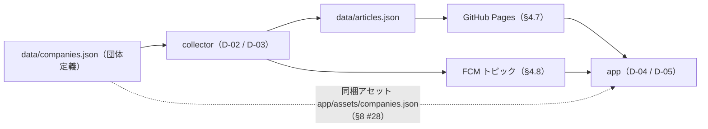
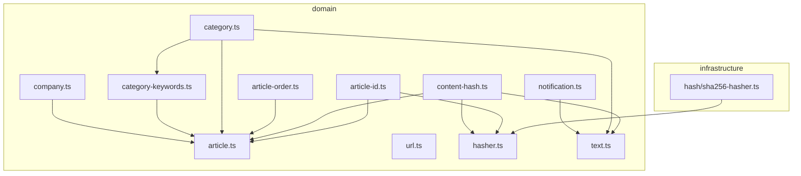

## 1. 目的と範囲

本書は、collector（収集バッチ）と app（Flutter）の**両方が従う契約**を 1 か所に定める。決めるのは次の 8 点：(1) `articles.json` の構造と zod スキーマ、(2) 団体定義 `companies.json` の構造と 5 団体の値、(3) 記事 `id` の算出規則（URL 正規化とハッシュ）、(4) `contentHash` の算出規則と更新判定、(5) `category` の値・優先順位・判定の段階、(6) 配信 URL とキャッシュ制御、(7) FCM 通知ペイロードとトピック名、(8) スキーマのバージョニング。決めないのは、collector の層構成・Source 実装・GitHub Actions・FCM 送信手順（[D-02](D-02.md)）、団体別のセレクタ・タグ対応表・キーワード表・東宝の団体固有 URL 規則（[D-03](D-03.md)）、app の drift スキーマ・Provider・UseCase（[D-04](D-04.md)・[D-05](D-05.md)）である。型の正は本書の TypeScript コード片であり、app は同じ名前・同じ意味のフィールドを Dart で持つ。本書は F-07（通知）・F-11（更新の再浮上）の**契約部分**（ペイロードの形、更新判定の規則）だけを扱い、機能そのものの実現は D-02・D-04・D-05 が持つため、frontmatter の `features` は空とする（機能 ID の所有者を 1 冊にするため）。

## 2. 要件との対応

| 要件 | 本書での扱い | 節 |
|---|---|---|
| §7.1 記事（Article） | 要件のフィールド名・型をそのまま zod スキーマにし、ファイル全体は `schemaVersion`・`generatedAt`・`articles` のラッパで包む。省略可能フィールドは「キー省略」で表す | §4.1 / §4.2 |
| §7.2 端末内で管理する状態 | `articles` テーブルが保持するフィールドは §4.1 と同じ名前・意味。app 側の更新検知は `updatedAt` の値の変化で行う（`contentHash` は collector の内部機構） | §4.1 / §5.2 |
| §3.1 対象団体（定義は設定ファイルで外出し） | `data/companies.json` に 5 団体の id・正式名・短縮名・情報源 URL・FCM トピックを持つ。配列の順序が表示順。団体追加はこのファイルの追記と Source 実装の追加だけ（CLAUDE.md 開放閉鎖） | §4.3 |
| §5 データ保持（団体ごとに最新 100 件） | `articles.json` は団体ごとに並び替えキー（§4.5）の上位 100 件だけを含む。app の上限（S-01 §7.5）と同じキーで切り詰める | §4.2 / §5.2 |
| §6.1 全体像（articles.json を GitHub Pages で配信） | 配信 URL は `https://sss-kato.github.io/curtaincall/articles.json`。キャッシュは Pages 既定（`max-age=600`）と ETag に従い、app はキャッシュバスティングをしない | §4.7 |
| §6.3 通知の仕組み（トピック購読・`companyId` を含める・記事 URL を含めない） | トピック名は `companies.json` の `fcmTopic`（既定は `id` と同じ）。`data.companyId` を必ず含め、記事 URL・記事 ID は含めない | §4.8 |
| F-07 プッシュ通知（契約部分。送信手順は D-02、受信は D-04） | 通知は「新着」記事のみ。1 回の実行につき団体ごとに 1 通にまとめる。文面は `title` = 正式名（複数は「（新着 n 件）」付き）、`body` = 見出し（複数は「ほか n-1 件」付き）。前回スナップショットが無い実行では送らない。送信は当該実行の `articles.json` が確定（main へ push 成功）した後に限る | §4.8 / §8 #13〜#15・#29・#30・#33 |
| F-11 更新記事の再浮上（契約部分。差分検知は D-02、表示は D-05） | `contentHash`（比較用に折りたたんだ `title` のハッシュ）の不一致で `updatedAt` を実行時刻に更新する。一致すれば前回の `updatedAt` を引き継ぐ | §5.2 |
| R-5 カテゴリの自動判定精度 | 判定を「サイト側タグ → 見出しキーワード → `other`」の 2 段に固定し、複数候補は優先順位表で 1 つに決める。タグ対応表・キーワード表の具体値は D-03 に置き、実データを見て表だけを調整できるようにする。全団体共通のキーワード表は `sources/` の外に置く | §4.4 / §5.3 / §8.1 |
| R-8 東宝のドメイン分散 | URL 正規化を「汎用（本書）」と「団体固有（D-03）」の 2 段に分け、`id` は団体固有 → 汎用の順で正規化した URL から算出する。`Article.url` にも正規化後の URL を格納する | §5.1 |
| R-9 新感線の公式ドメインのフィードが空 | `companies.json` の新感線の `sources[].url` を `https://blog.vi-shinkansen.co.jp/?feed=rss2` に固定し、公式ドメイン `www.vi-shinkansen.co.jp` のフィードは書かない。Source 実装は `sources[]` の URL だけを使う（§8 #20）ため、参照先の誤りは設定ファイルの 1 行で防げる | §4.3 |
| S-00 §7.1 団体の表示名 | 短縮名 `shortName`（宝塚／四季／ホリプロ／東宝／新感線）と正式名 `name` を `companies.json` に持つ | §4.3 |
| S-00 §7.2 カテゴリの表示対応 | `category` の 7 値は S-00 の表と同じ文字列。未知の値は app 側で `other` 扱い（S-00 の規則）、collector 側は出力不可（zod enum） | §4.4 |
| S-00 §7.3 日時の書式 | `publishedAt` は必ずオフセット付き ISO8601（`+09:00`）で、日付のみのサイトは `T00:00:00+09:00` とする。app は端末タイムゾーンへ変換して日付だけを表示する | §4.1 / §8 #3 |
| S-01 §7.1 並び順 / §7.5 上限 / §8 #18 タブ順 | 並び替えキー `updatedAt ?? publishedAt` → `fetchedAt` 降順 → `id` 昇順を本書で `compareArticles` として定義し、collector の切り詰めと app の表示で共用する。タブ順は `companies.json` の配列順 | §4.5 / §4.3 |
| S-01 §7.4 取得結果の反映 / §8 #20 通知タップ | 新着 = app に無い `id`、更新 = `updatedAt` の値が変わった記事。通知の `data.companyId` でタブを選ぶ | §5.2 / §4.8 |
| S-02 §7.3 100 件から外れた保存記事 | 100 件から外れた記事は `articles.json` に含まれないため更新検知の対象外になる（S-02 の前提を本書の切り詰め規則が保証する） | §4.2 / §6 |
| S-03 §7.1 通知トグルの団体 | トグルの並び・ラベルは `companies.json` の配列順と `shortName`。購読するトピックは `fcmTopic` | §4.3 / §4.8 |

### 2.1 画面定義との対応（scope: app のみ）

該当なし。本書は scope: shared であり、画面定義書の A-nn / ST-nn への対応は D-04・D-05 が持つ。

## 3. 構成

### 3.1 契約の流れ



| 契約 | 書き手（生成・検証） | 読み手（許容範囲） |
|---|---|---|
| `articles.json` | collector。書き出し前に `buildArticlesFileWriteSchema(knownCompanyIds)`（strict + `companies.json` の `id` 集合との突合。§4.2）で検証し、失敗したら書き出さない。前回ファイルの読み込みは `ArticlesFileSchema`（突合なし） | app。未知のフィールドは無視。`schemaVersion` が対応外なら取得失敗として扱い、端末内の記事を消さない |
| `companies.json` | 開発者が手で編集。collector は起動時に `CompaniesFileSchema`（strict）で検証し、失敗したら収集を始めない | app。`data/companies.json` と同じ内容を `app/assets/companies.json` として同梱し、ビルド時に取り込む（§8 #28）。未知のフィールドは無視。記事側に定義に無い `companyId` があっても記事を隠さない（S-00 §7.1） |
| `id` / `contentHash` / `category` | collector が §5 の規則で算出 | app は不透明な文字列として保持。再計算しない |
| 通知ペイロード | collector が §4.8 の形で送信 | app は `data.companyId` だけを読む。無ければ「すべて」（S-01 §8 #15） |

### 3.2 collector 側のファイル配置（本書が所有する部分）

依存の方向は infrastructure → domain のみ。domain は Node の組み込みモジュールを import しない（CLAUDE.md）。ハッシュ計算は `node:crypto` を使うため、domain には `Hasher` インターフェースだけを置き、実装は infrastructure に置く。ファイルは関心事ごとに分け、変更理由が異なるもの（ID 算出 = URL 規則、ハッシュ = 更新検知、並び替え = S-01 の表示順、通知文面 = F-07）を同居させない（CLAUDE.md 単一責任）。

```
collector/
  src/
    domain/
      article.ts            Article 型・Category 値・HASH_LENGTH・ArticleSchema・ArticlesFileSchema・buildArticlesFileWriteSchema（§4.1・§4.2・§4.4）
      company.ts            Company 型・CompanySchema・CompaniesFileSchema（§4.3）
      category.ts           CATEGORY_PRIORITY・resolveCategory・CategoryTagMap 型・matchCategoryTags・matchCategoryKeywords（§4.4・§5.3）
      category-keywords.ts  CategoryKeywordTable 型・COMMON_CATEGORY_KEYWORDS（全団体共通キーワード表。§4.4・§5.3。具体値は D-03。sources/ の外に置き Source 間 import を避ける。§8.1）
      url.ts                normalizeUrl（汎用正規化。§5.1）・TRACKING_PARAMS・InvalidArticleUrlError
      hasher.ts             Hasher インターフェース
      text.ts               normalizeTitle（格納用）・foldText（比較用）・truncateUtf16（§5.2・§4.8）
      article-id.ts         buildArticleId（§5.1）
      content-hash.ts       buildContentHash（§5.2）
      article-order.ts      compareArticles（§4.5）
      notification.ts       NewArticlesNotification 型・buildNotificationText（§4.8）
    infrastructure/
      hash/
        sha256-hasher.ts    Hasher 実装（node:crypto）
  test/
    domain/
      contract.test.ts      §7.1 の契約テスト（スキーマとフィクスチャの整合性のみ）
    fixtures/
      contract/
        articles.sample.json     §4.2 のサンプル（app のテストにもコピーして使う）
data/
  companies.json            団体定義の正本（§4.3。契約テストはこのファイルを直接読む）
  articles.json             collector の出力（初期状態は articles: []）
app/
  assets/
    companies.json          data/companies.json の同一コピー（app 同梱。§8 #28。pubspec への登録は D-04）
```



### 3.3 app 側で本書が要求すること（配置は D-04 が決める）

- `Article` と同じ名前のフィールドを持つ Dart のエンティティ（`thumbnail`・`updatedAt` は nullable）
- `data/companies.json` と同じ内容の同梱アセット `app/assets/companies.json` の読み込み（`pubspec.yaml` の `assets` に登録。実行時に配信 URL から取得しない。§8 #28）。団体追加時は開発者がこのファイルを `data/companies.json` と同じ内容に更新して再ビルドする
- 配信ベース URL `https://sss-kato.github.io/curtaincall/`（§4.7）を保持する定数
- `compareArticles`（§4.5）と同じ並び替え
- 通知の `data.companyId` の読み取り

## 4. データ

### 4.1 Article（要件 §7.1）

```ts
// collector/src/domain/article.ts
import { z } from "zod";

export const CATEGORIES = [
  "new_work", "ticket", "streaming", "schedule", "cast", "person", "other",
] as const;
export const CategorySchema = z.enum(CATEGORIES);
export type Category = z.infer<typeof CategorySchema>;

/** 秒精度・オフセット +09:00 固定の ISO8601（§8 #3）。例: 2026-09-13T00:00:00+09:00 */
export const DateTimeSchema = z
  .string()
  .regex(/^\d{4}-\d{2}-\d{2}T\d{2}:\d{2}:\d{2}\+09:00$/);

/** SHA-256 の 16 進小文字・先頭 16 文字（§8 #25） */
export const HASH_LENGTH = 16;
export const HashSchema = z.string().regex(/^[0-9a-f]{16}$/);

/**
 * 英小文字始まり、英小文字・数字・アンダースコア、2〜32 文字。
 * 文字種は FCM トピック名の文字種（§4.3）に収まる範囲に絞る（fcmTopic の既定値が id と同じ。§8 #19）。
 * 上限 32 は開発者の任意設定（要件に規定なし。ログ・ファイル名 sources/<id>.ts で読める長さ）
 */
export const CompanyIdSchema = z.string().regex(/^[a-z][a-z0-9_]{1,31}$/);

/** 絶対 URL・http(s)。上限 2048 は一般的なブラウザ・サーバの URL 長の慣例値（開発者の任意設定。要件に規定なし） */
export const HttpUrlSchema = z.string().url().regex(/^https?:\/\//).max(2048);

export const ArticleSchema = z
  .object({
    id: HashSchema,                          // 正規化した URL のハッシュ（§5.1）
    companyId: CompanyIdSchema,              // companies.json の id
    title: z.string().min(1).max(300),       // 正規化後の見出し（§5.2 手順 1）。300 は S-00 §7.7 の 3 行表示に十分な長さ（§8 #24）
    url: HttpUrlSchema,                      // 正規化後の記事 URL（§5.1）。app はこれを開く
    category: CategorySchema,                // §5.3
    publishedAt: DateTimeSchema,             // サイト側の掲載日。日付のみのサイトは T00:00:00+09:00
    fetchedAt: DateTimeSchema,               // その記事を初めて観測した実行の generatedAt（§8 #4）
    thumbnail: HttpUrlSchema.optional(),     // 取得できた場合のみ。キー省略（null は書かない）
    contentHash: HashSchema,                 // §5.2
    updatedAt: DateTimeSchema.optional(),    // 更新を検知した実行の generatedAt。キー省略
  })
  .strict()
  .readonly();                               // 型は Readonly<{...}>。parse 結果は Object.freeze される（zod 3.22 以上）
export type Article = z.infer<typeof ArticleSchema>;
```

`Article` は不変値として扱う。`fetchedAt`・`updatedAt` の確定（§5.2）は新しいオブジェクトを作って返し、入力を書き換えない。

| 規則 | 内容 |
|---|---|
| 省略可能フィールド | `thumbnail`・`updatedAt` は値が無いとき**キーを書かない**。`null` は書かない。読み手（app）はキー無しと `null` を同じ「無し」として扱う |
| 日時 | すべて `YYYY-MM-DDTHH:mm:ss+09:00`（Asia/Tokyo、秒精度、ミリ秒無し）。RSS の `pubDate`（RFC822、任意のオフセット）は同じ瞬間を +09:00 に変換する。日付のみのサイトは `T00:00:00+09:00`。読み手は任意のオフセットの ISO8601 を解釈できること（将来の変更に備える） |
| `title` | §5.2 手順 1 で正規化した文字列。空なら記事を破棄（§6） |
| `url` | 絶対 URL、`http` または `https`、2048 文字以内。正規化後（§5.1）の文字列 |
| `thumbnail` | 絶対 URL、`http` または `https`、2048 文字以内。条件を満たさないときはフィールドを省略し、記事は残す。app は URL を参照するだけで端末にコピーしない（CLAUDE.md、調査レポート §6.2） |
| 本文 | **持たない**（要件 §7）。本文・抜粋・説明文に相当するフィールドを追加してはならない |

Dart 側は同じフィールド名を使う。`publishedAt`・`fetchedAt`・`updatedAt` は `DateTime.parse` でオフセット付きとして解釈し、表示時に端末タイムゾーンへ変換する（S-00 §7.3）。

### 4.2 articles.json（ファイル全体）

```ts
// collector/src/domain/article.ts（続き）
export const ARTICLES_SCHEMA_VERSION = 1 as const;
export const MAX_ARTICLES_PER_COMPANY = 100; // 要件 §5

/** 読み込み用（前回ファイル・app のフィクスチャ）。companyId の突合はしない */
export const ArticlesFileSchema = z
  .object({
    schemaVersion: z.literal(ARTICLES_SCHEMA_VERSION),   // §4.6（§8 #27）
    generatedAt: DateTimeSchema,                          // この実行の基準時刻（1 実行 1 値）
    articles: z.array(ArticleSchema).readonly(),
  })
  .strict()
  .superRefine((file, ctx) => {
    const ids = new Set<string>();
    const perCompany = new Map<string, number>();
    for (const a of file.articles) {
      if (ids.has(a.id)) ctx.addIssue({ code: "custom", message: `duplicate id: ${a.id}` });
      ids.add(a.id);
      perCompany.set(a.companyId, (perCompany.get(a.companyId) ?? 0) + 1);
    }
    for (const [companyId, n] of perCompany) {
      if (n > MAX_ARTICLES_PER_COMPANY) {
        ctx.addIssue({ code: "custom", message: `${companyId}: ${n} > ${MAX_ARTICLES_PER_COMPANY}` });
      }
    }
  })
  .readonly();
export type ArticlesFile = z.infer<typeof ArticlesFileSchema>;

/** 書き出し用。companies.json に無い companyId を含むファイルを拒否する（未知 ID のみ。既知 ID の取り違えは collect-articles の突合で検出する。§8 #32） */
export function buildArticlesFileWriteSchema(knownCompanyIds: ReadonlySet<string>) {
  return ArticlesFileSchema.superRefine((file, ctx) => {
    for (const a of file.articles) {
      if (!knownCompanyIds.has(a.companyId)) {
        ctx.addIssue({ code: "custom", message: `unknown companyId: ${a.companyId} (${a.id})` });
      }
    }
  });
}
```

| 規則 | 内容 |
|---|---|
| 件数 | 団体ごとに最大 100 件（要件 §5）。合計は 100 × 団体数（5 団体で 500） |
| 含める記事 | 団体ごとに「前回の `articles.json` に含まれていた記事 ∪ 今回収集した記事」を `compareArticles`（§4.5）で並べ、上位 100 件。サイトの一覧から消えた記事も、上限で押し出されるまで残す |
| `companyId` の突合 | 書き出す記事の `companyId` はすべて `companies.json` の `id` 集合に含まれ、かつその記事を出力した Source に対応する団体の `id` と一致していなければならない。application（D-02）の `collect-articles` は Source を `companies.json` の団体ごと（`Company` を特定した上で）に呼び出し、戻り値の各記事の `companyId` を**呼び出し時の `Company.id`** と突合する。不一致（集合に無い未知の ID、または集合にはあるが呼び出し時の団体と違う ID）の記事は捨てて警告ログ（`expected` / `actual` の両 ID を含める）を出し、1 Source の全記事が該当したらその Source を失敗として扱う（Source 実装のタイポと、既存 Source のコピーによる新規追加や DI 配線での取り違えの検知。§6）。集合メンバーシップだけの検証では取り違えを検出できない（`toho.ts` が `companyId: "shiki"` を返しても `"shiki"` は実在する）ため、比較対象は集合ではなく呼び出し時の `Company.id` とする。前回ファイルに含まれる記事で `companyId` が集合に無いもの（`companies.json` から団体を削除した場合）は引き継がずに捨てる（情報ログ）。書き出し直前の `buildArticlesFileWriteSchema` は未知 ID に対する最終防衛線で、ここで失敗したら書き出さない。取り違えは書き出し前のスキーマでは検出できず、`collect-articles` の突合が唯一の防衛線である（§8 #32） |
| 並び | `companies.json` の配列順に団体をまとめ、団体内は `compareArticles` の順。出力を決定的にして git の差分を最小にする |
| 書式 | UTF-8（BOM 無し）、2 スペースインデント、キーは §4.1 の宣言順、末尾に改行 1 つ |
| `generatedAt` | 実行開始時刻。同じ実行で新着になった記事の `fetchedAt`、更新になった記事の `updatedAt` はこの値と一致する |
| 空 | `articles: []` は妥当（初期状態・全 Source 失敗時の前回引き継ぎは D-02） |

サンプル（`test/fixtures/contract/articles.sample.json` と同じ内容。ハッシュ値は例示で、実値は §5 の規則で算出する）：

```json
{
  "schemaVersion": 1,
  "generatedAt": "2026-09-13T15:00:12+09:00",
  "articles": [
    {
      "id": "3f9a1c2b7d5e8a10",
      "companyId": "takarazuka",
      "title": "宝塚友の会『ステージトーク in 東京』宙組 無料配信の実施について",
      "url": "https://kageki.hankyu.co.jp/news/20260913_002.html",
      "category": "streaming",
      "publishedAt": "2026-09-13T00:00:00+09:00",
      "fetchedAt": "2026-09-13T10:00:05+09:00",
      "contentHash": "a41d0c9e2b7f6d31"
    },
    {
      "id": "8c2e5f7a1b3d9e04",
      "companyId": "horipro",
      "title": "【重要】舞台『ハリー・ポッターと呪いの子』公演中止のお詫びと払い戻し対応実施のお知らせ",
      "url": "https://horipro-stage.jp/hpcc_refund/",
      "category": "other",
      "publishedAt": "2026-09-08T18:04:51+09:00",
      "fetchedAt": "2026-09-08T19:00:03+09:00",
      "thumbnail": "https://horipro-stage.jp/wp/wp-content/uploads/2026/09/hpcc.jpg",
      "contentHash": "5d7b9e1f3a2c4e68",
      "updatedAt": "2026-09-10T12:00:07+09:00"
    },
    {
      "id": "b7d3e9f1a5c2d804",
      "companyId": "shinkansen",
      "title": "／爆烈忠臣蔵／ゲキ×シネ2027年1月8日(金)全国公開決定！！",
      "url": "https://blog.vi-shinkansen.co.jp/?p=13727",
      "category": "streaming",
      "publishedAt": "2026-09-11T12:00:00+09:00",
      "fetchedAt": "2026-09-11T13:00:04+09:00",
      "contentHash": "2e6c8a0d4f1b3957"
    }
  ]
}
```

### 4.3 companies.json（団体定義）

```ts
// collector/src/domain/company.ts
import { z } from "zod";
import { CompanyIdSchema, HttpUrlSchema } from "./article";

export const SourceKindSchema = z.enum(["rss", "html"]);

export const CompanySchema = z
  .object({
    id: CompanyIdSchema,                       // Article.companyId の値
    name: z.string().min(1).max(30),           // 正式名（要件 §3.1）。通知の title に使う（§4.8）。30 は任意設定（5 団体の最長「ホリプロステージ」8 文字に余裕を持たせた値）
    shortName: z.string().min(1).max(10),      // 短縮名（S-00 §7.1）。タブ・記事セル・通知トグルのラベル。10 は任意設定（タブ幅に収まる長さ）
    fcmTopic: z.string().regex(/^[a-zA-Z0-9\-_.~%]+$/).max(64), // FCM トピック名。文字種は FCM の規定（§8 #19）。上限 64 は開発者の任意設定（FCM の公開仕様は文字種のみ規定）。既定は id と同じ
    sources: z                                 // 取得元（調査レポート §1〜5）。Source 実装はこの URL を使う
      .array(z.object({ kind: SourceKindSchema, url: HttpUrlSchema }).strict().readonly())
      .min(1)
      .readonly(),
  })
  .strict()
  .readonly();
export type Company = z.infer<typeof CompanySchema>;

export const COMPANIES_SCHEMA_VERSION = 1 as const;
export const CompaniesFileSchema = z
  .object({
    schemaVersion: z.literal(COMPANIES_SCHEMA_VERSION),
    companies: z.array(CompanySchema).min(1).readonly(),  // 配列順 = 表示順（S-01 §8 #18）
  })
  .strict()
  .superRefine((file, ctx) => {
    const ids = new Set(file.companies.map((c) => c.id));
    const topics = new Set(file.companies.map((c) => c.fcmTopic));
    if (ids.size !== file.companies.length) ctx.addIssue({ code: "custom", message: "duplicate id" });
    if (topics.size !== file.companies.length) ctx.addIssue({ code: "custom", message: "duplicate fcmTopic" });
  })
  .readonly();
export type CompaniesFile = z.infer<typeof CompaniesFileSchema>;
```

`data/companies.json` の内容（正本。要件 §3.1・§3.2、調査レポート §1〜5、S-00 §7.1、S-01 §8 #18）：

```json
{
  "schemaVersion": 1,
  "companies": [
    {
      "id": "takarazuka",
      "name": "宝塚歌劇団",
      "shortName": "宝塚",
      "fcmTopic": "takarazuka",
      "sources": [{ "kind": "html", "url": "https://kageki.hankyu.co.jp/news/" }]
    },
    {
      "id": "shiki",
      "name": "劇団四季",
      "shortName": "四季",
      "fcmTopic": "shiki",
      "sources": [{ "kind": "html", "url": "https://www.shiki.jp/navi/news/" }]
    },
    {
      "id": "horipro",
      "name": "ホリプロステージ",
      "shortName": "ホリプロ",
      "fcmTopic": "horipro",
      "sources": [{ "kind": "rss", "url": "https://horipro-stage.jp/feed/" }]
    },
    {
      "id": "toho",
      "name": "東宝（演劇）",
      "shortName": "東宝",
      "fcmTopic": "toho",
      "sources": [
        { "kind": "html", "url": "https://www.toho.co.jp/stage/topics/" },
        { "kind": "html", "url": "https://www.toho.co.jp/stage/news/" }
      ]
    },
    {
      "id": "shinkansen",
      "name": "劇団☆新感線",
      "shortName": "新感線",
      "fcmTopic": "shinkansen",
      "sources": [{ "kind": "rss", "url": "https://blog.vi-shinkansen.co.jp/?feed=rss2" }]
    }
  ]
}
```

| 規則 | 内容 |
|---|---|
| 表示順 | 配列の順序。`order` フィールドは持たない。追加団体は末尾に置く（S-01 §8 #18、S-03 §7.1） |
| 新感線 | `sources[].url` は `blog.vi-shinkansen.co.jp`。公式ドメイン `www.vi-shinkansen.co.jp` のフィードは空なので書かない（要件 R-9、調査レポート §2） |
| 東宝 | `/stage/topics/` を主、`/stage/news/` を補助として 2 つ持つ（調査レポート §5）。取得順・ページ送りは D-03 |
| 四季 | 初回のみ 3〜5 ページ遡る規則（調査レポート §4）は D-03。`sources` には 1 ページ目の URL だけを書く |
| 団体の追加 | この配列への追記 + `collector/src/infrastructure/sources/<id>.ts` の追加 + `main.ts` の DI 1 行。app 側は `app/assets/companies.json` を同じ内容に更新して再ビルドする（§8 #28）。更新前の app でも `companyId` を知らない記事を隠さず「すべて」に表示する（S-00 §7.1） |
| 同梱コピーの同期 | `data/companies.json` と `app/assets/companies.json` は常にバイト単位で同一。collector の契約テスト（§7.1）が両ファイルの一致を検証し、片方だけ直した変更を CI で止める。この検証が働くには、**`app/assets/companies.json` だけを変更した PR でも collector のテストが実行される**必要がある。CI（D-02）は collector テストのトリガーのパスフィルタに `collector/**` に加えて `data/companies.json` と `app/assets/companies.json` を含める（§8.1） |
| Source と `sources[]` | Source 実装は取得先 URL をコードに埋め込まず、渡された `Company.sources` を使う（URL 変更を設定変更で済ませる）。Source のコンストラクタ形は D-02 |

### 4.4 category の値（要件 §7.1・§3.3、S-00 §7.2）

| `category` | 要件 §3.3 | 判定の根拠になる情報 | 備考 |
|---|---|---|---|
| `new_work` | ★1 新作発表 | サイト側タグ／見出しキーワード | 優先順位 1 |
| `ticket` | ★2 チケット情報 | 同上 | 優先順位 2。先行・一般・抽選・当落を含む |
| `streaming` | ★3 配信・映像化 | 同上 | 優先順位 3。DVD・Blu-ray・配信・ゲキ×シネ |
| `schedule` | 公演スケジュール | 同上 | 優先順位 4 |
| `cast` | キャスト情報 | 同上 | 優先順位 5 |
| `person` | 出演者ニュース | 同上 | 優先順位 6 |
| `other` | （当日券・立ち見、残席状況、上記以外のすべて） | フォールバック | 当日券・残席は要件 R-4 のとおり取得困難なため専用値を持たず `other`（S-00 §7.2 の申し送り）。公演中止・グッズ等スコープ外の記事も除外せず `other` で収集する（§8 #12） |

```ts
// collector/src/domain/category.ts
import { CATEGORIES, type Category } from "./article";

/** 複数候補があるときに採用する順。要件 §3.3 の優先度（★1〜★3）→ 記載順 */
export const CATEGORY_PRIORITY: readonly Category[] = CATEGORIES; // 宣言順がそのまま優先順位

export function resolveCategory(candidates: readonly Category[]): Category {
  for (const c of CATEGORY_PRIORITY) {
    if (candidates.includes(c)) return c;
  }
  return "other";
}
```

判定の段階（§5.3）は「サイト側タグ → 見出しキーワード → `other`」に固定する。各段階の照合関数と表の型は次のとおり。タグ対応表（団体別）とキーワード表（全団体共通 + 団体別追加）の**具体値**は D-03 が持つ。app は対応表に無い値を `other` として表示する（S-00 §7.2）。

```ts
// collector/src/domain/category-keywords.ts
import type { Category } from "./article";

/**
 * カテゴリごとの見出しキーワード。照合時に各キーワードへ foldText を通すため、表の表記は全角・大文字のままでよい。
 * other は常に空配列（フォールバック値のため）。空文字のキーワードは無視される（matchCategoryKeywords）
 */
export type CategoryKeywordTable = Readonly<Record<Category, readonly string[]>>;

/** 全団体共通のキーワード表。値は D-03 が定める（§10 Task B では全カテゴリ空配列で作り、D-03 のタスクで埋める） */
export const COMMON_CATEGORY_KEYWORDS: CategoryKeywordTable = {
  new_work: [], ticket: [], streaming: [], schedule: [], cast: [], person: [], other: [],
};
```

```ts
// collector/src/domain/category.ts（続き）
import type { CategoryKeywordTable } from "./category-keywords";
import { foldText } from "./text";

/** サイト側タグの対応表。キーはサイトが付けるタグ文字列（完全一致。foldText は適用しない）、値は Category。団体別に D-03 が定め、各 Source が保持する */
export type CategoryTagMap = ReadonlyMap<string, Category>;

/** タグ段階（§5.3 手順 1）。tagMap に無いタグ（作品名・組名など）は無視する。戻り値は siteTags の順で、重複を含みうる */
export function matchCategoryTags(siteTags: readonly string[], tagMap: CategoryTagMap): readonly Category[] {
  return siteTags.flatMap((tag) => {
    const c = tagMap.get(tag);
    return c === undefined ? [] : [c];
  });
}

/**
 * キーワード段階（§5.3 手順 2）。
 * @param foldedTitle foldText 済みの title（§5.2 手順 2）
 * @param table 各キーワードに foldText を通し、foldedTitle への部分一致（String.prototype.includes）で照合する。空文字のキーワードは無視
 * @returns 1 つ以上のキーワードが一致した Category（CATEGORIES の宣言順、重複なし）
 */
export function matchCategoryKeywords(foldedTitle: string, table: CategoryKeywordTable): readonly Category[] {
  return CATEGORIES.filter((c) =>
    table[c].some((keyword) => keyword.length > 0 && foldedTitle.includes(foldText(keyword))),
  );
}
```

### 4.5 並び替えキー（S-01 §7.1 と同一）

```ts
// collector/src/domain/article-order.ts
import type { Article } from "./article";

/** S-01 §7.1 の並び順。降順にしたい項目は引数を入れ替えて比較する */
export function compareArticles(a: Article, b: Article): number {
  const ka = a.updatedAt ?? a.publishedAt;
  const kb = b.updatedAt ?? b.publishedAt;
  if (ka !== kb) return ka < kb ? 1 : -1;                   // 第 1 キー: 並び順の日時 降順
  if (a.fetchedAt !== b.fetchedAt) return a.fetchedAt < b.fetchedAt ? 1 : -1; // 第 2 キー: fetchedAt 降順
  return a.id < b.id ? -1 : a.id > b.id ? 1 : 0;            // 第 3 キー: id 昇順
}
```

日時はすべて同じ書式（`+09:00`、秒精度、ゼロ埋め）なので文字列比較で時系列順になる。collector の「団体ごと 100 件」の切り詰めと、app のホーム一覧（S-01 §7.1・§7.5）は同じ比較関数を使う（Dart 側は同じ規則を移植する）。

### 4.6 バージョニング

| 規則 | 内容 |
|---|---|
| `schemaVersion` | `articles.json`・`companies.json` の両方が整数で持つ（§8 #27）。現在は `1` |
| 上げない変更 | 省略可能フィールドの追加、`category` の値の追加（app は未知の値を `other` として表示するため） |
| 上げる変更 | フィールドの削除・改名・型変更・意味の変更、`id` または `contentHash` の算出規則の変更、日時書式の変更 |
| 読み手の義務 | 未知のフィールドを無視する。`schemaVersion` が対応する値でなければファイル全体を「取得失敗」として扱い（S-00/ST-14・ST-15 相当）、端末内の記事・既読・保存を消さない |
| 書き手の義務 | `.strict()` で未知フィールドを含めない。`schemaVersion` を上げるときは app の対応リリースを先に出す（旧 app が新 JSON を取得失敗として扱う期間を作らない） |
| `id` の規則変更 | 全記事が「新着」に見え、app では重複、通知は全件に出る。変更するときは D-02 の通知抑止（§8 #15 と同じ「前回スナップショット無し」扱い）を併用する |

### 4.7 配信 URL とキャッシュ

| 項目 | 値 |
|---|---|
| リポジトリ | `https://github.com/sss-kato/curtaincall`（owner `sss-kato`、リポジトリ名 `curtaincall`。小文字。§8 #31） |
| ベース URL | `https://sss-kato.github.io/curtaincall/`（末尾スラッシュ付き。app の定数・D-02 の Pages 設定はこの値を使う） |
| 記事 | `https://sss-kato.github.io/curtaincall/articles.json` |
| 団体定義 | `https://sss-kato.github.io/curtaincall/companies.json`（`data/` を丸ごと公開するため配信されるが、app は取得しない。app は同梱アセットを使う。§8 #28） |
| User-Agent | collector が送る UA は `CurtainCall/1.0 (personal news reader; +https://github.com/sss-kato/curtaincall)`（CLAUDE.md の書式の `<user>/CurtainCall` を実値に置き換えたもの。実装は D-02 の `infrastructure/http`） |
| リポジトリ上の置き場所 | `data/articles.json`・`data/companies.json`。GitHub Pages は `data/` ディレクトリをサイトのルートとして公開する（公開手段は D-02。Actions からの Pages デプロイを推奨） |
| Content-Type | `application/json`（GitHub Pages の既定） |
| キャッシュ | GitHub Pages の既定（`Cache-Control: max-age=600`、`ETag`）に従う。app は `If-None-Match` に前回の `ETag` を送り、`304` なら何もしない。クエリでのキャッシュバスティングはしない（収集間隔 1 時間・遅延許容（R-7）に対し 10 分の CDN キャッシュは十分に短い） |
| サイズの目安 | 500 件 × 約 400 バイト ≒ 200 KB（gzip 後 約 50 KB） |
| 認証 | 無し（公開）。秘密情報は含めない |

### 4.8 通知ペイロード（要件 §6.3、S-01 §8 #20）

collector が `firebase-admin` で送る `Message`（D-02 が組み立てる。文面の構築は domain の純粋関数 `buildNotificationText`）：

```ts
// collector/src/domain/notification.ts
// 型は firebase-admin/messaging の Message に構造的に一致させる（firebase-admin は import しない）
import { truncateUtf16 } from "./text";

export interface NewArticlesNotification {
  topic: string;                       // Company.fcmTopic
  notification: {
    title: string;                     // 新着 1 件: Company.name、2 件以上: `${name}（新着 ${n} 件）`（§8 #29）
    body: string;                      // 新着 1 件: 見出し、2 件以上: `${見出し} ほか ${n-1} 件`。120 文字で切り「…」（§8 #29）
  };
  data: {
    schemaVersion: "1";                // ペイロードの版
    type: "new_articles";              // 種別。将来の拡張用
    companyId: string;                 // Article.companyId。app はこれでタブを選ぶ（S-01/ST-15）
    count: string;                     // 新着件数（FCM の data は文字列のみ）
  };
  apns: {
    headers: { "apns-priority": "10" };
    payload: { aps: { sound: "default"; "thread-id": string } }; // thread-id = companyId（通知センターで団体ごとにまとまる）
  };
}

// UTF-16 コード単位（§8 #29）。120 は iOS のロック画面・バナーで body が省略されずに読める目安として置いた開発者の任意設定。
// APNs 側の制約は総ペイロード 4 KB のみで、文字数の規定は無い
export const NOTIFICATION_BODY_MAX = 120;
const ELLIPSIS = "…";
/** 制御文字 U+0000〜U+001F と U+007F（改行・タブを含む） */
const CONTROL_CHARS = /[\x00-\x1f\x7f]/g;

export interface NotificationText {
  readonly title: string;
  readonly body: string;
}

/**
 * 通知の文面を組み立てる純粋関数。
 * @param companyName Company.name
 * @param headlines 新着記事の title を compareArticles（§4.5）で並べたもの。1 件以上。先頭が body に使われる
 */
export function buildNotificationText(companyName: string, headlines: readonly string[]): NotificationText {
  const first = headlines[0];
  if (first === undefined) throw new RangeError("headlines must not be empty");
  const n = headlines.length;
  const title = n === 1 ? companyName : `${companyName}（新着 ${n} 件）`;
  const suffix = n === 1 ? "" : ` ほか ${n - 1} 件`;
  const head = first.replace(CONTROL_CHARS, " ");                       // 制御文字（改行・タブを含む）→ 半角スペース
  const body =
    head.length + suffix.length <= NOTIFICATION_BODY_MAX
      ? head + suffix
      : truncateUtf16(head, NOTIFICATION_BODY_MAX - suffix.length - ELLIPSIS.length) + ELLIPSIS + suffix;
  return { title, body };
}
```

```ts
// collector/src/domain/text.ts（抜粋）
/** UTF-16 コード単位 max で切る。切れ目がサロゲートペアの途中（高サロゲートで終わる）なら 1 つ手前で切る */
export function truncateUtf16(s: string, max: number): string {
  if (s.length <= max) return s;
  let end = max;
  const last = s.charCodeAt(end - 1);
  if (last >= 0xd800 && last <= 0xdbff) end -= 1;
  return s.slice(0, end);
}
```

送信例：

```json
{
  "topic": "shinkansen",
  "notification": {
    "title": "劇団☆新感線（新着 2 件）",
    "body": "／爆烈忠臣蔵／ゲキ×シネ2027年1月8日(金)全国公開決定！！ ほか 1 件"
  },
  "data": { "schemaVersion": "1", "type": "new_articles", "companyId": "shinkansen", "count": "2" },
  "apns": {
    "headers": { "apns-priority": "10" },
    "payload": { "aps": { "sound": "default", "thread-id": "shinkansen" } }
  }
}
```

| 規則 | 内容 |
|---|---|
| 対象 | 1 回の実行で「新着」（§5.2 の判定）になった記事のみ。「更新」は通知しない（§8 #13） |
| まとめ方 | 団体ごとに 1 通／実行（§8 #30）。新着が複数団体にあれば `companies.json` の順に 1 通ずつ |
| 文面 | `n` = その団体の新着件数。`n = 1`：`title` = `Company.name`、`body` = その記事の `title`。`n ≥ 2`：`title` = `${Company.name}（新着 ${n} 件）`、`body` = `${見出し} ほか ${n-1} 件`（見出しは新着記事を `compareArticles`（§4.5）で並べた先頭の記事の `title`。区切りは半角スペース、数字は半角）。例：`劇団☆新感線（新着 2 件）`／`…全国公開決定！！ ほか 1 件`（§8 #29） |
| 含めないもの | 記事 URL（要件 §6.3）、記事 ID、本文。app は通知タップ後に一覧を取得して記事を表示する（S-01/ST-15） |
| 送らない条件 | 前回の `articles.json` が無い・読めない実行（全件が新着に見えるため。§8 #15）。新着 0 件の団体 |
| 送信の順序（不変条件） | 通知は、**当該実行の `articles.json` が確定した後にのみ**送る。「確定」とは `data/articles.json` を含むコミットが `main` へ push 成功した時点（次回実行が「前回」として読むのは実行開始時にチェックアウトした `main` の `data/articles.json`）。GitHub Pages への反映は待たない。書き込み・コミット・push のいずれかが失敗した実行では通知を送らない（§8 #33、§6） |
| トピック名 | `Company.fcmTopic`。app は通知トグル ON の団体の `fcmTopic` を購読し、OFF で解除する（D-04） |
| 文面の切り詰め | `buildNotificationText` が行う。`body` 全体（接尾辞「 ほか n-1 件」を含む）が 120 文字（UTF-16 コード単位）を超えたら、見出し部分を `truncateUtf16` で切り詰めて末尾に「…」を付け、全体を 120 文字以内にする（接尾辞は切らない。切れ目がサロゲートペアの途中なら 1 つ手前で切る）。制御文字（U+0000〜U+001F・U+007F。改行・タブを含む）は半角スペースに置換 |
| 到達性 | ベストエフォート（要件 §5）。送信失敗の再送はしない（at-most-once。D-02）。push 成功後に送信が失敗・中断した通知は失われ、次回実行で再送されない（前回ファイルに含まれるため新着にならない）。重複通知は起きない |

## 5. 処理フロー（正常系）

以下の 4 つは純粋関数として `collector/src/domain/` に置く（§3.2）。呼び出し箇所（Source の中か `collect-articles` / `detect-diff` の中か）は D-02 が決める。推奨は「団体固有の正規化と category 判定は Source、汎用正規化・`id`・`contentHash`・`fetchedAt`・`updatedAt` の確定・`thumbnail` の検証は application」。

### 5.1 ID 算出（`normalizeUrl` → `buildArticleId`）

- **入力**：Source が出力した記事 URL（絶対 URL。相対 URL の解決と、東宝のドメイン吸収などの団体固有の正規化（R-8）は D-03 の規則で Source が済ませている）
- **ステップ**：
  1. `new URL(input)` で解釈する。失敗（相対 URL・不正文字列）→ `InvalidArticleUrlError` を投げる（呼び出し側はその記事を破棄。§6）
  2. `protocol` が `http:` / `https:` 以外 → `InvalidArticleUrlError`
  3. `hash`（`#` 以降）を空にする
  4. `searchParams` から追跡パラメータを削除する。対象は名前が `utm_` で始まるもの、および `fbclid`・`gclid`・`yclid`・`msclkid`・`mc_cid`・`mc_eid`・`_ga`。**それ以外のクエリは順序も含めて保持する**（並べ替えない。新感線の `?p=13727` が記事の識別子。調査レポート §2、§8 #10）
  5. `url.toString()` を正規化後の URL とする（WHATWG URL がホストの小文字化・既定ポート除去・パーセントエンコードの統一・空パスへの `/` 付与を行う。パスの末尾スラッシュは変更しない）
  6. 長さが 2048 文字を超える → `InvalidArticleUrlError`
  7. `id = hasher.sha256Hex(utf8(normalized)).slice(0, 16)`（SHA-256・16 進小文字・先頭 16 文字。§8 #25）
- **出力**：`{ url: normalized, id }`。`Article.url` には `normalized` を格納する（同じ記事が複数の表記で現れても 1 件になる。R-8）
- **失敗時**：例外。1 記事の失敗は他の記事・他の Source に波及させない（D-02）

```ts
// collector/src/domain/url.ts
export const TRACKING_PARAMS = ["fbclid", "gclid", "yclid", "msclkid", "mc_cid", "mc_eid", "_ga"] as const;

export class InvalidArticleUrlError extends Error {}

export function normalizeUrl(input: string): string {
  let u: URL;
  try { u = new URL(input); } catch { throw new InvalidArticleUrlError(`not absolute: ${input}`); }
  if (u.protocol !== "http:" && u.protocol !== "https:") throw new InvalidArticleUrlError(`scheme: ${input}`);
  u.hash = "";
  for (const key of [...u.searchParams.keys()]) {
    if (key.startsWith("utm_") || (TRACKING_PARAMS as readonly string[]).includes(key)) u.searchParams.delete(key);
  }
  const out = u.toString();
  if (out.length > 2048) throw new InvalidArticleUrlError(`too long: ${out.length}`);
  return out;
}
```

```ts
// collector/src/domain/hasher.ts
export interface Hasher {
  /** UTF-8 でエンコードした入力の SHA-256 を 16 進小文字 64 文字で返す */
  sha256Hex(input: string): string;
}

// collector/src/domain/article-id.ts
import { HASH_LENGTH } from "./article";
import type { Hasher } from "./hasher";

export function buildArticleId(hasher: Hasher, normalizedUrl: string): string {
  return hasher.sha256Hex(normalizedUrl).slice(0, HASH_LENGTH);
}
```

正規化の例：

| 入力 | 出力 | 備考 |
|---|---|---|
| `https://Kageki.Hankyu.co.jp/news/20260913_002.html#top` | `https://kageki.hankyu.co.jp/news/20260913_002.html` | ホスト小文字化・フラグメント除去 |
| `https://horipro-stage.jp/hpcc_refund/?utm_source=rss&utm_medium=rss` | `https://horipro-stage.jp/hpcc_refund/` | 追跡パラメータ除去 |
| `https://blog.vi-shinkansen.co.jp/?p=13727` | `https://blog.vi-shinkansen.co.jp/?p=13727` | 通常のクエリは保持 |
| `https://www.shiki.jp:443/navi/news/renewinfo/037984.html` | `https://www.shiki.jp/navi/news/renewinfo/037984.html` | 既定ポート除去 |
| `/stage/topics/2026/09/foo.html` | 例外 | 相対 URL は Source が解決してから渡す |

### 5.2 contentHash 算出と更新判定（`normalizeTitle` → `foldText` → `buildContentHash` → 突合）

- **入力**：Source が抽出した見出し（生文字列）と、前回の `articles.json` にある同じ `id` の記事（無いこともある）、この実行の `generatedAt`
- **ステップ**：
  1. 見出しを**格納用**に正規化して `Article.title` にする（`normalizeTitle`）：Unicode NFC 正規化 → 連続する空白（JS の `\s`。改行・タブ・全角スペース U+3000 を含む）を半角スペース 1 つに置換 → 前後の空白を除去 → 300 文字（UTF-16 コード単位。zod の `.max(300)` と同じ数え方）を超える分を `truncateUtf16` で切り捨てる。結果が空なら記事を破棄（§6）。NFKC は適用しない（全角英数・記号をサイトの表記どおりに表示するため。§8 #24）
  2. 手順 1 の `title` を**比較用**に折りたたむ（`foldText`）：Unicode NFKC 正規化 → `toLowerCase()`。全角半角・互換文字・大文字小文字の違いを吸収する。同じ関数を §5.3 のキーワード照合にも使う（比較の方針を 1 つにする。§8 #24）
  3. `contentHash = hasher.sha256Hex(foldText(title)).slice(0, 16)`（`buildContentHash`。対象は `title` のみ。`thumbnail`・`publishedAt` は対象に含めない。§8 #26）
  4. 前回の記事と `id` で突合し、次のとおり確定する（`Article` は不変なので新しいオブジェクトを作る。§4.1）：

| 前回 | 今回 | 判定 | `fetchedAt` | `updatedAt` | `contentHash` | `title`・`thumbnail`・`publishedAt`・`category` |
|---|---|---|---|---|---|---|
| 無し | 有り | **新着** | `generatedAt` | 無し（キー省略） | 今回 | 今回の値 |
| 有り | 有り、ハッシュ一致 | 継続 | 前回の値を引き継ぐ | 前回の値を引き継ぐ（無ければ無し） | 前回と同じ | 今回の値（ハッシュ対象外の変化は静かに反映） |
| 有り | 有り、ハッシュ不一致 | **更新** | 前回の値を引き継ぐ | `generatedAt` | 今回 | 今回の値 |
| 有り | 無し（一覧から消えた） | 継続（保持） | 前回の値 | 前回の値 | 前回の値 | 前回の値 |

  「前回」とは実行開始時にチェックアウトした `main` の `data/articles.json` を指す（§4.8 送信の順序）。100 件上限で押し出された記事はそこに無いため、再びサイトの一覧に現れると「前回 = 無し」の行（新着）に該当する。識別の根拠は前回スナップショットのみで、押し出された記事の台帳は持たない（§8 #34）。
  5. 団体ごとに `compareArticles`（§4.5）で並べ、上位 100 件を残す（要件 §5）
- **出力**：`articles.json` に書く記事の配列と、通知対象（新着の記事、団体別）。通知の送信は書き出し → コミット → push が成功した後（§4.8 送信の順序）
- **失敗時**：前回の `articles.json` が無い・スキーマ不一致のときは「前回 = 無し」として全件を新着扱いで書き出すが、通知は送らない（§4.8、§8 #15）

```ts
// collector/src/domain/text.ts（抜粋。truncateUtf16 は §4.8）
export const TITLE_MAX = 300; // UTF-16 コード単位。ArticleSchema.title の .max(300) と同じ

/** 格納用。NFC・空白圧縮・前後除去・300 で切る。空なら "" を返す（呼び出し側が破棄する） */
export function normalizeTitle(raw: string): string {
  const collapsed = raw.normalize("NFC").replace(/\s+/g, " ").trim(); // JS の \s は全角スペース U+3000 を含む
  return truncateUtf16(collapsed, TITLE_MAX);
}

/** 比較用。NFKC・小文字。contentHash（§5.2）とキーワード照合（§5.3）で共用 */
export function foldText(s: string): string {
  return s.normalize("NFKC").toLowerCase();
}
```

```ts
// collector/src/domain/content-hash.ts
import { HASH_LENGTH } from "./article";
import type { Hasher } from "./hasher";
import { foldText } from "./text";

/** 引数は normalizeTitle 済みの title */
export function buildContentHash(hasher: Hasher, title: string): string {
  return hasher.sha256Hex(foldText(title)).slice(0, HASH_LENGTH);
}
```

app 側の判定（D-05 が実装。S-01 §7.4）：

| app の判定 | 条件 |
|---|---|
| 新着 | 取得した `id` が端末の `articles` に無い |
| 更新 | 同じ `id` で、端末の `updatedAt` が無し・配信が有り、または両方有りで値が異なる |
| 変化なし（`updatedAt` が無しに戻った） | 同じ `id` で、端末の `updatedAt` が有り・配信が無し。100 件上限で押し出された保存済み記事が再出現し、collector が新着として書き直した場合（§6）。端末の `updatedAt`・`fetchedAt`・既読・保存・バッジを保持し、「更新」にしない |
| 削除 | 端末にある `id` が配信に無い（保存済みは除く。要件 §5） |
| 変化なし | 上記以外。`title`・`thumbnail`・`publishedAt`・`category` は配信の値で上書きしてよい（既読・保存・バッジの状態は変えない）。`fetchedAt` は端末の値を保持する |

### 5.3 category 判定（`matchCategoryTags` → `matchCategoryKeywords` → `resolveCategory`）

- **入力**：正規化後の `title`（§5.2 手順 1）、サイト側タグ `siteTags: readonly string[]`（RSS の `category` 要素、宝塚の分類タグ。無いサイトは空配列）、その団体のタグ対応表 `tagMap: CategoryTagMap`（D-03。無い団体は空の Map）、その団体の追加キーワード表 `companyKeywords: CategoryKeywordTable`（D-03。無い団体は全カテゴリ空配列）。呼び出し側（§5 冒頭の推奨では Source）が団体に応じた表を選ぶ
- **ステップ**：
  1. **タグ段階**：`candidates = matchCategoryTags(siteTags, tagMap)`（§4.4）。対応の無いタグ（作品名・組名など）は無視される。`candidates` が 1 つ以上なら手順 3 へ
  2. **キーワード段階**：`candidates` が空のとき、`folded = foldText(title)`（NFKC・小文字。§5.2 手順 2 と同じ関数）を作り、`candidates = [...matchCategoryKeywords(folded, COMMON_CATEGORY_KEYWORDS), ...matchCategoryKeywords(folded, companyKeywords)]` とする（§4.4。各キーワードは関数内で `foldText` を通してから部分一致させる）。RSS の 2 団体でもこの段階に進む（ホリプロのタグは作品名が中心で写像できないことが多い。調査レポート §1）。`COMMON_CATEGORY_KEYWORDS` は `sources/` の外（`collector/src/domain/category-keywords.ts`）にあり、Source 実装同士の import を発生させない（§8.1）
  3. `candidates` が空 → `other`。1 つ以上 → `resolveCategory(candidates)`（`CATEGORY_PRIORITY` の先頭。§4.4）
- **出力**：`Category` 1 値
- **失敗時**：例外は発生しない（必ず `other` にフォールバックする）

例（キーワード表の具体値は D-03。ここでは規則の適用を示す）：

| `siteTags` | `title` | 段階 | 結果 |
|---|---|---|---|
| `["重要なお知らせ", "ハリー・ポッターと呪いの子"]` | 公演中止のお詫びと払い戻し… | タグ「重要なお知らせ」が対応表に無く、キーワードにも該当なし | `other` |
| `["NEWS", "爆烈忠臣蔵"]` | ゲキ×シネ…全国公開決定 | タグは写像なし → キーワード「ゲキ×シネ」 | `streaming` |
| `[]` | 『X』東京公演 明日「四季の会」会員先行予約開始！ | キーワード「先行」 | `ticket` |
| `[]` | 『X』上演決定！チケット一般発売は… | キーワード「上演決定」と「発売」の両方 → 優先順位 | `new_work` |

### 5.4 thumbnail の検証

- **入力**：Source が抽出したサムネイル URL（`string | undefined`。相対 URL の解決は D-03 の規則で Source が済ませている）
- **ステップ**：
  1. `undefined` または空文字なら `thumbnail` を省略する
  2. `HttpUrlSchema.safeParse(value)`（§4.1。絶対 URL・`http(s)`・2048 文字以内）を application 層（D-02）で直接呼ぶ。専用の関数は置かない
  3. 失敗なら `thumbnail` を省略し、記事は残す（デバッグログ）。成功なら値を**そのまま**格納する（`normalizeUrl` は適用しない。`contentHash` の対象外なのでクエリの揺れを吸収する必要がない。§8.1 D-03）
- **出力**：`Article.thumbnail`（有り／キー省略）
- **失敗時**：例外は発生しない

## 6. 異常系・境界

| ケース | 期待する振る舞い | 担当する層 |
|---|---|---|
| 記事 URL が相対・不正・`http(s)` 以外・2048 文字超 | その記事だけ破棄し、警告ログ。他の記事・Source に波及しない | collector application（D-02）。判定は domain `normalizeUrl` |
| 見出しが正規化後に空 | その記事を破棄し、警告ログ（app 側の「（見出しなし）」（S-00 §7.7）は配信データが壊れた場合の保険） | collector application |
| 見出しが 300 文字（UTF-16 コード単位）超 | 300 で切り捨てて保持（サロゲートペアの途中では切らない。ハッシュも切り捨て後の文字列） | collector domain |
| 端末のタイムゾーンが JST でない | 日付のみの記事（`T00:00:00+09:00`）は端末タイムゾーンへの変換で前日に見えることがある。許容する（利用者は日本国内。要件 §2）。app 側で特別扱いしない | app（D-05） |
| `thumbnail` が相対・不正・2048 文字超 | フィールドを省略し、記事は残す | collector application |
| `publishedAt` を解釈できない | その記事を破棄し、警告ログ。1 Source の全記事が破棄されたら Source 失敗として扱う（R-2 の検知。D-02） | collector application |
| 同じ実行内で同じ `id` が複数回現れる（東宝の topics と news に同じ記事、一覧の重複） | 最初に現れた 1 件を採用し、以降は捨てる（デバッグログ）。「最初」は `companies.json` の配列順 → 団体内は `sources[]` の配列順 → 一覧での出現順（ページ送りは 1 ページ目から）で決め、`Promise.allSettled` の完了順に依存させない | collector application |
| Source が出力した記事の `companyId` が `companies.json` に無い（Source 実装のタイポ） | 記事を捨てて警告ログ。1 Source の全記事が該当したらその Source を失敗として扱う。書き出し直前の `buildArticlesFileWriteSchema` でも検出する。規則の詳細は §4.2「`companyId` の突合」 | collector application / domain |
| Source が出力した記事の `companyId` が `companies.json` には存在するが、呼び出し時の `Company.id` と異なる（Source のコピーによる追加時のリテラル書き換え忘れ、`main.ts` の DI 配線の誤り） | 未知 ID と同じ扱い（捨てて `expected` / `actual` 付きで警告、1 Source 全滅で Source 失敗）。`buildArticlesFileWriteSchema` では検出できず、`collect-articles` の突合が唯一の防衛線。規則の詳細は §4.2「`companyId` の突合」（§8 #32） | collector application |
| `companies.json` から団体を削除した | 前回ファイルにあるその団体の記事は引き継がず捨てる（情報ログ）。app は同梱アセット更新前でも記事を隠さない（S-00 §7.1）が、次回取得で配信から消えるため削除規則に従う | collector application / app（D-05） |
| 異なる URL が同じ 16 桁ハッシュになる | `ArticlesFileSchema` の重複検査で検出し、後の記事を捨ててエラーログ。確率は無視できる（§8 #25） | collector domain / application |
| `companies.json` がスキーマ不一致・`id` 重複・`fcmTopic` 重複 | 収集を始めずに終了（非 0）。前回の `articles.json` を保持 | collector entry（D-02） |
| `articles.json` が書き出し前の検証で不一致（団体 100 件超・`id` 重複） | 書き出さず、前回のファイルを保持して終了（非 0） | collector storage（D-02） |
| 前回の `articles.json` が無い・スキーマ不一致 | 全記事を新着として書き出す。通知は送らない | collector application |
| サイトから記事が消えた（削除・取り下げ） | 上限で押し出されるまで `articles.json` に残る。app にも残る。意図的な削除は本書の範囲外 | — |
| 100 件上限で押し出された記事が、サイト側の再掲載で再び収集対象に入った | collector は前回ファイルに無いため「新着」として扱う（`fetchedAt` = 今回の `generatedAt`、`updatedAt` 無し、通知対象。§5.2 手順 4 の注記、§8 #34）。app 側は、その `id` が端末に残っていれば（保存済み。S-02 §7.3）§5.2 の「変化なし（`updatedAt` が無しに戻った）」の行で吸収し、端末の `updatedAt`・`fetchedAt` を保持して「更新」にしない。端末に無ければ通常の新着 | collector application / app（D-05） |
| `articles.json` の書き込み後、コミットまたは push の前に実行が停止した | 通知は送られていない（§4.8 送信の順序）。書き込みは runner と共に失われ、次回実行は同じ記事を新着として再検出し、通知はそこで初めて送られる（遅延するが重複しない） | collector entry（D-02） |
| push 成功後、通知送信の前または途中で実行が停止した | 未送信の団体の通知は失われる（at-most-once）。次回実行では前回ファイルに含まれるため新着にならず、再送されない。許容する（要件 §5 ベストエフォート） | collector entry（D-02） |
| 通知は届いたが GitHub Pages の反映が遅れている | 通知タップ時の取得（S-01/ST-15）で新着がまだ無いことがある。次回の取得で反映される。許容する（R-7 遅延許容） | app（D-05） |
| 1 回の実行で 100 件を超える新着（サイト改装で URL が全件変わった） | 上位 100 件だけ残り、旧記事は全件押し出される。通知は団体 1 通（`count` に件数）。app では旧記事が削除され新記事が並ぶ（保存済みは残る） | collector / app |
| `publishedAt` が未来の日付 | そのまま保持する（検証しない）。並び順の先頭に来る | — |
| 同じ記事が 2 団体から出る（同じ URL） | `id` は URL のみから決まるため同じ `id`。先に処理した団体の記事を採用（同一実行内の重複規則）。5 団体の情報源に重なりは無いため実運用では起きない | collector application |
| app が未知の `companyId` を受け取る | 記事を隠さず「すべて」に表示。団体名は `companyId` の文字列（S-00 §7.1、S-01 §8 #16） | app（D-05） |
| app が未知の `category` を受け取る | `other` として表示（S-00 §7.2） | app（D-05） |
| app が対応外の `schemaVersion` を受け取る | 取得失敗として扱い（S-00/ST-14・ST-15）、端末内のデータを消さない | app（D-04） |
| app が `thumbnail: null` / `updatedAt: null` を受け取る | キー無しと同じ「無し」として扱う | app（D-04） |
| app が `articles: []` を受け取る | 妥当な応答。端末内の記事は削除規則（§5.2 app 側）に従い、保存済み以外を消す。表示は S-01/ST-04 | app（D-05） |
| 配信が `304 Not Modified` | 何もしない。取得成功として扱う（S-00/ST-11 → 差分なし） | app（D-04） |
| 通知の `data.companyId` が無い・団体定義に無い | 「すべて」タブで開く（S-01 §8 #15） | app（D-05） |
| 通知の `body` が 120 文字超・改行を含む | 見出し部分を切り詰めて「…」を付け、接尾辞「 ほか n-1 件」を含めて 120 文字以内にする（§4.8）。制御文字は半角スペースに置換。切れ目がサロゲートペアの途中なら 1 つ手前で切る | collector domain（`buildNotificationText`）。呼び出しは D-02 の `notify` |
| 通知対象の団体で `Company.name` が 30 文字（`title` が「（新着 n 件）」付きで 40 文字前後） | 切り詰めない（`title` の上限は設けない。APNs の総ペイロード 4 KB に対して十分小さい） | collector domain |
| 同じ実行で複数団体に新着 | 団体ごとに 1 通。1 団体の送信失敗は他の団体の送信を止めない | collector（D-02） |

## 7. テスト方針

本書には UseCase が無い。テストは 2 種類に分ける。

1. **契約テスト**（`collector/test/domain/contract.test.ts`、§7.1）：範囲は「スキーマとフィクスチャの整合性」だけ。app と collector をまたぐ契約の逸脱（フィールドの追加・削除、日時書式の変更、団体定義の同梱コピーの乖離）を検知する。個別関数の振る舞いは検証しない（CLAUDE.md「個別クラスのユニットテストは書かない」。§8 #21）
2. **純粋関数のロジック**（`normalizeUrl`・`buildArticleId`・`normalizeTitle`・`foldText`・`buildContentHash`・`resolveCategory`・`compareArticles`・`buildNotificationText`・§5.2 の更新判定）は、D-02 の UseCase テスト（`collect-articles`・`detect-diff`・`notify`）を入口として検証する。§7.2 はその**ケース一覧の申し送り**で、D-02 はこれをテストケースに含めなければならない。app 側は §7.3（§6 の担当層が app（D-04）／app（D-05）の行を含む）を D-04・D-05 の UseCase テストに含めなければならない

いずれもネットワークは使わない。`Hasher` は本物の `Sha256Hasher`（I/O を持たない）を使ってよい。

### 7.1 契約テスト（`test/domain/contract.test.ts`）

| 検証対象 | ケース | 使うもの |
|---|---|---|
| `ArticlesFileSchema` | `articles.sample.json` が通る／未知フィールドで失敗／`thumbnail: null` で失敗（collector 出力としては不可）／団体 101 件で失敗／`id` 重複で失敗／`publishedAt` が `Z` 終端で失敗／`title` 空で失敗／`schemaVersion: 2` で失敗／parse 結果が `Object.isFrozen` | `test/fixtures/contract/articles.sample.json` を基にメモリ上で改変 |
| `buildArticlesFileWriteSchema` | `data/companies.json` の `id` 集合で `articles.sample.json` が通る／`companyId: "takarzuka"`（未知）を含むと失敗／`ArticlesFileSchema`（読み込み用）は同じ入力を通す。既知 ID の取り違え（宝塚の記事に `companyId: "shiki"`）はこのスキーマでは検出**しない**ことを契約として固定する（通ることを検証。取り違えの検出は §7.2 の `collect-articles` の責務） | `articles.sample.json`、`data/companies.json` |
| `CompaniesFileSchema` | `data/companies.json` が通る（実ファイルを読む）／`id` 重複で失敗／`fcmTopic` に `/` を含むと失敗／`sources` 空で失敗 | `data/companies.json` |
| 同梱コピーの同期（§4.3） | `data/companies.json` と `app/assets/companies.json` がバイト単位で同一（両方をファイルとして読み比較） | `data/companies.json`、`app/assets/companies.json` |

### 7.2 D-02 の UseCase テストで検証すべきケース（申し送り）

| UseCase（D-02） | ケース | 差し替えるもの |
|---|---|---|
| `collect-articles` | URL 正規化（§5.1 の表の 5 例：大文字ホスト・フラグメント・`utm_`・`?p=` 保持・既定ポート）で `Article.url` が正規化後の値になり、異表記の同じ URL が同じ `id` になる／相対 URL・`ftp:`・2049 文字の記事は破棄され他の記事は残る／`id` が 16 文字・`[0-9a-f]`／既知の URL に対する `id` が固定値（実装時に 1 度算出して固定し、規則変更の検知に使う） | Source をスタブ（固定の記事配列を返す）、http なし |
| `collect-articles` | 見出しの正規化：前後空白・全角スペース・連続空白の違いで同じ `contentHash`／NFC（結合文字と合成済み文字）で同じ `contentHash`／全角数字「２０２６」と半角「2026」・大文字小文字の違いで同じ `contentHash`（`foldText`）が、`title` は入力の表記（NFC）のまま／1 文字違いで異なる `contentHash`／301 文字が 300 に切られる／300 文字目がサロゲートペアの前半なら 299 で切られる／空になる見出しの記事は破棄 | Source スタブ |
| `collect-articles` | `thumbnail`：相対・`ftp:`・2049 文字・空文字で省略され記事は残る／妥当な URL はそのまま（クエリを含めて）格納される | Source スタブ |
| `collect-articles` | category：候補なし → `other`／`["ticket","new_work"]` → `new_work`／`["person","cast"]` → `cast`／`["other","schedule"]` → `schedule`／タグ段階（`matchCategoryTags`）で写像できたらキーワード段階に進まない／タグ対応表に無いタグは無視される／キーワード照合（`matchCategoryKeywords`）が全角半角・大文字小文字を無視する／共通表と団体別追加表の両方の候補が `resolveCategory` に渡る／空文字のキーワードは一致しない | Source スタブ（`siteTags`・`CategoryTagMap`・`CategoryKeywordTable` を渡す） |
| `collect-articles` | 同一実行内の重複 `id`：`companies.json` の配列順 → `sources[]` 順 → 出現順で最初の 1 件が残る（Source の完了順を入れ替えても結果が同じ） | 完了順を制御する Source スタブ |
| `collect-articles` | `companyId` が `companies.json` に無い記事は捨てられ警告ログ／1 Source の全記事が該当したらその Source が失敗扱いになり他の Source の記事は残る／**取り違え**：`shiki` の団体に配線した Source スタブが `companyId: "toho"`（既知 ID）を返すと全件捨てられて `shiki` の Source が失敗扱いになり、警告ログに `expected: "shiki"` と `actual: "toho"` が含まれ、`toho` の団体の記事は影響を受けない／同じスタブが `"shiki"` と `"toho"` を混在して返すと `"shiki"` の記事だけ残る | Source スタブ、ロガーのスパイ |
| `detect-diff` | §5.2 の表の 4 行（新着・継続（一致）・更新（不一致）・消えた記事）で `fetchedAt`・`updatedAt`・`contentHash` が表のとおり／継続で `thumbnail`・`publishedAt` が今回の値に上書きされる／前回ファイルの `companyId` が `companies.json` に無い記事は引き継がれない | 前回ファイルをメモリ上の `ArticlesFile` で与える |
| `detect-diff` | 団体ごと 100 件の切り詰め：101 件のとき `compareArticles` の末尾 1 件が落ちる／`updatedAt` が `publishedAt` より優先される／同じキーは `fetchedAt` 降順／それも同じなら `id` 昇順／同じ入力を 2 回並べて同じ結果／出力の団体順が `companies.json` の配列順 | 同上 |
| `detect-diff` | 前回ファイルが無い／`schemaVersion: 2`／JSON として壊れている → 全件が新着（`fetchedAt` = `generatedAt`、`updatedAt` 無し）で書き出され、通知対象は空（§8 #15） | 前回ファイルを `undefined`・不正値で与える |
| `notify` | 文面：1 件で `title` = `name`・`body` = 見出し／2 件で `title` = `name（新着 2 件）`・`body` = `先頭の見出し ほか 1 件`（先頭は `compareArticles` の先頭）／`data` の 4 キーと `apns` の値が §4.8 のとおり／`data.count` が文字列 | FCM 送信をモック |
| `notify` | 切り詰め：見出し 130 文字・1 件 → `body` が 120 文字で末尾「…」／見出し 120 文字・2 件 → 接尾辞「 ほか 1 件」を含めて 120 文字以内で見出し側が切られ接尾辞は残る／切れ目がサロゲートペア（例：絵文字 U+1F3AD）の途中に当たる長さ → 1 つ手前で切られ `body` が妥当な UTF-16／見出しに改行・タブ・U+0000 を含む → 半角スペースに置換 | FCM 送信をモック |
| `notify` | 新着 0 件の団体には送らない／複数団体は `companies.json` の順に 1 通ずつ／1 団体の送信失敗で他の団体は送られる／再送しない | FCM 送信をモック（1 件だけ reject） |
| `notify` | 順序：書き出し・コミット・push が成功した後に送信される／push 失敗時は送信されない（§4.8 送信の順序、§8 #33） | storage / git 操作をモック、呼び出し順を記録 |

### 7.3 app 側（D-04・D-05 の UseCase テストで検証する）

| 検証対象 | ケース | 使うもの |
|---|---|---|
| 読み取り（D-04） | `articles.sample.json` を Dart のエンティティに変換できる／`thumbnail` 無しと `null` が同じ扱い／`updatedAt: null` がキー無しと同じ扱い／未知フィールドを無視／`schemaVersion: 2` を取得失敗にし端末内のデータを消さない／`304` で何もしない（取得成功・差分なし）／`data.companyId` だけを読み、`data.count`・`notification` 本文を使わない（§6 の app（D-04）の行） | `articles.sample.json` のコピー、HTTP をモック |
| 差分反映（D-05） | §5.2 の app 判定表の 5 行（新着・更新・`updatedAt` が無しに戻った・削除・変化なし）／保存済みは削除されない／`compareArticles` の移植が §4.5 と同じ順序を返す／`articles: []` で保存済み以外が消える／`companies.json` から削除された団体の記事は次回取得で削除規則に従う | DB をインメモリ |
| 表示・遷移（D-05） | 端末タイムゾーンが JST でないとき、日付のみの記事（`T00:00:00+09:00`）を端末タイムゾーンへ変換した日付で表示し特別扱いしない／未知の `companyId` の記事を隠さず「すべて」に表示し団体名は `companyId` の文字列／未知の `category` を `other` として表示／通知の `data.companyId` が無い・団体定義に無いときは「すべて」タブ／通知タップ時の取得で新着がまだ無くても失敗にしない（§6 の app（D-05）の行） | DB をインメモリ、HTTP をモック、端末タイムゾーンを固定 |

## 8. 決定事項と根拠

| # | 決定 | 採らなかった案 | 理由 |
|---|---|---|---|
| 1 | `articles.json` は `{ schemaVersion, generatedAt, articles }` のラッパにする | 記事配列だけをトップレベルにする | 版とファイルの基準時刻を持てる。`generatedAt` を新着の `fetchedAt`・更新の `updatedAt` と同じ値にすることで「1 実行 1 時刻」が保証され、app が同じ `generatedAt` を 2 度処理しない判断にも使える |
| 2 | 省略可能フィールドは「キー省略」。`null` は書かない。読み手はキー無しと `null` を同じに扱う | `null` を明示する | zod `.optional()` と Dart の nullable がそのまま対応し、ファイルが短い。読み手を寛容にして将来 `null` を書く実装が混ざっても壊れないようにする |
| 3 | 日時は `YYYY-MM-DDTHH:mm:ss+09:00` 固定（秒精度） | UTC `Z` 固定／サイトごとのオフセット／日付のみのサイトは `YYYY-MM-DD` | HTML 解析の 3 団体は掲載日のみで時刻を持たない（調査レポート、S-00 §8 #15）。日付を瞬間に変換するにはタイムゾーンが必要で、日本の団体のサイトなので JST 以外の解釈は無い。1 書式に固定すれば zod の正規表現検証と文字列比較による並び替え（§4.5）が成り立ち、フィクスチャが決定的になる。`Z` 固定では日付のみの記事が `T15:00:00Z` 前日表記になり読みづらい。日付のみを別書式にすると読み手が 2 書式を解釈する必要がある |
| 4 | `fetchedAt` は「初めて観測した実行の時刻」で、前回スナップショットに含まれている限り以後の実行では引き継ぐ。ただし 100 件上限で押し出された後に再出現した記事は、再出現時の実行の時刻になる（#34） | 実行のたびに更新する | S-01 §7.1 が `fetchedAt` を第 2 キーに使い、S-01 §8 #6 が「初回取得時に全記事が同時刻」と記すのは初回観測時刻の意味。毎回更新すると全記事が同じ値になり第 2 キーの意味が無く、`articles.json` の差分が毎時全行になる |
| 5 | 更新検知は collector が `contentHash` で行い、app は `updatedAt` の値の変化で判定する | app でも `contentHash` を比較する | S-01 §7.4 は「`updatedAt` が新しくなった記事」を更新と定義している。`contentHash` の対象（§8 #26）を将来変えても app に影響しない |
| 6 | 「団体ごと 100 件」の切り詰めは `compareArticles`（`updatedAt ?? publishedAt` → `fetchedAt` → `id`）で行う | `publishedAt` のみで切る | S-01 §7.5 が「§7.1 の並び順で上から 100 件」と定義しており、collector と app で違うキーを使うと配信 500 件と表示 500 件がずれる |
| 7 | サイトの一覧から消えた記事は上限で押し出されるまで保持する | 一覧に無い記事を即削除する | 四季は 1 ページ 10 件、RSS は 10 件しか見えない（調査レポート §1・§2・§4）ため、一覧に無い＝削除ではない。要件 §5「超過分は古い順に削除」に合わせ、削除の契機を上限だけにする |
| 8 | `id` は正規化 URL のみから算出し、`companyId` を含めない | `companyId + url` のハッシュ | 要件 §7.1「URL のハッシュ値」のとおり。同一 URL が 2 団体から出ることは 5 団体の情報源に重なりが無いので起きず、起きても「同じ記事」として扱うのが自然 |
| 9 | URL 正規化を「団体固有（D-03、Source 内）→ 汎用（本書、domain）」の 2 段にし、`Article.url` にも正規化後を格納する | 汎用のみ／東宝の規則も本書に書く／`url` は生のまま格納しハッシュだけ正規化 | 東宝のドメイン分散（R-8）はサイト知識なので Source に閉じ込め、汎用規則は 1 か所で共有する。`url` を生のままにすると同じ `id` の `url` が実行ごとに揺れる |
| 10 | 汎用正規化ではフラグメントと追跡パラメータだけを除去し、他のクエリ・パス・末尾スラッシュ・スキームは変更しない | クエリ全削除／`http` → `https` 昇格／末尾スラッシュ統一 | 新感線の記事 URL は `?p=13727` のクエリが識別子（調査レポート §2）。スキームや末尾スラッシュを変えると開けない URL になる恐れがあり、`Article.url` は app がそのまま開く（F-03）。クエリの順序も正規化しない（並べ替えない）。順序が識別子の一部であるサイトがありうるのと、同じサイトが同じ記事のクエリ順を揺らすことは調査で観測されていないため、並べ替えの利益が無い |
| 11 | `category` は単一値で、複数候補は `CATEGORY_PRIORITY`（`new_work` → `ticket` → `streaming` → `schedule` → `cast` → `person` → `other`）で決める。判定は「タグ → キーワード → `other`」の 2 段で、RSS 団体もキーワード段階に進む | 複数カテゴリの配列／キーワードはタグの無い団体のみ | 要件 §7.1 は `category: string` の単一値。優先順位は要件 §3.3 の ★1〜★3 と記載順。ホリプロのタグは作品名が中心（調査レポート §1）で写像できない記事が多く、キーワード段階を全団体に適用しないと `other` に偏る（R-5） |
| 12 | 当日券・残席・公演中止・グッズなどスコープ外の記事も除外せず `other` として収集する | 該当記事を配信から除く | 要件 §3.4 の「スコープ外」は機能を作らないという意味で、記事を隠す根拠にならない。見出しだけで確実に判定できず、誤除外は見逃しになる。当日券・残席の専用値を持たないのは S-00 §7.2 の申し送りのとおり |
| 13 | 通知は「新着」のみ。「更新」は通知しない | 更新も通知する | F-07 は「新着記事を検知したら都度通知」。F-11 の更新は一覧の再浮上とバッジで示す（S-00 §7.5）。更新を通知すると見出しの微修正でも通知が飛ぶ |
| 14 | 通知に記事 URL・記事 ID を含めない | `data.articleIds` を含める | 要件 §6.3「記事 URL は含めない（一覧を経由して開く）」。S-01/ST-15 は一覧の取得後に記事を表示するため ID も使わない。含めると将来「直接開く」実装を招く |
| 15 | 前回の `articles.json` が無い・読めない実行では通知を送らない | 全件を通知する | 初回実行や破損時に全件（最大 500 件）が新着に見える。通知の意味が無く、身内配布（要件 §2）後には迷惑になる |
| 16 | APNs は `apns-priority: 10`・`sound: default`・`thread-id = companyId`。`collapse-id` は使わない | 優先度 5（省電力）／`collapse-id` で団体ごとに 1 件に置換 | ユーザーに見せる通知は優先度 10 が Apple の規定。`thread-id` で通知センターが団体ごとにまとまり、S-01 §8 #20「通知が連続して届いても一覧で全件が見える」に合う。`collapse-id` は未読の通知を上書きし、件数が分からなくなる |
| 17 | 配信は `data/` を GitHub Pages のルートとして公開し、app はキャッシュバスティングをせず `ETag` を使う | `?t=<epoch>` を付けて常に最新を取る／独自 CDN | 収集は 1 時間おき（要件 §5）で遅延は許容（R-7）。10 分の CDN キャッシュは実害が無く、キャッシュバスティングは Pages の CDN を無効化して原点への負荷を増やす |
| 18 | `companies.json` の表示順は配列の順序で、`order` フィールドを持たない | `order: number` を持つ | S-01 §8 #18「追加団体は末尾」は配列の追記で表せる。番号は欠番・重複の検証が要る |
| 19 | `fcmTopic` を明示フィールドにし、既定値を `id` と同じにする | `id` から導出して持たない | 要件 §6.3 の例はトピック名 = `id` だが、ペイロードの版が変わったときにトピックだけ切り替える（`takarazuka-v2`）余地を残す。FCM のトピック名には `^[a-zA-Z0-9-_.~%]+$` の制約があり、`id` の規則より緩い |
| 20 | `companies.json` に `sources[]`（kind・url）を持ち、Source 実装は渡された URL を使う | URL を各 Source にハードコード | 要件 §3.1「設定ファイルで外出し」。URL 変更（東宝の移転、新感線のブログ移設）を設定だけで追える。ページ送りや補助 URL の扱いは Source の責務（D-03） |
| 21 | 契約テスト（`test/domain/contract.test.ts`）を置くが、範囲を「スキーマとフィクスチャの整合性」（`ArticlesFileSchema`・`buildArticlesFileWriteSchema`・`CompaniesFileSchema`・同梱コピーの一致）に限定し、純粋関数のロジックは D-02 の UseCase テストで検証する（§7.2 に申し送る） | 契約テストで `normalizeUrl`・`buildContentHash` 等の関数も直接検証する／契約テストを置かず UseCase テストだけに任せる | CLAUDE.md は「テストの単位は UseCase。個別クラスのユニットテストは書かない」とし、例外はパーサーのフィクスチャテストだけである。関数の直接検証はこの禁止事項に当たり、D-02 の UseCase テストとの二重検証にもなる。一方、`articles.json` の形と `companies.json` の同梱コピーは UseCase を経由しない静的な契約（app と collector の境界）で、UseCase テストでは「フィクスチャが今のスキーマを通るか」「2 つの JSON が同一か」を検証する入口が無い。この 2 点だけを契約テストに残す |
| 22 | JSON は 2 スペース整形・キーは宣言順・末尾改行 | 1 行（minify） | `articles.json` はリポジトリにコミットされる（要件 §6.1）。整形しておけば毎時のコミット差分が行単位で読める。gzip 後のサイズは変わらない |
| 23 | collector の出力は `.strict()`、読み手は未知フィールドを無視する | 読み手も strict | 書き手を厳しく、読み手を寛容にすると、フィールド追加を `schemaVersion` を上げずに行える（§4.6） |
| 24 | 見出しは「格納用」と「比較用」で正規化を分ける。格納用（`normalizeTitle`）は NFC・空白圧縮・300 コード単位切り捨てで `Article.title` に入れる。比較用（`foldText`）は格納用の結果に NFKC・小文字化を加え、`contentHash`（§5.2）とキーワード照合（§5.3）の両方で使う | 生のまま格納／格納用にも NFKC を適用する／`contentHash` は NFC のみで算出する | 空白・改行の揺れに加えて、全角半角（「２０２６年」→「2026年」）や大文字小文字の表記修正で `contentHash` が変わる誤検知（F-11 の誤バッジ）を防ぐには比較用に NFKC が要る。格納用に NFKC を適用すると「／爆烈忠臣蔵／」が「/爆烈忠臣蔵/」になるなど、サイトの表記と違う見出しを表示することになる（S-00 §7.7 は見出しをそのまま表示する前提）。比較の方針を `contentHash` と category で 1 つの関数に寄せることで、§5.2 と §5.3 の不統一を無くす。表示は S-00 §7.7 が 3 行で省略するため 300 文字で十分 |
| 25 | `id`・`contentHash` は SHA-256 の 16 進小文字・先頭 16 文字（64 ビット） | SHA-256 全 64 文字／SHA-1 全 40 文字 | Node `node:crypto` と Dart `crypto` の両方にあり、ログ・通知・DB で読みやすい。累計 1 万件でも衝突確率は 10^-11 以下で、衝突しても §6 の重複検査で検出できる。全 64 文字は安全側だが 4 倍長く実利が無い。SHA-1 は用途上問題ないが非推奨アルゴリズムを選ぶ理由が無い（開発者回答 2026-09-15、旧 Q-1） |
| 26 | `contentHash` の対象は `title` のみ（`foldText` で折りたたんだ値をハッシュする。#24） | `title` + `thumbnail`／`title` + `thumbnail` + `publishedAt` | 見出しの変更が「記事が書き換わった」ことの最も確かな信号。サムネイル URL は CDN やキャッシュ用クエリで揺れる可能性があり、揺れると毎時「更新」バッジが付く誤検知（F-11）になる。掲載日の変更はサイト側の付け直しで、並び順は `publishedAt` の上書き（§5.2 継続行）で追従する。`thumbnail`・`publishedAt` は毎回最新値で上書きされるため、S-02/ST-05「変わっていれば新しい値になる」はこの案でも満たす（開発者回答 2026-09-15、旧 Q-2） |
| 27 | `schemaVersion` を `articles.json`・`companies.json` の両方に整数で持ち、§4.6 の規則で運用する | 持たず、フィールドの有無で判断する | app と collector のリリースが同時でない（Xcode 手動インストール・TestFlight。要件 §2）ため、旧 app が新 JSON を安全に拒否する手段が要る。持たない案は破壊的変更のたびに読み手側の場当たりな判定が増える（開発者回答 2026-09-15、旧 Q-3） |
| 28 | app は `data/companies.json` と同じ内容を `app/assets/companies.json` として同梱し、実行時に配信 URL から取得しない。団体追加時はアセットを更新して再ビルドする | 起動時に `<base>/companies.json` を取得して端末 DB に保持し、同梱コピーを初回・オフラインの既定値にする／`articles.json` に `companies` を埋め込む | app は初回起動の取得前にもタブ（S-01/ST-02）と通知トグル（S-03）を描くため、どの案でも同梱コピーは必要。同梱のみなら DB テーブルと取得処理が増えない。追加団体の記事は app 更新前でも「すべて」に出る（S-00 §7.1）ので実害が小さく、配布は開発者が制御する（要件 §2）。要件 §3.1「アプリ本体の改修なし」は「コード改修なし（設定ファイルの更新と再ビルド）」と解釈する。取得案は真に再ビルド不要だが D-04 に `companies` テーブルと同期処理が増える。埋め込み案は `articles.json` を読む前に定義が要る問題が残る（開発者回答 2026-09-15、旧 Q-4） |
| 29 | 通知の文面は、1 件なら `title` = 正式名 `name`・`body` = 見出し、複数なら `title` = `name（新着 n 件）`・`body` = `先頭の見出し ほか n-1 件` | `title` = `shortName の新着記事`／`title` 固定「CurtainCall」・`body` = `name：見出し` | iOS はアプリ名を通知に別途表示するため `title` にアプリ名は不要。正式名は通知単体で出典が分かり（調査レポート §6.2「出典を明示」）、`body` に見出しがあれば開く前に内容が分かる。短縮名は単独では分かりにくく（「東宝の新着記事」）、アプリ名固定はアプリ名が二重になる（開発者回答 2026-09-15、旧 Q-5） |
| 30 | 通知は実行ごと・団体ごとに 1 通にまとめ、件数を `data.count` と文面に含める | 記事ごとに 1 通（団体 1 実行あたり上限 5 通、超過分はまとめる） | cron 遅延（R-7）や Source の一時失敗からの復帰で 1 実行に複数の新着が入るのは普通で、記事ごとでは短時間に通知が連続する。通知タップ後は団体タブに全件が並ぶ（S-01/ST-15、#16）ため 1 通で足りる。記事ごとの案は見出しがすべて通知に出る利点があるが `thread-id` でまとまっても通知センターを埋める（開発者回答 2026-09-15、旧 Q-6） |
| 31 | 配信ベース URL は `https://sss-kato.github.io/curtaincall/`、リポジトリは `https://github.com/sss-kato/curtaincall`（小文字）。User-Agent は `CurtainCall/1.0 (personal news reader; +https://github.com/sss-kato/curtaincall)` | 推測値で埋める／リポジトリ名を `CurtainCall`（大文字混じり）で書く | 実際のリポジトリの owner とリポジトリ名の実値。GitHub Pages の URL は小文字で確定しており、リポジトリ名の表記も小文字にそろえる。CLAUDE.md の UA 書式 `+https://github.com/<user>/CurtainCall` の `<user>/CurtainCall` を `sss-kato/curtaincall` に置き換える（開発者回答 2026-09-15、旧 Q-7） |
| 32 | `collect-articles` は戻り値の各記事の `companyId` を**呼び出し時の `Company.id`** と突合し、不一致（未知 ID・既知 ID の取り違えの両方）の記事は捨てる。書き出し直前の `buildArticlesFileWriteSchema` は未知 ID だけを検出する最終防衛線。読み込み用 `ArticlesFileSchema` は突合しない（手順・ログの内容は §4.2「`companyId` の突合」） | 突合しない（正規表現の形式検証のみ）／`companies.json` の `id` 集合とのメンバーシップだけを検証する／`ArticlesFileSchema` 自体に既知 id を埋め込む／不一致で実行全体を非 0 終了にする／`Source` の契約から `companyId` を外し application が付与する | Source 実装のタイポは形式検証を通り、app は未知の `companyId` を「すべて」に静かに吸収する（S-00 §7.1）ため、突合しなければバグが恒久的に隠れる。集合メンバーシップだけでは、Source のコピーによる団体追加（CLAUDE.md 開放閉鎖が前提とする運用）でのリテラル書き換え忘れや DI 配線ミスを検出できず、他団体のタブへの誤表示と誤通知が警告なく起きる。呼び出し時の `Company.id` との比較は集合メンバーシップを包含する。スキーマに埋め込むと前回ファイル（団体削除後）や app のフィクスチャの検証で誤って失敗する。実行全体を止めると 1 Source の不具合が他の 4 団体に波及する（R-2）。`Source` の契約変更は CLAUDE.md L（入力なし → `Article[]`）と `Article` の定義（§4.1）を変える範囲になり大きい |
| 33 | 通知は当該実行の `articles.json` が `main` へ push 成功した後にのみ送る（不変条件）。「前回」は実行開始時にチェックアウトした `main` の `data/articles.json` | 書き出し直後（コミット前）に送る／通知を先に送ってから書き出す／送信済み記事の台帳を別に持つ | 通知が先だと push 失敗時に次回実行が同じ記事を新着として再検出し、重複通知になる。通知が後なら、push 前の停止は「遅延（次回送る）」、push 後の停止は「欠落（再送しない）」に限られ、重複は起きない。F-07 はベストエフォート（要件 §5）なので欠落は許容でき、重複は身内配布（要件 §2）で迷惑になる。台帳は状態が 1 つ増え、D-02 の storage が複雑になる |
| 34 | 100 件上限で押し出された記事がサイト側の再掲載で再び収集対象に入ったときは「新着」として扱う。識別の根拠は前回スナップショット（実行開始時の `main` の `data/articles.json`）のみで、`fetchedAt` は今回の `generatedAt` にリセット、`updatedAt` 無し、通知対象になる。app 側は §5.2 の「`updatedAt` が無しに戻った」行で、保存済み記事の `updatedAt`・`fetchedAt` を保持して「更新」にしない | 継続として扱う：押し出された記事の `id`・`fetchedAt`・`updatedAt` を別ファイル（例：`data/seen-ids.json`）に残して再出現時に引き継ぎ、通知しない | 再掲載は稀（四季・宝塚の一覧は新しい順で、古い記事が再び上位に来るのはサイト側の日付付け直しのみ。調査レポート §3・§4）で、実害は通知が 1 通余分に出る程度。継続案は D-02 に storage の台帳と `detect-diff` の入力が 1 つ増え、`articles.json` の外に状態を持つことになり、台帳の上限・掃除規則も要る。#33 の「前回 = 実行開始時の `main` のスナップショット」という単一の根拠を保てる（開発者回答 2026-09-19、旧 Q-8） |

### 8.1 他設計書への申し送り

| 宛先 | 内容 | 根拠 |
|---|---|---|
| D-02 | `Hasher` の実装は `infrastructure/hash/sha256-hasher.ts`（`node:crypto` の `createHash("sha256")`、`hex`）。`buildArticleId`（`article-id.ts`）・`buildContentHash`（`content-hash.ts`）が `.slice(0, HASH_LENGTH)` する。zod は `.readonly()` を使うため 3.22 以上 | #25、§3.2、§4.1 |
| D-02 | `detect-diff` は `contentHash`（`foldText(title)` のハッシュ）の不一致で更新を判定する。`thumbnail`・`publishedAt` の変化は「継続」として値だけ上書きする。`thumbnail` の検証は §5.4（`HttpUrlSchema.safeParse` を直接呼ぶ） | #24、#26、§5.2、§5.4 |
| D-02 | `collect-articles` は Source を `companies.json` の団体ごとに呼び出し（呼び出し時に `Company` を特定できる形で `Source` と `Company` を対応付ける。対応付けの持ち方は D-02 が決める）、§4.2「`companyId` の突合」の規則を実装する。書き出し前の検証は `buildArticlesFileWriteSchema(ids)`、前回ファイルの読み込みは `ArticlesFileSchema`。§7.2 の取り違えケースを `collect-articles` のテストに含める | #32、§4.2、§7.2 |
| D-02 | 同一実行内の重複 `id` は `companies.json` の配列順 → `sources[]` 順 → 出現順で最初の 1 件を採用する。`Promise.allSettled` の結果は `companies.json` の順に並べ直してから処理する | §6 |
| D-02 | `notify` は団体ごとに 1 通／実行。文面は `buildNotificationText`（`domain/notification.ts`）で組み立て、`data`・`apns` は §4.8 のとおり。前回スナップショットが無い実行では送らない。**送信は `data/articles.json` のコミットが `main` へ push 成功した後**（順序の不変条件）。push 失敗時は送らない。`main.ts` の手順は「収集 → 差分 → 書き出し → 検証 → コミット → push → 通知」 | #29、#30、#15、#33、§4.8 |
| D-02 | GitHub Pages は `data/` をルートとして `https://sss-kato.github.io/curtaincall/` に公開する。`infrastructure/http` の UA は §4.7 の文字列 | #31 |
| D-02 | 起動時に `data/companies.json` を `CompaniesFileSchema` で検証し、失敗したら収集を始めない。前回の `articles.json` は `ArticlesFileSchema` で検証し、`schemaVersion` 不一致は「前回無し」として扱う | #27、§3.1、§5.2 |
| D-02 | CI（GitHub Actions）で collector のテストを実行するジョブのパスフィルタは `collector/**` に加えて `data/companies.json`・`app/assets/companies.json` を含める（パスフィルタを使わない構成でもよい）。同梱コピーの同期検証（§7.1）が `app/assets/companies.json` だけを変更した PR でも走るようにする | §4.3 |
| D-02 | §7.2 のケース一覧を `collect-articles`・`detect-diff`・`notify` の UseCase テストに含める | #21、§7.2 |
| D-03 | `contentHash` にサムネイル URL を含めないため、Source はサムネイル URL のクエリ（キャッシュバスター等）を安定化する必要がない。ただし `Article.thumbnail` にはそのまま格納する | #26 |
| D-03 | 全団体共通のキーワード表 `COMMON_CATEGORY_KEYWORDS: CategoryKeywordTable` の値を埋める（`collector/src/domain/category-keywords.ts`。§10 Task B では全カテゴリ空配列）。団体別の追加表（`CategoryKeywordTable`）・タグ対応表（`CategoryTagMap`。キーはタグ文字列の完全一致）は各 Source ファイル内に閉じる。照合は `domain/category.ts` の `matchCategoryTags`・`matchCategoryKeywords`・`resolveCategory`（§4.4）を §5.3 の手順で呼び、Source 内に照合ロジックを書かない。Source 実装同士の import を発生させない | §4.4、§5.3、CLAUDE.md「`sources/` 間の依存なし」 |
| D-04 | `articles` テーブルの `id`・`contentHash` 列は 16 文字の英数字テキスト（主キーは `id`） | #25 |
| D-04 | `app/assets/companies.json` を `pubspec.yaml` の `assets` に登録し、起動時に読み込む Provider を置く。団体定義の DB テーブル・実行時取得は作らない | #28 |
| D-04 | 配信ベース URL の定数は `https://sss-kato.github.io/curtaincall/`。取得は `https://sss-kato.github.io/curtaincall/articles.json` のみ（`companies.json` は取得しない）。`ETag` / `If-None-Match` を使い、`schemaVersion !== 1` は取得失敗 | #27、#31、§4.6、§4.7 |
| D-04 | 通知受信では `data.companyId` だけを読む。`data.count`・`notification` 本文は表示に使わない | §4.8 |
| D-04 | §7.3「読み取り（D-04）」のケースと、§6 で担当層が app（D-04）の行（対応外の `schemaVersion`、`thumbnail: null` / `updatedAt: null`、`304 Not Modified`）を UseCase テストのケースに含める | #21、§6、§7.3 |
| D-05 | 更新の判定は `updatedAt` の値の変化のみ（`contentHash` は比較しない）。配信の `updatedAt` が無しに戻った記事（押し出し後の再出現）は「更新」にせず端末の `updatedAt`・`fetchedAt` を保持する。並び替えは `compareArticles` の移植 | #5、§4.5、§5.2、§6 |
| D-05 | タブ・通知トグルの団体一覧は同梱アセット由来の Provider から取り、記事側にしか無い `companyId` は「すべて」に表示する | #28、S-00 §7.1 |
| D-05 | §7.3「差分反映（D-05）」「表示・遷移（D-05）」のケースと、§6 で担当層が app（D-05）の行（端末タイムゾーンが JST でない、団体削除後の記事、押し出し後の再出現、Pages 反映遅れ、未知の `companyId`・`category`、`articles: []`、通知の `data.companyId` が無い・団体定義に無い）を UseCase テストのケースに含める | #21、§6、§7.3 |

## 9. 未決定事項

| # | 項目 | 選択肢 | 推奨 | 影響範囲 |
|---|---|---|---|---|
| — | 該当なし（Q-1〜Q-8 はすべて開発者回答済み。§8 #25〜#31・#34 に移した） | — | — | — |

## 10. タスク分割の目安

本書が定める契約を実装するタスク。collector 側は D-02 のスキャフォールド（`package.json`・`tsconfig`・ESLint・Vitest）が先、app 側は D-04 のスキャフォールドが先。各タスクは新規ファイル 10 以内で、単独で品質ゲート（CLAUDE.md）を通る構成にする。

| 順 | タスク | 成果物（新規ファイル） | 触るディレクトリ | 依存 | 完了条件 |
|---|---|---|---|---|---|
| A | collector 契約スキーマと契約データ | `collector/src/domain/article.ts`（§4.1・§4.2）、`collector/src/domain/company.ts`（§4.3）、`data/companies.json`（§4.3 の内容）、`app/assets/companies.json`（`data/companies.json` の同一コピー）、`data/articles.json`（`schemaVersion: 1`、`generatedAt` はファイル作成時の JST 時刻を §4.1 の書式で、`articles: []`）、`collector/test/fixtures/contract/articles.sample.json`（§4.2 のサンプル）、`collector/test/domain/contract.test.ts`（§7.1 の 4 検証対象のみ）。計 7 | `collector/src/domain/`、`collector/test/domain/`、`collector/test/fixtures/contract/`、`data/`、`app/assets/` | D-02 のスキャフォールドタスク | `npm run lint && npx tsc --noEmit && npx vitest run` が通る（契約テストが実ファイル `data/companies.json`・`app/assets/companies.json` を読むため、両ファイルを同じタスクで作る） |
| B | collector 純粋関数群 | `collector/src/domain/url.ts`（§5.1）、`hasher.ts`、`text.ts`（§5.2・§4.8）、`article-id.ts`（§5.1）、`content-hash.ts`（§5.2）、`article-order.ts`（§4.5）、`category.ts`（§4.4）、`category-keywords.ts`（§4.4。`COMMON_CATEGORY_KEYWORDS` は `CategoryKeywordTable` 型で全カテゴリ空配列。値は D-03 のタスクで埋める）、`notification.ts`（§4.8）、`collector/src/infrastructure/hash/sha256-hasher.ts`（`Hasher` 実装）。計 10 | `collector/src/domain/`、`collector/src/infrastructure/hash/` | A（`article.ts` の `Category`・`HASH_LENGTH`・`Article` を import する） | `npm run lint && npx tsc --noEmit && npx vitest run` が通る。このタスクはテストファイルを追加しない（純粋関数の振る舞いは D-02 の UseCase テストで §7.2 のケースとして検証する。§8 #21）。`vitest run` は A の契約テストが引き続き通ることの確認 |
| C | app 契約実装 | `Article` エンティティ（Dart）、配信ベース URL 定数（`https://sss-kato.github.io/curtaincall/`）、`compareArticles` の移植、同梱アセット `app/assets/companies.json` の読み込み（`pubspec.yaml` の `assets` 登録を含む）、`articles.sample.json` のコピー（`app/test/` 配下のフィクスチャ）、§7.3「読み取り（D-04）」の UseCase テスト。ファイル名・配置は D-04 が決める。計 6 前後 | `app/lib/features/articles/domain/`、`app/lib/core/`、`app/pubspec.yaml`、`app/test/`（詳細は D-04） | D-04 のスキャフォールドタスク、A（`app/assets/companies.json` と `articles.sample.json` を使う） | `flutter analyze && flutter test` が通る |

A と B を分けるのは、A が「app と collector の境界の契約（スキーマ・データ・契約テスト）」、B が「collector 内部の純粋関数」で変更理由が異なるためと、1 タスクを 10 ファイル以内に収めるため。B の関数は A の型にだけ依存し、A は B に依存しないので、A → B の順で 1 dev-loop ずつ進める。

## 変更履歴

| 日付 | 内容 |
|---|---|
| 2026-09-15 | 初版 |
| 2026-09-15 | 未決定事項 7 件を反映（Q-1〜Q-7、すべて推奨案。Q-7 は実値）。§8 #25〜#31 に移し、§8.1 に他設計書への申し送りを追加 |
| 2026-09-19 | design-review 第 1 段階・第 1 周の指摘 15 件（M-1〜M-15）を修正。R-9 追加、`article-identity.ts` を 4 ファイルに分割、`readonly`、`companyId` 突合（#32）、通知順序の不変条件（#33）、`foldText`（#24・#26 改訂）、契約テストの範囲限定（#21 改訂）と §7.2 の申し送り、§5.4 追加、§9 Q-8（押し出し後の再出現） |
| 2026-09-19 | 未決定事項 Q-8 を反映（(a) 新着として扱う）。§8 #34 に移し、#4 の `fetchedAt` の定義を確定文にし、§5.2 手順 4 の注記・§6 の行から暫定表現を除去 |
| 2026-09-19 | design-review 第 1 段階・第 2 周の指摘 3 件（M-1〜M-3）を修正。§3.2 に `category-keywords.ts` を追加（ツリー・依存図・§10 タスク 1）、`text.ts` の説明に `truncateUtf16` を追加、`companyId` 突合を「呼び出し時の `Company.id` との一致」に強化（§4.2・§6・§7.1・§7.2・§8 #32 改訂・§8.1） |
| 2026-09-19 | design-review 第 2 段階・第 1 周の指摘 7 件（M-1〜M-7）を修正。§4.4 に `CategoryKeywordTable`・`COMMON_CATEGORY_KEYWORDS`・`CategoryTagMap`・`matchCategoryTags`・`matchCategoryKeywords` を追加し §5.3 を関数名で書き直し、数値定数（2048・32・64・120・300・30・10）の根拠をコード片に追記、`companyId` 突合の記述を §4.2 に一本化（§6・§8 #32・§8.1 を短縮）、§7.3 に §6 由来の app 側ケースを追加し §8.1 の D-04/D-05 に申し送り、§10 を A（契約スキーマ・データ・契約テスト）/ B（純粋関数群）/ C（app）に再構成して各タスクの完了条件を明記。§8 の決定内容は変更なし |
| 2026-09-19 | design-review 通過（第 1 段階 3 周 / 第 2 段階 2 周） |
