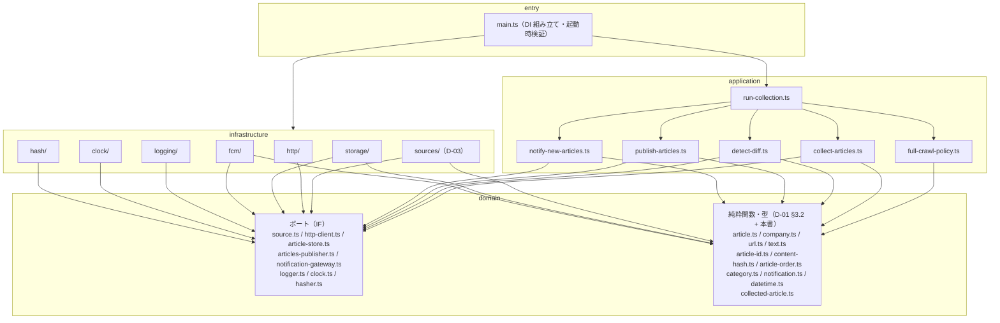

## 1. 目的と範囲

本書は、収集バッチ `collector/` が**どう動くか**を定める。[D-01](D-01.md) が「何を出力するか（`articles.json`・`companies.json`・`id` / `contentHash` の規則・通知ペイロード）」を決めたのに対し、本書は (1) 層構成と手動 DI の組み立て、(2) `Source` インターフェースと Source↔Company の対応付け、(3) `infrastructure/http` のラッパー（User-Agent・間隔・タイムアウト・文字コード）、(4) application の 5 UseCase（`collect-articles`・`detect-diff`・`publish-articles`・`notify-new-articles`・`run-collection`）の入出力と手順、(5) `infrastructure/storage`（`articles.json` の読み書き・原子性・git への確定）、(6) `infrastructure/fcm` の送信、(7) GitHub Actions のワークフロー（cron・権限・Secrets・GitHub Pages デプロイ・失敗の検知）、(8) ログと終了コードを決める。決めないのは、団体別のセレクタ・URL 規則・日付書式・カテゴリ対応表（[D-03](D-03.md)）と、app 側のすべて（[D-04](D-04.md)・[D-05](D-05.md)）である。D-01 の決定（§8 #1〜#34）は本書の前提であり、変更しない。

用語：設計上の要素（インターフェース・実装・テストダブル・失敗種別）は **Source** と書き、開発者向けの日本語メッセージ（ワークフローのステップ名・ステップサマリ・ログ本文）だけは「情報源」と書く。両者は同じものを指す。

## 2. 要件との対応

| 要件 | 本書での扱い | 節 |
|---|---|---|
| F-07 プッシュ通知（送信側） | `notify-new-articles` が団体ごとに 1 通を `NotificationGateway` へ送る。文面は D-01 §4.8 の `buildNotificationText`。送信は `articles.json` が `main` へ push 成功した後だけ（D-01 #33 の不変条件を `run-collection` が保証する）。全滅（`sent == 0 && failed > 0`）はワークフローがジョブ失敗として知らせる（§8 #34） | §5.4 / §5.5 / §5.6 |
| F-11 更新記事の再浮上（検知側） | `detect-diff` が前回スナップショットと `contentHash` で突合し、不一致の記事の `updatedAt` を `generatedAt` にする（D-01 §5.2 の表） | §5.2 |
| R-2 サイト改装で収集が壊れる | Source は 1 団体 1 実装で相互に import せず、`Promise.allSettled` で並行実行する。例外・取得 0 件・Source 未実装のいずれも Source 失敗として数え、実行サマリと GitHub Actions のジョブ結果で開発者に知らせる（失敗が 1 つでもあればジョブを失敗させ、GitHub の既定のワークフロー失敗通知に任せる。§8 #25）。1 Source の失敗は他団体に波及せず、前回の記事は保持される | §5.1 / §6 / §5.6 |
| R-7 cron の遅延 | cron は毎時 7 分に 1 回。遅延しても `generatedAt`（実行開始時刻）を基準に差分を取るだけで、二重通知・取りこぼしは起きない。`concurrency` で同時実行を 1 つに絞り、遅延で重なった実行が同時に push しないようにする（3 つ以上重なると待機中の 1 つがキャンセルされるが、差分は次の実行が拾う） | §5.6 / §8 #15 |
| 要件 §5 相手サイトへの配慮 | `infrastructure/http` が User-Agent（D-01 §4.7 の実値）を必ず送り、同一ホストへのリクエストを直列化して最小間隔を空け、タイムアウトを設ける。robots.txt は §8 #6 の扱い | §5.7 / §8 #6 |
| 要件 §5 収集間隔 1 時間 / 運用コスト 0 円 | GitHub Actions の cron 1 本（1 実行あたり数十秒）と GitHub Pages のみ。外部サーバを持たない | §5.6 |
| 要件 §6.1 収集手順（巡回 → 正規化 → 差分 → コミット → 通知） | `run-collection` の手順 4〜9 がこの順序を実装する（前回スナップショットが無い実行で情報源が失敗したら書き出さない安全条件を含む。§8 #29） | §5.5 |

### 2.1 画面定義との対応（scope: app のみ）

該当なし。本書は scope: collector であり、画面定義書を参照しない。

## 3. 構成

### 3.1 層と依存の方向



矢印はすべて外側 → 内側で、逆向きは無い。`infrastructure` から `application` への矢印も無い（infrastructure は domain のポートだけを実装する）。具象クラスを import するのは `main.ts` だけ（CLAUDE.md）。`run-collection` が他の 4 UseCase を呼ぶのは同一層内の依存で、参照はクラスではなく各 UseCase が公開するインターフェース（§4.6）に対して行う。

### 3.2 ファイル配置

`（D-01）` は D-01 §3.2 が所有し本書では作らないファイル、`（D-03）` は D-03 が所有するファイル。

```
collector/
  package.json            scripts / 依存（§4.9）
  tsconfig.json           strict（§4.9）
  eslint.config.js        typescript-eslint strict
  .prettierrc.json
  vitest.config.ts
  src/
    domain/
      article.ts              （D-01）
      company.ts              （D-01）
      category.ts             （D-01）
      category-keywords.ts    （D-01）
      url.ts                  （D-01）
      text.ts                 （D-01）
      hasher.ts               （D-01）
      article-id.ts           （D-01）
      content-hash.ts         （D-01）
      article-order.ts        （D-01）
      notification.ts         （D-01）
      datetime.ts             toJstDateTime / jstDateOnly / InvalidDateTimeError（§4.2）
      source.ts               RawArticle・SourceOptions・Source・SourceError（§4.1）
      collected-article.ts    CollectedArticle（§4.1。id・contentHash まで確定した記事）
      http-client.ts          HttpClient・HttpError（§4.3）
      article-store.ts        ArticleReader・ArticleWriter（§4.4）
      articles-publisher.ts   ArticlesPublisher・PublishOutcome・PublishFailedError（§4.4）
      notification-gateway.ts NotificationGateway・NotificationSendError（§4.5）
      logger.ts               Logger・LogLevel・LogFields・formatError（§4.7）
      clock.ts                Clock（§4.7）
    application/
      collect-articles.ts     CollectArticles・SourceBinding（§5.1）
      detect-diff.ts          DetectDiff（§5.2）
      publish-articles.ts     PublishArticles・ArticlesValidationError（§5.3）
      notify-new-articles.ts  NotifyNewArticles（§5.4）
      full-crawl-policy.ts    decideFullCrawlCompanyIds（§5.5。純粋関数）
      run-collection.ts       RunCollection・RunSummary・SnapshotMissingError（§5.5）
    infrastructure/
      http/
        fetch-http-client.ts  HttpClient 実装（UA・間隔・タイムアウト・リトライ・文字コード）
        host-scheduler.ts     ホストごとの直列化と最小間隔
      sources/
        takarazuka.ts shiki.ts horipro.ts toho.ts shinkansen.ts   （D-03）
      storage/
        articles-file-store.ts    ArticleReader + ArticleWriter 実装（§5.3）
        companies-file-store.ts   companies.json の読み込みと検証（main.ts が使う）
        git-articles-publisher.ts ArticlesPublisher 実装（git add / commit / push）
        json-format.ts            決定的シリアライズ（D-01 §4.2 書式）
        run-summary-store.ts      実行サマリ（§4.8）の書き出し
        noop-article-writer.ts    ArticleWriter 実装。書かずに info ログだけ残す（CURTAINCALL_DRY_RUN=1。§4.9）
        noop-articles-publisher.ts ArticlesPublisher 実装。常に "no_changes" を返す（同上）
      fcm/
        firebase-notification-gateway.ts  NotificationGateway 実装
        noop-notification-gateway.ts      送信せずログだけ残す実装
      logging/
        console-logger.ts     Logger 実装
      clock/
        system-clock.ts       Clock 実装
      hash/
        sha256-hasher.ts      （D-01）
    main.ts                 DI 組み立てとエントリ（§5.5）
  test/
    application/
      collect-articles.test.ts
      detect-diff.test.ts
      publish-articles.test.ts
      notify-new-articles.test.ts
      run-collection.test.ts
    infrastructure/
      http/
        fetch-http-client.test.ts     fetch をスタブに差し替える（§7.3。CLAUDE.md の例外。§8 #30）
      storage/
        articles-file-store.test.ts   一時ディレクトリの実ファイル（§7.3。同上）
      sources/                （D-03。パーサーのフィクスチャテスト）
    domain/
      contract.test.ts        （D-01）
    helpers/                  テストダブル（§7.2）
    fixtures/
      contract/               （D-01）
      sources/                （D-03。実サイトの HTML / RSS）
data/
  companies.json            （D-01）
  articles.json             （D-01）
.github/workflows/
  collect.yml               収集 + Pages デプロイ（§5.6）
  collector-ci.yml          品質ゲート（§5.6）
```

CLAUDE.md の `infrastructure/` の列挙（`sources` / `http` / `fcm` / `storage`）に `logging` / `clock` / `hash` を加える。いずれも domain のポートの実装であり、依存の方向の規約は満たす（§8 #19）。`test/` は CLAUDE.md の列挙（`test/application/`・`test/infrastructure/sources/fixtures/`）に対し、フィクスチャを `test/fixtures/` にまとめ、`test/domain/`（D-01 の契約テスト）・`test/helpers/`（テストダブル）・`test/infrastructure/{http,storage}/`（§7.3）を加えた構成にする（§8 #28）。CLAUDE.md 側への反映は開発者確認済みで、§8.1 の申し送りに更新内容を挙げる（D-02 承認後に司令塔が更新する）。

## 4. データ

### 4.1 Source インターフェースと素材（`domain/source.ts`）

```ts
import type { Category } from "./article";

/**
 * Source が抽出した記事の「素材」。
 * id・contentHash・fetchedAt・updatedAt は持たない（application が確定する。D-01 §5 冒頭の推奨・§8.1）。
 * 団体固有の URL 正規化（R-8）・相対 URL の解決・publishedAt の書式変換・category 判定は Source が済ませる（D-03）。
 */
export interface RawArticle {
  readonly companyId: string;    // 実装した団体の Company.id。application が呼び出し時の Company.id と突合する（D-01 §4.2）
  readonly title: string;        // 生の見出し。正規化（normalizeTitle）は application
  readonly url: string;          // 絶対 URL。汎用正規化（normalizeUrl）は application
  readonly category: Category;   // D-01 §5.3 の手順で Source が決めた 1 値
  readonly publishedAt: string;  // D-01 §4.1 の書式（YYYY-MM-DDTHH:mm:ss+09:00）。変換は domain/datetime.ts
  readonly thumbnail?: string;   // 取得できた場合のみ。検証は application（D-01 §5.4）
}

/** Source 生成時のオプション。実行ごとに application が決める（§5.5 の decideFullCrawlCompanyIds） */
export interface SourceOptions {
  /** 真のとき、ページ送りを持つ Source が初回相当の範囲（D-03 が定める固定ページ数）まで遡る。偽なら 1 ページ目だけ */
  readonly fullCrawl: boolean;
}

/**
 * 1 団体の取得処理。契約は「入力なし → 記事の配列、失敗は例外」（CLAUDE.md リスコフ置換）。
 * 取得先 URL は実装に埋め込まず、コンストラクタで受け取った Company.sources を使う（D-01 #20）。
 * fullCrawl はコンストラクタで SourceOptions として受け取り、fetch() の引数にはしない（契約を変えない）。
 * 記事は Company.sources の配列順 → 各ページの出現順（ページ送りは 1 ページ目から）で返す（D-01 §6 の重複規則の根拠）。
 */
export interface Source {
  /** ログ用の識別子。既定は Company.id */
  readonly id: string;
  fetch(): Promise<readonly RawArticle[]>;
}

/** Source が投げる失敗。cause に原因（HttpError・パース失敗）を入れる */
export class SourceError extends Error {
  constructor(message: string, options?: { cause?: unknown }) {
    super(message, options);
    this.name = "SourceError";
  }
}
```

`Source` の戻り値の要素型を `Article` ではなく `RawArticle` にするのは、`id`・`contentHash`・`fetchedAt`・`updatedAt` を application が確定するという D-01 §5 の推奨に従うためである（§8 #1）。契約の形（入力なし → 配列、失敗は例外）は CLAUDE.md のとおり維持する。

`RawArticle` から `id`・`contentHash` を確定した中間型は domain の `collected-article.ts` に置く（`collect-articles` の出力・`detect-diff` の入力。application 間で共有する型なので domain に置き、UseCase ファイル同士の型 import を作らない）。

```ts
// domain/collected-article.ts
import type { Article } from "./article";

/** id・contentHash まで確定し、fetchedAt・updatedAt がまだ無い記事。collect-articles の出力・detect-diff の入力 */
export type CollectedArticle = Omit<Article, "fetchedAt" | "updatedAt">;
```

### 4.2 日時の変換（`domain/datetime.ts`）

D-01 §4.1 の書式への変換は 5 団体すべてで必要になるため、Source 間のコピーを避けて domain に置く（CLAUDE.md「共通処理は domain / application の抽象に寄せる」）。

```ts
export class InvalidDateTimeError extends Error {}

const JST_OFFSET_MS = 9 * 60 * 60 * 1000;

/** 瞬間 → JST の YYYY-MM-DDTHH:mm:ss+09:00（秒精度。ミリ秒は切り捨て） */
export function toJstDateTime(instant: Date): string {
  const ms = instant.getTime();
  if (!Number.isFinite(ms)) throw new InvalidDateTimeError("invalid Date");
  const shifted = new Date(ms + JST_OFFSET_MS);           // UTC のゲッタで JST の壁時計を読む
  const p = (n: number, w = 2): string => String(n).padStart(w, "0");
  return (
    `${p(shifted.getUTCFullYear(), 4)}-${p(shifted.getUTCMonth() + 1)}-${p(shifted.getUTCDate())}` +
    `T${p(shifted.getUTCHours())}:${p(shifted.getUTCMinutes())}:${p(shifted.getUTCSeconds())}+09:00`
  );
}

/** JST の年月日（時刻を持たないサイト）→ YYYY-MM-DDT00:00:00+09:00。実在しない日付は例外（D-01 §6「publishedAt を解釈できない」） */
export function jstDateOnly(year: number, month: number, day: number): string {
  const utc = Date.UTC(year, month - 1, day);
  const d = new Date(utc);
  if (d.getUTCFullYear() !== year || d.getUTCMonth() + 1 !== month || d.getUTCDate() !== day) {
    throw new InvalidDateTimeError(`invalid date: ${year}-${month}-${day}`);
  }
  return toJstDateTime(new Date(utc - JST_OFFSET_MS));
}
```

RSS の `pubDate`（RFC822・任意のオフセット）は `new Date(pubDate)` で瞬間にしてから `toJstDateTime` を通す（同じ瞬間を +09:00 で表記する。D-01 §4.1）。`Number.isNaN(d.getTime())` のときは Source が `publishedAt` に空文字を入れず、その記事を捨てるか `InvalidDateTimeError` を投げる（D-03）。

### 4.3 HTTP ポート（`domain/http-client.ts`）

```ts
export class HttpError extends Error {
  constructor(
    message: string,
    readonly url: string,
    readonly status?: number,
    options?: { cause?: unknown },
  ) {
    super(message, options);
    this.name = "HttpError";
  }
}

export interface HttpClient {
  /**
   * URL を GET し、本文を文字列で返す。
   * 2xx 以外・タイムアウト・ネットワーク失敗・文字コードのデコード失敗は HttpError を投げる。
   * リダイレクトは追う。リクエスト間隔・タイムアウト・リトライ・User-Agent は実装（§5.7）が持つ。
   */
  getText(url: string): Promise<string>;
}
```

`sources/` はこのインターフェースだけに依存し、`fetch` を直接呼ばない（CLAUDE.md）。実装は `infrastructure/http/fetch-http-client.ts`、注入は `main.ts`。

### 4.4 storage のポート（`domain/article-store.ts`・`domain/articles-publisher.ts`）

利用側の UseCase が必要とするメソッドだけを持つよう、読み・書き・確定を 3 つに分ける（CLAUDE.md インターフェース分離）。

```ts
// domain/article-store.ts
import type { ArticlesFile } from "./article";

export interface ArticleReader {
  /**
   * 前回の data/articles.json を読む（D-01 §5.2 の「前回」＝実行開始時にチェックアウトした main の内容）。
   * ファイルが無い・JSON として壊れている・ArticlesFileSchema に合わない（schemaVersion 違いを含む）ときは
   * undefined を返す（例外にしない）。undefined は「通知を送らない」根拠になる（D-01 #15）。
   */
  readPrevious(): Promise<ArticlesFile | undefined>;
}

export interface ArticleWriter {
  /**
   * data/articles.json を書き出す。書き出しだけを行い、検証はしない
   * （buildArticlesFileWriteSchema による検証は application の publish-articles が書き出し前に行う。§5.3、§8 #29）。
   * 書き出しは原子的（.tmp → rename。§5.3）。失敗は Error（fs 由来）をそのまま投げる。
   */
  write(file: ArticlesFile): Promise<void>;
}
```

```ts
// domain/articles-publisher.ts
export type PublishOutcome = "published" | "no_changes";

export interface ArticlesPublisher {
  /**
   * 書き出し済みの data/articles.json を配信元へ確定させる。
   * 変更が無ければ "no_changes"。確定操作のいずれかが失敗したら PublishFailedError（D-01 #33）。
   * @param note 実装が確定操作に添える説明文（git 実装ではコミットメッセージ）
   */
  publish(note: string): Promise<PublishOutcome>;
}

export class PublishFailedError extends Error {}
```

### 4.5 通知のポート（`domain/notification-gateway.ts`）

```ts
import type { NewArticlesNotification } from "./notification";

export interface NotificationGateway {
  /** 1 通送る。失敗は NotificationSendError。再送は行わない（D-01 §4.8 至多 1 回） */
  send(notification: NewArticlesNotification): Promise<void>;
}

export class NotificationSendError extends Error {}
```

### 4.6 UseCase の入出力型（`application/`）

`CollectedArticle` は §4.1（`domain/collected-article.ts`）で定義済み。ここでは各 UseCase が公開する入出力型とインターフェースだけを示す。

```ts
// application/collect-articles.ts
import type { CollectedArticle } from "../domain/collected-article";
import type { Company } from "../domain/company";
import type { Source, SourceOptions } from "../domain/source";

/**
 * Source と Company の対応付け（D-01 §8.1）。main.ts が companies.json の配列順に組み立てる。
 * createSource が undefined の団体は「Source 未実装」（SOURCE_FACTORIES に無い id）。
 * collect-articles がそれを failures（reason: "not_implemented"）に数える（§5.1 手順 1、§8 #2）。
 * Source は実行ごとに生成する（fullCrawl が実行ごとに決まるため）
 */
export interface SourceBinding {
  readonly company: Company;
  readonly createSource: ((options: SourceOptions) => Source) | undefined;
}

export type SourceFailureReason = "error" | "empty" | "all_rejected" | "not_implemented";

export interface SourceFailure {
  readonly companyId: string;
  readonly sourceId: string;   // §5.1 手順 3 の sources[i]?.id ?? target.company.id。Source インスタンスが作れた場合は source.id。作れなかった場合（createSource が例外を投げた rejected・not_implemented）は companyId
  readonly reason: SourceFailureReason;
  readonly message: string;
}

export interface CollectArticlesInput {
  /** fullCrawl: true で Source を生成する団体の id（§5.5 の decideFullCrawlCompanyIds の結果） */
  readonly fullCrawlCompanyIds: ReadonlySet<string>;
}

export interface CollectArticlesResult {
  /** companies.json の配列順 → Source の返却順。id の重複は除去済み */
  readonly articles: readonly CollectedArticle[];
  readonly failures: readonly SourceFailure[];
  /**
   * 団体別の破棄件数（URL 不正・見出し空・日付不正・companyId 不一致）。キーは companyId、値はその団体の Source が返した記事のうち §5.1 手順 6 で捨てた件数。
   * 破棄 0 件の団体もキーを持つ（値 0）。未実装・例外・0 件の団体は 0。
   * 一部だけ破棄された団体（all_rejected にならない部分破棄）をサマリで見えるようにする（§8 #33）。
   * 合計は持たない。必要な箇所（§5.1 手順 9 のログ、RunSummary.discarded）は
   * Object.values(discardedByCompany).reduce((a, b) => a + b, 0) で導出する（同じ事実を 2 か所に持たない。§8 #36）
   */
  readonly discardedByCompany: Readonly<Record<string, number>>;
}

export interface CollectArticlesUseCase {
  execute(input: CollectArticlesInput): Promise<CollectArticlesResult>;
}
```

```ts
// application/detect-diff.ts
import type { Article, ArticlesFile } from "../domain/article";
import type { CollectedArticle } from "../domain/collected-article";
import type { Company } from "../domain/company";

export interface DetectDiffInput {
  /** 前回の articles.json。undefined なら全件が新着になり、通知対象は空になる（D-01 #15） */
  readonly previous: ArticlesFile | undefined;
  readonly collected: readonly CollectedArticle[];
  readonly companies: readonly Company[];   // companies.json の配列順
  readonly generatedAt: string;             // 実行開始時刻（D-01 §4.2）
}

export interface DetectDiffResult {
  readonly file: ArticlesFile;
  /** articles 配列が前回と 1 か所でも違うか。false なら書き出さない（§8 #8） */
  readonly changed: boolean;
  /** 通知対象。キーは companyId、値は compareArticles 順の新着記事。previous が undefined のときは空 */
  readonly newArticlesByCompany: ReadonlyMap<string, readonly Article[]>;
  readonly stats: {
    readonly created: number;   // 新着
    readonly updated: number;   // 更新
    readonly carried: number;   // 継続（今回も取れた + 一覧から消えたが保持）
    readonly dropped: number;   // 100 件上限で落ちた
  };
}

export interface DetectDiffUseCase {
  execute(input: DetectDiffInput): DetectDiffResult;   // I/O を持たないので同期
}
```

```ts
// application/publish-articles.ts
import type { ArticlesFile } from "../domain/article";
import type { PublishOutcome } from "../domain/articles-publisher";

export interface PublishArticlesInput {
  readonly file: ArticlesFile;
  /** ArticlesPublisher.publish に渡す説明文（§5.5 の buildCommitMessage の結果） */
  readonly note: string;
}

/** 書き出し前の検証（buildArticlesFileWriteSchema）に失敗した。issues は zod の issue の message 先頭 5 件 */
export class ArticlesValidationError extends Error {
  constructor(readonly issues: readonly string[]) {
    super(`articles.json validation failed: ${issues.join("; ")}`);
    this.name = "ArticlesValidationError";
  }
}

export interface PublishArticlesUseCase {
  /** 検証 → 書き出し → 確定（git 実装ではコミット → push）。失敗は例外（ArticlesValidationError / PublishFailedError） */
  execute(input: PublishArticlesInput): Promise<PublishOutcome>;
}
```

```ts
// application/notify-new-articles.ts
import type { Article } from "../domain/article";
import type { Company } from "../domain/company";

export interface NotifyNewArticlesInput {
  readonly newArticlesByCompany: ReadonlyMap<string, readonly Article[]>;
  readonly companies: readonly Company[];   // 送信順は配列順（D-01 §4.8）
}

export interface NotifyNewArticlesResult {
  readonly sent: number;
  readonly failed: number;
}

export interface NotifyNewArticlesUseCase {
  execute(input: NotifyNewArticlesInput): Promise<NotifyNewArticlesResult>;
}
```

### 4.7 ログと時刻のポート（`domain/logger.ts`・`domain/clock.ts`）

```ts
// domain/logger.ts
export const LOG_LEVELS = ["debug", "info", "warn", "error"] as const;
export type LogLevel = (typeof LOG_LEVELS)[number];

/** 構造化フィールド。値は 1 行に収まるスカラーのみ（dynamic / any を使わない） */
export type LogFields = Readonly<Record<string, string | number | boolean>>;

export interface Logger {
  debug(message: string, fields?: LogFields): void;
  info(message: string, fields?: LogFields): void;
  warn(message: string, fields?: LogFields): void;
  error(message: string, fields?: LogFields): void;
}

/**
 * unknown の例外を LogFields に載せられる 1 行の文字列にする（LogFields は unknown を受け付けない）。
 * Error なら `${name}: ${message}`、cause があれば " <- " で再帰的に連結する。Error 以外は String(e)。
 * 例: "SourceError: parse failed <- HttpError: 503 https://example.com/news"
 */
export function formatError(e: unknown): string {
  if (e instanceof Error) {
    const head = `${e.name}: ${e.message}`;
    return e.cause === undefined ? head : `${head} <- ${formatError(e.cause)}`;
  }
  return String(e);
}
```

例外をログのフィールドに載せるときは、`error: formatError(e)` と文字列化してから渡す（`domain/logger.ts` に置く。§5.1 手順 4・§5.4 手順 6）。`e` をそのまま渡す書き方は `LogFields` の型に合わずコンパイルが通らない。

```ts
// domain/clock.ts
export interface Clock {
  now(): Date;
}
```

`ConsoleLogger` は `debug` / `info` を stdout、`warn` / `error` を stderr に 1 行 1 イベントで書く。書式は `<level> <message> key=value key=value`（値に空白・`=` が含まれる場合は `JSON.stringify` で囲む）。出力レベルは環境変数 `CURTAINCALL_LOG_LEVEL`（既定 `info`）。秘密情報（サービスアカウント JSON、トークン）は一切フィールドに載せない。

### 4.8 実行サマリ（`.run-summary.json`）

collector は Actions 固有の API（`$GITHUB_OUTPUT` 等）を知らない。代わりに 1 実行の結果を JSON ファイルに書き、ワークフローがそれを読んでジョブの出力・ステップサマリにする（§8 #13）。リポジトリにはコミットしない（`.gitignore`）。

```ts
// application/run-collection.ts
import type { SourceFailure } from "./collect-articles";

/** main.ts が注入した通知ゲートウェイの種別。Secret の未設定・タイポで noop に縮退したことをサマリで見えるようにする（§8 #32） */
export type NotificationGatewayKind = "firebase" | "noop";

export interface RunSummary {
  readonly generatedAt: string;          // この実行の基準時刻
  readonly published: boolean;           // articles.json を main へ push したか
  readonly changed: boolean;             // 記事配列に変化があったか
  readonly previousSnapshot: boolean;    // 前回の articles.json を読めたか（偽なら通知抑止。D-01 #15）
  readonly fullCrawlCompanyIds: readonly string[];   // fullCrawl: true で生成した団体（§5.5）
  readonly collected: number;            // 収集して採用した記事数
  readonly discarded: number;            // 破棄した記事数の合計。RunCollection が discardedByCompany の総和として導出する（ワークフローの jq を単純にするための意図的な冗長。§8 #36）
  readonly discardedByCompany: Readonly<Record<string, number>>;   // 団体別の破棄件数（§4.6。部分破棄の検知。§8 #33）
  readonly created: number;
  readonly updated: number;
  readonly dropped: number;
  readonly sourceFailures: readonly SourceFailure[];
  readonly notificationGateway: NotificationGatewayKind;
  readonly notificationsSent: number;
  readonly notificationsFailed: number;
  readonly durationMs: number;
}
```

```json
{
  "generatedAt": "2026-09-19T15:07:03+09:00",
  "published": true,
  "changed": true,
  "previousSnapshot": true,
  "fullCrawlCompanyIds": [],
  "collected": 142,
  "discarded": 0,
  "discardedByCompany": { "takarazuka": 0, "shiki": 0, "horipro": 0, "toho": 0, "shinkansen": 0 },
  "created": 3,
  "updated": 1,
  "dropped": 2,
  "sourceFailures": [{ "companyId": "toho", "sourceId": "toho", "reason": "empty", "message": "no articles parsed" }],
  "notificationGateway": "firebase",
  "notificationsSent": 1,
  "notificationsFailed": 0,
  "durationMs": 8421
}
```

### 4.9 プロジェクト設定と環境変数

```json
// collector/package.json（抜粋）
{
  "name": "curtaincall-collector",
  "private": true,
  "type": "module",
  "engines": { "node": ">=22" },
  "scripts": {
    "build": "tsc -p tsconfig.json",
    "start": "node dist/main.js",
    "lint": "eslint . && prettier --check .",
    "typecheck": "tsc -p tsconfig.json --noEmit",
    "test": "vitest run"
  },
  "dependencies": {
    "zod": "^3.23.0",
    "cheerio": "^1.0.0",
    "rss-parser": "^3.13.0",
    "firebase-admin": "^13.0.0"
  },
  "devDependencies": {
    "typescript": "^5.6.0",
    "vitest": "^2.1.0",
    "eslint": "^9.0.0",
    "typescript-eslint": "^8.0.0",
    "prettier": "^3.3.0",
    "@types/node": "^22.0.0"
  }
}
```

```jsonc
// collector/tsconfig.json（抜粋）
{
  "compilerOptions": {
    "target": "es2023",
    "module": "nodenext",
    "moduleResolution": "nodenext",
    "lib": ["es2023"],
    "types": ["node"],
    "rootDir": "src",
    "outDir": "dist",
    "strict": true,
    "noUncheckedIndexedAccess": true,
    "exactOptionalPropertyTypes": true,
    "noImplicitOverride": true,
    "verbatimModuleSyntax": true,
    "skipLibCheck": true
  },
  "include": ["src", "test", "vitest.config.ts", "eslint.config.js"]
}
```

`exactOptionalPropertyTypes: true` のため、省略可能フィールド（`thumbnail`・`updatedAt`）は `undefined` を代入せず、条件付きスプレッドで組み立てる（D-01 #2「キー省略」と一致する）。

```ts
const article: Article = {
  ...base,
  ...(thumbnail !== undefined ? { thumbnail } : {}),
  ...(updatedAt !== undefined ? { updatedAt } : {}),
};
```

| 環境変数 | 必須 | 既定 | 用途 |
|---|---|---|---|
| `FIREBASE_SERVICE_ACCOUNT` | いいえ | 未設定 | Firebase サービスアカウント JSON の全文。未設定なら `NoopNotificationGateway` を注入し通知を送らない（§8 #16）。注入した種別は `RunSummary.notificationGateway` に残る |
| `CURTAINCALL_REQUIRE_NOTIFICATIONS` | いいえ | 未設定 | `1` のとき `FIREBASE_SERVICE_ACCOUNT` が未設定・空文字なら起動時に `error` ログを出して終了コード 1（収集を始めない）。フェーズ 5（要件 §10）で Firebase を設定したら `collect.yml` で `1` にし、Secret 名のタイポで通知が黙って Noop に縮退するのを防ぐ（§8 #32） |
| `CURTAINCALL_LOG_LEVEL` | いいえ | `info` | `debug` / `info` / `warn` / `error` |
| `CURTAINCALL_FULL_CRAWL` | いいえ | 未設定 | `1` のとき、ページ送りを持つ Source が**全団体**について初回相当の範囲まで遡る（手動の明示指定。`workflow_dispatch` の `full_crawl`）。未設定のときの自動判定は `RunCollection` が行う（前回スナップショットが無い、または記事 0 件の初期状態のときだけ全団体。§5.5、§8 #27） |
| `CURTAINCALL_SUMMARY_PATH` | いいえ | `collector/.run-summary.json` | 実行サマリの出力先 |
| `CURTAINCALL_REPO_ROOT` | いいえ | `dirname(fileURLToPath(import.meta.url))`（= `collector/dist`）の 2 階層上（= リポジトリ直下） | `data/` と git 操作の基準ディレクトリ。成果物は `collector/dist/main.js` なので `collector/dist` → `collector` → リポジトリ直下 |
| `CURTAINCALL_DRY_RUN` | いいえ | 未設定 | `1` のとき書き出し・push・通知を行わない。`main.ts` が `ArticleWriter`・`ArticlesPublisher`・`NotificationGateway` を Noop 実装に差し替える。**ローカル実行では常に `1` を付ける**（運用規約。ローカルから `main` へ push しない。push 失敗で未 push コミットが手元に残り、次回の「前回」がずれる事故を防ぐ。§6、§8 #10） |

`.gitignore` に `collector/dist/`・`collector/node_modules/`・`collector/.run-summary.json`・`data/articles.json.tmp` を加える。

## 5. 処理フロー（正常系）

### 5.1 collect-articles（全 Source の並行実行と正規化）

- **責務**：すべての Source を実行し、素材（`RawArticle`）を `CollectedArticle` に確定する。1 public メソッド `execute(input)`。
- **依存（コンストラクタ注入）**：`bindings: readonly SourceBinding[]`（`companies.json` の配列順。`main.ts` が組む）、`hasher: Hasher`、`logger: Logger`
- **入力**：`CollectArticlesInput`（§4.6）
- **ステップ**：
  1. 未実装団体の確定：`createSource === undefined` の binding は `failures` に `{ companyId, sourceId: companyId, reason: "not_implemented", message: "no Source implementation" }` を追加し `logger.warn("source not implemented", { companyId })`。以降の手順の対象から外す（その団体の前回の記事は `detect-diff` が保持する。§6、R-2）
  2. 実装のある binding だけを `bindings` の順序を保ったまま `targets` に絞り、Source の生成と取得を 1 つの async 関数に入れて並行実行する（調査レポート §7.1、R-2）。生成（コンストラクタ）で投げた例外も async 関数の中なので `rejected` になり、`try` を別に書かない。絞り込みは型述語付きの `filter` で行い、`createSource` が確定した型（`BoundBinding`）にする（`!` は typescript-eslint strict の `no-non-null-assertion` で品質ゲートを通らない。§4.9）

     ```ts
     type BoundBinding = SourceBinding & { readonly createSource: (options: SourceOptions) => Source };
     const targets = bindings.filter((b): b is BoundBinding => b.createSource !== undefined);
     // targets[i] に対応する Source インスタンス。生成に失敗した添字は undefined のまま（手順 4 の sourceId に使う）
     const sources: (Source | undefined)[] = targets.map(() => undefined);
     const settled = await Promise.allSettled(
       targets.map(async (b, i) => {
         const source = b.createSource({ fullCrawl: input.fullCrawlCompanyIds.has(b.company.id) });
         sources[i] = source;
         return source.fetch();
       }),
     );
     ```

  3. `settled` を走査し、各要素を同じ添字の `targets`（`sources`）に対応付ける（`targets` は `bindings` の順序を保つので `companies.json` の配列順。完了順に依存させない。D-01 §6・§8.1）。`bindings` の添字ではなく `targets` の添字を使う（未実装団体を除いた分だけ長さが違う）。`noUncheckedIndexedAccess: true`（§4.9）のため添字アクセスの結果は `T | undefined` になるので、走査の冒頭でローカル変数に受けてから使い、以降の手順 4〜7 はこの `target` と `sourceId` を参照する（`failures` に入れる `sourceId` は一律 `sources[i]?.id ?? target.company.id`。§4.6）

     ```ts
     settled.forEach((result, i) => {
       const target = targets[i];
       if (target === undefined) return;   // settled と targets は同じ長さなので到達しない（型の都合）
       const sourceId = sources[i]?.id ?? target.company.id;
       // 手順 4〜7
     });
     ```

  4. `result.status === "rejected"` の `target`：`failures` に `{ companyId: target.company.id, sourceId, reason: "error", message }` を追加し `logger.warn("source failed", { companyId, sourceId, error: formatError(result.reason) })`（§4.7）。Source を生成できずに rejected になった場合は `sources[i]` が `undefined` なので `sourceId = target.company.id` になる（§4.6）。`message` も `formatError(result.reason)`。その団体の記事は 0 件（前回の記事は `detect-diff` が保持する）
  5. `result.status === "fulfilled"` で `result.value` が空配列の `target`：`failures` に `{ companyId: target.company.id, sourceId, reason: "empty", message: "no articles parsed" }` を追加し `logger.warn("source returned no articles", { companyId, sourceId })`。改装でセレクタが一致しなくなった場合は例外ではなく 0 件になるため、0 件も失敗として数える（R-2。§8 #3）
  6. `result.value` の各 `RawArticle` を次の順で確定する。いずれかで失敗した記事は**その記事だけ**を捨て、`discardedByCompany[target.company.id]` を増やす（D-01 §6。`discardedByCompany` は手順 1 の前に `bindings` 全件（未実装団体を含む）の `company.id` を値 0 で初期化しておく。§8 #33）
     1. `companyId` の突合：`raw.companyId !== target.company.id` → 捨てて `logger.warn("companyId mismatch", { sourceId, expected, actual })`（D-01 §4.2・#32）
     2. `url = normalizeUrl(raw.url)`：`InvalidArticleUrlError` → 捨てて `warn`
     3. `id = buildArticleId(hasher, url)`
     4. `title = normalizeTitle(raw.title)`：空文字 → 捨てて `warn`
     5. `publishedAt`：`DateTimeSchema.safeParse` が失敗 → 捨てて `warn`
     6. `category`：`CategorySchema.safeParse` が失敗 → `other` にして `warn`（記事は残す。型では保証されるが Source は infrastructure なので実行時の防衛を置く）
     7. `thumbnail`：`raw.thumbnail` が `undefined`・空文字・`HttpUrlSchema.safeParse` 失敗 → キーを省略して `logger.debug`。成功ならそのまま格納（D-01 §5.4）
     8. `contentHash = buildContentHash(hasher, title)`
  7. 1 `target` の取得件数が 1 件以上で採用が 0 件 → `failures` に `{ companyId: target.company.id, sourceId, reason: "all_rejected", message: "all <取得件数> articles discarded" }` を追加（D-01 §6「1 Source の全記事が破棄されたら Source 失敗」）。採用が 1 件以上あれば破棄が何件でも `failures` には入れず、`discardedByCompany` の件数だけに残す（部分破棄。§6、§8 #33）
  8. 重複 `id`：走査順に `Map<string, CollectedArticle>` へ入れ、既にあるキーは捨てて `logger.debug("duplicate id", { id, companyId })`。走査順が「`companies.json` の配列順 → `Company.sources` の配列順 → 出現順」になるのは手順 3 と `Source` の契約（§4.1）による
  9. `logger.info("collected", { companies, articles, discarded, failures })`（`discarded` は `Object.values(discardedByCompany).reduce((a, b) => a + b, 0)` で導出する。§4.6）。`discardedByCompany` の値が 1 以上の団体ごとに `logger.warn("articles partially discarded", { companyId, fetched, discarded })` を出す
- **出力**：`CollectArticlesResult`。`failures` の順序は `bindings` の順（未実装団体も含めて `companies.json` の配列順）。`discardedByCompany` はすべての binding の `company.id` をキーに持つ（破棄 0 件でも値 0）
- **失敗時**：Source 由来の失敗（未実装・例外・0 件・全件破棄）は `failures` に集約して例外にしない（1 サイトの故障を他に波及させない。R-2）。`hasher` など依存自体の例外は上位へ投げる（`run-collection` が致命的失敗として扱う）

### 5.2 detect-diff（前回との突合・確定・切り詰め）

- **責務**：前回スナップショットと今回の収集結果から、書き出す `ArticlesFile` と通知対象を確定する。1 public メソッド `execute(input)`。
- **依存**：`logger: Logger`
- **入力**：`DetectDiffInput`（§4.6）
- **ステップ**：
  1. `knownIds = new Set(companies.map((c) => c.id))`
  2. `previousById`：`previous?.articles` のうち `knownIds` に含まれる `companyId` の記事だけを `Map<id, Article>` にする。除外した記事は `logger.info("dropping article of removed company", { companyId, id })`（D-01 §6）
  3. 今回の各 `CollectedArticle` を表 5.2-1（D-01 §5.2 手順 4 の表）で確定する（`Article` は不変なので新しいオブジェクトを作る）
  4. 今回に現れなかった `previousById` の記事をそのまま加える（サイトの一覧から消えても上限まで残す。D-01 #7）。Source が失敗した団体の記事もこの行で保持される
  5. 団体ごとに `compareArticles`（D-01 §4.5）で並べ、上位 `MAX_ARTICLES_PER_COMPANY`（100）件を残す。落ちた件数を `stats.dropped` に数える
  6. 出力の `articles` は `companies` の配列順に団体ブロックを連結する（D-01 §4.2）。`companies` に無い `companyId` は手順 2 で除いてあるため残らない
  7. 通知対象：手順 3 で「新着」と判定され、**かつ手順 5 の切り詰め後にも残っている**記事だけを `companyId` ごとに集め、`compareArticles` 順に並べる（`articles.json` に無い記事は通知しない）
  8. `previous === undefined` のとき、手順 7 の結果を空の `Map` に置き換える（D-01 #15。通知抑止の判定はここ 1 か所だけで行う）
  9. `changed = previous === undefined || !hasSameArticles(previous.articles, articles)`（`articles` は手順 6 で確定した配列）。`hasSameArticles` は非公開関数で、長さと各要素の 10 フィールドすべて（`id`・`companyId`・`title`・`url`・`category`・`publishedAt`・`fetchedAt`・`thumbnail`・`contentHash`・`updatedAt`。省略可能な `thumbnail`・`updatedAt` はキーの有無と値の両方）を順に比較する。`ArticlesFile.generatedAt` は比較対象に含めない（§8 #8）
  10. `file = { schemaVersion: ARTICLES_SCHEMA_VERSION, generatedAt, articles }`
- **出力**：`DetectDiffResult`
- **失敗時**：I/O を持たないため例外は発生しない（前回ファイルが無い・壊れている場合は `previous === undefined` として `ArticleReader` が渡す）

表 5.2-1　前回と今回の突合による確定規則（D-01 §5.2 手順 4 の表の再掲。手順 3 が参照する）

| 前回 | 今回 | 判定 | `fetchedAt` | `updatedAt` | `contentHash` | その他 |
|---|---|---|---|---|---|---|
| 無し | 有り | 新着 | `generatedAt` | キー省略 | 今回 | 今回の値 |
| 有り・ハッシュ一致 | 有り | 継続 | 前回 | 前回（無ければ省略） | 前回（＝今回） | 今回の値 |
| 有り・ハッシュ不一致 | 有り | 更新 | 前回 | `generatedAt` | 今回 | 今回の値 |
| 有り | 無し | 継続（保持） | 前回 | 前回 | 前回 | 前回の値 |

### 5.3 publish-articles（検証 → 書き出し → コミット → push）

- **責務**：今回の `articles.json` を検証し、`main` に確定させる。1 public メソッド `execute(input)`。
- **依存**：`writer: ArticleWriter`、`publisher: ArticlesPublisher`、`knownCompanyIds: ReadonlySet<string>`（`companies.json` の `id` 集合。`main.ts` が渡す）、`logger: Logger`
- **入力**：`PublishArticlesInput`（§4.6）
- **ステップ**：
  1. **検証（application）**：`buildArticlesFileWriteSchema(knownCompanyIds).safeParse(input.file)`（D-01 §4.2）。失敗 → issue の `message` 先頭 5 件を `logger.error("articles.json validation failed", { issues })` に出し、`ArticlesValidationError(issues)` を投げる。**`writer.write` を呼ばない**（D-01 §6、D-01 §8.1「書き出し前の検証」。§8 #29）
  2. `await writer.write(input.file)`。`ArticlesFileStore.write` の手順（検証は持たない）：
     - `serializeArticlesFile(file)`（`storage/json-format.ts`）：`JSON.stringify(file, null, 2) + "\n"`。キー順は D-01 §4.1 の宣言順（オブジェクトをその順で組み立てる）、`undefined` のキーは `JSON.stringify` が自動で省く
     - 原子的書き出し：同じディレクトリの `data/articles.json.tmp` に書き → `fsync` → `rename` で `data/articles.json` に置き換える（同一ファイルシステム上の `rename` は原子的）。途中で失敗したら `.tmp` を削除して例外
  3. `const outcome = await publisher.publish(input.note)`。`GitArticlesPublisher` の手順（`execFile("git", args, { cwd: repoRoot })`。シェルを介さず、引数は固定文字列と `note` のみ）：
     1. `git add -- data/articles.json`
     2. `git diff --cached --quiet -- data/articles.json` → 終了コード 0（差分なし）なら `"no_changes"` を返してここで終わる（`detect-diff` の `changed` 判定に対する二重の安全網）
     3. `git -c user.name="github-actions[bot]" -c user.email="41898282+github-actions[bot]@users.noreply.github.com" commit -m <note>`（グローバル設定を書き換えない）
     4. `git push origin HEAD:main`
     5. 2〜4 のいずれかが非 0 終了 → `PublishFailedError`（stderr を `error` ログに出す）。**リトライ・`pull --rebase` は行わない**（§8 #10）。push 失敗時にローカルのコミットを巻き戻すこともしない（runner ではジョブ終了と共に消える。ローカル実行は `CURTAINCALL_DRY_RUN=1` を必須にして push を起こさない。§4.9、§6）
     6. **作業ツリーの復元**（§8 #35）：手順 5 で `PublishFailedError` を投げる**前に** `git checkout origin/main -- data/articles.json` を実行し、`data/articles.json`（index と作業ツリー）を push 済みの `main` の内容に戻す。コミットは残してよい（次のジョブで消える）。ワークフローの後続ステップ（Pages へのアップロード。§5.6）が未 push の内容を配信しないため。復元自体が失敗したら `logger.warn("failed to restore data/articles.json", { stderr })` を出すだけで、投げる例外は `PublishFailedError` のまま（終了コード 1 は変わらない）
  4. `logger.info("published", { outcome, articles: input.file.articles.length })`
- **出力**：`PublishOutcome`
- **失敗時**：例外（`ArticlesValidationError` / `writer.write` の fs 例外 / `PublishFailedError`）。呼び出し側（`run-collection`）は通知を送らずに致命的失敗として終了する（D-01 #33）

### 5.4 notify-new-articles（新着の通知）

- **責務**：新着記事を団体ごとに 1 通の通知にして送る。1 public メソッド `execute(input)`。
- **依存**：`gateway: NotificationGateway`、`logger: Logger`
- **入力**：`NotifyNewArticlesInput`（§4.6）
- **ステップ**：
  1. `companies` の配列順に走査する（D-01 §4.8「複数団体は `companies.json` の順に 1 通ずつ」）
  2. その団体の新着が 0 件（キーが無い・空配列）なら送らない
  3. `const text = buildNotificationText(company.name, articles.map((a) => a.title))`（D-01 §4.8。`articles` は `compareArticles` 順で渡される）
  4. `NewArticlesNotification` を組み立てる：`topic = company.fcmTopic`、`notification = text`、`data = { schemaVersion: "1", type: "new_articles", companyId: company.id, count: String(articles.length) }`、`apns = { headers: { "apns-priority": "10" }, payload: { aps: { sound: "default", "thread-id": company.id } } }`
  5. `await gateway.send(notification)` → 成功なら `sent++` と `logger.info("notified", { companyId, count })`
  6. 送信が失敗したら `failed++` と `logger.error("notification failed", { companyId, count, error: formatError(e) })`（§4.7）を記録し、**次の団体へ進む**（1 団体の失敗が他を止めない。D-01 §6）。再送しない（至多 1 回。D-01 §4.8）。全団体が失敗しても（FCM 鍵の失効・権限剥奪）例外にはせず、`sent: 0`・`failed: 送信対象の団体数` を返す。全滅の検知は `run-collection` ではなくワークフロー（§5.6 の「通知の全滅を検知」ステップ）が `RunSummary` の `notificationsSent` / `notificationsFailed` で行う（§8 #34）
- **出力**：`NotifyNewArticlesResult`
- **失敗時**：例外を外へ出さない（この UseCase の失敗は実行全体を失敗にしない。通知はベストエフォート。要件 §5）

`FirebaseNotificationGateway` は `firebase-admin/app` の `initializeApp({ credential: cert(JSON.parse(env.FIREBASE_SERVICE_ACCOUNT)) })`（`getApps().length === 0` のときだけ）と `getMessaging().send(notification)` を呼ぶ。`NewArticlesNotification`（D-01 §4.8）は `firebase-admin` の `Message` と構造的に一致しているためそのまま渡せる。例外は `NotificationSendError` に包んで投げ、原因は `cause` に入れる。サービスアカウントの内容はログに出さない。

### 5.5 run-collection と main.ts

**`decideFullCrawlCompanyIds`**（`application/full-crawl-policy.ts`。純粋関数。§8 #27）

```ts
import type { ArticlesFile } from "../domain/article";
import type { Company } from "../domain/company";

export interface FullCrawlDecisionInput {
  readonly previous: ArticlesFile | undefined;
  readonly companies: readonly Company[];
  /** CURTAINCALL_FULL_CRAWL=1（workflow_dispatch の full_crawl）。main.ts が読む */
  readonly forceAll: boolean;
}

/**
 * fullCrawl: true で Source を生成する団体の id。
 * - forceAll → 全団体
 * - previous が undefined（前回無し・壊れている・schemaVersion 違い）→ 全団体
 * - previous.articles.length === 0（D-01 §4.2 の初期状態 `articles: []`）→ 全団体
 * - それ以外 → 空集合。previous に特定の団体の記事が 0 件でも自動では遡らない（呼び出し側が warn を出す。§8 #27）
 */
export function decideFullCrawlCompanyIds(input: FullCrawlDecisionInput): ReadonlySet<string>;
```

**`RunCollection.execute(input)`**（application。順序の不変条件（D-01 #33）と書き出しの安全条件（§8 #29）を持つ唯一の場所。§8 #11）

```ts
// application/run-collection.ts（続き。RunSummary は §4.8）
import type { SourceFailure } from "./collect-articles";

export interface RunCollectionInput {
  readonly forceFullCrawl: boolean;   // CURTAINCALL_FULL_CRAWL === "1"
}

/** 前回スナップショットが無い実行で情報源の失敗があった（§8 #29）。書き出し・確定・通知を行わない */
export class SnapshotMissingError extends Error {
  constructor(readonly failures: readonly SourceFailure[]) {
    super(`no previous snapshot and ${failures.length} source failure(s); refusing to publish a partial articles.json`);
    this.name = "SnapshotMissingError";
  }
}
```

- **依存**：`collectArticles`・`detectDiff`・`publishArticles`・`notify`（いずれも §4.6 のインターフェース）、`reader: ArticleReader`、`clock: Clock`、`companies: readonly Company[]`、`notificationGatewayKind: NotificationGatewayKind`（§4.8。`main.ts` が注入した種別）、`logger: Logger`
- **入力**：`RunCollectionInput`
- **ステップ**：
  1. `const startedAt = clock.now()`、`const generatedAt = toJstDateTime(startedAt)`
  2. `const previous = await reader.readPrevious()`（この実行で `readPrevious()` を呼ぶのはここ 1 回だけ。`undefined` なら `logger.warn("no previous snapshot; notifications suppressed")`）
  3. `const fullCrawlCompanyIds = decideFullCrawlCompanyIds({ previous, companies, forceAll: input.forceFullCrawl })`。空でなければ `logger.info("full crawl", { companyIds })`。`previous` があり、`previous.articles` に記事が 1 件も無い団体があれば `logger.warn("company has no articles in previous snapshot; run workflow_dispatch with full_crawl to backfill", { companyId })`（自動では遡らない。§8 #27）
  4. `const collect = await collectArticles.execute({ fullCrawlCompanyIds })`
  5. **書き出しの安全条件**（§8 #29）：`previous === undefined && collect.failures.length > 0` → `logger.error("refusing to publish", { failures })` を出し `SnapshotMissingError(collect.failures)` を投げる。書き出し・コミット・通知のいずれも行わず、既存の `data/articles.json`（壊れているか無い）をそのまま残す。前回を引き継げない実行で欠損した記事一覧を配信しないため
  6. `const diff = detectDiff.execute({ previous, collected: collect.articles, companies, generatedAt })`
  7. `diff.changed === false` → 書き出さず、コミットもせず、通知もしない。`logger.info("no changes")` → 手順 10（新着があれば必ず `changed` が真になるため、通知の取りこぼしは起きない）
  8. `const outcome = await publishArticles.execute({ file: diff.file, note: buildCommitMessage(generatedAt) })`。例外はそのまま上位（`main.ts`）へ伝える＝**通知しない**
  9. `outcome === "published"` のときだけ `await notify.execute({ newArticlesByCompany: diff.newArticlesByCompany, companies })`
  10. `RunSummary`（§4.8）を組み立てて返す（`previousSnapshot: previous !== undefined`、`fullCrawlCompanyIds: [...fullCrawlCompanyIds]`、`discardedByCompany: collect.discardedByCompany` をそのまま、`discarded: Object.values(collect.discardedByCompany).reduce((a, b) => a + b, 0)`（§4.6・§8 #36）、`notificationGateway: notificationGatewayKind`、`notificationsSent` / `notificationsFailed`: 手順 9 の結果。手順 9 を通らなかったときは 0 / 0、`durationMs: clock.now().getTime() - startedAt.getTime()`（手順 1 の `startedAt` から、サマリを組み立てる直前までの経過ミリ秒。`clock.now()` を呼ぶのは手順 1 とここの 2 回））
- **出力**：`RunSummary`
- **失敗時**：手順 2〜8 の例外（`SnapshotMissingError` を含む）は呼び出し側へ。手順 9 は例外を出さない

コミットメッセージ（`buildCommitMessage`）：`chore(collector): articles.json を更新 (<generatedAt>)`（Conventional Commits。scope は CLAUDE.md の 4 つのうち `collector`）。

**`main.ts`**（entry。具象クラスを import してよい唯一の場所。業務規則を持たない）

1. `ConsoleLogger` を作る（`CURTAINCALL_LOG_LEVEL`）
2. `repoRoot` を決める（`CURTAINCALL_REPO_ROOT` → 無ければ `path.resolve(path.dirname(fileURLToPath(import.meta.url)), "..", "..")`。`collector/dist/main.js` から見て `collector/dist` → `collector` → リポジトリ直下。§4.9）
3. **起動時検証**：`CompaniesFileStore(repoRoot).load()` が `data/companies.json` を読み `CompaniesFileSchema`（strict）で検証する。失敗したら `error` ログを出して終了コード 1（収集を始めない。D-01 §8.1・§6）
4. **通知設定の検証**（§8 #32）：`FIREBASE_SERVICE_ACCOUNT` が未設定または空文字で `CURTAINCALL_REQUIRE_NOTIFICATIONS === "1"` なら `logger.error("FIREBASE_SERVICE_ACCOUNT is required")` を出して終了コード 1。設定されていて `JSON.parse` に失敗したら同様に終了コード 1（§6）
5. 具象を生成する：`SystemClock`・`Sha256Hasher`・`FetchHttpClient`（§5.7 の設定）・`ArticlesFileStore(repoRoot, logger)`・`GitArticlesPublisher(repoRoot, logger)`・通知ゲートウェイ（`FIREBASE_SERVICE_ACCOUNT` があれば `FirebaseNotificationGateway` と `kind = "firebase"`、無ければ `NoopNotificationGateway` と `kind = "noop"`。§8 #16）
6. `buildSourceBindings(companies, { http, logger })`：`companyId → Source 生成関数` の表（`SOURCE_FACTORIES: Readonly<Record<string, (company: Company, deps: { http: HttpClient; logger: Logger }, options: SourceOptions) => Source>>`）を引いて `SourceBinding[]` を `companies` の配列順に組む。表にある `id` は `createSource: (options) => factory(company, { http, logger }, options)`、表に無い `id` は `createSource: undefined`（未実装として `collect-articles` が `failures` に数える。§5.1 手順 1、§6）。`fullCrawl` の判定は `main.ts` では行わない（`RunCollection` 手順 3）。団体の追加はこの表への 1 行と `companies.json` への 1 要素だけで済む（CLAUDE.md 開放閉鎖）
7. `CURTAINCALL_DRY_RUN=1` のときは、手順 5 で生成した `ArticlesFileStore`（`ArticleWriter` として）・`GitArticlesPublisher`・通知ゲートウェイを `NoopArticleWriter`（`storage/noop-article-writer.ts`。`write` は書かずに `logger.info("dry run: skip writing articles.json", { articles })`）・`NoopArticlesPublisher`（`storage/noop-articles-publisher.ts`。`publish` は常に `"no_changes"` を返し `logger.info("dry run: skip publish", { note })`）・`NoopNotificationGateway`（`fcm/noop-notification-gateway.ts`）に差し替える（§3.2）。`ArticleReader` は `ArticlesFileStore` のまま（前回の読み込みは行う）。`kind` は差し替え前の値を保つ
8. 4 つの UseCase と `RunCollection` を組み立てて `execute({ forceFullCrawl: process.env.CURTAINCALL_FULL_CRAWL === "1" })` を呼ぶ
9. `RunSummaryStore` で `.run-summary.json` を書き、`logger.info("done", { ... })`、終了コード 0
10. 例外を捕まえたら `logger.error` を出し、サマリに書ける範囲（`generatedAt`・`published: false`・`notificationGateway`・分かっていれば `sourceFailures`）を書いて終了コード 1

終了コードは 0（正常終了。Source の部分失敗を含む）と 1（致命的失敗）の 2 値だけにし、詳細はサマリに載せる（§8 #13）。`process.exit()` は呼ばず `process.exitCode` を設定して自然終了させる（stdout のフラッシュを待つため）。

### 5.6 GitHub Actions ワークフロー

**`.github/workflows/collect.yml`**（収集 → push → 通知 → Pages デプロイ）

```yaml
name: collect
on:
  schedule:
    - cron: "7 * * * *"        # 毎時 7 分（UTC 指定だが毎時なので JST でも毎時 7 分）。遅延は許容（R-7）
  workflow_dispatch:
    inputs:
      full_crawl:
        description: "ページ送りを持つ情報源を初回相当の範囲まで遡る"
        type: boolean
        default: false
permissions:
  contents: write            # data/articles.json の push
  pages: write               # GitHub Pages のデプロイ
  id-token: write            # deploy-pages の OIDC
concurrency:
  group: collect
  cancel-in-progress: false  # 遅延で重なっても前の実行を殺さず順番に流す（R-7）
jobs:
  reject-non-main:                     # workflow_dispatch を main 以外のブランチで実行したときだけ動き、明示的に失敗する（§8 #35 の前提。§6）
    if: github.ref != 'refs/heads/main'
    runs-on: ubuntu-latest
    steps:
      - env:
          REF: ${{ github.ref }}
        run: |
          echo "collect は main でのみ実行する（ref: $REF）。workflow_dispatch の「Use workflow from」を main にして再実行する" >&2
          exit 1
  collect:
    if: github.ref == 'refs/heads/main'   # main 以外では収集・push・Pages アップロードのいずれも行わない（schedule は既定ブランチ = main でしか動かないので、効くのは workflow_dispatch だけ）
    runs-on: ubuntu-latest
    timeout-minutes: 15
    outputs:
      published: ${{ steps.summary.outputs.published }}
      failed_sources: ${{ steps.summary.outputs.failed_sources }}
      notifications_all_failed: ${{ steps.summary.outputs.notifications_all_failed }}
    steps:
      - uses: actions/checkout@v4          # 既定で GITHUB_TOKEN を remote に保存 → git push に使える。fetch-depth は既定の 1（shallow）
      - uses: actions/setup-node@v4
        with:
          node-version: "22"
          cache: npm
          cache-dependency-path: collector/package-lock.json
      - run: npm ci
        working-directory: collector
      - run: npm run build
        working-directory: collector
      - name: 収集・差分・確定・通知
        working-directory: collector
        env:
          FIREBASE_SERVICE_ACCOUNT: ${{ secrets.FIREBASE_SERVICE_ACCOUNT }}
          CURTAINCALL_REQUIRE_NOTIFICATIONS: ""   # フェーズ 5（Firebase 設定後）に "1" へ変える（§4.9、§8 #32）
          CURTAINCALL_FULL_CRAWL: ${{ inputs.full_crawl && '1' || '' }}
        run: npm start                     # 非 0 = 致命的失敗。ここで止まれば push も通知も済んでいない
      - name: 実行サマリ
        id: summary
        if: ${{ !cancelled() }}            # 前のステップが失敗してもサマリを出す（サマリ欠落で Pages を止めない）
        working-directory: collector
        run: |
          if [ ! -f .run-summary.json ]; then
            echo "published=unknown" >> "$GITHUB_OUTPUT"
            echo "failed_sources=unknown" >> "$GITHUB_OUTPUT"
            echo "notifications_all_failed=false" >> "$GITHUB_OUTPUT"
            echo "実行サマリ .run-summary.json が無い（collector が書けなかった）" >> "$GITHUB_STEP_SUMMARY"
            exit 0
          fi
          echo "published=$(jq -r '.published' .run-summary.json)" >> "$GITHUB_OUTPUT"
          echo "failed_sources=$(jq -r '.sourceFailures | length' .run-summary.json)" >> "$GITHUB_OUTPUT"
          echo "notifications_all_failed=$(jq -r '.notificationsSent == 0 and .notificationsFailed > 0' .run-summary.json)" >> "$GITHUB_OUTPUT"
          jq -r '"収集 \(.collected) 件 / 破棄 \(.discarded) / 新着 \(.created) / 更新 \(.updated) / 通知 \(.notificationsSent) 失敗 \(.notificationsFailed)（\(.notificationGateway)）/ 失敗した情報源 \(.sourceFailures | length) / fullCrawl \(.fullCrawlCompanyIds | join(","))"' \
            .run-summary.json >> "$GITHUB_STEP_SUMMARY"
          jq -r '.sourceFailures[] | "- \(.companyId): \(.reason) \(.message)"' .run-summary.json >> "$GITHUB_STEP_SUMMARY"
          jq -r '.discardedByCompany | to_entries[] | select(.value > 0) | "- \(.key): 破棄 \(.value) 件（部分破棄。D-03 のセレクタを確認）"' .run-summary.json >> "$GITHUB_STEP_SUMMARY"
      - name: Pages 用にアップロード
        if: ${{ !cancelled() && steps.summary.outputs.published != 'false' }}   # true と unknown で行う（安全側。前回と同じ内容の再デプロイは無害）
        uses: actions/upload-pages-artifact@v3
        with:
          path: data                        # data/ をサイトのルートとして公開（D-01 §4.7）
      - name: 情報源の失敗を検知（R-2）
        if: steps.summary.outputs.failed_sources != '0'    # unknown も失敗にする（サマリが書けない状態を知らせる）
        run: |
          echo "失敗した情報源がある。ログとステップサマリを確認する" >&2
          exit 1                            # ジョブ失敗 → GitHub の既定のワークフロー失敗通知が届く（§8 #25）
      - name: 通知の全滅を検知（F-07）
        if: ${{ !cancelled() && steps.summary.outputs.notifications_all_failed == 'true' }}   # sent == 0 かつ failed > 0（FCM 鍵の失効・権限剥奪。§8 #34）。!cancelled() が無いと直前の「情報源の失敗を検知」が exit 1 したときにスキップされ、鍵失効のメッセージが出ない
        run: |
          echo "新着があったが FCM 送信がすべて失敗した。FIREBASE_SERVICE_ACCOUNT の鍵と権限を確認する" >&2
          exit 1                            # articles.json は push 済みで Pages のアップロードも上で済んでいる。配信は止めない
  deploy-pages:
    needs: collect
    if: ${{ !cancelled() && needs.collect.outputs.published != 'false' && needs.collect.outputs.published != '' }}
    runs-on: ubuntu-latest
    environment:
      name: github-pages
      url: ${{ steps.deploy.outputs.page_url }}
    steps:
      - id: deploy
        uses: actions/deploy-pages@v4
```

| 事項 | 内容 |
|---|---|
| Pages の公開方式 | リポジトリ設定の Pages ソースを **GitHub Actions** にする（1 回だけの手作業）。ブランチ公開では公開フォルダに `/` と `/docs` しか選べず、D-01 §4.7 の「`data/` をルートとして公開」を満たせない（§8 #14） |
| Pages デプロイを同じワークフローに置く理由 | `GITHUB_TOKEN` による push は他のワークフローを起動しない（GitHub の再帰防止）。`on: push` の別ワークフローにすると永久に発火しない（§8 #14） |
| 通知と Pages の順序 | 通知は collect ジョブの中（push 直後）に送られ、Pages 反映は待たない（D-01 §4.8。反映遅れは D-01 §6 で許容済み） |
| `deploy-pages` の `!cancelled()` | collect ジョブは情報源の失敗で**意図的に** failure になる（§8 #25）。既定の `success()` 条件では失敗時に Pages が更新されないため、`!cancelled()` を付けてジョブ結果ではなく `published` 出力で判定する |
| `published` が `unknown` / 空 | `.run-summary.json` が無い（collector が書けなかった・`npm start` より前で止まった）ときは `unknown`。アップロードと deploy は `!= 'false'` で行う（安全側。`data/` はチェックアウト済みか push 済みの内容で、前回と同じ内容の再デプロイは無害）。例外は `writer.write` 成功後・push 完了前に**プロセスが強制終了**した場合（`timeout-minutes` 超過・runner 停止）で、このときだけ `data/` は未 push の内容になりうる。`PublishFailedError` の経路は §5.3 手順 3-6 が `origin/main` の内容へ復元するので該当しない（§8 #35）。強制終了の経路でも通知は送られておらず、次回実行が `main` 基準で取り直すため整合は回復する。空文字は collect ジョブの summary ステップ自体が動かなかった場合で、deploy は行わない |
| 通知の全滅の検知 | `notifications_all_failed`（`notificationsSent == 0 && notificationsFailed > 0`）が真なら「通知の全滅を検知」ステップがジョブを失敗させる（§8 #34）。`articles.json` の push と Pages のアップロードはそのステップより前に済んでおり、配信は止めない。`deploy-pages` は `!cancelled()` + `published` で判定するので失敗の影響を受けない |
| 「通知の全滅を検知」の `!cancelled()` | 直前の「情報源の失敗を検知」が `exit 1` すると、既定の `success()` 条件ではこのステップがスキップされ、情報源の失敗と FCM 鍵の失効が同時に起きた実行で鍵失効のメッセージがログに残らない。`!cancelled()` を付けて前ステップの結果によらず判定する。summary ステップが動かなかった場合は出力が空で条件は偽になり、スキップされる |
| `main` 以外のブランチでの実行 | `workflow_dispatch` は任意のブランチを選んで実行できるが、`GitArticlesPublisher` は `git push origin HEAD:main` を固定で行う（§5.3）。`main` 以外で走らせると、ブランチが `main` の子孫なら fast-forward で通ってブランチの作業内容ごと `main` が進み（CLAUDE.md「main への取り込みは PR」に反する）、非 FF で弾かれても `actions/checkout` が `origin/main` を持たないため §5.3 手順 3-6 の復元が効かず、未 push の `data/` が Pages にアップロードされる。`collect` ジョブに `if: github.ref == 'refs/heads/main'` を付けて `main` 以外では何も行わず、代わりに `reject-non-main` ジョブが理由を出して失敗する（`schedule` は既定ブランチでしか動かないので影響なし）。`deploy-pages` は `needs.collect.outputs.published` が空になるので走らない（§6、§8 #35） |
| `concurrency` の待機は 1 つだけ | GitHub Actions の仕様では、`cancel-in-progress: false` でも同一グループで待機できるのは 1 つで、3 つ目が来ると先に待機していた実行がキャンセルされる。キャンセルされた実行は `.run-summary.json` も出さず Pages も更新しないが、取りこぼした差分は次の実行が検出する（R-7。§8 #15） |
| `fetch-depth` | `actions/checkout@v4` の既定 `fetch-depth: 1`（shallow clone）のまま `git commit` → `git push origin HEAD:main` する。shallow でも 1 コミット追加の push は可能（GitHub は shallow からの push を受け付ける）。履歴を遡る操作（`pull --rebase` 等）は行わない（§8 #10）ので深さは不要 |
| Secrets | `FIREBASE_SERVICE_ACCOUNT`（リポジトリ Secret。サービスアカウント JSON 全文）。`GITHUB_TOKEN` は既定。`permissions` は上記 3 つだけに絞る。Secret 名のタイポは `RunSummary.notificationGateway: "noop"` がステップサマリに出ることと、フェーズ 5 以降は `CURTAINCALL_REQUIRE_NOTIFICATIONS=1` の起動時検証で検知する（§8 #32） |
| 前提 | `main` にブランチ保護（push 制限・必須レビュー）をかけない。かける場合は `github-actions[bot]` を例外にする。かかっていると毎時 push が失敗し、通知も出ない |
| `jq` | ubuntu-latest に既定で入っている |

**`.github/workflows/collector-ci.yml`**（品質ゲート。D-01 §8.1 のパスフィルタ）

```yaml
name: collector-ci
on:
  pull_request:
    paths: ["collector/**", "data/companies.json", "app/assets/companies.json", ".github/workflows/collector-ci.yml"]
  push:
    branches: [main]
    paths: ["collector/**", "data/companies.json", "app/assets/companies.json", ".github/workflows/collector-ci.yml"]
permissions:
  contents: read
jobs:
  check:
    runs-on: ubuntu-latest
    defaults:
      run:
        working-directory: collector
    steps:
      - uses: actions/checkout@v4
      - uses: actions/setup-node@v4
        with: { node-version: "22", cache: npm, cache-dependency-path: collector/package-lock.json }
      - run: npm ci
      - run: npm run lint
      - run: npm run typecheck
      - run: npm test
```

`app/assets/companies.json` を含めるのは、同梱コピーの同期を検証する契約テスト（D-01 §7.1）を、そのファイルだけを変更した PR でも走らせるため。app 側のジョブは D-04 が別ファイル（`app-ci.yml`）で定義する。

### 5.7 http ラッパー（`infrastructure/http`）

```ts
export interface FetchHttpClientOptions {
  readonly userAgent: string;      // D-01 §4.7 の実値
  readonly timeoutMs: number;      // 既定 15000（§8 #26）
  readonly minIntervalMs: number;  // 同一ホストへの最小間隔。既定 1000（§8 #26）
  readonly maxRetries: number;     // 既定 1。対象は 429 / 5xx / ネットワーク失敗・タイムアウトのみ（§8 #26）
  readonly retryDelayMs: number;   // 既定 1000（§8 #26）
  readonly maxRequestsPerRun: number;   // 1 プロセスが発行するリクエストの上限（リトライを含む）。既定 30（§8 #31）
}
```

- **手順**：
  0. リクエスト数の上限：`getText` の呼び出し回数（リトライも 1 回に数える）がプロセス内で `maxRequestsPerRun` に達していたら、送信せず `HttpError("request budget exhausted", url)` を投げる（`status` 無し。リトライしない）。ページ送りの終端判定が改装で効かなくなり無限に辿る事故の上限（§8 #31）
  1. `new URL(url).host` でホストを取り、`HostScheduler` に入れる。同一ホストのリクエストは**直列**に実行し、直前のリクエスト完了から `minIntervalMs` 経過するまで待つ（要件 §5「リクエスト間隔を空ける」）。異なるホストは並行（Source 同士は別ホストなので `Promise.allSettled` の並行度を損なわない）
  2. `fetch(url, { method: "GET", redirect: "follow", signal: AbortSignal.timeout(timeoutMs), headers })`。`headers` は `User-Agent`（固定値）、`Accept: text/html,application/xhtml+xml,application/xml;q=0.9,*/*;q=0.8`、`Accept-Language: ja`
  3. `res.ok` でなければ `HttpError(status)`。`429` と `5xx` はリトライ対象、その他の `4xx` はリトライしない
  4. ネットワーク失敗・タイムアウト（`AbortError`）はリトライ対象
  5. リトライは `maxRetries` 回まで、`retryDelayMs` 待ってから。使い切ったら `HttpError`
  6. `const buffer = await res.arrayBuffer()` → 文字コードを決めて `new TextDecoder(label).decode(buffer)`
- **文字コードの決定順**：`Content-Type` ヘッダの `charset` → 本文先頭 2048 バイトを ASCII として読んだ `<meta charset>` / `<meta http-equiv="Content-Type">` → `utf-8`。`TextDecoder` が知らないラベルなら `utf-8` にフォールバックして `warn`。現行の 5 サイトはすべて UTF-8 だが、東宝の旧ドメイン `www.tohostage.com` は Shift_JIS のページを含む（調査レポート §5）。Node 22 は full ICU を同梱するので `shift_jis` をデコードできる
- **失敗時**：`HttpError`。Source はこれを捕まえて `SourceError` に包むか、そのまま投げる（どちらでも `collect-articles` は Source 失敗として扱う）
- **持たないもの**：robots.txt の実行時取得・解釈（§8 #6）、Cookie、`If-None-Match`（収集側は毎回本文が要る）、ヘッドレスブラウザ（CLAUDE.md）

## 6. 異常系・境界

D-01 §6 のうち担当層が collector の行は本書が実装する。以下は本書で新たに決める振る舞いを含む行の一覧。

| ケース | 期待する振る舞い | 担当 |
|---|---|---|
| `data/companies.json` が無い・スキーマ不一致・`id` / `fcmTopic` 重複 | 収集を始めず終了コード 1。`articles.json` は触らない（前回の内容が残る） | `main.ts` / `CompaniesFileStore` |
| `companies.json` に `SOURCE_FACTORIES` が持たない `id` がある（団体を追加して Source 未実装のまま） | `main.ts` は `createSource: undefined` の `SourceBinding` を組み、`collect-articles` が `failures` に `{ reason: "not_implemented" }` を追加して `warn`（§5.1 手順 1）。その団体は収集せず、前回の記事は `detect-diff` が保持する。他団体の収集は成功し、`failures` が 1 件以上なのでジョブは失敗して開発者に届く（§8 #25、R-2） | `main.ts` / `collect-articles` |
| 1 つの Source が例外を投げた（コンストラクタで投げた場合を含む） | `Promise.allSettled` で受け、`failures` に記録して他団体を続行。その団体の記事は前回の値のまま残る（R-2） | `collect-articles` |
| 1 つの Source が 0 件を返した（改装でセレクタが一致しない） | 例外と同じく Source 失敗として数える（`reason: "empty"`）。記事は前回の値のまま（R-2 の主要な検知経路。§8 #3） | `collect-articles` |
| すべての Source が失敗した（前回スナップショットが読めている場合） | 今回の収集結果は 0 件。`detect-diff` が前回の記事をそのまま出力するので `changed` は偽になり、書き出しも通知も起きない。`failures` が 5 件並ぶのでジョブは失敗する（§8 #25） | `collect-articles` / `run-collection` |
| 前回スナップショットが読めない（`previous === undefined`。`schemaVersion` を上げた直後・ファイル破損）実行で、Source が 1 つでも失敗した | `RunCollection` 手順 5 が `SnapshotMissingError` を投げ、書き出し・コミット・push・通知のいずれも行わず終了コード 1。既存の `data/articles.json` を温存する。前回を引き継げない実行で欠損した一覧を配信・push しないため（§8 #29）。全 Source 成功の実行で初めて新しい `articles.json` が書かれる | `run-collection` |
| HTTP が 4xx（404・403） | `HttpError`。リトライせず Source の失敗になる | `http` / `collect-articles` |
| HTTP が 429・5xx、タイムアウト、DNS 失敗 | `maxRetries` 回だけ `retryDelayMs` 後に再試行し、なお失敗なら `HttpError` | `http` |
| 1 プロセスのリクエスト数が `maxRequestsPerRun`（30）に達した | 以降の `getText` は送信せず `HttpError`。ページ送りの終端判定が壊れた Source はその時点で失敗になり、他の Source も残りのリクエストを発行できないので、その実行は失敗が並ぶ（ジョブ失敗で検知。§8 #31） | `http` |
| 応答の文字コードが不明・未知のラベル | UTF-8 として解釈し `warn`。記事は取れる限り取る | `http` |
| 応答が巨大（想定外の大きさ） | タイムアウトで打ち切られる。サイズ上限は設けない（5 サイトの一覧は数百 KB。要件に規定なし） | `http` |
| 記事 URL が相対・不正・`http(s)` 以外・2048 文字超 / 見出しが空 / `publishedAt` が書式外 | その記事だけ捨てて `warn`。1 Source の全記事が該当したら Source 失敗（D-01 §6） | `collect-articles` |
| `thumbnail` が不正 | キーを省略して記事は残す（`debug`） | `collect-articles` |
| 1 Source の記事の一部だけが破棄された（改装で一部のカードだけ構造が変わり `publishedAt` が取れない等。取得 24 件・採用 12 件） | 採用分だけを記事にする。採用が 1 件以上あるので `failures` には入らず（`all_rejected` にならない）、`discardedByCompany[companyId]` に破棄件数を残して `warn`。ステップサマリに「破棄 N 件」の合計と、破棄が 1 件以上の団体の内訳が出る（§5.6）。**ジョブは失敗させない**（§8 #33）。改装の検知は D-03 のフィクスチャテストとサマリの目視に任せる | `collect-articles` / ワークフロー |
| Source の `companyId` が未知、または呼び出し時の `Company.id` と違う | 記事を捨てて `warn`（`expected` / `actual` を含む）。全記事が該当したら Source 失敗（D-01 §4.2・#32） | `collect-articles` |
| 同一実行内で `id` が重複 | 最初の 1 件を採用（走査順は `companies.json` 順 → `sources[]` 順 → 出現順）。`debug` ログ | `collect-articles` |
| 前回の `articles.json` が無い・JSON として壊れている・`schemaVersion` 不一致 | `readPrevious()` が `undefined` を返し `warn`。全 Source が成功すれば全件が新着として書き出され、**通知は送らない**（D-01 #15）。1 つでも失敗すれば上の `SnapshotMissingError` の行 | `ArticlesFileStore` / `detect-diff` / `run-collection` |
| 前回スナップショットが無い、または記事 0 件の初期状態（`articles: []`。初回実行・`articles.json` の作り直し） | 全団体を `fullCrawl: true` で生成し、ページ送りを持つ情報源が初回相当の範囲まで遡る（`info` ログ、`RunSummary.fullCrawlCompanyIds`）。`CURTAINCALL_FULL_CRAWL=1` / `workflow_dispatch` の `full_crawl` でも全団体（§8 #27）。前回が空のまま全 Source が失敗し続ける間（初期ファイル `articles: []` のままサイト側の障害が続く等）は毎時 `fullCrawl` を繰り返すが、1 実行のリクエスト数は `maxRequestsPerRun`（30）が天井になり、その間は `SnapshotMissingError`（前回 `undefined` のとき）または `failures` によって毎時ジョブが失敗して開発者に届く | `run-collection` |
| 前回ファイルにその団体の記事だけが 1 件も無い（団体の追加直後・追加以来ずっと失敗している） | 自動では遡らず `warn`（毎時 fullCrawl を繰り返してリクエスト数を増やさない）。遡るには `workflow_dispatch` の `full_crawl` を 1 回手動実行する（§8 #27） | `run-collection` |
| `companies.json` から団体を削除した | 前回ファイルのその団体の記事を引き継がず捨てる（`info`） | `detect-diff` |
| 記事配列に変化が無い（毎時の通常ケース） | 書き出さず、コミットも push も通知もしない。`generatedAt` だけが動くコミットを作らない（§8 #8）。Pages も再デプロイしない | `run-collection` |
| 書き出し前の検証に失敗（100 件超・`id` 重複・未知の `companyId`） | `ArticlesValidationError`。`writer.write` を呼ばないので `data/articles.json` は書き換わらず、通知も送らず終了コード 1（§8 #29） | `publish-articles` |
| `.tmp` への書き込み中に失敗 | `.tmp` を削除して例外。`articles.json` は前回のまま（`rename` 前なので壊れない） | `ArticlesFileStore` |
| 前回の実行が残した `.tmp` が存在する | 上書きする（内容は使わない）。`.gitignore` に入れてありコミットされない | `ArticlesFileStore` |
| `git push` が非 fast-forward で失敗（人手の push と競合。runner 上） | `PublishFailedError` → 終了コード 1。**通知は送らない**。例外を投げる前に `data/articles.json` を `origin/main` の内容へ復元する（§5.3 手順 3-6、§8 #35）ので、後続の Pages アップロードは push 済みの内容を配信する。ローカルのコミットは runner と共に消え、次回実行が同じ記事を新着として再検出して通知する（遅延するが重複しない。D-01 #33・§6） | `GitArticlesPublisher` / `run-collection` |
| `writer.write` 成功後・push 完了前にプロセスが強制終了した（`timeout-minutes` 超過・runner 停止） | `.run-summary.json` が無いので `published=unknown` となり、Pages アップロードは未 push の `data/articles.json` を配信しうる（§5.6 の表）。通知は送られていない。次回実行は `main` をチェックアウトし直すので、次回の push で整合が回復する。`failed_sources=unknown` でジョブは失敗し開発者に届く | ワークフロー |
| ローカル実行で commit 成功・push 失敗（`CURTAINCALL_DRY_RUN=1` を付け忘れた） | 未 push のコミットと書き換わった `data/articles.json` が手元に残る。`git reset --hard origin/main` で戻す（そのコミットを push しない。push すると次回の runner の「前回」が手元の内容になる）。ローカル実行は `CURTAINCALL_DRY_RUN=1` を必須とする運用規約で防ぐ（§4.9、§8 #10） | 運用 |
| push 成功後、通知の途中で実行が停止した | 未送信分は失われる（至多 1 回）。次回は前回ファイルに含まれるため新着にならず再送されない（D-01 §6、要件 §5 ベストエフォート） | — |
| `FIREBASE_SERVICE_ACCOUNT` が未設定（フェーズ 5 より前。要件 §10） | `NoopNotificationGateway` を注入し、送信せず `info` ログだけ残す。ジョブは成功（§8 #16）。`RunSummary.notificationGateway: "noop"` がステップサマリに出る | `main.ts` |
| `FIREBASE_SERVICE_ACCOUNT` が未設定・空文字で `CURTAINCALL_REQUIRE_NOTIFICATIONS=1`（フェーズ 5 以降に Secret 名をタイポした） | 起動時に `error` ログを出して終了コード 1（収集を始めない）。通知が黙って Noop に縮退して「新着 0 件」と区別がつかなくなるのを防ぐ（§8 #32） | `main.ts` |
| `FIREBASE_SERVICE_ACCOUNT` が JSON として壊れている | 起動時に `error` ログを出して終了コード 1（収集を始めない。設定ミスを黙って握りつぶさない） | `main.ts` |
| 1 団体の FCM 送信が失敗した | `error` ログと `notificationsFailed` に数え、次の団体を送る。実行は成功扱い（通知はベストエフォート） | `notify-new-articles` |
| FCM 送信が全団体で失敗した（`FIREBASE_SERVICE_ACCOUNT` は設定済みだが鍵が失効・権限剥奪） | `notify-new-articles` は例外を出さず `notificationsSent: 0`・`notificationsFailed: 送信対象の団体数` を返し、collector は終了コード 0。ワークフローの「通知の全滅を検知」ステップが `notificationsSent == 0 && notificationsFailed > 0` でジョブを失敗させ、開発者に届く（§8 #34）。`articles.json` は push 済み・Pages のアップロードも済んでいるので配信は止めない。失敗した通知は再送しない（至多 1 回。次回は前回ファイルに含まれるので新着にならない） | `notify-new-articles` / ワークフロー |
| 切り詰めで新着記事が 100 件の外に落ちた | `articles.json` に無いので通知しない（§5.2 手順 7） | `detect-diff` |
| cron が遅延・欠落した（R-7） | 次の実行が同じ差分を検出する。`generatedAt` は実行開始時刻なので `fetchedAt` / `updatedAt` に矛盾は出ない | — |
| `workflow_dispatch` を `main` 以外のブランチで実行した（`task/T-xx` で四季の遡りを確かめようとした等） | `collect` ジョブは `if: github.ref == 'refs/heads/main'` で動かず、`reject-non-main` ジョブが「main でのみ実行する」と出して失敗する。収集・push・Pages アップロード・通知のいずれも行わない（`main` が fast-forward でブランチの内容ごと進む事故と、`origin/main` 不在で復元が効かないまま未 push の `data/` を配信する事故を防ぐ。§5.6 の表、§8 #35）。ブランチの Source を試すにはローカルで `CURTAINCALL_DRY_RUN=1 npm start` を使う（§4.9） | ワークフロー |
| 情報源の失敗と FCM 送信の全滅が同じ実行で起きた | 「情報源の失敗を検知」が `exit 1` した後も「通知の全滅を検知」は `!cancelled()` で動き、両方のメッセージがログに残る（§5.6 の表、§8 #34） | ワークフロー |
| 遅延で 2 つの実行が重なった | `concurrency: group: collect` により後の実行は前の完了を待ち、前の push 済みの `main` をチェックアウトする | ワークフロー |
| 遅延で 3 つ以上の実行が重なった | GitHub Actions の仕様で待機できるのは 1 つだけで、新しい実行が来ると先に待機していた実行はキャンセルされる（`.run-summary.json` も出ず Pages も更新されない）。取りこぼした差分は次の実行が検出するため許容する（R-7。§8 #15）。キャンセルされた実行は push も通知もしていないので二重通知は起きない | ワークフロー |
| Pages のデプロイが失敗した | `articles.json` は push 済みなので次回の実行（または手動再実行）で再デプロイされる。通知は既に送信済み（D-01 §6「反映遅れは許容」） | ワークフロー |
| `.run-summary.json` の書き出しに失敗した | collector は `warn` を出して終了コード 0 のまま続行（サマリは副次情報。収集結果は既に確定している）。ワークフローの `実行サマリ` ステップはファイル無しを検知して `published=unknown`・`failed_sources=unknown` を出し、Pages のアップロードと deploy は `published != 'false'` なので**行われる**（push・通知済みの結果が配信されない事態を避ける）。`failed_sources` が `unknown` なので失敗検知ステップがジョブを失敗させ、サマリが書けなかったことは開発者に届く | `main.ts` / ワークフロー |

## 7. テスト方針

テストの単位は UseCase（CLAUDE.md）。Source・HTTP・storage・git・FCM・時計はすべて差し替える。ネットワークへは一切アクセスしない。パーサーのフィクスチャテスト（実サイトの HTML / RSS）は D-03 が `test/infrastructure/sources/` に置く。`main.ts`・`ConsoleLogger`・`SystemClock`・`GitArticlesPublisher`・`FirebaseNotificationGateway` の単体テストは書かない。例外として `FetchHttpClient` と `ArticlesFileStore` の 2 クラスは §7.3 の infrastructure テストを持つ（UseCase テストからは到達できない振る舞いで、D-01 #15・§8 #7・#29 の土台になるため。§8 #30）。

### 7.1 UseCase ごとのケース

「D-01」列は D-01 §7.2 の申し送り行との対応（行 4 の category ケースだけは Source 内の判定なので D-03 へ移管し、それ以外はすべて本書が含める。§8.1）。

読み替え規則：表の 1 行を 1 つの `describe`（名前は「ケース」列の先頭の見出し語）にし、「ケース」列の「／」区切り、または `- 入力 → 期待結果` の箇条書き 1 項目を 1 つの `it` にする。`it` の名前は区切られた文をそのまま使う。

| UseCase | ケース | 差し替えるもの | D-01 |
|---|---|---|---|
| `collect-articles` | URL 正規化と `id`：<br>- ホストが大文字の URL → `url` が小文字ホストに正規化され、小文字表記の同じ URL と同じ `id`<br>- フラグメント付き URL → フラグメントが落ち、無い表記と同じ `id`<br>- `utm_` 付き URL → `utm_` パラメータが落ち、無い表記と同じ `id`<br>- `?p=123` 付き URL → クエリが保持され、`id` が無い表記と異なる<br>- 既定ポート（`:443`）付き URL → ポートが落ち、無い表記と同じ `id`<br>- 相対 URL・`ftp:`・2049 文字の URL を含む 4 件 → 3 件が破棄され、妥当な 1 件だけ残る<br>- 任意の妥当な URL → `id` が 16 文字 `[0-9a-f]`<br>- D-01 §7.1 の既知 URL → `id` が固定値と一致 | Source スタブ、`Sha256Hasher` 実物 | §7.2 行 1 |
| `collect-articles` | 見出し正規化と `contentHash`：<br>- 前後・連続空白の違い → 同じ `contentHash`<br>- 全角スペースと半角スペースの違い → 同じ `contentHash`<br>- NFC / NFD の違い → 同じ `contentHash`<br>- 全角英数と半角英数の違い → 同じ `contentHash`<br>- 大文字小文字の違い → 同じ `contentHash`<br>- 任意の見出し → `title` は入力の表記（NFC）のまま格納される<br>- 1 文字違いの見出し → 別の `contentHash`<br>- 301 文字の見出し → `title` が 300 文字<br>- 300 文字目がサロゲート前半の見出し → `title` が 299 文字<br>- 空白のみの見出し → その記事が破棄される | 同上 | §7.2 行 2 |
| `collect-articles` | `thumbnail`：<br>- 相対 URL → キー省略で記事は残る<br>- `ftp:` → キー省略で記事は残る<br>- 2049 文字 → キー省略で記事は残る<br>- 空文字 → キー省略で記事は残る<br>- クエリ付きの妥当な `https` URL → クエリを含めてそのまま格納 | 同上 | §7.2 行 3 |
| `collect-articles` | category：`CategorySchema` に合わない値（`"ticket_info"`）を返した Source の記事が `other` になり記事は残る・`warn` が出る／妥当な値はそのまま格納される | Source スタブ、`RecordingLogger` | D-03 へ移管（D-01 §7.2 行 4 の 9 ケースは Source 内の判定なので D-03 の Source テストで検証する。§8.1） |
| `collect-articles` | 同一実行内の重複 `id`：`companies.json` 順 → `sources[]` 順 → 出現順で最初の 1 件が残る／Source の**完了順**を入れ替えても結果が同じ | 完了を遅延させる Source スタブ | §7.2 行 5 |
| `collect-articles` | `companyId`：未知 ID は捨てて `warn`／全記事が該当なら Source 失敗で他団体は無事／既知 ID の取り違え（`shiki` に配線したスタブが `toho` を返す）で全件破棄・`expected` / `actual` がログに出る・`toho` の記事は無傷／混在なら一致分だけ残る | Source スタブ、`RecordingLogger` | §7.2 行 6 |
| `collect-articles` | Source 失敗：Source が例外を投げても他の Source の記事が残り `failures` に 1 件入る／コンストラクタ（`createSource`）で投げても同じ／0 件を返した Source が `reason: "empty"` で失敗になる／全 Source 失敗で `articles` が空・`failures` が 5 件 | Source スタブ | 追加 |
| `collect-articles` | 部分破棄（§8 #33）：24 件中 12 件の `publishedAt` が書式外の Source は `failures` に**入らず**、採用 12 件・`discardedByCompany[companyId]` が 12・`warn("articles partially discarded")` が 1 件／破棄 0 件の団体もキーを持ち値 0／未実装・例外・0 件の団体は値 0／`info("collected")` の `discarded` フィールドが `discardedByCompany` の総和と一致／全件破棄なら `all_rejected` に入り `discardedByCompany` は取得件数と一致 | Source スタブ、`RecordingLogger` | 追加（M-4） |
| `collect-articles` | 未実装団体：`createSource: undefined` の binding が 1 件あると `failures` に `{ reason: "not_implemented", sourceId: companyId }` が 1 件入り `warn` が出る／他団体の収集は成功し記事が残る／`failures` の順序が `companies.json` 順 | `createSource: undefined` を含む binding | 追加（M-5） |
| `collect-articles` | `fullCrawlCompanyIds` に含む団体の `createSource` だけが `{ fullCrawl: true }` で呼ばれ、他は `{ fullCrawl: false }` | 受け取った `SourceOptions` を記録する `StubSource` | 追加 |
| `detect-diff` | 突合の確定規則：D-01 §5.2 の表の 4 行で `fetchedAt` / `updatedAt` / `contentHash` が表どおり／継続で `thumbnail`・`publishedAt` が今回値に上書き／前回の未知 `companyId` は引き継がない | メモリ上の `ArticlesFile` | §7.2 行 7 |
| `detect-diff` | 切り詰めと並び順：<br>- 1 団体 101 件 → `compareArticles` 順の末尾 1 件が落ち、`stats.dropped` が 1<br>- `updatedAt` を持つ記事と持たない記事の混在 → `updatedAt` を持つ記事が先<br>- 同じ `updatedAt` 条件で `fetchedAt` が異なる 2 件 → `fetchedAt` 降順<br>- `updatedAt`・`fetchedAt` が同じ 2 件 → `id` 昇順<br>- 同じ入力を 2 回渡す → 同じ結果（決定的）<br>- 2 団体の記事を混ぜて渡す → 出力の団体ブロックが `companies.json` 順 | 同上 | §7.2 行 8 |
| `detect-diff` | 前回なし：前回が `undefined`（無い・`schemaVersion: 2`・壊れている）→ 全件新着・通知対象が空 | `previous: undefined` | §7.2 行 9 |
| `detect-diff` | `changed`：記事が同一なら偽（`generatedAt` だけ違っても偽）／`thumbnail` だけ変わったら真／新着・更新・消失・切り詰めのいずれでも真／前回が `undefined` なら真 | 同上 | 追加 |
| `detect-diff` | 切り詰めと通知対象：切り詰めで落ちた新着は `newArticlesByCompany` に入らない | 同上 | 追加 |
| `notify-new-articles` | 文面：1 件で `title` = `name`・`body` = 見出し／2 件で `name（新着 2 件）`・`見出し ほか 1 件`（先頭は `compareArticles` の先頭）／`data` の 4 キーと `apns` が D-01 §4.8 どおり／`data.count` が文字列 | `FakeNotificationGateway` | §7.2 行 10 |
| `notify-new-articles` | 切り詰め：130 文字・1 件 → 120 文字で「…」／120 文字・2 件 → 接尾辞を残して見出し側を切る／サロゲートペアの途中なら 1 つ手前／改行・タブ・U+0000 が半角スペースに | 同上 | §7.2 行 11 |
| `notify-new-articles` | 送信の基本：新着 0 件の団体には送らない／複数団体は `companies.json` 順に 1 通ずつ／1 通の失敗で他は送られる／失敗しても再送しない | 1 件だけ reject する `FakeNotificationGateway` | §7.2 行 12 |
| `notify-new-articles` | 全団体が reject（鍵失効。§8 #34）：例外は出ず `sent: 0`・`failed` が送信対象の団体数（新着のある団体数）と一致／`error` ログが団体数分出る／新着 0 件の団体は `failed` に数えない | 全トピックを reject する `FakeNotificationGateway`、`RecordingLogger` | 追加（M-3） |
| `publish-articles` | 検証失敗（団体 101 件・`id` 重複・未知 `companyId`）で `ArticlesValidationError` になり **`writer.write` が呼ばれない**・`issues` に該当メッセージが入る・`error` ログが出る／成功時は write → publish の順に呼ばれ、`note` がそのまま渡る／`no_changes` が返る／publish が `PublishFailedError` を投げたらそのまま伝わる | `InMemoryArticleStore`（`write` の引数と呼び出しを記録）、`FakePublisher`、`RecordingLogger` | §7.2 行 13（前半） |
| `run-collection` | 順序の不変条件と `RunSummary`：<br>- publish が `"published"` → その後に notify が 1 回呼ばれる（記録された呼び出し順が publish → notify）<br>- publish が例外 → notify は呼ばれず、例外がそのまま伝わる<br>- `changed` が偽 → write・publish・notify のいずれも呼ばれない<br>- 前回 `undefined` + 全 Source 成功 → publish は呼ばれ、notify に渡る `newArticlesByCompany` は空<br>- 正常経路 → `RunSummary` の `previousSnapshot`・`notificationGateway`・`fullCrawlCompanyIds`・`discardedByCompany`・`created` / `updated` / `dropped`・`notificationsSent` / `notificationsFailed` が各依存の結果と一致<br>- 2 団体の `discardedByCompany` が 3 と 4 → `RunSummary.discarded` が 7<br>- notify を通らない経路 → `notificationsSent` / `notificationsFailed` が 0 / 0<br>- `FixedClock` に開始 10:00:00.000・終了 10:00:08.421 の列 → `durationMs` が 8421<br>- 任意の経路 → `readPrevious` が 1 回だけ呼ばれる | 全依存をスタブ、`FixedClock`、呼び出し順を記録 | §7.2 行 13（後半） |
| `run-collection` | 安全条件（§8 #29）：前回 `undefined` + 全 Source 失敗で `SnapshotMissingError` が投げられ write・publish・notify のいずれも呼ばれない／前回 `undefined` + 5 団体中 2 団体失敗でも同じ／前回あり + 全 Source 失敗は `changed` 偽で正常終了（例外にならない） | 同上 | 追加（M-9） |
| `run-collection` | fullCrawl（§8 #27）：前回 `undefined` → `collectArticles.execute` の `fullCrawlCompanyIds` が全団体／前回が `articles: []` → 全団体／前回あり・1 団体だけ記事 0 件 → 空集合で `warn` に `companyId` が出る／`forceFullCrawl: true` → 前回の内容によらず全団体 | 同上、`RecordingLogger` | 追加（M-11） |

### 7.2 テストダブル（`test/helpers/`）

1 ダブル 1 ファイル（kebab-case）で置き、集約ファイル（`index.ts`）は作らない（§10 の並行条件）。

| 名前 | ファイル | 役割 |
|---|---|---|
| `StubSource` | `stub-source.ts` | 固定の `RawArticle[]` を返す。例外を投げる・0 件を返す・完了を遅延させる指定ができる（重複順序の検証用）。`bindingOf(company, stub)` で `SourceBinding` を組み、`createSource` に渡った `SourceOptions` を記録する。コンストラクタで投げる指定もできる |
| `InMemoryArticleStore` | `in-memory-article-store.ts` | `ArticleReader` + `ArticleWriter`。`readPrevious` の戻り値と呼び出し回数、`write` の引数と呼び出し回数を記録する |
| `FakePublisher` | `fake-publisher.ts` | `ArticlesPublisher`。戻り値（`published` / `no_changes` / 例外）を指定でき、呼び出し順を共有の配列に記録する |
| `FakeNotificationGateway` | `fake-notification-gateway.ts` | `NotificationGateway`。送信された `NewArticlesNotification` を順に記録。特定のトピックだけ reject できる |
| `RecordingLogger` | `recording-logger.ts` | `Logger`。レベル・メッセージ・フィールドを記録し、警告の内容（`expected` / `actual` など）を検証する |
| `FixedClock` | `fixed-clock.ts` | `Clock`。固定の `Date` を返す。または `Date` の列を渡し、`now()` の呼び出しごとに順に返す（`RunSummary.durationMs` の検証用。§5.5 手順 10。列を使い切ったら最後の要素を返し続ける） |
| `buildCompanies()` | `build-companies.ts` | `data/companies.json` を実ファイルから読んで `CompaniesFileSchema` で parse するヘルパ（テストでも実データを使い、定義のずれを検知する） |
| `stubFetch()` | `stub-fetch.ts` | §7.3 用。グローバル `fetch` を `vi.stubGlobal("fetch", ...)` で差し替え、URL ごとの応答（status・headers・body の `Uint8Array`）と、遅延・`AbortError`・ネットワーク例外を指定できる。呼び出し時刻と順序を記録する |

### 7.3 infrastructure のテスト（CLAUDE.md の例外。§8 #30）

UseCase テストでは差し替えられて到達しない振る舞いのうち、誤動作が F-11 の誤バッジ（§8 #7）・D-01 #15 の通知抑止・§8 #29 のデータ保護に直結する 2 クラスだけを対象にする。実ネットワークへのアクセス禁止は維持する（`fetch` はスタブ、ファイルは一時ディレクトリ）。

| クラス | ケース | 使うもの |
|---|---|---|
| `FetchHttpClient` | 404 はリトライせず `HttpError`（`status: 404`、`fetch` 呼び出し 1 回）／503 は `retryDelayMs` 後に 1 回リトライし、2 回目が 200 なら本文を返す・2 回目も 503 なら `HttpError`（呼び出し 2 回）／429 も同じ／`AbortError`（タイムアウト）と `TypeError`（ネットワーク失敗）はリトライ対象／すべてのリクエストに `User-Agent`（D-01 §4.7 の実値）・`Accept`・`Accept-Language: ja` が付く | `stubFetch()`、`vi.useFakeTimers()` |
| `FetchHttpClient` | 文字コードの優先順位：`Content-Type: text/html; charset=shift_jis` のヘッダが `<meta charset="utf-8">` より優先／ヘッダ無し + `<meta charset="euc-jp">`／ヘッダ無し + `<meta http-equiv="Content-Type" content="text/html; charset=shift_jis">`／どれも無ければ `utf-8`／未知のラベル（`charset=x-unknown`）は `utf-8` にフォールバックし `warn` が 1 件／Shift_JIS の本文（バイト列フィクスチャ）が正しい日本語にデコードされる | `stubFetch()`、`RecordingLogger` |
| `FetchHttpClient` / `HostScheduler` | 同一ホストへ 2 連続で呼ぶと 2 回目の送信が 1 回目の完了から `minIntervalMs` 以上後になる／別ホストは待たずに並行して送信される（記録された呼び出し時刻で検証）／`maxRequestsPerRun` に達した次の呼び出しは `fetch` を呼ばず `HttpError` | `stubFetch()`、`vi.useFakeTimers()` |
| `ArticlesFileStore` | `readPrevious`：ファイル無し／不正 JSON／`schemaVersion: 2`／`articles` が配列でない → いずれも `undefined` を返し `warn` が 1 件（例外にしない）／妥当な JSON（`articles.sample.json`）→ `ArticlesFile` | 一時ディレクトリ（`fs.mkdtemp`）、`RecordingLogger` |
| `ArticlesFileStore` | `write`：`data/articles.json.tmp` に書いてから `rename` する（完了後に `.tmp` が無く、内容が D-01 §4.2 の書式）／既存の `.tmp` があっても上書きして成功／書き込み中の例外で `.tmp` が残らず `articles.json` が元のまま／検証は行わない（101 件のファイルもそのまま書く。検証は `publish-articles`） | 一時ディレクトリ、`fs` の一部を `vi.spyOn` で失敗させる |

## 8. 決定事項と根拠

| # | 決定 | 採らなかった案 | 理由 |
|---|---|---|---|
| 1 | `Source` は素材 `RawArticle`（`id`・`contentHash`・`fetchedAt`・`updatedAt` を持たない）を返し、application が確定する | `Article` をそのまま返す | D-01 §5 冒頭と §8.1 の推奨。`id` と `contentHash` は全団体共通の規則（D-01 §5.1・§5.2）なので 5 実装にコピーさせない。`fetchedAt` / `updatedAt` は前回スナップショットを見ないと決まらず、Source からは見えない。契約の形（入力なし → 配列、失敗は例外）は CLAUDE.md どおり維持する |
| 2 | Source と Company の対応付けは `SourceBinding { company, createSource \| undefined }` の配列で持ち、`main.ts` が `companies.json` の配列順に組む。未実装団体は `createSource: undefined` として配列に残し、`collect-articles` が `not_implemented` の失敗に数える。Source は `createSource(options)` で実行ごとに生成する | Source 自身に `companyId` を持たせて application が逆引きする／`Map<companyId, Source>`／未実装団体を `main.ts` で配列から除く／生成済みの `Source` を持つ | D-01 §4.2 の突合は「呼び出し時の `Company.id`」との比較なので、呼び出し側が Company を握っている形が要る。配列なら `companies.json` の順序（重複規則・通知順・出力順の根拠）がそのまま使える。`Map` では順序の根拠が暗黙になる。未実装団体を `main.ts` で除くと `collect-articles` がその団体を知らず `failures` に載せる経路が無くなり、団体を追加して Source を書き忘れてもジョブが失敗しない（R-2 の検知経路の穴）。生成済み `Source` では `fullCrawl`（実行ごとに決まる。#27）を渡せない |
| 3 | Source が 0 件を返した場合も「Source 失敗」として数える | 0 件は正常とする | R-2 の主要な壊れ方は「改装でセレクタが一致せず、例外は出ないが 0 件」。5 サイトはいずれも常時 10 件以上を掲載しており、0 件は異常とみなせる。記事は前回値が保持されるので副作用は無く、検知だけが得られる |
| 4 | `HttpClient` のインターフェースを domain に置き、実装を `infrastructure/http` に置いて `main.ts` が Source へ注入する | Source が `infrastructure/http` の具象を直接 import する | CLAUDE.md「`sources/` からネットワークを直接呼ばない」を満たしつつ、D-03 のパーサーのフィクスチャテストで HTTP を差し替えられる。具象 import を `main.ts` に限る規約とも一致する |
| 5 | 同一ホストへのリクエストは直列化し最小間隔を空ける。別ホストは並行 | すべて直列／すべて並行 | 要件 §5「リクエスト間隔を空ける」は 1 サイトへの負荷の話。全直列にすると四季のページ送り中に他 4 団体が待たされ実行時間が伸びる。全並行だと東宝の 2 URL・四季のページ送りが同時に飛ぶ |
| 6 | robots.txt を実行時に取得・解釈しない | 毎回 robots.txt を取得して判定する | 取得先は `companies.json` に固定された数個の URL で、リンクを辿る汎用クローラではない。5 サイトの robots.txt は調査済みで対象パスに制限が無い（調査レポート §1〜5、要件 §3.2）。毎時の追加リクエストは「配慮」に反する。サイト側が方針を変えた場合は D-03 の更新時に再確認する（§8.1 の申し送り） |
| 7 | 文字コードは `Content-Type` → `<meta>` → UTF-8 の順で決める | 常に UTF-8 として読む | 現行 5 サイトは UTF-8 だが、東宝は旧ドメインに Shift_JIS のページが残る（調査レポート §5）。判定は数行で済み、文字化けした見出しが `contentHash` を毎時変える事故（F-11 の誤バッジ）を防げる |
| 8 | 記事配列に変化が無い実行では `articles.json` を書き出さず、コミットも push もしない（`generatedAt` だけの更新を残さない） | 毎回書き出してコミットする | `generatedAt` は毎時変わるので、そのまま書くと記事に変化が無くても 1 日 24 コミットの差分が生まれ、D-01 #22（差分を読めるようにする）の狙いが消える。書き出さなければ Pages の `ETag` も変わらず、app の取得が `304` で終わる（D-01 §4.7）。`generatedAt` はそのファイルを生成した実行の開始時刻であり続けるので D-01 §4.2 と矛盾しない |
| 9 | `git add` / `commit` / `push` を Node 側の `ArticlesPublisher` として持ち、`run-collection` の中で通知の前に実行する | Actions のステップで `git commit && git push` し、通知は別プロセス（別ステップ）で行う | D-01 #33 の「push 成功後にのみ通知」を 1 プロセス内の順序として保証でき、D-01 §7.2 が求める「storage / git 操作をモックして呼び出し順を記録する」テストが書ける。別プロセス案は新着の一覧をプロセス間で受け渡す一時ファイル（状態）が要り、D-01 #34 が避けた「`articles.json` の外に状態を持つ」形になる。引数は固定文字列のみで `execFile`（シェル非経由）のため注入の余地が無い |
| 10 | `git push` の失敗はリトライも `pull --rebase` もせず例外にする。push 失敗時のローカルコミットの巻き戻し（`git reset --soft HEAD^`）も実装しない。代わりにローカル実行は `CURTAINCALL_DRY_RUN=1` を必須とする運用規約を置く（§4.9、§6） | 失敗したら rebase して再 push する／push 失敗時に `reset --soft HEAD^` で巻き戻す | rebase は `articles.json` のコンフリクト解決という新たな分岐を生む。失敗しても次回実行（1 時間後）が同じ差分を再検出し、通知は遅れるだけで重複しない（D-01 #33）。`concurrency` により自分自身との競合は起きない。巻き戻しは runner では不要（ジョブ終了で消える）で、必要になるのはローカルで push まで行った場合だけ。その場合は DRY_RUN で push 自体を起こさない方が単純で、`reset` の失敗という分岐も増えない。コミットは戻さないが、`data/articles.json` の**ファイル**だけは `origin/main` の内容へ復元する（#35。Pages が未 push の内容を配信しないため。コミット履歴の操作ではないので本決定と両立する） |
| 11 | 実行手順（収集 → 差分 → 確定 → 通知）は application の `RunCollection` が持ち、`main.ts` は DI と起動時検証だけを持つ | `main.ts` に手順を書く | 「push が成功したときだけ通知する」は D-01 #33 の不変条件でありテストで固定すべき規則。entry に置くとテストできない。`RunCollection` の責務は「1 回の実行の手順」1 つで、public メソッドも 1 つ |
| 12 | `companies.json` の読み込みと検証は `main.ts`（起動時） | `collect-articles` の中で読む | 検証に失敗したら収集そのものを始めない（D-01 §8.1）ため、UseCase より前に置く必要がある。UseCase 側は検証済みの `Company[]` を受け取るだけになり、テストが単純になる |
| 13 | 終了コードは 0（正常。Source の部分失敗を含む）と 1（致命的失敗）の 2 値。実行結果の詳細は `.run-summary.json` に書き、ワークフローが読む | 部分失敗に専用の終了コード（2）を割り当てる／Node から `$GITHUB_OUTPUT` に直接書く | 状態の組み合わせ（公開の有無 × 失敗の有無 × 通知の有無）を終了コードで表すと桁が足りず意味が読めない。サマリ JSON なら項目を増やしても互換が保て、ローカル実行でも同じものが得られる。`$GITHUB_OUTPUT` への直接書き込みは collector を Actions に結合させる |
| 14 | GitHub Pages は Actions からデプロイし（`upload-pages-artifact` + `deploy-pages`、`path: data`）、収集と**同じワークフロー**の後続ジョブに置く | ブランチ公開（`main` の `/docs`）／`gh-pages` ブランチに `data/` をコピー／`on: push` の別ワークフロー | ブランチ公開では公開フォルダに `/` と `/docs` しか選べず、D-01 §4.7 の「`data/` をルートとして公開」にできない（`/` を選ぶとリポジトリ全体が公開される）。`gh-pages` ブランチ案はコピーのコミットが増える。別ワークフロー案は、`GITHUB_TOKEN` による push が他のワークフローを起動しないという GitHub の仕様のため発火しない |
| 15 | cron は `7 * * * *`（毎時 7 分）、`concurrency: { group: collect, cancel-in-progress: false }` | 毎時 0 分／`cancel-in-progress: true` | 毎時 0 分は GitHub 全体で実行が集中し遅延が大きくなる（R-7 の悪化）。遅延で実行が重なったとき、後発を待たせれば「前回 = 直前の push 結果」という前提（D-01 #33）が保たれる。前を殺すと push 前の実行が捨てられ、通知が遅れるだけでなく `.run-summary.json` も残らない。ただし GitHub Actions の仕様では同一グループで待機できるのは 1 つだけで、3 つ以上重なると先に待機していた実行はキャンセルされる（`cancel-in-progress: false` は**実行中**を守るだけ）。キャンセルされた実行は push も通知もしておらず、その差分は次の実行が検出するので取りこぼしにならない（R-7）。毎時 1 回の cron が 3 つ重なるのは遅延が 2 時間を超える場合で、直列化の完全性より単純さを取る。design-review 第 2 周で追記 |
| 16 | `FIREBASE_SERVICE_ACCOUNT` が未設定なら `NoopNotificationGateway` を注入し、ジョブは成功させる | 未設定を致命的失敗にする | 要件 §10 のロードマップではフェーズ 2 で collector を動かし、通知（Firebase 設定）はフェーズ 5。未設定を失敗にすると、その間 1 時間おきに失敗通知が届く。JSON が壊れている場合だけは設定ミスなので失敗させる（§6） |
| 17 | `firebase-admin` の import は `infrastructure/fcm` の 1 ファイルに閉じ、domain の `NewArticlesNotification`（D-01 §4.8）をそのまま `send()` に渡す | domain の型を `firebase-admin` の `Message` にする | domain がフレームワークに依存しない（CLAUDE.md）。D-01 §4.8 が「構造的に一致させる」と定めているため変換コードも要らない |
| 18 | ビルドは `tsc` で `dist/` を出し、`npm start` は `node dist/main.js` | `tsx` / `ts-node` で直接実行／`--experimental-strip-types` | 実行時依存を増やさず、型エラーを実行前に確実に落とせる。`--experimental-strip-types` は実験的機能で Node のマイナー更新で挙動が変わりうる |
| 19 | `Logger` / `Clock` をポートにし、`infrastructure/logging`・`infrastructure/clock` に実装を置く。ログライブラリは入れない | `console` を直接呼ぶ／`pino` を入れる | `console` 直呼びは UseCase テストで警告内容を検証できない（D-01 §7.2 は `expected` / `actual` の検証を求める）。出力先は Actions のログ 1 つで、JSON ログの検索性も要らないため依存を増やす利益が無い。`Clock` は `generatedAt` を固定してテストを決定的にするために要る |
| 20 | `data/articles.json` の書き出しは `.tmp` への書き込み → `rename` で原子的に行う | 直接上書きする | 途中で落ちた場合に壊れた JSON がリポジトリに残ると、次回実行が「前回無し」と判断して全件を新着にし、通知が全件に飛ぶ（D-01 #15 の抑止は効くが、`fetchedAt` が全件リセットされる） |
| 21 | コミットメッセージは `chore(collector): articles.json を更新 (<generatedAt>)`、コミッタは `github-actions[bot]` を `git -c` で一時指定する | `chore(data): ...`／`git config --global` で設定する | CLAUDE.md の scope は `app` / `collector` / `docs` / `ci` の 4 つで、生成物の出所は collector。`--global` の書き換えは runner 以外（ローカル実行）で副作用が残る |
| 22 | `main` にブランチ保護をかけない（かける場合は `github-actions[bot]` を除外する）ことを運用の前提とする | 保護をかけて PR 経由で `articles.json` を更新する | 毎時の自動コミットを PR にすると 1 日 24 個の PR ができ、マージを人手でやることになって収集が止まる（要件 §6.1 は直接コミットを前提にしている）。開発者確認済み（2026-09-19） |
| 23 | CI（`collector-ci.yml`）のパスフィルタに `data/companies.json` と `app/assets/companies.json` を含める | `collector/**` だけ | D-01 §8.1 の申し送り。同梱コピーの同期を検証する契約テスト（D-01 §7.1）が、アセットだけを変えた PR でも走るようにする |
| 24 | `exactOptionalPropertyTypes: true` を有効にし、省略可能フィールドは条件付きスプレッドで組み立てる | 既定（false）のまま `thumbnail: undefined` を許す | D-01 #2「キー省略。`null` は書かない」を型で守れる。`detect-diff` の `hasSameArticles` が「キー無し」と「`undefined`」を同じに扱う場合分けを持たずに済む |
| 25 | 情報源の失敗（例外・0 件・未実装）が 1 つでもあれば collect ジョブを失敗させ、開発者への通知は GitHub の既定のワークフロー失敗通知（メール）に任せる（§5.6 の「情報源の失敗を検知」ステップ）。収集自体は最後まで実行し、`articles.json` の push と通知は失敗判定の前に済ませる | ジョブは成功のままステップサマリにだけ残す／同じ情報源が連続 N 回失敗したときだけ失敗させる／開発者向けの FCM トピック（`ops`）へ送る | 追加の状態も権限も要らず、改装による 0 件化を初回で検知できる（R-2）。サマリだけに残す案は改装に気付けず R-2 を満たさない。連続 N 回案は「前回の失敗」という状態を `articles.json` の外に持つことになり D-01 #34 の方針に反する。`ops` トピック案は Firebase 未設定のフェーズ（要件 §10）で機能しない。一時的な 5xx でメールが届くノイズは #26 のリトライ 1 回で減らし、個人利用の規模では許容する。同一情報源の失敗が続く間（改装で恒久的に 0 件になった等）はメールが毎時届く。抑止せず、当日中に対応する（D-03 の Source を直す）か、直せるまで `companies.json` からその団体を一時的に外す運用とする（外している間は前回の記事も `detect-diff` が捨てる。§6）。開発者の指示により推奨案を採用（2026-09-19、旧 Q-1） |
| 26 | `infrastructure/http` の既定値は同一ホスト間隔 `minIntervalMs = 1000`、`timeoutMs = 15000`、`maxRetries = 1`、`retryDelayMs = 1000`（リトライ対象は 429 / 5xx / ネットワーク失敗・タイムアウトのみ） | 間隔 2000ms・タイムアウト 30 秒・リトライ 2 回（より保守的）／間隔 500ms・タイムアウト 10 秒・リトライ 0 回（最短） | 1 実行のリクエスト総数は定常時 6 件（5 団体 + 東宝の 2 URL 目）、初回で最大 10 件程度。この値なら実行時間は十数秒に収まり、1 サイトあたり毎時 1〜2 リクエストで要件 §5 の「リクエスト間隔を空ける」を満たす。リトライ 1 回は一時的な 5xx でジョブを失敗させず、#25 の失敗通知のノイズを減らす。保守的な案は四季のページ送りで実行時間が伸び、最短の案は一時障害がそのまま Source 失敗になる。開発者の指示により推奨案を採用（2026-09-19、旧 Q-2） |
| 27 | 四季の「初回のみ 3〜5 ページ遡る」（調査レポート §4）の初回判定は自動と手動の併用。判定は application の純粋関数 `decideFullCrawlCompanyIds`（§5.5）が行い、`RunCollection` が 1 回だけ読んだ `previous` を渡す。自動で遡るのは「前回スナップショットが無い（`undefined`）」か「前回が記事 0 件の初期状態（`articles: []`。D-01 §4.2）」のときで、**全団体**を対象にする。前回があって特定の団体だけ記事 0 件のときは自動では遡らず `warn` だけ出す。加えて `CURTAINCALL_FULL_CRAWL=1`（`workflow_dispatch` の `full_crawl`）で全団体を明示的に遡れる。Source は `createSource({ fullCrawl })` で実行ごとに生成する | 自動判定のみ／手動指定のみ／初回の遡りをしない（常に 1 ページ）／判定を `main.ts` に置く（初稿）／団体単位で「前回に記事が無ければ遡る」（初稿） | 初回や `articles.json` を作り直したときは人手を介さず埋まり、取りこぼしに気付いたときは手動で再実行できる。自動のみでは事故で記事が消えたときに手で直せず、手動のみでは初回に人手が要る。遡らない案は最初の 1 日で 10 件程度しか集まらない。判定を `main.ts` に置くと業務規則（境界を持つ判定）がテストできず（#11 と同じ理由）、`readPrevious()` を 2 回呼ぶ二重 I/O になる。団体単位の自動判定は、追加直後から失敗し続ける団体（または改装で 0 件が続く団体が前回にも記事を持たない状態）に対して毎時 `fullCrawl` を繰り返し、要件 §5 のリクエスト数想定を恒常的に超える。前回が「無い」「空」の 2 条件は、全 Source が成功する実行が 1 回あれば解消して繰り返さない。前回が空（初期ファイル `articles: []`）または無いまま全 Source が失敗し続ける間は毎時 `fullCrawl` になるが、1 実行のリクエスト数は `maxRequestsPerRun`（30。#31）が天井になり、その間は毎時ジョブが失敗して（前回無しなら #29 の `SnapshotMissingError`、前回が空なら `failures` による #25 の失敗判定）開発者に届く。初期状態 `articles: []` を含めるのは、D-01 §4.2 が初期ファイルを `articles: []` と定めており `undefined` だけでは実際の初回に自動判定が働かないため。Source に前回スナップショットを見せない（`Source` の契約は入力なし。§4.1）方針は維持する。開発者の指示により推奨案を採用（2026-09-19、旧 Q-3）。design-review 第 1 周で改訂 |
| 28 | `test/` の構成は `test/application/`（UseCase テスト）・`test/infrastructure/{http,storage,sources}/`（§7.3 と D-03 のパーサーテスト）・`test/domain/`（D-01 の契約テスト）・`test/helpers/`（テストダブル）・`test/fixtures/{contract,sources}/`（フィクスチャ）とする | CLAUDE.md の列挙どおり `test/application/` と `test/infrastructure/sources/fixtures/` だけにする | CLAUDE.md の列挙は UseCase テストとパーサーのフィクスチャの 2 種しか想定していない。D-01 §3.2 が契約テストを `test/domain/`、フィクスチャを `test/fixtures/contract/` に置くと決めており（approved）、それに合わせてフィクスチャを `test/fixtures/` 配下に集める方が「テスト対象の層」と「素材」を分けて読める。テストダブルは複数の UseCase テストで共用するため専用ディレクトリが要る。CLAUDE.md の `collector/` ディレクトリ節を本書 §3.2 に合わせて更新することは開発者確認済み（2026-09-19、旧 Q-1 の A 案）。CLAUDE.md は D-02 承認後に司令塔が更新する（§8.1） |
| 29 | 書き出し前の `buildArticlesFileWriteSchema` による検証は application の `publish-articles` が行い、`ArticleWriter.write` は書き出しだけを行う。さらに `RunCollection` に「`previous === undefined` かつ Source の失敗が 1 件以上なら書き出し・確定・通知を行わず `SnapshotMissingError` で終了コード 1」の安全条件を置く | 検証を `ArticlesFileStore.write` の中に置く（初稿）／前回無しでも収集できた分だけ書き出す（初稿） | D-01 §8.1 は「書き出し前の検証は application」と申し送っている。infrastructure に置くと、`InMemoryArticleStore` に差し替える UseCase テストで検証ロジックが消え、§7.1 の「検証失敗で write が呼ばれない」が検証できない。安全条件は、`schemaVersion` を上げた直後やファイル破損時に一部の Source が失敗すると、前回の記事を引き継げないまま欠損した一覧が zod を通って push・配信され、app 側で記事が消える（D-01 #7「上限まで保持」に反する）ため。前回があれば失敗団体の記事は `detect-diff` が保持するので、条件は「前回無し」に限る。全 Source が成功する実行が来るまで既存ファイルを温存し、それまでは毎時ジョブが失敗して開発者に届く |
| 30 | `FetchHttpClient` と `ArticlesFileStore` の 2 クラスに限り、infrastructure のテスト（§7.3）を書く。`fetch` はグローバルをスタブに差し替え、ファイルは一時ディレクトリを使う。実ネットワークは使わない | CLAUDE.md どおり UseCase テストのみにする／`FetchHttpClient` を UseCase テストから実物で使う | CLAUDE.md「個別クラスのユニットテストは書かない」の趣旨は UseCase テストで振る舞いを担保することだが、リトライ・ホスト間隔・文字コード判定・`readPrevious` の寛容な読み込み・`.tmp` → `rename` は UseCase テストでは必ず差し替えられて到達しない。文字化けは `contentHash` を毎時変えて F-11 の誤バッジを生み（#7）、`readPrevious` の契約は D-01 #15 の通知抑止と #29 のデータ保護の土台で、壊れても既存テストのどれも赤くならない。UseCase テストから実物を使う案は `fetch` のスタブが UseCase テストに漏れ、Source 実装（D-03）にも依存する。例外は CLAUDE.md の「パーサーのフィクスチャテスト」と同じ性質（外部境界の実装を実データで固定する）に限る。CLAUDE.md「テスト方針」の例外規定に「外部境界の infrastructure 実装（http ラッパー・ファイル storage）は外部 I/O をスタブ・一時ディレクトリに差し替えて検証してよい」を追記することは開発者確認済み（2026-09-19、旧 Q-2 の A 案）。CLAUDE.md は D-02 承認後に司令塔が更新する（§8.1） |
| 31 | `FetchHttpClient` に 1 プロセスあたりのリクエスト上限 `maxRequestsPerRun`（既定 30）を置き、超過は `HttpError` にする。併せて D-03 に「ページ送りは `fullCrawl` 時も最大ページ数を固定値で上限にする」を申し送る | 上限を設けない（タイムアウト 15 分に任せる）／D-03 の最大ページ数だけに任せる | 四季のページ送り終端判定が改装で効かなくなると、15 分の枠内で 30 ページ近く辿り、要件 §5「リクエスト間隔を空ける」の想定（#26：定常 6 件・初回 10 件程度）を大きく超える。D-03 側の上限は Source ごとの実装に依存するため、http 層に実装非依存の天井を置く。30 は初回（`fullCrawl` 全団体：5 団体 + 東宝 2 URL 目 + 四季 3〜5 ページ + リトライ）に余裕を持たせた値で、定常時の 6 件の 5 倍 |
| 32 | `RunSummary.notificationGateway`（`"firebase"` / `"noop"`）をサマリとステップサマリに出し、環境変数 `CURTAINCALL_REQUIRE_NOTIFICATIONS=1`（フェーズ 5 以降に `collect.yml` で有効化）のときは `FIREBASE_SERVICE_ACCOUNT` 未設定・空文字を起動時の致命的失敗にする | 未設定を常に致命的失敗にする（#16 の対案）／サマリだけに出す | #16 のとおりフェーズ 5 より前は未設定が正常なので常時失敗にはできない。しかし Secret 名のタイポ（`secrets.FIREBASE_SERVICE_ACOUNT`）は空文字で展開されて静かに Noop になり、ジョブ成功・`notificationsSent: 0` では新着 0 件と区別がつかない。サマリ出力で事後に気付け、`REQUIRE` フラグで Firebase 設定後は起動時に止められる。フラグは環境変数 1 つで、collector は Actions を知らないまま（#13）。本決定は「未設定・タイポ」の経路だけを塞ぐ。Secret は設定済みで鍵が失効・権限剥奪された経路（全団体の送信が reject）は起動時検証を通ってしまうため、#34 の「通知の全滅」判定で別に塞ぐ |
| 33 | 部分破棄（1 Source の記事の一部だけが確定に失敗し、採用が 1 件以上ある）はジョブを失敗させない。代わりに `CollectArticlesResult.discardedByCompany`（団体別の破棄件数）を `RunSummary` に載せ、ステップサマリに合計と団体別内訳（1 件以上の団体のみ）を出す | 破棄件数が閾値（取得件数の 50% 等）を超えたら Source 失敗にする／合計の `discarded` だけを出す（初稿） | 改装で一部のカードだけ構造が変わると、採用が 1 件以上あるため `all_rejected` にならず、失敗判定（#25）に掛からない。合計だけでは「どの団体が壊れ始めたか」が読めないので団体別の内訳を残す。閾値案は「何割なら異常か」の根拠が要件・調査レポートのどちらにも無く、サイト側の一時的な掲載（日付の無い告知等）で誤って失敗させる。改装の検知は D-03 のフィクスチャテスト（実サイトの HTML を保存して検証。CLAUDE.md テスト方針）の方が確実で、サマリは補助とする。design-review 第 2 周で追加 |
| 34 | 新着があったのに FCM 送信が全団体で失敗した場合（`notificationsSent == 0 && notificationsFailed > 0`）は、ワークフローの「通知の全滅を検知」ステップでジョブを失敗させる。判定は collector ではなくワークフロー（`.run-summary.json` を読む）が行い、`articles.json` の push と Pages アップロードは止めない | collector が全滅時に終了コード 1 を返す／1 件でも失敗したらジョブを失敗させる／検知しない（初稿） | `FIREBASE_SERVICE_ACCOUNT` が設定済みで鍵が失効・権限剥奪されると、#32 の起動時検証は通り、`notify-new-articles` は D-01 §6 の「1 団体の失敗が他を止めない」に従って例外を出さないため、通知が静かに止まる。全滅は設定側の異常とみなせるが 1 件だけの失敗は FCM の一時障害でもあり得るので、全滅だけを失敗にする。collector 側で終了コード 1 にすると「収集・push は成功」と「通知は失敗」を 2 値の終了コードで表せず（#13）、`published` の判定もサマリ側に寄せているため、判定をワークフローに置く。push・アップロード後のステップなので配信は止まらない。新着が 1 団体のみの実行では 1 件の一時障害も全滅として失敗するが、通知対象が 1 団体かどうかで閾値を変えるより判定式の単純さを取る（失敗した通知は再送しないため、届かなかった事実を知らせる価値は 1 団体でも変わらない）。ステップの条件には `!cancelled()` を付け、直前の「情報源の失敗を検知」が `exit 1` してもスキップされないようにする（§5.6 の表）。design-review 第 2 周で追加、第 3 周で改訂 |
| 35 | `GitArticlesPublisher` は `PublishFailedError` を投げる前に `git checkout origin/main -- data/articles.json` で `data/articles.json` を push 済みの内容へ復元する。復元の失敗は `warn` のみ | 復元しない（初稿）／`git reset --hard origin/main` で作業ツリー全体を戻す | 復元しないと、`writer.write` 成功・push 失敗の実行で `.run-summary.json` が書けなかった場合（`published=unknown`）に、ワークフローが未 push の `data/` を Pages にアップロードし、`main` と配信内容がずれる。`origin/main` は、`collect` ジョブが `if: github.ref == 'refs/heads/main'` で `main` での実行に限定されている（§5.6）ことを前提に、`actions/checkout` が必ず持つ ref であり、shallow clone でも参照できる（`main` 以外のブランチをチェックアウトした実行では `origin/main` が無く復元できないが、そのような実行はガードで `collect` ジョブ自体が動かない。§6）。`reset --hard` は作業ツリー全体を触り、`collector/dist` 等の生成物との関係を考える必要が出る。ファイル 1 つの復元なら #10 の「コミット履歴を操作しない」方針と両立する。プロセスの強制終了（`timeout-minutes`）で復元まで届かない経路は残るが、通知は送られておらず次回実行が `main` 基準で取り直すので許容する（§6）。design-review 第 2 周で追加、第 3 周で前提を明記 |
| 36 | `CollectArticlesResult` は団体別の `discardedByCompany` だけを持ち、合計 `discarded` は持たない。合計が要る箇所（§5.1 手順 9 のログ、`RunSummary.discarded`）は `Object.values(discardedByCompany).reduce` で導出する。`.run-summary.json` にだけは合計 `discarded` を残す | `CollectArticlesResult` に `discarded` と `discardedByCompany` の両方を持つ（第 2 周まで）／`.run-summary.json` からも `discarded` を落として jq で合算する | 合計は団体別から導出できる事実で、2 か所に持つと `collect-articles` の実装で両者がずれる余地（片方だけ増やす）が生まれ、§7.1 に「総和と一致」の検証が要る。`.run-summary.json` に合計を残すのは、ステップサマリの 1 行を作る jq を `\(.discarded)` で済ませ、`[.discardedByCompany[]] \| add`（空オブジェクトで `null` になる分岐を持つ）を避けるための意図的な冗長で、書き手は `RunCollection` 1 か所に限る。design-review 第 3 周で追加 |

### 8.1 他設計書への申し送り

| 宛先 | 内容 | 根拠 |
|---|---|---|
| D-03 | Source の実装は `Source`（§4.1）を満たし、コンストラクタで `Company`・`{ http: HttpClient; logger: Logger }`・`SourceOptions`（`fullCrawl`）を受け取る（`SOURCE_FACTORIES` の生成関数のシグネチャ。§5.5 `main.ts` 手順 6）。取得先 URL は `Company.sources` から取り、コードに埋め込まない | §4.1、§5.5、D-01 #20 |
| D-03 | ページ送りを持つ Source（四季・東宝）は `fullCrawl` の真偽にかかわらず**最大ページ数を固定値**（D-03 が決める。四季は調査レポート §4 の 3〜5）で打ち切り、終端判定（次ページリンクの有無）だけに依存しない。http 層にも `maxRequestsPerRun`（30）の天井がある | §5.7、§8 #31 |
| D-03 | D-01 §7.2 行 4 の category ケース（候補なし → `other`／優先順位 3 例／タグ段階で決まればキーワード段階に進まない／対応表に無いタグは無視／全角半角・大小文字を無視／共通表と団体別表の両方が候補／空文字は一致しない）は、`resolveCategory` / `matchCategoryTags` / `matchCategoryKeywords` を呼ぶのが Source であるため、D-03 の Source テスト（フィクスチャ + 合成した見出し・タグ）で検証する。`collect-articles` のテストは `CategorySchema` の防衛（§7.1）だけを持つ | §7.1、D-01 §7.2 行 4 |
| CLAUDE.md（司令塔。D-02 承認後に更新。開発者確認済み 2026-09-19） | 次の 3 か所を更新する。(1) `collector/` の「ディレクトリ」節：`src/infrastructure/` の列挙に `logging/`（Logger 実装）・`clock/`（Clock 実装）・`hash/`（contentHash 計算）を加え、`test/` の列挙を `test/application/`（UseCase テスト）・`test/infrastructure/{http,storage,sources}/`（§7.3 と D-03 のパーサーテスト）・`test/domain/`（D-01 の契約テスト）・`test/helpers/`（テストダブル）・`test/fixtures/{contract,sources}/`（フィクスチャ）に置き換える（§3.2、§8 #28）。(2) 「アーキテクチャ原則」の SOLID 表 L 行と `collector/` 節の `Source` の契約：戻り値を `Article[]` から `RawArticle[]`（`id`・`contentHash`・`fetchedAt`・`updatedAt` を持たず application が確定する）に改める。契約の形「入力なし → 配列、失敗は例外」は変えない（§4.1、§8 #1）。(3) 「テスト方針」の例外規定：既存のパーサーの例外に続けて「外部境界の infrastructure 実装（http ラッパー・ファイル storage）は外部 I/O をスタブ・一時ディレクトリに差し替えて検証してよい」を追記する（対象は `FetchHttpClient`・`ArticlesFileStore` の 2 クラス。§7.3、§8 #30） | §3.2、§4.1、§7.3、§8 #1・#28・#30 |
| D-03 | Source は `RawArticle` を返す。`id`・`contentHash`・`fetchedAt`・`updatedAt` は作らない。汎用 URL 正規化・見出しの正規化・`thumbnail` の検証も application が行うため Source では行わない。Source が行うのは団体固有の URL 正規化（R-8）・相対 URL の解決・`publishedAt` の書式化（`domain/datetime.ts`）・`category` 判定（D-01 §5.3 の関数を呼ぶ） | §4.1、§5.1、D-01 §5 |
| D-03 | 記事は `Company.sources` の配列順 → 各ページの出現順（ページ送りは 1 ページ目から）で返す。同一実行内の重複 `id` の採用規則（D-01 §6）がこの順序に依存する | §4.1（`Source` の契約）、§5.1 手順 3・手順 8 |
| D-03 | ネットワークは `HttpClient.getText()` だけを使う。失敗は `HttpError` のまま投げるか `SourceError` に包む。0 件を返すと Source 失敗として数えられるので、記事が 1 件も無いページを正常系にしない | §4.3、§8 #3 |
| D-03 | パーサーのフィクスチャテストは `test/infrastructure/sources/` に置き、`HttpClient` のスタブに `test/fixtures/sources/` の HTML / RSS を返させる。実サイトへアクセスしない | CLAUDE.md テスト方針 |
| D-03 | `COMMON_CATEGORY_KEYWORDS`（`domain/category-keywords.ts`）を埋める。団体別のタグ対応表・追加キーワード表は各 Source ファイル内に閉じ、Source 同士を import しない | D-01 §8.1 |
| D-03 | サイトの robots.txt を D-03 の執筆時に再確認し、対象パスに制限が入っていたらその情報源を外す（実行時には確認しない。§8 #6） | §8 #6 |
| D-03 | 四季の Source は `SourceOptions.fullCrawl` が真のときだけ調査レポート §4 の範囲（3〜5 ページ）まで遡り、偽のときは 1 ページ目だけを取る。初回かどうかの判定は `RunCollection`（`decideFullCrawlCompanyIds`。§5.5）が行うので、Source は前回ファイルを見ない。遡るページ数の確定値は D-03 が決める | §8 #27 |
| D-04 | app 側の CI ジョブは `.github/workflows/app-ci.yml` として別ファイルに置く（本書は `collector-ci.yml` のみを定義する）。パスフィルタに `app/assets/companies.json` を含める場合も、collector 側の契約テストは `collector-ci.yml` で走る | §5.6 |

## 9. 未決定事項

該当なし。初稿の 3 件（情報源の失敗の通知手段・http の既定値・四季の初回判定）は §8 #25〜#27 に、design-review 第 1 周の 2 件（CLAUDE.md のディレクトリ節・テスト方針の例外の更新）は §8 #28・#30 と §8.1 に、いずれも開発者の回答を得て移した（2026-09-19）。

## 10. タスク分割の目安

D-01 §10 の Task A（契約スキーマ・契約データ）・Task B（純粋関数群）と合わせた順序で並べる。Task S は D-01 Task A の前提（D-01 §10 の「collector 側は D-02 のスキャフォールドが先」）。各タスクは単独で品質ゲート `npm run lint && npx tsc --noEmit && npx vitest run` を通す。

| 順 | タスク候補 | 成果物（新規ファイル） | 触るディレクトリ | 依存 | 完了条件 |
|---|---|---|---|---|---|
| S | collector スキャフォールド | `collector/package.json`・`package-lock.json`・`tsconfig.json`・`eslint.config.js`・`.prettierrc.json`・`vitest.config.ts`・`.gitignore` 追記・`.github/workflows/collector-ci.yml`（§4.9・§5.6）。計 8 | `collector/`、`.github/workflows/` | — | `npm ci && npm run lint && npx tsc --noEmit && npx vitest run` が通る（テスト 0 件でも成功する設定にする） |
| A | （D-01）契約スキーマと契約データ | D-01 §10 Task A | — | S | D-01 §10 |
| B | （D-01）純粋関数群 | D-01 §10 Task B | — | A | D-01 §10 |
| D | domain のポートと日時変換 | `src/domain/source.ts`・`collected-article.ts`・`http-client.ts`・`article-store.ts`・`articles-publisher.ts`・`notification-gateway.ts`・`logger.ts`・`clock.ts`・`datetime.ts`（§4.1〜§4.7）、`src/infrastructure/logging/console-logger.ts`、`src/infrastructure/clock/system-clock.ts`。計 11 | `src/domain/`、`src/infrastructure/logging/`、`src/infrastructure/clock/` | B | 型エラー・lint ゼロ。テストは追加しない（ポートに振る舞いが無く、`datetime.ts` は `collect-articles` / D-03 のテストで検証する）。ファイル数 11 は目安を超えるが、9 つは実装を伴わないポートの型定義（各 10〜30 行）で、実装を持つのは `console-logger.ts`・`system-clock.ts`・`datetime.ts` と `logger.ts` の `formatError`（§4.7）だけなので 1 dev-loop に収まる。`formatError` のテストは単独では書かず、`collect-articles`（§7.1 の Source 失敗行）と `notify-new-articles`（§7.1 の全団体 reject 行）のテストで間接検証する |
| E | http ラッパー | `src/infrastructure/http/fetch-http-client.ts`・`host-scheduler.ts`（§5.7）、`test/helpers/stub-fetch.ts`・`recording-logger.ts`、`test/infrastructure/http/fetch-http-client.test.ts`（§7.3 の 3 行）。計 5 | `src/infrastructure/http/`、`test/` | D | 品質ゲート通過。§7.3 の `FetchHttpClient` 3 行（リトライ／文字コード／ホスト間隔と上限）をすべて含む。実ネットワークへアクセスしない |
| F | collect-articles と detect-diff | `src/application/collect-articles.ts`・`detect-diff.ts`（§5.1・§5.2）、`test/helpers/`（`StubSource`・`FixedClock`・`buildCompanies`。`RecordingLogger` は E で作る）、`test/application/collect-articles.test.ts`・`detect-diff.test.ts`。計 7 | `src/application/`、`test/` | D、B、E（`RecordingLogger`） | 品質ゲート通過。§7.1 の `collect-articles` 10 行・`detect-diff` 5 行をすべて含む |
| G | storage と publish-articles | `src/infrastructure/storage/articles-file-store.ts`・`companies-file-store.ts`・`git-articles-publisher.ts`・`json-format.ts`・`run-summary-store.ts`・`noop-article-writer.ts`・`noop-articles-publisher.ts`、`src/application/publish-articles.ts`、`test/helpers/`（`InMemoryArticleStore`・`FakePublisher`）、`test/application/publish-articles.test.ts`、`test/infrastructure/storage/articles-file-store.test.ts`（§7.3 の 2 行）。計 12 | `src/infrastructure/storage/`、`src/application/`、`test/` | D、E（`RecordingLogger`） | 品質ゲート通過。§7.1 の `publish-articles` 1 行と §7.3 の `ArticlesFileStore` 2 行を含む |
| H | FCM と notify | `src/infrastructure/fcm/firebase-notification-gateway.ts`・`noop-notification-gateway.ts`、`src/application/notify-new-articles.ts`、`test/helpers/fake-notification-gateway.ts`、`test/application/notify-new-articles.test.ts`。計 5 | `src/infrastructure/fcm/`、`src/application/`、`test/` | D、B（`buildNotificationText`） | 品質ゲート通過。§7.1 の `notify-new-articles` 4 行を含む |
| I | run-collection・main.ts・収集ワークフロー | `src/application/full-crawl-policy.ts`・`run-collection.ts`（§4.8・§5.5）、`src/main.ts`（§5.5。`SOURCE_FACTORIES` は空で作り D-03 が埋める）、`.github/workflows/collect.yml`（§5.6）、`test/application/run-collection.test.ts`。計 5 | `src/application/`、`src/`、`.github/workflows/`、`test/` | F、G、H | 品質ゲート通過。§7.1 の `run-collection` 3 行（順序の不変条件／安全条件／fullCrawl）を含む。`CURTAINCALL_DRY_RUN=1` のローカル実行が `SOURCE_FACTORIES` 空（全団体 `not_implemented`）で最後まで通り、終了コード 0・`failures` 5 件のサマリが書かれる |

D-03（5 団体の Source 実装）は I の後に団体ごとのタスクへ分ける。E を F より前に置くのは、D-03 の各 Source が `HttpClient` の実装を前提にすることと、`RecordingLogger` を E で作るためである。

F・G・H が並行できるのは、触るファイルが互いに素だからである（§3.2・§7.2 のファイル名）。

| タスク | 新規作成するファイル（他のタスクと重ならない） |
|---|---|
| F | `src/application/collect-articles.ts`・`detect-diff.ts`、`test/helpers/stub-source.ts`・`fixed-clock.ts`・`build-companies.ts`、`test/application/collect-articles.test.ts`・`detect-diff.test.ts` |
| G | `src/infrastructure/storage/*`（7 ファイル）、`src/application/publish-articles.ts`、`test/helpers/in-memory-article-store.ts`・`fake-publisher.ts`、`test/application/publish-articles.test.ts`、`test/infrastructure/storage/articles-file-store.test.ts` |
| H | `src/infrastructure/fcm/*`（2 ファイル）、`src/application/notify-new-articles.ts`、`test/helpers/fake-notification-gateway.ts`、`test/application/notify-new-articles.test.ts` |

3 タスクとも E が作った `test/helpers/recording-logger.ts`・`stub-fetch.ts` と D の domain を読むだけで変更しない。`test/helpers/` はファイルを 1 ダブル 1 ファイルで置き、`test/helpers/index.ts` のような集約ファイルは作らない（作ると 3 タスクが同じファイルを編集してマージ衝突する）。テストはダブルを個別のパスから import する。

## 変更履歴

| 日付 | 内容 |
|---|---|
| 2026-09-19 | 初版 |
| 2026-09-19 | 未決定事項 3 件を反映（Q-1〜Q-3、開発者の指示により推奨案） |
| 2026-09-19 | design-review 第 1 段階・第 1 周の指摘 18 件（M-1〜M-18）を修正。§8 #2・#10・#25・#27 を改訂、#28〜#32 を追加、§7.3 を新設、§9 に Q-1・Q-2（CLAUDE.md 更新の要否）を追加 |
| 2026-09-19 | 未決定事項 2 件（CLAUDE.md 更新）を開発者確認のうえ確定。§8 #28・#30 の理由欄と §8.1 の CLAUDE.md 宛申し送りに更新内容を記載し、§9 を空にした |
| 2026-09-19 | design-review 第 1 段階・第 2 周の指摘 7 件（M-1〜M-7）を修正。§3.1 の図に `full-crawl-policy.ts`・`collected-article.ts` を追加、`CollectedArticle` の定義を §4.1 へ移動、`discardedByCompany` を §4.6・§4.8 に追加、§5.3 に作業ツリー復元、§5.6 にサマリ出力の拡充と「通知の全滅を検知」ステップ、§6 に 5 行追加、§7.1 に 2 行追加。§8 #10・#15・#27・#32 を改訂、#33〜#35 を追加 |
| 2026-09-19 | design-review 第 1 段階・第 3 周の残指摘 3 件（M-1〜M-3）と低 2 件（M-4・M-5）を修正。§5.6 に `main` 以外のブランチでの実行を拒否するガード（`collect` ジョブの `if` と `reject-non-main` ジョブ）と「通知の全滅を検知」の `!cancelled()` を追加、§6 に 2 行追加、§2 の F-07 行に §5.6 を追加、`CollectArticlesResult.discarded` を廃止して `discardedByCompany` からの導出に統一（§4.6・§4.8・§5.1・§5.5・§7.1）。§8 #34・#35 を改訂、#36 を追加 |
| 2026-09-19 | design-review 第 2 段階・第 1 周の指摘 12 件（M-1〜M-12）を修正。§5.1 手順 2〜4 を `targets` 添字に書き換え、§4.7 に `formatError` を追加、§5.2 の表を手順リストの外へ出し `hasSameArticles` を 10 フィールドに訂正、§3.2・§5.5・§10 に Noop の Writer / Publisher を実名で追加、§5.5 手順 10 に `durationMs` の算出、§7.1 に読み替え規則と 5 行の箇条書き化、§7.2 にファイル名、§10 に F・G・H の並行根拠。§8 の決定は変更なし |
| 2026-09-19 | design-review 第 2 段階・第 2 周の指摘 6 件（M-1〜M-6）を修正。§5.1 手順 2 を型述語 `filter`（`BoundBinding`）に置き換え、手順 3〜7 を `forEach` のローカル変数 `target` / `sourceId` 参照に統一、§4.6 の `sourceId` コメントを同期、§5.2 手順 9 の `file.articles` を `articles` に、§7.1 の見出し語無し 5 行に見出し語を付与、§10 Task D の実装ファイル列挙に `formatError` を追加、Task H のファイル名を kebab-case に統一。§8 の決定は変更なし |
| 2026-09-19 | design-review 第 2 段階（1〜2 周）の指摘を修正。§5.1 手順 2〜7 を BoundBinding の型述語 filter と settled.forEach の形に、§5.2 手順 9・§4.6・§7.1 見出し語・§10 Task D/H を整理 |
| 2026-09-19 | design-review 通過（第 1 段階 3 周 + 再開 1 周 / 第 2 段階 3 周） |
| 2026-09-19 | 承認（approved） |
