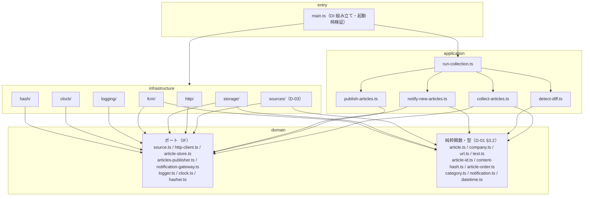

## 1. 目的と範囲

本書は、収集バッチ `collector/` が**どう動くか**を定める。[D-01](D-01.md) が「何を出力するか（`articles.json`・`companies.json`・`id` / `contentHash` の規則・通知ペイロード）」を決めたのに対し、本書は (1) 層構成と手動 DI の組み立て、(2) `Source` インターフェースと Source↔Company の対応付け、(3) `infrastructure/http` のラッパー（User-Agent・間隔・タイムアウト・文字コード）、(4) application の 5 UseCase（`collect-articles`・`detect-diff`・`publish-articles`・`notify-new-articles`・`run-collection`）の入出力と手順、(5) `infrastructure/storage`（`articles.json` の読み書き・原子性・git への確定）、(6) `infrastructure/fcm` の送信、(7) GitHub Actions のワークフロー（cron・権限・Secrets・GitHub Pages デプロイ・失敗の検知）、(8) ログと終了コードを決める。決めないのは、団体別のセレクタ・URL 規則・日付書式・カテゴリ対応表（[D-03](D-03.md)）と、app 側のすべて（[D-04](D-04.md)・[D-05](D-05.md)）である。D-01 の決定（§8 #1〜#34）は本書の前提であり、変更しない。

## 2. 要件との対応

| 要件 | 本書での扱い | 節 |
|---|---|---|
| F-07 プッシュ通知（送信側） | `notify-new-articles` が団体ごとに 1 通を `NotificationGateway` へ送る。文面は D-01 §4.8 の `buildNotificationText`。送信は `articles.json` が `main` へ push 成功した後だけ（D-01 #33 の不変条件を `run-collection` が保証する） | §5.4 / §5.5 |
| F-11 更新記事の再浮上（検知側） | `detect-diff` が前回スナップショットと `contentHash` で突合し、不一致の記事の `updatedAt` を `generatedAt` にする（D-01 §5.2 の表） | §5.2 |
| R-2 サイト改装で収集が壊れる | Source は 1 団体 1 実装で相互に import せず、`Promise.allSettled` で並行実行する。例外・取得 0 件の両方を Source 失敗として数え、実行サマリと GitHub Actions のジョブ結果で開発者に知らせる（失敗が 1 つでもあればジョブを失敗させ、GitHub の既定のワークフロー失敗通知に任せる。§8 #25）。1 Source の失敗は他団体に波及せず、前回の記事は保持される | §5.1 / §6 / §5.6 |
| R-7 cron の遅延 | cron は毎時 7 分に 1 回。遅延しても `generatedAt`（実行開始時刻）を基準に差分を取るだけで、二重通知・取りこぼしは起きない。`concurrency` で実行を直列化し、遅延で重なった実行が同時に push しないようにする | §5.6 / §8 #15 |
| 要件 §5 相手サイトへの配慮 | `infrastructure/http` が User-Agent（D-01 §4.7 の実値）を必ず送り、同一ホストへのリクエストを直列化して最小間隔を空け、タイムアウトを設ける。robots.txt は §8 #6 の扱い | §5.7 / §8 #6 |
| 要件 §5 収集間隔 1 時間 / 運用コスト 0 円 | GitHub Actions の cron 1 本（1 実行あたり数十秒）と GitHub Pages のみ。外部サーバを持たない | §5.6 |
| 要件 §6.1 収集手順（巡回 → 正規化 → 差分 → コミット → 通知） | `run-collection` の 6 ステップがこの順序を実装する | §5.5 |

### 2.1 画面定義との対応（scope: app のみ）

該当なし。本書は scope: collector であり、画面定義書を参照しない。

## 3. 構成

### 3.1 層と依存の方向



矢印はすべて外側 → 内側で、逆向きは無い。`infrastructure` から `application` への矢印も無い（infrastructure は domain のポートだけを実装する）。具象クラスを import するのは `main.ts` だけ（CLAUDE.md）。`run-collection` が他の 4 UseCase を呼ぶのは同一層内の依存で、参照はクラスではなく各 UseCase が公開するインターフェース（§4.6）に対して行う。

### 3.2 ファイル配置

`（D-01）` は D-01 §3.2 が所有し本書では作らないファイル、`（D-03）` は D-03 が所有するファイル。

```
collector/
  package.json            scripts / 依存（§4.9）
  tsconfig.json           strict（§4.9）
  eslint.config.js        typescript-eslint strict
  .prettierrc.json
  vitest.config.ts
  src/
    domain/
      article.ts              （D-01）
      company.ts              （D-01）
      category.ts             （D-01）
      category-keywords.ts    （D-01）
      url.ts                  （D-01）
      text.ts                 （D-01）
      hasher.ts               （D-01）
      article-id.ts           （D-01）
      content-hash.ts         （D-01）
      article-order.ts        （D-01）
      notification.ts         （D-01）
      datetime.ts             toJstDateTime / jstDateOnly / InvalidDateTimeError（§4.2）
      source.ts               RawArticle・Source・SourceError（§4.1）
      http-client.ts          HttpClient・HttpError（§4.3）
      article-store.ts        ArticleReader・ArticleWriter・ArticlesValidationError（§4.4）
      articles-publisher.ts   ArticlesPublisher・PublishOutcome・PublishFailedError（§4.4）
      notification-gateway.ts NotificationGateway・NotificationSendError（§4.5）
      logger.ts               Logger・LogLevel・LogFields（§4.7）
      clock.ts                Clock（§4.7）
    application/
      collect-articles.ts     CollectArticles（§5.1）
      detect-diff.ts          DetectDiff（§5.2）
      publish-articles.ts     PublishArticles（§5.3）
      notify-new-articles.ts  NotifyNewArticles（§5.4）
      run-collection.ts       RunCollection・RunSummary（§5.5）
    infrastructure/
      http/
        fetch-http-client.ts  HttpClient 実装（UA・間隔・タイムアウト・リトライ・文字コード）
        host-scheduler.ts     ホストごとの直列化と最小間隔
      sources/
        takarazuka.ts shiki.ts horipro.ts toho.ts shinkansen.ts   （D-03）
      storage/
        articles-file-store.ts    ArticleReader + ArticleWriter 実装（§5.3）
        companies-file-store.ts   companies.json の読み込みと検証（main.ts が使う）
        git-articles-publisher.ts ArticlesPublisher 実装（git add / commit / push）
        json-format.ts            決定的シリアライズ（D-01 §4.2 書式）
        run-summary-store.ts      実行サマリ（§4.8）の書き出し
      fcm/
        firebase-notification-gateway.ts  NotificationGateway 実装
        noop-notification-gateway.ts      送信せずログだけ残す実装
      logging/
        console-logger.ts     Logger 実装
      clock/
        system-clock.ts       Clock 実装
      hash/
        sha256-hasher.ts      （D-01）
    main.ts                 DI 組み立てとエントリ（§5.5）
  test/
    application/
      collect-articles.test.ts
      detect-diff.test.ts
      publish-articles.test.ts
      notify-new-articles.test.ts
      run-collection.test.ts
    domain/
      contract.test.ts        （D-01）
    helpers/                  テストダブル（§7.2）
    fixtures/
      contract/               （D-01）
      sources/                （D-03。実サイトの HTML / RSS）
data/
  companies.json            （D-01）
  articles.json             （D-01）
.github/workflows/
  collect.yml               収集 + Pages デプロイ（§5.6）
  collector-ci.yml          品質ゲート（§5.6）
```

CLAUDE.md の `infrastructure/` の列挙（`sources` / `http` / `fcm` / `storage`）に `logging` / `clock` / `hash` を加える。いずれも domain のポートの実装であり、依存の方向の規約は満たす（§8 #19）。

## 4. データ

### 4.1 Source インターフェースと素材（`domain/source.ts`）

```ts
import type { Category } from "./article";

/**
 * Source が抽出した記事の「素材」。
 * id・contentHash・fetchedAt・updatedAt は持たない（application が確定する。D-01 §5 冒頭の推奨・§8.1）。
 * 団体固有の URL 正規化（R-8）・相対 URL の解決・publishedAt の書式変換・category 判定は Source が済ませる（D-03）。
 */
export interface RawArticle {
  readonly companyId: string;    // 実装した団体の Company.id。application が呼び出し時の Company.id と突合する（D-01 §4.2）
  readonly title: string;        // 生の見出し。正規化（normalizeTitle）は application
  readonly url: string;          // 絶対 URL。汎用正規化（normalizeUrl）は application
  readonly category: Category;   // D-01 §5.3 の手順で Source が決めた 1 値
  readonly publishedAt: string;  // D-01 §4.1 の書式（YYYY-MM-DDTHH:mm:ss+09:00）。変換は domain/datetime.ts
  readonly thumbnail?: string;   // 取得できた場合のみ。検証は application（D-01 §5.4）
}

/**
 * 1 団体の取得処理。契約は「入力なし → 記事の配列、失敗は例外」（CLAUDE.md リスコフ置換）。
 * 取得先 URL は実装に埋め込まず、コンストラクタで受け取った Company.sources を使う（D-01 #20）。
 * 記事は Company.sources の配列順 → 各ページの出現順（ページ送りは 1 ページ目から）で返す（D-01 §6 の重複規則の根拠）。
 */
export interface Source {
  /** ログ用の識別子。既定は Company.id */
  readonly id: string;
  fetch(): Promise<readonly RawArticle[]>;
}

/** Source が投げる失敗。cause に原因（HttpError・パース失敗）を入れる */
export class SourceError extends Error {
  constructor(message: string, options?: { cause?: unknown }) {
    super(message, options);
    this.name = "SourceError";
  }
}
```

`Source` の戻り値の要素型を `Article` ではなく `RawArticle` にするのは、`id`・`contentHash`・`fetchedAt`・`updatedAt` を application が確定するという D-01 §5 の推奨に従うためである（§8 #1）。契約の形（入力なし → 配列、失敗は例外）は CLAUDE.md のとおり維持する。

### 4.2 日時の変換（`domain/datetime.ts`）

D-01 §4.1 の書式への変換は 5 団体すべてで必要になるため、Source 間のコピーを避けて domain に置く（CLAUDE.md「共通処理は domain / application の抽象に寄せる」）。

```ts
export class InvalidDateTimeError extends Error {}

const JST_OFFSET_MS = 9 * 60 * 60 * 1000;

/** 瞬間 → JST の YYYY-MM-DDTHH:mm:ss+09:00（秒精度。ミリ秒は切り捨て） */
export function toJstDateTime(instant: Date): string {
  const ms = instant.getTime();
  if (!Number.isFinite(ms)) throw new InvalidDateTimeError("invalid Date");
  const shifted = new Date(ms + JST_OFFSET_MS);           // UTC のゲッタで JST の壁時計を読む
  const p = (n: number, w = 2): string => String(n).padStart(w, "0");
  return (
    `${p(shifted.getUTCFullYear(), 4)}-${p(shifted.getUTCMonth() + 1)}-${p(shifted.getUTCDate())}` +
    `T${p(shifted.getUTCHours())}:${p(shifted.getUTCMinutes())}:${p(shifted.getUTCSeconds())}+09:00`
  );
}

/** JST の年月日（時刻を持たないサイト）→ YYYY-MM-DDT00:00:00+09:00。実在しない日付は例外（D-01 §6「publishedAt を解釈できない」） */
export function jstDateOnly(year: number, month: number, day: number): string {
  const utc = Date.UTC(year, month - 1, day);
  const d = new Date(utc);
  if (d.getUTCFullYear() !== year || d.getUTCMonth() + 1 !== month || d.getUTCDate() !== day) {
    throw new InvalidDateTimeError(`invalid date: ${year}-${month}-${day}`);
  }
  return toJstDateTime(new Date(utc - JST_OFFSET_MS));
}
```

RSS の `pubDate`（RFC822・任意のオフセット）は `new Date(pubDate)` で瞬間にしてから `toJstDateTime` を通す（同じ瞬間を +09:00 で表記する。D-01 §4.1）。`Number.isNaN(d.getTime())` のときは Source が `publishedAt` に空文字を入れず、その記事を捨てるか `InvalidDateTimeError` を投げる（D-03）。

### 4.3 HTTP ポート（`domain/http-client.ts`）

```ts
export class HttpError extends Error {
  constructor(
    message: string,
    readonly url: string,
    readonly status?: number,
    options?: { cause?: unknown },
  ) {
    super(message, options);
    this.name = "HttpError";
  }
}

export interface HttpClient {
  /**
   * URL を GET し、本文を文字列で返す。
   * 2xx 以外・タイムアウト・ネットワーク失敗・文字コードのデコード失敗は HttpError を投げる。
   * リダイレクトは追う。リクエスト間隔・タイムアウト・リトライ・User-Agent は実装（§5.7）が持つ。
   */
  getText(url: string): Promise<string>;
}
```

`sources/` はこのインターフェースだけに依存し、`fetch` を直接呼ばない（CLAUDE.md）。実装は `infrastructure/http/fetch-http-client.ts`、注入は `main.ts`。

### 4.4 storage のポート（`domain/article-store.ts`・`domain/articles-publisher.ts`）

利用側の UseCase が必要とするメソッドだけを持つよう、読み・書き・確定を 3 つに分ける（CLAUDE.md インターフェース分離）。

```ts
// domain/article-store.ts
import type { ArticlesFile } from "./article";

export interface ArticleReader {
  /**
   * 前回の data/articles.json を読む（D-01 §5.2 の「前回」＝実行開始時にチェックアウトした main の内容）。
   * ファイルが無い・JSON として壊れている・ArticlesFileSchema に合わない（schemaVersion 違いを含む）ときは
   * undefined を返す（例外にしない）。undefined は「通知を送らない」根拠になる（D-01 #15）。
   */
  readPrevious(): Promise<ArticlesFile | undefined>;
}

export interface ArticleWriter {
  /**
   * data/articles.json を書き出す。buildArticlesFileWriteSchema（D-01 §4.2）で検証し、
   * 失敗したら ArticlesValidationError を投げて**書き出さない**（D-01 §6）。書き出しは原子的（§5.3）。
   */
  write(file: ArticlesFile): Promise<void>;
}

export class ArticlesValidationError extends Error {}
```

```ts
// domain/articles-publisher.ts
export type PublishOutcome = "published" | "no_changes";

export interface ArticlesPublisher {
  /**
   * 書き出し済みの data/articles.json を main へ確定させる（git add → commit → push）。
   * 変更が無ければ "no_changes"。commit・push のいずれかが失敗したら PublishFailedError（D-01 #33）。
   */
  publish(commitMessage: string): Promise<PublishOutcome>;
}

export class PublishFailedError extends Error {}
```

### 4.5 通知のポート（`domain/notification-gateway.ts`）

```ts
import type { NewArticlesNotification } from "./notification";

export interface NotificationGateway {
  /** 1 通送る。失敗は NotificationSendError。再送は行わない（D-01 §4.8 至多 1 回） */
  send(notification: NewArticlesNotification): Promise<void>;
}

export class NotificationSendError extends Error {}
```

### 4.6 UseCase の入出力型（`application/`）

```ts
// application/collect-articles.ts
import type { Article } from "../domain/article";
import type { Company } from "../domain/company";
import type { Source } from "../domain/source";

/** id・contentHash まで確定し、fetchedAt・updatedAt がまだ無い記事 */
export type CollectedArticle = Omit<Article, "fetchedAt" | "updatedAt">;

/** Source と Company の対応付け（D-01 §8.1）。main.ts が companies.json の配列順に組み立てる */
export interface SourceBinding {
  readonly company: Company;
  readonly source: Source;
}

export type SourceFailureReason = "error" | "empty" | "all_rejected" | "not_implemented";

export interface SourceFailure {
  readonly companyId: string;
  readonly sourceId: string;
  readonly reason: SourceFailureReason;
  readonly message: string;
}

export interface CollectArticlesResult {
  /** companies.json の配列順 → Source の返却順。id の重複は除去済み */
  readonly articles: readonly CollectedArticle[];
  readonly failures: readonly SourceFailure[];
  /** 破棄した記事の件数（URL 不正・見出し空・日付不正・companyId 不一致の合計） */
  readonly discarded: number;
}

export interface CollectArticlesUseCase {
  execute(): Promise<CollectArticlesResult>;
}
```

```ts
// application/detect-diff.ts
import type { Article, ArticlesFile } from "../domain/article";
import type { Company } from "../domain/company";

export interface DetectDiffInput {
  /** 前回の articles.json。undefined なら全件が新着になり、通知対象は空になる（D-01 #15） */
  readonly previous: ArticlesFile | undefined;
  readonly collected: readonly CollectedArticle[];
  readonly companies: readonly Company[];   // companies.json の配列順
  readonly generatedAt: string;             // 実行開始時刻（D-01 §4.2）
}

export interface DetectDiffResult {
  readonly file: ArticlesFile;
  /** articles 配列が前回と 1 か所でも違うか。false なら書き出さない（§8 #8） */
  readonly changed: boolean;
  /** 通知対象。キーは companyId、値は compareArticles 順の新着記事。previous が undefined のときは空 */
  readonly newArticlesByCompany: ReadonlyMap<string, readonly Article[]>;
  readonly stats: {
    readonly created: number;   // 新着
    readonly updated: number;   // 更新
    readonly carried: number;   // 継続（今回も取れた + 一覧から消えたが保持）
    readonly dropped: number;   // 100 件上限で落ちた
  };
}

export interface DetectDiffUseCase {
  execute(input: DetectDiffInput): DetectDiffResult;   // I/O を持たないので同期
}
```

```ts
// application/publish-articles.ts
import type { ArticlesFile } from "../domain/article";
import type { PublishOutcome } from "../domain/articles-publisher";

export interface PublishArticlesInput {
  readonly file: ArticlesFile;
  readonly commitMessage: string;
}

export interface PublishArticlesUseCase {
  /** 書き出し（検証込み）→ コミット → push。失敗は例外（ArticlesValidationError / PublishFailedError） */
  execute(input: PublishArticlesInput): Promise<PublishOutcome>;
}
```

```ts
// application/notify-new-articles.ts
import type { Article } from "../domain/article";
import type { Company } from "../domain/company";

export interface NotifyNewArticlesInput {
  readonly newArticlesByCompany: ReadonlyMap<string, readonly Article[]>;
  readonly companies: readonly Company[];   // 送信順は配列順（D-01 §4.8）
}

export interface NotifyNewArticlesResult {
  readonly sent: number;
  readonly failed: number;
}

export interface NotifyNewArticlesUseCase {
  execute(input: NotifyNewArticlesInput): Promise<NotifyNewArticlesResult>;
}
```

### 4.7 ログと時刻のポート（`domain/logger.ts`・`domain/clock.ts`）

```ts
// domain/logger.ts
export const LOG_LEVELS = ["debug", "info", "warn", "error"] as const;
export type LogLevel = (typeof LOG_LEVELS)[number];

/** 構造化フィールド。値は 1 行に収まるスカラーのみ（dynamic / any を使わない） */
export type LogFields = Readonly<Record<string, string | number | boolean>>;

export interface Logger {
  debug(message: string, fields?: LogFields): void;
  info(message: string, fields?: LogFields): void;
  warn(message: string, fields?: LogFields): void;
  error(message: string, fields?: LogFields): void;
}
```

```ts
// domain/clock.ts
export interface Clock {
  now(): Date;
}
```

`ConsoleLogger` は `debug` / `info` を stdout、`warn` / `error` を stderr に 1 行 1 イベントで書く。書式は `<level> <message> key=value key=value`（値に空白・`=` が含まれる場合は `JSON.stringify` で囲む）。出力レベルは環境変数 `CURTAINCALL_LOG_LEVEL`（既定 `info`）。秘密情報（サービスアカウント JSON、トークン）は一切フィールドに載せない。

### 4.8 実行サマリ（`.run-summary.json`）

collector は Actions 固有の API（`$GITHUB_OUTPUT` 等）を知らない。代わりに 1 実行の結果を JSON ファイルに書き、ワークフローがそれを読んでジョブの出力・ステップサマリにする（§8 #13）。リポジトリにはコミットしない（`.gitignore`）。

```ts
// application/run-collection.ts
export interface RunSummary {
  readonly generatedAt: string;          // この実行の基準時刻
  readonly published: boolean;           // articles.json を main へ push したか
  readonly changed: boolean;             // 記事配列に変化があったか
  readonly collected: number;            // 収集して採用した記事数
  readonly discarded: number;
  readonly created: number;
  readonly updated: number;
  readonly dropped: number;
  readonly sourceFailures: readonly SourceFailure[];
  readonly notificationsSent: number;
  readonly notificationsFailed: number;
  readonly durationMs: number;
}
```

```json
{
  "generatedAt": "2026-09-19T15:07:03+09:00",
  "published": true,
  "changed": true,
  "collected": 142,
  "discarded": 0,
  "created": 3,
  "updated": 1,
  "dropped": 2,
  "sourceFailures": [{ "companyId": "toho", "sourceId": "toho", "reason": "empty", "message": "no articles parsed" }],
  "notificationsSent": 1,
  "notificationsFailed": 0,
  "durationMs": 8421
}
```

### 4.9 プロジェクト設定と環境変数

```json
// collector/package.json（抜粋）
{
  "name": "curtaincall-collector",
  "private": true,
  "type": "module",
  "engines": { "node": ">=22" },
  "scripts": {
    "build": "tsc -p tsconfig.json",
    "start": "node dist/main.js",
    "lint": "eslint . && prettier --check .",
    "typecheck": "tsc -p tsconfig.json --noEmit",
    "test": "vitest run"
  },
  "dependencies": {
    "zod": "^3.23.0",
    "cheerio": "^1.0.0",
    "rss-parser": "^3.13.0",
    "firebase-admin": "^13.0.0"
  },
  "devDependencies": {
    "typescript": "^5.6.0",
    "vitest": "^2.1.0",
    "eslint": "^9.0.0",
    "typescript-eslint": "^8.0.0",
    "prettier": "^3.3.0",
    "@types/node": "^22.0.0"
  }
}
```

```jsonc
// collector/tsconfig.json（抜粋）
{
  "compilerOptions": {
    "target": "es2023",
    "module": "nodenext",
    "moduleResolution": "nodenext",
    "lib": ["es2023"],
    "types": ["node"],
    "rootDir": "src",
    "outDir": "dist",
    "strict": true,
    "noUncheckedIndexedAccess": true,
    "exactOptionalPropertyTypes": true,
    "noImplicitOverride": true,
    "verbatimModuleSyntax": true,
    "skipLibCheck": true
  },
  "include": ["src", "test", "vitest.config.ts", "eslint.config.js"]
}
```

`exactOptionalPropertyTypes: true` のため、省略可能フィールド（`thumbnail`・`updatedAt`）は `undefined` を代入せず、条件付きスプレッドで組み立てる（D-01 #2「キー省略」と一致する）。

```ts
const article: Article = {
  ...base,
  ...(thumbnail !== undefined ? { thumbnail } : {}),
  ...(updatedAt !== undefined ? { updatedAt } : {}),
};
```

| 環境変数 | 必須 | 既定 | 用途 |
|---|---|---|---|
| `FIREBASE_SERVICE_ACCOUNT` | いいえ | 未設定 | Firebase サービスアカウント JSON の全文。未設定なら `NoopNotificationGateway` を注入し通知を送らない（§8 #16） |
| `CURTAINCALL_LOG_LEVEL` | いいえ | `info` | `debug` / `info` / `warn` / `error` |
| `CURTAINCALL_FULL_CRAWL` | いいえ | 未設定 | `1` のとき、ページ送りを持つ Source が**全団体**について初回相当の範囲まで遡る（手動の明示指定）。未設定でも、前回の `articles.json` にその団体の記事が 1 件も無ければその団体だけ自動で遡る（§5.5 `main.ts` 手順 5、§8 #27） |
| `CURTAINCALL_SUMMARY_PATH` | いいえ | `collector/.run-summary.json` | 実行サマリの出力先 |
| `CURTAINCALL_REPO_ROOT` | いいえ | `main.js` から 2 階層上 | `data/` と git 操作の基準ディレクトリ |
| `CURTAINCALL_DRY_RUN` | いいえ | 未設定 | `1` のとき書き出し・push・通知を行わない（ローカル確認用）。`main.ts` が Noop 実装を注入する |

`.gitignore` に `collector/dist/`・`collector/node_modules/`・`collector/.run-summary.json`・`data/articles.json.tmp` を加える。

## 5. 処理フロー（正常系）

### 5.1 collect-articles（全 Source の並行実行と正規化）

- **責務**：すべての Source を実行し、素材（`RawArticle`）を `CollectedArticle` に確定する。1 public メソッド `execute()`。
- **依存（コンストラクタ注入）**：`bindings: readonly SourceBinding[]`（`companies.json` の配列順。`main.ts` が組む）、`hasher: Hasher`、`logger: Logger`
- **入力**：なし
- **ステップ**：
  1. `const settled = await Promise.allSettled(bindings.map((b) => b.source.fetch()))`（調査レポート §7.1、R-2）
  2. `settled` を `bindings` と同じ添字で走査する（`companies.json` の配列順。完了順に依存させない。D-01 §6・§8.1）
  3. `status === "rejected"` の binding：`failures` に `{ reason: "error" }` を追加し `logger.warn("source failed", { companyId, sourceId, error })`。その団体の記事は 0 件（前回の記事は `detect-diff` が保持する）
  4. `status === "fulfilled"` で配列が空の binding：`failures` に `{ reason: "empty" }` を追加し `logger.warn`。改装でセレクタが一致しなくなった場合は例外ではなく 0 件になるため、0 件も失敗として数える（R-2。§8 #3）
  5. 各 `RawArticle` を次の順で確定する。いずれかで失敗した記事は**その記事だけ**を捨て、`discarded` を増やす（D-01 §6）
     1. `companyId` の突合：`raw.companyId !== binding.company.id` → 捨てて `logger.warn("companyId mismatch", { sourceId, expected, actual })`（D-01 §4.2・#32）
     2. `url = normalizeUrl(raw.url)`：`InvalidArticleUrlError` → 捨てて `warn`
     3. `id = buildArticleId(hasher, url)`
     4. `title = normalizeTitle(raw.title)`：空文字 → 捨てて `warn`
     5. `publishedAt`：`DateTimeSchema.safeParse` が失敗 → 捨てて `warn`
     6. `category`：`CategorySchema.safeParse` が失敗 → `other` にして `warn`（記事は残す。型では保証されるが Source は infrastructure なので実行時の防衛を置く）
     7. `thumbnail`：`raw.thumbnail` が `undefined`・空文字・`HttpUrlSchema.safeParse` 失敗 → キーを省略して `logger.debug`。成功ならそのまま格納（D-01 §5.4）
     8. `contentHash = buildContentHash(hasher, title)`
  6. 1 binding の取得件数が 1 件以上で採用が 0 件 → `failures` に `{ reason: "all_rejected" }` を追加（D-01 §6「1 Source の全記事が破棄されたら Source 失敗」）
  7. 重複 `id`：走査順に `Map<string, CollectedArticle>` へ入れ、既にあるキーは捨てて `logger.debug("duplicate id", { id, companyId })`。走査順が「`companies.json` の配列順 → `Company.sources` の配列順 → 出現順」になるのは手順 2 と `Source` の契約（§4.1）による
  8. `logger.info("collected", { companies, articles, discarded, failures })`
- **出力**：`CollectArticlesResult`
- **失敗時**：Source 由来の失敗は `failures` に集約して例外にしない（1 サイトの故障を他に波及させない。R-2）。`hasher` など依存自体の例外は上位へ投げる（`run-collection` が致命的失敗として扱う）

### 5.2 detect-diff（前回との突合・確定・切り詰め）

- **責務**：前回スナップショットと今回の収集結果から、書き出す `ArticlesFile` と通知対象を確定する。1 public メソッド `execute(input)`。
- **依存**：`logger: Logger`
- **入力**：`DetectDiffInput`（§4.6）
- **ステップ**：
  1. `knownIds = new Set(companies.map((c) => c.id))`
  2. `previousById`：`previous?.articles` のうち `knownIds` に含まれる `companyId` の記事だけを `Map<id, Article>` にする。除外した記事は `logger.info("dropping article of removed company", { companyId, id })`（D-01 §6）
  3. 今回の各 `CollectedArticle` を D-01 §5.2 手順 4 の表で確定する（`Article` は不変なので新しいオブジェクトを作る）

| 前回 | 今回 | 判定 | `fetchedAt` | `updatedAt` | `contentHash` | その他 |
|---|---|---|---|---|---|---|
| 無し | 有り | 新着 | `generatedAt` | キー省略 | 今回 | 今回の値 |
| 有り・ハッシュ一致 | 有り | 継続 | 前回 | 前回（無ければ省略） | 前回（＝今回） | 今回の値 |
| 有り・ハッシュ不一致 | 有り | 更新 | 前回 | `generatedAt` | 今回 | 今回の値 |
| 有り | 無し | 継続（保持） | 前回 | 前回 | 前回 | 前回の値 |

  4. 今回に現れなかった `previousById` の記事をそのまま加える（サイトの一覧から消えても上限まで残す。D-01 #7）。Source が失敗した団体の記事もこの行で保持される
  5. 団体ごとに `compareArticles`（D-01 §4.5）で並べ、上位 `MAX_ARTICLES_PER_COMPANY`（100）件を残す。落ちた件数を `stats.dropped` に数える
  6. 出力の `articles` は `companies` の配列順に団体ブロックを連結する（D-01 §4.2）。`companies` に無い `companyId` は手順 2 で除いてあるため残らない
  7. 通知対象：手順 3 で「新着」と判定され、**かつ手順 5 の切り詰め後にも残っている**記事だけを `companyId` ごとに集め、`compareArticles` 順に並べる（`articles.json` に無い記事は通知しない）
  8. `previous === undefined` のとき、手順 7 の結果を空の `Map` に置き換える（D-01 #15。通知抑止の判定はここ 1 か所だけで行う）
  9. `changed = previous === undefined || !hasSameArticles(previous.articles, file.articles)`。`hasSameArticles` は長さと各要素の 9 フィールドを順に比較する非公開関数（`generatedAt` は比較しない。§8 #8）
  10. `file = { schemaVersion: ARTICLES_SCHEMA_VERSION, generatedAt, articles }`
- **出力**：`DetectDiffResult`
- **失敗時**：I/O を持たないため例外は発生しない（前回ファイルが無い・壊れている場合は `previous === undefined` として `ArticleReader` が渡す）

### 5.3 publish-articles（書き出し → 検証 → コミット → push）

- **責務**：今回の `articles.json` を `main` に確定させる。1 public メソッド `execute(input)`。
- **依存**：`writer: ArticleWriter`、`publisher: ArticlesPublisher`、`logger: Logger`
- **入力**：`PublishArticlesInput`（§4.6）
- **ステップ**：
  1. `await writer.write(input.file)`
     - `buildArticlesFileWriteSchema(knownCompanyIds).safeParse(file)`（`knownCompanyIds` は `ArticlesFileStore` のコンストラクタ注入）。失敗 → `ArticlesValidationError`（issue の先頭 5 件を `error` ログに出す）。**書き出さない**（D-01 §6）
     - `serializeArticlesFile(file)`：`JSON.stringify(file, null, 2) + "\n"`。キー順は D-01 §4.1 の宣言順（オブジェクトをその順で組み立てる）、`undefined` のキーは `JSON.stringify` が自動で省く
     - 原子的書き出し：同じディレクトリの `data/articles.json.tmp` に書き → `fsync` → `rename` で `data/articles.json` に置き換える（同一ファイルシステム上の `rename` は原子的）。途中で失敗したら `.tmp` を削除して例外
  2. `const outcome = await publisher.publish(input.commitMessage)`。`GitArticlesPublisher` の手順（`execFile("git", args, { cwd: repoRoot })`。シェルを介さず、引数は固定文字列と `commitMessage` のみ）：
     1. `git add -- data/articles.json`
     2. `git diff --cached --quiet -- data/articles.json` → 終了コード 0（差分なし）なら `"no_changes"` を返してここで終わる（`detect-diff` の `changed` 判定に対する二重の安全網）
     3. `git -c user.name="github-actions[bot]" -c user.email="41898282+github-actions[bot]@users.noreply.github.com" commit -m <message>`（グローバル設定を書き換えない）
     4. `git push origin HEAD:main`
     5. 2〜4 のいずれかが非 0 終了 → `PublishFailedError`（stderr を `error` ログに出す）。**リトライ・`pull --rebase` は行わない**（§8 #10）
  3. `logger.info("published", { outcome, articles: input.file.articles.length })`
- **出力**：`PublishOutcome`
- **失敗時**：例外（`ArticlesValidationError` / `PublishFailedError`）。呼び出し側（`run-collection`）は通知を送らずに致命的失敗として終了する（D-01 #33）

### 5.4 notify-new-articles（新着の通知）

- **責務**：新着記事を団体ごとに 1 通の通知にして送る。1 public メソッド `execute(input)`。
- **依存**：`gateway: NotificationGateway`、`logger: Logger`
- **入力**：`NotifyNewArticlesInput`（§4.6）
- **ステップ**：
  1. `companies` の配列順に走査する（D-01 §4.8「複数団体は `companies.json` の順に 1 通ずつ」）
  2. その団体の新着が 0 件（キーが無い・空配列）なら送らない
  3. `const text = buildNotificationText(company.name, articles.map((a) => a.title))`（D-01 §4.8。`articles` は `compareArticles` 順で渡される）
  4. `NewArticlesNotification` を組み立てる：`topic = company.fcmTopic`、`notification = text`、`data = { schemaVersion: "1", type: "new_articles", companyId: company.id, count: String(articles.length) }`、`apns = { headers: { "apns-priority": "10" }, payload: { aps: { sound: "default", "thread-id": company.id } } }`
  5. `await gateway.send(notification)` → 成功なら `sent++` と `logger.info("notified", { companyId, count })`
  6. 送信が失敗したら `failed++` と `logger.error("notification failed", { companyId, count, error })` を記録し、**次の団体へ進む**（1 団体の失敗が他を止めない。D-01 §6）。再送しない（至多 1 回。D-01 §4.8）
- **出力**：`NotifyNewArticlesResult`
- **失敗時**：例外を外へ出さない（この UseCase の失敗は実行全体を失敗にしない。通知はベストエフォート。要件 §5）

`FirebaseNotificationGateway` は `firebase-admin/app` の `initializeApp({ credential: cert(JSON.parse(env.FIREBASE_SERVICE_ACCOUNT)) })`（`getApps().length === 0` のときだけ）と `getMessaging().send(notification)` を呼ぶ。`NewArticlesNotification`（D-01 §4.8）は `firebase-admin` の `Message` と構造的に一致しているためそのまま渡せる。例外は `NotificationSendError` に包んで投げ、原因は `cause` に入れる。サービスアカウントの内容はログに出さない。

### 5.5 run-collection と main.ts

**`RunCollection.execute()`**（application。順序の不変条件（D-01 #33）を持つ唯一の場所。§8 #11）

- **依存**：`collectArticles`・`detectDiff`・`publishArticles`・`notify`（いずれも §4.6 のインターフェース）、`reader: ArticleReader`、`clock: Clock`、`companies: readonly Company[]`、`logger: Logger`
- **ステップ**：
  1. `const startedAt = clock.now()`、`const generatedAt = toJstDateTime(startedAt)`
  2. `const previous = await reader.readPrevious()`（`undefined` なら `logger.warn("no previous snapshot; notifications suppressed")`）
  3. `const collect = await collectArticles.execute()`
  4. `const diff = detectDiff.execute({ previous, collected: collect.articles, companies, generatedAt })`
  5. `diff.changed === false` → 書き出さず、コミットもせず、通知もしない。`logger.info("no changes")` → 手順 8（新着があれば必ず `changed` が真になるため、通知の取りこぼしは起きない）
  6. `const outcome = await publishArticles.execute({ file: diff.file, commitMessage: buildCommitMessage(generatedAt) })`。例外はそのまま上位（`main.ts`）へ伝える＝**通知しない**
  7. `outcome === "published"` のときだけ `await notify.execute({ newArticlesByCompany: diff.newArticlesByCompany, companies })`
  8. `RunSummary`（§4.8）を組み立てて返す
- **出力**：`RunSummary`
- **失敗時**：手順 2〜6 の例外は呼び出し側へ。手順 7 は例外を出さない

コミットメッセージ：`chore(collector): articles.json を更新 (<generatedAt>)`（Conventional Commits。scope は CLAUDE.md の 4 つのうち `collector`）。

**`main.ts`**（entry。具象クラスを import してよい唯一の場所）

1. `ConsoleLogger` を作る（`CURTAINCALL_LOG_LEVEL`）
2. `repoRoot` を決める（`CURTAINCALL_REPO_ROOT` → 無ければ `main.js` の 2 階層上）
3. **起動時検証**：`CompaniesFileStore(repoRoot).load()` が `data/companies.json` を読み `CompaniesFileSchema`（strict）で検証する。失敗したら `error` ログを出して終了コード 1（収集を始めない。D-01 §8.1・§6）
4. 具象を生成する：`SystemClock`・`Sha256Hasher`・`FetchHttpClient`（§5.7 の設定）・`ArticlesFileStore(repoRoot, knownCompanyIds, logger)`・`GitArticlesPublisher(repoRoot, logger)`・通知ゲートウェイ（`FIREBASE_SERVICE_ACCOUNT` があれば `FirebaseNotificationGateway`、無ければ `NoopNotificationGateway`。§8 #16）
5. **`fullCrawl` の決定**（§8 #27）：`const previous = await reader.readPrevious()` を呼び、`fullCrawlCompanyIds: ReadonlySet<string>` を次の規則で作る。`process.env.CURTAINCALL_FULL_CRAWL === "1"` なら `companies` の全 `id`、そうでなければ `previous` が `undefined` か、`previous.articles` にその `companyId` の記事が 1 件も無い団体の `id`。`logger.info("full crawl", { companyIds })`。ここでの `readPrevious()` は `RunCollection` 手順 2 と同じ未変更のファイルを読むため、2 回読んでも結果は一致する（`articles.json` の書き出しは `RunCollection` 手順 6 以降）
6. `buildSourceBindings(companies, { http, logger, fullCrawlCompanyIds })`：`companyId → Source 生成関数` の表（`SOURCE_FACTORIES`）を引いて `SourceBinding[]` を `companies` の配列順に組む。各生成関数には `fullCrawl: fullCrawlCompanyIds.has(company.id)`（真偽値）を渡す。表に無い `id` は `logger.warn` で飛ばし、その団体は収集対象外にする（前回の記事は保持される。§6）。団体の追加はこの表への 1 行と `companies.json` への 1 要素だけで済む（CLAUDE.md 開放閉鎖）
7. `CURTAINCALL_DRY_RUN=1` のときは `ArticleWriter`・`ArticlesPublisher`・`NotificationGateway` を Noop 実装に差し替える
8. 4 つの UseCase と `RunCollection` を組み立てて `execute()` を呼ぶ
9. `RunSummaryStore` で `.run-summary.json` を書き、`logger.info("done", { ... })`、終了コード 0
10. 例外を捕まえたら `logger.error` を出し、サマリに書ける範囲（`generatedAt`・`published: false`）を書いて終了コード 1

終了コードは 0（正常終了。Source の部分失敗を含む）と 1（致命的失敗）の 2 値だけにし、詳細はサマリに載せる（§8 #13）。`process.exit()` は呼ばず `process.exitCode` を設定して自然終了させる（stdout のフラッシュを待つため）。

### 5.6 GitHub Actions ワークフロー

**`.github/workflows/collect.yml`**（収集 → push → 通知 → Pages デプロイ）

```yaml
name: collect
on:
  schedule:
    - cron: "7 * * * *"        # 毎時 7 分（UTC 指定だが毎時なので JST でも毎時 7 分）。遅延は許容（R-7）
  workflow_dispatch:
    inputs:
      full_crawl:
        description: "ページ送りを持つ情報源を初回相当の範囲まで遡る"
        type: boolean
        default: false
permissions:
  contents: write            # data/articles.json の push
  pages: write               # GitHub Pages のデプロイ
  id-token: write            # deploy-pages の OIDC
concurrency:
  group: collect
  cancel-in-progress: false  # 遅延で重なっても前の実行を殺さず順番に流す（R-7）
jobs:
  collect:
    runs-on: ubuntu-latest
    timeout-minutes: 15
    outputs:
      published: ${{ steps.summary.outputs.published }}
      failed_sources: ${{ steps.summary.outputs.failed_sources }}
    steps:
      - uses: actions/checkout@v4          # 既定で GITHUB_TOKEN を remote に保存 → git push に使える
      - uses: actions/setup-node@v4
        with:
          node-version: "22"
          cache: npm
          cache-dependency-path: collector/package-lock.json
      - run: npm ci
        working-directory: collector
      - run: npm run build
        working-directory: collector
      - name: 収集・差分・確定・通知
        working-directory: collector
        env:
          FIREBASE_SERVICE_ACCOUNT: ${{ secrets.FIREBASE_SERVICE_ACCOUNT }}
          CURTAINCALL_FULL_CRAWL: ${{ inputs.full_crawl && '1' || '' }}
        run: npm start                     # 非 0 = 致命的失敗。ここで止まれば push も通知も済んでいない
      - name: 実行サマリ
        id: summary
        working-directory: collector
        run: |
          echo "published=$(jq -r '.published' .run-summary.json)" >> "$GITHUB_OUTPUT"
          echo "failed_sources=$(jq -r '.sourceFailures | length' .run-summary.json)" >> "$GITHUB_OUTPUT"
          jq -r '"収集 \(.collected) 件 / 新着 \(.created) / 更新 \(.updated) / 通知 \(.notificationsSent) / 失敗した情報源 \(.sourceFailures | length)"' \
            .run-summary.json >> "$GITHUB_STEP_SUMMARY"
          jq -r '.sourceFailures[] | "- \(.companyId): \(.reason) \(.message)"' .run-summary.json >> "$GITHUB_STEP_SUMMARY"
      - name: Pages 用にアップロード
        if: steps.summary.outputs.published == 'true'
        uses: actions/upload-pages-artifact@v3
        with:
          path: data                        # data/ をサイトのルートとして公開（D-01 §4.7）
      - name: 情報源の失敗を検知（R-2）
        if: steps.summary.outputs.failed_sources != '0'
        run: |
          echo "失敗した情報源がある。ログとステップサマリを確認する" >&2
          exit 1                            # ジョブ失敗 → GitHub の既定のワークフロー失敗通知が届く（§8 #25）
  deploy-pages:
    needs: collect
    if: ${{ !cancelled() && needs.collect.outputs.published == 'true' }}
    runs-on: ubuntu-latest
    environment:
      name: github-pages
      url: ${{ steps.deploy.outputs.page_url }}
    steps:
      - id: deploy
        uses: actions/deploy-pages@v4
```

| 事項 | 内容 |
|---|---|
| Pages の公開方式 | リポジトリ設定の Pages ソースを **GitHub Actions** にする（1 回だけの手作業）。ブランチ公開では公開フォルダに `/` と `/docs` しか選べず、D-01 §4.7 の「`data/` をルートとして公開」を満たせない（§8 #14） |
| Pages デプロイを同じワークフローに置く理由 | `GITHUB_TOKEN` による push は他のワークフローを起動しない（GitHub の再帰防止）。`on: push` の別ワークフローにすると永久に発火しない（§8 #14） |
| 通知と Pages の順序 | 通知は collect ジョブの中（push 直後）に送られ、Pages 反映は待たない（D-01 §4.8。反映遅れは D-01 §6 で許容済み） |
| Secrets | `FIREBASE_SERVICE_ACCOUNT`（リポジトリ Secret。サービスアカウント JSON 全文）。`GITHUB_TOKEN` は既定。`permissions` は上記 3 つだけに絞る |
| 前提 | `main` にブランチ保護（push 制限・必須レビュー）をかけない。かける場合は `github-actions[bot]` を例外にする。かかっていると毎時 push が失敗し、通知も出ない |
| `jq` | ubuntu-latest に既定で入っている |

**`.github/workflows/collector-ci.yml`**（品質ゲート。D-01 §8.1 のパスフィルタ）

```yaml
name: collector-ci
on:
  pull_request:
    paths: ["collector/**", "data/companies.json", "app/assets/companies.json", ".github/workflows/collector-ci.yml"]
  push:
    branches: [main]
    paths: ["collector/**", "data/companies.json", "app/assets/companies.json", ".github/workflows/collector-ci.yml"]
permissions:
  contents: read
jobs:
  check:
    runs-on: ubuntu-latest
    defaults:
      run:
        working-directory: collector
    steps:
      - uses: actions/checkout@v4
      - uses: actions/setup-node@v4
        with: { node-version: "22", cache: npm, cache-dependency-path: collector/package-lock.json }
      - run: npm ci
      - run: npm run lint
      - run: npm run typecheck
      - run: npm test
```

`app/assets/companies.json` を含めるのは、同梱コピーの同期を検証する契約テスト（D-01 §7.1）を、そのファイルだけを変更した PR でも走らせるため。app 側のジョブは D-04 が別ファイル（`app-ci.yml`）で定義する。

### 5.7 http ラッパー（`infrastructure/http`）

```ts
export interface FetchHttpClientOptions {
  readonly userAgent: string;      // D-01 §4.7 の実値
  readonly timeoutMs: number;      // 既定 15000（§8 #26）
  readonly minIntervalMs: number;  // 同一ホストへの最小間隔。既定 1000（§8 #26）
  readonly maxRetries: number;     // 既定 1。対象は 429 / 5xx / ネットワーク失敗・タイムアウトのみ（§8 #26）
  readonly retryDelayMs: number;   // 既定 1000（§8 #26）
}
```

- **手順**：
  1. `new URL(url).host` でホストを取り、`HostScheduler` に入れる。同一ホストのリクエストは**直列**に実行し、直前のリクエスト完了から `minIntervalMs` 経過するまで待つ（要件 §5「リクエスト間隔を空ける」）。異なるホストは並行（Source 同士は別ホストなので `Promise.allSettled` の並行度を損なわない）
  2. `fetch(url, { method: "GET", redirect: "follow", signal: AbortSignal.timeout(timeoutMs), headers })`。`headers` は `User-Agent`（固定値）、`Accept: text/html,application/xhtml+xml,application/xml;q=0.9,*/*;q=0.8`、`Accept-Language: ja`
  3. `res.ok` でなければ `HttpError(status)`。`429` と `5xx` はリトライ対象、その他の `4xx` はリトライしない
  4. ネットワーク失敗・タイムアウト（`AbortError`）はリトライ対象
  5. リトライは `maxRetries` 回まで、`retryDelayMs` 待ってから。使い切ったら `HttpError`
  6. `const buffer = await res.arrayBuffer()` → 文字コードを決めて `new TextDecoder(label).decode(buffer)`
- **文字コードの決定順**：`Content-Type` ヘッダの `charset` → 本文先頭 2048 バイトを ASCII として読んだ `<meta charset>` / `<meta http-equiv="Content-Type">` → `utf-8`。`TextDecoder` が知らないラベルなら `utf-8` にフォールバックして `warn`。現行の 5 サイトはすべて UTF-8 だが、東宝の旧ドメイン `www.tohostage.com` は Shift_JIS のページを含む（調査レポート §5）。Node 22 は full ICU を同梱するので `shift_jis` をデコードできる
- **失敗時**：`HttpError`。Source はこれを捕まえて `SourceError` に包むか、そのまま投げる（どちらでも `collect-articles` は Source 失敗として扱う）
- **持たないもの**：robots.txt の実行時取得・解釈（§8 #6）、Cookie、`If-None-Match`（収集側は毎回本文が要る）、ヘッドレスブラウザ（CLAUDE.md）

## 6. 異常系・境界

D-01 §6 のうち担当層が collector の行は本書が実装する。以下は本書で新たに決める振る舞いを含む行の一覧。

| ケース | 期待する振る舞い | 担当 |
|---|---|---|
| `data/companies.json` が無い・スキーマ不一致・`id` / `fcmTopic` 重複 | 収集を始めず終了コード 1。`articles.json` は触らない（前回の内容が残る） | `main.ts` / `CompaniesFileStore` |
| `companies.json` に `SOURCE_FACTORIES` が持たない `id` がある | `warn`（`reason: "not_implemented"` として `failures` に数える）。その団体は収集せず、前回の記事は `detect-diff` が保持する | `main.ts` / `collect-articles` |
| 1 つの Source が例外を投げた | `Promise.allSettled` で受け、`failures` に記録して他団体を続行。その団体の記事は前回の値のまま残る（R-2） | `collect-articles` |
| 1 つの Source が 0 件を返した（改装でセレクタが一致しない） | 例外と同じく Source 失敗として数える（`reason: "empty"`）。記事は前回の値のまま（R-2 の主要な検知経路。§8 #3） | `collect-articles` |
| すべての Source が失敗した | 今回の収集結果は 0 件。`detect-diff` が前回の記事をそのまま出力するので `changed` は偽になり、書き出しも通知も起きない。`failures` が 5 件並ぶのでジョブは失敗する（§8 #25） | `collect-articles` / `run-collection` |
| HTTP が 4xx（404・403） | `HttpError`。リトライせず Source の失敗になる | `http` / `collect-articles` |
| HTTP が 429・5xx、タイムアウト、DNS 失敗 | `maxRetries` 回だけ `retryDelayMs` 後に再試行し、なお失敗なら `HttpError` | `http` |
| 応答の文字コードが不明・未知のラベル | UTF-8 として解釈し `warn`。記事は取れる限り取る | `http` |
| 応答が巨大（想定外の大きさ） | タイムアウトで打ち切られる。サイズ上限は設けない（5 サイトの一覧は数百 KB。要件に規定なし） | `http` |
| 記事 URL が相対・不正・`http(s)` 以外・2048 文字超 / 見出しが空 / `publishedAt` が書式外 | その記事だけ捨てて `warn`。1 Source の全記事が該当したら Source 失敗（D-01 §6） | `collect-articles` |
| `thumbnail` が不正 | キーを省略して記事は残す（`debug`） | `collect-articles` |
| Source の `companyId` が未知、または呼び出し時の `Company.id` と違う | 記事を捨てて `warn`（`expected` / `actual` を含む）。全記事が該当したら Source 失敗（D-01 §4.2・#32） | `collect-articles` |
| 同一実行内で `id` が重複 | 最初の 1 件を採用（走査順は `companies.json` 順 → `sources[]` 順 → 出現順）。`debug` ログ | `collect-articles` |
| 前回の `articles.json` が無い・JSON として壊れている・`schemaVersion` 不一致 | `readPrevious()` が `undefined` を返し `warn`。全件が新着として書き出され、**通知は送らない**（D-01 #15） | `ArticlesFileStore` / `detect-diff` |
| 前回ファイルにその団体の記事が 1 件も無い（初回実行・団体の追加・その団体だけ記事が消えた） | その団体だけ `fullCrawl: true` で Source を生成し、ページ送りを持つ情報源が初回相当の範囲まで遡る（`info` ログ）。`CURTAINCALL_FULL_CRAWL=1` / `workflow_dispatch` の `full_crawl` なら全団体を遡る（§8 #27） | `main.ts` |
| `companies.json` から団体を削除した | 前回ファイルのその団体の記事を引き継がず捨てる（`info`） | `detect-diff` |
| 記事配列に変化が無い（毎時の通常ケース） | 書き出さず、コミットも push も通知もしない。`generatedAt` だけが動くコミットを作らない（§8 #8）。Pages も再デプロイしない | `run-collection` |
| 書き出し前の検証に失敗（100 件超・`id` 重複・未知の `companyId`） | `ArticlesValidationError`。`data/articles.json` を書き換えず、通知も送らず終了コード 1 | `ArticlesFileStore` |
| `.tmp` への書き込み中に失敗 | `.tmp` を削除して例外。`articles.json` は前回のまま（`rename` 前なので壊れない） | `ArticlesFileStore` |
| 前回の実行が残した `.tmp` が存在する | 上書きする（内容は使わない）。`.gitignore` に入れてありコミットされない | `ArticlesFileStore` |
| `git push` が非 fast-forward で失敗（人手の push と競合） | `PublishFailedError` → 終了コード 1。**通知は送らない**。ローカルのコミットは runner と共に消え、次回実行が同じ記事を新着として再検出して通知する（遅延するが重複しない。D-01 #33・§6） | `GitArticlesPublisher` / `run-collection` |
| push 成功後、通知の途中で実行が停止した | 未送信分は失われる（至多 1 回）。次回は前回ファイルに含まれるため新着にならず再送されない（D-01 §6、要件 §5 ベストエフォート） | — |
| `FIREBASE_SERVICE_ACCOUNT` が未設定（フェーズ 5 より前。要件 §10） | `NoopNotificationGateway` を注入し、送信せず `info` ログだけ残す。ジョブは成功（§8 #16） | `main.ts` |
| `FIREBASE_SERVICE_ACCOUNT` が JSON として壊れている | 起動時に `error` ログを出して終了コード 1（収集を始めない。設定ミスを黙って握りつぶさない） | `main.ts` |
| 1 団体の FCM 送信が失敗した | `error` ログと `notificationsFailed` に数え、次の団体を送る。実行は成功扱い（通知はベストエフォート） | `notify-new-articles` |
| 切り詰めで新着記事が 100 件の外に落ちた | `articles.json` に無いので通知しない（§5.2 手順 7） | `detect-diff` |
| cron が遅延・欠落した（R-7） | 次の実行が同じ差分を検出する。`generatedAt` は実行開始時刻なので `fetchedAt` / `updatedAt` に矛盾は出ない | — |
| 遅延で 2 つの実行が重なった | `concurrency: group: collect` が直列化する。後の実行は前の push 済みの `main` をチェックアウトする | ワークフロー |
| Pages のデプロイが失敗した | `articles.json` は push 済みなので次回の実行（または手動再実行）で再デプロイされる。通知は既に送信済み（D-01 §6「反映遅れは許容」） | ワークフロー |
| `.run-summary.json` の書き出しに失敗した | `warn` を出して終了コード 0 のまま続行（サマリは副次情報。収集結果は既に確定している） | `main.ts` |

## 7. テスト方針

テストの単位は UseCase（CLAUDE.md）。Source・HTTP・storage・git・FCM・時計はすべて差し替える。ネットワークへは一切アクセスしない。パーサーのフィクスチャテスト（実サイトの HTML / RSS）は D-03 が `test/infrastructure/sources/` に置く。`main.ts`・`ConsoleLogger`・`SystemClock` の単体テストは書かない。

### 7.1 UseCase ごとのケース

「D-01」列は D-01 §7.2 の申し送り行との対応（本書はこれらをすべて含めなければならない）。

| UseCase | ケース | 差し替えるもの | D-01 |
|---|---|---|---|
| `collect-articles` | URL 正規化 5 例（大文字ホスト・フラグメント・`utm_`・`?p=` 保持・既定ポート）で `url` が正規化後になり、異表記が同じ `id` になる／相対 URL・`ftp:`・2049 文字は破棄され他は残る／`id` が 16 文字 `[0-9a-f]`／既知 URL の `id` が固定値 | Source スタブ、`Sha256Hasher` 実物 | §7.2 行 1 |
| `collect-articles` | 見出し正規化：空白・全角スペース・NFC・全角半角・大文字小文字の違いで同じ `contentHash`／`title` は入力の表記（NFC）のまま／1 文字違いで別ハッシュ／301 文字が 300 に／300 文字目がサロゲート前半なら 299／空は破棄 | 同上 | §7.2 行 2 |
| `collect-articles` | `thumbnail`：相対・`ftp:`・2049 文字・空文字で省略され記事は残る／妥当な URL はクエリを含めてそのまま | 同上 | §7.2 行 3 |
| `collect-articles` | category：候補なし → `other`／優先順位 3 例／タグ段階で決まればキーワード段階に進まない／対応表に無いタグは無視／全角半角・大小文字を無視／共通表と団体別表の両方が候補になる／空文字は一致しない | Source スタブ（`siteTags` / `CategoryTagMap` / `CategoryKeywordTable` を渡す） | §7.2 行 4 |
| `collect-articles` | 同一実行内の重複 `id`：`companies.json` 順 → `sources[]` 順 → 出現順で最初の 1 件が残る／Source の**完了順**を入れ替えても結果が同じ | 完了を遅延させる Source スタブ | §7.2 行 5 |
| `collect-articles` | `companyId`：未知 ID は捨てて `warn`／全記事が該当なら Source 失敗で他団体は無事／既知 ID の取り違え（`shiki` に配線したスタブが `toho` を返す）で全件破棄・`expected` / `actual` がログに出る・`toho` の記事は無傷／混在なら一致分だけ残る | Source スタブ、`RecordingLogger` | §7.2 行 6 |
| `collect-articles` | Source が例外を投げても他の Source の記事が残り `failures` に 1 件入る／0 件を返した Source が `reason: "empty"` で失敗になる／全 Source 失敗で `articles` が空・`failures` が 5 件 | Source スタブ | 追加 |
| `detect-diff` | D-01 §5.2 の表の 4 行で `fetchedAt` / `updatedAt` / `contentHash` が表どおり／継続で `thumbnail`・`publishedAt` が今回値に上書き／前回の未知 `companyId` は引き継がない | メモリ上の `ArticlesFile` | §7.2 行 7 |
| `detect-diff` | 切り詰め：101 件で `compareArticles` の末尾 1 件が落ちる／`updatedAt` 優先／`fetchedAt` 降順／`id` 昇順／同じ入力で同じ結果／団体順が `companies.json` 順 | 同上 | §7.2 行 8 |
| `detect-diff` | 前回が `undefined`（無い・`schemaVersion: 2`・壊れている）→ 全件新着・通知対象が空 | `previous: undefined` | §7.2 行 9 |
| `detect-diff` | `changed`：記事が同一なら偽（`generatedAt` だけ違っても偽）／`thumbnail` だけ変わったら真／新着・更新・消失・切り詰めのいずれでも真／前回が `undefined` なら真 | 同上 | 追加 |
| `detect-diff` | 切り詰めで落ちた新着は `newArticlesByCompany` に入らない | 同上 | 追加 |
| `notify-new-articles` | 文面：1 件で `title` = `name`・`body` = 見出し／2 件で `name（新着 2 件）`・`見出し ほか 1 件`（先頭は `compareArticles` の先頭）／`data` の 4 キーと `apns` が D-01 §4.8 どおり／`data.count` が文字列 | `FakeNotificationGateway` | §7.2 行 10 |
| `notify-new-articles` | 切り詰め：130 文字・1 件 → 120 文字で「…」／120 文字・2 件 → 接尾辞を残して見出し側を切る／サロゲートペアの途中なら 1 つ手前／改行・タブ・U+0000 が半角スペースに | 同上 | §7.2 行 11 |
| `notify-new-articles` | 新着 0 件の団体には送らない／複数団体は `companies.json` 順に 1 通ずつ／1 通の失敗で他は送られる／失敗しても再送しない | 1 件だけ reject する `FakeNotificationGateway` | §7.2 行 12 |
| `publish-articles` | 検証失敗（団体 101 件・`id` 重複・未知 `companyId`）で例外になり **write が呼ばれない**／成功時は write → commit → push の順に呼ばれる／`no_changes` なら push しない／push 失敗で `PublishFailedError` | `InMemoryArticleWriter`、呼び出し順を記録する `FakePublisher` | §7.2 行 13（前半） |
| `run-collection` | 順序：publish が成功した後にだけ notify が呼ばれる／publish が例外なら notify は呼ばれない／`changed` が偽なら write も commit も notify も呼ばれない／前回が `undefined` なら publish はするが notify は 0 件／`RunSummary` の各数値が結果と一致 | 全依存をスタブ、`FixedClock`、呼び出し順を記録 | §7.2 行 13（後半） |

### 7.2 テストダブル（`test/helpers/`）

| 名前 | 役割 |
|---|---|
| `StubSource` | 固定の `RawArticle[]` を返す。例外を投げる・0 件を返す・完了を遅延させる指定ができる（重複順序の検証用） |
| `InMemoryArticleStore` | `ArticleReader` + `ArticleWriter`。`readPrevious` の戻り値を指定でき、`write` の引数を記録する |
| `FakePublisher` | `ArticlesPublisher`。戻り値（`published` / `no_changes` / 例外）を指定でき、呼び出し順を共有の配列に記録する |
| `FakeNotificationGateway` | `NotificationGateway`。送信された `NewArticlesNotification` を順に記録。特定のトピックだけ reject できる |
| `RecordingLogger` | `Logger`。レベル・メッセージ・フィールドを記録し、警告の内容（`expected` / `actual` など）を検証する |
| `FixedClock` | `Clock`。固定の `Date` を返す |
| `buildCompanies()` | `data/companies.json` を実ファイルから読んで `CompaniesFileSchema` で parse するヘルパ（テストでも実データを使い、定義のずれを検知する） |

## 8. 決定事項と根拠

| # | 決定 | 採らなかった案 | 理由 |
|---|---|---|---|
| 1 | `Source` は素材 `RawArticle`（`id`・`contentHash`・`fetchedAt`・`updatedAt` を持たない）を返し、application が確定する | `Article` をそのまま返す | D-01 §5 冒頭と §8.1 の推奨。`id` と `contentHash` は全団体共通の規則（D-01 §5.1・§5.2）なので 5 実装にコピーさせない。`fetchedAt` / `updatedAt` は前回スナップショットを見ないと決まらず、Source からは見えない。契約の形（入力なし → 配列、失敗は例外）は CLAUDE.md どおり維持する |
| 2 | Source と Company の対応付けは `SourceBinding { company, source }` の配列で持ち、`main.ts` が `companies.json` の配列順に組む | Source 自身に `companyId` を持たせて application が逆引きする／`Map<companyId, Source>` | D-01 §4.2 の突合は「呼び出し時の `Company.id`」との比較なので、呼び出し側が Company を握っている形が要る。配列なら `companies.json` の順序（重複規則・通知順・出力順の根拠）がそのまま使える。`Map` では順序の根拠が暗黙になる |
| 3 | Source が 0 件を返した場合も「Source 失敗」として数える | 0 件は正常とする | R-2 の主要な壊れ方は「改装でセレクタが一致せず、例外は出ないが 0 件」。5 サイトはいずれも常時 10 件以上を掲載しており、0 件は異常とみなせる。記事は前回値が保持されるので副作用は無く、検知だけが得られる |
| 4 | `HttpClient` のインターフェースを domain に置き、実装を `infrastructure/http` に置いて `main.ts` が Source へ注入する | Source が `infrastructure/http` の具象を直接 import する | CLAUDE.md「`sources/` からネットワークを直接呼ばない」を満たしつつ、D-03 のパーサーのフィクスチャテストで HTTP を差し替えられる。具象 import を `main.ts` に限る規約とも一致する |
| 5 | 同一ホストへのリクエストは直列化し最小間隔を空ける。別ホストは並行 | すべて直列／すべて並行 | 要件 §5「リクエスト間隔を空ける」は 1 サイトへの負荷の話。全直列にすると四季のページ送り中に他 4 団体が待たされ実行時間が伸びる。全並行だと東宝の 2 URL・四季のページ送りが同時に飛ぶ |
| 6 | robots.txt を実行時に取得・解釈しない | 毎回 robots.txt を取得して判定する | 取得先は `companies.json` に固定された数個の URL で、リンクを辿る汎用クローラではない。5 サイトの robots.txt は調査済みで対象パスに制限が無い（調査レポート §1〜5、要件 §3.2）。毎時の追加リクエストは「配慮」に反する。サイト側が方針を変えた場合は D-03 の更新時に再確認する（§8.1 の申し送り） |
| 7 | 文字コードは `Content-Type` → `<meta>` → UTF-8 の順で決める | 常に UTF-8 として読む | 現行 5 サイトは UTF-8 だが、東宝は旧ドメインに Shift_JIS のページが残る（調査レポート §5）。判定は数行で済み、文字化けした見出しが `contentHash` を毎時変える事故（F-11 の誤バッジ）を防げる |
| 8 | 記事配列に変化が無い実行では `articles.json` を書き出さず、コミットも push もしない（`generatedAt` だけの更新を残さない） | 毎回書き出してコミットする | `generatedAt` は毎時変わるので、そのまま書くと記事に変化が無くても 1 日 24 コミットの差分が生まれ、D-01 #22（差分を読めるようにする）の狙いが消える。書き出さなければ Pages の `ETag` も変わらず、app の取得が `304` で終わる（D-01 §4.7）。`generatedAt` はそのファイルを生成した実行の開始時刻であり続けるので D-01 §4.2 と矛盾しない |
| 9 | `git add` / `commit` / `push` を Node 側の `ArticlesPublisher` として持ち、`run-collection` の中で通知の前に実行する | Actions のステップで `git commit && git push` し、通知は別プロセス（別ステップ）で行う | D-01 #33 の「push 成功後にのみ通知」を 1 プロセス内の順序として保証でき、D-01 §7.2 が求める「storage / git 操作をモックして呼び出し順を記録する」テストが書ける。別プロセス案は新着の一覧をプロセス間で受け渡す一時ファイル（状態）が要り、D-01 #34 が避けた「`articles.json` の外に状態を持つ」形になる。引数は固定文字列のみで `execFile`（シェル非経由）のため注入の余地が無い |
| 10 | `git push` の失敗はリトライも `pull --rebase` もせず例外にする | 失敗したら rebase して再 push する | rebase は `articles.json` のコンフリクト解決という新たな分岐を生む。失敗しても次回実行（1 時間後）が同じ差分を再検出し、通知は遅れるだけで重複しない（D-01 #33）。`concurrency` により自分自身との競合は起きない |
| 11 | 実行手順（収集 → 差分 → 確定 → 通知）は application の `RunCollection` が持ち、`main.ts` は DI と起動時検証だけを持つ | `main.ts` に手順を書く | 「push が成功したときだけ通知する」は D-01 #33 の不変条件でありテストで固定すべき規則。entry に置くとテストできない。`RunCollection` の責務は「1 回の実行の手順」1 つで、public メソッドも 1 つ |
| 12 | `companies.json` の読み込みと検証は `main.ts`（起動時） | `collect-articles` の中で読む | 検証に失敗したら収集そのものを始めない（D-01 §8.1）ため、UseCase より前に置く必要がある。UseCase 側は検証済みの `Company[]` を受け取るだけになり、テストが単純になる |
| 13 | 終了コードは 0（正常。Source の部分失敗を含む）と 1（致命的失敗）の 2 値。実行結果の詳細は `.run-summary.json` に書き、ワークフローが読む | 部分失敗に専用の終了コード（2）を割り当てる／Node から `$GITHUB_OUTPUT` に直接書く | 状態の組み合わせ（公開の有無 × 失敗の有無 × 通知の有無）を終了コードで表すと桁が足りず意味が読めない。サマリ JSON なら項目を増やしても互換が保て、ローカル実行でも同じものが得られる。`$GITHUB_OUTPUT` への直接書き込みは collector を Actions に結合させる |
| 14 | GitHub Pages は Actions からデプロイし（`upload-pages-artifact` + `deploy-pages`、`path: data`）、収集と**同じワークフロー**の後続ジョブに置く | ブランチ公開（`main` の `/docs`）／`gh-pages` ブランチに `data/` をコピー／`on: push` の別ワークフロー | ブランチ公開では公開フォルダに `/` と `/docs` しか選べず、D-01 §4.7 の「`data/` をルートとして公開」にできない（`/` を選ぶとリポジトリ全体が公開される）。`gh-pages` ブランチ案はコピーのコミットが増える。別ワークフロー案は、`GITHUB_TOKEN` による push が他のワークフローを起動しないという GitHub の仕様のため発火しない |
| 15 | cron は `7 * * * *`（毎時 7 分）、`concurrency: { group: collect, cancel-in-progress: false }` | 毎時 0 分／`cancel-in-progress: true` | 毎時 0 分は GitHub 全体で実行が集中し遅延が大きくなる（R-7 の悪化）。遅延で実行が重なったとき、後発を待たせれば「前回 = 直前の push 結果」という前提（D-01 #33）が保たれる。前を殺すと push 前の実行が捨てられ、通知が遅れるだけでなく `.run-summary.json` も残らない |
| 16 | `FIREBASE_SERVICE_ACCOUNT` が未設定なら `NoopNotificationGateway` を注入し、ジョブは成功させる | 未設定を致命的失敗にする | 要件 §10 のロードマップではフェーズ 2 で collector を動かし、通知（Firebase 設定）はフェーズ 5。未設定を失敗にすると、その間 1 時間おきに失敗通知が届く。JSON が壊れている場合だけは設定ミスなので失敗させる（§6） |
| 17 | `firebase-admin` の import は `infrastructure/fcm` の 1 ファイルに閉じ、domain の `NewArticlesNotification`（D-01 §4.8）をそのまま `send()` に渡す | domain の型を `firebase-admin` の `Message` にする | domain がフレームワークに依存しない（CLAUDE.md）。D-01 §4.8 が「構造的に一致させる」と定めているため変換コードも要らない |
| 18 | ビルドは `tsc` で `dist/` を出し、`npm start` は `node dist/main.js` | `tsx` / `ts-node` で直接実行／`--experimental-strip-types` | 実行時依存を増やさず、型エラーを実行前に確実に落とせる。`--experimental-strip-types` は実験的機能で Node のマイナー更新で挙動が変わりうる |
| 19 | `Logger` / `Clock` をポートにし、`infrastructure/logging`・`infrastructure/clock` に実装を置く。ログライブラリは入れない | `console` を直接呼ぶ／`pino` を入れる | `console` 直呼びは UseCase テストで警告内容を検証できない（D-01 §7.2 は `expected` / `actual` の検証を求める）。出力先は Actions のログ 1 つで、JSON ログの検索性も要らないため依存を増やす利益が無い。`Clock` は `generatedAt` を固定してテストを決定的にするために要る |
| 20 | `data/articles.json` の書き出しは `.tmp` への書き込み → `rename` で原子的に行う | 直接上書きする | 途中で落ちた場合に壊れた JSON がリポジトリに残ると、次回実行が「前回無し」と判断して全件を新着にし、通知が全件に飛ぶ（D-01 #15 の抑止は効くが、`fetchedAt` が全件リセットされる） |
| 21 | コミットメッセージは `chore(collector): articles.json を更新 (<generatedAt>)`、コミッタは `github-actions[bot]` を `git -c` で一時指定する | `chore(data): ...`／`git config --global` で設定する | CLAUDE.md の scope は `app` / `collector` / `docs` / `ci` の 4 つで、生成物の出所は collector。`--global` の書き換えは runner 以外（ローカル実行）で副作用が残る |
| 22 | `main` にブランチ保護をかけない（かける場合は `github-actions[bot]` を除外する）ことを運用の前提とする | 保護をかけて PR 経由で `articles.json` を更新する | 毎時の自動コミットを PR にすると 1 日 24 個の PR ができ、マージを人手でやることになって収集が止まる（要件 §6.1 は直接コミットを前提にしている）。開発者確認済み（2026-09-19） |
| 23 | CI（`collector-ci.yml`）のパスフィルタに `data/companies.json` と `app/assets/companies.json` を含める | `collector/**` だけ | D-01 §8.1 の申し送り。同梱コピーの同期を検証する契約テスト（D-01 §7.1）が、アセットだけを変えた PR でも走るようにする |
| 24 | `exactOptionalPropertyTypes: true` を有効にし、省略可能フィールドは条件付きスプレッドで組み立てる | 既定（false）のまま `thumbnail: undefined` を許す | D-01 #2「キー省略。`null` は書かない」を型で守れる。`detect-diff` の `hasSameArticles` が「キー無し」と「`undefined`」を同じに扱う場合分けを持たずに済む |
| 25 | 情報源の失敗（例外・0 件・未実装）が 1 つでもあれば collect ジョブを失敗させ、開発者への通知は GitHub の既定のワークフロー失敗通知（メール）に任せる（§5.6 の「情報源の失敗を検知」ステップ）。収集自体は最後まで実行し、`articles.json` の push と通知は失敗判定の前に済ませる | ジョブは成功のままステップサマリにだけ残す／同じ情報源が連続 N 回失敗したときだけ失敗させる／開発者向けの FCM トピック（`ops`）へ送る | 追加の状態も権限も要らず、改装による 0 件化を初回で検知できる（R-2）。サマリだけに残す案は改装に気付けず R-2 を満たさない。連続 N 回案は「前回の失敗」という状態を `articles.json` の外に持つことになり D-01 #34 の方針に反する。`ops` トピック案は Firebase 未設定のフェーズ（要件 §10）で機能しない。一時的な 5xx でメールが届くノイズは #26 のリトライ 1 回で減らし、個人利用の規模では許容する。開発者の指示により推奨案を採用（2026-09-19、旧 Q-1） |
| 26 | `infrastructure/http` の既定値は同一ホスト間隔 `minIntervalMs = 1000`、`timeoutMs = 15000`、`maxRetries = 1`、`retryDelayMs = 1000`（リトライ対象は 429 / 5xx / ネットワーク失敗・タイムアウトのみ） | 間隔 2000ms・タイムアウト 30 秒・リトライ 2 回（より保守的）／間隔 500ms・タイムアウト 10 秒・リトライ 0 回（最短） | 1 実行のリクエスト総数は定常時 6 件（5 団体 + 東宝の 2 URL 目）、初回で最大 10 件程度。この値なら実行時間は十数秒に収まり、1 サイトあたり毎時 1〜2 リクエストで要件 §5 の「リクエスト間隔を空ける」を満たす。リトライ 1 回は一時的な 5xx でジョブを失敗させず、#25 の失敗通知のノイズを減らす。保守的な案は四季のページ送りで実行時間が伸び、最短の案は一時障害がそのまま Source 失敗になる。開発者の指示により推奨案を採用（2026-09-19、旧 Q-2） |
| 27 | 四季の「初回のみ 3〜5 ページ遡る」（調査レポート §4）の初回判定は自動と手動の併用。`main.ts` が前回の `articles.json` を読み、その団体の記事が 1 件も無ければ（前回ファイル自体が無い場合を含む）その団体だけ `fullCrawl: true` にする。加えて `CURTAINCALL_FULL_CRAWL=1`（`workflow_dispatch` の `full_crawl`）で全団体を明示的に遡れる | 自動判定のみ／手動指定のみ／初回の遡りをしない（常に 1 ページ） | 初回や `articles.json` を作り直したときは人手を介さず埋まり、取りこぼしに気付いたときは手動で再実行できる。自動のみでは事故で記事が消えたときに手で直せず、手動のみでは初回に人手が要る。遡らない案は最初の 1 日で 10 件程度しか集まらない。判定を `main.ts` に置くのは、Source に前回スナップショットを見せない（`Source` の契約は入力なし。§4.1）ため。開発者の指示により推奨案を採用（2026-09-19、旧 Q-3） |

### 8.1 他設計書への申し送り

| 宛先 | 内容 | 根拠 |
|---|---|---|
| D-03 | Source の実装は `Source`（§4.1）を満たし、コンストラクタで `Company`・`HttpClient`・`Logger`（必要なら `fullCrawl` フラグ）を受け取る。取得先 URL は `Company.sources` から取り、コードに埋め込まない | §4.1、D-01 #20 |
| D-03 | Source は `RawArticle` を返す。`id`・`contentHash`・`fetchedAt`・`updatedAt` は作らない。汎用 URL 正規化・見出しの正規化・`thumbnail` の検証も application が行うため Source では行わない。Source が行うのは団体固有の URL 正規化（R-8）・相対 URL の解決・`publishedAt` の書式化（`domain/datetime.ts`）・`category` 判定（D-01 §5.3 の関数を呼ぶ） | §4.1、§5.1、D-01 §5 |
| D-03 | 記事は `Company.sources` の配列順 → 各ページの出現順（ページ送りは 1 ページ目から）で返す。同一実行内の重複 `id` の採用規則（D-01 §6）がこの順序に依存する | §5.1 手順 7 |
| D-03 | ネットワークは `HttpClient.getText()` だけを使う。失敗は `HttpError` のまま投げるか `SourceError` に包む。0 件を返すと Source 失敗として数えられるので、記事が 1 件も無いページを正常系にしない | §4.3、§8 #3 |
| D-03 | パーサーのフィクスチャテストは `test/infrastructure/sources/` に置き、`HttpClient` のスタブに `test/fixtures/sources/` の HTML / RSS を返させる。実サイトへアクセスしない | CLAUDE.md テスト方針 |
| D-03 | `COMMON_CATEGORY_KEYWORDS`（`domain/category-keywords.ts`）を埋める。団体別のタグ対応表・追加キーワード表は各 Source ファイル内に閉じ、Source 同士を import しない | D-01 §8.1 |
| D-03 | サイトの robots.txt を D-03 の執筆時に再確認し、対象パスに制限が入っていたらその情報源を外す（実行時には確認しない。§8 #6） | §8 #6 |
| D-03 | 四季の Source はコンストラクタで `fullCrawl: boolean` を受け取り、真のときだけ調査レポート §4 の範囲（3〜5 ページ）まで遡り、偽のときは 1 ページ目だけを取る。初回かどうかの判定は `main.ts` が行う（§5.5 手順 5）ので、Source は前回ファイルを見ない。遡るページ数の確定値は D-03 が決める | §8 #27 |
| D-04 | app 側の CI ジョブは `.github/workflows/app-ci.yml` として別ファイルに置く（本書は `collector-ci.yml` のみを定義する）。パスフィルタに `app/assets/companies.json` を含める場合も、collector 側の契約テストは `collector-ci.yml` で走る | §5.6 |

## 9. 未決定事項

該当なし。初稿で挙げた 3 件（Q-1 情報源の失敗の通知手段・Q-2 http の既定値・Q-3 四季の初回判定）は開発者の回答を得て §8 #25〜#27 に移した（2026-09-19）。

## 10. タスク分割の目安

D-01 §10 の Task A（契約スキーマ・契約データ）・Task B（純粋関数群）と合わせた順序で並べる。Task S は D-01 Task A の前提（D-01 §10 の「collector 側は D-02 のスキャフォールドが先」）。各タスクは単独で品質ゲート `npm run lint && npx tsc --noEmit && npx vitest run` を通す。

| 順 | タスク候補 | 成果物（新規ファイル） | 触るディレクトリ | 依存 | 完了条件 |
|---|---|---|---|---|---|
| S | collector スキャフォールド | `collector/package.json`・`package-lock.json`・`tsconfig.json`・`eslint.config.js`・`.prettierrc.json`・`vitest.config.ts`・`.gitignore` 追記・`.github/workflows/collector-ci.yml`（§4.9・§5.6）。計 8 | `collector/`、`.github/workflows/` | — | `npm ci && npm run lint && npx tsc --noEmit && npx vitest run` が通る（テスト 0 件でも成功する設定にする） |
| A | （D-01）契約スキーマと契約データ | D-01 §10 Task A | — | S | D-01 §10 |
| B | （D-01）純粋関数群 | D-01 §10 Task B | — | A | D-01 §10 |
| D | domain のポートと日時変換 | `src/domain/source.ts`・`http-client.ts`・`article-store.ts`・`articles-publisher.ts`・`notification-gateway.ts`・`logger.ts`・`clock.ts`・`datetime.ts`（§4.1〜§4.7）、`src/infrastructure/logging/console-logger.ts`、`src/infrastructure/clock/system-clock.ts`。計 10 | `src/domain/`、`src/infrastructure/logging/`、`src/infrastructure/clock/` | B | 型エラー・lint ゼロ。テストは追加しない（ポートに振る舞いが無く、`datetime.ts` は `collect-articles` / D-03 のテストで検証する） |
| E | http ラッパー | `src/infrastructure/http/fetch-http-client.ts`・`host-scheduler.ts`（§5.7）。計 2 | `src/infrastructure/http/` | D | 型エラー・lint ゼロ。テストは追加しない（UseCase テストでは差し替え、実 HTTP テストは禁止） |
| F | collect-articles と detect-diff | `src/application/collect-articles.ts`・`detect-diff.ts`（§5.1・§5.2）、`test/helpers/`（`StubSource`・`RecordingLogger`・`FixedClock`・`buildCompanies`）、`test/application/collect-articles.test.ts`・`detect-diff.test.ts`（§7.1 の 11 行）。計 8 | `src/application/`、`test/` | D、B | 品質ゲート通過。§7.1 の `collect-articles` 7 行・`detect-diff` 4 行をすべて含む |
| G | storage と publish-articles | `src/infrastructure/storage/articles-file-store.ts`・`companies-file-store.ts`・`git-articles-publisher.ts`・`json-format.ts`・`run-summary-store.ts`、`src/application/publish-articles.ts`、`test/helpers/`（`InMemoryArticleStore`・`FakePublisher`）、`test/application/publish-articles.test.ts`。計 8 | `src/infrastructure/storage/`、`src/application/`、`test/` | D、F（`CollectedArticle` は使わないが `RunSummary` の型を F で定義しないため独立可） | 品質ゲート通過。§7.1 の `publish-articles` 1 行を含む |
| H | FCM と notify | `src/infrastructure/fcm/firebase-notification-gateway.ts`・`noop-notification-gateway.ts`、`src/application/notify-new-articles.ts`、`test/helpers/FakeNotificationGateway`、`test/application/notify-new-articles.test.ts`。計 5 | `src/infrastructure/fcm/`、`src/application/`、`test/` | D、B（`buildNotificationText`） | 品質ゲート通過。§7.1 の `notify-new-articles` 3 行を含む |
| I | run-collection・main.ts・収集ワークフロー | `src/application/run-collection.ts`（§4.8・§5.5）、`src/main.ts`（§5.5。`SOURCE_FACTORIES` は空で作り D-03 が埋める）、`.github/workflows/collect.yml`（§5.6）、`test/application/run-collection.test.ts`。計 4 | `src/application/`、`src/`、`.github/workflows/`、`test/` | F、G、H | 品質ゲート通過。§7.1 の `run-collection` 1 行（順序の不変条件）を含む。`CURTAINCALL_DRY_RUN=1` のローカル実行が Source 0 件で最後まで通る |

D-03（5 団体の Source 実装）は I の後に団体ごとのタスクへ分ける。E を F より前に置くのは、D-03 の各 Source が `HttpClient` の実装を前提にするためで、F・G・H は互いに独立なので並行できる。

## 変更履歴

| 日付 | 内容 |
|---|---|
| 2026-09-19 | 初版 |
| 2026-09-19 | 未決定事項 3 件を反映（Q-1〜Q-3、開発者の指示により推奨案） |
