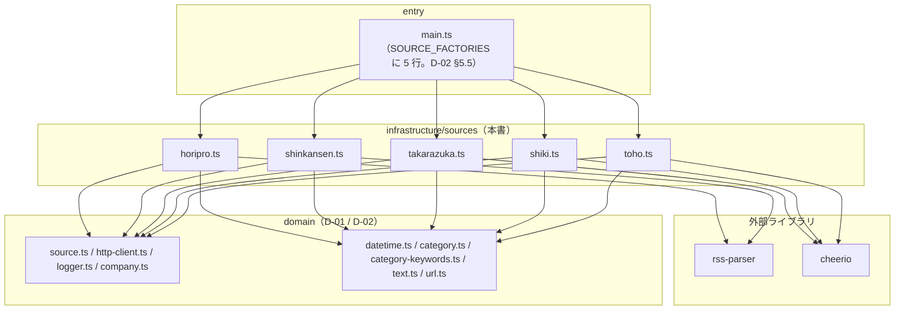
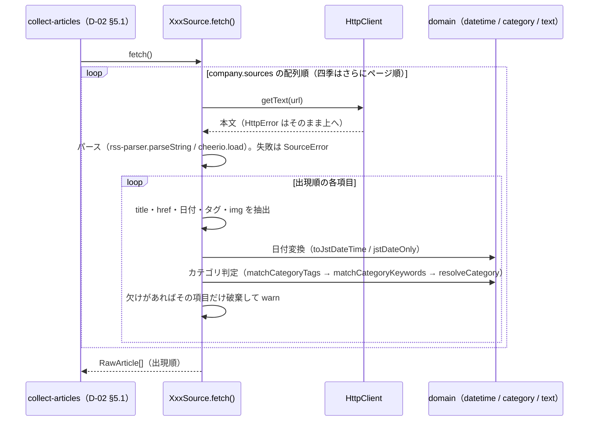
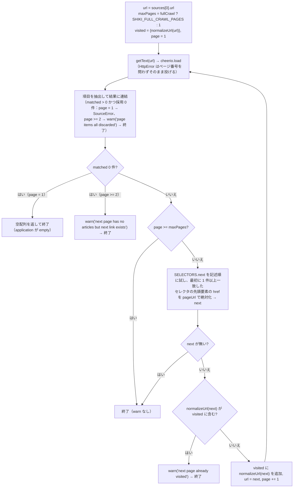

## 1. 目的と範囲

本書は、[D-02](D-02.md) §4.1 が定めた `Source` 契約（入力なし → `RawArticle[]`、失敗は例外）を **5 団体それぞれについてどう実装するか**を定める。決めるのは、(1) 各 Source の共通構造（ファクトリのシグネチャ・`fetch()` の流れ・記事単位の破棄規則）、(2) 団体ごとの取得 URL と方式（RSS / HTML、ページ送りの有無と最大ページ数）、(3) パース規則（rss-parser のフィールド、cheerio のセレクタ）、(4) 団体固有の URL 正規化（相対 URL の解決、東宝の 3 ドメイン吸収。R-8）、(5) 日付書式の解釈と `domain/datetime.ts` への接続、(6) カテゴリ判定に使う表（全団体共通キーワード表 `COMMON_CATEGORY_KEYWORDS` の具体値、団体別のタグ対応表と追加キーワード表。R-5）、(7) サムネイルの取得方法、(8) パーサーのフィクスチャテストである。決めないのは、`RawArticle` の確定（`id`・`contentHash`・`normalizeUrl`・`normalizeTitle`・`thumbnail` の検証。[D-02](D-02.md) §5.1）、Source の並行実行と失敗の集計（D-02 §5.1）、`articles.json` の形（[D-01](D-01.md)）、app 側のすべてである。D-01 の決定（§8 #1〜#34）と D-02 の決定（§8 #1〜#36）は本書の前提であり、変更しない。

セレクタとタグ文字列は調査レポート（2026-09-13）の記述から**推測した初期値**である。実サイトの HTML / RSS をフィクスチャとして保存した時点で、実装タスク（§10）が §4.2・§4.6 の値をフィクスチャに合わせて確定する。確定してよいのは値だけで、「どのフィールドをどこから取るか」の規則（§5）は変えない。

## 2. 要件との対応

| 要件 | 本書での扱い | 節 |
|---|---|---|
| R-2 サイト改装で収集が壊れる | HTML 3 団体の抽出規則（セレクタ・日付・URL）を Source ファイルごとに閉じ、他団体へ波及させない。`item` セレクタが全 URL・全ページで不一致なら 0 件 → application の `empty` で検知。`company.sources[]` の一部 URL だけ 0 件（東宝の片方）、または 1 ページ目で項目は一致したが全項目が破棄された場合は `SourceError` で Source 失敗にし、部分的な改装も `failures` に載せる。四季のページ送りで 2 ページ目以降が 0 件・全項目破棄のときは `warn` を出して終端し、それまでのページの結果を返す（§5.5）。実サイトのフィクスチャと取得日時の記録で改装を検知する | §5.5 / §6 / §7.2 / §8 #1・#13・#14・#16・#17 |
| R-5 カテゴリの自動判定精度 | ホリプロ・新感線は RSS の `category` 要素を、宝塚は一覧の分類タグを `CategoryTagMap` で写像し、写像できなければ全団体で見出しキーワードに進む（D-01 §5.3 の 2 段）。全団体共通キーワード表の具体値を `domain/category-keywords.ts` に、団体別の表を各 Source ファイル内に置き、表だけを差し替えて精度を調整できるようにする。フィクスチャテストで既知記事の判定結果を固定し、表の変更による退行を検知する | §4.6 / §5.1 / §7 |
| R-8 東宝のドメイン分散 | 東宝 Source が団体固有の正規化 `normalizeTohoUrl`（相対 URL の解決 → ホスト別名の統一 → 東宝系ホストの `http` → `https` → `index.html` の除去）を汎用正規化（D-01 §5.1）の前段として行い、同じ記事の表記揺れを 1 つの `id` に収束させる。`tohostage.com` 配下の現存ページへのリンクは書き換えず、開ける URL のまま格納する | §4.3 / §5.6 |
| R-9 新感線の公式ドメインのフィードが空 | 新感線 Source は `Company.sources[]` の URL（D-01 §4.3 で `https://blog.vi-shinkansen.co.jp/?feed=rss2` に固定）だけを取得し、URL をコードに持たない。フィクスチャは同 URL の実応答を保存し、`?p=NNNNN` 形式の記事 URL がそのまま返ることを固定する | §4.1 / §5.3 / §7 |
| 要件 §3.2 情報源（公式サイトのみ・静的 HTML） | 5 団体とも `HttpClient.getText()` で取得した静的 HTML / RSS を cheerio / rss-parser でパースする。ヘッドレスブラウザは使わない（CLAUDE.md） | §3 / §5 |
| 要件 §3.3 収集する情報カテゴリ | `CATEGORIES` の 7 値（D-01 §4.4）へ写像する表を §4.6 に置く。★1〜★3（新作・チケット・配信）のキーワードを厚くする | §4.6 |
| 要件 §5 相手サイトへの配慮 | リクエストは `HttpClient`（D-02 §5.7。UA・間隔・タイムアウト・上限 30）経由のみ。定常時のリクエスト数は 6（5 団体 + 東宝の 2 URL 目）、`fullCrawl` 時は 10（四季 5 ページ）で、D-02 #26・#31 の想定内に収める。robots.txt は調査レポート §1〜5 の結果（制限なし）を根拠にし、実装タスク着手時に再確認する（D-02 #6、§8 #12） | §4.2 / §5.4 / §10 |
| 要件 §7 記事本文を保持しない | `RawArticle` は見出し・URL・カテゴリ・掲載日・サムネイル URL だけを持つ。RSS の `description` / `content:encoded`、HTML の本文要素は読まない（サムネイル抽出にも使わない。§8 #5） | §4.1 / §5 |

### 2.1 画面定義との対応（scope: app のみ）

該当なし。本書は scope: collector であり、画面定義書を参照しない。

## 3. 構成

### 3.1 依存の方向



- `sources/` の 5 ファイルは互いに import しない（CLAUDE.md）。共通化は domain の純粋関数（`toJstDateTime`・`jstDateOnly`・`matchCategoryTags`・`matchCategoryKeywords`・`resolveCategory`・`foldText`・`normalizeTitle`、四季の `visited` 比較に使う `normalizeUrl`）を各ファイルから呼ぶ形に限る（§8 #1）
- ネットワークは `HttpClient.getText()` だけを使う。rss-parser の `parseURL` は使わず `parseString` に本文を渡す（D-02 §4.3、CLAUDE.md）
- `application` への依存は無い。`sources/` が知るのは domain のポートと純粋関数だけである

### 3.2 ファイル配置

`（D-01）`・`（D-02）` は当該設計書が所有し、本書はその中の**値**だけを埋めるファイル。

```
collector/
  src/
    domain/
      category-keywords.ts       （D-01）COMMON_CATEGORY_KEYWORDS の値を §4.6 で埋める
    infrastructure/
      sources/
        horipro.ts               createHoriproSource / HoriproSource（RSS。§5.2）
        shinkansen.ts            createShinkansenSource / ShinkansenSource（RSS。§5.3）
        takarazuka.ts            createTakarazukaSource / TakarazukaSource（HTML。§5.4）
        shiki.ts                 createShikiSource / ShikiSource（HTML + ページ送り。§5.5）
        toho.ts                  createTohoSource / TohoSource（HTML + URL 正規化。§5.6）
    main.ts                      （D-02）SOURCE_FACTORIES に 5 団体の行を追加する（§5.7）
  test/
    helpers/
      stub-http-client.ts        StubHttpClient（§7.1）
    infrastructure/
      sources/
        horipro.test.ts
        shinkansen.test.ts
        takarazuka.test.ts
        shiki.test.ts
        toho.test.ts
    fixtures/
      sources/
        horipro/    feed.xml, README.md
        shinkansen/ feed.xml, README.md
        takarazuka/ news.html, README.md
        shiki/      news-p1.html, news-p2.html, news-last.html, README.md
        toho/       topics.html, news.html, README.md
```

フィクスチャは団体ごとのディレクトリに置き、`README.md` に取得 URL・取得日時・取得に使った User-Agent を記録する（§7.2）。ディレクトリを分けるのは、5 団体のタスクを並列に進めても同じファイルを編集しないため（§10）。

## 4. データ

### 4.1 Source の共通構造

すべての Source は同じ形のファクトリ関数とクラスを持つ。ファクトリのシグネチャは D-02 §5.5 手順 6 の `SOURCE_FACTORIES` の生成関数に一致させる。

```ts
// 各 sources/<id>.ts に共通する形（例: horipro.ts）
import type { Company } from "../../domain/company";
import type { HttpClient } from "../../domain/http-client";
import type { Logger } from "../../domain/logger";
import type { RawArticle, Source, SourceOptions } from "../../domain/source";
import type { Category, CategoryTagMap } from "../../domain/category";
import { matchCategoryTags, matchCategoryKeywords, resolveCategory } from "../../domain/category";
import type { CategoryKeywordTable } from "../../domain/category-keywords";
import { COMMON_CATEGORY_KEYWORDS } from "../../domain/category-keywords";
import { foldText, normalizeTitle } from "../../domain/text";
// 上の 3 行は §5.1 手順 4 のローカル関数 classify が使う（D-01 §3.2 の domain/category・category-keywords・text）

/** main.ts が渡す依存（D-02 §5.5 手順 6 の { http, logger }）。5 ファイルにそれぞれ同じ 2 行を書く（§8 #1） */
interface SourceDeps {
  readonly http: HttpClient;
  readonly logger: Logger;
}

/** カテゴリ判定に使う表。既定値はファイル内の定数（§4.6）。テストだけが差し替える（§7.3、§8 #9） */
export interface CategoryTables {
  readonly tagMap: CategoryTagMap;
  readonly keywords: CategoryKeywordTable;
}

/** RawArticle.companyId に入れるリテラル。company.id からは取らない（D-01 #32 の突合を機能させるため。§8 #2） */
const COMPANY_ID = "horipro";

export class HoriproSource implements Source {
  readonly id: string;
  constructor(
    private readonly company: Company,
    private readonly deps: SourceDeps,
    private readonly options: SourceOptions,
    private readonly tables: CategoryTables = HORIPRO_TABLES,
  ) {
    this.id = company.id;
    // company.sources の kind がこの Source の方式（"rss" / "html"）と一致しない要素があれば SourceError（§6）
  }
  async fetch(): Promise<readonly RawArticle[]> { /* §5.1 */ }
}

export function createHoriproSource(company: Company, deps: SourceDeps, options: SourceOptions): Source {
  return new HoriproSource(company, deps, options);
}
```

| 項目 | 規則 |
|---|---|
| `Source.id` | `company.id`（D-02 §4.1「既定は Company.id」） |
| `RawArticle.companyId` | ファイル内の定数 `COMPANY_ID` のリテラル。`company.id` を代入しない。取り違え（別団体の factory に配線された・コピーして書き換え忘れた）は application の突合（D-01 §4.2）が検出する |
| 取得先 | `company.sources` の配列順にすべての要素を使う。URL をコードに持たない（D-01 #20）。`kind` が方式と合わない要素が 1 つでもあればコンストラクタで `SourceError`（設定ミスを Source 失敗として見せる。D-02 §5.1 手順 2 が rejected に数える） |
| `options.fullCrawl` | 四季だけが参照する（§5.5）。他の 4 団体は受け取るが使わない（契約の形を揃える。D-02 §4.1） |
| `tables` | 第 4 引数。既定はファイル内の定数（§4.6）。ファクトリは渡さない。テストが D-01 §7.2 行 4 のケース（§7.3）を検証するために差し替える |
| 返却順 | `company.sources` の配列順 → ページ順（1 ページ目から）→ 各ページの DOM / フィード出現順（D-02 §4.1・§8.1） |
| 出力 | `RawArticle` の 6 フィールドのみ。`title` は生の文字列（`trim` のみ。正規化は application）、`url` は絶対 URL（団体固有正規化済み。汎用正規化は application）、`publishedAt` は D-01 §4.1 の書式、`category` は §5.1 の判定結果、`thumbnail` は取れたときだけキーを持つ（`exactOptionalPropertyTypes`。D-02 §4.9） |

### 4.2 取得 URL・方式・セレクタ（初期値）

`company.sources[]` の値は D-01 §4.3 の `data/companies.json` のとおりで、本書は変更しない。各 Source が `sources[]` に期待する内容と、パースに使うセレクタの初期値を示す。**セレクタは実サイトの構造を推測した初期値であり、実装時にフィクスチャで確認して確定する**（§1）。確定値はファイル内の `SELECTORS` 定数に置き、テストがフィクスチャで固定する。

| 団体 | `sources[]` | 方式 | ページ送り | 1 実行のリクエスト数 | 1 回の取得で得られる件数（調査時点） |
|---|---|---|---|---|---|
| ホリプロ | `rss` × 1（`https://horipro-stage.jp/feed/`） | RSS 2.0（rss-parser） | 無し | 1 | 10 件（WordPress 既定。`fullCrawl` でも増えない。過去分を遡る手段が無い） |
| 新感線 | `rss` × 1（`https://blog.vi-shinkansen.co.jp/?feed=rss2`） | RSS 2.0（rss-parser） | 無し | 1 | 10 件（同上） |
| 宝塚 | `html` × 1（`https://kageki.hankyu.co.jp/news/`） | HTML（cheerio） | 無し（1 ページに全件。調査レポート §3） | 1 | 100 件以上（2016 年まで） |
| 四季 | `html` × 1（`https://www.shiki.jp/navi/news/`） | HTML（cheerio） | 有り。`fullCrawl` 偽 → 1 ページ、真 → 最大 `SHIKI_FULL_CRAWL_PAGES` = 5 ページ（§8 #6） | 1 または最大 5 | 10 件/ページ（`fullCrawl` 時 最大 50 件） |
| 東宝 | `html` × 2（`/stage/topics/`、`/stage/news/` の順） | HTML（cheerio） | 無し（§8 #7） | 2 | topics 12 件以上 + news 4 件程度 |

RSS の 2 団体は初回でも 10 件しか得られず、`fullCrawl` で遡る手段が無い。§10 Task L の完了条件「他 4 団体で 30 件以上」は、ホリプロ 10 + 新感線 10 + 四季 10（定常）または 50（`fullCrawl`）+ 東宝 16 の合計から、一時的な取りこぼしを見込んで置いた下限である。

**セレクタの規則（3 団体共通）**：

- `SELECTORS.item` は、フィクスチャで確定する時点で**互いに入れ子にならない単一のセレクタ**にする。初期値のカンマ区切りは候補の列挙であり、確定値に複数候補を残さない。候補が入れ子の要素（月見出しの `li` とその中の記事 `li` など）に多重一致すると、親項目が子の 1 件目のリンクと連結された見出しで採用され、正しい項目が捨てられる（§7.3 で「一致した項目数 = 記事数」「同じ `url` の項目が 2 つ出ない」を固定する）
- 四季の `SELECTORS.next` だけは候補の**配列**とし、記述順に 1 つずつ試して最初に 1 件以上一致したセレクタの先頭要素を使う（§5.5）。CSS セレクタリストの結果は DOM 順で返るため、1 本の文字列に連結すると記述順の優先が効かない。確定時には 1 要素の配列に絞り、`:contains(...)` は残さない
- 候補のいずれもフィクスチャに一致しない場合は、実 DOM に合わせたセレクタを**新たに書いてよい**（候補の列挙に縛られない）。確定の条件は 2 つ：「入れ子に多重一致しない 1 本」「`$(SELECTORS.item).length` = 返却件数」。確定した値とその根拠（一致した要素の位置・件数）を当該団体のフィクスチャ `README.md` に記録する（§7.2）
- `SELECTORS.excludeFromTitle` は、見出し本文でない要素（分類タグ・日付・「新」「NEW」バッジ等の装飾）のセレクタである。見出しの抽出（§5.4〜§5.6）ではリンク要素の複製からこれに一致する要素を `remove()` した残りの `text()` を使う。初期値はタグ・日付の候補だけで、フィクスチャ確認時に見出し本文でない要素（バッジのクラス名等）のセレクタを追記し、追記した値と根拠を `README.md` に記録する

```ts
// takarazuka.ts
/** 記事 URL の規則（調査レポート §3）。日付は URL から取る */
export const TAKARAZUKA_NEWS_URL_RE = /\/news\/(\d{4})(\d{2})(\d{2})_(\d{3})\.html$/;
const SELECTORS = {
  item: ".news-list li, ul.newsList > li, .newsList li",   // 一覧の 1 記事。候補の列挙。フィクスチャで入れ子にならない 1 本に絞る（上記の規則）
  link: "a[href]",                                          // item 内の記事リンク
  tags: ".tag, .category, .cat",                            // item 内の分類タグ（複数可）
  dateText: ".date, time",                                  // URL から日付が取れないときの予備（DATE_DOT_RE。§4.4）
  image: "img",                                             // item 内の先頭の img
  excludeFromTitle: ".tag, .category, .cat, .date, time",   // 見出しから除く要素（§4.2 の規則・§5.4）。バッジ等はフィクスチャ確認時に追記
} as const;
```

```ts
// shiki.ts
export const SHIKI_FULL_CRAWL_PAGES = 5;   // fullCrawl 時の最大ページ数（調査レポート §4「3〜5」の上限。§8 #6）
/** 記事 URL の規則（調査レポート §4: /navi/news/renewinfo/NNNNNN.html）。妥当性の確認（§7.3）にだけ使い、項目を弾く条件には使わない（§8 #13） */
export const SHIKI_NEWS_URL_RE = /\/navi\/news\/renewinfo\/\d{6}\.html$/;
const SELECTORS = {
  item: ".news-list li, ul.newsList > li, .newsList li",   // 候補の列挙。フィクスチャで 1 本に絞る
  link: "a[href]",
  title: ".title, .ttl",                                    // 無ければ link のテキスト
  dateText: "time[datetime], .date, time",
  image: "img",
  excludeFromTitle: ".tag, .category, .cat, .date, time",   // 見出しから除く要素（§4.2 の規則・§5.5）
  /** 「次へ」リンクの候補。記述順に試し、最初に 1 件以上一致したセレクタの先頭要素の href を使う（§5.5）。確定時は 1 要素にし :contains は残さない */
  next: ['a[rel="next"]', ".pager a.next", ".pagination a.next", 'a:contains("次へ")'],
} as const;
```

```ts
// toho.ts
const SELECTORS = {
  item: ".topics-list li, .news-list li, article, ul.list > li",   // 候補の列挙。/stage/topics/ と /stage/news/ で共通。差があればフィクスチャ確認時に pathname で分け、各 1 本に絞る
  link: "a[href]",
  title: ".title, .ttl, h2, h3",                                    // 無ければ link のテキスト
  dateText: "time[datetime], .date, time",
  image: "img",
  excludeFromTitle: ".tag, .category, .cat, .date, time",           // 見出しから除く要素（§4.2 の規則・§5.6）
} as const;
```

RSS の 2 団体はセレクタを持たず、rss-parser の出力フィールドを使う（§4.5）。

### 4.3 団体固有の URL 正規化

汎用正規化（D-01 §5.1 `normalizeUrl`。フラグメント・追跡パラメータの除去、ホスト小文字化、既定ポート除去）は application が行う。Source が行うのは次の 2 種類である。

**共通：相対 URL の解決。** HTML の 3 団体は `new URL(href, pageUrl).toString()` で絶対化する（`pageUrl` はその要素を取得したページの URL）。`href` が空・`javascript:`・`mailto:`・`#` のみ → その記事を破棄（§6）。RSS の 2 団体は `link` が絶対 URL であることを前提にし、`new URL(link)` が失敗したら破棄する。

**東宝（R-8）：`normalizeTohoUrl(href, pageUrl)`。** 汎用正規化の前段として `RawArticle.url` に格納する値を決める。

```ts
// toho.ts
/**
 * 東宝系のホスト。これらに限り http → https と /index.html の除去を行う（調査レポート §5 の全 URL が https で提供されている）。
 * stagegate.jp は東宝関連だが記事 URL として現れるか未確認のため対象外。フィクスチャで確認したら追加を検討する（§10 K5）
 */
const TOHO_HOSTS: ReadonlySet<string> = new Set([
  "www.toho.co.jp", "www.tohostage.com", "teigeki.tohostage.com", "crea.tohostage.com",
  "tohostage.toho-navi.com",
]);
/** 同一サイトの別名。www 無し → www 有り */
const TOHO_HOST_ALIASES: ReadonlyMap<string, string> = new Map([
  ["toho.co.jp", "www.toho.co.jp"],
  ["tohostage.com", "www.tohostage.com"],
]);

export function normalizeTohoUrl(href: string, pageUrl: string): string {
  const u = new URL(href, pageUrl);                       // 1. 相対 URL の解決（失敗は呼び出し側が破棄）
  const host = u.hostname.toLowerCase();
  u.hostname = TOHO_HOST_ALIASES.get(host) ?? host;       // 2. 別名の統一
  if (TOHO_HOSTS.has(u.hostname)) {
    if (u.protocol === "http:") u.protocol = "https:";       // 3. 東宝系だけ https へ
    u.pathname = u.pathname.replace(/\/index\.html?$/, "/"); // 4. 東宝系だけディレクトリ既定ページを統一
  }
  return u.toString();
}
```

| 入力（`pageUrl` = `https://www.toho.co.jp/stage/topics/`） | 出力 |
|---|---|
| `/stage/topics/2026/09/kingdom.html` | `https://www.toho.co.jp/stage/topics/2026/09/kingdom.html` |
| `http://toho.co.jp/stage/kingdom2/index.html` | `https://www.toho.co.jp/stage/kingdom2/` |
| `http://www.tohostage.com/kingdom2/` | `https://www.tohostage.com/kingdom2/`（パスは書き換えない。現存ページ。調査レポート §5） |
| `https://tohostage.toho-navi.com/tickets/123?x=1` | `https://tohostage.toho-navi.com/tickets/123?x=1`（クエリは保持） |
| `http://example.com/a/index.html` | `http://example.com/a/index.html`（東宝系でないので変更しない。スキームもパスも触らない） |
| `https://stagegate.jp/x/index.html` | `https://stagegate.jp/x/index.html`（`TOHO_HOSTS` に無いので変更しない。D-01 #10「開ける URL を格納する」） |

手順 3・4 を `TOHO_HOSTS` に限るのは、外部サイトでは `/index.html` を除いたディレクトリ URL が同じページを返す保証が無く、開けない URL を作りうるためである（§6 の東宝行、§8 #11）。

他の 4 団体は団体固有の正規化を持たない（相対 URL の解決のみ）。

### 4.4 日付の解釈

すべて `domain/datetime.ts`（D-02 §4.2）に接続する。日付を得られない記事は破棄する（`publishedAt` に空文字を入れない。D-02 §4.2）。

| 団体 | 日付の所在 | 書式 | 変換 |
|---|---|---|---|
| ホリプロ・新感線 | `item.pubDate`（無ければ `item.isoDate`） | RFC822（任意のオフセット） | `toJstDateTime(new Date(pubDate))`。`InvalidDateTimeError` → 破棄 |
| 宝塚 | 記事 URL（`TAKARAZUKA_NEWS_URL_RE` の `YYYYMMDD`） | `20260913` | `jstDateOnly(y, m, d)`。URL が規則に合わなければ `SELECTORS.dateText` の先頭要素のテキストに `DATE_DOT_RE`（`2026.09.13`）だけを当てる予備を使う（`time[datetime]` 属性・漢字書式は見ない。§5.4） |
| 四季 | `SELECTORS.dateText` | `time[datetime]` の `YYYY-MM-DD`、またはテキストの `2026.09.12` | 2 段の順序：(1) 項目内の `$(SELECTORS.dateText)` のうち `time[datetime]` に一致する**先頭要素**があれば `datetime` 属性に `DATE_ATTR_RE`。(2) 無ければ `$(SELECTORS.dateText)` の**先頭要素**（DOM 順）のテキストに `DATE_DOT_RE`。どちらも取れなければ `no_date`。取れたら `jstDateOnly(y, m, d)` |
| 東宝 | `SELECTORS.dateText` | `time[datetime]` の `YYYY-MM-DD`、またはテキストの `2026年09月04日`（月日は 1〜2 桁） | 四季と同じ 2 段。(1) `time[datetime]` に一致する先頭要素の属性に `DATE_ATTR_RE`。(2) 無ければ先頭要素のテキストに `DATE_KANJI_RE`。どちらも取れなければ `no_date`。取れたら `jstDateOnly(y, m, d)` |

四季・東宝で `time[datetime]` を先に探すのは、`$(SELECTORS.dateText)` の結果が DOM 順で返るため（先頭が `.date` で後方に `time[datetime]` がある DOM でも属性を優先する）。

```ts
// 各 HTML Source がファイル内に持つ日付テキストの正規表現（同じ 3 本を各ファイルに書く。§8 #1）
const DATE_ATTR_RE = /^(\d{4})-(\d{2})-(\d{2})/;               // time[datetime]
const DATE_DOT_RE = /(\d{4})\.(\d{1,2})\.(\d{1,2})/;           // 2026.09.12（宝塚の予備・四季）
const DATE_KANJI_RE = /(\d{4})年(\d{1,2})月(\d{1,2})日/;       // 2026年09月04日（東宝）
```

`Number()` で数値化し `jstDateOnly` へ渡す。`jstDateOnly` が投げる `InvalidDateTimeError`（`2026.13.40` など）はその記事の破棄理由になる。

### 4.5 RSS のフィールド対応（ホリプロ・新感線）

```ts
// horipro.ts / shinkansen.ts
import Parser from "rss-parser";

/** media:thumbnail / media:content を拾う。xml2js の出力は { $: { url, type?, medium? } } の形 */
type MediaField = { readonly $?: { readonly url?: string; readonly type?: string; readonly medium?: string } };

/** media:* の要素が画像かどうか。type が image/ 始まり、または medium が "image"、または両方欠落のときだけ採用する（動画・音声の URL をサムネイルにしない） */
function isImageMedia(m: MediaField): boolean {
  const type = m.$?.type;
  const medium = m.$?.medium;
  if (type === undefined && medium === undefined) return true;
  return (type !== undefined && type.startsWith("image/")) || medium === "image";
}

/** 単体オブジェクトでも配列でも受け取り、配列に揃える */
function asArray(v: MediaField | readonly MediaField[] | undefined): readonly MediaField[] {
  if (v === undefined) return [];
  return Array.isArray(v) ? (v as readonly MediaField[]) : [v as MediaField];
}
interface FeedItem {
  readonly title?: string;
  readonly link?: string;
  readonly pubDate?: string;
  readonly isoDate?: string;
  readonly categories?: readonly string[];
  readonly enclosure?: { readonly url?: string; readonly type?: string };
  readonly mediaThumbnail?: MediaField | readonly MediaField[];
  readonly mediaContent?: MediaField | readonly MediaField[];
}
const parser = new Parser<Record<string, never>, FeedItem>({
  customFields: { item: [["media:thumbnail", "mediaThumbnail"], ["media:content", "mediaContent"]] },
});
```

| `RawArticle` | 取得元 | 無い・不正なとき |
|---|---|---|
| `title` | `item.title` を `trim`。rss-parser（xml2js）が CDATA の展開と HTML エンティティのデコードを 1 段行った文字列を**そのまま**使い、追加のデコードは行わない（`&amp;amp;` のような二重エスケープはサイト側の表記として `&amp;` のまま残す）。改行・連続空白は `trim` 以外触らない（圧縮は application の `normalizeTitle`。§6） | 空 → 破棄 |
| `url` | `item.link` を `trim`（`new URL()` が通ること） | 無い・相対 → 破棄 |
| `publishedAt` | `item.pubDate` → `item.isoDate` の順で `new Date()` | 両方無い・NaN → 破棄 |
| `category` | `siteTags = item.categories ?? []`（各要素を `trim`）を §5.1 の判定へ | 無ければ空配列（キーワード段階へ） |
| `thumbnail` | (1) `enclosure.url`（`type` が `image/` 始まりのときだけ）→ (2) `asArray(mediaThumbnail)` の先頭で `isImageMedia` が真の要素の `$.url` → (3) `asArray(mediaContent)` の同上、の順で最初に得られた絶対 URL（`new URL()` が通ること）。`mediaThumbnail` / `mediaContent` が単体オブジェクトのときは 1 要素の配列とみなす（`asArray`） | 無ければキー省略。`media:*` の `type` が `video/` 等・`medium` が `"video"` の要素は飛ばす。`description` / `content:encoded` は読まない（§8 #5） |

### 4.6 カテゴリ判定の表

D-01 §4.4 の型（`CategoryKeywordTable`・`CategoryTagMap`）に値を入れる。全団体共通表は `domain/category-keywords.ts`（D-01 所有。値のみ本書）に、団体別の表は各 Source ファイル内の定数に置く（D-01 §8.1）。キーワードは照合時に `foldText`（NFKC・小文字）を通るため、表には全角・大文字のまま書いてよい。タグは**完全一致**（`foldText` を通さない。D-01 §4.4）なので、サイトの表記どおりに書く。

```ts
// collector/src/domain/category-keywords.ts（D-01 §4.4 の宣言に値を入れる）
export const COMMON_CATEGORY_KEYWORDS: CategoryKeywordTable = {
  new_work: ["上演決定", "公演決定", "開催決定", "上演が決定", "公演が決定", "新作", "初演", "再演", "製作発表", "制作発表", "ラインアップ", "ラインナップ"],
  ticket: ["チケット", "先行", "一般発売", "発売開始", "発売日", "販売開始", "抽選", "当落", "受付開始", "予約開始", "申込", "申し込み", "前売"],
  streaming: ["配信", "映像化", "Blu-ray", "ブルーレイ", "DVD", "ゲキ×シネ", "ライブビューイング", "LIVE VIEWING", "オンデマンド", "放送", "映画館"],
  schedule: ["公演スケジュール", "公演日程", "スケジュール", "日程", "公演時間", "開演時間", "開場時間", "上演時間", "公演期間", "休演日"],
  cast: ["キャスト", "配役", "出演決定", "出演者発表", "出演者決定", "キャスティング", "役替わり", "役替り"],
  person: ["退団", "移籍", "受賞", "入団", "訃報", "逝去", "就任", "襲名"],
  other: [],
};
```

団体別の表（各 Source ファイル内。`CategoryTables` の既定値）：

```ts
// horipro.ts（RSS の category 要素。作品名タグは表に無いので無視される。D-01 §5.3）
const HORIPRO_TABLES: CategoryTables = {
  tagMap: new Map([
    ["チケット情報", "ticket"], ["チケット", "ticket"],
    ["配信", "streaming"], ["映像", "streaming"], ["映像化", "streaming"],
    ["キャスト", "cast"], ["キャスト情報", "cast"],
    ["公演スケジュール", "schedule"], ["スケジュール", "schedule"],
    ["新作", "new_work"], ["公演決定", "new_work"],
  ]),   // 「重要なお知らせ」は写像しない（D-01 §5.3 の例のとおり other になる）
  keywords: { new_work: [], ticket: ["ホリプロステージ先行"], streaming: [], schedule: [], cast: [], person: [], other: [] },
};
```

```ts
// shinkansen.ts（RSS の category 要素。"NEWS" と作品名は写像しない）
const SHINKANSEN_TABLES: CategoryTables = {
  tagMap: new Map([
    ["ゲキ×シネ", "streaming"], ["映像", "streaming"], ["配信", "streaming"],
    ["チケット", "ticket"], ["チケット情報", "ticket"],
    ["キャスト", "cast"],
  ]),
  keywords: { new_work: [], ticket: [], streaming: ["ゲキ×シネ", "全国公開"], schedule: [], cast: [], person: [], other: [] },
};
```

```ts
// takarazuka.ts（一覧の分類タグ。組名（花・月・雪・星・宙）・劇場名は写像しない）
const TAKARAZUKA_TABLES: CategoryTables = {
  tagMap: new Map([
    ["チケット", "ticket"], ["チケット情報", "ticket"],
    ["配信", "streaming"], ["映像", "streaming"], ["スカイ・ステージ", "streaming"],
    ["公演スケジュール", "schedule"], ["公演時間", "schedule"],
    ["出演者", "cast"], ["配役", "cast"],
  ]),
  keywords: {
    new_work: ["公演ラインアップ", "公演ラインナップ"],
    ticket: ["宝塚友の会", "友の会"],
    streaming: ["タカラヅカ・スカイ・ステージ", "スカイ・ステージ", "ライブ中継"],
    schedule: [],
    cast: ["新人公演", "配役発表"],
    person: ["組替え", "組替", "トップスター", "お披露目", "退団者"],
    other: [],
  },
};
```

```ts
// shiki.ts（サイト側タグ無し。tagMap は空）
const SHIKI_TABLES: CategoryTables = {
  tagMap: new Map(),
  keywords: { new_work: ["開幕決定", "上演のお知らせ"], ticket: ["四季の会", "会員先行"], streaming: [], schedule: ["公演スケジュール"], cast: ["出演者のお知らせ", "出演俳優"], person: [], other: [] },
};
```

```ts
// toho.ts（サイト側タグ無し。tagMap は空）
const TOHO_TABLES: CategoryTables = {
  tagMap: new Map(),
  keywords: { new_work: [], ticket: ["ナビザーブ", "東宝ナビザーブ"], streaming: ["東宝ステージ配信", "アーカイブ配信"], schedule: [], cast: [], person: [], other: [] },
};
```

D-01 §4.2 のサンプル 3 件との整合：宝塚「…無料配信の実施について」→ 共通表 `配信` で `streaming`、ホリプロ「【重要】…公演中止のお詫びと払い戻し…」→ タグ「重要なお知らせ」は写像なし・キーワード該当なし → `other`、新感線「／爆烈忠臣蔵／ゲキ×シネ…全国公開決定！！」→ タグ「NEWS」は写像なし → 共通表 `ゲキ×シネ` で `streaming`。いずれもサンプルの `category` と一致する。「公開決定」は `new_work` の `公演決定` に一致しない（部分一致は「公演決定」の 4 文字）。

**部分一致による誤判定の扱い（§8 #15）。** キーワード照合は否定・複合語を区別しない部分一致（D-01 §4.4）であり、次の記事は表のとおりに判定される。これを「期待する振る舞い」として §7.3 で固定し、実データで表を直す運用（R-5）で調整する。

| 見出し | 候補 | 結果 | 備考 |
|---|---|---|---|
| ライブ配信中止のお知らせ | `配信` → `streaming` | `streaming` | 否定文でも一致する。「中止」を除外する仕組みは持たない |
| ゲキ×シネ『◯◯』先行上映決定 | `先行` → `ticket`、`ゲキ×シネ` → `streaming` | `ticket` | `CATEGORY_PRIORITY`（D-01 #11）で `ticket` が勝つ。新感線の中心的な記事形式だが、開発者確認のうえ現状どおり `ticket` とする（§8 #15） |
| グッズ発売日のお知らせ | `発売日` → `ticket` | `ticket` | 物販でも一致する |

### 4.7 companies.json と Source の対応

`data/companies.json` は D-01 §4.3 の内容のまま変更しない。`main.ts` の `SOURCE_FACTORIES`（D-02 §5.5 手順 6）に次の 5 行を置く。

```ts
// main.ts（D-02 §5.5 手順 6 の表に値を入れる）
import { createHoriproSource } from "./infrastructure/sources/horipro.js";
import { createShinkansenSource } from "./infrastructure/sources/shinkansen.js";
import { createShikiSource } from "./infrastructure/sources/shiki.js";
import { createTakarazukaSource } from "./infrastructure/sources/takarazuka.js";
import { createTohoSource } from "./infrastructure/sources/toho.js";

// SourceFactory は D-02 §5.5 手順 6 の生成関数型 (company, { http, logger }, options) => Source の別名（main.ts 内で宣言）
const SOURCE_FACTORIES: Readonly<Record<string, SourceFactory>> = {
  takarazuka: createTakarazukaSource,
  shiki: createShikiSource,
  horipro: createHoriproSource,
  toho: createTohoSource,
  shinkansen: createShinkansenSource,
};
```

## 5. 処理フロー（正常系）

### 5.1 共通：`fetch()` の流れとカテゴリ判定

すべての Source の `fetch()` は同じ骨格を持つ。1 責務（1 団体の記事の素材を取る）・1 public メソッド。



- **入力**：なし（コンストラクタで受けた `company`・`deps`・`options`・`tables`）
- **ステップ**：
  1. `company.sources` を配列順に走査する。要素ごとに `body = await deps.http.getText(url)`。`HttpError` は捕まえずそのまま投げる（D-02 §4.3・§8.1。`formatError` が URL と status を含めて出す）
  2. 本文をパースする。RSS は `parser.parseString(body)`、HTML は `cheerio.load(body)`。パーサー自体の例外（XML として壊れている等）は `SourceError("failed to parse <url>", { cause })` に包んで投げる（§6）
  3. **`matched` の定義**：1 つの URL（ページ）でパースできた項目数。HTML は `$(SELECTORS.item).length`、RSS は `feed.items.length`。項目を出現順に走査し、団体別の抽出規則（§5.2〜§5.6）で `title`・`url`・`publishedAt`・`siteTags`・`thumbnail` を得る。`title` が空・`url` が絶対化できない・日付が得られない・変換できない項目は**その項目だけ**破棄し、`deps.logger.warn("article skipped", { sourceId: this.id, reason, url })` を出す（`reason` は `"no_title"` / `"no_link"` / `"no_date"` / `"invalid_date"` のいずれか。`url` は分かる範囲。§6）。URL（ページ）ごとに `matched` と「破棄理由ごとの件数」を数え、`matched > 0` かつ採用 0 件なら `SourceError("all items discarded in <url>: no_date=24")` のように理由の内訳を message に含めて投げる（RSS では `feed.items.length > 0` かつ採用 0 件が同じ境界。§6、§8 #17）。**この `SourceError` は `company.sources[]` の各要素の 1 ページ目に限る。** 四季の 2 ページ目以降で全項目が破棄された場合は例外にせず、`deps.logger.warn("page items all discarded", { sourceId: this.id, url, reasons, fullCrawl })` を出してそれまでのページの結果を返す（§5.5 終端 (d) と同じ扱い。理由は §8 #17）
  4. カテゴリを決める（D-01 §5.3 の手順を各ファイルのローカル関数 `classify` で呼ぶ。§8 #4）：

     ```ts
     function classify(rawTitle: string, siteTags: readonly string[], tables: CategoryTables): Category {
       const byTag = matchCategoryTags(siteTags, tables.tagMap);
       if (byTag.length > 0) return resolveCategory(byTag);                       // タグ段階で決まればキーワードに進まない
       const folded = foldText(normalizeTitle(rawTitle));                         // D-01 §5.3 は「正規化後の title」を入力とする
       const byKeyword = [
         ...matchCategoryKeywords(folded, COMMON_CATEGORY_KEYWORDS),
         ...matchCategoryKeywords(folded, tables.keywords),
       ];
       return resolveCategory(byKeyword);                                         // 空なら other
     }
     ```

  5. `RawArticle` を組み立てる。`thumbnail` は得られたときだけ条件付きスプレッドでキーを持たせる（D-02 §4.9）
  6. 全 `sources[]`（とページ）の結果を走査順に連結して返す。**すべての** URL（ページ）で `matched` が 0 なら空配列を返し例外にしない（application が `empty` として失敗に数える。D-02 #3）。`sources[]` が複数（東宝）で、ある URL の `matched` が 0 かつ他の URL が 1 件以上なら `SourceError("no items in <url>")` を投げる（1 URL だけの改装を成功扱いにしない。§6、§8 #16）
- **出力**：`readonly RawArticle[]`
- **失敗時**：`HttpError`（取得失敗）または `SourceError`（パース不能・設定不整合）。記事単位の欠けは例外にせず破棄する

`normalizeTitle` を Source が呼ぶのはカテゴリ判定の入力を作るためだけで、`RawArticle.title` には生の文字列（`trim` のみ）を入れる（application が改めて `normalizeTitle` する。D-02 §5.1 手順 6-4。冪等なので二重適用は結果を変えない）。

### 5.2 ホリプロ（RSS）

- **取得**：`sources[0].url` を 1 回
- **項目**：`feed.items` を配列順に
- **抽出**：§4.5 の表
- **URL**：`item.link` を絶対 URL として検証するだけ（団体固有の正規化なし）
- **日付**：`pubDate` → `toJstDateTime`。例：`Tue, 08 Sep 2026 09:04:51 +0000` → `2026-09-08T18:04:51+09:00`（D-01 §4.2 サンプルと一致）
- **カテゴリ**：`siteTags = item.categories`（例：`["重要なお知らせ", "ハリー・ポッターと呪いの子"]`）→ `classify`
- **サムネイル**：§4.5 の順
- **fullCrawl**：無視

### 5.3 新感線（RSS）

- **取得**：`sources[0].url`（`https://blog.vi-shinkansen.co.jp/?feed=rss2`。R-9）を 1 回
- **項目・抽出・日付・サムネイル**：ホリプロと同じ（§4.5）
- **URL**：`item.link` は `https://blog.vi-shinkansen.co.jp/?p=13727` の形。クエリを変更しない（汎用正規化でも `?p=` は保持される。D-01 #10）
- **カテゴリ**：`siteTags = item.categories`（例：`["NEWS", "爆烈忠臣蔵"]`）→ `classify`。表は `SHINKANSEN_TABLES`
- **fullCrawl**：無視

### 5.4 宝塚（HTML）

- **取得**：`sources[0].url` を 1 回。応答は 100 件以上の一覧（2016 年まで。調査レポート §3）。全件を返し、100 件への切り詰めは `detect-diff` が行う
- **項目**：`$(SELECTORS.item)` を DOM 順に。項目内の `SELECTORS.link` の先頭要素を記事リンクとする
- **抽出**：
  - `href` → `new URL(href, pageUrl)` で絶対化。失敗 → 破棄（`no_link`）
  - 日付：絶対 URL のパスに `TAKARAZUKA_NEWS_URL_RE` を当て、`YYYY`・`MM`・`DD` → `jstDateOnly`。一致しなければ `SELECTORS.dateText` のテキストに `DATE_DOT_RE` を当てる。どちらも無ければ破棄（`no_date`）
  - `title`：リンク要素の複製から `SELECTORS.excludeFromTitle` に一致する要素を `remove()` した残りの `text()` を `trim`（§4.2 の規則。フィクスチャ確認時に見出し本文でない要素のセレクタを `excludeFromTitle` に追記し README に記録）
  - `siteTags`：項目内の `SELECTORS.tags` の各テキストを `trim`（例：`["花組", "宝塚大劇場"]`）
  - `thumbnail`：項目内の `SELECTORS.image` の先頭要素について、`src` → `data-src` → `data-original` の順に属性を見る。属性が**無い・`trim` して空・`data:` 始まり**のときは次の属性へ進み、最初に使える値を `new URL(value, pageUrl)` で絶対化する（プロトコル相対 `//host/x.jpg` は `pageUrl` のスキームで補われる）。3 属性とも使えない、または絶対化に失敗 → キー省略（記事は残す）
- **カテゴリ**：`classify(title, siteTags, TAKARAZUKA_TABLES)`。組名・劇場名のタグは表に無いので無視され、キーワード段階に進む
- **fullCrawl**：無視

### 5.5 四季（HTML + ページ送り）



- **取得**：`sources[0].url` を 1 ページ目とし、`fullCrawl` が真なら「次へ」リンクを最大 `SHIKI_FULL_CRAWL_PAGES`（5）ページまで辿る。偽なら 1 ページのみ（D-02 §8.1・#27・#31）。次ページの URL は**リンクの `href` から取り、規則から組み立てない**（`?page=2` か `/index2.html` かが不明で、リンクを使えば改装に追随しやすい）
- **次へリンクの選び方**：`SELECTORS.next` の候補を**記述順に 1 つずつ** `$(selector)` で試し、最初に 1 件以上一致したセレクタの**先頭要素**の `href` を使う。1 本の文字列に連結して DOM 順で先頭を取ると、ページャ以外の「次へのご案内」のようなリンクが先に来たときに無関係な URL を辿る（§4.2）
- **終端**：(a) `maxPages` に達した、(b) 次へリンクが無い（真の最終ページ。`warn` を出さない）、(c) 次へリンクの URL が既に取得済み（自己参照・ループ。`warn("next page already visited")`）、(d) 次へリンクが見つかって辿った 2 ページ目以降で `matched` が 0 件（構造不一致）。(d) は「次へリンクはあるのに次ページに記事が無い」状態なので、真の終端 (b) と区別できる文言 `warn("next page has no articles but next link exists", { sourceId, url, fullCrawl })` を出し、それまでのページの結果を返す（`fullCrawl` を含めるのは、初回の遡りが途中で止まった実行かどうかをログから読み、`workflow_dispatch` の `full_crawl` での再取得を判断できるようにするため。§8 #17）。1 ページ目が 0 件なら「次へ」を見ずに空配列を返し、application が `empty` に数える（`fullCrawl` の真偽によらない）
- **2 ページ目以降の全項目破棄**：`matched > 0` かつ採用 0 件が 2 ページ目以降で起きたら、§5.1 手順 3 の `SourceError` は投げず、`warn("page items all discarded", { sourceId, url, reasons, fullCrawl })`（`reasons` は理由ごとの件数）を出してそれまでのページの結果を返す（終端 (d) と同じ扱い）。`SourceError` にすると、2 ページ目がアーカイブで日付書式が違うだけで 1 ページ目の正常な結果まで捨てられ、前回 JSON が空のままなので次回も `fullCrawl` で同じ失敗を毎時繰り返し四季だけ復旧しない（§8 #17）。1 ページ目の全項目破棄は §5.1 手順 3 のとおり `SourceError`
- **`visited` の比較**：D-01 §5.1 の `normalizeUrl`（domain の純粋関数）を通した文字列で行う。`?page=2#top` と `?page=2` のような表記違いを別ページと誤認して同じページを 2 度取らないため
- **途中ページの失敗**：2 ページ目以降の `getText` が `HttpError` を投げたら**そのまま投げ、取得済みページの結果を返さない**（Source 失敗。§6、§8 #18）。「途中で打ち切って部分結果を返す」にすると、初回（`fullCrawl`）が 10 件だけ埋まった状態で以後 `fullCrawl` が解除され、残りが自動では取れない
- **項目**：各ページの `$(SELECTORS.item)` を DOM 順に
- **抽出**：
  - `href` → `pageUrl` で絶対化。失敗 → 破棄
  - 日付：§4.4 の 2 段。(1) 項目内の `$(SELECTORS.dateText)` のうち `time[datetime]` に一致する先頭要素があれば `datetime` 属性に `DATE_ATTR_RE`。(2) 無ければ `$(SELECTORS.dateText)` の先頭要素のテキストに `DATE_DOT_RE`（`2026.09.12`）。どちらも取れなければ破棄（`no_date`）。取れたら `jstDateOnly`
  - `title`：項目内の `SELECTORS.title` の先頭要素のテキスト。無ければリンク要素の複製から `SELECTORS.excludeFromTitle` に一致する要素を `remove()` した残りの `text()`（§4.2 の規則）。`trim`
  - `siteTags`：空配列（サイト側タグ無し）
  - `thumbnail`：宝塚と同じ
- **カテゴリ**：`classify(title, [], SHIKI_TABLES)`。例：「『バック・トゥ・ザ・フューチャー』東京公演 明日13日（日）「四季の会」会員先行予約開始！」→ 共通表 `先行`・団体表 `四季の会` → `ticket`
- **返却順**：1 ページ目の項目 → 2 ページ目の項目 →…（D-02 §4.1）

### 5.6 東宝（HTML × 2 URL + URL 正規化）

- **取得**：`sources[]` を配列順に（`/stage/topics/` → `/stage/news/`）。各 1 回、逐次。ページ送りはしない（§8 #7）。同一ホストなので `HostScheduler` が 1 秒以上の間隔を空ける（D-02 §5.7）
- **項目**：各ページの `$(SELECTORS.item)` を DOM 順に
- **抽出**：
  - `href` → `normalizeTohoUrl(href, pageUrl)`（§4.3）。`new URL` が失敗 → 破棄
  - 日付：§4.4 の 2 段（四季と同じ順序）。(1) 項目内の `$(SELECTORS.dateText)` のうち `time[datetime]` に一致する先頭要素があれば `datetime` 属性に `DATE_ATTR_RE`。(2) 無ければ `$(SELECTORS.dateText)` の先頭要素のテキストに `DATE_KANJI_RE`（`2026年09月04日`・`2026年9月4日`）。どちらも取れなければ破棄（`no_date`）。取れたら `jstDateOnly`
  - `title`：`SELECTORS.title` の先頭要素のテキスト。無ければリンク要素の複製から `SELECTORS.excludeFromTitle` に一致する要素を `remove()` した残りの `text()`（§4.2 の規則）。`trim`
  - `siteTags`：空配列
  - `thumbnail`：宝塚と同じ（`src` は `pageUrl` で絶対化するだけで `normalizeTohoUrl` は通さない。`Article.thumbnail` はそのまま格納する契約。D-01 §5.4・§8.1）
- **カテゴリ**：`classify(title, [], TOHO_TABLES)`
- **返却順**：topics の項目 → news の項目。両方に同じ記事があれば application の重複規則（D-02 §5.1 手順 8）で topics 側が残る
- **片方だけ 0 件**：topics と news の一方で `matched` が 0、他方が 1 件以上なら `SourceError("no items in <url>")`（§5.1 手順 6、§8 #16）。両方 0 件なら空配列（`empty`）。片方だけ全項目破棄（`matched > 0` かつ採用 0 件）も同じく `SourceError`（`all items discarded in <url>`）で東宝全体が失敗する（§5.1 手順 3、§8 #17）
- **fullCrawl**：無視

### 5.7 DI 配線（`main.ts`）

`SOURCE_FACTORIES` に §4.7 の 5 行を追加するだけ。D-02 §5.5 手順 6 の `buildSourceBindings` は変更しない。追加後、`CURTAINCALL_DRY_RUN=1 npm start` で 5 団体すべてが `not_implemented` でなくなり、`.run-summary.json` の `sourceFailures` が空（サイトが正常なとき）になることを §10 Task L の完了条件にする。

## 6. 異常系・境界

「D-02 の reason」列は、そのケースが D-02 §4.6 の `SourceFailureReason`（`"error"` / `"empty"` / `"all_rejected"` / `"not_implemented"`）のどれとして `failures` に載るかを示す。本書の表に現れるのは前 3 値。`not_implemented` は Source 未実装の団体（`SOURCE_FACTORIES` に無い `id`）にのみ付くため対象外。`—` は Source 失敗にならない（記事単位の破棄・正常動作）。Source が投げる例外（`HttpError`・`SourceError`）はすべて D-02 §5.1 手順 4 の rejected 経由で `error`、空配列は手順 5 の `empty`、`all_rejected` は application 側の手順 6〜7 でのみ発生する（§8.1）。

| ケース | 期待する振る舞い | D-02 の reason | 担当 |
|---|---|---|---|
| `company.sources` に方式と異なる `kind` の要素がある（宝塚に `rss`、ホリプロに `html`） | コンストラクタで `SourceError("unsupported source kind")`。D-02 §5.1 手順 2 が rejected に数え、他団体は続行 | `error` | 各 Source |
| `getText` が `HttpError`（404・5xx・タイムアウト・上限超過） | 捕まえずそのまま投げる。東宝で 1 URL 目が成功し 2 URL 目が失敗した場合も**例外**にする（部分結果を返さない。片方だけの結果を正常とみなすと news 側の故障に気付けない。§8 #8） | `error` | 各 Source |
| RSS が XML として壊れている・`rss` 要素が無い | `SourceError("failed to parse <url>", { cause })` | `error` | ホリプロ・新感線 |
| RSS の `items` が空 | 空配列を返す（application が `empty` に数える。D-02 #3） | `empty` | ホリプロ・新感線 |
| RSS 項目に `link` が無い・相対 | その項目を破棄し `warn("article skipped", { reason: "no_link" })` | —（全項目なら `error`。下記「全項目が破棄」行） | ホリプロ・新感線 |
| RSS 項目の `pubDate` と `isoDate` が両方無い・`new Date()` が NaN | 破棄・`warn`（`reason: "invalid_date"`）。`publishedAt` に空文字を入れない（D-02 §4.2） | —（同上） | ホリプロ・新感線 |
| RSS 項目の `categories` が無い | `siteTags = []` としてキーワード段階に進む | — | ホリプロ・新感線 |
| RSS の `enclosure.type` が `image/` 以外（`audio/mpeg` 等） | サムネイルにしない。`media:*` に進む | — | ホリプロ・新感線 |
| RSS の `media:thumbnail` / `media:content` の `type` が `video/mp4`、または `medium` が `"video"` | その要素を飛ばし、次の要素・次のフィールドへ進む（`isImageMedia`。§4.5）。`type` と `medium` の両方が無い要素は画像とみなして採用する | — | ホリプロ・新感線 |
| RSS の `media:thumbnail` が配列でなく単体オブジェクト | `asArray` で 1 要素の配列として扱う（§4.5） | — | ホリプロ・新感線 |
| RSS の `title` が CDATA・HTML エンティティ（`&amp;amp;`）・改行を含む | rss-parser がデコードした文字列を `trim` するだけ。`&amp;amp;` は `&amp;` のまま残す（追加デコードしない。§4.5）。改行は残し、application の `normalizeTitle` が圧縮する | — | ホリプロ・新感線 |
| HTML で `SELECTORS.item` が**すべての** URL（ページ）で 1 つも一致しない（改装） | 空配列を返す。application が `empty` に数える（R-2 の主要な検知経路） | `empty` | 宝塚・四季・東宝 |
| `company.sources[]` のある要素（東宝の topics）のパース結果が 0 件で、他の要素（news）は 1 件以上 | `SourceError("no items in <url>")` で Source 失敗。4 件だけ返して成功扱いにすると、主要ニュース源の改装が `failures` に載らず毎時成功に見える（§5.1 手順 6、§8 #16） | `error` | 東宝 |
| 四季の 1 ページ目が 0 件（`fullCrawl` の真偽を問わない） | 「次へ」を見ずに空配列を返す（`empty`）。2 ページ目以降は §5.5 の終端 (d) | `empty` | 四季 |
| `company.sources[]` の各要素の **1 ページ目**で `item` は N 件一致したが全項目が記事単位で破棄され 0 件（日付要素のクラス名変更で全件 `no_date`、リンクテキストが画像だけで全件 `no_title` 等） | `SourceError("all items discarded in <url>: no_date=24")` で Source 失敗。message に破棄理由の内訳（`no_title` / `no_link` / `no_date` / `invalid_date` の各件数）を載せ、`failures` の理由からどのセレクタが壊れたかを読めるようにする（`empty` に潰さない。§5.1 手順 3、§8 #17）。application 側の `all_rejected`（D-02 §5.1 手順 7。message「all N articles discarded」）とは経路も message も異なる（§8.1） | `error` | 各 Source |
| 四季の **2 ページ目以降**で `item` は一致したが全項目が破棄され 0 件（アーカイブページだけ日付書式が違う等） | `SourceError` にせず `warn("page items all discarded", { url, reasons })` を出して終端し、それまでのページの結果を返す（§5.5）。例外にすると 1 ページ目の正常な結果も捨てられ、前回 JSON が空なら次回も `fullCrawl` で同じ失敗を繰り返して復旧しない（§8 #17） | —（1 ページ目の結果で成功） | 四季 |
| HTML の一部の項目でリンク・日付・見出しが取れない（改装で一部のカードだけ構造が変わった） | その項目だけ破棄し `warn`。残りは返す。Source 側で破棄した件数は `discardedByCompany`（D-02 §4.6）には**載らない**（application に渡らないため）。破棄の検知は `warn` ログとフィクスチャテストに任せる（§8 #8） | — | 宝塚・四季・東宝 |
| HTML のリンクのテキストがタグ・日付要素だけ（画像リンク）で、除いた残りが空 | 破棄（`no_title`）。`SELECTORS.title` が無い・空の場合も同じ。RSS より起きやすいので §7.3 で 3 団体とも固定する | —（全項目なら `error`） | 宝塚・四季・東宝 |
| 宝塚のリンク URL が `TAKARAZUKA_NEWS_URL_RE` に合わない（`/news/` 以外へのリンク、PDF） | `SELECTORS.dateText` を予備に使い、それも無ければ破棄（`no_date`）。URL の形では弾かない | — | 宝塚 |
| 宝塚の URL の日付が実在しない（`20261340_001.html`） | `jstDateOnly` の `InvalidDateTimeError` → 破棄（`invalid_date`） | — | 宝塚 |
| `href` が `#`・空・`javascript:`・`mailto:` | 破棄（`no_link`）。`new URL("#", pageUrl)` は成功するため、`href.trim()` が空・`#` 始まり・`javascript:` / `mailto:` 始まり（大文字小文字を無視）を先に弾く（§7.3 で 3 団体とも固定） | — | 宝塚・四季・東宝 |
| 四季の「次へ」リンクが無い（最終ページ） | そこで終了（終端 (b)。`warn` を出さない）。`fullCrawl` でも `maxPages` 未満で止まる | — | 四季 |
| 四季のページ内に、ページャ以外で「次へ」を含むリンク（「次へのご案内」等）がある | `SELECTORS.next` の候補を記述順に試すので、`a[rel="next"]` 等の先に来る候補が一致すれば `:contains("次へ")` は評価されない。確定時に `:contains` を残さない（§4.2・§5.5） | — | 四季 |
| 四季の 2 ページ目以降の `getText` が `HttpError`（503 等） | 捕まえずそのまま投げ、1 ページ目の結果を返さない（Source 失敗）。前回が `articles: []` のまま（全団体失敗）なら次回も全団体 `fullCrawl`（D-02 §6）、他団体が成功していれば D-02 #27 の `warn`（`workflow_dispatch` の `full_crawl` で補充）が出る。いずれも `failures` に載って開発者に届く。部分結果を返すと初回が 10 件で確定し、残りが自動では埋まらない（§5.5、§8 #18） | `error` | 四季 |
| 四季の「次へ」リンクが自分自身または既出のページを指す（改装でリンクが壊れた） | `visited` で検知して終了、`warn("next page already visited")`。無限ループにしない。http 層の `maxRequestsPerRun`（30）はさらに外側の天井（D-02 #31） | — | 四季 |
| 四季で「次へ」リンクが見つかって辿った 2 ページ目以降の `matched` が 0 件 | `warn("next page has no articles but next link exists", { url })` を出して終了し、それまでの結果を返す（終端 (d)）。リンクが無い真の終端 (b) は `warn` を出さないので、ログの有無で「最終ページに達した」と「改装で次ページの構造が変わった」を区別できる（§5.5） | —（1 ページ目の結果で成功） | 四季 |
| 四季で `fullCrawl` 偽 | 「次へ」を見ず 1 ページで終了（リクエスト 1 回） | — | 四季 |
| 東宝のリンクが `tohostage.com` 配下の現存ページ・`toho-navi.com` のチケットページ・`stagegate.jp` | `normalizeTohoUrl` を通した絶対 URL をそのまま `url` にする（パスを書き換えない。開ける URL を格納する。D-01 #10） | — | 東宝 |
| 東宝の `href` が `http://` の東宝系ホスト、または東宝系ホストの `/index.html` | `https://` に揃え、`/index.html` を `/` にする（§4.3 手順 3・4）。`TOHO_HOSTS` に無いホスト（`stagegate.jp`・`example.com`）はスキームもパスも変更しない | — | 東宝 |
| 同じ記事が 2 回出る（東宝の topics と news の両方／同一ページ内に同じリンクが 2 箇所／同一 Source の複数ページに重複） | Source は重複を除かず出現順にすべて返す。application の重複規則で最初の 1 件（東宝なら topics 側 = `sources[]` の先）が残る（D-01 §6、D-02 §5.1 手順 8）。§7.3 の「同 `url` が 2 件以上出ない」は**同一の URL（ページ）内**に限る契約であり、URL（ページ）をまたぐ重複は正の期待値（§7.3 東宝行） | — | 各 Source / application |
| サムネイルの `src` が `data:` URI・空・不在 | `src` → `data-src` → `data-original` の順に、`trim` して空でなく `data:` 始まりでない最初の値を使う（§5.4）。3 属性とも使えない → 省略（記事は残す） | — | 宝塚・四季・東宝 |
| サムネイルの値が相対・プロトコル相対（`//cdn.example.com/x.jpg`） | `new URL(value, pageUrl)` で絶対化（プロトコル相対は `pageUrl` のスキームが補われる）。失敗 → 省略 | — | 宝塚・四季・東宝 |
| 見出しが否定・複合語でキーワードを含む（「ライブ配信中止のお知らせ」「ゲキ×シネ『◯◯』先行上映決定」「グッズ発売日」） | 表のとおり部分一致させる（`streaming` / `ticket` / `ticket`。§4.6 末尾の表）。否定や複合語を除外する仕組みは持たず、誤判定は R-5 の運用で表を直す（§8 #15）。§7.3 で期待値を固定し、表の改訂で結果が変わったらテストで気付く | — | 各 Source |
| 見出しに改行・連続空白・全角スペースが含まれる | `trim` だけして返す。圧縮は application の `normalizeTitle`（D-02 §5.1 手順 6-4） | — | 各 Source |
| 見出しがカテゴリ表の複数キーワードに一致 | `resolveCategory` の優先順位（D-01 §4.4）で 1 値。例：「上演決定！チケット一般発売は…」→ `new_work` | — | 各 Source |
| タグ段階で決まった記事の見出しに別カテゴリのキーワード | タグ段階の結果を採用し、キーワード段階に進まない（D-01 §5.3 手順 1） | — | 各 Source |
| 文字コードが Shift_JIS のページ（東宝旧ドメイン） | `HttpClient` がデコード済みの文字列を返す（D-02 §5.7）。Source は文字コードを扱わない | — | http |
| `company.id` が `COMPANY_ID` と違う（`SOURCE_FACTORIES` の配線ミス） | Source は検査しない。返した `RawArticle.companyId`（リテラル）を application が呼び出し時の `Company.id` と突合して全件破棄・Source 失敗にする（D-01 #32、D-02 §5.1 手順 6-1・7） | `all_rejected`（application） | application |

## 7. テスト方針

テストの単位は本来 UseCase だが、パーサーは CLAUDE.md の例外規定「infrastructure のパーサーは実サイトの HTML / RSS をフィクスチャとして保存し、パース結果を検証する」に従い、Source ごとにフィクスチャテストを置く（D-02 §7 冒頭・§8.1）。`HttpClient` は `StubHttpClient` に差し替え、実サイトへは一切アクセスしない。`Logger` は D-02 §7.2 の `RecordingLogger`。

### 7.1 テストダブル（`test/helpers/stub-http-client.ts`）

```ts
import { HttpError, type HttpClient } from "../../src/domain/http-client";

export type StubResponse = string | Error;

/** URL → 本文（または投げる Error）。未登録の URL は HttpError(404)。呼び出した URL を順に記録する */
export class StubHttpClient implements HttpClient {
  readonly requests: string[] = [];
  constructor(private readonly responses: Readonly<Record<string, StubResponse>>) {}
  async getText(url: string): Promise<string> {
    this.requests.push(url);
    const r = this.responses[url];
    if (r === undefined) throw new HttpError("not stubbed", url, 404);
    if (r instanceof Error) throw r;
    return r;
  }
}
```

フィクスチャは各テストファイル（`test/infrastructure/sources/<id>.test.ts`）から `fs.readFileSync(new URL("../../fixtures/sources/<id>/<file>", import.meta.url), "utf8")` で読む。相対パスの基点はそのテストファイル自身（`import.meta.url`）であり、`test/infrastructure/sources/` から 2 つ上の `test/` を経て `test/fixtures/sources/<id>/` に届く。プロセスのカレントディレクトリに依存しない。`Company` は D-02 §7.2 の `buildCompanies()` で実ファイル `data/companies.json` から取り、`id` で選ぶ（定義のずれを検知する）。

### 7.2 フィクスチャの取得規則

| 項目 | 規則 |
|---|---|
| 取得方法 | 実装タスクで 1 回だけ、`curl -A "<D-01 §4.7 の UA>" <url>` で保存する。テストからは取得しない |
| 保存内容 | 応答本文をそのまま（改変しない）。文字コードは UTF-8 で保存（東宝旧ドメインの Shift_JIS ページは対象外。取得先は `www.toho.co.jp` のみ） |
| `README.md` | 各ディレクトリに、ファイル名・取得 URL・取得日時（JST）・その時点の件数を表で記録する |
| 四季 | `news-p1.html`（1 ページ目）、`news-p2.html`（2 ページ目）、`news-last.html`（「次へ」リンクが無い最終ページ。無ければ 2 ページ目の HTML から次へリンクを取り除いた派生ファイルにし、README にその旨を書く） |
| 更新 | サイト改装で Source を直すときにフィクスチャも取り直し、README の日時を更新する（R-2） |

### 7.3 Source ごとのケース

読み替え規則は D-02 §7.1 と同じ（1 行 = 1 `describe`、「／」区切り = 1 `it`）。「期待値の固定」とは、フィクスチャの特定の項目（先頭など）について `title`・`url`・`publishedAt`・`category` の実値をテストに書くことを指す（改装・表の変更の検知）。

**共通 3 行の配置**：「共通・…（5 Source）」の 3 行は、各 Source のテストファイル（`test/infrastructure/sources/<id>.test.ts`）内にそれぞれ `describe("Source 契約", ...)` / `describe("1 ページ目の全項目破棄", ...)` / `describe("classify の等価性", ...)` として書く。5 ファイルに同じアサーションが重複するが、`sources/` の独立（§8 #1）と並列タスク（§10 K1〜K5）の衝突回避を優先し、共通アサーションのヘルパ（`test/helpers/source-contract.ts` 等）は**作らない**。

| Source | ケース | 差し替えるもの |
|---|---|---|
| 共通・契約（5 Source） | `fetch()` の結果が 1 件以上／全記事の `companyId` が定数と一致／`url` が `https?://` 始まりの絶対 URL／`publishedAt` が `DateTimeSchema` を通る／`category` が `CategorySchema` を通る／`thumbnail` はキーが無いか `https?://` 始まり／`title` が空でない／`Source.id` が `company.id`／`requests` が `company.sources[].url` と一致（四季の `fullCrawl` 偽・東宝は 2 件）／`getText` が `HttpError` を投げたらそのまま伝わる／`kind` の違う `sources` を持つ `Company` で構築すると `SourceError`／**同一の URL（ページ）の中で**同じ `url` の `RawArticle` が 2 件以上出ない（HTML 3 団体：`item` の入れ子多重一致の検知。§4.2。URL（ページ）をまたぐ重複は対象外。東宝行を参照） | `StubHttpClient`（フィクスチャ）、`RecordingLogger`、`buildCompanies()` |
| 共通・1 ページ目の全項目破棄（5 Source） | 項目は一致するが全項目が破棄される本文（HTML は日付要素を全部除いた改変、RSS は全項目の `link` を除いた合成）で `SourceError` の message に `all items discarded` と理由の内訳（`no_date=N` / `no_link=N`）が含まれる／HTML 3 団体はリンクテキストを全部画像にした改変で `no_title=N`（§6、§8 #17） | 合成本文・改変 HTML、`RecordingLogger` |
| 共通・`classify` の等価性（5 Source、3 ケース） | `tables` を第 4 引数で差し替えた最小ケース。5 Source すべてに課し、コピー時に早期 return や両表の結合を落とした事故を検知する：タグ `X` → `cast` の表と見出し「上演決定」→ `cast`（タグで決まればキーワードに進まない。`tagMap` が空の団体でもテスト用の表で検証する）／候補なし（表に無いタグ・該当しない見出し）→ `other`／共通表 `配信` と団体表にだけある語 `Z`（テスト用に `keywords.ticket = ["Z"]`）の両方を含む見出し → `ticket`（共通表と団体表の候補が両方 `resolveCategory` に渡り、優先順位で `ticket` が勝つ） | 合成本文、`tables` の差し替え |
| `HoriproSource` | フィクスチャ：先頭項目の 4 値を固定（`publishedAt` は `pubDate` を +09:00 に変換した値）／`categories` の先頭項目が `siteTags` として扱われる（タグ表に載る項目があれば `category` が表の値）／サムネイルは `enclosure` / `media:*` があれば絶対 URL、無ければキー省略 | 同上 |
| `HoriproSource` | サムネイル（合成 RSS）：`enclosure` の `type` が `audio/mpeg` → 飛ばして `media:thumbnail` を採用／`media:thumbnail` の `type` が `video/mp4` → 飛ばして `media:content`（`medium="image"`）を採用／`media:content` の `type` が `video/mp4` で `medium` 無し → キー省略／`media:thumbnail` の `type`・`medium` とも無し → 採用／`media:thumbnail` が単体オブジェクト（1 要素）でも配列でも同じ結果／`title` が `<![CDATA[A &amp;amp; B]]>` → `A &amp; B`（追加デコードしない）／`title` に改行と連続空白 → `trim` 以外はそのまま | 合成 RSS |
| `HoriproSource` | 記事単位の破棄（合成した最小 RSS）：`link` 無しの項目が破棄され `warn` の `reason` が `no_link`／`pubDate` が `not a date` の項目が破棄され `reason` が `invalid_date`／`pubDate` 無し・`isoDate` 有りは採用／`title` が空白のみの項目が破棄される／`items` 0 件のフィードで空配列（例外にならない）／XML として壊れた本文で `SourceError`（`cause` あり） | 合成 RSS 文字列 |
| `HoriproSource` | category（D-01 §7.2 行 4 の 9 ケース。合成 RSS + `tables` 差し替え）：候補なし → `other`／見出しに `先行` と `上演決定` → `new_work`（`["ticket","new_work"]`）／`退団` と `キャスト` → `cast`（`["person","cast"]`）／`日程` のみ → `schedule`（`["other","schedule"]`）／タグ `X` → `cast` の表と見出し `上演決定` → `cast`（タグ段階で決まればキーワードに進まない）／タグ `作品名` が表に無く見出しも該当なし → `other`（表に無いタグは無視）／見出し「ＢＬＵ－ＲＡＹ」がキーワード `Blu-ray` に一致 → `streaming`（全角半角・大小文字を無視）／共通表に無く団体表にだけある語 `ホリプロステージ先行` → `ticket`、共通表 `配信` と団体表 `ホリプロステージ先行` の両方を含む → `ticket`（両表の候補が `resolveCategory` に渡る）／`keywords.ticket = [""]` の表で見出し「あ」→ `other`（空文字は一致しない）／部分一致の固定（既定の表）：「ライブ配信中止のお知らせ」→ `streaming`、「グッズ発売日のお知らせ」→ `ticket`（§4.6 末尾の表。表を改訂して結果が変わればここが赤くなる） | 合成 RSS、`tables` を第 4 引数で差し替え |
| `ShinkansenSource` | フィクスチャ：先頭項目の 4 値を固定／`url` が `?p=NNNNN` のクエリを保持／「ゲキ×シネ」を含む項目が `streaming`／`requests` が `https://blog.vi-shinkansen.co.jp/?feed=rss2` の 1 件（R-9）／部分一致の固定（合成 RSS、タグ `NEWS` のみ）：「ゲキ×シネ『◯◯』先行上映決定」→ `ticket`（優先順位で `streaming` に勝つ。§4.6 末尾の表、§8 #15） | `StubHttpClient`、`buildCompanies()`、合成 RSS |
| `ShinkansenSource` | 記事単位の破棄：ホリプロと同じ 6 ケース（`link` 無し／`invalid_date`／`isoDate` 採用／空見出し／0 件／壊れた XML） | 合成 RSS |
| `TakarazukaSource` | フィクスチャ：10 件以上／先頭項目の 4 値を固定（`publishedAt` は URL の `YYYYMMDD` から `T00:00:00+09:00`）／`url` が絶対 URL で `/news/YYYYMMDD_NNN.html` 形式／返却順が一覧の DOM 順（先頭 3 件の URL 列を固定）／分類タグが `siteTags` になる（表に載る項目があればその `category`）／「無料配信」を含む項目が `streaming`／`$(SELECTORS.item).length` が返却件数と一致する（入れ子の多重一致が無い。§4.2） | `StubHttpClient` |
| `TakarazukaSource` | 記事単位の破棄（フィクスチャを改変した HTML）：URL が規則に合わず日付テキストも無い項目 → 破棄・`no_date`／URL が `20261340_001.html` → 破棄・`invalid_date`／`href` が `#`・空・`javascript:void(0)`・`mailto:a@b` の 4 項目 → いずれも破棄・`no_link`／リンクのテキストがタグ・日付要素だけの項目（`<a href="..."><span class="tag">花組</span><span class="date">2026.09.13</span></a>` の画像リンク）→ 破棄・`no_title`（§6）／相対 `href` が絶対化される／改行と連続空白を含む見出しが `trim` だけされて返る／`item` セレクタが 1 つも一致しない HTML → 空配列／全項目の日付要素と URL の日付を壊した HTML → `SourceError`（`all items discarded`、`no_date=N`） | フィクスチャの文字列置換 |
| `TakarazukaSource` | サムネイル（改変 HTML）：`src` が `data:image/gif;base64,...` で `data-src` が相対 `/img/a.jpg` → `https://kageki.hankyu.co.jp/img/a.jpg`／`src` と `data-src` が両方 `data:` で `data-original` 無し → キー省略／`src` がプロトコル相対 `//cdn.example.com/a.jpg` → `https://cdn.example.com/a.jpg` | フィクスチャの文字列置換 |
| `ShikiSource` | ページ送り：`fullCrawl: false` → `requests` が 1 件・1 ページ目の項目のみ／`fullCrawl: true` で p1 → p2 → last の 3 ページ → `requests` が 3 件で順序どおり・結果が p1・p2・last の項目を順に連結／`fullCrawl: true` で p2 の「次へ」が p1 を指す → 2 ページで止まり `warn("next page already visited")`／`fullCrawl: true` で毎回同じ「次へ」先が新しい URL に見える（`?page=N` を N=2..9 で登録）→ `SHIKI_FULL_CRAWL_PAGES`（5）で止まり `requests` が 5 件／`fullCrawl: true` で p2 の `item` が 1 つも一致しない（p1 に「次へ」リンクはある）→ p1 の結果だけ返し `warn` の message が `next page has no articles but next link exists`（§5.5 終端 (d)。真の終端 `news-last.html` では `warn` が出ないことも固定）／`fullCrawl: true` で p2 の日付要素を全部壊した HTML（`item` は一致・全項目 `no_date`）→ `SourceError` にならず p1 の結果だけ返し `warn("page items all discarded")` の `reasons` に `no_date` の件数（§5.5、§8 #17）／p1 が項目 0 件 → 空配列（`fullCrawl` の真偽とも。`requests` は 1 件）／`fullCrawl: true` で p2 が `HttpError`（503） → `fetch()` が `HttpError` を投げ、p1 の結果を返さない（§6）／`fullCrawl: true` で p2 の「次へ」が p1 の URL に `#top` を付けたもの → `normalizeUrl` で既出と判定して 2 ページで止まる（§5.5）／ページャの `a[rel="next"]` より DOM 上で前に「次へのご案内」リンク（`href` が別 URL）がある p1 → `a[rel="next"]` の先を辿る（§5.5 の候補順） | `StubHttpClient`（複数 URL）、`RecordingLogger`、改変 HTML |
| `ShikiSource` | フィクスチャ：先頭項目の 4 値を固定（`2026.09.12` → `2026-09-12T00:00:00+09:00`）／全記事の `url` が `SHIKI_NEWS_URL_RE` に一致する（妥当性の確認。一致しない項目は弾かれず返る）／「四季の会」「先行予約」を含む項目が `ticket`／相対 `href` が `https://www.shiki.jp/` で絶対化／`$(SELECTORS.item).length` が返却件数と一致する／`href` が `#`・`javascript:` → `no_link`／`SELECTORS.title` を除きリンクのテキストを日付要素と `img` だけにした項目 → 破棄・`no_title`（§6） | `StubHttpClient`、改変 HTML |
| `ShikiSource` | サムネイル（改変 HTML）：宝塚と同じ 3 ケース（`data:` + 相対 `data-src` → 絶対 URL／両方 `data:` → 省略／プロトコル相対 → `https://`） | 改変 HTML |
| `TohoSource` | 2 URL：`requests` が `[topics, news]` の順／結果が topics の項目 → news の項目の順（各先頭の `url` を固定）／news 側が `HttpError` → `fetch()` が `HttpError` を投げる（部分結果を返さない）／topics 側の `item` をすべて消した HTML（news は正常） → `SourceError`（message に `no items in` と topics の URL）／両方の `item` を消した HTML → 空配列（`empty`）／topics と news の両方に同じ記事（同じ `href`）を置いた改変 HTML → 同じ `url` の `RawArticle` が **2 件**返る（Source は URL（ページ）をまたぐ重複を除かない。除くのは application。§6）。「共通・契約」行の「同 `url` が 2 件以上出ない」は同一ページ内に限る | `StubHttpClient`、改変 HTML |
| `TohoSource` | URL 正規化（`normalizeTohoUrl` を Source 経由で。フィクスチャを改変した HTML の `href`）：相対 `/stage/x.html` → `https://www.toho.co.jp/stage/x.html`／`http://toho.co.jp/stage/kingdom2/index.html` → `https://www.toho.co.jp/stage/kingdom2/`／`http://www.tohostage.com/kingdom2/` → `https://www.tohostage.com/kingdom2/`／`https://tohostage.toho-navi.com/t/1?x=1` → 変更なし／`http://example.com/a/index.html` → 変更なし（https にせず `index.html` も除かない）／`https://stagegate.jp/x/index.html` → 変更なし | フィクスチャの文字列置換 |
| `TohoSource` | フィクスチャ：先頭項目の 4 値を固定（`2026年09月04日` → `2026-09-04T00:00:00+09:00`）／`2026年9月4日`（1 桁）も同じ値／`time[datetime="2026-09-04"]` があれば属性を優先／topics・news それぞれ `$(SELECTORS.item).length` が各ページの返却件数と一致する／全項目の日付要素を除いた topics（news は正常） → `SourceError`（`all items discarded`、`no_date=N`）／`href` が `#`・`javascript:` → `no_link`／`SELECTORS.title` を除きリンクのテキストを日付要素と `img` だけにした項目 → 破棄・`no_title`（§6） | `StubHttpClient`、改変 HTML |
| `TohoSource` | サムネイル（改変 HTML）：宝塚と同じ 3 ケース。加えて `src` が `http://www.toho.co.jp/img/a.jpg` → `normalizeTohoUrl` を通さず `http://` のまま（§5.6） | 改変 HTML |

## 8. 決定事項と根拠

| # | 決定 | 採らなかった案 | 理由 |
|---|---|---|---|
| 1 | Source 間の共通化は domain の純粋関数を各ファイルから呼ぶ形に限り、`sources/` 内に基底クラス・共通ヘルパを置かない。`SourceDeps`・`CategoryTables`・日付の正規表現・`classify` の 6 行・URL（ページ）ごとの破棄集計と `all items discarded` の message 組み立て（§5.1 手順 3・§8 #17）は 5 ファイルにそれぞれ書く。RSS 2 団体では加えて `MediaField` 型・`isImageMedia` / `asArray`・`FeedItem`・`parser` の `customFields` 設定（§4.5）を 2 ファイルに同内容で書く | `sources/base-html-source.ts` を作って継承する／`infrastructure/html/` に cheerio ヘルパを置く／`infrastructure/rss/` に `MediaField` とヘルパを置く | CLAUDE.md「`sources/` 配下のファイル同士の import 禁止」と R-2（1 サイトの故障が他に波及しない）。基底クラスは改装対応で 1 団体を直すときに他団体の挙動を変える経路になる。重複するのは 2 行の型・3 本の正規表現・6 行の判定関数（HTML）と、RSS 側の型 2 つ・関数 2 つ・parser 設定で、サイト固有の抽出規則（本体）は共通化できない。破棄集計を domain へ寄せる案は §8.1 の `DiscardCounter`（D-01 の将来改訂候補）として申し送り、本書では採らない。`MediaField` は rss-parser（xml2js）の出力形（`{ $: { url, type, medium } }`）に依存するため domain に置けず、`sources/` 間の import も禁止なので 2 ファイルに同内容を書く（`classify` の等価性は §7.3 の共通 3 行のテストで担保する）。`infrastructure/html/` 案は依存の方向は満たすが、抽象化する対象が「cheerio を呼ぶ 1 行」しか無く、層を増やす利益が無い |
| 2 | `RawArticle.companyId` はファイル内のリテラル `COMPANY_ID` を入れ、`company.id` を代入しない。Source は `company.id` との一致を検査しない | `company.id` を代入する／コンストラクタで一致を検査して `SourceError` | D-01 #32 の突合は「Source が返した `companyId`」と「呼び出し時の `Company.id`」を比べることで、コピーによる団体追加のリテラル書き換え忘れと DI 配線ミスを検出する。`company.id` を代入すると常に一致してこの防衛線が消える。コンストラクタ検査は同じ事故を別の場所でも検出する二重化で、D-01 が application の突合を「唯一の防衛線」と定めた設計と役割が重なる |
| 3 | 取得 URL は `company.sources[]` の全要素を配列順に使い、`kind` が方式と合わない要素があればコンストラクタで `SourceError` | `sources[0]` だけを使う／`kind` を無視する | D-01 #20（URL は設定ファイル）と D-02 §4.1（`sources` の配列順で返す）。東宝は 2 要素を使う。`kind` の不一致は設定ミスであり、RSS パーサーに HTML を食わせて 0 件になるより、設定ミスとして即座に失敗させた方が原因が読める |
| 4 | カテゴリ判定の 3 段呼び出し（`matchCategoryTags` → `matchCategoryKeywords` → `resolveCategory`）は各 Source のローカル関数 `classify` に書く。キーワード段階の入力は `foldText(normalizeTitle(rawTitle))` | `domain/category.ts` に `classifyCategory` を追加して 5 Source から呼ぶ／`foldText(rawTitle)` を入力にする | D-01 §8.1 が「照合は 3 関数を §5.3 の手順で呼び、Source 内に照合ロジックを書かない」と申し送っており、呼び出しの組み立ては Source の責務として定義されている。domain に関数を足す案は D-01 §3.2（approved）の `category.ts` の内容を変える改訂（D-01 の再レビュー）が要る。入力に `normalizeTitle` を通すのは D-01 §5.3 が「正規化後の `title`」を入力と定めているため。`normalizeTitle` は冪等で、application の再適用と結果が変わらない。開発者の指示により推奨案を採用（2026-09-19、旧 Q-4） |
| 5 | サムネイルは RSS では `enclosure`（`image/*`）→ `media:thumbnail` → `media:content`、HTML では項目内の先頭 `img` の `src` / `data-src` から取る。RSS の `description` / `content:encoded`、HTML の記事ページは読まない | `content:encoded` の先頭 `` を拾う／記事ページを個別に取得して OGP 画像を取る／RSS ではサムネイルを取らない | 要件 §7「本文を保持しない」の趣旨と、本文相当のフィールドを読まない運用を単純に保つ。記事ページの個別取得はリクエスト数を記事数倍にし、要件 §5 の配慮と D-02 #31 の上限に反する。WordPress のプラグインが出す `media:*` は本文を読まずに拾え、取らない案は取れる可能性を捨てる。取れない団体はキー省略で記事は残る（D-01 §5.4）ため機能上の欠落にならない（F-02「取得できれば」）。開発者の指示により推奨案を採用（2026-09-19、旧 Q-2） |
| 6 | 四季の `fullCrawl` 時の最大ページ数は 5（`SHIKI_FULL_CRAWL_PAGES`）。次ページ URL はリンクの `href` から取り、規則から組み立てない。終端は「最大ページ・リンク無し・既出 URL・2 ページ目以降 0 件」の 4 条件 | 3 ページ（初回 30 件、8 リクエスト）／10 ページ（初回 100 件、15 リクエスト。調査レポートの範囲外）／規則（`?page=N`）で URL を組み立てる／リンク有無だけで終端判定 | 調査レポート §4 の「3〜5」の上限。1 ページ 10 件なので 5 ページで 50 件（上限 100 の半分）が初回に揃い、`fullCrawl` 全団体でもリクエスト総数は 10（D-02 #26 の想定「初回 10 件程度」）に収まる。3 ページでは初日 30 件で app の一覧が薄い。URL を組み立てるとページ送りの実装（クエリかパスか）を推測で固定することになり、リンクを辿る方が改装に強い。既出 URL と 0 件の終端は D-02 §8.1「終端判定だけに依存しない」への対応で、http 層の 30 件上限は最後の天井として残す。開発者の指示により推奨案を採用（2026-09-19、旧 Q-1） |
| 7 | 東宝はページ送りをしない（topics・news とも 1 ページ目のみ）。`fullCrawl` を無視する | news を `fullCrawl` 時に 2〜3 ページ辿る | 調査レポート §5：topics は 12 件以上が 1 ページに載り、news は年に数件の更新で 4 件/ページ。初回で 16 件程度が揃い、以後は毎時 2 リクエストで取りこぼさない。news の過去分は重要度が高くても更新頻度が低く、遡る利益がリクエスト増（要件 §5）に見合わない。D-02 §8.1 の「ページ送りを持つ Source（四季・東宝）」の申し送りは、東宝については「持たない」と本書で確定する |
| 8 | 記事単位の欠け（リンク・見出し・日付）は Source が破棄して `warn` を出す。Source 内の破棄件数は `discardedByCompany` に載せない。東宝の 2 URL 目の `HttpError` は部分結果を返さず例外にする | 欠けた項目を `publishedAt: ""` 等で返して application に数えさせる／`RawArticle` に破棄件数を添えて返す／東宝で取れた URL の分だけ返す | D-02 §4.2 が `publishedAt` の空文字を禁じ、`RawArticle` の契約（D-02 §4.1）は破棄件数のフィールドを持たない。契約を変えずに済ませ、破棄の検知は `warn` ログとフィクスチャテスト（CLAUDE.md が改装検知の手段と定める）に任せる。東宝で部分結果を返すと news 側の恒久的な故障が `failures` に載らず、D-02 #25 の失敗通知に届かない |
| 9 | Source のクラスは第 4 引数 `tables: CategoryTables`（既定値はファイル内の定数）を持ち、ファクトリは渡さない。テストだけが差し替える | 表を差し替えられなくする（9 ケースを表の実値で検証）／テスト専用の `setTables()` を生やす | D-01 §7.2 行 4 は「`CategoryTagMap`・`CategoryKeywordTable` を渡す」ケースを求めており、D-02 §8.1 がそれを本書の Source テストに移管した。「空文字のキーワードは一致しない」「タグ段階で決まればキーワードに進まない」は実値の表では再現しにくい（実値に空文字を入れない）。コンストラクタ引数の既定値は DI の通常の形で、setter より不変性を保て、本番の挙動を変えない。開発者の指示により推奨案を採用（2026-09-19、旧 Q-6） |
| 10 | 全団体共通キーワード表と団体別表の初期値は §4.6 のとおり。★1〜★3 の 3 カテゴリを厚くし、`other` は空 | ★1〜★3 だけ埋めて他は空にする／団体別表を持たず共通表だけにする | 要件 §3.3 が優先度を ★1〜★3 に置き、R-5 が「実データを見て調整する」と定める。初期値が空だと `schedule`・`cast`・`person` の記事がすべて `other` になり、S-00 §7.2 のカテゴリアイコンが機能しない。団体別表は「四季の会」「組替え」など団体でしか使わない語を共通表に混ぜないためで、D-01 §4.4・§5.3 の設計（共通 + 団体別）に沿う。D-01 §4.2 サンプル 3 件の `category` と一致することを §4.6 末尾で確認した。開発者の指示により推奨案を採用（2026-09-19、旧 Q-5） |
| 11 | 東宝の団体固有正規化は「相対解決 → ホスト別名（`toho.co.jp` → `www.toho.co.jp`、`tohostage.com` → `www.tohostage.com`）→ 東宝系ホストのみ `http` → `https` → 東宝系ホストのみ `/index.html` の除去」の 4 段。手順 3・4 は `TOHO_HOSTS` に限り、外部サイト（`stagegate.jp` 等）はスキームもパスも変更しない。パスの書き換え（`tohostage.com` → `toho.co.jp`）はしない | 相対解決だけにする／旧ドメインのパスを新ドメインへ写像する／`toho-navi.com` のクエリを削る | R-8 の「不整合」は同じ記事が表記違いで複数の `id` になることで、ホスト別名・スキーム・`index.html` の 3 点がその典型（同じサイト内で `http://` と `https://`、`www` 有無が混在するのはよくある）。旧ドメインの作品ページは現存し新ドメインに同じパスが無い（調査レポート §5）ため、パスを写像すると開けない URL を格納する（D-01 #10 に反する）。`toho-navi.com` のクエリはチケットページの識別子である可能性があり、汎用正規化（D-01 §5.1）が追跡パラメータだけを除く方針と揃える。相対解決のみでは `http` / `www` 混在で同じ記事が 2 件になる。開発者の指示により推奨案を採用（2026-09-19、旧 Q-3） |
| 12 | robots.txt は実行時に取得しない（D-02 #6）。本書の執筆時点ではネットワークにアクセスせず、調査レポート（2026-09-13）の記載を根拠にする。実装タスク（§10 Task K1〜K5）の着手時に各サイトの robots.txt を再確認し、対象パスに制限が入っていればその団体の Source を実装せず（`SOURCE_FACTORIES` に載せず）報告することを完了条件に含める | 本書の執筆時に再確認する | design-writer はネットワークにアクセスしない。フィクスチャを取得する実装タスクが同じタイミングで robots.txt を確認する方が、確認結果と保存した HTML の時点が一致する。D-02 §8.1 の「D-03 の執筆時に再確認」は「実装タスクの着手時」に読み替え、本書 §10 の完了条件で担保する |
| 13 | HTML の 3 団体は `item` セレクタで項目を絞り、項目内の先頭リンクを記事リンクとする。宝塚は URL の規則を日付の**取得元**にだけ使い、URL の形で項目を弾かない | ページ内の全 `a[href]` から URL 規則に合うものを拾う（コンテナ非依存） | 全リンク走査はヘッダ・フッタのナビゲーションや関連リンクを拾い、見出し・日付・タグの対応が取れない。コンテナで絞れば日付・タグ・画像を同じ項目内から取れる。宝塚で URL の形で弾かないのは、`/news/` 配下でない告知（PDF 等）を日付テキストで救う余地を残すため。改装で `item` が一致しなくなれば 0 件になり、R-2 の検知経路（D-02 #3）に乗る |
| 14 | フィクスチャは団体ごとのディレクトリ `test/fixtures/sources/<id>/` に置き、`README.md` で取得 URL・日時を記録する。取得は `curl` で 1 回、テストからは行わない | 1 ディレクトリに全団体のファイルを平置きし共通の README に記録する | §10 の 5 タスクを並列にしたとき、共通 README は 5 タスクが同じファイルを編集してマージ衝突する（D-02 §10 が `test/helpers/index.ts` を作らない理由と同じ）。取得日時を残すのは、改装検知（R-2）で「いつの構造で通ったテストか」を読めるようにするため |
| 15 | キーワードの部分一致による誤判定（否定文「配信中止」・複合語「先行上映」・物販「発売日」）は、表のとおり一致させることを期待する振る舞いとし、§7.3 で期待値を固定する。否定語の除外や団体別の優先順位は持たない（§4.6 末尾の表、§6） | Source 内で「中止」を含む見出しを除外する／団体別表に負のキーワードや優先順位を持たせる | D-01 §8.1 が「Source 内に照合ロジックを書かない」と定め、`CategoryKeywordTable` / `CATEGORY_PRIORITY`（D-01 §4.4、#11）は負のキーワードや団体別の優先順位を持たない。開発者確認済み（2026-09-19、旧 Q-7 の A）。B（団体別優先順位）・C（負のキーワード）は D-01 の改訂を要するため採らない。期待値を固定するのは、R-5 の運用で表を直したとき精度が下がっても赤くならない状態を避けるため（M-12） |
| 16 | `company.sources[]` が複数（東宝）で、ある URL の `item` 一致数が 0 かつ他が 1 件以上なら `SourceError("no items in <url>")` で Source 失敗にする。全 URL が 0 件のときだけ空配列（`empty`）を返す（§5.1 手順 6、§5.6、§6） | 取れた URL の分だけ返す（部分成功） | #8 が `HttpError` について「部分結果を返さない」と決めた理由（news 側の故障が `failures` に載らない）は、パース 0 件にも同じく当てはまる。topics だけ改装されて news の 4 件で成功に見えると、主要ニュース源の新着が止まったまま D-02 #25 の失敗通知に届かない（M-15）。**副作用**：この失敗が続く間、東宝の記事は前回値のまま（`detect-diff` が保持。前回が無ければ 0 件）で、復旧は Source 修正（セレクタの確定し直し、または `sources[]` から当該 URL を外す）のみ。初回に news 側が恒常的に 0 件（一覧が退避する構造）だと東宝が固着するため、§10 K5 で `/stage/news/` に恒常的に 1 件以上載るかを確認し README に記録する |
| 17 | `company.sources[]` の各要素の **1 ページ目**で `item` が 1 件以上一致したのに全項目が記事単位で破棄された場合は `SourceError("all items discarded in <url>: <reason>=<count>,...")` で Source 失敗にし、message に破棄理由の内訳を載せる。四季の 2 ページ目以降の全項目破棄は `SourceError` にせず `warn("page items all discarded")` を出してそれまでのページの結果を返す（§5.1 手順 3、§5.5、§6） | 空配列を返して `empty` に任せる／`warn` だけ出して空配列／ページ番号を問わず `SourceError` にする | 日付要素のクラス名変更のような「一覧はあるが 1 件も取れない」改装は、「一覧に記事が無い」（`empty`）と原因が違い、`failures` の理由に破棄内訳が載ればどのセレクタが壊れたかを直接読める。`RawArticle` の契約を変えずに済む（#8 と同じ制約）。件数を message に埋めるのは `SourceError` に構造化フィールドを足す（D-02 §4.3 の改訂）を避けるため（M-16）。1 ページ目に限るのは、四季の 2 ページ目以降（アーカイブ）だけ日付書式が違う場合にページごとに `SourceError` を適用すると 1 ページ目の正常な結果も捨てられ、前回 JSON が空なら次回も `fullCrawl` で同じ失敗を毎時繰り返して四季だけ永久に 0 件になるため。「2 ページ目が `matched` 0 件」を終端 (d) で `warn` + 部分返却にする扱いと対称にする。1 ページ目は定常運用でも毎時取得する対象であり、ここが全項目破棄なら `SourceError` で `failures` に載せる価値がある（第 2 周 M-2）。**副作用（四季）**：#18 と異なり 2 ページ目以降で部分返却を選ぶため、初回の遡り（`fullCrawl`）が 1 ページで確定し、残りページは自動では埋まらない（D-02 #27 は「記事がある」と見て以後 `fullCrawl` にしない）。`warn("page items all discarded")` と終端 (d) の `warn` に `fullCrawl` を含めるのはこのためで、気付いた時点で `workflow_dispatch` の `full_crawl` で再取得する（§5.5）。**副作用（東宝）**：東宝で 1 URL（topics または news）だけ全項目破棄でも、#16 と同じく東宝全体が失敗し、記事は前回値のまま固着する（§5.6）。復旧は #16 と同じく Source 修正のみ |
| 18 | 四季の 2 ページ目以降で `getText` が `HttpError` を投げたら、取得済みページの結果を返さず例外にする（Source 失敗。§5.5、§6） | `warn` を出して打ち切り、取得済みページの結果を返す | 部分結果を返すと初回（`fullCrawl`）が 1 ページ分だけ埋まった状態で確定し、D-02 #27 は「その団体に記事がある」と見て以後 `fullCrawl` にしないため、残りが自動では取れない。例外にすれば `failures` に載って開発者に届き、前回が `articles: []` のままなら次回も `fullCrawl`、他団体が成功していれば D-02 #27 の `warn` が `workflow_dispatch` の `full_crawl` を促す。一時的な 5xx で初回が毎時やり直しになるが、`HttpClient` のリトライ（D-02 §5.7）と `maxRequestsPerRun` の天井があり、リクエスト数は D-02 #31 の想定内（M-14） |

### 8.1 他設計書への申し送り

| 宛先 | 内容 | 根拠 |
|---|---|---|
| D-02（変更不要。確認事項） | 東宝はページ送りを持たない（§8 #7）。D-02 §8.1 の「ページ送りを持つ Source（四季・東宝）」は四季のみに読み替える。D-02 の決定・コードは変わらない | §8 #7 |
| D-02（変更不要。確認事項） | Source 内で破棄した記事（リンク・日付・見出しの欠け）は `discardedByCompany` に載らない（§8 #8）。D-02 §6「部分破棄」の行が想定する「`publishedAt` が取れない」ケースの一部は Source 側の `warn` ログにだけ残る。ステップサマリには出ないが、フィクスチャテストが改装を検知する | §8 #8、D-02 #33 |
| D-02（変更不要。確認事項） | Source 側の全項目破棄（§8 #17）は `SourceError` を投げるため D-02 §5.1 手順 4 の rejected 経由で `reason: "error"` になり、message は `all items discarded in <url>: no_date=24` の形（URL と理由の内訳を含む）。D-02 手順 7 の `reason: "all_rejected"`（message `all N articles discarded`）は application 側の突合・検証で全件落ちた場合のみ（D-01 #32 の `companyId` 突合・`normalizeUrl` 失敗・`normalizeTitle` が空・`DateTimeSchema` 失敗）。サマリでは `reason` の値と message 中の `in <url>` の有無で見分ける。§6 の各行に D-02 の `reason` を付記した | §6、§8 #17、D-02 §4.6・§5.1 手順 4〜7 |
| D-02（変更不要。確認事項） | robots.txt の再確認は本書の執筆時ではなく、実装タスク（§10 K1〜K5）の着手時に行う（§8 #12）。design-writer はネットワークにアクセスしないため、D-02 §8.1 の「D-03 の執筆時に再確認」をこのように読み替える。制限が見つかった団体は Source を実装せず `SOURCE_FACTORIES` に載せないまま開発者へ報告し、Task L の完了条件から外す（§10） | §8 #12、D-02 #6 |
| D-02（変更不要。確認事項） | `test/helpers/stub-http-client.ts`（`StubHttpClient`。§7.1）を本書 §10 Task J が追加する。D-02 §7.2 のヘルパ一覧への追加であり、`stubFetch`（グローバル `fetch` の差し替え。`FetchHttpClient` のテスト用）とは層が異なり重複しない（`StubHttpClient` は `HttpClient` ポートの実装で、Source のテスト用） | §7.1、D-02 §7.2 |
| D-01（変更不要。確認事項） | `COMMON_CATEGORY_KEYWORDS` の値を §4.6 で埋める。D-01 §10 Task B が空配列で作ったものを §10 Task J が上書きする。型・関数は変えない | D-01 §8.1 |
| D-01（将来の改訂候補。今回は変更しない） | 次に D-01 を `draft` に戻す機会があれば、`domain/category.ts` に `classifyCategory(rawTitle, siteTags, tables)` と `CategoryTables` 型を移し、`domain/datetime.ts` に日付テキストの解釈 `parseJstDateText(text)`（`DATE_ATTR_RE` / `DATE_DOT_RE` / `DATE_KANJI_RE`）を、`domain/url.ts` に `normalizeHost(url, aliases)`（東宝正規化の汎用部分）を置く案。加えて、domain に `DiscardCounter`（URL（ページ）ごとの `matched` と `reason → count` を数え、`SourceError` の message `all items discarded in <url>: no_date=24,...` を組み立てる純粋ヘルパ。§5.1 手順 3・§8 #17）を置く案。5 ファイルに重複している 2 型・3 正規表現・6 行の関数と破棄集計（§8 #1・#4・#17）を domain に寄せられる。本書は D-01（approved）を変えないため採らない | §8 #1・#4・#17 |
| D-04 / D-05 | `category` の判定精度は本書の表に依存し、実データを見て表だけを更新する運用（R-5）。app 側はカテゴリの値が実行ごとに変わりうる（表の更新で同じ記事の `category` が変わる）ことを前提に、`category` を既読・保存のキーにしない | R-5、D-01 §5.2 継続行（`category` は今回値で上書き） |

## 9. 未決定事項

該当なし。初稿の Q-1〜Q-6 は開発者の指示により推奨案を採用して §8 #4・#5・#6・#9・#10・#11 の理由欄に反映し（旧 #15〜#20 は第 2 段階・第 1 周で統合）、design-review 第 1 段階・第 1 周で加わった Q-7 は開発者確認のうえ A（現状どおり `ticket`）で確定して §8 #15 に反映した（いずれも 2026-09-19）。

## 10. タスク分割の目安

D-02 §10 の Task I（`main.ts`・`SOURCE_FACTORIES` 空）の後に着手する。K1〜K5 は互いに独立で並列可。各タスクは単独で品質ゲート `npm run lint && npx tsc --noEmit && npx vitest run` を通し、実ネットワークへアクセスするテストを含まない。

**robots.txt の再確認（K1〜K5 共通）**：着手時に各サイトの robots.txt を確認し、結果（取得日時・対象パスの許可）を `README.md` に記録する（§8 #12）。対象パスに制限が見つかった団体は Source を実装せず、`SOURCE_FACTORIES` に載せないまま開発者へ報告し、Task L の完了条件（5 団体分の `collected`）からその団体を外す。

| 順 | タスク候補 | 成果物（新規・変更ファイル） | 触るディレクトリ | 依存 | 完了条件 |
|---|---|---|---|---|---|
| J | 共通キーワード表と HTTP スタブ | `src/domain/category-keywords.ts`（変更。§4.6 の `COMMON_CATEGORY_KEYWORDS` の値）、`test/helpers/stub-http-client.ts`（新規。§7.1）。計 2 | `src/domain/`、`test/helpers/` | D-01 Task B、D-02 Task D | 品質ゲート通過。D-01 の契約テストが引き続き通る。`COMMON_CATEGORY_KEYWORDS` の 7 キーがすべて存在し `other` が空配列 |
| K1 | ホリプロ Source | `src/infrastructure/sources/horipro.ts`、`test/infrastructure/sources/horipro.test.ts`、`test/fixtures/sources/horipro/feed.xml`・`README.md`。計 4 | `src/infrastructure/sources/`、`test/` | J、D-02 Task E（`RecordingLogger`）、Task F（`buildCompanies`） | 品質ゲート通過。§7.3 の共通 3 行 + ホリプロ 4 行（フィクスチャ／サムネイル・見出し／破棄／category 9 ケース + 部分一致 2 ケース）をすべて含む。着手時に `https://horipro-stage.jp/robots.txt` を再確認し、結果を `README.md` に記録（§8 #12。制限があれば上記の扱い） |
| K2 | 新感線 Source | `src/infrastructure/sources/shinkansen.ts`、`test/infrastructure/sources/shinkansen.test.ts`、`test/fixtures/sources/shinkansen/feed.xml`・`README.md`。計 4 | 同上 | J、E、F | 品質ゲート通過。§7.3 の共通 3 行 + 新感線 2 行（部分一致「先行上映」→ `ticket` の固定を含む）。フィクスチャの取得 URL が `blog.vi-shinkansen.co.jp`（R-9）。robots.txt 再確認（制限があれば上記の扱い） |
| K3 | 宝塚 Source | `src/infrastructure/sources/takarazuka.ts`、`test/infrastructure/sources/takarazuka.test.ts`、`test/fixtures/sources/takarazuka/news.html`・`README.md`。計 4 | 同上 | J、E、F | 品質ゲート通過。§7.3 の共通 3 行 + 宝塚 3 行（フィクスチャ／破棄（画像リンクの `no_title` を含む）／サムネイル）。`SELECTORS.item` を入れ子にならない 1 本に確定し、`$(SELECTORS.item).length` = 返却件数・同じ `url` が 2 件出ないことをテストで固定（§4.2）。`TAKARAZUKA_TABLES.tagMap` のキーをフィクスチャの実値で確定し、変更点を PR 説明に書く。robots.txt（404 のままか）再確認（制限があれば上記の扱い） |
| K4 | 四季 Source | `src/infrastructure/sources/shiki.ts`、`test/infrastructure/sources/shiki.test.ts`、`test/fixtures/sources/shiki/news-p1.html`・`news-p2.html`・`news-last.html`・`README.md`。計 6 | 同上 | J、E、F | 品質ゲート通過。§7.3 の共通 3 行 + 四季 3 行（ページ送り 11 ケース：途中ページの `HttpError`・`visited` の正規化比較・2 ページ目以降の `matched` 0 件と全項目破棄が `warn` + 部分返却になること（§5.5、§8 #17）を含む／フィクスチャ（画像リンクの `no_title` を含む）／サムネイル）。`SELECTORS.item` を 1 本に確定し項目数 = 返却件数・`url` 重複なしを固定（§4.2）。`SELECTORS.next` を 1 要素の配列に確定し `:contains` を残さない。robots.txt 再確認（制限があれば上記の扱い） |
| K5 | 東宝 Source | `src/infrastructure/sources/toho.ts`、`test/infrastructure/sources/toho.test.ts`、`test/fixtures/sources/toho/topics.html`・`news.html`・`README.md`。計 5 | 同上 | J、E、F | 品質ゲート通過。§7.3 の共通 3 行 + 東宝 4 行（2 URL・片方 0 件の `SourceError`・topics と news をまたぐ同一記事が 2 件返ること／正規化 6 ケース（`stagegate.jp`・`example.com` は変更なし）／フィクスチャ（画像リンクの `no_title` を含む）／サムネイル）。`SELECTORS.item` を 1 本に確定し項目数 = 返却件数・同一ページ内の `url` 重複なしを固定（§4.2）。`/stage/news/` の一覧に恒常的に 1 件以上載るか（過去記事が年別ページへ退避して一覧が空になる構造でないか）をフィクスチャ取得時に確認し README に記録する。退避する構造なら、`sources[]` から `news` を外す案（`data/companies.json` の変更。D-01 §4.3 の改訂が要る）を PR 説明に書いて開発者の判断を仰ぐ（§8 #16 の固着回避）。topics と news でセレクタが異なればファイル内で pathname により分け、本書 §4.2 の注記どおりに README へ記録。フィクスチャに `stagegate.jp` へのリンクが現れたら `TOHO_HOSTS` への追加可否を PR 説明に書く（§4.3）。robots.txt 再確認（制限があれば上記の扱い） |
| L | DI 配線と乾式実行 | `src/main.ts`（変更。§4.7 の 5 行）。計 1 | `src/` | D-02 Task I、K1〜K5 | 品質ゲート通過。`CURTAINCALL_DRY_RUN=1 npm start` がローカルで終了コード 0、`.run-summary.json` の `sourceFailures` に `not_implemented` が無い（実サイトの一時障害による `error` / `empty` は許容し、PR 説明に記録）。`collected` が宝塚 100 件以上、**かつ**他 4 団体の合計が 30 件以上（根拠は §4.2 の件数列：ホリプロ 10 + 新感線 10 + 四季 10〜50 + 東宝 16。RSS 2 団体は `fullCrawl` でも 10 件を超えない）。robots.txt の制限で外した団体があれば、その団体を件数から除く。この実行は実サイトへアクセスする**手動の動作確認**であり、テストではない |

K1〜K5 が並行できるのは、新規作成するファイルが団体ごとのディレクトリ・ファイル名で互いに素であり、共有ファイル（`category-keywords.ts`・`stub-http-client.ts`）は J が先に作って K は読むだけだからである。`main.ts` は L だけが触る（K で 1 行ずつ足すと 5 タスクが同じ行の近傍を編集して衝突する）。

## 変更履歴

| 日付 | 内容 |
|---|---|
| 2026-09-19 | 初版 |
| 2026-09-19 | 未決定事項 6 件を反映（Q-1〜Q-6、開発者の指示により推奨案）。§8 #15〜#20 に移し、§9 を空にした |
| 2026-09-19 | design-review 第 1 段階・第 1 周の指摘 22 件（M-1〜M-22）を修正。§8 #21〜#24 を追加、#11 の文言を修正、§8.1 に 3 行追加、§9 に Q-7 を追加 |
| 2026-09-19 | 未決定事項 Q-7 を開発者確認のうえ A で確定。§8 #21 の理由欄に追記し、§9 を空にした |
| 2026-09-19 | design-review 第 1 段階・第 2 周の指摘 10 件（M-1〜M-10）を修正。§8 #1・#22・#23 の文言を修正、§8.1 に D-02 宛 1 行追加・D-01 宛の将来改訂候補に `DiscardCounter` を追記、§6 に「D-02 の reason」列と 3 行を追加 |
| 2026-09-20 | design-review 第 2 段階・第 1 周の指摘 12 件（M-1〜M-12）と第 1 段階の低 4 件を修正。§8 の重複行を統合し番号を詰めた（旧 #15〜#20 を #4〜#11 に統合、旧 #21〜#24 → #15〜#18） |
