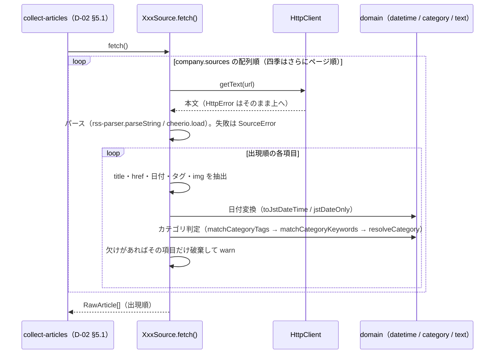
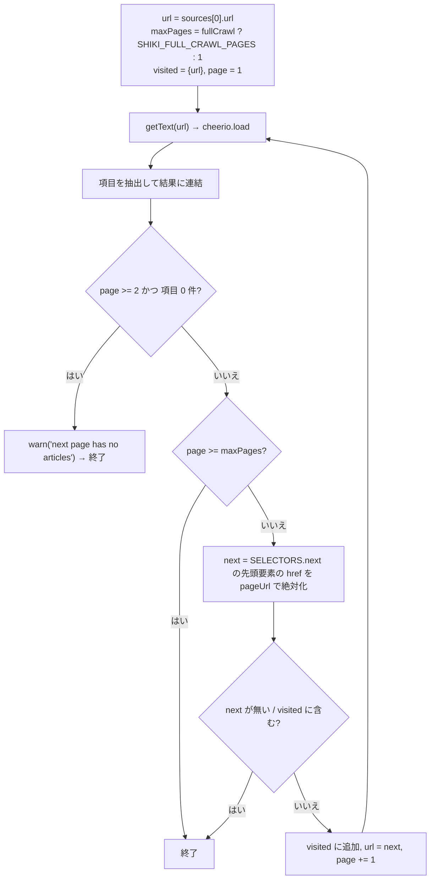

## 1. 目的と範囲

本書は、[D-02](D-02.md) §4.1 が定めた `Source` 契約（入力なし → `RawArticle[]`、失敗は例外）を **5 団体それぞれについてどう実装するか**を定める。決めるのは、(1) 各 Source の共通構造（ファクトリのシグネチャ・`fetch()` の流れ・記事単位の破棄規則）、(2) 団体ごとの取得 URL と方式（RSS / HTML、ページ送りの有無と最大ページ数）、(3) パース規則（rss-parser のフィールド、cheerio のセレクタ）、(4) 団体固有の URL 正規化（相対 URL の解決、東宝の 3 ドメイン吸収。R-8）、(5) 日付書式の解釈と `domain/datetime.ts` への接続、(6) カテゴリ判定に使う表（全団体共通キーワード表 `COMMON_CATEGORY_KEYWORDS` の具体値、団体別のタグ対応表と追加キーワード表。R-5）、(7) サムネイルの取得方法、(8) パーサーのフィクスチャテストである。決めないのは、`RawArticle` の確定（`id`・`contentHash`・`normalizeUrl`・`normalizeTitle`・`thumbnail` の検証。[D-02](D-02.md) §5.1）、Source の並行実行と失敗の集計（D-02 §5.1）、`articles.json` の形（[D-01](D-01.md)）、app 側のすべてである。D-01 の決定（§8 #1〜#34）と D-02 の決定（§8 #1〜#36）は本書の前提であり、変更しない。

セレクタとタグ文字列は調査レポート（2026-09-13）の記述から**推測した初期値**である。実サイトの HTML / RSS をフィクスチャとして保存した時点で、実装タスク（§10）が §4.2・§4.6 の値をフィクスチャに合わせて確定する。確定してよいのは値だけで、「どのフィールドをどこから取るか」の規則（§5）は変えない。

## 2. 要件との対応

| 要件 | 本書での扱い | 節 |
|---|---|---|
| R-5 カテゴリの自動判定精度 | ホリプロ・新感線は RSS の `category` 要素を、宝塚は一覧の分類タグを `CategoryTagMap` で写像し、写像できなければ全団体で見出しキーワードに進む（D-01 §5.3 の 2 段）。全団体共通キーワード表の具体値を `domain/category-keywords.ts` に、団体別の表を各 Source ファイル内に置き、表だけを差し替えて精度を調整できるようにする。フィクスチャテストで既知記事の判定結果を固定し、表の変更による退行を検知する | §4.6 / §5.1 / §7 |
| R-8 東宝のドメイン分散 | 東宝 Source が団体固有の正規化 `normalizeTohoUrl`（相対 URL の解決 → ホスト別名の統一 → 東宝系ホストの `http` → `https` → `index.html` の除去）を汎用正規化（D-01 §5.1）の前段として行い、同じ記事の表記揺れを 1 つの `id` に収束させる。`tohostage.com` 配下の現存ページへのリンクは書き換えず、開ける URL のまま格納する | §4.3 / §5.6 |
| R-9 新感線の公式ドメインのフィードが空 | 新感線 Source は `Company.sources[]` の URL（D-01 §4.3 で `https://blog.vi-shinkansen.co.jp/?feed=rss2` に固定）だけを取得し、URL をコードに持たない。フィクスチャは同 URL の実応答を保存し、`?p=NNNNN` 形式の記事 URL がそのまま返ることを固定する | §4.1 / §5.3 / §7 |
| 要件 §3.2 情報源（公式サイトのみ・静的 HTML） | 5 団体とも `HttpClient.getText()` で取得した静的 HTML / RSS を cheerio / rss-parser でパースする。ヘッドレスブラウザは使わない（CLAUDE.md） | §3 / §5 |
| 要件 §3.3 収集する情報カテゴリ | `CATEGORIES` の 7 値（D-01 §4.4）へ写像する表を §4.6 に置く。★1〜★3（新作・チケット・配信）のキーワードを厚くする | §4.6 |
| 要件 §5 相手サイトへの配慮 | リクエストは `HttpClient`（D-02 §5.7。UA・間隔・タイムアウト・上限 30）経由のみ。定常時のリクエスト数は 6（5 団体 + 東宝の 2 URL 目）、`fullCrawl` 時は 10（四季 5 ページ）で、D-02 #26・#31 の想定内に収める。robots.txt は調査レポート §1〜5 の結果（制限なし）を根拠にし、実装タスク着手時に再確認する（D-02 #6、§8 #12） | §4.2 / §5.4 / §10 |
| 要件 §7 記事本文を保持しない | `RawArticle` は見出し・URL・カテゴリ・掲載日・サムネイル URL だけを持つ。RSS の `description` / `content:encoded`、HTML の本文要素は読まない（サムネイル抽出にも使わない。§8 #5） | §4.1 / §5 |

### 2.1 画面定義との対応（scope: app のみ）

該当なし。本書は scope: collector であり、画面定義書を参照しない。

## 3. 構成

### 3.1 依存の方向


- `sources/` の 5 ファイルは互いに import しない（CLAUDE.md）。共通化は domain の純粋関数（`toJstDateTime`・`jstDateOnly`・`matchCategoryTags`・`matchCategoryKeywords`・`resolveCategory`・`foldText`・`normalizeTitle`）を各ファイルから呼ぶ形に限る（§8 #1）
- ネットワークは `HttpClient.getText()` だけを使う。rss-parser の `parseURL` は使わず `parseString` に本文を渡す（D-02 §4.3、CLAUDE.md）
- `application` への依存は無い。`sources/` が知るのは domain のポートと純粋関数だけである

### 3.2 ファイル配置

`（D-01）`・`（D-02）` は当該設計書が所有し、本書はその中の**値**だけを埋めるファイル。

```
collector/
  src/
    domain/
      category-keywords.ts       （D-01）COMMON_CATEGORY_KEYWORDS の値を §4.6 で埋める
    infrastructure/
      sources/
        horipro.ts               createHoriproSource / HoriproSource（RSS。§5.2）
        shinkansen.ts            createShinkansenSource / ShinkansenSource（RSS。§5.3）
        takarazuka.ts            createTakarazukaSource / TakarazukaSource（HTML。§5.4）
        shiki.ts                 createShikiSource / ShikiSource（HTML + ページ送り。§5.5）
        toho.ts                  createTohoSource / TohoSource（HTML + URL 正規化。§5.6）
    main.ts                      （D-02）SOURCE_FACTORIES に 5 団体の行を追加する（§5.7）
  test/
    helpers/
      stub-http-client.ts        StubHttpClient（§7.1）
    infrastructure/
      sources/
        horipro.test.ts
        shinkansen.test.ts
        takarazuka.test.ts
        shiki.test.ts
        toho.test.ts
    fixtures/
      sources/
        horipro/    feed.xml, README.md
        shinkansen/ feed.xml, README.md
        takarazuka/ news.html, README.md
        shiki/      news-p1.html, news-p2.html, news-last.html, README.md
        toho/       topics.html, news.html, README.md
```

フィクスチャは団体ごとのディレクトリに置き、`README.md` に取得 URL・取得日時・取得に使った User-Agent を記録する（§7.2）。ディレクトリを分けるのは、5 団体のタスクを並列に進めても同じファイルを編集しないため（§10）。

## 4. データ

### 4.1 Source の共通構造

すべての Source は同じ形のファクトリ関数とクラスを持つ。ファクトリのシグネチャは D-02 §5.5 手順 6 の `SOURCE_FACTORIES` の生成関数に一致させる。

```ts
// 各 sources/<id>.ts に共通する形（例: horipro.ts）
import type { Company } from "../../domain/company";
import type { HttpClient } from "../../domain/http-client";
import type { Logger } from "../../domain/logger";
import type { RawArticle, Source, SourceOptions } from "../../domain/source";
import type { CategoryTagMap } from "../../domain/category";
import type { CategoryKeywordTable } from "../../domain/category-keywords";

/** main.ts が渡す依存（D-02 §5.5 手順 6 の { http, logger }）。5 ファイルにそれぞれ同じ 2 行を書く（§8 #1） */
interface SourceDeps {
  readonly http: HttpClient;
  readonly logger: Logger;
}

/** カテゴリ判定に使う表。既定値はファイル内の定数（§4.6）。テストだけが差し替える（§7.3、§8 #9） */
export interface CategoryTables {
  readonly tagMap: CategoryTagMap;
  readonly keywords: CategoryKeywordTable;
}

/** RawArticle.companyId に入れるリテラル。company.id からは取らない（D-01 #32 の突合を機能させるため。§8 #2） */
const COMPANY_ID = "horipro";

export class HoriproSource implements Source {
  readonly id: string;
  constructor(
    private readonly company: Company,
    private readonly deps: SourceDeps,
    private readonly options: SourceOptions,
    private readonly tables: CategoryTables = HORIPRO_TABLES,
  ) {
    this.id = company.id;
    // company.sources の kind がこの Source の方式（"rss" / "html"）と一致しない要素があれば SourceError（§6）
  }
  async fetch(): Promise<readonly RawArticle[]> { /* §5.1 */ }
}

export function createHoriproSource(company: Company, deps: SourceDeps, options: SourceOptions): Source {
  return new HoriproSource(company, deps, options);
}
```

| 項目 | 規則 |
|---|---|
| `Source.id` | `company.id`（D-02 §4.1「既定は Company.id」） |
| `RawArticle.companyId` | ファイル内の定数 `COMPANY_ID` のリテラル。`company.id` を代入しない。取り違え（別団体の factory に配線された・コピーして書き換え忘れた）は application の突合（D-01 §4.2）が検出する |
| 取得先 | `company.sources` の配列順にすべての要素を使う。URL をコードに持たない（D-01 #20）。`kind` が方式と合わない要素が 1 つでもあればコンストラクタで `SourceError`（設定ミスを Source 失敗として見せる。D-02 §5.1 手順 2 が rejected に数える） |
| `options.fullCrawl` | 四季だけが参照する（§5.5）。他の 4 団体は受け取るが使わない（契約の形を揃える。D-02 §4.1） |
| `tables` | 第 4 引数。既定はファイル内の定数（§4.6）。ファクトリは渡さない。テストが D-01 §7.2 行 4 のケース（§7.3）を検証するために差し替える |
| 返却順 | `company.sources` の配列順 → ページ順（1 ページ目から）→ 各ページの DOM / フィード出現順（D-02 §4.1・§8.1） |
| 出力 | `RawArticle` の 6 フィールドのみ。`title` は生の文字列（`trim` のみ。正規化は application）、`url` は絶対 URL（団体固有正規化済み。汎用正規化は application）、`publishedAt` は D-01 §4.1 の書式、`category` は §5.1 の判定結果、`thumbnail` は取れたときだけキーを持つ（`exactOptionalPropertyTypes`。D-02 §4.9） |

### 4.2 取得 URL・方式・セレクタ（初期値）

`company.sources[]` の値は D-01 §4.3 の `data/companies.json` のとおりで、本書は変更しない。各 Source が `sources[]` に期待する内容と、パースに使うセレクタの初期値を示す。**セレクタは実サイトの構造を推測した初期値であり、実装時にフィクスチャで確認して確定する**（§1）。確定値はファイル内の `SELECTORS` 定数に置き、テストがフィクスチャで固定する。

| 団体 | `sources[]` | 方式 | ページ送り | 1 実行のリクエスト数 |
|---|---|---|---|---|
| ホリプロ | `rss` × 1（`https://horipro-stage.jp/feed/`） | RSS 2.0（rss-parser） | 無し | 1 |
| 新感線 | `rss` × 1（`https://blog.vi-shinkansen.co.jp/?feed=rss2`） | RSS 2.0（rss-parser） | 無し | 1 |
| 宝塚 | `html` × 1（`https://kageki.hankyu.co.jp/news/`） | HTML（cheerio） | 無し（1 ページに全件。調査レポート §3） | 1 |
| 四季 | `html` × 1（`https://www.shiki.jp/navi/news/`） | HTML（cheerio） | 有り。`fullCrawl` 偽 → 1 ページ、真 → 最大 `SHIKI_FULL_CRAWL_PAGES` = 5 ページ（§8 #6） | 1 または最大 5 |
| 東宝 | `html` × 2（`/stage/topics/`、`/stage/news/` の順） | HTML（cheerio） | 無し（§8 #7） | 2 |

```ts
// takarazuka.ts
/** 記事 URL の規則（調査レポート §3）。日付は URL から取る */
export const TAKARAZUKA_NEWS_URL_RE = /\/news\/(\d{4})(\d{2})(\d{2})_(\d{3})\.html$/;
const SELECTORS = {
  item: ".news-list li, ul.newsList > li, .newsList li",   // 一覧の 1 記事。フィクスチャで 1 つに絞る
  link: "a[href]",                                          // item 内の記事リンク
  tags: ".tag, .category, .cat",                            // item 内の分類タグ（複数可）
  dateText: ".date, time",                                  // URL から日付が取れないときの予備
  image: "img",                                             // item 内の先頭の img
} as const;
```

```ts
// shiki.ts
export const SHIKI_FULL_CRAWL_PAGES = 5;   // fullCrawl 時の最大ページ数（調査レポート §4「3〜5」の上限。§8 #6）
const SELECTORS = {
  item: ".news-list li, ul.newsList > li, .newsList li",
  link: "a[href]",
  title: ".title, .ttl",                                    // 無ければ link のテキスト
  dateText: "time[datetime], .date, time",
  image: "img",
  next: 'a[rel="next"], .pager a.next, .pagination a.next, a:contains("次へ")',   // 先頭で一致したものの href
} as const;
```

```ts
// toho.ts
const SELECTORS = {
  item: ".topics-list li, .news-list li, article, ul.list > li",   // /stage/topics/ と /stage/news/ で共通。差があればフィクスチャ確認時に pathname で分ける
  link: "a[href]",
  title: ".title, .ttl, h2, h3",                                    // 無ければ link のテキスト
  dateText: "time[datetime], .date, time",
  image: "img",
} as const;
```

RSS の 2 団体はセレクタを持たず、rss-parser の出力フィールドを使う（§4.5）。

### 4.3 団体固有の URL 正規化

汎用正規化（D-01 §5.1 `normalizeUrl`。フラグメント・追跡パラメータの除去、ホスト小文字化、既定ポート除去）は application が行う。Source が行うのは次の 2 種類である。

**共通：相対 URL の解決。** HTML の 3 団体は `new URL(href, pageUrl).toString()` で絶対化する（`pageUrl` はその要素を取得したページの URL）。`href` が空・`javascript:`・`mailto:`・`#` のみ → その記事を破棄（§6）。RSS の 2 団体は `link` が絶対 URL であることを前提にし、`new URL(link)` が失敗したら破棄する。

**東宝（R-8）：`normalizeTohoUrl(href, pageUrl)`。** 汎用正規化の前段として `RawArticle.url` に格納する値を決める。

```ts
// toho.ts
/** 東宝系のホスト。これらに限り http → https に揃える（調査レポート §5 の全 URL が https で提供されている） */
const TOHO_HOSTS: ReadonlySet<string> = new Set([
  "www.toho.co.jp", "www.tohostage.com", "teigeki.tohostage.com", "crea.tohostage.com",
  "tohostage.toho-navi.com",
]);
/** 同一サイトの別名。www 無し → www 有り */
const TOHO_HOST_ALIASES: ReadonlyMap<string, string> = new Map([
  ["toho.co.jp", "www.toho.co.jp"],
  ["tohostage.com", "www.tohostage.com"],
]);

export function normalizeTohoUrl(href: string, pageUrl: string): string {
  const u = new URL(href, pageUrl);                       // 1. 相対 URL の解決（失敗は呼び出し側が破棄）
  const host = u.hostname.toLowerCase();
  u.hostname = TOHO_HOST_ALIASES.get(host) ?? host;       // 2. 別名の統一
  if (u.protocol === "http:" && TOHO_HOSTS.has(u.hostname)) u.protocol = "https:";   // 3. 東宝系だけ https へ
  u.pathname = u.pathname.replace(/\/index\.html?$/, "/"); // 4. ディレクトリ既定ページの統一
  return u.toString();
}
```

| 入力（`pageUrl` = `https://www.toho.co.jp/stage/topics/`） | 出力 |
|---|---|
| `/stage/topics/2026/09/kingdom.html` | `https://www.toho.co.jp/stage/topics/2026/09/kingdom.html` |
| `http://toho.co.jp/stage/kingdom2/index.html` | `https://www.toho.co.jp/stage/kingdom2/` |
| `http://www.tohostage.com/kingdom2/` | `https://www.tohostage.com/kingdom2/`（パスは書き換えない。現存ページ。調査レポート §5） |
| `https://tohostage.toho-navi.com/tickets/123?x=1` | `https://tohostage.toho-navi.com/tickets/123?x=1`（クエリは保持） |
| `http://example.com/a/index.html` | `http://example.com/a/`（東宝系でないので https にしない。`index.html` 除去は全ホスト） |

他の 4 団体は団体固有の正規化を持たない（相対 URL の解決のみ）。

### 4.4 日付の解釈

すべて `domain/datetime.ts`（D-02 §4.2）に接続する。日付を得られない記事は破棄する（`publishedAt` に空文字を入れない。D-02 §4.2）。

| 団体 | 日付の所在 | 書式 | 変換 |
|---|---|---|---|
| ホリプロ・新感線 | `item.pubDate`（無ければ `item.isoDate`） | RFC822（任意のオフセット） | `toJstDateTime(new Date(pubDate))`。`InvalidDateTimeError` → 破棄 |
| 宝塚 | 記事 URL（`TAKARAZUKA_NEWS_URL_RE` の `YYYYMMDD`） | `20260913` | `jstDateOnly(y, m, d)`。URL が規則に合わなければ `SELECTORS.dateText` の `2026.09.13` を予備として同じ正規表現群で読む |
| 四季 | `SELECTORS.dateText` | `time[datetime]` の `YYYY-MM-DD` があれば優先、無ければテキストの `2026.09.12` | `jstDateOnly(y, m, d)` |
| 東宝 | `SELECTORS.dateText` | `time[datetime]` の `YYYY-MM-DD` があれば優先、無ければテキストの `2026年09月04日`（月日は 1〜2 桁） | `jstDateOnly(y, m, d)` |

```ts
// 各 HTML Source がファイル内に持つ日付テキストの正規表現（同じ 3 本を各ファイルに書く。§8 #1）
const DATE_ATTR_RE = /^(\d{4})-(\d{2})-(\d{2})/;               // time[datetime]
const DATE_DOT_RE = /(\d{4})\.(\d{1,2})\.(\d{1,2})/;           // 2026.09.12（宝塚の予備・四季）
const DATE_KANJI_RE = /(\d{4})年(\d{1,2})月(\d{1,2})日/;       // 2026年09月04日（東宝）
```

`Number()` で数値化し `jstDateOnly` へ渡す。`jstDateOnly` が投げる `InvalidDateTimeError`（`2026.13.40` など）はその記事の破棄理由になる。

### 4.5 RSS のフィールド対応（ホリプロ・新感線）

```ts
// horipro.ts / shinkansen.ts
import Parser from "rss-parser";

/** media:thumbnail / media:content を拾う。xml2js の出力は { $: { url } } の形 */
type MediaField = { readonly $?: { readonly url?: string } };
interface FeedItem {
  readonly title?: string;
  readonly link?: string;
  readonly pubDate?: string;
  readonly isoDate?: string;
  readonly categories?: readonly string[];
  readonly enclosure?: { readonly url?: string; readonly type?: string };
  readonly mediaThumbnail?: MediaField | readonly MediaField[];
  readonly mediaContent?: MediaField | readonly MediaField[];
}
const parser = new Parser<Record<string, never>, FeedItem>({
  customFields: { item: [["media:thumbnail", "mediaThumbnail"], ["media:content", "mediaContent"]] },
});
```

| `RawArticle` | 取得元 | 無い・不正なとき |
|---|---|---|
| `title` | `item.title` を `trim` | 空 → 破棄 |
| `url` | `item.link` を `trim`（`new URL()` が通ること） | 無い・相対 → 破棄 |
| `publishedAt` | `item.pubDate` → `item.isoDate` の順で `new Date()` | 両方無い・NaN → 破棄 |
| `category` | `siteTags = item.categories ?? []`（各要素を `trim`）を §5.1 の判定へ | 無ければ空配列（キーワード段階へ） |
| `thumbnail` | `enclosure.url`（`type` が `image/` 始まりのときだけ）→ `mediaThumbnail[0].$.url` → `mediaContent[0].$.url` の順で最初に得られた絶対 URL | 無ければキー省略。`description` / `content:encoded` は読まない（§8 #5・#16） |

### 4.6 カテゴリ判定の表

D-01 §4.4 の型（`CategoryKeywordTable`・`CategoryTagMap`）に値を入れる。全団体共通表は `domain/category-keywords.ts`（D-01 所有。値のみ本書）に、団体別の表は各 Source ファイル内の定数に置く（D-01 §8.1）。キーワードは照合時に `foldText`（NFKC・小文字）を通るため、表には全角・大文字のまま書いてよい。タグは**完全一致**（`foldText` を通さない。D-01 §4.4）なので、サイトの表記どおりに書く。

```ts
// collector/src/domain/category-keywords.ts（D-01 §4.4 の宣言に値を入れる）
export const COMMON_CATEGORY_KEYWORDS: CategoryKeywordTable = {
  new_work: ["上演決定", "公演決定", "開催決定", "上演が決定", "公演が決定", "新作", "初演", "再演", "製作発表", "制作発表", "ラインアップ", "ラインナップ"],
  ticket: ["チケット", "先行", "一般発売", "発売開始", "発売日", "販売開始", "抽選", "当落", "受付開始", "予約開始", "申込", "申し込み", "前売"],
  streaming: ["配信", "映像化", "Blu-ray", "ブルーレイ", "DVD", "ゲキ×シネ", "ライブビューイング", "LIVE VIEWING", "オンデマンド", "放送", "映画館"],
  schedule: ["公演スケジュール", "公演日程", "スケジュール", "日程", "公演時間", "開演時間", "開場時間", "上演時間", "公演期間", "休演日"],
  cast: ["キャスト", "配役", "出演決定", "出演者発表", "出演者決定", "キャスティング", "役替わり", "役替り"],
  person: ["退団", "移籍", "受賞", "入団", "訃報", "逝去", "就任", "襲名"],
  other: [],
};
```

団体別の表（各 Source ファイル内。`CategoryTables` の既定値）：

```ts
// horipro.ts（RSS の category 要素。作品名タグは表に無いので無視される。D-01 §5.3）
const HORIPRO_TABLES: CategoryTables = {
  tagMap: new Map([
    ["チケット情報", "ticket"], ["チケット", "ticket"],
    ["配信", "streaming"], ["映像", "streaming"], ["映像化", "streaming"],
    ["キャスト", "cast"], ["キャスト情報", "cast"],
    ["公演スケジュール", "schedule"], ["スケジュール", "schedule"],
    ["新作", "new_work"], ["公演決定", "new_work"],
  ]),   // 「重要なお知らせ」は写像しない（D-01 §5.3 の例のとおり other になる）
  keywords: { new_work: [], ticket: ["ホリプロステージ先行"], streaming: [], schedule: [], cast: [], person: [], other: [] },
};
```

```ts
// shinkansen.ts（RSS の category 要素。"NEWS" と作品名は写像しない）
const SHINKANSEN_TABLES: CategoryTables = {
  tagMap: new Map([
    ["ゲキ×シネ", "streaming"], ["映像", "streaming"], ["配信", "streaming"],
    ["チケット", "ticket"], ["チケット情報", "ticket"],
    ["キャスト", "cast"],
  ]),
  keywords: { new_work: [], ticket: [], streaming: ["ゲキ×シネ", "全国公開"], schedule: [], cast: [], person: [], other: [] },
};
```

```ts
// takarazuka.ts（一覧の分類タグ。組名（花・月・雪・星・宙）・劇場名は写像しない）
const TAKARAZUKA_TABLES: CategoryTables = {
  tagMap: new Map([
    ["チケット", "ticket"], ["チケット情報", "ticket"],
    ["配信", "streaming"], ["映像", "streaming"], ["スカイ・ステージ", "streaming"],
    ["公演スケジュール", "schedule"], ["公演時間", "schedule"],
    ["出演者", "cast"], ["配役", "cast"],
  ]),
  keywords: {
    new_work: ["公演ラインアップ", "公演ラインナップ"],
    ticket: ["宝塚友の会", "友の会"],
    streaming: ["タカラヅカ・スカイ・ステージ", "スカイ・ステージ", "ライブ中継"],
    schedule: [],
    cast: ["新人公演", "配役発表"],
    person: ["組替え", "組替", "トップスター", "お披露目", "退団者"],
    other: [],
  },
};
```

```ts
// shiki.ts（サイト側タグ無し。tagMap は空）
const SHIKI_TABLES: CategoryTables = {
  tagMap: new Map(),
  keywords: { new_work: ["開幕決定", "上演のお知らせ"], ticket: ["四季の会", "会員先行"], streaming: [], schedule: ["公演スケジュール"], cast: ["出演者のお知らせ", "出演俳優"], person: [], other: [] },
};
```

```ts
// toho.ts（サイト側タグ無し。tagMap は空）
const TOHO_TABLES: CategoryTables = {
  tagMap: new Map(),
  keywords: { new_work: [], ticket: ["ナビザーブ", "東宝ナビザーブ"], streaming: ["東宝ステージ配信", "アーカイブ配信"], schedule: [], cast: [], person: [], other: [] },
};
```

D-01 §4.2 のサンプル 3 件との整合：宝塚「…無料配信の実施について」→ 共通表 `配信` で `streaming`、ホリプロ「【重要】…公演中止のお詫びと払い戻し…」→ タグ「重要なお知らせ」は写像なし・キーワード該当なし → `other`、新感線「／爆烈忠臣蔵／ゲキ×シネ…全国公開決定！！」→ タグ「NEWS」は写像なし → 共通表 `ゲキ×シネ` で `streaming`。いずれもサンプルの `category` と一致する。「公開決定」は `new_work` の `公演決定` に一致しない（部分一致は「公演決定」の 4 文字）。

### 4.7 companies.json と Source の対応

`data/companies.json` は D-01 §4.3 の内容のまま変更しない。`main.ts` の `SOURCE_FACTORIES`（D-02 §5.5 手順 6）に次の 5 行を置く。

```ts
// main.ts（D-02 §5.5 手順 6 の表に値を入れる）
import { createHoriproSource } from "./infrastructure/sources/horipro.js";
import { createShinkansenSource } from "./infrastructure/sources/shinkansen.js";
import { createShikiSource } from "./infrastructure/sources/shiki.js";
import { createTakarazukaSource } from "./infrastructure/sources/takarazuka.js";
import { createTohoSource } from "./infrastructure/sources/toho.js";

// SourceFactory は D-02 §5.5 手順 6 の生成関数型 (company, { http, logger }, options) => Source の別名（main.ts 内で宣言）
const SOURCE_FACTORIES: Readonly<Record<string, SourceFactory>> = {
  takarazuka: createTakarazukaSource,
  shiki: createShikiSource,
  horipro: createHoriproSource,
  toho: createTohoSource,
  shinkansen: createShinkansenSource,
};
```

## 5. 処理フロー（正常系）

### 5.1 共通：`fetch()` の流れとカテゴリ判定

すべての Source の `fetch()` は同じ骨格を持つ。1 責務（1 団体の記事の素材を取る）・1 public メソッド。



- **入力**：なし（コンストラクタで受けた `company`・`deps`・`options`・`tables`）
- **ステップ**：
  1. `company.sources` を配列順に走査する。要素ごとに `body = await deps.http.getText(url)`。`HttpError` は捕まえずそのまま投げる（D-02 §4.3・§8.1。`formatError` が URL と status を含めて出す）
  2. 本文をパースする。RSS は `parser.parseString(body)`、HTML は `cheerio.load(body)`。パーサー自体の例外（XML として壊れている等）は `SourceError("failed to parse <url>", { cause })` に包んで投げる（§6）
  3. 項目を出現順に走査し、団体別の抽出規則（§5.2〜§5.6）で `title`・`url`・`publishedAt`・`siteTags`・`thumbnail` を得る。`title` が空・`url` が絶対化できない・日付が得られない・変換できない項目は**その項目だけ**捨て、`deps.logger.warn("article skipped", { sourceId: this.id, reason, url })` を出す（`reason` は `"no_title"` / `"no_link"` / `"no_date"` / `"invalid_date"` のいずれか。`url` は分かる範囲。§6）
  4. カテゴリを決める（D-01 §5.3 の手順を各ファイルのローカル関数 `classify` で呼ぶ。§8 #4）：

     ```ts
     function classify(rawTitle: string, siteTags: readonly string[], tables: CategoryTables): Category {
       const byTag = matchCategoryTags(siteTags, tables.tagMap);
       if (byTag.length > 0) return resolveCategory(byTag);                       // タグ段階で決まればキーワードに進まない
       const folded = foldText(normalizeTitle(rawTitle));                         // D-01 §5.3 は「正規化後の title」を入力とする
       const byKeyword = [
         ...matchCategoryKeywords(folded, COMMON_CATEGORY_KEYWORDS),
         ...matchCategoryKeywords(folded, tables.keywords),
       ];
       return resolveCategory(byKeyword);                                         // 空なら other
     }
     ```

  5. `RawArticle` を組み立てる。`thumbnail` は得られたときだけ条件付きスプレッドでキーを持たせる（D-02 §4.9）
  6. 全 `sources[]`（とページ）の結果を走査順に連結して返す。0 件でも例外にしない（application が `empty` として失敗に数える。D-02 #3）
- **出力**：`readonly RawArticle[]`
- **失敗時**：`HttpError`（取得失敗）または `SourceError`（パース不能・設定不整合）。記事単位の欠けは例外にせず破棄する

`normalizeTitle` を Source が呼ぶのはカテゴリ判定の入力を作るためだけで、`RawArticle.title` には生の文字列（`trim` のみ）を入れる（application が改めて `normalizeTitle` する。D-02 §5.1 手順 6-4。冪等なので二重適用は結果を変えない）。

### 5.2 ホリプロ（RSS）

- **取得**：`sources[0].url` を 1 回
- **項目**：`feed.items` を配列順に
- **抽出**：§4.5 の表
- **URL**：`item.link` を絶対 URL として検証するだけ（団体固有の正規化なし）
- **日付**：`pubDate` → `toJstDateTime`。例：`Tue, 08 Sep 2026 09:04:51 +0000` → `2026-09-08T18:04:51+09:00`（D-01 §4.2 サンプルと一致）
- **カテゴリ**：`siteTags = item.categories`（例：`["重要なお知らせ", "ハリー・ポッターと呪いの子"]`）→ `classify`
- **サムネイル**：§4.5 の順
- **fullCrawl**：無視

### 5.3 新感線（RSS）

- **取得**：`sources[0].url`（`https://blog.vi-shinkansen.co.jp/?feed=rss2`。R-9）を 1 回
- **項目・抽出・日付・サムネイル**：ホリプロと同じ（§4.5）
- **URL**：`item.link` は `https://blog.vi-shinkansen.co.jp/?p=13727` の形。クエリを変更しない（汎用正規化でも `?p=` は保持される。D-01 #10）
- **カテゴリ**：`siteTags = item.categories`（例：`["NEWS", "爆烈忠臣蔵"]`）→ `classify`。表は `SHINKANSEN_TABLES`
- **fullCrawl**：無視

### 5.4 宝塚（HTML）

- **取得**：`sources[0].url` を 1 回。応答は 100 件以上の一覧（2016 年まで。調査レポート §3）。全件を返し、100 件への切り詰めは `detect-diff` が行う
- **項目**：`$(SELECTORS.item)` を DOM 順に。項目内の `SELECTORS.link` の先頭要素を記事リンクとする
- **抽出**：
  - `href` → `new URL(href, pageUrl)` で絶対化。失敗 → 破棄（`no_link`）
  - 日付：絶対 URL のパスに `TAKARAZUKA_NEWS_URL_RE` を当て、`YYYY`・`MM`・`DD` → `jstDateOnly`。一致しなければ `SELECTORS.dateText` のテキストに `DATE_DOT_RE` を当てる。どちらも無ければ破棄（`no_date`）
  - `title`：リンク要素のテキストから、項目内の `SELECTORS.tags`・`SELECTORS.dateText` に当たる要素のテキストを除いた残り（cheerio で該当要素を `remove()` した複製から `text()` を取る）を `trim`。「新」バッジ等の装飾要素も同じ方法で除く（フィクスチャ確認時にセレクタへ追加する）
  - `siteTags`：項目内の `SELECTORS.tags` の各テキストを `trim`（例：`["花組", "宝塚大劇場"]`）
  - `thumbnail`：項目内の `SELECTORS.image` の先頭要素の `src`（無ければ `data-src`）。`data:` 始まり・空 → 省略。相対なら `pageUrl` で絶対化
- **カテゴリ**：`classify(title, siteTags, TAKARAZUKA_TABLES)`。組名・劇場名のタグは表に無いので無視され、キーワード段階に進む
- **fullCrawl**：無視

### 5.5 四季（HTML + ページ送り）



- **取得**：`sources[0].url` を 1 ページ目とし、`fullCrawl` が真なら「次へ」リンクを最大 `SHIKI_FULL_CRAWL_PAGES`（5）ページまで辿る。偽なら 1 ページのみ（D-02 §8.1・#27・#31）。次ページの URL は**リンクの `href` から取り、規則から組み立てない**（`?page=2` か `/index2.html` かが不明で、リンクを使えば改装に追随しやすい）
- **終端**：(a) `maxPages` に達した、(b) 次へリンクが無い、(c) 次へリンクの URL が既に取得済み（自己参照・ループ）、(d) 2 ページ目以降で項目が 0 件（構造不一致）。(d) は `warn` を出し、それまでのページの結果を返す（1 ページ目が 0 件なら空配列を返し、application が `empty` に数える）
- **項目**：各ページの `$(SELECTORS.item)` を DOM 順に
- **抽出**：
  - `href` → `pageUrl` で絶対化。失敗 → 破棄
  - 日付：`SELECTORS.dateText` の先頭要素。`time[datetime]` なら属性に `DATE_ATTR_RE`、それ以外はテキストに `DATE_DOT_RE`（`2026.09.12`）→ `jstDateOnly`
  - `title`：項目内の `SELECTORS.title` の先頭要素のテキスト。無ければリンク要素のテキストから日付要素を除いたもの。`trim`
  - `siteTags`：空配列（サイト側タグ無し）
  - `thumbnail`：宝塚と同じ
- **カテゴリ**：`classify(title, [], SHIKI_TABLES)`。例：「『バック・トゥ・ザ・フューチャー』東京公演 明日13日（日）「四季の会」会員先行予約開始！」→ 共通表 `先行`・団体表 `四季の会` → `ticket`
- **返却順**：1 ページ目の項目 → 2 ページ目の項目 →…（D-02 §4.1）

### 5.6 東宝（HTML × 2 URL + URL 正規化）

- **取得**：`sources[]` を配列順に（`/stage/topics/` → `/stage/news/`）。各 1 回、逐次。ページ送りはしない（§8 #7）。同一ホストなので `HostScheduler` が 1 秒以上の間隔を空ける（D-02 §5.7）
- **項目**：各ページの `$(SELECTORS.item)` を DOM 順に
- **抽出**：
  - `href` → `normalizeTohoUrl(href, pageUrl)`（§4.3）。`new URL` が失敗 → 破棄
  - 日付：`SELECTORS.dateText` の先頭要素。`time[datetime]` → `DATE_ATTR_RE`、テキスト → `DATE_KANJI_RE`（`2026年09月04日`・`2026年9月4日`）→ `jstDateOnly`
  - `title`：`SELECTORS.title` の先頭要素のテキスト。無ければリンク要素のテキストから日付要素を除いたもの
  - `siteTags`：空配列
  - `thumbnail`：宝塚と同じ（`src` は `pageUrl` で絶対化するだけで `normalizeTohoUrl` は通さない。`Article.thumbnail` はそのまま格納する契約。D-01 §5.4・§8.1）
- **カテゴリ**：`classify(title, [], TOHO_TABLES)`
- **返却順**：topics の項目 → news の項目。両方に同じ記事があれば application の重複規則（D-02 §5.1 手順 8）で topics 側が残る
- **fullCrawl**：無視

### 5.7 DI 配線（`main.ts`）

`SOURCE_FACTORIES` に §4.7 の 5 行を追加するだけ。D-02 §5.5 手順 6 の `buildSourceBindings` は変更しない。追加後、`CURTAINCALL_DRY_RUN=1 npm start` で 5 団体すべてが `not_implemented` でなくなり、`.run-summary.json` の `sourceFailures` が空（サイトが正常なとき）になることを §10 Task L の完了条件にする。

## 6. 異常系・境界

| ケース | 期待する振る舞い | 担当 |
|---|---|---|
| `company.sources` に方式と異なる `kind` の要素がある（宝塚に `rss`、ホリプロに `html`） | コンストラクタで `SourceError("unsupported source kind")`。D-02 §5.1 手順 2 が rejected（`reason: "error"`）に数え、他団体は続行 | 各 Source |
| `getText` が `HttpError`（404・5xx・タイムアウト・上限超過） | 捕まえずそのまま投げる。東宝で 1 URL 目が成功し 2 URL 目が失敗した場合も**例外**にする（部分結果を返さない。片方だけの結果を正常とみなすと news 側の故障に気付けない。§8 #8） | 各 Source |
| RSS が XML として壊れている・`rss` 要素が無い | `SourceError("failed to parse <url>", { cause })` | ホリプロ・新感線 |
| RSS の `items` が空 | 空配列を返す（application が `empty` に数える。D-02 #3） | ホリプロ・新感線 |
| RSS 項目に `link` が無い・相対 | その項目を破棄し `warn("article skipped", { reason: "no_link" })` | ホリプロ・新感線 |
| RSS 項目の `pubDate` と `isoDate` が両方無い・`new Date()` が NaN | 破棄・`warn`（`reason: "invalid_date"`）。`publishedAt` に空文字を入れない（D-02 §4.2） | ホリプロ・新感線 |
| RSS 項目の `categories` が無い | `siteTags = []` としてキーワード段階に進む | ホリプロ・新感線 |
| RSS の `enclosure.type` が `image/` 以外（`audio/mpeg` 等） | サムネイルにしない。`media:*` に進む | ホリプロ・新感線 |
| HTML で `SELECTORS.item` が 1 つも一致しない（改装） | 空配列を返す。1 ページ目なら application が `empty` に数える（R-2 の主要な検知経路） | 宝塚・四季・東宝 |
| HTML の一部の項目でリンク・日付・見出しが取れない（改装で一部のカードだけ構造が変わった） | その項目だけ破棄し `warn`。残りは返す。Source 側で破棄した件数は `discardedByCompany`（D-02 §4.6）には**載らない**（application に渡らないため）。破棄の検知は `warn` ログとフィクスチャテストに任せる（§8 #8） | 宝塚・四季・東宝 |
| 宝塚のリンク URL が `TAKARAZUKA_NEWS_URL_RE` に合わない（`/news/` 以外へのリンク、PDF） | `SELECTORS.dateText` を予備に使い、それも無ければ破棄（`no_date`）。URL の形では弾かない | 宝塚 |
| 宝塚の URL の日付が実在しない（`20261340_001.html`） | `jstDateOnly` の `InvalidDateTimeError` → 破棄（`invalid_date`） | 宝塚 |
| `href` が `#`・空・`javascript:`・`mailto:` | 破棄（`no_link`）。`new URL("#", pageUrl)` は成功するため、`href.trim()` が空・`#` 始まり・`javascript:` / `mailto:` 始まりを先に弾く | 宝塚・四季・東宝 |
| 四季の「次へ」リンクが無い（最終ページ） | そこで終了。`fullCrawl` でも `maxPages` 未満で止まる | 四季 |
| 四季の「次へ」リンクが自分自身または既出のページを指す（改装でリンクが壊れた） | `visited` で検知して終了、`warn("next page already visited")`。無限ループにしない。http 層の `maxRequestsPerRun`（30）はさらに外側の天井（D-02 #31） | 四季 |
| 四季の 2 ページ目以降が 0 件 | `warn` を出して終了。それまでの結果を返す | 四季 |
| 四季で `fullCrawl` 偽 | 「次へ」を見ず 1 ページで終了（リクエスト 1 回） | 四季 |
| 東宝のリンクが `tohostage.com` 配下の現存ページ・`toho-navi.com` のチケットページ・`stagegate.jp` | `normalizeTohoUrl` を通した絶対 URL をそのまま `url` にする（パスを書き換えない。開ける URL を格納する。D-01 #10） | 東宝 |
| 東宝の `href` が `http://` の東宝系ホスト | `https://` に揃える（§4.3）。東宝系以外のホストは変更しない | 東宝 |
| 東宝の topics と news に同じ記事 | 両方返す。application の重複規則で topics 側（`sources[]` の先）が残る（D-01 §6） | 東宝 / application |
| サムネイルの `src` が `data:` URI・空・相対 | `data:`・空 → 省略。相対 → `pageUrl` で絶対化。絶対化に失敗 → 省略（記事は残す） | 宝塚・四季・東宝 |
| 見出しに改行・連続空白・全角スペースが含まれる | `trim` だけして返す。圧縮は application の `normalizeTitle`（D-02 §5.1 手順 6-4） | 各 Source |
| 見出しがカテゴリ表の複数キーワードに一致 | `resolveCategory` の優先順位（D-01 §4.4）で 1 値。例：「上演決定！チケット一般発売は…」→ `new_work` | 各 Source |
| タグ段階で決まった記事の見出しに別カテゴリのキーワード | タグ段階の結果を採用し、キーワード段階に進まない（D-01 §5.3 手順 1） | 各 Source |
| 文字コードが Shift_JIS のページ（東宝旧ドメイン） | `HttpClient` がデコード済みの文字列を返す（D-02 §5.7）。Source は文字コードを扱わない | http |
| `company.id` が `COMPANY_ID` と違う（`SOURCE_FACTORIES` の配線ミス） | Source は検査しない。返した `RawArticle.companyId`（リテラル）を application が呼び出し時の `Company.id` と突合して全件破棄・Source 失敗にする（D-01 #32） | application |

## 7. テスト方針

テストの単位は本来 UseCase だが、パーサーは CLAUDE.md の例外規定「infrastructure のパーサーは実サイトの HTML / RSS をフィクスチャとして保存し、パース結果を検証する」に従い、Source ごとにフィクスチャテストを置く（D-02 §7 冒頭・§8.1）。`HttpClient` は `StubHttpClient` に差し替え、実サイトへは一切アクセスしない。`Logger` は D-02 §7.2 の `RecordingLogger`。

### 7.1 テストダブル（`test/helpers/stub-http-client.ts`）

```ts
import { HttpError, type HttpClient } from "../../src/domain/http-client";

export type StubResponse = string | Error;

/** URL → 本文（または投げる Error）。未登録の URL は HttpError(404)。呼び出した URL を順に記録する */
export class StubHttpClient implements HttpClient {
  readonly requests: string[] = [];
  constructor(private readonly responses: Readonly<Record<string, StubResponse>>) {}
  async getText(url: string): Promise<string> {
    this.requests.push(url);
    const r = this.responses[url];
    if (r === undefined) throw new HttpError("not stubbed", url, 404);
    if (r instanceof Error) throw r;
    return r;
  }
}
```

フィクスチャは `fs.readFileSync(new URL("../../fixtures/sources/<id>/<file>", import.meta.url), "utf8")` で読む。`Company` は D-02 §7.2 の `buildCompanies()` で実ファイル `data/companies.json` から取り、`id` で選ぶ（定義のずれを検知する）。

### 7.2 フィクスチャの取得規則

| 項目 | 規則 |
|---|---|
| 取得方法 | 実装タスクで 1 回だけ、`curl -A "<D-01 §4.7 の UA>" <url>` で保存する。テストからは取得しない |
| 保存内容 | 応答本文をそのまま（改変しない）。文字コードは UTF-8 で保存（東宝旧ドメインの Shift_JIS ページは対象外。取得先は `www.toho.co.jp` のみ） |
| `README.md` | 各ディレクトリに、ファイル名・取得 URL・取得日時（JST）・その時点の件数を表で記録する |
| 四季 | `news-p1.html`（1 ページ目）、`news-p2.html`（2 ページ目）、`news-last.html`（「次へ」リンクが無い最終ページ。無ければ 2 ページ目の HTML から次へリンクを取り除いた派生ファイルにし、README にその旨を書く） |
| 更新 | サイト改装で Source を直すときにフィクスチャも取り直し、README の日時を更新する（R-2） |

### 7.3 Source ごとのケース

読み替え規則は D-02 §7.1 と同じ（1 行 = 1 `describe`、「／」区切り = 1 `it`）。「期待値の固定」とは、フィクスチャの特定の項目（先頭など）について `title`・`url`・`publishedAt`・`category` の実値をテストに書くことを指す（改装・表の変更の検知）。

| Source | ケース | 差し替えるもの |
|---|---|---|
| 共通（5 Source すべて） | 契約：`fetch()` の結果が 1 件以上／全記事の `companyId` が定数と一致／`url` が `https?://` 始まりの絶対 URL／`publishedAt` が `DateTimeSchema` を通る／`category` が `CategorySchema` を通る／`thumbnail` はキーが無いか `https?://` 始まり／`title` が空でない／`Source.id` が `company.id`／`requests` が `company.sources[].url` と一致（四季の `fullCrawl` 偽・東宝は 2 件）／`getText` が `HttpError` を投げたらそのまま伝わる／`kind` の違う `sources` を持つ `Company` で構築すると `SourceError` | `StubHttpClient`（フィクスチャ）、`RecordingLogger`、`buildCompanies()` |
| `HoriproSource` | フィクスチャ：先頭項目の 4 値を固定（`publishedAt` は `pubDate` を +09:00 に変換した値）／`categories` の先頭項目が `siteTags` として扱われる（タグ表に載る項目があれば `category` が表の値）／サムネイルは `enclosure` / `media:*` があれば絶対 URL、無ければキー省略 | 同上 |
| `HoriproSource` | 記事単位の破棄（合成した最小 RSS）：`link` 無しの項目が捨てられ `warn` の `reason` が `no_link`／`pubDate` が `not a date` の項目が捨てられ `reason` が `invalid_date`／`pubDate` 無し・`isoDate` 有りは採用／`title` が空白のみの項目が捨てられる／`items` 0 件のフィードで空配列（例外にならない）／XML として壊れた本文で `SourceError`（`cause` あり） | 合成 RSS 文字列 |
| `HoriproSource` | category（D-01 §7.2 行 4 の 9 ケース。合成 RSS + `tables` 差し替え）：候補なし → `other`／見出しに `先行` と `上演決定` → `new_work`（`["ticket","new_work"]`）／`退団` と `キャスト` → `cast`（`["person","cast"]`）／`日程` のみ → `schedule`（`["other","schedule"]`）／タグ `X` → `cast` の表と見出し `上演決定` → `cast`（タグ段階で決まればキーワードに進まない）／タグ `作品名` が表に無く見出しも該当なし → `other`（表に無いタグは無視）／見出し「ＢＬＵ－ＲＡＹ」がキーワード `Blu-ray` に一致 → `streaming`（全角半角・大小文字を無視）／共通表に無く団体表にだけある語 `ホリプロステージ先行` → `ticket`、共通表 `配信` と団体表 `ホリプロステージ先行` の両方を含む → `ticket`（両表の候補が `resolveCategory` に渡る）／`keywords.ticket = [""]` の表で見出し「あ」→ `other`（空文字は一致しない） | 合成 RSS、`tables` を第 4 引数で差し替え |
| `ShinkansenSource` | フィクスチャ：先頭項目の 4 値を固定／`url` が `?p=NNNNN` のクエリを保持／「ゲキ×シネ」を含む項目が `streaming`／`requests` が `https://blog.vi-shinkansen.co.jp/?feed=rss2` の 1 件（R-9） | `StubHttpClient`、`buildCompanies()` |
| `ShinkansenSource` | 記事単位の破棄：ホリプロと同じ 6 ケース（`link` 無し／`invalid_date`／`isoDate` 採用／空見出し／0 件／壊れた XML） | 合成 RSS |
| `TakarazukaSource` | フィクスチャ：10 件以上／先頭項目の 4 値を固定（`publishedAt` は URL の `YYYYMMDD` から `T00:00:00+09:00`）／`url` が絶対 URL で `/news/YYYYMMDD_NNN.html` 形式／返却順が一覧の DOM 順（先頭 3 件の URL 列を固定）／分類タグが `siteTags` になる（表に載る項目があればその `category`）／「無料配信」を含む項目が `streaming` | `StubHttpClient` |
| `TakarazukaSource` | 記事単位の破棄（フィクスチャを改変した HTML）：URL が規則に合わず日付テキストも無い項目 → 破棄・`no_date`／URL が `20261340_001.html` → 破棄・`invalid_date`／`href` が `#` → 破棄・`no_link`／相対 `href` が絶対化される／`item` セレクタが 1 つも一致しない HTML → 空配列 | フィクスチャの文字列置換 |
| `ShikiSource` | ページ送り：`fullCrawl: false` → `requests` が 1 件・1 ページ目の項目のみ／`fullCrawl: true` で p1 → p2 → last の 3 ページ → `requests` が 3 件で順序どおり・結果が p1・p2・last の項目を順に連結／`fullCrawl: true` で p2 の「次へ」が p1 を指す → 2 ページで止まり `warn("next page already visited")`／`fullCrawl: true` で毎回同じ「次へ」先が新しい URL に見える（`?page=N` を N=2..9 で登録）→ `SHIKI_FULL_CRAWL_PAGES`（5）で止まり `requests` が 5 件／`fullCrawl: true` で p2 が項目 0 件 → p1 の結果だけ返し `warn`／p1 が項目 0 件 → 空配列 | `StubHttpClient`（複数 URL）、`RecordingLogger` |
| `ShikiSource` | フィクスチャ：先頭項目の 4 値を固定（`2026.09.12` → `2026-09-12T00:00:00+09:00`）／「四季の会」「先行予約」を含む項目が `ticket`／相対 `href` が `https://www.shiki.jp/` で絶対化 | `StubHttpClient` |
| `TohoSource` | 2 URL：`requests` が `[topics, news]` の順／結果が topics の項目 → news の項目の順（各先頭の `url` を固定）／news 側が `HttpError` → `fetch()` が `HttpError` を投げる（部分結果を返さない） | `StubHttpClient` |
| `TohoSource` | URL 正規化（`normalizeTohoUrl` を Source 経由で。フィクスチャを改変した HTML の `href`）：相対 `/stage/x.html` → `https://www.toho.co.jp/stage/x.html`／`http://toho.co.jp/stage/kingdom2/index.html` → `https://www.toho.co.jp/stage/kingdom2/`／`http://www.tohostage.com/kingdom2/` → `https://www.tohostage.com/kingdom2/`／`https://tohostage.toho-navi.com/t/1?x=1` → 変更なし／`http://example.com/a/index.html` → `http://example.com/a/`（https にしない） | フィクスチャの文字列置換 |
| `TohoSource` | フィクスチャ：先頭項目の 4 値を固定（`2026年09月04日` → `2026-09-04T00:00:00+09:00`）／`2026年9月4日`（1 桁）も同じ値／`time[datetime="2026-09-04"]` があれば属性を優先 | `StubHttpClient`、改変 HTML |

## 8. 決定事項と根拠

| # | 決定 | 採らなかった案 | 理由 |
|---|---|---|---|
| 1 | Source 間の共通化は domain の純粋関数を各ファイルから呼ぶ形に限り、`sources/` 内に基底クラス・共通ヘルパを置かない。`SourceDeps`・`CategoryTables`・日付の正規表現・`classify` の 6 行は 5 ファイルにそれぞれ書く | `sources/base-html-source.ts` を作って継承する／`infrastructure/html/` に cheerio ヘルパを置く | CLAUDE.md「`sources/` 配下のファイル同士の import 禁止」と R-2（1 サイトの故障が他に波及しない）。基底クラスは改装対応で 1 団体を直すときに他団体の挙動を変える経路になる。重複するのは 2 行の型・3 本の正規表現・6 行の判定関数で、サイト固有の抽出規則（本体）は共通化できない。`infrastructure/html/` 案は依存の方向は満たすが、抽象化する対象が「cheerio を呼ぶ 1 行」しか無く、層を増やす利益が無い |
| 2 | `RawArticle.companyId` はファイル内のリテラル `COMPANY_ID` を入れ、`company.id` を代入しない。Source は `company.id` との一致を検査しない | `company.id` を代入する／コンストラクタで一致を検査して `SourceError` | D-01 #32 の突合は「Source が返した `companyId`」と「呼び出し時の `Company.id`」を比べることで、コピーによる団体追加のリテラル書き換え忘れと DI 配線ミスを検出する。`company.id` を代入すると常に一致してこの防衛線が消える。コンストラクタ検査は同じ事故を別の場所でも検出する二重化で、D-01 が application の突合を「唯一の防衛線」と定めた設計と役割が重なる |
| 3 | 取得 URL は `company.sources[]` の全要素を配列順に使い、`kind` が方式と合わない要素があればコンストラクタで `SourceError` | `sources[0]` だけを使う／`kind` を無視する | D-01 #20（URL は設定ファイル）と D-02 §4.1（`sources` の配列順で返す）。東宝は 2 要素を使う。`kind` の不一致は設定ミスであり、RSS パーサーに HTML を食わせて 0 件になるより、設定ミスとして即座に失敗させた方が原因が読める |
| 4 | カテゴリ判定の 3 段呼び出し（`matchCategoryTags` → `matchCategoryKeywords` → `resolveCategory`）は各 Source のローカル関数 `classify` に書く。キーワード段階の入力は `foldText(normalizeTitle(rawTitle))` | `domain/category.ts` に `classifyCategory` を追加して 5 Source から呼ぶ／`foldText(rawTitle)` を入力にする | D-01 §8.1 が「照合は 3 関数を §5.3 の手順で呼び、Source 内に照合ロジックを書かない」と申し送っており、呼び出しの組み立ては Source の責務として定義されている。domain に関数を足す案は D-01 §3.2（approved）の `category.ts` の内容を変える改訂が要る（#18 で確定）。入力に `normalizeTitle` を通すのは D-01 §5.3 が「正規化後の `title`」を入力と定めているため。`normalizeTitle` は冪等で、application の再適用と結果が変わらない |
| 5 | サムネイルは RSS では `enclosure`（`image/*`）→ `media:thumbnail` → `media:content`、HTML では項目内の先頭 `img` の `src` / `data-src` から取る。RSS の `description` / `content:encoded`、HTML の記事ページは読まない | `content:encoded` の先頭 `` を拾う／記事ページを個別に取得して OGP 画像を取る | 要件 §7「本文を保持しない」の趣旨と、本文相当のフィールドを読まない運用を単純に保つ。記事ページの個別取得はリクエスト数を記事数倍にし、要件 §5 の配慮と D-02 #31 の上限に反する。取れない団体はキー省略で記事は残る（D-01 §5.4）ため機能上の欠落にならない（F-02「取得できれば」。#16 で確定） |
| 6 | 四季の `fullCrawl` 時の最大ページ数は 5（`SHIKI_FULL_CRAWL_PAGES`）。次ページ URL はリンクの `href` から取り、規則から組み立てない。終端は「最大ページ・リンク無し・既出 URL・2 ページ目以降 0 件」の 4 条件 | 3 ページ／規則（`?page=N`）で URL を組み立てる／リンク有無だけで終端判定 | 調査レポート §4 の「3〜5」の上限。1 ページ 10 件なので 5 ページで 50 件（上限 100 の半分）が初回に揃い、`fullCrawl` 全団体でもリクエスト総数は 10（D-02 #26 の想定「初回 10 件程度」）に収まる。3 ページでは初日 30 件で app の一覧が薄い。URL を組み立てるとページ送りの実装（クエリかパスか）を推測で固定することになり、リンクを辿る方が改装に強い。既出 URL と 0 件の終端は D-02 §8.1「終端判定だけに依存しない」への対応で、http 層の 30 件上限は最後の天井として残す（#15 で確定） |
| 7 | 東宝はページ送りをしない（topics・news とも 1 ページ目のみ）。`fullCrawl` を無視する | news を `fullCrawl` 時に 2〜3 ページ辿る | 調査レポート §5：topics は 12 件以上が 1 ページに載り、news は年に数件の更新で 4 件/ページ。初回で 16 件程度が揃い、以後は毎時 2 リクエストで取りこぼさない。news の過去分は重要度が高くても更新頻度が低く、遡る利益がリクエスト増（要件 §5）に見合わない。D-02 §8.1 の「ページ送りを持つ Source（四季・東宝）」の申し送りは、東宝については「持たない」と本書で確定する |
| 8 | 記事単位の欠け（リンク・見出し・日付）は Source が破棄して `warn` を出す。Source 内の破棄件数は `discardedByCompany` に載せない。東宝の 2 URL 目の `HttpError` は部分結果を返さず例外にする | 欠けた項目を `publishedAt: ""` 等で返して application に数えさせる／`RawArticle` に破棄件数を添えて返す／東宝で取れた URL の分だけ返す | D-02 §4.2 が `publishedAt` の空文字を禁じ、`RawArticle` の契約（D-02 §4.1）は破棄件数のフィールドを持たない。契約を変えずに済ませ、破棄の検知は `warn` ログとフィクスチャテスト（CLAUDE.md が改装検知の手段と定める）に任せる。東宝で部分結果を返すと news 側の恒久的な故障が `failures` に載らず、D-02 #25 の失敗通知に届かない |
| 9 | Source のクラスは第 4 引数 `tables: CategoryTables`（既定値はファイル内の定数）を持ち、ファクトリは渡さない。テストだけが差し替える | 表を差し替えられなくする（9 ケースを表の実値で検証）／テスト専用の `setTables()` を生やす | D-01 §7.2 行 4 は「`CategoryTagMap`・`CategoryKeywordTable` を渡す」ケースを求めており、D-02 §8.1 がそれを本書の Source テストに移管した。「空文字のキーワードは一致しない」「タグ段階で決まればキーワードに進まない」は実値の表では再現しにくい（実値に空文字を入れない）。コンストラクタ引数の既定値は DI の通常の形で、setter より不変性を保てる（#20 で確定） |
| 10 | 全団体共通キーワード表と団体別表の初期値は §4.6 のとおり。★1〜★3 の 3 カテゴリを厚くし、`other` は空 | ★1〜★3 だけ埋めて他は空にする／団体別表を持たず共通表だけにする | 要件 §3.3 が優先度を ★1〜★3 に置き、R-5 が「実データを見て調整する」と定める。初期値が空だと `schedule`・`cast`・`person` の記事がすべて `other` になり、S-00 §7.2 のカテゴリアイコンが機能しない。団体別表は「四季の会」「組替え」など団体でしか使わない語を共通表に混ぜないためで、D-01 §4.4・§5.3 の設計（共通 + 団体別）に沿う。D-01 §4.2 サンプル 3 件の `category` と一致することを §4.6 末尾で確認した（#19 で確定） |
| 11 | 東宝の団体固有正規化は「相対解決 → ホスト別名（`toho.co.jp` → `www.toho.co.jp`、`tohostage.com` → `www.tohostage.com`）→ 東宝系ホストのみ `http` → `https` → `/index.html` の除去」の 4 段。パスの書き換え（`tohostage.com` → `toho.co.jp`）はしない | 相対解決だけにする／旧ドメインのパスを新ドメインへ写像する／`toho-navi.com` のクエリを削る | R-8 の「不整合」は同じ記事が表記違いで複数の `id` になることで、ホスト別名・スキーム・`index.html` の 3 点がその典型（同じサイト内で `http://` と `https://`、`www` 有無が混在するのはよくある）。旧ドメインの作品ページは現存し新ドメインに同じパスが無い（調査レポート §5）ため、パスを写像すると開けない URL を格納する（D-01 #10 に反する）。`toho-navi.com` のクエリはチケットページの識別子である可能性があり、汎用正規化（D-01 §5.1）が追跡パラメータだけを除く方針と揃える（#17 で確定） |
| 12 | robots.txt は実行時に取得しない（D-02 #6）。本書の執筆時点ではネットワークにアクセスせず、調査レポート（2026-09-13）の記載を根拠にする。実装タスク（§10 Task K1〜K5）の着手時に各サイトの robots.txt を再確認し、対象パスに制限が入っていればその団体の Source を実装せず（`SOURCE_FACTORIES` に載せず）報告することを完了条件に含める | 本書の執筆時に再確認する | design-writer はネットワークにアクセスしない。フィクスチャを取得する実装タスクが同じタイミングで robots.txt を確認する方が、確認結果と保存した HTML の時点が一致する。D-02 §8.1 の「D-03 の執筆時に再確認」は「実装タスクの着手時」に読み替え、本書 §10 の完了条件で担保する |
| 13 | HTML の 3 団体は `item` セレクタで項目を絞り、項目内の先頭リンクを記事リンクとする。宝塚は URL の規則を日付の**取得元**にだけ使い、URL の形で項目を弾かない | ページ内の全 `a[href]` から URL 規則に合うものを拾う（コンテナ非依存） | 全リンク走査はヘッダ・フッタのナビゲーションや関連リンクを拾い、見出し・日付・タグの対応が取れない。コンテナで絞れば日付・タグ・画像を同じ項目内から取れる。宝塚で URL の形で弾かないのは、`/news/` 配下でない告知（PDF 等）を日付テキストで救う余地を残すため。改装で `item` が一致しなくなれば 0 件になり、R-2 の検知経路（D-02 #3）に乗る |
| 14 | フィクスチャは団体ごとのディレクトリ `test/fixtures/sources/<id>/` に置き、`README.md` で取得 URL・日時を記録する。取得は `curl` で 1 回、テストからは行わない | 1 ディレクトリに全団体のファイルを平置きし共通の README に記録する | §10 の 5 タスクを並列にしたとき、共通 README は 5 タスクが同じファイルを編集してマージ衝突する（D-02 §10 が `test/helpers/index.ts` を作らない理由と同じ）。取得日時を残すのは、改装検知（R-2）で「いつの構造で通ったテストか」を読めるようにするため |
| 15 | 四季の `fullCrawl` 時の最大ページ数 `SHIKI_FULL_CRAWL_PAGES` は 5（初回 50 件、`fullCrawl` 全団体で 10 リクエスト。§4.2・§5.5・§7.3、#6） | 3 ページ（初回 30 件、8 リクエスト）／10 ページ（初回 100 件、15 リクエスト。調査レポートの範囲外） | 調査レポート §4 の「3〜5」の上限で、D-02 #26 の「初回 10 件程度」と一致し、上限 100 の半分が初日に揃う。開発者の指示により推奨案を採用（2026-09-19、旧 Q-1） |
| 16 | RSS 2 団体のサムネイルは `enclosure`（`image/*`）／`media:thumbnail`／`media:content` のみから取る（§4.5・§5.2・§5.3、#5） | `content:encoded` の先頭 `` も拾う／RSS ではサムネイルを取らない | 本文相当のフィールドを読まない方針（要件 §7 の趣旨、#5）を保ちつつ、WordPress のプラグインが出す `media:*` は拾える。`content:encoded` 案は本文 HTML のパースが要り、取らない案は取れる可能性を捨てる。開発者の指示により推奨案を採用（2026-09-19、旧 Q-2） |
| 17 | 東宝の団体固有正規化は「相対解決 + ホスト別名 + 東宝系の `http` → `https` + `/index.html` 除去」の 4 段（§4.3・§5.6、#11） | 相対解決のみ／4 段に加えて `toho-navi.com` のクエリを全削除 | R-8 の表記揺れ 3 種を吸収し、開けない URL を作らない。相対解決のみでは `http` / `www` 混在で同じ記事が 2 件になり、クエリ全削除はチケットページの識別子を壊す恐れがある。開発者の指示により推奨案を採用（2026-09-19、旧 Q-3） |
| 18 | カテゴリ判定の 3 段呼び出しは各 Source のローカル関数 `classify`（6 行 × 5 ファイル）に置き、D-01 を変えない（§5.1、#4） | `domain/category.ts` に `classifyCategory` を追加し D-01 §3.2 を改訂する | D-01（approved）の `category.ts` の内容を変えず、D-01 §8.1 の申し送り（Source が 3 関数を手順どおり呼ぶ）のとおり。domain に足す案は重複を無くせるが D-01 の再レビューが要る。開発者の指示により推奨案を採用（2026-09-19、旧 Q-4） |
| 19 | キーワード表の初期値は §4.6 の表のとおり 7 カテゴリすべてに語を置く（`other` は空。§4.6・§7.3、#10） | ★1〜★3（`new_work`・`ticket`・`streaming`）だけ埋め、他は空にする | 要件 §3.3 の全カテゴリが S-00 §7.2 のアイコンに対応しており、空だと `other` に偏る。誤判定は R-5 のとおり実データで表を直す。開発者の指示により推奨案を採用（2026-09-19、旧 Q-5） |
| 20 | Source クラスは第 4 引数 `tables: CategoryTables`（既定値付き。ファクトリは渡さない）を持ち、テストだけが差し替える（§4.1・§7.3、#9） | 差し替えを許可せず、D-01 §7.2 行 4 の 9 ケースを実値の表で再現できる範囲だけ検証する | 「空文字のキーワードは一致しない」「タグ段階で決まればキーワードに進まない」を実値の表で再現するには実値に不自然な項目が要る。既定値付き引数は本番の挙動を変えない。開発者の指示により推奨案を採用（2026-09-19、旧 Q-6） |

### 8.1 他設計書への申し送り

| 宛先 | 内容 | 根拠 |
|---|---|---|
| D-02（変更不要。確認事項） | 東宝はページ送りを持たない（§8 #7）。D-02 §8.1 の「ページ送りを持つ Source（四季・東宝）」は四季のみに読み替える。D-02 の決定・コードは変わらない | §8 #7 |
| D-02（変更不要。確認事項） | Source 内で破棄した記事（リンク・日付・見出しの欠け）は `discardedByCompany` に載らない（§8 #8）。D-02 §6「部分破棄」の行が想定する「`publishedAt` が取れない」ケースの一部は Source 側の `warn` ログにだけ残る。ステップサマリには出ないが、フィクスチャテストが改装を検知する | §8 #8、D-02 #33 |
| D-01（変更不要。確認事項） | `COMMON_CATEGORY_KEYWORDS` の値を §4.6 で埋める。D-01 §10 Task B が空配列で作ったものを §10 Task J が上書きする。型・関数は変えない | D-01 §8.1 |
| D-04 / D-05 | `category` の判定精度は本書の表に依存し、実データを見て表だけを更新する運用（R-5）。app 側はカテゴリの値が実行ごとに変わりうる（表の更新で同じ記事の `category` が変わる）ことを前提に、`category` を既読・保存のキーにしない | R-5、D-01 §5.2 継続行（`category` は今回値で上書き） |

## 9. 未決定事項

該当なし。初稿の Q-1〜Q-6 は開発者の指示により推奨案を採用し、§8 #15〜#20 に移した（2026-09-19）。

## 10. タスク分割の目安

D-02 §10 の Task I（`main.ts`・`SOURCE_FACTORIES` 空）の後に着手する。K1〜K5 は互いに独立で並列可。各タスクは単独で品質ゲート `npm run lint && npx tsc --noEmit && npx vitest run` を通し、実ネットワークへアクセスするテストを含まない。

| 順 | タスク候補 | 成果物（新規・変更ファイル） | 触るディレクトリ | 依存 | 完了条件 |
|---|---|---|---|---|---|
| J | 共通キーワード表と HTTP スタブ | `src/domain/category-keywords.ts`（変更。§4.6 の `COMMON_CATEGORY_KEYWORDS` の値）、`test/helpers/stub-http-client.ts`（新規。§7.1）。計 2 | `src/domain/`、`test/helpers/` | D-01 Task B、D-02 Task D | 品質ゲート通過。D-01 の契約テストが引き続き通る。`COMMON_CATEGORY_KEYWORDS` の 7 キーがすべて存在し `other` が空配列 |
| K1 | ホリプロ Source | `src/infrastructure/sources/horipro.ts`、`test/infrastructure/sources/horipro.test.ts`、`test/fixtures/sources/horipro/feed.xml`・`README.md`。計 4 | `src/infrastructure/sources/`、`test/` | J、D-02 Task E（`RecordingLogger`）、Task F（`buildCompanies`） | 品質ゲート通過。§7.3 の共通行 + ホリプロ 3 行（フィクスチャ／破棄／category 9 ケース）をすべて含む。着手時に `https://horipro-stage.jp/robots.txt` を再確認し、結果を `README.md` に記録（§8 #12） |
| K2 | 新感線 Source | `src/infrastructure/sources/shinkansen.ts`、`test/infrastructure/sources/shinkansen.test.ts`、`test/fixtures/sources/shinkansen/feed.xml`・`README.md`。計 4 | 同上 | J、E、F | 品質ゲート通過。§7.3 の共通行 + 新感線 2 行。フィクスチャの取得 URL が `blog.vi-shinkansen.co.jp`（R-9）。robots.txt 再確認 |
| K3 | 宝塚 Source | `src/infrastructure/sources/takarazuka.ts`、`test/infrastructure/sources/takarazuka.test.ts`、`test/fixtures/sources/takarazuka/news.html`・`README.md`。計 4 | 同上 | J、E、F | 品質ゲート通過。§7.3 の共通行 + 宝塚 2 行。`SELECTORS`・`TAKARAZUKA_TABLES.tagMap` のキーをフィクスチャの実値で確定し、変更点を PR 説明に書く。robots.txt（404 のままか）再確認 |
| K4 | 四季 Source | `src/infrastructure/sources/shiki.ts`、`test/infrastructure/sources/shiki.test.ts`、`test/fixtures/sources/shiki/news-p1.html`・`news-p2.html`・`news-last.html`・`README.md`。計 6 | 同上 | J、E、F | 品質ゲート通過。§7.3 の共通行 + 四季 2 行（ページ送り 6 ケースを含む）。`SELECTORS.next` をフィクスチャの実値で確定。robots.txt 再確認 |
| K5 | 東宝 Source | `src/infrastructure/sources/toho.ts`、`test/infrastructure/sources/toho.test.ts`、`test/fixtures/sources/toho/topics.html`・`news.html`・`README.md`。計 5 | 同上 | J、E、F | 品質ゲート通過。§7.3 の共通行 + 東宝 3 行（正規化 5 ケースを含む）。topics と news でセレクタが異なればファイル内で pathname により分け、本書 §4.2 の注記どおりに README へ記録。robots.txt 再確認 |
| L | DI 配線と乾式実行 | `src/main.ts`（変更。§4.7 の 5 行）。計 1 | `src/` | D-02 Task I、K1〜K5 | 品質ゲート通過。`CURTAINCALL_DRY_RUN=1 npm start` がローカルで終了コード 0、`.run-summary.json` の `sourceFailures` に `not_implemented` が無い（実サイトの一時障害による `error` / `empty` は許容し、PR 説明に記録）。`collected` が 5 団体分（宝塚 100 件 + 他 4 団体で 30 件以上）。この実行は実サイトへアクセスする**手動の動作確認**であり、テストではない |

K1〜K5 が並行できるのは、新規作成するファイルが団体ごとのディレクトリ・ファイル名で互いに素であり、共有ファイル（`category-keywords.ts`・`stub-http-client.ts`）は J が先に作って K は読むだけだからである。`main.ts` は L だけが触る（K で 1 行ずつ足すと 5 タスクが同じ行の近傍を編集して衝突する）。

## 変更履歴

| 日付 | 内容 |
|---|---|
| 2026-09-19 | 初版 |
| 2026-09-19 | 未決定事項 6 件を反映（Q-1〜Q-6、開発者の指示により推奨案）。§8 #15〜#20 に移し、§9 を空にした |
