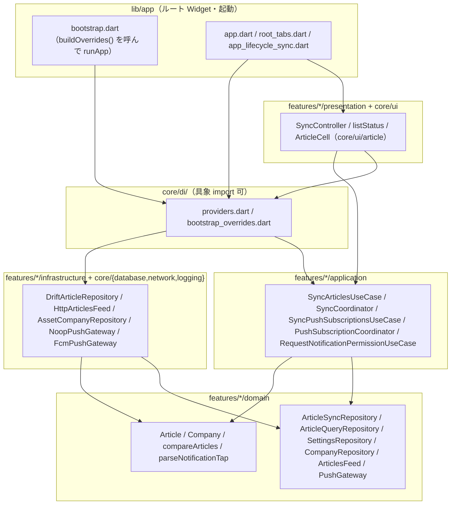
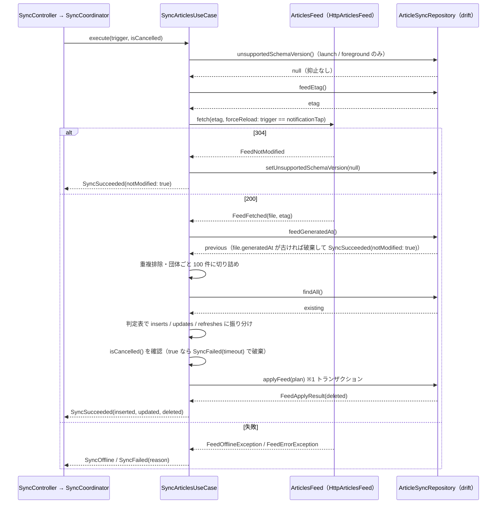

<!--
所有権（画面定義書との乖離を防ぐ）：
  画面定義書 docs/screens/S-xx.md が決める：何が見え、何ができ、どう遷移するか（要素 E-nn・状態 ST-nn・操作 A-nn・表示ルール）
  本書が決める：どう実現するか（UseCase・Provider・Repository・DB・処理手順・状態の判定ロジック）
本書は画面定義書の ID を参照し、内容を転記しない。画面仕様を変えたいときは画面定義書を先に直す（/screen-doc reopen）。
-->

## 1. 目的と範囲

本書は Flutter アプリ（`app/`）の**基盤**を定める。決めるのは次の 11 点：(1) feature-first × クリーンアーキテクチャのディレクトリと依存の方向、(2) drift のスキーマ（要件 §7.2 の 4 テーブル）と migration の方針、(3) 複数の feature が共有する domain（`Article`・`Company`・`compareArticles`・Repository インターフェース）、(4) `articles.json` の取得（[D-01 §4.7](D-01.md#sec-4-7) の URL・ETag・`schemaVersion` 検証・失敗の分類）、(5) 取得結果を端末 DB に反映する `SyncArticlesUseCase`（[D-01 §5.2](D-01.md#sec-5-2) の app 判定表と 100 件上限）、(6) 取得タイミング 3 種（起動時・Pull to Refresh・フォアグラウンド復帰。要件 §6.1）の起動点と同時実行の抑止、(7) Riverpod / DI の組み立て方と presentation から見える Provider の粒度、(8) FCM トピック購読の同期と通知許可の要求、通知タップで `companyId` を受け取る経路、および Firebase 未設定（要件 §10.1 のフェーズ 4 まで）でも動く構造、(9) S-00 の共通部品（下部タブバー・記事セル・状態表示）の Widget と、S-00 §5.2 の状態判定を 1 か所で計算する関数、(10) 同梱アセット `companies.json` の読み込み、(11) ログとテストの方法。決めないのは、個別画面（S-01〜S-03）の UseCase・Provider・Widget（既読・保存・未読フィルタ・ブラウザ選択・一括クリア・通知タップ後のタブ選択。[D-05](D-05.md)）と、collector 側の一切（[D-02](D-02.md)・[D-03](D-03.md)）である。本書の frontmatter `features` のうち F-07（通知の受信経路）・F-08（購読の同期）・F-09（ダークモード追従）は基盤側で実現が完結する。F-05（既読）・F-06（保存）・F-10（手動更新）・F-11（更新の再浮上）は、**検知・保持の規則（テーブル・列の更新規則・判定表・取得の受け口）を本書が**、**表示・操作の UseCase・Provider・Widget を D-05 が**持つ。F-01・F-03・F-04 は D-05 が所有する。F-02（記事項目の表示）は、記事セルの部品（`ArticleCell`・`CategoryIcon`・`formatPublishedDate`。§5.9）を本書が、配置と入力の組み立てを D-05 が持つ。frontmatter `screens` に S-01〜S-03 を含めるのは、本書がそれらの ID を参照して基盤の受け口を定めるためで、S-01〜S-03 の操作・状態の実現は D-05 が所有する（§2.1）。

## 2. 要件との対応

| 要件 | 本書での扱い | 節 |
|---|---|---|
| F-07 プッシュ通知（受信側） | `PushGateway` ポートで通知許可の要求・トピック購読・通知タップの受け取りを抽象化し、FCM 実装（フェーズ 5）と Noop 実装（それ以前）を DI で切り替える。通知タップでは D-01 §4.8 の `data.companyId` だけを読む | §4.6 / §5.6 / §5.7 |
| F-08 通知の団体別 ON/OFF | `settings` テーブルの `notification.<companyId>`（既定 ON）と `companies.json` の `fcmTopic` を突合し、`SyncPushSubscriptionsUseCase` が購読・解除を冪等に同期する。起動時・復帰時（前回失敗あり）と D-05 のトグル操作後に、application の `PushSubscriptionCoordinator` を通して直列に実行する（§8 #41） | §4.4 / §5.6 |
| F-09 ダークモード | `CupertinoApp` にテーマの明暗を固定せず、部品はすべて `CupertinoColors` の動的システム色で描く。アプリ内に切替を持たない | §5.9 / §8 #17 |
| F-02 記事項目の表示（部品） | S-00 の記事セル `ArticleCell`・`CategoryIcon`・`formatPublishedDate` を `core/ui/article/` に置く。配置と入力（`ArticleCellModel`）の組み立ては D-05 | §5.9 / §8 #34 |
| F-11 更新記事の再浮上（検知側） | `SyncArticlesUseCase` が D-01 §5.2 の app 判定表で「更新」を検知し（配信の `updatedAt` が端末より新しいときだけ。§8 #30）、`articles.has_update_badge = true` と `read_states` の削除を同じトランザクションで行う。先頭への再表示は `updatedAt` を全列上書きすることで並び順（`sortKey`）が変わる結果として実現する。バッジの表示は D-05 | §4.2 / §5.2 / §5.5 |
| F-05 既読管理（基盤） | `read_states` テーブルと、更新検知時に既読を解除する規則、`resolveReadDisplayState`。開く・一括クリア・未読フィルタの UseCase は D-05 | §4.2 / §5.5 |
| F-06 保存（基盤） | `saved_articles` テーブルと、配信から外れた保存済み記事を `in_feed = false` で残す保護（`applyFeed` の SQL）。保存・解除・一覧の UseCase は D-05 | §4.2 / §5.2 |
| F-10 手動更新（契機） | `SyncTrigger.pullToRefresh` を `SyncController.sync()` の受け口として用意する。Pull to Refresh の Widget と呼び出しは D-05 | §5.3 |
| R-6 無料 Apple ID ではプッシュ通知が使えない | `PushGateway` の Noop 実装を既定にし、Firebase の初期化・`firebase_*` パッケージの導入をフェーズ 5 のタスク（§10 T-G）に分離する。それ以前はビルド・テスト・シミュレータ実行が Firebase 無しで通る | §5.6 / §8 #12 / §10 |
| §5 データ保持（団体ごと最新 100 件・保存済みは削除しない） | 配信された記事を団体ごとに `compareArticles` で並べ 100 件に切り詰めてから反映し、配信に無い記事は保存済み以外を削除する。保存済みで配信外の記事は `in_feed = false` で残す | §4.2 / §5.2 |
| §5 オフライン時（取得済みの記事は閲覧可能） | 取得失敗時は DB に触れない。失敗を「オフライン」と「エラー」に分類して `SyncResult` で返し、S-00 §5.2 の判定に渡す | §5.2 / §5.4 / §6 |
| §5 起動速度（ローカル DB から即座に表示、取得は裏で） | 起動時は DB を開いてから `runApp` し、取得は `SyncController` が非同期で始める。取得中も DB の記事は表示できる | §5.1 / §5.3 |
| §6.1 取得タイミング（起動時・Pull to Refresh・フォアグラウンド復帰） | `SyncTrigger` 5 値（launch / foreground / pullToRefresh / retry / notificationTap）を `SyncController.sync()` に渡す。launch と foreground は本書の `AppLifecycleSync` が起動し、残り 3 つは D-05 が起動する。同時実行は application の `SyncCoordinator` が 1 つに抑止（S-01 §8 #12。§8 #33） | §5.3 |
| §7.1 記事（Article） | D-01 §4.1 と同じ 10 フィールドを Dart の不変クラスで持つ。日時は `DateTime`（UTC）に変換して保持 | §4.1 |
| §7.2 端末内の状態（4 テーブル） | `articles`・`read_states`・`saved_articles`（保存日時）・`settings` を drift で定義。`schemaVersion = 1` | §4.2 |
| D-01 §8.1（D-04 宛 5 項目） | `id`・`contentHash` は 16 文字テキスト主キー（§4.2）／`companies.json` を `pubspec.yaml` の `assets` に登録し起動時に読む Provider（§4.5・§5.1）／配信ベース URL 定数と ETag・`schemaVersion !== 1` の取得失敗（§4.7・§5.2）／通知は `data.companyId` のみ読む（§4.6）／§7.3 のケースをテストに含める（§7） | §4 / §5 / §7 |
| D-02 §8.1（D-04 宛） | app の CI は `.github/workflows/app-ci.yml` に置く | §4.8 |
| S-01 §8 #19 未読フィルタの永続化 | `settings` のキー `unread_filter`（既定 `0`） | §4.4 |
| S-01 §8 #23 フォアグラウンド復帰時の取得 | `AppLifecycleSync` が `paused（または hidden）→ resumed` の遷移で `sync(foreground)` を呼ぶ（判定は純粋関数 `shouldSyncOnResume`）。`inactive → resumed`（通知許可ダイアログ・アプリ内ブラウザから戻った）では呼ばない | §5.3 |
| S-01 §8 #24 / S-03 §8 #11 通知許可のタイミング・既定 ON | 起動直後に `RequestNotificationPermissionUseCase` を実行し、未確認（`notDetermined`）のときだけ iOS のダイアログを出す。トグルの既定は ON（キー無し = ON） | §5.7 / §4.4 |
| S-02 §8 #6 保存日時 | `saved_articles.saved_at` | §4.2 |

### 2.1 画面定義との対応（scope: app のみ）

S-00 のすべての操作 A-nn と状態 ST-nn を載せる。本書は共通部品の Widget・状態の判定関数・DB 列を提供し、個別画面での配置と操作の UseCase は D-05 が持つ。S-01〜S-03 の A-nn / ST-nn は D-05 が所有する（D-05 §2.1 が全件を載せる）。本書はそのうち基盤の受け口を提供するものだけを 2 つ目の表に載せる。

| 画面定義書の ID | 種類 | 本書での実現 | 節 |
|---|---|---|---|
| S-00/A-01 | 操作 | `RootTabs`（`CupertinoTabScaffold`）のタブ切替。各タブは `CupertinoTabView` で Navigator とスクロール位置を保持する | §5.8 |
| S-00/A-02 | 操作 | `CupertinoTabBar.onTap` で選択中と同じ index なら `tabReselectProvider` に通知する。先頭までスクロールする処理は各画面（D-05）が `ref.listen` で受ける | §5.8 |
| S-00/A-10 | 操作 | `ArticleCell.onTap` コールバック。記事を開き既読にする UseCase は D-05（`read_states` への書き込みと `has_update_badge` の消去の規則は §5.5） | §5.5 / §8.1 |
| S-00/A-11 | 操作 | `ArticleCell.onToggleSaved` コールバック。保存・解除の UseCase は D-05（`saved_articles` の規則は §4.2） | §4.2 / §8.1 |
| S-00/A-12 | 操作 | `FullErrorView.onRetry` コールバック → D-05 が `SyncController.sync(SyncTrigger.retry)` を呼ぶ | §5.3 / §5.9 |
| S-00/ST-01 | 状態 | `ReadDisplayState.unread`：`read_states` に行が無く `articles.has_update_badge = false` | §5.5 |
| S-00/ST-02 | 状態 | `ReadDisplayState.read`：`read_states` に行がある | §5.5 |
| S-00/ST-03 | 状態 | `ReadDisplayState.updated`：`read_states` に行が無く `has_update_badge = true`。`SyncArticlesUseCase` が「更新」と判定した記事だけが `true` になる | §5.2 / §5.5 |
| S-00/ST-04 | 状態 | `ArticleCellModel.isSaved`（`saved_articles` に行がある） | §4.2 / §5.9 |
| S-00/ST-05 | 状態 | `Article.thumbnail == null` → `ArticleCell` がプレースホルダーを描く | §5.9 |
| S-00/ST-06 | 状態 | `Image.network` の `loadingBuilder` / `errorBuilder` でプレースホルダーを描く。再試行は出さない | §5.9 |
| S-00/ST-10 | 状態 | `ListStatus.full == FullView.loading`（判定は §5.4。起動直後で記事数が未確定、または `launch` の取得が未開始・実行中のときもここ。§8 #36） | §5.4 |
| S-00/ST-11 | 状態 | `ListStatus.refreshing == true`（取得済みの記事あり × `SyncStatus.inProgress`） | §5.4 |
| S-00/ST-12 | 状態 | `ListStatus.full == FullView.empty`（表示対象 0 件。文言は配置画面 = D-05） | §5.4 |
| S-00/ST-13 | 状態 | `ListStatus.offlineBanner == true`（取得済みの記事あり × 直近結果 `SyncOffline`） | §5.4 |
| S-00/ST-14 | 状態 | `ListStatus.full == FullView.error`（取得済みの記事なし × 直近結果 `SyncFailed`） | §5.4 |
| S-00/ST-15 | 状態 | `ListStatus.errorNotice == true`（取得済みの記事あり × 直近結果 `SyncFailed`）。3 秒表示と「配置画面表示中のみ」の制御は D-05 が `SyncStatus.sequence` の変化を `ref.listen` して行う | §5.4 / §8.1 |
| S-00/ST-16 | 状態 | `ListStatus.full == FullView.offline`（取得済みの記事なし × 直近結果 `SyncOffline`） | §5.4 |
| S-00/ST-20 | 状態 | `CupertinoTabBar` の `currentIndex`。起動直後は 0（ホーム） | §5.8 |
| S-00/ST-30 | 状態 | `CupertinoApp.theme` に `brightness` を指定せず、`MediaQuery.platformBrightness` に追従。色は `CupertinoColors` の動的色のみ | §5.9 / §8 #17 |
| S-00/E-01〜E-04 | 要素 | `RootTabs`（`lib/app/root_tabs.dart`） | §5.8 |
| S-00/E-10〜E-17 | 要素 | `lib/core/ui/article/` の `ArticleCell`（入力は `ArticleCellModel`。団体名・既読状態・保存状態は D-05 が組み立てる。§8 #34） | §5.9 |
| S-00/E-20〜E-25 | 要素 | `lib/core/ui/status/` の 6 Widget（`FullLoadingView`・`RefreshingHeader`・`EmptyView`・`OfflineBanner`・`FullErrorView`・`TransientNotice`） | §5.9 |

S-01〜S-03 のうち本書が受け口を提供する ID（実現の主体は D-05）：

| 画面定義書の ID | 本書が提供するもの | 節 |
|---|---|---|
| S-01/A-04（Pull to Refresh） | `SyncTrigger.pullToRefresh` と `SyncController.sync()` の戻り値（await でインジケータを閉じる） | §5.3 |
| S-01/A-07・ST-15（通知タップ） | `initialNotificationTapProvider`・`notificationTapStreamProvider`・`tabControllerProvider`・`SyncTrigger.notificationTap`（`forceReload` で取得。§8 #31） | §5.7 / §5.8 / §5.3 |
| S-01/A-08（再試行） | `SyncTrigger.retry`（S-00/A-12 経由） | §5.3 |
| S-01/ST-01・ST-02（起動時の取得） | `SyncTrigger.launch` を `AppLifecycleSync` が起動 | §5.3 |
| S-01/ST-18（通知許可ダイアログ） | `RequestNotificationPermissionUseCase`。取得と並行して出る | §5.7 |
| S-01 §7.1・§7.4・§7.5（並び順・新着/更新・100 件） | `compareArticles`・`has_update_badge`・`in_feed` | §4.1 / §4.2 / §5.5 |
| S-02/ST-01・ST-02（保存一覧の content / empty） | `resolveListStatus(syncsOnLaunch: false)`（判定表の先頭 2 行。取得の状態を見ず `hasVisible` だけで決める） | §5.4 |
| S-02 §7.1・§7.3（保存日時・配信外の保存記事） | `saved_articles.saved_at`・`in_feed = false` の保護 | §4.2 |
| S-03/A-01・ST-02（通知トグル。既定 ON。S-03 §8 #11） | `SettingsRepository.setNotificationEnabled`・`PushSubscriptionCoordinator.run()`（`SyncPushSubscriptionsUseCase` を直列化した入口。§8 #41） | §4.4 / §5.6 |
| S-03/ST-03（通知が許可されていない） | `pushPermissionStatusProvider`（復帰時に invalidate） | §5.7 |
| S-03/A-06（既読の一括クリア） | `read_states`・`has_update_badge` の更新規則 | §5.5 |
| S-03/A-07（設定アプリから戻る） | `AppLifecycleSync` が復帰時に `pushPermissionStatusProvider` を invalidate | §5.3 |

## 3. 構成

### 3.1 層と依存の方向

依存は presentation / app → application → domain、infrastructure → domain の一方向のみ。具象クラスを import してよいのは `lib/core/di/` の 2 ファイル（`providers.dart` = Provider の組み立て、`bootstrap_overrides.dart` = DB を開き、アセットを読み、`ProviderScope` の `overrides` を組み立てる）だけ。`lib/app/bootstrap.dart` は `buildOverrides()` を呼んで `runApp` するだけで、具象を import しない（§8 #43）。presentation は `core/di` の Provider を通じて UseCase・Repository の**インターフェース型**を受け取り、infrastructure を import しない（CLAUDE.md）。



feature 間の依存は次の方向だけを許す。`articles` は他の feature を import しない（`Article` の所有者）。feature の presentation が**他の feature の presentation** を import することは禁止する。S-00 の共通部品（記事セル・状態表示）はどの feature にも属さず `core/ui/` に置く（§8 #34）。

| 依存元 | 依存先 | 理由 |
|---|---|---|
| `core/ui/article`（`ArticleCell`・`CategoryIcon`・`formatPublishedDate`） | `articles/domain`（`Article`・`Category`・`ReadDisplayState`）のみ | 記事セルは 3 画面が使う共通部品（S-00 §8 #1）。application・infrastructure・Provider には依存しない |
| `saved` / `settings` / `notifications` の presentation（D-05） | `articles/domain`・`core/ui/article`・`core/ui/status` | 保存一覧も同じ記事セルを使う |
| `notifications/application` | `settings/domain`（通知設定）・`companies/domain`（`fcmTopic`） | 購読同期の入力 |
| `articles/infrastructure`（`DriftArticleRepository`） | `core/database` | 保存済み記事の保護は SQL の副問合せで行う（§5.2 手順 7）ため、`articles` は `saved/domain` を import しない |

### 3.2 ファイル配置

```
app/
  pubspec.yaml                  §4.8。assets に assets/companies.json を登録（D-01 §8 #28）
  analysis_options.yaml         very_good_analysis を include
  build.yaml                    drift: store_date_time_values_as_text: true（§4.2）
  assets/
    companies.json              data/companies.json の同一コピー（D-01 §10 Task A で作成済み）
  lib/
    main.dart                   bootstrap() を await して runApp
    app/
      bootstrap.dart            core/di/bootstrap_overrides.dart の buildOverrides() を await して runApp（具象を import しない。§5.1）
      app.dart                  CupertinoApp（ST-30。§5.9）
      root_tabs.dart            S-00/E-01〜E-04。A-01・A-02・ST-20（§5.8）
      tab_reselect.dart         tabReselectProvider（A-02 の通知）
      app_lifecycle_sync.dart   起動時・フォアグラウンド復帰の取得、通知許可、購読同期の起動点（§5.3・§5.7）
      resume_sync_policy.dart   shouldSyncOnResume（ライフサイクル遷移の純粋関数。§5.3）
    core/
      di/
        providers.dart          具象の組み立て（§4.7）
        bootstrap_overrides.dart  buildOverrides()：DB open・companies 読み込み・（fcm 時）Firebase 初期化・overrides の組み立て（§5.1。§8 #43）
      database/
        tables.dart             4 テーブル定義（§4.2）
        app_database.dart       AppDatabase（schemaVersion 1・migration・PRAGMA foreign_keys）
      network/
        feed_config.dart        配信ベース URL・タイムアウト・User-Agent 定数（§4.3）
        user_agent_client.dart  http.BaseClient の派生（UA 付与）
      logging/
        app_logger.dart         logger パッケージの生成（§4.9）
      ui/
        status/
          full_loading_view.dart    E-20
          refreshing_header.dart    E-21
          empty_view.dart           E-22
          offline_banner.dart       E-23
          full_error_view.dart      E-24（error / offline の 2 変種）
          transient_notice.dart     E-25
        article/                    S-00 の記事セル（articles/domain のみに依存。§8 #34）
          article_cell.dart         E-10〜E-17（§5.9）
          article_cell_model.dart   ArticleCellModel
          category_icon.dart        E-12（S-00 §7.2 の対応）
          published_date_format.dart  S-00 §7.3 の書式（純粋関数）
    features/
      articles/
        domain/
          article.dart              Article（§4.1）
          category.dart             Category enum と fromValue（未知 → other）
          articles_file.dart        ArticlesFile（schemaVersion・generatedAt・articles）・定数・isImplausibleGeneratedAt（純粋関数。§4.1）
          article_order.dart        compareArticles（D-01 §4.5 の移植）
          article_sync_repository.dart   ArticleSyncRepository・FeedApplyPlan・FeedApplyResult（同期用。§4.4。§8 #42）
          article_query_repository.dart  ArticleQueryRepository（閲覧用 Stream。D-05 が watchInFeed 等を追加）
          articles_feed.dart        ArticlesFeed ポート・FeedFetchResult・FeedFailureReason・FeedOfflineException・FeedErrorException（§4.3）
          read_display_state.dart   ReadDisplayState と resolveReadDisplayState（§5.5）
        application/
          sync_articles_use_case.dart   §5.2
          sync_coordinator.dart         SyncCoordinator・SyncEvent（同時実行の抑止・全体タイムアウト・世代番号・完了通知。§5.3）
          sync_result.dart              SyncTrigger・SyncResult・SyncFailureReason（§4.4）
        infrastructure/
          articles_file_codec.dart      JSON → ArticlesFile（D-01 §4.1・§4.2 の検証）
          http_articles_feed.dart       ArticlesFeed 実装（ETag・304・失敗の分類）
          drift_article_repository.dart ArticleSyncRepository と ArticleQueryRepository の両方を implements する 1 つの具象（applyFeed は 1 トランザクション）
        presentation/
          sync_controller.dart          SyncController（Notifier）・SyncStatus（§5.3）
          list_status.dart              ListStatus・FullView・resolveListStatus（§5.4）
      companies/
        domain/
          company.dart              Company（§4.5）
          company_repository.dart   CompanyRepository
        infrastructure/
          asset_company_repository.dart  rootBundle から assets/companies.json を読む
      saved/
        domain/
          saved_article_repository.dart  SavedArticleRepository（§4.4。D-05 が閲覧用メソッドを追加）
        infrastructure/
          drift_saved_article_repository.dart
      settings/
        domain/
          settings_repository.dart   SettingsRepository・SettingKeys（§4.4）
          browser_choice.dart        BrowserChoice enum
        infrastructure/
          drift_settings_repository.dart
      notifications/
        domain/
          push_gateway.dart          PushGateway・PushPermissionStatus（§4.6）
          notification_tap.dart      NotificationTap と parseNotificationTap（純粋関数。§4.6）
        application/
          sync_push_subscriptions_use_case.dart        §5.6
          push_subscription_coordinator.dart           PushSubscriptionCoordinator（購読同期の直列化と直近結果の保持。§5.6。§8 #41）
          push_subscription_sync_result.dart           PushSubscriptionSyncResult（§4.4）
          request_notification_permission_use_case.dart §5.7
        infrastructure/
          noop_push_gateway.dart     既定（Firebase 無し）
          fcm_push_gateway.dart      フェーズ 5 で追加（§10 T-G）
        presentation/
          notification_tap_providers.dart  initialNotificationTapProvider・notificationTapStreamProvider・pushPermissionStatusProvider
  test/
    helpers/
      in_memory_database.dart     NativeDatabase.memory() で AppDatabase を作る
      mock_feed_client.dart       package:http の MockClient を組み立てる
      fake_push_gateway.dart      PushGateway のフェイク（呼び出し記録・許可状態の設定）
      test_articles.dart          Article のビルダ（フィクスチャの改変用）
    fixtures/
      articles.sample.json        collector/test/fixtures/contract/articles.sample.json のコピー（D-01 §4.2）
    app/
      resume_sync_policy_test.dart                         shouldSyncOnResume の直接テスト（§7 純粋関数の例外）
    core/ui/article/
      published_date_format_test.dart                      formatPublishedDate の直接テスト（同上）
    features/
      articles/application/sync_articles_use_case_test.dart
      articles/application/sync_coordinator_test.dart      同時実行の抑止・全体タイムアウト・世代番号による破棄・notificationTap の後追い・完了通知（§7）
      articles/domain/article_order_test.dart              compareArticles の直接テスト（同上）
      articles/domain/read_display_state_test.dart         resolveReadDisplayState の直接テスト（同上）
      articles/presentation/list_status_test.dart          resolveListStatus の直接テスト（同上）
      notifications/domain/notification_tap_test.dart      parseNotificationTap の直接テスト（同上）
      notifications/application/sync_push_subscriptions_use_case_test.dart
      notifications/application/push_subscription_coordinator_test.dart   直列化と再実行 1 回（§7）
      notifications/application/request_notification_permission_use_case_test.dart
.github/workflows/app-ci.yml      §4.8
```

`read_states` の Repository（`ReadStateRepository`）は本書の UseCase が使わないため、インターフェース・実装とも D-05 が `features/articles/domain` / `infrastructure` に追加する（§4.2 でテーブルと更新規則だけを定める。§8.1）。

## 4. データ

### 4.1 Article と ArticlesFile（`features/articles/domain/`）

D-01 §4.1 と同じ名前のフィールドを持つ。日時は `DateTime.parse` でオフセット付きとして解釈し（結果は `isUtc == true`）、表示時に `toLocal()` する（S-00 §7.3）。`category` は配信の文字列をそのまま保持し、表示時に `Category.fromValue` で 7 値に写す（未知の値は `other`。S-00 §7.2）。`id`・`contentHash`・`companyId` は不透明な文字列として扱い、再計算・検証しない（D-01 §3.1）。本文に相当するフィールドは持たない（要件 §7）。

```dart
// lib/features/articles/domain/article.dart
/// 記事（D-01 §4.1）。不変。== と hashCode は全フィールドで手書きする（freezed は使わない。§8 #24）
final class Article {
  const Article({
    required this.id,
    required this.companyId,
    required this.title,
    required this.url,
    required this.category,
    required this.publishedAt,
    required this.fetchedAt,
    required this.contentHash,
    this.thumbnail,
    this.updatedAt,
  });

  final String id;          // 16 文字の 16 進小文字（D-01 §8 #25）
  final String companyId;   // companies.json の id。未知の値も保持する（S-00 §7.1）
  final String title;
  final String url;         // 正規化済み（D-01 §5.1）。そのまま開く
  final String category;    // 配信の文字列。表示は Category.fromValue（未知 → other）
  final DateTime publishedAt; // UTC
  final DateTime fetchedAt;   // UTC
  final String contentHash;
  final String? thumbnail;  // URL 参照のみ。端末にコピーしない
  final DateTime? updatedAt;  // UTC。無し = null（キー省略と null を同一視。D-01 §8 #2）

  /// 並び順の日時（S-01 §7.1 第 1 キー）
  DateTime get sortKey => updatedAt ?? publishedAt;

  Article copyWith({...});   // 全フィールド任意。updatedAt / thumbnail を null にする指定は sentinel を使わず、呼び出し側が新しいインスタンスを作る
  @override bool operator ==(Object other) => ...;   // 10 フィールドの比較
  @override int get hashCode => Object.hash(...);
}
```

```dart
// lib/features/articles/domain/category.dart
enum Category {
  newWork('new_work'), ticket('ticket'), streaming('streaming'), schedule('schedule'),
  cast('cast'), person('person'), other('other');

  const Category(this.value);
  final String value;

  /// D-01 §4.4 の 7 値。対応表に無い値は other（S-00 §7.2）
  static Category fromValue(String value) =>
      Category.values.firstWhere((c) => c.value == value, orElse: () => Category.other);
}
```

```dart
// lib/features/articles/domain/articles_file.dart
const int articlesSchemaVersion = 1;          // D-01 §4.2
/// 現在の app が反映できる schemaVersion の集合。app 更新で版を増やすときはここに足す（§5.2 手順 0 の抑止判定に使う。§8 #32）
const Set<int> supportedArticlesSchemaVersions = {articlesSchemaVersion};
const int maxArticlesPerCompany = 100;        // 要件 §5
/// 端末時計にこの値を足した時刻より後（isAfter）の generatedAt は「信用できない値」とみなし、後退防止の基準（feed_generated_at）に使わない（§5.2 手順 3-b。§8 #38）。
/// ちょうど +24 時間は isAfter が false なので基準に保存される（境界。§7）。
/// collector の 1 時間おきの実行（要件 §6.1）と端末時計の通常のずれ（数分）に対して十分大きく、時計事故（年単位の先走り）を弾ける
const Duration feedGeneratedAtFutureTolerance = Duration(hours: 24);

/// [generatedAt] が端末時計 [now] + feedGeneratedAtFutureTolerance より後なら true（信用できない値）。
/// 純粋関数（dart:core のみ）。SyncArticlesUseCase の手順 3-b（previous の判定）と手順 7（plan.generatedAt の判定）が呼ぶ。
/// 直接テストは置かず、UseCase テストで境界（+23 時間・ちょうど +24 時間・+25 時間）を検証する（§7。§8 #28 の例外リストには加えない）
bool isImplausibleGeneratedAt(DateTime generatedAt, DateTime now) =>
    generatedAt.isAfter(now.toUtc().add(feedGeneratedAtFutureTolerance));

final class ArticlesFile {
  const ArticlesFile({required this.generatedAt, required this.articles});
  final DateTime generatedAt;                 // UTC
  final List<Article> articles;              // 配信順のまま。切り詰め・重複排除は SyncArticlesUseCase（§5.2）
}
```

```dart
// lib/features/articles/domain/article_order.dart
/// D-01 §4.5 の移植。第 1 キー sortKey 降順 → 第 2 キー fetchedAt 降順 → 第 3 キー id 昇順
int compareArticles(Article a, Article b) {
  final byKey = b.sortKey.compareTo(a.sortKey);
  if (byKey != 0) return byKey;
  final byFetched = b.fetchedAt.compareTo(a.fetchedAt);
  if (byFetched != 0) return byFetched;
  return a.id.compareTo(b.id);
}
```

D-01 の並び替えは文字列比較だが、同一書式（秒精度・単一オフセット）を瞬間に変換した `DateTime` の比較は同じ順序になる。オフセットが異なる ISO8601 が将来混ざっても瞬間で比較されるため、こちらのほうが堅牢である（§8 #3）。

### 4.2 drift スキーマ（`lib/core/database/`）

要件 §7.2 の 4 テーブル。`schemaVersion = 1`。日時はすべて ISO8601 テキスト（UTC）で保存する（`build.yaml` の `store_date_time_values_as_text: true`。§8 #4）。外部キーは `beforeOpen` で `PRAGMA foreign_keys = ON` を発行して有効にする。

```dart
// lib/core/database/tables.dart
import 'package:drift/drift.dart';

class Articles extends Table {
  TextColumn get id => text().withLength(min: 16, max: 16)();          // D-01 §8 #25。主キー
  TextColumn get companyId => text()();
  TextColumn get title => text()();
  TextColumn get url => text()();
  TextColumn get category => text()();                                  // 配信の文字列のまま
  DateTimeColumn get publishedAt => dateTime()();
  DateTimeColumn get fetchedAt => dateTime()();
  TextColumn get thumbnail => text().nullable()();
  TextColumn get contentHash => text().withLength(min: 16, max: 16)();
  DateTimeColumn get updatedAt => dateTime().nullable()();
  /// 直近の配信（articles.json）に含まれている = ホームの 100 件の範囲内（S-01 §7.5・§8 #10）。
  /// false は「配信から外れたが保存済みなので残している」記事（S-02 §7.3）
  BoolColumn get inFeed => boolean().withDefault(const Constant(true))();
  /// 「更新」バッジ（S-00/ST-03）。SyncArticlesUseCase が「更新」と判定したとき true、
  /// 記事を開いた（S-00/A-10）・既読の一括クリア（S-03/A-06）で false（§5.5）
  BoolColumn get hasUpdateBadge => boolean().withDefault(const Constant(false))();

  @override
  Set<Column<Object>> get primaryKey => {id};
}

class ReadStates extends Table {
  TextColumn get articleId => text().references(Articles, #id, onDelete: KeyAction.cascade)();
  DateTimeColumn get readAt => dateTime()();
  @override
  Set<Column<Object>> get primaryKey => {articleId};
}

class SavedArticles extends Table {
  TextColumn get articleId => text().references(Articles, #id, onDelete: KeyAction.cascade)();
  DateTimeColumn get savedAt => dateTime()();                            // S-02 §7.1 の並び順キー
  @override
  Set<Column<Object>> get primaryKey => {articleId};
}

class Settings extends Table {
  TextColumn get key => text()();
  TextColumn get value => text()();
  @override
  Set<Column<Object>> get primaryKey => {key};
}
```

```dart
// lib/core/database/app_database.dart
@DriftDatabase(tables: [Articles, ReadStates, SavedArticles, Settings])
class AppDatabase extends _$AppDatabase {
  AppDatabase(super.executor);

  @override
  int get schemaVersion => 1;

  @override
  MigrationStrategy get migration => MigrationStrategy(
        onCreate: (m) async {
          await m.createAll();
          await m.createIndex(Index('idx_articles_company', 'CREATE INDEX idx_articles_company ON articles (company_id)'));
          await m.createIndex(Index('idx_articles_in_feed', 'CREATE INDEX idx_articles_in_feed ON articles (in_feed)'));
          await m.createIndex(Index('idx_saved_articles_saved_at', 'CREATE INDEX idx_saved_articles_saved_at ON saved_articles (saved_at)'));
        },
        onUpgrade: (m, from, to) async {
          // schemaVersion 2 以降で `if (from < 2) { ... }` の形で手書きし、段階的に積む（§8 #25）
        },
        beforeOpen: (details) async {
          await customStatement('PRAGMA foreign_keys = ON');
        },
      );
}
```

| 規則 | 内容 |
|---|---|
| ファイル | 本番は `drift_flutter` の `driftDatabase(name: 'curtaincall')`（アプリのドキュメントディレクトリ）。テストは `NativeDatabase.memory()`（§7） |
| `articles` の行の寿命 | 配信に含まれる間は `in_feed = true`。配信から外れたら、保存済みなら `in_feed = false` で残し、未保存なら削除する（§5.2 手順 7）。保存を解除した記事が `in_feed = false` なら、その時点で D-05 が削除する（S-02 §7.3「解除したとき」。§8.1）。`in_feed = false` の行はユーザーが保存を解除するまで残り、**件数の上限は設けない**（F-06「保存記事は自動削除の対象外」。1 件ずつの明示操作でしか増えないため実用上は数千件が上限で、`findAll()`（§5.2 手順 5）の読み込みは数十ミリ秒で収まる） |
| `read_states` | 行がある = 既読（S-00/ST-02）。`SyncArticlesUseCase` が「更新」と判定した記事の行は削除する（S-00 §7.5「未読に戻る」）。一括クリアは全行削除（D-05） |
| `saved_articles` | 行がある = 保存済み（S-00/ST-04）。`saved_at` は保存操作の時刻（端末時計、UTC）。再保存は行を作り直し `saved_at` を更新する（S-02 §7.1） |
| `settings` | キー・値ともテキスト。キーの一覧は §4.4 `SettingKeys`。既定値は行が無いときに読み手が補う（テーブルに既定行を作らない） |
| migration | `schemaVersion` を上げるときは `onUpgrade` に `if (from < N)` ブロックを追加し、既存列の削除・型変更は行わない（列追加・テーブル追加・インデックス追加のみ）。DB を作り直す migration は書かない（既読・保存を消さない。要件 §5・F-06） |
| 100 件 | テーブル自体に件数制約は持たない。上限は `SyncArticlesUseCase` の切り詰め（§5.2 手順 3）と削除規則（手順 7）で保証する |

### 4.3 配信の取得（`features/articles/domain/articles_feed.dart`・`core/network/`）

```dart
// lib/core/network/feed_config.dart
/// D-01 §4.7。末尾スラッシュ付き
const String feedBaseUrl = 'https://sss-kato.github.io/curtaincall/';
const String articlesFeedUrl = '${feedBaseUrl}articles.json';
/// 開発者の任意設定。200 KB の静的ファイルを CDN から取る想定で、モバイル回線でも十分な長さ
const Duration feedTimeout = Duration(seconds: 15);
/// app 側の UA。collector の UA（D-01 §4.7）と同じ書式で製品名を分ける
const String appUserAgent = 'CurtainCall-iOS/1.0 (personal news reader; +https://github.com/sss-kato/curtaincall)';
```

```dart
// lib/features/articles/domain/articles_feed.dart
/// articles.json の取得ポート。実装は infrastructure（HttpArticlesFeed）
abstract interface class ArticlesFeed {
  /// [etag] が非 null かつ [forceReload] が false なら If-None-Match を送る。
  /// [forceReload] が true なら If-None-Match を送らず本文を取り直す（通知タップ直後。§8 #31）。
  /// 304 → FeedNotModified、200 → FeedFetched。それ以外は例外
  Future<FeedFetchResult> fetch({required String? etag, bool forceReload = false});
}

/// 取得・解析の失敗理由（domain。application の SyncFailureReason はこれに storage を足した写像。§8 #35）
enum FeedFailureReason { httpStatus, timeout, malformed, unsupportedSchema }

sealed class FeedFetchResult {
  const FeedFetchResult();
}

final class FeedNotModified extends FeedFetchResult {
  const FeedNotModified();
}

final class FeedFetched extends FeedFetchResult {
  const FeedFetched({required this.file, required this.etag});
  final ArticlesFile file;
  final String? etag;        // 応答の ETag ヘッダ。無ければ null（次回は If-None-Match を送らない）
}

/// ネットワーク不通（S-00/ST-13・ST-16）
final class FeedOfflineException implements Exception {
  const FeedOfflineException(this.cause);
  final Object cause;
}

/// ネットワークはあるが取得・解析に失敗（S-00/ST-14・ST-15）
final class FeedErrorException implements Exception {
  const FeedErrorException(this.reason, {this.cause, this.schemaVersion});
  final FeedFailureReason reason;
  final Object? cause;
  final int? schemaVersion;   // reason == unsupportedSchema のとき、配信の schemaVersion（§5.2 手順 0 の記録用）
}
```

`HttpArticlesFeed`（infrastructure）の規則：

| 項目 | 規則 |
|---|---|
| リクエスト | `GET articlesFeedUrl`。ヘッダ `User-Agent: appUserAgent`、`Accept: application/json`、`etag != null && !forceReload` のとき `If-None-Match: <etag>`。`forceReload` のときは `If-None-Match` を送らず、`Cache-Control: no-cache` も付けない（Pages の CDN に対しては効果が無く、原点への負荷を増やすだけ。D-01 §8 #17）。`feedTimeout` で打ち切る。クエリ（キャッシュバスティング）は付けない（D-01 §8 #17） |
| 304 | `FeedNotModified` |
| 200 | 本文を UTF-8 で decode → `ArticlesFileCodec.decode`（下記）→ `FeedFetched(file, etag: headers['etag'])` |
| その他のステータス | `FeedErrorException(FeedFailureReason.httpStatus)` |
| `SocketException` | `FeedOfflineException`（DNS 解決失敗・接続拒否・機内モード。§8 #7）。`package:http` の `IOClient` は `SocketException` を、**`SocketException` を継承し `ClientException` を実装する例外型**（`_ClientSocketException extends SocketException implements ClientException`）に包み直すため、`on SocketException` で先に捕捉できる |
| `SocketException` ではない `http.ClientException`（応答の途中切断・リダイレクト上限超過・不正な応答行） | `FeedErrorException(FeedFailureReason.httpStatus, cause: e)`。ネットワークはあるので**オフラインにしない**（Wi-Fi 接続中に ST-16 を出さない） |
| `TimeoutException` | `FeedErrorException(FeedFailureReason.timeout)` |
| JSON でない・トップレベルが object でない・`articles` が配列でない・記事 1 件でも必須フィールド欠落や型不一致 | `FeedErrorException(FeedFailureReason.malformed)`。**ファイル全体を失敗**とし、部分的に取り込まない（§8 #8） |
| `schemaVersion` が `supportedArticlesSchemaVersions` に無い（現在は `!= 1`） | `FeedErrorException(FeedFailureReason.unsupportedSchema, schemaVersion: <配信の値>)`（D-01 §4.6）。`schemaVersion` が整数でなければ `malformed` |
| 未知のフィールド | 無視（D-01 §8 #23） |
| `thumbnail` / `updatedAt` が `null` | キー無しと同じ「無し」（D-01 §8 #2） |
| `thumbnail` のスキームが `http` / `https` 以外（`data:`・`file:`・相対パス） | `Article.thumbnail = null` にする（プレースホルダー表示 ST-05）。`malformed` にはしない（collector 側の契約違反ではあるが、記事自体は有効なため） |
| 日時 | `DateTime.parse` で任意オフセットの ISO8601 を受け付ける。解釈できなければ `malformed` |

`ArticlesFileCodec.decode(Map<String, Object?> json) → ArticlesFile` は `articles_file_codec.dart` に置き、`dynamic` を使わず `Object?` と型ガード（`is String` / `is Map<String, Object?>`）で検証する。

### 4.4 Repository インターフェースと UseCase の入出力型

各インターフェースは本書の UseCase が必要とするメソッドだけを持つ（CLAUDE.md I）。記事の Repository は**同期用**（`ArticleSyncRepository`。`SyncArticlesUseCase` だけが使う）と**閲覧用**（`ArticleQueryRepository`。presentation が Stream を watch する。D-05 が `watchInFeed()` 等を追加する）に分け、drift の具象 `DriftArticleRepository` 1 つが両方を implements する（Provider は 2 本。§4.7。§8 #42）。D-05 が追加する閲覧・更新用のメソッドは `ArticleQueryRepository`・`ReadStateRepository`・`SavedArticleRepository` に置き、`ArticleSyncRepository` には足さない（§8.1）。

```dart
// lib/features/articles/domain/article_sync_repository.dart
/// SyncArticlesUseCase が組み立てる反映計画（§5.2）。applyFeed が 1 トランザクションで適用する
final class FeedApplyPlan {
  const FeedApplyPlan({
    required this.inserts,
    required this.updates,
    required this.refreshes,
    required this.etag,
    required this.generatedAt,
  });
  final List<Article> inserts;    // 新着：全列を配信値で insert。in_feed = true、has_update_badge = false
  final List<Article> updates;    // 更新：全列を配信値で update。in_feed = true、has_update_badge = true、read_states の行を削除
  final List<Article> refreshes;  // 変化なし：title・url・thumbnail・publishedAt・category・contentHash を配信値で update。
                                  //   fetchedAt・updatedAt・has_update_badge・read_states は端末の値を保持。in_feed = true
                                  // 3 つの配列に含まれない端末の記事 = 配信から外れた記事（保存済みなら in_feed = false で残し、未保存なら削除）
  final String? etag;             // 応答の ETag。settings の feed_etag に同じトランザクションで保存（null なら行を削除）
  final DateTime? generatedAt;    // 配信の generatedAt（D-01 §4.2）。settings の feed_generated_at に同じトランザクションで保存（§5.2 手順 3-b の後退防止。§8 #38）。
                                  //   null = 行を変えない（前回の値を保持）。端末時計より feedGeneratedAtFutureTolerance 以上未来の値を基準に採らないための指定（§5.2 手順 3-b (a)）
}

final class FeedApplyResult {
  const FeedApplyResult({required this.deleted});
  final int deleted;              // 削除した記事数（保存済みは含まれない）
}

/// 同期用（SyncArticlesUseCase だけが使う。§8 #42）
abstract interface class ArticleSyncRepository {
  /// 端末にある全記事（in_feed の真偽を問わない）
  Future<List<Article>> findAll();
  /// settings.feed_etag。行が無い、または articles が 0 件なら null（§6、§8 #15）
  Future<String?> feedEtag();
  /// settings.feed_generated_at（前回 applyFeed した配信の generatedAt）。行が無い、または articles が 0 件なら null（feedEtag と同じ保険。§8 #38）
  Future<DateTime?> feedGeneratedAt();
  /// settings.feed_unsupported_schema。行が無ければ null（§5.2 手順 0、§8 #32）
  Future<int?> unsupportedSchemaVersion();
  /// settings.feed_unsupported_schema を upsert（null なら行を削除）
  Future<void> setUnsupportedSchemaVersion(int? version);
  /// 反映（§5.2 手順 7）。失敗時は例外を投げ、トランザクションを丸ごと戻す。
  /// 成功時は同じトランザクションで feed_unsupported_schema の行も削除する
  Future<FeedApplyResult> applyFeed(FeedApplyPlan plan);
}
```

```dart
// lib/features/articles/domain/article_query_repository.dart
/// 閲覧用（presentation が素の Stream を watch する。§4.7。D-05 が watchInFeed() 等を追加する）
abstract interface class ArticleQueryRepository {
  /// 端末にある記事の総数（S-00 §5.2「取得済みの記事」。in_feed の真偽を問わない）
  Stream<int> watchCount();
}
```

`FeedApplyResult` は `==` / `hashCode` を `deleted` で定義する（§8 #24）。

```dart
// lib/features/saved/domain/saved_article_repository.dart
abstract interface class SavedArticleRepository {
  /// 保存（行が無ければ insert、あれば saved_at を更新。S-02 §7.1「解除して再保存」）
  Future<void> save(String articleId, {required DateTime savedAt});
  /// 解除（行が無ければ何もしない）
  Future<void> remove(String articleId);
  // 閲覧用（watchAll 等）は D-05 が追加する
}
```

```dart
// lib/features/settings/domain/settings_repository.dart
/// settings テーブルのキー。値はすべてテキスト
abstract final class SettingKeys {
  static const String feedEtag = 'feed_etag';                     // §4.3。ArticleSyncRepository の実装のみが読み書きする。SettingsRepository には get / set を追加しない（§8.1）
  static const String feedGeneratedAt = 'feed_generated_at';      // §5.2 手順 3-b。前回 applyFeed した配信の generatedAt（ISO8601 UTC）。同上（ArticleSyncRepository の実装のみ。§8 #38）
  static const String feedUnsupportedSchema = 'feed_unsupported_schema'; // §5.2 手順 0。同上（ArticleSyncRepository の実装のみ）
  static String notification(String companyId) => 'notification.$companyId'; // '1' / '0'。行無し = ON（要件 §7.2）
  static const String browser = 'browser';                        // BrowserChoice.value。行無し = inApp（F-04）
  static const String unreadFilter = 'unread_filter';             // '1' / '0'。行無し = OFF（S-01 §8 #19）
}

abstract interface class SettingsRepository {
  /// notification.* の行を companyId → 有効 に写した Map。行が無い団体はキーが無い（呼び出し側が ON と読む）
  Future<Map<String, bool>> notificationSettings();
  Future<void> setNotificationEnabled(String companyId, {required bool enabled});
  // browser / unreadFilter の get・set・watch は D-05 が追加する
}
```

```dart
// lib/features/settings/domain/browser_choice.dart
enum BrowserChoice {
  inApp('in_app'), safari('safari'), chrome('chrome');
  const BrowserChoice(this.value);
  final String value;
}
```

```dart
// lib/features/articles/application/sync_result.dart
/// 取得の契機（要件 §6.1、S-01 ST-03・ST-15、S-00/A-12）
enum SyncTrigger { launch, foreground, pullToRefresh, retry, notificationTap }

/// domain の FeedFailureReason（§4.3）に storage（applyFeed の失敗）を足した写像。
/// FeedErrorException.reason → 同名の値に写す（§5.2 手順 2）
enum SyncFailureReason { httpStatus, timeout, malformed, unsupportedSchema, storage }

sealed class SyncResult {
  const SyncResult();
}

/// 後退防止（§5.2 手順 3-b）で 200 の本文を破棄したことの記録。SyncController が logger.w に出す（UseCase は Logger を持たない。§4.9）
final class StaleFeedDiscarded {
  const StaleFeedDiscarded({required this.previous, required this.received});
  final DateTime previous;   // settings.feed_generated_at（前回反映した版）
  final DateTime received;   // 破棄した配信の generatedAt
  // == / hashCode は 2 フィールドで定義（§8 #24）
}

/// 取得成功。notModified = true は 304（差分なし）、または前回適用分より古い版の 200 を破棄した（§5.2 手順 3-b。§8 #38）。
/// 破棄したときは staleDiscarded が非 null（304 と区別してログに残す）
final class SyncSucceeded extends SyncResult {
  const SyncSucceeded({required this.inserted, required this.updated, required this.deleted, required this.notModified, this.staleDiscarded});
  final int inserted;
  final int updated;
  final int deleted;
  final bool notModified;
  final StaleFeedDiscarded? staleDiscarded;
}

/// ネットワーク不通（S-00/ST-13・ST-16）
final class SyncOffline extends SyncResult {
  const SyncOffline();
}

/// 取得・解析・保存の失敗（S-00/ST-14・ST-15）。端末内のデータは変えていない
final class SyncFailed extends SyncResult {
  const SyncFailed(this.reason, {this.suppressed = false});
  final SyncFailureReason reason;
  /// true = 通信せずに失敗を返した（§5.2 手順 0 の対応外スキーマの抑止）。
  /// 起動・復帰のたびに E-25 を出すかどうかは D-05 がこの値で判断する（§6、§8 #44）
  final bool suppressed;
}
```

`SyncResult` の 3 クラスは `==` / `hashCode` を全フィールドで定義する（§8 #24。`resolveListStatus` のテストと `SyncStatus` の比較で使う）。

```dart
// lib/features/notifications/application/push_subscription_sync_result.dart
/// SyncPushSubscriptionsUseCase の結果（§5.6）。値はトピック名（Company.fcmTopic）。画面には出さない（S-03 §8 #4）
final class PushSubscriptionSyncResult {
  const PushSubscriptionSyncResult({required this.subscribed, required this.unsubscribed, required this.failed});
  final List<String> subscribed;
  final List<String> unsubscribed;
  final List<String> failed;      // subscribe / unsubscribe が例外を投げた団体。1 件以上ならフォアグラウンド復帰時に再実行する（§5.3、§8 #37）
  bool get hasFailure => failed.isNotEmpty;
}
```

### 4.5 Company（`features/companies/`）

同梱アセット `assets/companies.json`（D-01 §4.3 と同一内容）を読む。app が使うのは `id`・`name`・`shortName`・`fcmTopic` の 4 つで、`sources` は読まない（未知のフィールドと同じく無視。D-01 §3.1）。

```dart
// lib/features/companies/domain/company.dart
final class Company {
  const Company({required this.id, required this.name, required this.shortName, required this.fcmTopic});
  final String id;
  final String name;        // 正式名
  final String shortName;   // S-00 §7.1 の表示名
  final String fcmTopic;    // D-01 §4.8 のトピック名
}

// lib/features/companies/domain/company_repository.dart
abstract interface class CompanyRepository {
  /// 配列順のまま返す（表示順。D-01 §4.3）。schemaVersion != 1 は StateError
  Future<List<Company>> loadAll();
}
```

`AssetCompanyRepository.loadAll()` は `rootBundle.loadString('assets/companies.json')` → `jsonDecode` → `schemaVersion == 1` を確認 → `companies[]` を `Company` に写す。`id` の重複は `StateError`。起動時（§5.1）に 1 度だけ呼び、結果を `companiesProvider` の override で全画面に配る。実行時に配信 URL から取得しない（D-01 §8 #28）。

### 4.6 PushGateway と NotificationTap（`features/notifications/domain/`）

```dart
// lib/features/notifications/domain/notification_tap.dart
/// 通知タップで受け取る情報。D-01 §4.8 の data.companyId だけを読む（count・notification 本文は使わない）
final class NotificationTap {
  const NotificationTap({required this.companyId});
  final String? companyId;   // 無い・文字列でない → null（D-05 は「すべて」で開く。S-01 §8 #15）
  // == / hashCode は companyId で定義（§8 #24）
}

/// 通知ペイロードの data 部（RemoteMessage.data 相当）から NotificationTap を作る純粋関数（D-01 §8.1「data.companyId だけを読む」）。
/// - data['companyId'] が String → その値（空文字も含めそのまま。団体定義との突合は D-05）
/// - キーが無い・String でない（int・Map・null）→ companyId = null
/// - data['count']・通知本文（title / body）は読まない。他のキーは無視する
NotificationTap parseNotificationTap(Map<String, Object?> data) {
  final raw = data['companyId'];
  return NotificationTap(companyId: raw is String ? raw : null);
}
```

```dart
// lib/features/notifications/domain/push_gateway.dart
enum PushPermissionStatus { notDetermined, denied, authorized }

abstract interface class PushGateway {
  Future<PushPermissionStatus> permissionStatus();
  /// iOS の許可ダイアログを出す。すでに決定済みなら出さずに現在の状態を返す
  Future<PushPermissionStatus> requestPermission();
  Future<void> subscribe(String topic);
  Future<void> unsubscribe(String topic);
  /// 通知タップでアプリが起動した場合のタップ情報。無ければ null。2 回目以降の呼び出しは null
  Future<NotificationTap?> takeInitialTap();
  /// 起動中（バックグラウンド・フォアグラウンド）に通知をタップしたときに流れる
  Stream<NotificationTap> get taps;
}
```

| 実装 | 振る舞い |
|---|---|
| `NoopPushGateway`（既定。フェーズ 4 まで） | `permissionStatus` / `requestPermission` は常に `authorized` を返す（ダイアログは出ない。S-01/ST-18 と S-03/ST-03 はフェーズ 5 まで現れない。§8 #29）。`subscribe` / `unsubscribe` は debug ログのみ。`takeInitialTap` は null、`taps` は空の Stream |
| `FcmPushGateway`（フェーズ 5。§10 T-G） | `firebase_messaging`：`getNotificationSettings().authorizationStatus`（`provisional` は `authorized` 扱い）／`requestPermission(alert: true, badge: false, sound: true)`／`subscribeToTopic` / `unsubscribeFromTopic`／`getInitialMessage()`／`onMessageOpenedApp`。どちらも `parseNotificationTap(Map<String, Object?>.from(message.data))` で `NotificationTap` に写す（`RemoteMessage.data` は `Map<String, dynamic>` なので、`Object?` に写してから渡す。`dynamic` を infrastructure の外へ出さない。写像の規則は domain の純粋関数に閉じ、`FcmPushGateway` は呼ぶだけ。§7）。フォアグラウンド受信時も通知を表示する（`setForegroundNotificationPresentationOptions(alert: true, badge: false, sound: true)`。S-01/ST-15 はフォアグラウンドでも同じ動作） |

切り替えは `const String pushBackend = String.fromEnvironment('CURTAINCALL_PUSH', defaultValue: 'none')`。`'fcm'` のときだけ `buildOverrides()`（`core/di/bootstrap_overrides.dart`。§5.1・§8 #43）が `Firebase.initializeApp()` を呼び、DI が `FcmPushGateway` を注入する（§8 #12）。

### 4.7 Riverpod / DI（`lib/core/di/providers.dart`）

`riverpod_annotation` + `riverpod_generator`（Riverpod 3.x。`Ref` 型）。基盤の Provider はすべて `keepAlive: true`。`appDatabaseProvider`・`companiesProvider`・`loggerProvider` は `core/di/bootstrap_overrides.dart` の `buildOverrides()` が実体を与え（`bootstrap` はその戻り値を `ProviderScope(overrides: ...)` に渡すだけ。§5.1。§8 #43）、override 無しで読むと `UnimplementedError` を投げる（テストでも必ず override する）。

```dart
// lib/core/di/providers.dart（抜粋）
@Riverpod(keepAlive: true)
AppDatabase appDatabase(Ref ref) => throw UnimplementedError('buildOverrides() で override する');

@Riverpod(keepAlive: true)
List<Company> companies(Ref ref) => throw UnimplementedError('buildOverrides() で override する');

@Riverpod(keepAlive: true)
Logger logger(Ref ref) => throw UnimplementedError('buildOverrides() で override する');

@Riverpod(keepAlive: true)
http.Client httpClient(Ref ref) {
  final client = UserAgentClient(http.Client(), userAgent: appUserAgent);
  ref.onDispose(client.close);
  return client;
}

/// 具象は 1 つ（DriftArticleRepository）、インターフェースは 2 本（§4.4。§8 #42）
@Riverpod(keepAlive: true)
DriftArticleRepository _driftArticleRepository(Ref ref) => DriftArticleRepository(ref.watch(appDatabaseProvider));

@Riverpod(keepAlive: true)
ArticleSyncRepository articleSyncRepository(Ref ref) => ref.watch(_driftArticleRepositoryProvider);

@Riverpod(keepAlive: true)
ArticleQueryRepository articleQueryRepository(Ref ref) => ref.watch(_driftArticleRepositoryProvider);

@Riverpod(keepAlive: true)
SavedArticleRepository savedArticleRepository(Ref ref) => DriftSavedArticleRepository(ref.watch(appDatabaseProvider));

@Riverpod(keepAlive: true)
SettingsRepository settingsRepository(Ref ref) => DriftSettingsRepository(ref.watch(appDatabaseProvider));

@Riverpod(keepAlive: true)
CompanyRepository companyRepository(Ref ref) => AssetCompanyRepository();

@Riverpod(keepAlive: true)
ArticlesFeed articlesFeed(Ref ref) =>
    HttpArticlesFeed(ref.watch(httpClientProvider), logger: ref.watch(loggerProvider));

@Riverpod(keepAlive: true)
PushGateway pushGateway(Ref ref) => switch (pushBackend) {
      'fcm' => FcmPushGateway(logger: ref.watch(loggerProvider)),   // T-G までは存在しないため、それまでは分岐を書かない
      _ => NoopPushGateway(logger: ref.watch(loggerProvider)),
    };

@Riverpod(keepAlive: true)
SyncArticlesUseCase syncArticlesUseCase(Ref ref) => SyncArticlesUseCase(
      feed: ref.watch(articlesFeedProvider),
      articles: ref.watch(articleSyncRepositoryProvider),
    );

/// Coordinator は具象 UseCase ではなく関数型を受け取る（テストではスタブ関数を渡す。§5.3。§8 #33）
@Riverpod(keepAlive: true)
SyncCoordinator syncCoordinator(Ref ref) {
  final coordinator = SyncCoordinator(
    execute: ref.watch(syncArticlesUseCaseProvider).execute,
    overallTimeout: feedTimeout + const Duration(seconds: 5),   // §5.3
  );
  ref.onDispose(coordinator.dispose);   // events の StreamController を閉じる
  return coordinator;
}

@Riverpod(keepAlive: true)
SyncPushSubscriptionsUseCase syncPushSubscriptionsUseCase(Ref ref) => SyncPushSubscriptionsUseCase(
      companies: ref.watch(companyRepositoryProvider),
      settings: ref.watch(settingsRepositoryProvider),
      push: ref.watch(pushGatewayProvider),
    );

/// 購読同期の唯一の入口（AppLifecycleSync と D-05 のトグルが共有する。§5.6。§8 #41）
@Riverpod(keepAlive: true)
PushSubscriptionCoordinator pushSubscriptionCoordinator(Ref ref) =>
    PushSubscriptionCoordinator(execute: ref.watch(syncPushSubscriptionsUseCaseProvider).execute);

@Riverpod(keepAlive: true)
RequestNotificationPermissionUseCase requestNotificationPermissionUseCase(Ref ref) =>
    RequestNotificationPermissionUseCase(ref.watch(pushGatewayProvider));
```

| 規則 | 内容 |
|---|---|
| 粒度 | Repository 1 つ・UseCase 1 つにつき Provider 1 つ。presentation は UseCase の Provider を `ref.read` して呼び、Repository の Provider は閲覧用 Stream（`watchCount` 等）を `ref.watch` するときだけ使う（§8 #9） |
| presentation から Repository を直接 watch してよい範囲 | **絞り込み・加工を伴わない素の Stream**（`watchCount()`・`watchInFeed()`・`watchAll()` のように引数が無く、Repository の 1 メソッドをそのまま流すもの）に限る。条件（団体タブ・未読フィルタ）や複数 Repository の結合が入るものは UseCase を作り、その Provider を watch する（§8.1 の D-05 宛） |
| 具象の import | `core/di/providers.dart` と `core/di/bootstrap_overrides.dart` のみ（§8 #43）。`lib/app/bootstrap.dart` を含む presentation・application は型としてインターフェースだけを参照する |
| `syncCoordinatorProvider` の直接呼び出し | presentation は `syncCoordinatorProvider` を読んで `run()` を**直接呼ばない**。必ず `syncControllerProvider.notifier.sync()` を通す。`events` は broadcast Stream で、`SyncController.build()` が購読する前に流れた `SyncStarted` / `SyncCompleted` は失われるため（`SyncController` の生成より先に `run()` が呼ばれると `inProgress` / `lastResult` が更新されない）。`syncCoordinatorProvider` を読む場所は `providers.dart` と `sync_controller.dart` の 2 か所に限る（§5.3。§8.1 の D-05 宛） |
| テスト | UseCase はコンストラクタ注入なので Provider を介さず直接生成する。Provider の配線自体はテストしない |
| 生成物 | `*.g.dart` はコミットする（`build_runner` を CI で走らせない。§4.8） |

### 4.8 プロジェクト設定と CI

```yaml
# app/pubspec.yaml（抜粋）
name: curtaincall
environment:
  sdk: ^3.5.0
  flutter: ">=3.24.0"
dependencies:
  flutter: { sdk: flutter }
  flutter_riverpod: ^3.0.0
  riverpod_annotation: ^3.0.0
  drift: ^2.20.0
  drift_flutter: ^0.2.0
  http: ^1.2.0
  logger: ^2.4.0
dev_dependencies:
  flutter_test: { sdk: flutter }
  very_good_analysis: ^6.0.0
  build_runner: ^2.4.0
  riverpod_generator: ^3.0.0
  drift_dev: ^2.20.0
  custom_lint: ^0.7.0
  riverpod_lint: ^3.0.0
flutter:
  uses-material-design: false
  assets:
    - assets/companies.json          # D-01 §8 #28
```

バージョンは執筆時点の下限で、実装時に `flutter pub add` が解決した最新の互換版を採る。フェーズ 5（T-G）で `firebase_core`・`firebase_messaging` を追加する。D-05 が `url_launcher`・`package_info_plus` 等を追加する。

```yaml
# app/build.yaml
targets:
  $default:
    builders:
      drift_dev:
        options:
          store_date_time_values_as_text: true
```

```yaml
# .github/workflows/app-ci.yml
name: app-ci
on:
  pull_request:
    paths: ["app/**", ".github/workflows/app-ci.yml"]
  push:
    branches: [main]
    paths: ["app/**", ".github/workflows/app-ci.yml"]
permissions:
  contents: read
jobs:
  test:
    runs-on: ubuntu-latest        # analyze / test に iOS ビルドは不要。macOS ランナーを使わない
    defaults: { run: { working-directory: app } }
    steps:
      - uses: actions/checkout@v4
      - uses: subosito/flutter-action@v2
        with: { channel: stable, cache: true }
      - run: flutter pub get
      - run: flutter analyze
      - run: flutter test
```

`app/assets/companies.json` の同梱コピーの同期検証は collector 側の契約テスト（D-01 §7.1）が担い、`collector-ci.yml` のパスフィルタに含まれる（D-02 §5.6）。本ワークフローは重ねて検証しない。

### 4.9 ログ

`logger` パッケージ（CLAUDE.md。`print` 禁止）。`buildOverrides()`（`core/di/bootstrap_overrides.dart`。§5.1）が 1 つ生成して `loggerProvider` に override する。レベルは debug ビルドで `Level.debug`、release で `Level.warning`。domain・application は `Logger` を import しない（UseCase は結果型で失敗を返す）。ログを出すのは infrastructure（`HttpArticlesFeed`・`DriftArticleRepository`・`NoopPushGateway`・`FcmPushGateway`）と presentation（`SyncController`・`AppLifecycleSync`）。記事本文・通知本文・サムネイルの内容はログに出さない（URL・id・件数・例外の型とメッセージのみ）。

## 5. 処理フロー（正常系）

### 5.1 起動（`bootstrap` → `runApp`）

- **入力**：なし（`main()` から呼ばれる）
- **ステップ**（`lib/app/bootstrap.dart` の `bootstrap()`）：
  1. `WidgetsFlutterBinding.ensureInitialized()`
  2. `final overrides = await buildOverrides()`（`lib/core/di/bootstrap_overrides.dart`。具象を生成する唯一の起動処理。§8 #43）
  3. `runApp(ProviderScope(overrides: overrides, child: const CurtainCallApp()))`
- **`buildOverrides()`**（`Future<List<Override>>`）のステップ：
  1. `Logger` を生成（§4.9）
  2. `pushBackend == 'fcm'` のときだけ `Firebase.initializeApp()`（T-G 以降。それ以外は呼ばない）
  3. `AppDatabase(driftDatabase(name: 'curtaincall'))` を生成する（実際の open は最初のクエリで行われる。`schemaVersion` の migration もそのとき）
  4. `AssetCompanyRepository().loadAll()` を await して `List<Company>` を得る（§4.5）
  5. `[appDatabaseProvider.overrideWithValue(db), companiesProvider.overrideWithValue(companies), loggerProvider.overrideWithValue(logger)]` を返す
- **出力**：画面（`CurtainCallApp` → `RootTabs`。初期タブはホーム = S-00/ST-20）
- **失敗時**：`buildOverrides` 手順 4 の失敗（アセット欠落・`schemaVersion` 不一致・`id` 重複）はビルドの不備なので `StateError` をそのまま投げてクラッシュさせる（黙って空のタブで起動しない。§6）。手順 3 は例外を投げない（open の失敗は最初のクエリで `SyncFailed(storage)` または各画面の Stream エラーとして現れる）

取得は `runApp` の後に `AppLifecycleSync`（§5.3）が始める。DB の記事は取得を待たずに表示される（要件 §5 起動速度）。

### 5.2 SyncArticlesUseCase（配信の取得と端末 DB への反映）

- **入力**：`SyncTrigger`（契機。手順 0 の抑止判定と `forceReload` の決定に使う）、`bool Function() isCancelled`（中断確認。`SyncCoordinator` が世代番号から作る。§5.3。§8 #39）。シグネチャは `Future<SyncResult> execute(SyncTrigger trigger, {required bool Function() isCancelled})`
- **依存**：`ArticlesFeed`、`ArticleSyncRepository`。コンストラクタは `Set<int> supportedSchemaVersions = supportedArticlesSchemaVersions`（§4.1）を任意引数で受け、手順 0 の判定に使う（テストで「app 更新後」を再現するためだけに差し替える。DI では既定のまま）。あわせて `DateTime Function() now = DateTime.now` を任意引数で受け、手順 3-b の「未来の `generatedAt`」判定に使う（テストで端末時計を固定するためだけに差し替える。DI では既定のまま。`dart:core` のみで Flutter に依存しない）
- **中断確認の規則**：DB に書く直前の 3 か所（手順 2 の記録・手順 3 の記録削除・手順 7 の `applyFeed`）で `isCancelled()` を確認し、true なら書かずに `SyncFailed(SyncFailureReason.timeout)` を返す。`SyncCoordinator` はすでに同じ結果で呼び出し側を完了させているため、この戻り値は誰にも届かない（破棄される）。DB を読むだけの手順（0・1・5）と HTTP（2）は確認しない
- **ステップ**：
  0. **対応外スキーマの抑止**（§8 #32）：`trigger` が `launch` または `foreground` で、`recorded = await articles.unsupportedSchemaVersion()` が非 null **かつ `!supportedArticlesSchemaVersions.contains(recorded)`**（記録された版を現在の app も反映できない）なら、取得せずに `SyncFailed(SyncFailureReason.unsupportedSchema, suppressed: true)` を返す（毎回 200 KB を取り直さない。`suppressed` で D-05 が起動のたびの E-25 を抑えられる。§8 #44）。記録があっても現在の app が対応する版（app 更新後）なら抑止せず取得に進む（記録は手順 3 または 7-6 で消える）。`pullToRefresh`・`retry`・`notificationTap` は抑止せず取得に進む（ユーザーの明示操作は常に試す）
  1. `etag = await articles.feedEtag()`
  2. `result = await feed.fetch(etag: etag, forceReload: trigger == SyncTrigger.notificationTap)`（§8 #31）。`FeedOfflineException` → `SyncOffline` を返す。`FeedErrorException(reason)` → `SyncFailed(reason)` を返す（DB の記事には触れない）。ただし `reason == unsupportedSchema` のときは（`isCancelled()` が false なら）`articles.setUnsupportedSchemaVersion(e.schemaVersion)` を先に行う（同じバージョンを次回の `launch` / `foreground` で抑止するため）
  3. `result` が `FeedNotModified` → （`isCancelled()` が false なら）`articles.setUnsupportedSchemaVersion(null)` で `feed_unsupported_schema` の行を削除してから `SyncSucceeded(inserted: 0, updated: 0, deleted: 0, notModified: true)` を返す（D-01 §6「304 は取得成功・差分なし」。304 は「`feed_etag` の版 = 端末が反映済みの対応版」が配信されている証拠なので、対応外の記録があれば誤りとして解く。§8 #32）
  3-b. **後退防止**（§8 #38）：`clock = now()` を 1 度だけ読み、domain の純粋関数 `isImplausibleGeneratedAt(t, clock)`（§4.1。端末時計 + 24 時間より後 = 信用できない値）を判定に使う（以下 `isImplausible(t)` と略記）。`previous = await articles.feedGeneratedAt()` が非 null **かつ `!isImplausible(previous)`** で `file.generatedAt.isBefore(previous)` なら、配信は前回反映した版より**古い**（`forceReload` で CDN の別エッジから旧版を 200 で受けた）。`applyFeed` を行わず（削除・`feed_etag`・`feed_generated_at` のいずれも変えず）、`SyncSucceeded(inserted: 0, updated: 0, deleted: 0, notModified: true, staleDiscarded: StaleFeedDiscarded(previous: previous, received: file.generatedAt))` を返す（`SyncController` が `logger.w` に契機・`previous`・`received` を出す。§5.3）。同じ `generatedAt`（同一版の再受信）と新しい版は手順 4 へ進む。次の 2 つの防御で「基準が配信より恒久的に新しく、以後の正常配信をすべて破棄する」状態を作らない：(a) `isImplausible(file.generatedAt)` なら反映はするが `feed_generated_at` に保存しない（手順 7 で `plan.generatedAt = null`。collector の時計事故で先走った値を基準にしない）、(a') `previous` 自体が `isImplausible`（保存後に端末時計が戻された）なら比較に使わず、手順 4 へ進む。契機（`pullToRefresh` / `retry`）による例外は設けない（明示操作でも旧版を反映すると新版の記事が消え `feed_etag` が巻き戻る。§8 #38）
  4. **正規化**：`file.articles` を先頭から走査し、同じ `id` の 2 件目以降を捨てる（先勝ち）。団体（`companyId`）ごとにまとめ、`compareArticles` で並べて上位 `maxArticlesPerCompany`（100）件だけを残す（要件 §5、S-01 §7.5。配信が契約どおりなら何も落ちない）。残った記事の集合を `incoming` とする
  5. `existing = await articles.findAll()` を `id → Article` の Map にする
  6. **判定**（D-01 §5.2 の app 側判定表）：`incoming` の各記事 `r` について、`local = existing[r.id]`

     | 条件 | 判定 | 計画への振り分け |
     |---|---|---|
     | `local == null` | 新着 | `inserts` に `r` |
     | `local.updatedAt == null && r.updatedAt != null` | 更新 | `updates` に `r` |
     | `local.updatedAt != null && r.updatedAt != null && r.updatedAt.isAfter(local.updatedAt)` | 更新（配信の `updatedAt` が端末より**新しい**） | `updates` に `r` |
     | `local.updatedAt != null && r.updatedAt != null && !r.updatedAt.isAfter(local.updatedAt)` | 変化なし（同値、または配信が端末より**古い**。CDN の古いエッジに当たった。§8 #30） | `refreshes` に `r` |
     | `local.updatedAt != null && r.updatedAt == null` | 変化なし（`updatedAt` が無しに戻った。押し出し後の再出現。D-01 §8 #34） | `refreshes` に `r` |
     | 上記以外（`updatedAt` が両方 null） | 変化なし | `refreshes` に `r` |

     「更新」の判定は `updatedAt` の値の変化だけで行い、`contentHash` は比較しない（D-01 §8 #5）。D-01 §5.2 の表の「両方有りで値が異なる」は、本書では「配信が端末より新しい」に厳密化する（値が異なるが古い場合は「変化なし」。§8 #30、§8.1 の D-01 宛）。`refreshes` では `fetchedAt`・`updatedAt` を端末の値のまま保つ（D-01 §5.2）。`updates` では全列を配信値にする（collector は更新時に `fetchedAt` を引き継ぐため通常は端末の値と一致する。§8 #6）
  7. `plan = FeedApplyPlan(inserts, updates, refreshes, etag: fetched.etag, generatedAt: isImplausibleGeneratedAt(file.generatedAt, clock) ? null : file.generatedAt)`（手順 3-b (a)。`clock` は手順 3-b で読んだ値を使い回す）を組み立て、**`isCancelled()` を確認してから**（true なら `SyncFailed(timeout)` を返して破棄。§8 #39）`articles.applyFeed(plan)` に渡す。`DriftArticleRepository.applyFeed` は次を **1 トランザクション**で行う：
     1. `UPDATE articles SET in_feed = 0`（全行。配信に含まれる記事は 2〜4 で `true` に戻る）
     2. `inserts` を insert（`in_feed = true`、`has_update_badge = false`）
     3. `updates` を全列 update（`in_feed = true`、`has_update_badge = true`）し、`read_states` の該当行を削除（S-00 §7.5「未読に戻る」）
     4. `refreshes` を `title`・`url`・`thumbnail`・`publishedAt`・`category`・`contentHash`・`in_feed = true` だけ update（`fetchedAt`・`updatedAt`・`has_update_badge` は触らない）
     5. `DELETE FROM articles WHERE in_feed = 0 AND id NOT IN (SELECT article_id FROM saved_articles)`（保存済みは `in_feed = false` のまま残す。要件 §5・F-06。`read_states` は外部キーの cascade で消える）。削除件数を `FeedApplyResult.deleted` に返す
     6. `settings` の `feed_etag` を `plan.etag` で upsert（null なら行を削除）、`feed_generated_at` を `plan.generatedAt`（ISO8601 UTC）で upsert（手順 3-b の後退防止の基準。§8 #38。**null なら行を変えない** = 前回の妥当な値を保持する。`feed_etag` の null（行を削除）とは規則が異なる）。`feed_unsupported_schema` の行を削除する（対応するスキーマを受け取れたので抑止を解く）
     insert / update は `batch` でまとめる（最大 500 件 + 保存済み分。SQLite の変数上限は 1 文あたりに掛かるため、`batch` の行単位の文では問題にならない）。id の集合を `IN (...)` で渡す文は書かない
  8. `SyncSucceeded(inserted: inserts.length, updated: updates.length, deleted: result.deleted, notModified: false)` を返す
- **出力**：`SyncResult`
- **失敗時**：手順 2 の分類どおり `SyncOffline` / `SyncFailed`。手順 7 の例外（drift のエラー）はトランザクションが戻された上で `SyncFailed(SyncFailureReason.storage)`。手順 0・1・2・3・3-b・5 の DB 読み書き（`unsupportedSchemaVersion`・`feedEtag`・`setUnsupportedSchemaVersion`・`feedGeneratedAt`・`findAll`）で drift が例外を投げた場合も `SyncFailed(storage)`。`isCancelled()` が true で中断した場合は `SyncFailed(timeout)`（DB には触れていない）。UseCase は例外を投げない（`SyncController` が結果型を状態に写すだけで済む。§8 #10）



### 5.3 取得の契機：`SyncCoordinator`（application）・`SyncController`（presentation）・`AppLifecycleSync`（app）

責務を 3 つに分ける（§8 #33）。**同時実行の抑止・全体タイムアウト・世代番号・完了通知**は Provider に触れない application のクラス `SyncCoordinator` が持ち（UseCase テストと同じ方法で検証できる）、`SyncController` は `SyncCoordinator` の完了通知を `SyncStatus` に写すだけ、`AppLifecycleSync` は契機の起動順序だけを持つ。

```dart
// lib/features/articles/application/sync_coordinator.dart
/// SyncArticlesUseCase.execute と同じ形の関数型。Coordinator は具象 UseCase に依存しない（§8 #33）
typedef SyncExecutor = Future<SyncResult> Function(SyncTrigger trigger, {required bool Function() isCancelled});

/// 完了通知（§8 #40）。SyncController はこれだけを購読して SyncStatus を更新する
sealed class SyncEvent {
  const SyncEvent();
}
final class SyncStarted extends SyncEvent {
  const SyncStarted(this.trigger);
  final SyncTrigger trigger;
}
final class SyncCompleted extends SyncEvent {
  const SyncCompleted(this.trigger, this.result);
  final SyncTrigger trigger;
  final SyncResult result;
}

/// SyncArticlesUseCase の実行を 1 つに絞る（S-01 §8 #12）。Riverpod・Flutter に依存しない
final class SyncCoordinator {
  SyncCoordinator({required SyncExecutor execute, required Duration overallTimeout});

  /// 実行中でなければ execute(trigger, isCancelled) を始めて返す。
  /// 実行中なら新しい取得を始めず、実行中の Future を返す（trigger は捨てる）。
  /// ただし trigger == notificationTap で実行中の契機が notificationTap でなければ、実行中の完了後に notificationTap を 1 回だけ後追いで実行し、その Future を返す（§8 #31）。
  /// 後追いはすでに 1 件予約済みなら重ねない。
  /// 各実行には overallTimeout（feedTimeout + 5 秒）を掛け、超えたら SyncFailed(SyncFailureReason.timeout) で完了させ、その実行の世代を無効にする（§8 #39）。
  /// execute が例外を投げた場合（規約上は投げない）は SyncFailed(SyncFailureReason.storage) に写す。例外は再スローしない。
  /// 戻り値は呼び出し側の await（Pull to Refresh のインジケータを閉じる）にだけ使い、状態の更新には使わない（§8 #40）。
  /// dispose() 後は新しい実行を始めず、execute を呼ばずに SyncFailed(SyncFailureReason.timeout) で即完了した Future を返す（§8 #39）
  Future<SyncResult> run(SyncTrigger trigger);

  /// 実行中の Future がある、または後追いが予約されている（後追いの開始まで false にならない。§8 #39）
  bool get isRunning;

  /// 実行の開始（SyncStarted）と完了（SyncCompleted）を、実行 1 回につき 1 回ずつ流す broadcast Stream。
  /// 同じ実行を複数の run() が共有しても 1 回しか流れない。タイムアウトで諦めた実行の遅れた完了は流さない
  Stream<SyncEvent> get events;

  /// events の StreamController を閉じる（Provider の onDispose から）。
  /// 同時に _disposed = true、_generation += 1 して実行中の execute を無効化し、以後の SyncStarted / SyncCompleted の通知を捨てる（閉じたコントローラに add しない）。
  /// 実行中の run() の Future はそのまま完了させる（呼び出し側の await を宙に浮かせない）。
  /// 後追いの予約（_reserved）があれば、その Completer を SyncFailed(SyncFailureReason.timeout) で完了させて _reserved = null にする
  /// （後追いの execute は呼ばない。破棄後に新しい HTTP 取得と close 済み DB への applyFeed を始めない。§8 #39）
  void dispose();
}
```

- **入力**：`SyncTrigger`
- **内部状態**：`_current`（実行中の Future と契機。null = 実行中なし）、`_reserved`（後追い `notificationTap` の予約。`Completer<SyncResult>` 1 つまで）、`_generation`（int。実行を始めるたびに +1。タイムアウトで諦めたとき・`dispose()` でも +1）、`_disposed`（bool。`dispose()` 後は `events` に流さない）
- **ステップ**（`run`）：
  0. `_disposed` なら `execute` を呼ばず `Future.value(const SyncFailed(SyncFailureReason.timeout))` を返す（`_current`・`_reserved` に触れない。§8 #39）
  1. `_current` があり `trigger != notificationTap` → `_current` の Future を返す
  2. `_current` があり `trigger == notificationTap` → 実行中の契機が `notificationTap` なら `_current` の Future を返す。そうでなければ `_reserved` が無ければ `Completer` を作って `_reserved` に置き、その Future を返す（2 つ目以降は `_reserved` の Future を返す）
  3. `_current` が無ければ `_start(trigger)` を呼び、その Future を返す
- **`_start(trigger)`**：
  1. `_generation += 1; final gen = _generation;`。`isCancelled = () => gen != _generation`
  2. `events` に `SyncStarted(trigger)` を流す
  3. `future = execute(trigger, isCancelled: isCancelled).timeout(overallTimeout, onTimeout: () { _generation += 1; return const SyncFailed(SyncFailureReason.timeout); }).catchError((_) => const SyncFailed(SyncFailureReason.storage))`（`onTimeout` で `_generation` を進めることで、裏で生き続ける `execute` の `isCancelled()` が true になり、`applyFeed` の直前で破棄される。§5.2。Dart の `Future.timeout` は元の処理を中断しない）
  4. `_current = (trigger, future)`
  5. `future.then((result) { if (gen == _generation && !_disposed) events に SyncCompleted(trigger, result); _onFinished(); })`（`_disposed` は `dispose()` で true。閉じたコントローラに add しない。同様に手順 2 の `SyncStarted` も `_disposed` なら流さない）。`_onFinished`：`_disposed` なら `_current = null` にするだけで後追いを始めない（`_reserved` は `dispose()` が既に完了させて null にしている。§8 #39）。`_disposed` でなく `_reserved` があれば **同じ同期処理の中で** `final c = _reserved; _reserved = null; _start(notificationTap).then(c.complete);` を行い（`_current` を空にせず次の実行に置き換える = スロットが空く瞬間が無い。§8 #39）、無ければ `_current = null`
  6. `future` を返す
- **`dispose()`**：`_disposed = true; _generation += 1;` → `_reserved` があれば `final c = _reserved; _reserved = null; c.complete(const SyncFailed(SyncFailureReason.timeout));` → `events` の StreamController を閉じる。`_current` は触らない（実行中の `future` は `.timeout` / `isCancelled` で自然に完了し、`_onFinished` が `_current = null` にする）。予約の Future を `timeout` で完了させるのは、破棄後の呼び出し側（D-05 の `sync(notificationTap)` の await）を宙に浮かせず、かつ `SyncFailureReason` に破棄専用の値を足して D-05 の表示分岐を増やさないため（§8 #39）
- **出力**：`SyncResult`
- **失敗時**：例外を投げない（`onTimeout` / `catchError` で結果型に写す）
- **タイムアウト後の遅れた完了**：`execute` が `applyFeed` の直前で `isCancelled()` を見て破棄するため DB は変わらない。`SyncFailed(timeout)` を返す前に `isCancelled()` を通過していた（`applyFeed` の実行中にタイムアウトした）場合は `applyFeed` は完了するが、その結果は `.timeout` が既に `SyncFailed(timeout)` で完了させた Future には届かず、`events` にも流れない（新しい取得より前にコミットされるため、後から新版を上書きすることはない）

```dart
// lib/features/articles/presentation/sync_controller.dart
final class SyncStatus {
  const SyncStatus({required this.inProgress, required this.lastResult, required this.sequence});
  final bool inProgress;
  final SyncResult? lastResult;   // 起動後まだ 1 度も完了していなければ null。アプリの終了をまたいで保持しない
  final int sequence;             // 完了のたびに +1。同じ種類の結果が続いても ref.listen が発火するようにする

  SyncStatus copyWith({bool? inProgress, SyncResult? lastResult, int? sequence}) => SyncStatus(
        inProgress: inProgress ?? this.inProgress,
        lastResult: lastResult ?? this.lastResult,   // lastResult を null に戻す用途は無い
        sequence: sequence ?? this.sequence,
      );
  // == / hashCode は 3 フィールドで定義（§8 #24）
}

@Riverpod(keepAlive: true)
class SyncController extends _$SyncController {
  @override
  SyncStatus build() {
    final sub = ref.read(syncCoordinatorProvider).events.listen(_onEvent);   // 状態を更新するのはここだけ（§8 #40）
    ref.onDispose(sub.cancel);
    return const SyncStatus(inProgress: false, lastResult: null, sequence: 0);
  }

  /// SyncCoordinator.run に委譲するだけ。戻り値は呼び出し側の await（Pull to Refresh のインジケータ）用で、状態は更新しない
  Future<SyncResult> sync(SyncTrigger trigger) => ref.read(syncCoordinatorProvider).run(trigger);

  void _onEvent(SyncEvent event) {
    state = switch (event) {
      SyncStarted() => state.copyWith(inProgress: true),
      SyncCompleted(:final result) =>
        SyncStatus(inProgress: false, lastResult: result, sequence: state.sequence + 1),
    };
    // ログ：SyncCompleted の SyncFailed / SyncOffline は logger.w、成功は logger.i（契機・件数）。
    // SyncSucceeded.staleDiscarded が非 null（後退防止で 200 を破棄した。§5.2 手順 3-b）のときは logger.w に
    // 契機・previous（feed_generated_at）・received（破棄した generatedAt）を出す（破棄が「差分なし」として隠れないようにする。§8 #38）
  }
}
```

`sync` が同時に複数回呼ばれて 1 つの実行を共有しても、`SyncCompleted` は実行 1 回につき 1 回しか流れないため `sequence` は 1 しか進まず、E-25（ST-15）が重ならない（§8 #40）。後追いの `notificationTap` があるときは `SyncCompleted(launch)` の直後に同じ同期処理で `SyncStarted(notificationTap)` が流れ、`inProgress` は次のフレームまでに `true` に戻る（E-21 は消えない）。`SyncController` は Provider の配線と状態の写しだけを持つためテストしない（§7。写しの規則は `SyncCoordinator` の `events` のテストで担保する）。

契機と起動点：

| 契機 | `SyncTrigger` | 起動点 | 根拠 |
|---|---|---|---|
| 起動時 | `launch` | `AppLifecycleSync.initState`（`runApp` 直後、最初のフレーム後） | 要件 §6.1、S-01 ST-01・ST-02 |
| フォアグラウンド復帰 | `foreground` | `AppLifecycleSync.didChangeAppLifecycleState`：`shouldSyncOnResume(previous, next)` が true のとき（`paused`（または `hidden`）→ `resumed`）。`inactive → resumed`（通知許可ダイアログを閉じた、アプリ内ブラウザ（SFSafariViewController）を閉じた、コントロールセンターを閉じた）では呼ばない | S-01 §8 #23、§8 #18 |
| Pull to Refresh | `pullToRefresh` | D-05（S-01/A-04） | F-10 |
| 再試行 | `retry` | D-05（S-00/A-12 → S-01/A-08） | S-00 §6 |
| 通知タップ | `notificationTap` | D-05（S-01/A-07・ST-15）。`If-None-Match` を送らず本文を取り直す（`forceReload`。§8 #31） | S-01 §8 #20 |

`launch` / `foreground` は対応外スキーマを検知済みなら UseCase の手順 0 で抑止される（§5.2、§8 #32）。

```dart
// lib/app/resume_sync_policy.dart
/// フォアグラウンド復帰の判定（純粋関数。§7 で直接テスト）。
/// previous が null（まだ一度も遷移を受けていない = 起動直後の最初の resumed）なら false
bool shouldSyncOnResume(AppLifecycleState? previous, AppLifecycleState next) =>
    next == AppLifecycleState.resumed &&
    (previous == AppLifecycleState.paused || previous == AppLifecycleState.hidden);
```

`AppLifecycleSync` は `CurtainCallApp` の直下に置く `ConsumerStatefulWidget`（`WidgetsBindingObserver`）で、子として `RootTabs` を返すだけの透過的な Widget。**順序に依存する規則はすべてこのクラスに閉じる**（他の Widget・Provider は順序を前提にしない）。擬似コード：

```dart
// lib/app/app_lifecycle_sync.dart（擬似コード）
AppLifecycleState? _previous;                 // null = 起動直後。最初の resumed を無視する（§6）
// 直近の購読同期の結果は PushSubscriptionCoordinator.lastResult が持つ（D-05 のトグル経路の結果も含む。§8 #37・#41）

void initState() {
  super.initState();
  WidgetsBinding.instance.addObserver(this);
  WidgetsBinding.instance.addPostFrameCallback((_) => _onLaunch());   // 最初のフレーム後
}

Future<void> _onLaunch() async {
  unawaited(ref.read(syncControllerProvider.notifier).sync(SyncTrigger.launch));  // 1. await しない。取得は裏で続く（S-01/ST-18）
  try {
    await ref.read(requestNotificationPermissionUseCaseProvider).execute();       // 2. ダイアログが閉じるまで待つ
  } on Exception catch (e) {
    logger.w('通知許可の要求に失敗', error: e);                                    //    失敗しても 3 に進む（§5.7）
  }
  await _syncSubscriptions();                                                     // 3. 許可の結果に関わらず購読同期
}

Future<void> _syncSubscriptions() =>
    ref.read(pushSubscriptionCoordinatorProvider).run();   // 直列化された唯一の入口。例外は投げない（§5.6。§8 #41）

void didChangeAppLifecycleState(AppLifecycleState next) {
  final previous = _previous;
  _previous = next;
  if (!shouldSyncOnResume(previous, next)) return;
  unawaited(ref.read(syncControllerProvider.notifier).sync(SyncTrigger.foreground));  // 1. 取得
  ref.invalidate(pushPermissionStatusProvider);                                         // 2. 許可状態の読み直し（S-03/A-07）
  unawaited(_resyncSubscriptionsIfFailed());                                            // 3. 直近の購読同期に failed があれば再実行（§8 #37）
}

Future<void> _resyncSubscriptionsIfFailed() async {
  // ref は await の前にだけ使う。await 後に ref を触ると、待つ間に State が破棄されていた場合に例外になる。
  // PushSubscriptionCoordinator は keepAlive の application オブジェクトなので、解決済みの参照を await 後に使うのは安全
  final coordinator = ref.read(pushSubscriptionCoordinatorProvider);
  // lastResult == null（起動時の同期がまだ完了していない）なら、その完了（pending）を待ってから判定する。
  // 実行中に終わった失敗を次の復帰まで持ち越さない（§8 #37）。pending も null（起動時の同期が未開始）なら何もしない
  final last = coordinator.lastResult ?? await coordinator.pending;
  if (!mounted) return;                 // 待つ間に State が破棄された（アプリ終了）。何もしない
  if (last?.hasFailure ?? false) await coordinator.run();   // _syncSubscriptions() を経由しない（ref を再度読まない）
}
```

`_onLaunch` の 3 手順は逐次（2 を await してから 3）で、1 だけを await しない。復帰時の 3 手順はすべて await せず独立に始める（互いに依存しない）。手順 3 は `pending` を待つ間に次の復帰が来ても、`run()` が `PushSubscriptionCoordinator` で直列化される（予約 1 つ）ため `execute` が重ならない。D-05 の通知トグル（S-03/A-01）による購読同期も同じ `PushSubscriptionCoordinator.run()` を通るため、復帰時の再同期の実行中にトグルを操作しても直列化され、直近の結果（`lastResult`）はトグル経路の失敗も含む（トグル操作で失敗した団体も次の復帰で再実行される。§8 #37・#41）。

### 5.4 共通状態表示の判定（`features/articles/presentation/list_status.dart`）

S-00 §5.2 の「取得済みの記事の有無 × 取得中 × 直近の結果 × 表示対象の有無」を 1 か所で計算する純粋関数。入力のうち `hasArticles`・`inProgress`・`lastResult` は本書の Provider から、`hasVisible`（絞り込み後の表示対象が 1 件以上か）は配置画面（D-05）から与える。

```dart
enum FullView { content, loading, empty, error, offline }   // content 以外は排他の全面表示

final class ListStatus {
  const ListStatus({required this.full, required this.refreshing, required this.offlineBanner, required this.errorNotice});
  final FullView full;
  final bool refreshing;      // E-21（ST-11）
  final bool offlineBanner;   // E-23（ST-13）
  final bool errorNotice;     // E-25（ST-15）。3 秒表示と「配置画面表示中のみ」は D-05 が制御
}

/// 判定の入力。hasArticles = 端末に記事が 1 件以上ある（in_feed を問わない）。null = 件数が未確定（articleCountProvider が AsyncLoading）
final class FeedStatus {
  const FeedStatus({required this.hasArticles, required this.inProgress, required this.lastResult, required this.syncsOnLaunch});
  final bool? hasArticles;
  final bool inProgress;
  final SyncResult? lastResult;
  /// 配置画面が取得に反応するか。S-01 は true、S-02 は false（S-02 §3・§5「本画面で発生するのは ST-12 だけ」。§8 #36）。
  /// false のとき、hasArticles・inProgress・lastResult は判定に一切使わない
  final bool syncsOnLaunch;
  /// 起動時の取得（launch）がまだ完了していない（§8 #36）
  bool get launchPending => syncsOnLaunch && lastResult == null;
  // == / hashCode は 4 フィールドで定義（§8 #24）
}

/// [feed] は feedStatusProvider（hasArticles・inProgress・lastResult・syncsOnLaunch）
ListStatus resolveListStatus(FeedStatus feed, {required bool hasVisible});

/// [syncsOnLaunch] = 配置画面が取得に反応する（S-01 は true、S-02 は false）
@Riverpod(keepAlive: true)
FeedStatus feedStatus(Ref ref, {required bool syncsOnLaunch}) {
  final count = ref.watch(articleCountProvider);
  final sync = ref.watch(syncControllerProvider);
  return FeedStatus(
    hasArticles: switch (count) { AsyncData(:final value) => value > 0, _ => null },
    inProgress: sync.inProgress,
    lastResult: sync.lastResult,
    syncsOnLaunch: syncsOnLaunch,
  );
}

@Riverpod(keepAlive: true)
Stream<int> articleCount(Ref ref) => ref.watch(articleQueryRepositoryProvider).watchCount();
```

判定表（上から順に最初に一致した行を採る）。**先頭の 2 行は `syncsOnLaunch == false`（S-02）専用**で、取得の状態（`hasArticles` の未確定・`inProgress`・`lastResult`）を一切見ない（S-02 §3「E-21・E-23・E-24・E-25 は本画面に出ない」・§5「本画面で発生するのは ST-12 だけ」・§5 ST-01「E-20・E-21 は出さない」）。残りの 8 行は `syncsOnLaunch == true`（S-01）のときだけ評価する：

| `syncsOnLaunch` | `hasArticles` | `inProgress` | `lastResult` | `launchPending` | `hasVisible` | `full` | `refreshing` | `offlineBanner` | `errorNotice` | S-00 |
|---|---|---|---|---|---|---|---|---|---|---|
| false | — | — | — | — | true | `content` | false | false | false | S-02/ST-01（保存記事一覧。E-20・E-21・E-23・E-24・E-25 は出ない。S-02 §3・§5 ST-01） |
| false | — | — | — | — | false | `empty` | false | false | false | S-02/ST-02（ST-12。`hasArticles == null` でも E-20 を出さない） |
| true | null（未確定） | 任意 | 任意 | 任意 | — | `loading` | false | false | false | ST-10（起動直後、DB の件数が届く前。§8 #36） |
| true | false | 任意 | 任意 | true | — | `loading` | false | false | false | ST-10（起動時の取得が未開始・実行中。§8 #36） |
| true | false | true | 任意 | false | — | `loading` | false | false | false | ST-10 |
| true | false | false | `SyncOffline` | false | — | `offline` | false | false | false | ST-16 |
| true | false | false | `SyncFailed` | false | — | `error` | false | false | false | ST-14 |
| true | false | false | `SyncSucceeded` | false | — | `empty` | false | false | false | ST-12（取得成功で 0 件） |
| true | true | 任意 | 任意 | 任意 | true | `content` | `inProgress` | `lastResult is SyncOffline` | `lastResult is SyncFailed` | 記事一覧 + ST-11 / ST-13 / ST-15 |
| true | true | 任意 | 任意 | 任意 | false | `empty` | `inProgress` | `lastResult is SyncOffline` | `lastResult is SyncFailed` | ST-12 + ST-11 / ST-13 / ST-15（S-00 §8 #24） |

- 起動直後の最初のフレームは `sync(launch)` が `initState` の post-frame callback で始まるため `inProgress == false`・`lastResult == null`・`hasArticles == null` である。`syncsOnLaunch == true` の 1 行目（未確定）と 2 行目（`launchPending`）により、この間に出るのは E-20（ST-10）であり、E-22（ST-12）は一瞬も出ない
- `syncsOnLaunch == false`（S-02）では `hasVisible` だけで `content` / `empty` を決め、`refreshing`・`offlineBanner`・`errorNotice` は常に false。ホームの取得の結果は記事セルの内容（S-02/ST-05）にだけ現れ、状態表示には現れない（S-02 §5）
- DB の件数は数ミリ秒で届くため、記事がある端末では `syncsOnLaunch == true` の 1 行目の E-20 は初回フレームの直後に `content`（+ E-21）へ切り替わる。記事が無い端末では `launch` の完了まで E-20 が続く（S-00/ST-10「初回起動の直後」）
- `offlineBanner` と `errorNotice` は `lastResult` を置き換えることで互いに消える（S-00 §8 #26。ST-13 と ST-15 は排他）
- `hasArticles` は `in_feed` の真偽を問わない総数（S-00 §5.2「端末に保持している記事全体」）。保存済みだけが残っている状態でも全面表示にはならず、ホームは「すべて」で `hasVisible = false` → ST-12（S-01/ST-04）

### 5.5 記事セルの既読・更新バッジの判定（`features/articles/domain/read_display_state.dart`）

```dart
enum ReadDisplayState { unread, read, updated }   // S-00/ST-01・ST-02・ST-03（排他）

/// [isRead] = read_states に行がある、[hasUpdateBadge] = articles.has_update_badge
ReadDisplayState resolveReadDisplayState({required bool isRead, required bool hasUpdateBadge}) {
  if (isRead) return ReadDisplayState.read;
  return hasUpdateBadge ? ReadDisplayState.updated : ReadDisplayState.unread;
}
```

列の更新規則（誰がいつ変えるか）：

| 契機 | `read_states` | `articles.has_update_badge` | 結果 | 担当 |
|---|---|---|---|---|
| 新着（§5.2 手順 7-1） | 行なし | false | ST-01 | 本書 |
| 更新（§5.2 手順 7-2） | 行を削除 | true | ST-03（既読だった記事も未読に戻る。S-00 §8 #19） | 本書 |
| 変化なし（§5.2 手順 7-3） | 変えない | 変えない | 変わらない | 本書 |
| 記事を開く（S-00/A-10） | 行を upsert（`read_at` = 現在時刻） | false | ST-02 | D-05 |
| 既読の一括クリア（S-03/A-06） | 全行削除 | 全行 false | ST-01（クリア前の更新のバッジは再表示しない。S-00 §8 #22） | D-05 |

端末に初めて入った記事は、配信に `updatedAt` があっても「新着」なのでバッジを付けない（S-01 §7.4「新着は未読として表示」。§8 #11）。

### 5.6 SyncPushSubscriptionsUseCase（購読の同期）

- **入力**：なし
- **依存**：`CompanyRepository`、`SettingsRepository`、`PushGateway`
- **ステップ**：
  1. `companies = await companies.loadAll()`
  2. `settings = await settings.notificationSettings()`
  3. `companies` の配列順に、`enabled = settings[company.id] ?? true`（行なし = ON。要件 §7.2、S-03 §7.1「追加された団体の既定値」）
  4. `enabled` なら `push.subscribe(company.fcmTopic)`、そうでなければ `push.unsubscribe(company.fcmTopic)`。1 団体の失敗は捕捉して次へ進む
- **出力**：`PushSubscriptionSyncResult(subscribed: List<String>, unsubscribed: List<String>, failed: List<String>)`（トピック名。ログとテスト用。画面には出さない。S-03 §8 #4）。`bool get hasFailure => failed.isNotEmpty;`（§4.4。`AppLifecycleSync` の再実行判定に使う）
- **失敗時**：例外を投げない。`loadAll` の失敗（起動時に検証済みのため起きない）だけは `StateError` をそのまま伝播する
- **呼び出し**：起動時・復帰時（§5.3）と、D-05 の通知トグル操作（S-03/A-01）で設定を保存した直後（§8.1）。いずれも UseCase を直接呼ばず、下記の `PushSubscriptionCoordinator.run()` を通す。毎回全団体を冪等に同期し、前回の購読状態を端末に持たない（§8 #13）

**`PushSubscriptionCoordinator`**（`notifications/application/push_subscription_coordinator.dart`。§8 #41）：`SyncPushSubscriptionsUseCase` の呼び出しを直列化し、直近の結果を保持する。`SyncCoordinator` と同型で、Riverpod・Flutter に依存しない。

```dart
final class PushSubscriptionCoordinator {
  PushSubscriptionCoordinator({required Future<PushSubscriptionSyncResult> Function() execute});

  /// 実行中でなければ execute() を始めて返す。
  /// 実行中なら「完了後にもう 1 回だけ再実行する」を予約し、その再実行の Future を返す（予約は 1 つまで。3 回目以降の呼び出しは予約済みの Future を返す）。
  /// 再実行は設定を読み直すため、実行中に変えた設定（トグル）が必ず反映される。
  /// execute が例外を投げた場合は failed を空にした結果に写さず、例外を再スローせず、lastResult を変えない（規約上 execute は投げない）
  Future<PushSubscriptionSyncResult> run();

  /// 直近に完了した実行の結果。まだ 1 度も完了していなければ null。起動をまたいで保持しない
  PushSubscriptionSyncResult? get lastResult;

  /// 実行中（予約があればその再実行まで含む）の最後の Future。実行中でなければ null。
  /// AppLifecycleSync が「起動時の同期がまだ完了していない」ときに完了を待つために使う（§5.3。§8 #37）
  Future<PushSubscriptionSyncResult>? get pending;

  bool get isRunning;   // 実行中、または再実行が予約されている（pending != null と同値）
}
```

- **ステップ**（`run`）：
  1. 実行中の Future があれば、`_rerun`（`Completer` 1 つまで）を作って（あれば既存を）その Future を返す
  2. 実行中でなければ `execute()` を始め、完了時に `lastResult` を更新し、`_rerun` があれば同じ同期処理の中で次の `execute()` を始めて `_rerun` を完了させる（スロットを空けない）。無ければ実行中を空にする
- **同時実行の例**：機内モード起動で 5 団体 `failed` → 復帰時に再同期が走る（数秒）→ その最中に設定で宝塚を OFF → D-05 が `run()` を呼ぶ → 復帰側の完了後に 1 回だけ再実行され、宝塚は `unsubscribe` される。`lastResult` は再実行の結果になる（§6）

### 5.7 RequestNotificationPermissionUseCase と通知タップの受け取り

- **入力**：なし
- **依存**：`PushGateway`
- **ステップ**：
  1. `status = await push.permissionStatus()`
  2. `status == notDetermined` なら `status = await push.requestPermission()`（iOS のダイアログ。S-01/ST-18。OS が 1 度しか出さないため、2 回目以降の起動では手順 1 で `denied` / `authorized` が返り、ダイアログは出ない）
  3. `status` を返す
- **出力**：`PushPermissionStatus`
- **失敗時**：`PushGateway` の例外はそのまま投げる。`AppLifecycleSync` は捕捉して `logger.w` に残し、購読同期（§5.6）には進む（未許可でもトピック購読はできる。S-03 §8 #6）

通知タップは `PushGateway.takeInitialTap()`（アプリ未起動からの起動）と `PushGateway.taps`（起動中）を、`features/notifications/presentation/notification_tap_providers.dart` の 2 つの Provider で公開する。D-05 のホームがこれを `ref.listen` し、S-01/ST-15（タブ選択・先頭スクロール・`sync(notificationTap)`）を行う。`companyId` が団体定義に無い・null のときの扱い（「すべて」）も D-05（S-01 §8 #15）。

```dart
@Riverpod(keepAlive: true)
Future<NotificationTap?> initialNotificationTap(Ref ref) => ref.watch(pushGatewayProvider).takeInitialTap();

@Riverpod(keepAlive: true)
Stream<NotificationTap> notificationTapStream(Ref ref) => ref.watch(pushGatewayProvider).taps;

/// S-03/ST-03 の判定入力。フォアグラウンド復帰時に AppLifecycleSync が invalidate する（§5.3）
@Riverpod(keepAlive: true)
Future<PushPermissionStatus> pushPermissionStatus(Ref ref) => ref.watch(pushGatewayProvider).permissionStatus();
```

### 5.8 下部タブバー（`lib/app/root_tabs.dart`）

- `CupertinoTabScaffold` + `CupertinoTabBar`（S-00/E-01〜E-04。アイコンは `CupertinoIcons.house_fill` / `star_fill` / `gear_alt_fill`、ラベルは S-00 §4.1）。各タブの本体は `CupertinoTabView`（タブごとに Navigator を持ち、切り替えても状態・スクロール位置が保持される。S-00/A-01）
- `currentIndex` は `CupertinoTabController` で持ち、初期値 0（ホーム。S-00/ST-20）
- `CupertinoTabBar.onTap(index)`：`index == currentIndex` のとき `ref.read(tabReselectProvider.notifier).notify(index)`（S-00/A-02）。設定タブ（index 2）は通知しない（S-00 §8 #8）
- 通知タップでホームへ切り替える操作（S-01/ST-15）は D-05 が `CupertinoTabController.index = 0` で行えるよう、コントローラを `tabControllerProvider`（`keepAlive`）で公開する

```dart
// lib/app/tab_reselect.dart
/// 選択中の下部タブを再タップした回数（タブ index ごと）。各画面は自分の index の値の変化を ref.listen して先頭までスクロールする
@Riverpod(keepAlive: true)
class TabReselect extends _$TabReselect {
  @override
  Map<int, int> build() => const {0: 0, 1: 0};
  void notify(int index) => state = {...state, index: (state[index] ?? 0) + 1};
}
```

### 5.9 共通 Widget と外観

| Widget | 場所 | 入力 | 実現 |
|---|---|---|---|
| `CurtainCallApp` | `lib/app/app.dart` | — | `CupertinoApp`。`theme: const CupertinoThemeData()`（`brightness` 未指定 = システム追従。S-00/ST-30・§7.8）。`localizationsDelegates` に `DefaultCupertinoLocalizations`・`GlobalCupertinoLocalizations`、`supportedLocales: [Locale('ja')]` |
| `ArticleCell` | `core/ui/article/article_cell.dart`（§8 #34） | `ArticleCellModel { Article article; String companyLabel; ReadDisplayState readState; bool isSaved; }`（`article_cell_model.dart`。`==` / `hashCode` は 4 フィールド）、`onTap`、`onToggleSaved`、`now`（E-14 の判定基準。D-05 が渡す） | S-00 §3.2 の配置。1 行目は `Row` で E-11（`Flexible` + `TextOverflow.ellipsis`）→ E-12（`CategoryIcon`）→ E-16（`readState == updated` のときだけ）。E-13 は `maxLines: 3`・`ellipsis`、空文字なら S-00 §7.7 の代替文言。E-14 は `formatPublishedDate(article.publishedAt.toLocal(), now)`。E-15 は `Image.network(thumbnail, fit: BoxFit.cover, cacheWidth: (表示幅 × MediaQuery.devicePixelRatioOf(context)).round())` を `AspectRatio(1)` + `ClipRRect` で描き（`cacheWidth` でデコード後のサイズを表示サイズに揃え、大きな OGP 画像 100 件で `ImageCache` が溢れないようにする。表示幅は S-00 §3.2 の E-15 の幅）、`loadingBuilder` / `errorBuilder` と `thumbnail == null` でプレースホルダー（ST-05・ST-06）。既読（ST-02）の見た目は **S-00 §7.4 のとおり**（色・太さ・不透明度を本書で再定義しない）。E-17 は `CupertinoButton`（`star` / `star_fill`）で `onToggleSaved`、セル本体は `GestureDetector` で `onTap`（E-17 のタップはセルへ伝播させない。S-00/A-11）。画像はメモリ内キャッシュ（`ImageCache`）だけで、ディスクに書くパッケージ（`cached_network_image` 等）は使わない（CLAUDE.md。§8 #16） |
| `CategoryIcon` | `core/ui/article/category_icon.dart` | `Category` | S-00 §7.2 の対応：`sparkles` / `ticket` / `play_fill` / `calendar` / `person_2` / `person` / `info_circle`。`Semantics(label:)` に §7.2 のラベル |
| `formatPublishedDate` | `core/ui/article/published_date_format.dart` | `DateTime local`、`DateTime now` | **S-00 §7.3 の書式に従う純粋関数**（書式を本書に転記しない）。暦日の比較は `local` と `now` の年月日で行う。未来日（`local` が `now` より後の暦日。サイト側の日付誤り）は S-00 §7.3 が定めていないため、本書は新たな書式を決めず、§7.3 の 4 行を機械的に当てはめる（「今日」「昨日」に該当しないので同年／前年以前の行に落ちる）。時刻は出さない |
| `FullLoadingView` | `core/ui/status/` | — | E-20。`CupertinoActivityIndicator` を中央に |
| `RefreshingHeader` | 同 | — | E-21。一覧の先頭に置く Sliver（`SliverToBoxAdapter` + `CupertinoActivityIndicator`）。Pull to Refresh 自体の `CupertinoSliverRefreshControl` は D-05 が置き、`refreshing == true` かつ引っ張っていないときの表示をこの Widget が担う |
| `EmptyView` | 同 | `IconData icon`、`String message`、`String? detail` | E-22。文言は配置画面（D-05）が渡す |
| `OfflineBanner` | 同 | — | E-23。文言は S-00/E-23 |
| `FullErrorView` | 同 | `FullErrorKind { error, offline }`、`VoidCallback onRetry` | E-24。文言は S-00/E-24 の 2 変種、ボタンは `CupertinoButton.filled` |
| `TransientNotice` | 同 | `String message`、`Duration(seconds: 3)` | E-25。`Overlay` に挿入し 3 秒で自動除去。表示の可否（配置画面表示中か）は呼び出し側（D-05） |

色はすべて `CupertinoColors` の動的色（`label`・`secondaryLabel`・`systemBackground`・`separator`・`activeBlue`・`systemGrey5`）を使い、明暗ごとの個別指定を持たない（S-00 §7.8）。文字サイズは `CupertinoTheme.of(context).textTheme` の既定（Dynamic Type 追従）。

## 6. 異常系・境界

| ケース | 期待する振る舞い | 担当する層 |
|---|---|---|
| 機内モード・DNS 解決失敗・接続拒否（`SocketException`、および `IOClient` がそれを包み直した「`SocketException` を継承し `ClientException` を実装する」例外） | `SyncOffline`。DB に触れない。取得済みの記事があれば ST-13、無ければ ST-16 | infrastructure（`HttpArticlesFeed`）→ application |
| `SocketException` ではない `http.ClientException`（応答の途中切断・リダイレクト上限超過・不正な応答行） | `SyncFailed(httpStatus)`。ネットワークはあるので ST-14 / ST-15（Wi-Fi 接続中に ST-16 を出さない。§8 #7） | infrastructure |
| タイムアウト（15 秒） | `SyncFailed(timeout)`。ST-14 / ST-15。オフラインとは区別する（回線はあるが遅い） | infrastructure |
| HTTP 404 / 5xx / 3xx（リダイレクトは `http` が追従するため到達しない） | `SyncFailed(httpStatus)` | infrastructure |
| 304 Not Modified | `SyncSucceeded(notModified: true)`。DB に触れない。E-21 が消えるだけ（D-01 §6） | infrastructure → application |
| 200 だが ETag ヘッダが無い | 反映し、`feed_etag` の行を削除する。次回は `If-None-Match` 無しで取得する | infrastructure → application |
| `feed_etag` があるのに `articles` が 0 件 | 起きない：`feed_etag` は記事の反映と同じトランザクションでしか書かれない。万一（手動で DB を消した等）は 304 が返り続けるが、`articles` が 0 件のときは `feedEtag()` が null を返す実装にして防ぐ（`SELECT` で `articles` の件数が 0 なら null）。`feedGeneratedAt()` も同じ規則（0 件なら null。旧版判定で受信を拒み続けない） | infrastructure（`DriftArticleRepository`） |
| `schemaVersion: 2`（対応外） | `SyncFailed(unsupportedSchema)`。端末内の記事・既読・保存を消さない（D-01 §4.6）。`settings.feed_unsupported_schema = '2'` を記録し、その値を現在の app が対応しない間は `launch` / `foreground` の取得を行わない（毎回 200 KB を取り直さない。`feed_etag` は更新されないため 304 にならない）。`pullToRefresh` / `retry` / `notificationTap` は常に取得する。記録の解除条件は「`applyFeed` 成功、または 304」（§5.2 手順 3・7-6）。ST-15 が 3 秒出るだけでアプリ更新の必要が伝わらない点は S-00 の所管として §8.1 に申し送る（§8 #32） | infrastructure → application |
| `schemaVersion: 2` を検知中に Pull to Refresh | 取得し、再び `2` なら `SyncFailed(unsupportedSchema)`（記録値は同じ）。配信が `1` に戻っていれば反映し記録を消す | application |
| 抑止により取得せず失敗を返した（`launch` / `foreground` で記録が現在の app の対応外） | `SyncFailed(unsupportedSchema, suppressed: true)`。通信していないので E-25 を起動・復帰のたびに出す必要は無く、出すかどうかは D-05 が `suppressed` で判断する（S-00 / D-05 の所管。§8.1、§8 #44）。`ListStatus.errorNotice` の計算自体は変えない | application / D-05 |
| 対応外を記録したまま app を更新した（記録 `'2'`、新 app の `supportedArticlesSchemaVersions` が `{1, 2}`） | 記録値を新 app が対応するため手順 0 は抑止せず、`launch` で取得する。反映成功（または 304）で記録が消える（§8 #32） | application |
| 対応外を記録した後、配信が同一内容に巻き戻り 304 になった（`feed_etag` の版に戻った） | 手順 3 で記録を削除する（304 = 端末が反映済みの対応版が配信されている証拠）。次の `launch` は再びリクエストする（§8 #32） | application |
| `forceReload`（通知タップ）で CDN の別エッジが**前回反映分より古い版**を 200 で返した（V2 適用済み・記事 A あり → V1（A 無し）を受けた） | `file.generatedAt` が `feed_generated_at` より古いので手順 3-b で破棄し、`SyncSucceeded(notModified: true, staleDiscarded: ...)`。A は削除されず `feed_etag` も巻き戻らない（巻き戻ると以後そのエッジが 304 を返し続け A が戻らないため。§8 #38）。`SyncController` が `logger.w` に契機・`previous`・`received` を出す。**画面上は** S-01/ST-03 の「差分が無ければ一覧は変わらない」と同じ（`lastResult` は `SyncSucceeded` なので S-00/ST-13・ST-15 は出ない）。`notificationTap` で破棄した場合、通知の対象記事は次の取得（Pull to Refresh・復帰・起動）まで一覧に現れない（S-01/ST-15 の例外。開発者確認 2026-09-20：設計を S-01 に合わせ、S-01 への明記は §8.1 の申し送り） | application / presentation（ログ） |
| `feed_generated_at` が配信より恒久的に新しい（collector の時計誤りで先走った `generatedAt` を反映した後に時計が直った、`data/articles.json` を過去コミットへ revert した直後の版を反映した） | 端末時計より 24 時間以上未来の `generatedAt`（`feedGeneratedAtFutureTolerance`）は反映しても `feed_generated_at` に保存せず、保存済みの値が未来なら比較に使わない（手順 3-b (a)・(a')）ため、次の正常な配信は破棄されず反映される。24 時間未満の先走り・revert は、collector の次回実行（1 時間おき）で `generatedAt` が基準を追い越すまでの間だけ破棄が続き、その間の破棄は毎回 `logger.w` に残る（`SyncSucceeded.staleDiscarded`）。再インストール無しで回復する（§8 #38）。**画面上は** S-01/ST-03 の「差分が無ければ一覧は変わらない」と同じ（`lastResult` は `SyncSucceeded` なので S-00/ST-13・ST-15 は出ない）。`notificationTap` で破棄した場合、通知の対象記事は次の取得まで一覧に現れない | application / presentation（ログ） |
| 端末時計が 24 時間以上遅れている | すべての配信が「未来」と判定され `feed_generated_at` が更新されない（保存済みの値も未来と判定されるため基準に使われない（(a')））。反映は行われるため記事は最新になる。後退防止だけが効かなくなる（`updatedAt` の判定 §8 #30 は効く）。時計が直れば次の反映で基準が保存される | application |
| JSON として壊れている・トップレベルが配列・`articles` が無い | `SyncFailed(malformed)`。端末内のデータを消さない | infrastructure |
| 記事 1 件だけ必須フィールドが欠ける・`publishedAt` を解釈できない | ファイル全体を `SyncFailed(malformed)`。部分反映しない（部分反映すると欠けた記事が「配信に無い」扱いで削除されるため。§8 #8） | infrastructure |
| `thumbnail: null` / `updatedAt: null` | キー無しと同じ「無し」（D-01 §8 #2） | infrastructure（`ArticlesFileCodec`） |
| 未知のフィールド（記事・ファイル双方） | 無視 | infrastructure |
| 未知の `category` の値 | 文字列のまま保存し、表示は `other`（S-00 §7.2）。app 更新後の次回取得で本来の値として表示される | domain（`Category.fromValue`） |
| 未知の `companyId` | 記事を保持し、`in_feed = true`。表示（「すべて」に出す・団体名は文字列）は D-05 | application / D-05 |
| 配信内で同じ `id` が 2 回現れる | 先に現れた 1 件を採用（D-01 §6 と同じ「最初の 1 件」） | application |
| 配信で 1 団体が 101 件以上 | `compareArticles` の上位 100 件だけ反映（要件 §5）。エラーにしない | application |
| `articles: []` | 妥当。全記事を `in_feed = false` にし、未保存を削除。保存済みだけが残る。ホームは ST-04（D-01 §6） | application |
| 配信に無い記事が保存済み | `in_feed = false` で残す。既読・バッジ・`updatedAt`・`fetchedAt` を保持（S-02 §7.3） | infrastructure（SQL の副問合せ） |
| 保存済みの `in_feed = false` の記事が配信に再出現し `updatedAt` が無い（押し出し後の再出現。D-01 §8 #34） | 「変化なし」（`refreshes`）。端末の `updatedAt`・`fetchedAt`・既読・バッジを保持し、`in_feed = true` に戻す。「更新」にしない | application |
| 同上で配信の `updatedAt` が端末より新しい | 「更新」。全列を配信値にし、バッジ ON・既読解除 | application |
| 配信の `updatedAt` が端末より**古い**（Pull to Refresh が CDN の古いエッジに当たり、10 分以内に取り込んだ版より前の版を 200 で受けた。D-01 §4.7） | 「変化なし」（`refreshes`）。端末の `updatedAt`・`fetchedAt`・既読・バッジを保持する。既読解除とバッジ点灯が往復しない（§8 #30） | application |
| 既読の記事が「更新」になった | `read_states` の行を削除しバッジ ON（ST-03）。未読フィルタ ON でも表示される（S-01 §7.3） | infrastructure（`applyFeed`） |
| 取得中に再度取得を要求（Pull to Refresh 連打・起動直後の Pull to Refresh） | 新しい取得を始めず実行中の Future を返す（S-01 §8 #12） | application（`SyncCoordinator`） |
| 取得中に通知タップ（起動直後の `launch` 実行中にタップ、復帰直後） | 実行中の取得を待ってから `notificationTap`（`forceReload`）を 1 回だけ後追いで実行する（実行中の取得が 304 で新着を得られない可能性があるため）。後追いは 1 件までで、連打しても増えない。実行中の契機がすでに `notificationTap` なら後追いしない（§8 #31） | application（`SyncCoordinator`） |
| 通知タップ直後の取得で Pages の CDN がまだ旧版を返す（collector は Pages 反映を待たずに通知する。D-02） | `forceReload` で `If-None-Match` を送らないため 304 にはならないが、本文が旧版なら「変化なし」で新着が一覧に無い。**追加の再取得は行わず**、ユーザーの Pull to Refresh に委ねる（R-7 遅延許容。§8 #31）。一覧に無いときの表示は D-05（S-01 §8 #20） | application / D-05 |
| 後追いの開始直前に別の契機が入った（`launch` 実行中に通知タップを予約 → `launch` 完了と後追い開始の間に Pull to Refresh） | 後追いは `launch` の完了処理と同じ同期処理で開始され、`_current` が空になる瞬間が無い。Pull to Refresh は後追い（`notificationTap`）の Future を受け取り、`execute` は 1 回だけ。`isRunning` はその間 false にならない（§5.3。§8 #39） | application（`SyncCoordinator`） |
| 後追いの予約がある状態で `SyncCoordinator` が dispose された（`launch` 実行中に通知タップで予約 → 完了前に `ProviderContainer` が破棄された） | `dispose()` が `_generation` を進め、予約の `Completer` を `SyncFailed(timeout)` で完了させる（呼び出し側の await を宙に浮かせない）。実行中の `execute` は `isCancelled()` が true になり `applyFeed` の直前で破棄。その完了を受けた `_onFinished` は `_disposed` なので後追いを始めず `_current = null` にするだけ（破棄後に新しい HTTP 取得や close 済み DB への書き込みを始めない）。`dispose()` 後の `run()` は `execute` を呼ばず `SyncFailed(timeout)` を即返す（§5.3。§8 #39） | application（`SyncCoordinator`） |
| 取得中にアプリがバックグラウンドへ | 取得は続く。iOS が停止させた場合は次の復帰で `foreground` の取得が走る。中断された取得の `Future` が完了しない場合に備え、`SyncCoordinator` は `feedTimeout + 5 秒`（`overallTimeout`）で実行中の Future を諦めて `SyncFailed(timeout)` にする | application（`SyncCoordinator`） |
| タイムアウトで諦めた取得が後から完了した（`launch` が `overallTimeout` を超えて `SyncFailed(timeout)` 扱い → Pull to Refresh が新版を反映 → 古い `launch` の `execute` が遅れて `applyFeed` に到達） | `onTimeout` で世代番号が進んでいるため `isCancelled()` が true になり、`applyFeed`（および記録の書き換え）を行わず `SyncFailed(timeout)` を返して破棄。DB・`feed_etag`・`feed_unsupported_schema` は新版のまま。`events` にも流れず、状態にも反映されない（§5.2・§5.3。§8 #39） | application（`SyncCoordinator` + `SyncArticlesUseCase`） |
| `applyFeed` の途中で失敗（ディスク満杯・制約違反） | トランザクションを戻し `SyncFailed(storage)`。`feed_etag` も更新されない | infrastructure → application |
| DB の open に失敗（破損） | 最初のクエリで例外。`SyncFailed(storage)` と `articleCountProvider` のエラー。全面の状態は `hasArticles = false` 扱いで ST-14。自動修復（ファイル削除）はしない（既読・保存を黙って消さない） | infrastructure / presentation |
| `companies.json` が読めない・`schemaVersion != 1`・`id` 重複 | 起動時に `StateError` でクラッシュ（ビルドの不備。collector の契約テストが CI で先に検出する。D-01 §7.1） | app（`core/di` の `buildOverrides()`。§8 #43） |
| `companies.json` に無い団体の `notification.<id>` 行がある（団体削除後） | 購読同期の対象外（`companies` の配列を基準に回す）。行は残るが害はない | application |
| `companies.json` に団体が追加された（アプリ更新後） | `notification.<id>` 行が無いので ON として購読する（S-03 §7.1） | application |
| `subscribe` / `unsubscribe` が失敗（APNs トークン未取得・ネットワーク） | その団体だけ `failed` に入れて続行。画面には出さない（S-03 §8 #4）。次回のフォアグラウンド復帰または起動（直近の結果に `failed` が 1 件以上あれば `AppLifecycleSync` が再実行。§8 #37）、および次回トグル操作で再度同期される | application / app |
| 機内モードで起動し 5 団体すべて `failed` → 数日フォアグラウンドに戻すだけで再起動しない | 最初の復帰（`paused` → `resumed`）で購読同期が再実行され、成功すれば `failed` が解消する（iOS がアプリを終了させなくても回復する。§8 #37） | app（`AppLifecycleSync`） |
| 起動時の購読同期が実行中（`lastResult == null`）に `paused → resumed` した後、5 団体 `failed` で完了した | 復帰時の手順 3 は `lastResult` が null なら `PushSubscriptionCoordinator.pending` の完了を待ってから `hasFailure` を見るため、完了直後に `run()` が呼ばれて再実行される（次の復帰まで持ち越さない。§8 #37）。`pending` を待つ間に再度復帰しても `run()` は直列化される（予約 1 つ） | app（`AppLifecycleSync`）/ application |
| 復帰時の購読再同期の実行中に通知トグルを操作した（設定で宝塚を OFF） | D-05 のトグル経路も `PushSubscriptionCoordinator.run()` を通るため直列化され、実行中の完了後に 1 回だけ再実行される。再実行は設定を読み直すので宝塚は `unsubscribe` され、変更前の設定で `subscribe` が後から発行されることは無い。`lastResult` は再実行の結果（§5.6。§8 #41） | application（`PushSubscriptionCoordinator`） |
| 通知が許可されていない状態で購読同期 | 購読は行う（FCM は許可と独立にトピックを持てる）。届かないことは S-03/E-09（D-05）で知らせる | application |
| 通知許可のダイアログ表示中に取得が完了 | 取得結果は通常どおり状態に反映される（ダイアログは OS のオーバーレイで画面を止めない。S-01/ST-18） | presentation |
| `pushBackend == 'fcm'` だが `GoogleService-Info.plist` が無い | `Firebase.initializeApp()` が失敗し起動時にクラッシュ（設定の不備を黙って Noop に縮退させない。D-02 §8 #32 と同じ考え方） | app（`core/di` の `buildOverrides()`。§8 #43） |
| 通知ペイロードに `data.companyId` が無い・文字列でない（`int`・`Map`・`null`） | `parseNotificationTap` が `NotificationTap(companyId: null)` を返す。「すべて」で開くのは D-05（S-01 §8 #15） | domain（`parseNotificationTap`） |
| `data.count`・`notification.title/body` | 読まない（D-01 §8.1）。`parseNotificationTap` は `companyId` 以外のキーを参照しない（§7 で検証） | domain |
| 通知タップで起動したが `takeInitialTap` を 2 回呼んだ | 2 回目は null（1 度だけ消費する。ホット再起動で同じタップを 2 度処理しない） | infrastructure |
| 端末のタイムゾーンが JST でない | `publishedAt.toLocal()` で表示。日付のみの記事が前日に見えることは許容（D-01 §6） | presentation（`formatPublishedDate`） |
| 端末の日付が変わった（「今日」→「昨日」） | `formatPublishedDate` は `now` を引数に取る純粋関数。`now` の供給と再描画のタイミングは D-05 | presentation |
| サムネイルの URL が `http` / `https` でない（`data:` 等）・取得失敗・オフライン | `http` / `https` 以外は `ArticlesFileCodec` が `Article.thumbnail = null` にしてプレースホルダー（ST-05）。取得失敗・オフラインは `errorBuilder` でプレースホルダー（ST-06）。再試行の操作は出さない。ディスクに保存しない | infrastructure（`ArticlesFileCodec`）/ presentation（`ArticleCell`） |
| サムネイルが大きい（2000×2000 の OGP 画像が 100 件） | `Image.network` の `cacheWidth` で表示サイズにデコードし、`ImageCache` の既定上限（100 MiB）を超えないようにする（§5.9） | presentation（`ArticleCell`） |
| 未来の `publishedAt`（サイト側の日付誤り） | S-00 §7.3 が定めていないため本書は書式を決めない。`formatPublishedDate` は例外を投げず、§7.3 の 4 行を機械的に当てはめた文字列を返す（§5.9）。書式を定めるかは S-00 の所管（§8.1） | presentation（`formatPublishedDate`） |
| `title` が空文字 | S-00 §7.7 の代替文言（`ArticleCell`） | presentation |
| Dynamic Type 最大 | 1 行目は E-11 だけを省略し E-12・E-16 を必ず出す（S-00 §8 #23）。`Row` の E-11 を `Flexible` に、E-12・E-16 を固定幅にする | presentation |
| `inactive → resumed`（アプリ内ブラウザを閉じた・許可ダイアログを閉じた） | 取得しない。`paused（または hidden）→ resumed` のみ取得する（`shouldSyncOnResume`。§5.3） | app（`AppLifecycleSync`）/ 純粋関数 |
| 起動直後に `resumed` が届く | `initState` で `launch` を起動済みなので、`AppLifecycleSync` は直前の状態を `null` で初期化し、`shouldSyncOnResume(null, resumed)` が false を返すことで最初の `resumed` を無視する | app / 純粋関数 |
| 起動直後の最初のフレーム（`sync(launch)` がまだ始まっていない） | `hasArticles` が未確定（`AsyncLoading`）または `launchPending` により `FullView.loading`（ST-10）。ST-12 の E-22 は出ない（§5.4、§8 #36） | presentation（`resolveListStatus`） |

## 7. テスト方針

テストの単位は UseCase（CLAUDE.md）。Widget テスト・個別クラスのユニットテストは書かない（例外は本節末尾の純粋関数 6 つだけ。§8 #28）。`SyncCoordinator`・`PushSubscriptionCoordinator`（application）は UseCase を包む application のクラスなので UseCase と同じ扱いでテストする（コンストラクタの `execute` に `Completer` で完了を制御するスタブ関数を渡す。具象 UseCase を継承しない。§8 #33）。差し替えるのは外部 I/O（HTTP・FCM・アセット）で、drift は `NativeDatabase.memory()` の**実物**を使う（`DriftArticleRepository` の SQL、特に保存済み記事の保護とトランザクションを UseCase 経由で検証するため）。HTTP は `package:http` の `MockClient` で `HttpArticlesFeed` を実物のまま通し、`ArticlesFileCodec` の検証（D-01 §7.3「読み取り（D-04）」）も UseCase から到達させる。ネットワークへは一切アクセスしない。`Firebase`・`FcmPushGateway`・`bootstrap`・`buildOverrides`・`SyncController`・Widget はテストしない。

`test/helpers/`：

| ヘルパ | 内容 |
|---|---|
| `in_memory_database.dart` | `AppDatabase(NativeDatabase.memory())` を作り、`tearDown` で close する |
| `mock_feed_client.dart` | 応答（ステータス・ヘッダ・本文）または投げる例外を指定して `MockClient` を返す。受け取ったリクエストヘッダ（`If-None-Match`・`User-Agent`）を記録する |
| `fake_push_gateway.dart` | `PushGateway` 実装。`permissionStatus` の初期値と `requestPermission` の戻り値を設定でき、`subscribe` / `unsubscribe` / `requestPermission` の呼び出し順を記録。指定したトピックで例外を投げられる |
| `test_articles.dart` | `articles.sample.json` を読んで `Map` として返す関数と、記事 1 件の JSON を項目指定で作るビルダ。`updatedAt` を後から付けた JSON も作れる |

| UseCase | ケース | 差し替えるもの |
|---|---|---|
| `SyncArticlesUseCase` | **読み取り（D-01 §7.3）**：`articles.sample.json` を 200 で返すと 3 件が insert され、全フィールドがサンプルと一致する（`publishedAt` が UTC の同じ瞬間、`thumbnail` 有無、`updatedAt` 有無）／`thumbnail` キー無しと `thumbnail: null` が同じ結果／`updatedAt: null` がキー無しと同じ／記事とファイルに未知のフィールドがあっても反映される／`schemaVersion: 2` → `SyncFailed(unsupportedSchema)` で既存の記事・既読・保存が残る／`304` → `SyncSucceeded(notModified: true)` で DB が変わらず `If-None-Match` に保存済みの ETag が送られている／初回（`feed_etag` 無し）は `If-None-Match` を送らない／200 の `ETag` が `feed_etag` に保存される／`ETag` 無しの 200 で `feed_etag` が消える／`User-Agent` が `appUserAgent`／`notificationTap` では `feed_etag` があっても `If-None-Match` を送らず、他の 4 契機では送る（`forceReload`。§8 #31）／`feed_etag` の行があるが `articles` が 0 件の状態で取得すると `If-None-Match` を送らない（`MockClient` のヘッダ記録で確認。§6 の防御規則）／**対応外スキーマの抑止（§8 #32）**：`schemaVersion: 2` を `launch` で受けると `feed_unsupported_schema = '2'` が記録され、続く `launch` / `foreground` では HTTP リクエストが発生せず `SyncFailed(unsupportedSchema, suppressed: true)` が返る（`MockClient` の呼び出し回数が増えない。通信して失敗したときは `suppressed == false`）／同じ状態で `pullToRefresh` / `retry` / `notificationTap` はリクエストが発生する／その後 `schemaVersion: 1` を 200 で受けると反映され `feed_unsupported_schema` の行が消え、次の `launch` は再びリクエストする／記録 `'2'` がある状態で 304 を受けると記録が消え、次の `launch` はリクエストする（§8 #32）／記録 `'2'` がある状態で `supportedArticlesSchemaVersions` を `{1, 2}` に差し替えた UseCase（テスト用の引数で注入。既定は定数）の `launch` はリクエストを発行する（app 更新後に抑止が残らない） | `MockClient`、in-memory drift |
| `SyncArticlesUseCase` | **失敗の分類**：`SocketException` → `SyncOffline`／`SocketException` を `implements` する `http.ClientException`（`IOClient` が包んだもの）→ `SyncOffline`／`SocketException` を包まない `http.ClientException`（`ClientException('Connection closed while receiving data')`）→ `SyncFailed(httpStatus)`（オフラインにしない。§8 #7）／`TimeoutException` → `SyncFailed(timeout)`／404・500 → `SyncFailed(httpStatus)`／本文が JSON でない・トップレベル配列・`articles` 欠落 → `SyncFailed(malformed)`／記事 1 件の `title` 欠落・`publishedAt` が `2026/09/13` → `SyncFailed(malformed)` で他の記事も反映されない／いずれも既存の DB が変わらない | `MockClient`、in-memory drift |
| `SyncArticlesUseCase` | **差分反映（D-01 §5.2 app 判定表・§7.3「差分反映」）**：新着（無い id）が insert され `has_update_badge = false`・`in_feed = true`／更新（端末 `updatedAt` 無し → 配信 有り）で全列が配信値・バッジ ON・既読行が削除／更新（両方有りで配信が端末より**新しい**）も同じ／**配信の `updatedAt` が端末より古い**（T2 を取り込み既読にした後、T1 < T2 の版を 200 で受ける）は「変化なし」で既読行・バッジ・`updatedAt`・`fetchedAt` を保持し、続けて T2 を受けても再び「更新」にならない（往復しない。§8 #30）／`updatedAt` が無しに戻った（端末 有り → 配信 無し）は端末の `updatedAt`・`fetchedAt`・既読・バッジを保持し `title` は配信値／変化なし（両方無し・同値）で `title`・`thumbnail`・`publishedAt`・`category` が配信値に、`fetchedAt` が端末値のまま、既読・バッジ・保存が保持／削除：端末にあり配信に無い未保存の記事が消え、その `read_states` も消える／保存済みは消えず `in_feed = false` になり既読・バッジを保持／`articles: []` で保存済み以外が全部消える／保存済みで `in_feed = false` の記事が再出現すると `in_feed = true` に戻る／`SyncSucceeded` の `inserted`・`updated`・`deleted` が件数どおり／200 の `generatedAt` が `feed_generated_at` に保存される／**後退防止（§8 #38）**：V2（`generatedAt` T2、記事 A あり、ETag E2）を反映した後に `notificationTap` で V1（T1 < T2、A 無し、ETag E1）を 200 で受けると `SyncSucceeded(notModified: true, staleDiscarded: StaleFeedDiscarded(previous: T2, received: T1))` で A が残り、`feed_etag` は E2・`feed_generated_at` は T2 のまま／同じ状態で `pullToRefresh` / `retry` で V1 を受けても同じく破棄される（契機による例外が無い）／同じ `generatedAt` の再受信は通常どおり反映される（冪等。`staleDiscarded == null`）／304 の `SyncSucceeded` は `staleDiscarded == null`／**未来の `generatedAt`（§5.2 手順 3-b (a)・(a')）**：`now` を固定した UseCase で、端末時計 + 25 時間の `generatedAt` を持つ V3 を 200 で受けると反映される（記事は入る）が `feed_generated_at` は T2 のまま（保存されない）／その後 T2 < T4 < 端末時計 の正常な V4 を受けると破棄されず反映され、`feed_generated_at` が T4 になる（未来の値を基準にしたことで以後の配信を捨て続けない）／端末時計 + 23 時間の `generatedAt` は保存される／ちょうど端末時計 + 24 時間の `generatedAt` も保存される（`isAfter` の境界。`isImplausibleGeneratedAt` は UseCase 経由で検証し直接テストは置かない。§4.1）／`feed_generated_at` に端末時計 + 25 時間の値が保存済み（`now` をずらして再現）の状態で、それより古く端末時計より前の正常な配信を受けると破棄されず反映される（(a')）／**`feedGeneratedAt()` の 0 件規則（§6）**：`feed_generated_at` の行があるが `articles` が 0 件（`DELETE FROM articles` で再現）の状態で、より古い `generatedAt` の 200 を受けると破棄せず反映される（`feedGeneratedAt()` が null を返す防御規則） | `MockClient`、in-memory drift、`SavedArticleRepository`（実物）で保存行を作る |
| `SyncArticlesUseCase` | **切り詰めと重複**：1 団体 101 件の配信で `compareArticles` の末尾 1 件が反映されない／`updatedAt` が `publishedAt` より優先される／同じキーは `fetchedAt` 降順／それも同じなら `id` 昇順（`compareArticles` の移植が D-01 §4.5 と同じ順序）／同じ `id` が 2 回現れたら先の 1 件／未知の `companyId`・未知の `category` の記事が捨てられず保存される | `MockClient`、in-memory drift |
| `SyncArticlesUseCase` | **保存の失敗**：`applyFeed` が途中で例外を投げる（テスト用に `ArticleSyncRepository` を実物のラッパで包み 2 件目で投げる）と `SyncFailed(storage)` で DB が変わらず `feed_etag` も更新されない | in-memory drift + 例外を注入するラッパ |
| `SyncCoordinator` | **同時実行の抑止**：実行中に `run(pullToRefresh)` を 2 回呼ぶと `execute` は 1 回だけ呼ばれ、3 つの Future が同じ結果で完了する／完了後に呼ぶと再び `execute` が呼ばれる／**全体タイムアウト**：`execute` が完了しないと `overallTimeout` 経過後に `SyncFailed(timeout)` で完了し、その後は新しい `run` が実行できる（`FakeAsync`）／**タイムアウト後の遅れた完了（§8 #39）**：タイムアウトした `execute` の `isCancelled()` が true になっている／その `execute` を後から `SyncSucceeded` で完了させても `events` に流れず、`run` の戻り値も変わらない／その間に始めた新しい `run` の `isCancelled()` は false／`execute` が例外を投げると `SyncFailed(storage)` で完了し再スローしない／**通知タップの後追い（§8 #31）**：`launch` 実行中に `run(notificationTap)` を呼ぶと、`launch` の完了後に `execute(notificationTap)` が 1 回呼ばれ、その結果で完了する／実行中にさらに `run(notificationTap)` を呼んでも後追いは 1 回のまま／`notificationTap` 実行中の `run(notificationTap)` は後追いせず実行中の Future を返す／`isRunning` は後追いの完了まで true／**後追い開始前の窓（§8 #39）**：`launch` の `Completer` を完了させた直後（後追いの開始と同じマイクロタスク内）に `run(pullToRefresh)` を呼んでも `execute(notificationTap)` は 1 回だけで、`isRunning` はその間 false にならない／**完了通知（§8 #40）**：`events` には実行 1 回につき `SyncStarted` と `SyncCompleted` が 1 回ずつ流れ、1 つの実行を 3 つの `run` が共有しても `SyncCompleted` は 1 回（`SyncController` の `sequence` が 1 しか進まないことの根拠）／後追いがあるときは `SyncCompleted(launch)` の直後に `SyncStarted(notificationTap)` が流れる／**dispose 中の完了**：実行中に `dispose()` を呼び、その後 `execute` を完了させても例外にならず（閉じたコントローラに add しない）、`run` の Future はその結果で完了し、その `execute` の `isCancelled()` は true になっている／**予約がある状態で dispose（§8 #39）**：`launch` 実行中に `run(notificationTap)` で後追いを予約してから `dispose()` を呼ぶと、予約の Future は `SyncFailed(timeout)` で完了し、その後 `launch` の `execute` を完了させても `execute` は追加で呼ばれない（呼び出し回数は 1 のまま）／`dispose()` 後の `run(pullToRefresh)` は `execute` を呼ばず `SyncFailed(timeout)` で完了する | `execute` のスタブ関数（`Completer` で完了を制御。呼び出し回数と受け取った `isCancelled` を記録）、`FakeAsync` |
| `PushSubscriptionCoordinator` | 実行中でなければ `execute` が 1 回呼ばれ、その結果が `lastResult` になる／実行中に `run()` を 2 回呼ぶと、完了後に `execute` がもう 1 回だけ呼ばれ（計 2 回）、2 つの Future は再実行の結果で完了する／再実行の `execute` は最初の完了後に始まる（`subscribe` / `unsubscribe` が二重発行されない = 呼び出し順の記録で最初の実行の完了が先）／再実行が設定を読み直す（スタブが 2 回目の呼び出しで別の結果を返し、それが `lastResult` になる）／`isRunning` は再実行の完了まで true／`execute` が例外を投げても再スローせず `lastResult` を変えない（§8 #41）／**`pending`（§8 #37）**：実行前は null、実行中は `run()` と同じ結果で完了する Future、再実行が予約されていれば再実行の結果で完了する Future、完了後は null／`lastResult == null` の実行中に `pending` を await すると最初の実行の結果（`failed` あり）が得られる（`AppLifecycleSync` の復帰時判定の根拠） | `execute` のスタブ関数（`Completer` で完了を制御） |
| `SyncPushSubscriptionsUseCase` | 設定行が無い → `companies.json`（実アセット）の 5 団体すべてを配列順に `subscribe`／`notification.toho = '0'` → `toho` だけ `unsubscribe`、他 4 つは `subscribe`／すべて `'0'` → 5 つとも `unsubscribe`／`companies.json` に無い団体の設定行は無視／`shiki` の `subscribe` が例外 → `failed: ['shiki']` で残り 4 団体は処理される／トピック名は `fcmTopic`（`id` と同じ値）／設定を `'1'` に戻して再実行すると再び `subscribe`（冪等）／`shiki` の失敗後、`FakePushGateway` の例外を解除して再実行すると `failed` が空になり `hasFailure == false`（復帰時の再実行で回復する。§8 #37） | `FakePushGateway`、in-memory drift（`SettingsRepository` 実物）、`AssetCompanyRepository` 実物（`rootBundle`。`TestWidgetsFlutterBinding.ensureInitialized()`） |
| `RequestNotificationPermissionUseCase` | `notDetermined` → `requestPermission` が 1 回呼ばれ、その戻り値（`authorized` / `denied`）を返す／`authorized` → `requestPermission` を呼ばず `authorized`／`denied` → 呼ばず `denied`／`requestPermission` が例外 → そのまま伝播 | `FakePushGateway` |

D-01 §7.3 の「差分反映（D-05）」の行は、反映処理が本書の `SyncArticlesUseCase` にあるため本書のテストで担う（D-05 は「表示・遷移」の行だけを持つ。§8.1）。

**純粋関数の直接テスト（例外）**：状態判定・並び順・日時書式・ライフサイクル判定・通知ペイロードの写像の純粋関数 6 つは UseCase を経由しないため、CLAUDE.md「テスト方針」の例外として関数ごとにテーブル駆動テストを置く（§8 #28。CLAUDE.md への追記は §8.1）。対象は「入出力が値だけで、I/O・Provider・Widget に触れない関数」に限り、それ以外の個別クラステストは引き続き書かない。

| 関数（ファイル） | ケース | テスト |
|---|---|---|
| `compareArticles`（`articles/domain/article_order.dart`） | `updatedAt` が `publishedAt` より優先／`sortKey` 降順／同キーは `fetchedAt` 降順／それも同じなら `id` 昇順／オフセットの異なる同一瞬間は等しい（D-01 §4.5・§8 #3） | `test/features/articles/domain/article_order_test.dart` |
| `resolveReadDisplayState`（`articles/domain/read_display_state.dart`） | `isRead` × `hasUpdateBadge` の 4 通り（既読が優先。S-00/ST-01〜ST-03。§5.5） | `test/features/articles/domain/read_display_state_test.dart` |
| `resolveListStatus`（`articles/presentation/list_status.dart`） | §5.4 の判定表 10 行 × 4 出力（`full`・`refreshing`・`offlineBanner`・`errorNotice`）／**起動直後**（`syncsOnLaunch = true`）：`hasArticles = null`・`inProgress = false`・`lastResult = null` → `loading`（`empty` にならない。§8 #36）／**S-02（`syncsOnLaunch = false`）**：`hasVisible = false` → `empty`、`hasVisible = true` → `content`。いずれも `lastResult = SyncOffline`／`SyncFailed`／`inProgress = true`／`hasArticles = null` の 4 ケースで `full` が `content` / `empty` 以外にならず、`refreshing`・`offlineBanner`・`errorNotice` がすべて false（S-02 §3・§5。§8 #36）／`hasVisible = false` で `FullView.empty` になる行 | `test/features/articles/presentation/list_status_test.dart` |
| `formatPublishedDate`（`core/ui/article/published_date_format.dart`） | S-00 §7.3 の各書式（今日・昨日・同年・前年以前）／端末タイムゾーンで日付が変わる境界（UTC の同じ瞬間が `now` の日付をまたぐ場合）／年をまたぐ「昨日」（1/1 の `now` に対する 12/31）／**未来日**（翌日・翌年）でも例外を投げず、§7.3 の表に従った文字列を返す（「今日」「昨日」にならない。書式の追加は S-00 の所管。§8.1）。`now` と対象日時は引数で与える | `test/core/ui/article/published_date_format_test.dart` |
| `shouldSyncOnResume`（`app/resume_sync_policy.dart`） | `paused → resumed` と `hidden → resumed` は true／`inactive → resumed` は false／`null → resumed`（起動直後）は false／`resumed → resumed`・`paused → inactive`・`resumed → paused` は false（§5.3、§8 #18） | `test/app/resume_sync_policy_test.dart` |
| `parseNotificationTap`（`notifications/domain/notification_tap.dart`） | `{'companyId': 'toho'}` → `'toho'`／キー無し → null／`{'companyId': 1}`・`{'companyId': null}`・`{'companyId': {...}}` → null／`{'companyId': 'toho', 'count': '3', 'title': 'x'}` → `'toho'` で `count`・`title` の有無・型に影響されない（D-01 §7.3・§8.1「`data.companyId` だけを読む」） | `test/features/notifications/domain/notification_tap_test.dart` |

## 8. 決定事項と根拠

| # | 決定 | 採らなかった案 | 理由 |
|---|---|---|---|
| 1 | 配信の取得と DB への反映（`SyncArticlesUseCase`）・取得の契機の管理（`SyncController`）・S-00 §5.2 の状態判定を本書（基盤）に置き、D-05 は契機の呼び出し（Pull to Refresh・再試行・通知タップ）と表示だけを持つ | 反映処理を D-05 の `RefreshArticlesUseCase` に置く | 要件 §6.1 の取得タイミング 3 種はどれも同じ処理で、契機ごとに UseCase を分けると 1 責務の重複になる。反映の規則は D-01 §5.2 の契約そのもので、画面より基盤に属する。基盤タスクを先行させる pm plan の方針（CLAUDE.md）にも合う |
| 2 | `Article.category` は配信の文字列をそのまま保持し、表示時に `Category.fromValue` で 7 値に写す（未知は `other`） | 解析時に enum 化して DB にも enum 名で保存する | S-00 §7.2「対応表に無い値は `other` と同じ表示」は表示の規則であり、データを潰す規則ではない。文字列で保持すれば app 更新後に本来の値で表示でき、D-01 §4.6「`category` の値の追加は `schemaVersion` を上げない」に app 側で追従できる |
| 3 | `compareArticles` は `DateTime`（UTC の瞬間）で比較する | D-01 と同じ文字列比較 | D-01 §4.1 は「読み手は任意のオフセットの ISO8601 を解釈できること」を求めており、文字列比較はオフセットが混在すると崩れる。同一書式の入力に対しては瞬間の比較と文字列比較は同じ順序になる（秒精度・単一オフセット）ため、D-01 §4.5 と結果が一致する |
| 4 | drift の日時列は ISO8601 テキスト（`store_date_time_values_as_text: true`）で保存する | 既定の unix 秒（整数） | 秒精度は同じ。テキストなら `sqlite3` で DB を開いたときに読め、`+09:00` を UTC に直した値がそのまま見える。drift はテキスト保存時に UTC の `DateTime` を `Z` 付きで書き、読み戻しも UTC になるため、`Article` の「日時は UTC」と一致する |
| 5 | 「ホームの 100 件の範囲内か」を `articles.in_feed` 列で持ち、`SyncArticlesUseCase` が配信のたびに全行を再計算する | 表示時に団体ごとに `compareArticles` の上位 100 件を再計算する／保存済みで配信外の記事を別テーブルに移す | 端末には「配信の 100 件」と「配信外だが保存済み」の 2 種類しか無く、その区別は配信の内容で決まる事実なので列で持つのが正確。表示時の再計算は、保存済みの古い記事の並び順キーが配信の 100 件目より新しい場合（`updatedAt` の保持）に誤って含まれうる。別テーブルは同じ記事が 2 か所に存在し、既読・保存の外部キーが複雑になる |
| 6 | 「更新」と判定した記事は `fetchedAt` を含む全列を配信値で上書きする | `fetchedAt` を端末の値のまま保つ | D-01 §5.2 は「変化なし」で `fetchedAt` を保持すると定めるが「更新」では定めていない。collector は更新時に `fetchedAt` を引き継ぐ（D-01 §5.2 表）ため通常は同じ値で、差が出るのは押し出し後の再出現（D-01 §8 #34）を経た保存記事だけ。その場合も配信値に揃えるほうが、以後の並び替え（第 2 キー）で collector の 100 件と app の表示が一致する |
| 7 | オフライン（S-00/ST-13・ST-16）の判定は `SocketException`（および `IOClient` がそれを包み直した「`SocketException` を継承し `ClientException` を実装する」例外）の捕捉で行い、`SocketException` を包まない `ClientException`（途中切断・リダイレクト上限・不正な応答行）とタイムアウトはエラー（ST-14・ST-15）に分類する。接続状態を監視するパッケージは入れない | `ClientException` を無条件にオフラインにする／`connectivity_plus` で失敗後に接続状態を照会する／タイムアウトもオフラインにする | S-00 §5.2 の区別は「ネットワーク不通」か「ネットワークはあるが失敗」かで、`dart:io` の `SocketException`（DNS 失敗・接続拒否・機内モード）がそれに対応する。`http` の `IOClient` はこれを `_ClientSocketException extends SocketException implements ClientException` に包み直すため `on SocketException` で先に捕捉できる（継承関係の記述はレビュー第 2 周 M-17 で補正）。それ以外の `ClientException` は接続が成立した後の失敗（Pages の不正応答）で、Wi-Fi 接続中に「オフラインです」を出すのは誤り。タイムアウトは回線が細い場合にも起きるためオフラインとは言えない。接続監視は依存が増え、Wi-Fi 接続済みでインターネットに出られない状態を正しく判定できない（レビュー第 1 周 M-3） |
| 8 | 記事 1 件でも解析に失敗したら `articles.json` 全体を取得失敗にし、部分反映しない | 不正な記事だけ捨てて残りを反映する | 反映は「配信に無い記事を削除する」規則（§5.2 手順 7-5）を含むため、捨てた記事が未保存なら端末から消える。collector は書き出し前に strict なスキーマで検証している（D-01 §4.2）ので、app に届く不正な記事は契約違反であり、全体を失敗にして端末を守るほうが安全（要件 §5 オフライン時の保持と同じ考え方）。D-01 §6 の app 行「対応外の `schemaVersion` → 端末内のデータを消さない」を記事単位にも広げた |
| 9 | Provider は Repository 1 つ・UseCase 1 つにつき 1 つ、すべて `keepAlive`。presentation は UseCase の Provider を `ref.read` で呼ぶ。Repository の Provider を presentation が直接 `ref.watch` してよいのは、絞り込み・加工を伴わない素の Stream に限る（条件・結合が入るものは UseCase を作る。§4.7） | Repository だけを Provider にし UseCase は presentation で `new` する／feature ごとに 1 つの「サービス」Provider にまとめる | CLAUDE.md D「具象はコンストラクタ注入（app は Riverpod）」に従い、注入の組み立てを `core/di` に閉じる。presentation で `new` すると presentation が具象 Repository の型を知る必要が生じる。まとめる案は 1 UseCase = 1 責務の境界が Provider から見えなくなる。基盤の Provider は生存期間がアプリと同じなので autoDispose の利点が無い |
| 10 | UseCase は失敗を `SyncResult` の値（`SyncOffline` / `SyncFailed`）で返し、例外を投げない | 例外を投げて `SyncController` が捕捉・分類する | S-00 §5.2 の判定は「直近の結果」が入力で、成功・オフライン・エラーの 3 値を状態として持つ必要がある。結果型なら `sealed class` の `switch` で網羅性が検査され、分類の責務が UseCase に閉じる。CLAUDE.md L「失敗は例外」は `Source` の契約であり UseCase の規則ではない |
| 11 | 端末に初めて入った記事（新着）は配信に `updatedAt` があっても「更新」バッジを付けない。バッジは `SyncArticlesUseCase` が「更新」と判定した記事にだけ付ける | S-00/ST-03 の条件「`updatedAt` が存在し、かつその更新の後に記事を開いていない」を文字どおり適用し、新着でも `updatedAt` があればバッジを付ける | S-01 §7.4 が「新着 = 未読（S-00/ST-01）として表示」「更新 = `updatedAt` が新しくなった記事」と定めており、端末に無かった記事の `updatedAt` は「新しくなった」のではなく初期値である。初回起動時に配信中の更新済み記事すべてにバッジが付くと F-11「書き換わった記事を見逃さない」の信号にならない。S-00/ST-03 の「その更新の後に開いていない」は端末が更新を観測したことを前提にした表現と解釈する。開発者確認済み（2026-09-19）。設計は S-01 §7.4 に合わせて現状維持とし、S-00/ST-03 の文言補正は次に S-00 を触る機会に行う |
| 12 | プッシュ通知の実装は `PushGateway` ポートで抽象化し、`--dart-define=CURTAINCALL_PUSH=fcm` のときだけ `FcmPushGateway` と `Firebase.initializeApp()` を使う。既定（`none`）は `NoopPushGateway`。`firebase_*` パッケージと `FcmPushGateway` の追加はフェーズ 5 のタスク（§10 T-G）に分離する | 実行時に `Firebase.initializeApp()` を試み、失敗したら Noop に落とす／最初から `firebase_messaging` を入れて `GoogleService-Info.plist` の有無で分岐する | iOS で `GoogleService-Info.plist` が無いまま Firebase を構成すると Dart で捕捉できないネイティブ例外になり、実行時判定は成立しない。要件 §10.1 でフェーズ 4 まで Apple Developer Program に加入しない（R-6）ため、その間はビルドに Firebase を含めないのが確実。ビルド時定数なら CI（`none`）と手元の `fcm` ビルドが同じソースで両立し、設定ミス（Secret 名のタイポに相当する `plist` の置き忘れ）は起動時のクラッシュとして顕在化する（D-02 §8 #32 と同じ方針） |
| 13 | トピック購読は起動時とトグル操作後に**毎回全団体**を冪等に同期し、端末に「購読済みトピック」の記録を持たない | 差分（変更した団体だけ）を購読・解除し、購読済みの集合を `settings` に保存する | 購読・解除は FCM 側で冪等で、5 回の呼び出しは軽い。記録を持つと FCM 側の実態（アプリ再インストール・トークン更新）とずれたときに直せない。要件 §5「通知の到達性：ベストエフォート」のため、失敗した団体は次回起動で自然に再試行されればよい |
| 14 | 「更新」バッジの有無は `articles.has_update_badge` 列で持ち、`read_states` は「既読の有無と日時」だけを持つ | `read_states` に `unread / read / updated` の状態列を持つ／バッジ専用テーブルを増やす | 要件 §7.2 の `read_states` は「既読フラグ（記事 ID と既読日時）」で、行の有無 = 既読が最も素直。バッジは配信の反映（本書）が立て、開く・一括クリア（D-05）が消す独立したフラグで、ST-01〜ST-03 の判定が `resolveReadDisplayState` の 2 入力で一意になる。専用テーブルは外部キーが増えるだけで利点が無い |
| 15 | `ETag` は `settings.feed_etag` に、記事の反映と**同じトランザクション**で保存する。`articles` が 0 件のときは `feedEtag()` が null を返す | 応答を受け取った時点で保存する／`ETag` を永続化せずメモリに持つ | 反映前に保存すると、反映が失敗した次回に 304 が返って永久に反映されない。同一トランザクションなら「`ETag` がある = その内容が DB にある」が保たれる。永続化しないと起動のたびに 200 KB を取り直すことになり D-01 §4.7 の `ETag` 運用の意味が無い。0 件のときの null はDB を手動で消した場合の保険 |
| 16 | サムネイルは `Image.network` のメモリ内キャッシュだけを使い、ディスクに書くキャッシュパッケージを使わない。デコードサイズは `cacheWidth`（表示幅 × `devicePixelRatio`）で表示サイズに揃える | `cached_network_image` 等でディスクキャッシュする／`cacheWidth` を指定せず原寸でデコードする | CLAUDE.md「画像（サムネイル）を端末にコピー保存しない。URL 参照のみ」（調査レポート §6.2）。オフライン時に画像が出ないのは S-00/ST-06 が許容している。原寸デコードは 2000×2000 の OGP 画像（16 MB/枚）が 100 件で `ImageCache` の上限を超え、メモリ警告と再取得の往復を招く（レビュー第 1 周 M-17） |
| 17 | Widget は Cupertino 系（`CupertinoApp`・`CupertinoTabScaffold`・`CupertinoActivityIndicator`・`CupertinoColors`）で統一し、Material は使わない（`uses-material-design: false`） | Material 3（`NavigationBar`・`ColorScheme`）で iOS 風に寄せる | S-00 は下部タブバー・インジケータ・区切り線・色のすべてで「iOS 標準」「iOS のシステム色」を要求し、F-09 のダークモードは `CupertinoColors` の動的色で個別指定なしに追従できる（S-00 §7.8）。Material で同じ見た目を作るには色・高さ・アニメーションを個別に合わせる必要がある。iPhone 専用（要件 §5）で Android を当面対象外とするため Material の利点が無い |
| 18 | フォアグラウンド復帰の取得は `paused`（または `hidden`）→ `resumed` の遷移だけで行い、`inactive → resumed` では行わない | `resumed` になるたびに取得する | S-01 §8 #23 の対象は「バックグラウンドからの復帰」。アプリ内ブラウザ（SFSafariViewController）や通知許可ダイアログ、コントロールセンターは `inactive` 止まりで、これらを閉じるたびに取得すると記事を開いて戻るたびに E-21 が出て一覧が動く（S-01 §7.4 の位置保持で動きは抑えられるが不要な通信になる） |
| 19 | 配信から外れた記事の削除で保存済みを除外する処理は `DriftArticleRepository.applyFeed` の SQL（`NOT IN (SELECT article_id FROM saved_articles)`）で行い、`SyncArticlesUseCase` は `SavedArticleRepository` に依存しない | UseCase が `SavedArticleRepository.findAllIds()` を読んで削除対象を決める | `saved` feature は `Article` を持つ `articles` feature に依存するため、逆向きの依存（`articles/application` → `saved/domain`）を作ると feature 間が循環する。同じ DB の 2 テーブルに対する 1 トランザクションの整合は Repository 実装の責務で、テストは in-memory drift の実物を通すため規則は UseCase テストで検証できる（§7） |
| 20 | CI は `ubuntu-latest` で `flutter analyze` と `flutter test` だけを実行し、iOS ビルドは行わない。`build_runner` の生成物（`*.g.dart`・`*.drift.dart`）はコミットする | macOS ランナーで iOS ビルドまで行う／CI で `build_runner` を実行する | 要件 §5「運用コスト 0 円」。macOS ランナーは無料枠の消費が 10 倍で、analyze / test は Linux で完結する。生成物をコミットすれば CI が速く、実装エージェントの手元と CI で同じコードが検査される |
| 21 | `companies.json` は `buildOverrides()`（`core/di/bootstrap_overrides.dart`。#43）で 1 度読み、`companiesProvider` に同期値として override する | `FutureProvider` でアセットを非同期に読む | 上部タブ（S-01）・通知トグル（S-03）は取得前にも描く必要があり（D-01 §8 #28）、非同期だと全画面が `AsyncValue` の分岐を持つ。アセットの読み込みは数ミリ秒で起動速度（要件 §5）に影響しない。読めない場合はビルドの不備なので起動時に落とす（§6） |
| 22 | app の User-Agent は `CurtainCall-iOS/1.0 (personal news reader; +https://github.com/sss-kato/curtaincall)` | `http` パッケージの既定値（`Dart/x.y (dart:io)`）／collector と同じ文字列 | 要件 §5「User-Agent を明示」は相手サイト向けの規定だが、GitHub Pages のアクセスでも出所が分かる UA を送るのが一貫する。collector と製品名を分けて（`CurtainCall-iOS`）ログで区別できるようにする。書式は D-01 §4.7 に合わせる |
| 23 | 状態管理は Riverpod 3.x（`riverpod_annotation` 3 系、`Ref` 型）。`Notifier` は `@Riverpod(keepAlive: true) class` で生成する | Riverpod 2.x（`XxxRef` 生成型） | 執筆時点の安定版。CLAUDE.md の指定（`flutter_riverpod` + `riverpod_annotation` + `riverpod_generator`）に版の指定は無く、新規プロジェクトで旧版を選ぶ理由が無い |
| 24 | `Article`・`Company`・`ArticlesFile`・`FeedApplyPlan`・`FeedApplyResult`・`SyncResult`・`StaleFeedDiscarded`・`SyncStatus`・`FeedStatus`・`ListStatus`・`NotificationTap`・`ArticleCellModel`・`PushSubscriptionSyncResult` の不変クラスは手書きする（`final` フィールド・`==`/`hashCode`・`copyWith` を自分で書く。union は Dart 3 の `sealed class`）。`freezed` は導入しない | `freezed` + `freezed_annotation` を導入して `@freezed` で生成する | 生成器は `riverpod_generator`・`drift_dev` の 2 つで済み、domain がパッケージに依存しない（CLAUDE.md「domain はフレームワーク非依存」）。対象は 10 クラス前後で `==` の手書きは実装コストが小さい。`freezed` は `copyWith` と union の記述が短くなるが、ビルド時間と生成物が増える。開発者の指示により推奨案を採用（2026-09-19、旧 Q-1） |
| 25 | drift の migration は `onUpgrade` に `if (from < N)` ブロックを手書きし、列追加・テーブル追加・インデックス追加に限定する（§4.2） | drift の `make-migrations`（`drift_schemas/` にスキーマ JSON を export し `stepByStep` を生成、schema テストを置く） | テーブル 4 つ・個人利用で、破壊的変更は禁止（§4.2）にしているため手書きで追える。`make-migrations` は将来スキーマの変更が多くなったときに移行できる（v1 のスキーマ export を後から作れる）。開発者の指示により推奨案を採用（2026-09-19、旧 Q-2） |
| 26 | CLAUDE.md の `app/` ディレクトリ規約に、本書が置く `lib/app/`・`core/logging/`・`core/ui/`・`features/companies/`・`test/helpers/`・`test/fixtures/` を追記する（§3.2） | 追記せず、`lib/app/` の内容を `lib/main.dart` と `features/` に散らして規約の列挙に収める | ルート Widget・下部タブ・起動処理はどの feature にも属さず、S-00 の共通状態表示は 3 画面が使う。規約の列挙は例示であり、D-02 でも同種の追記を行った（D-02 §8 #28）。開発者確認済み（2026-09-19、旧 Q-3）。CLAUDE.md は D-04 承認後に司令塔が更新する（§8.1） |
| 27 | フェーズ 5 の `GoogleService-Info.plist` は `.gitignore` に入れ、開発者が手元の `app/ios/Runner/` に置く。`fcm` ビルドは手元だけで行い、CI は `none` で検査する（§10 T-G） | リポジトリにコミットする（Firebase の公開設定であり秘密ではない） | CLAUDE.md「秘密情報は `.env` と GitHub Secrets のみ」の趣旨に沿い、API キーを含むファイルをコミットしない。CI は iOS ビルドをしない（#20）ので不要。Apple Developer Program（$99/年）の加入がフェーズ 5 の前提だが、要件 §10.1 で決定済みの費用で本書が新たに増やすものではない。開発者の指示により推奨案を採用（2026-09-19、旧 Q-4） |
| 28 | 純粋関数 6 つ（`resolveListStatus`・`resolveReadDisplayState`・`compareArticles`・`formatPublishedDate`・`shouldSyncOnResume`・`parseNotificationTap`）は CLAUDE.md「テスト方針」の例外として直接テストし、関数ごとのテーブル駆動テストを置く（§7） | 規約どおり書かず、UseCase テスト（`compareArticles` は `SyncArticlesUseCase` 経由）と D-05 の Provider 経由の検証に任せる／`shouldSyncOnResume` と `parseNotificationTap` を `AppLifecycleSync`・`FcmPushGateway` に埋めたままテストしない | S-00 §5.2 の判定表は本書の中心的な規則で、UseCase を経由しないため UseCase テストでは網羅できない。ライフサイクル遷移の判定と通知ペイロードの写像（D-01 §8.1「`data.companyId` だけを読む」）は Widget / Firebase に埋めるとテスト不能になるため、純粋関数に切り出して同じ例外で扱う（レビュー第 1 周 M-10・M-21）。D-02 §8 #30 で infrastructure の例外を認めた前例と同じく、対象を「入出力が値だけの純粋関数」に限定すれば規約の趣旨（Widget・個別クラスの実装詳細を固定しない）は保てる。開発者確認済み（2026-09-19、旧 Q-5）。CLAUDE.md は D-04 承認後に司令塔が更新する（§8.1） |
| 29 | フェーズ 4 まで（`NoopPushGateway`）の `permissionStatus` / `requestPermission` は常に `authorized` を返す（§4.6・§5.7。S-01/ST-18 のダイアログと S-03/ST-03 の案内行はフェーズ 5 まで現れない） | `permission_handler` を先に入れて iOS の許可ダイアログだけ本物にする | 許可を得てもフェーズ 4 までは通知が来ない（R-6）ので、ダイアログを出す意味が無い。`permission_handler` は依存が 1 つ増え、フェーズ 5 で `firebase_messaging` の `requestPermission` に置き換える二度手間になる。S-03/ST-03 の表示はフェーズ 5 の実機で確認する。開発者の指示により推奨案を採用（2026-09-19、旧 Q-6） |
| 30 | 「更新」の判定は、配信の `updatedAt` が端末の `updatedAt` より**新しい**（`isAfter`）ときだけ行う。同値・端末より古いものは「変化なし」（`refreshes`）とし、端末の `updatedAt`・`fetchedAt`・既読・バッジを保持する。D-01 §5.2 の app 判定表「両方有りで値が異なる」を本書で厳密化する解釈であり、D-01 は変更しない（§8.1 の D-01 宛） | D-01 の表を文字どおり「値が異なる」で実装する | Pages の CDN は 10 分キャッシュ（D-01 §4.7）で、Pull to Refresh が古いエッジに当たると 10 分以内に取り込んだ版より前の版を 200 で受けうる。「異なる」で判定すると既読解除・バッジ点灯・`fetchedAt` の巻き戻りが起き、次の取得で新版に戻るとまた「更新」になって往復する。F-11 のバッジは「新しくなった」信号であるべきで、S-01 §7.4 も「`updatedAt` が新しくなった記事」と定めている。`updatedAt` が過去に戻る正当なケースは無い（collector は更新時に `fetchedAt` を新しい値にする。D-01 §5.2）（レビュー第 1 周 M-9） |
| 31 | 通知タップの取得（`SyncTrigger.notificationTap`）は `If-None-Match` を送らず本文を取り直す（`ArticlesFeed.fetch(forceReload: true)`）。実行中の取得があれば完了を待って 1 回だけ後追いで実行する。それでも新着が一覧に無いときは追加の再取得を行わず、ユーザーの Pull to Refresh に委ねる | 通知タップでも `If-None-Match` を送る／後追いせず実行中の Future を返す／新着が無ければ数秒後に自動で再取得する | collector は Pages の反映を待たずに通知するため、即タップすると CDN が旧版の `ETag` で 304 を返し、通知の新着が一覧に出ない。`If-None-Match` を外せば少なくとも「その時点で CDN にある版」を取り込める。起動直後は `launch` の取得が実行中のことが多く、そのまま返すと `launch` の 304 で終わる。後追い 1 回で「タップ後に必ず 1 回は本文を取る」が保証される。自動の再取得はタイミングを決められず原点への負荷を増やすだけで、R-7（遅延許容）のとおり Pull to Refresh に委ねる。開発者の指示により推奨案を採用（2026-09-19。レビュー第 1 周 M-15） |
| 32 | 対応外の `schemaVersion` を検知したら `settings.feed_unsupported_schema` に値を記録し、**記録値を現在の app が対応しない間**（`!supportedArticlesSchemaVersions.contains(記録値)`）は `launch` / `foreground` の自動取得を行わない（`pullToRefresh` / `retry` / `notificationTap` は行う）。記録は `applyFeed` 成功**または 304** で消す | 抑止せず毎回取得する／同じ値でも 1 日 1 回は取得する／記録が非 null なら無条件に抑止する／記録の解除を `applyFeed` 成功だけにする | 恒久化した不一致（app 更新前）では `feed_etag` が更新されないため 304 にならず、起動・復帰のたびに 200 KB を取り直す。抑止の条件を「現在の app が対応しない版」にすることで、app 更新後の最初の `launch` が抑止されず（対応版なら取得して記録が消える）、配信側が別の版に変わったときも自動で再試行される。「非 null なら抑止」だと app を更新しても `launch` / `foreground` が止まり続け、Pull to Refresh でしか回復しない（レビュー第 2 周 M-2）。304 は「`feed_etag` の版 = 端末が反映済みの対応版」が配信されている証拠なので、誤配信を巻き戻した後の 304 でも記録を解かないと抑止が残る（レビュー第 2 周 M-9）。案内文言（アプリ更新の必要）は S-00 の所管なので §8.1 に申し送る。開発者の指示により推奨案を採用（2026-09-19。レビュー第 1 周 M-4） |
| 33 | 同時実行の抑止・全体タイムアウト・通知タップの後追いは application の `SyncCoordinator`（Provider・Flutter に依存しない）に置き、`SyncController`（presentation）は結果を `SyncStatus` に写すだけにする。フォアグラウンド復帰の遷移判定は純粋関数 `shouldSyncOnResume` に切り出す | `SyncController`（Riverpod Notifier）に抑止とタイムアウトを持たせる | 「実行中なら実行中の Future を返す」「`feedTimeout + 5 秒` で諦める」「後追いは 1 回」は振る舞いの規則であり、Notifier に置くと ProviderContainer を組んだ Widget テスト相当になりテストしない宣言（§7）と矛盾する。application に置けば UseCase と同じ方法（スタブ + `FakeAsync`）で検証できる。`SyncController` は配線と写しだけになるためテスト対象外のままでよい（レビュー第 1 周 M-10）。`SyncCoordinator` の注入口は具象 `SyncArticlesUseCase` ではなく関数型 `SyncExecutor`（`execute` メソッドを渡す）にする。UseCase を `final` のままにでき、テストのスタブが継承ではなく関数で済む（レビュー第 2 周 M-11） |
| 34 | S-00 の記事セル（`ArticleCell`・`ArticleCellModel`・`CategoryIcon`・`formatPublishedDate`）は `lib/core/ui/article/` に置き、`articles/domain` にのみ依存させる。feature の presentation が他の feature の presentation を import することを禁止する | `features/articles/presentation/widgets/` に置き、`saved` / `settings` の presentation から import する | 状態表示（E-20〜E-25）を `core/ui/status/` に置きながら記事セルだけ `articles/presentation` に置くと、`saved/presentation → articles/presentation` の feature 間 presentation 依存が生まれ、`articles` の画面実装の変更が保存画面に波及する。S-00 §8 #1 のとおり記事セルは 3 画面共通の部品で、`Article`・`Category`・`ReadDisplayState` は domain にあるため presentation に置く必然性が無い（レビュー第 1 周 M-7） |
| 35 | 取得・解析の失敗理由 `FeedFailureReason` は domain（`articles_feed.dart`）に置き、`FeedErrorException` はそれを持つ。application の `SyncFailureReason` は `FeedFailureReason` に `storage` を足した別 enum とし、UseCase が写す | domain の `FeedErrorException` が application の `SyncFailureReason` を参照する | domain → application の import は依存の方向（CLAUDE.md）に反する。`storage` は `applyFeed`（Repository）の失敗で `ArticlesFeed` の失敗ではないため、domain の enum に混ぜず application で足す（レビュー第 1 周 M-2） |
| 36 | `resolveListStatus` の入力に `syncsOnLaunch`（配置画面が取得に反応するか）を持ち、`false`（S-02）なら取得の状態を一切見ず `hasVisible` だけで `content` / `empty` を決める。`true`（S-01）では `hasArticles` の未確定（`null`）と `launchPending`（起動時の取得が未完了）のどちらかが成り立てば `FullView.loading`（ST-10）を返す | 未確定を `hasArticles = false` に丸め、`lastResult == null` を `empty` にする／S-02 も同じ判定表を通し `launchPending = false` だけで区別する | `sync(launch)` は最初のフレーム後に始まるため、最初のビルドは `inProgress = false`・`lastResult = null`・件数未確定で、丸めると判定表の `empty` 行に落ちて E-22 が一瞬出る。S-00/ST-12 の発生条件に「起動直後」は無く、ST-10 が「初回起動の直後」を担う（レビュー第 1 周 M-16）。S-02 は「発生するのは ST-12 だけ。E-20・E-21・E-23・E-24・E-25 は出ない」（S-02 §3・§5）だが、`FeedStatus` の `hasArticles` / `inProgress` / `lastResult` はホームと共有されるため、同じ判定表を通すと `hasArticles == null` で ST-10、保存 0 件 × `SyncOffline` で ST-16、保存あり × 取得中で ST-11 が立つ。`syncsOnLaunch == false` の 2 行を先頭に置いて取得の状態を遮断する（レビュー第 2 周 M-1） |
| 37 | `AppLifecycleSync` は `PushSubscriptionCoordinator.lastResult`（直近の購読同期の結果。D-05 のトグル経路の結果も含む）を読み、`failed` が 1 件以上あればフォアグラウンド復帰時に `PushSubscriptionCoordinator.run()` を再実行する | 起動時だけ同期し、失敗は次回起動に任せる／復帰のたびに毎回同期する／`AppLifecycleSync` が自分で結果を保持し、トグル経路の結果は含めない | 機内モードで起動すると 5 団体すべて `failed` になり、iOS はアプリを終了させないため次回起動が数日〜数週間来ず、その間通知が届かない（F-07・要件 §5「ベストエフォート」の範囲を超える）。復帰のたびに同期するのは失敗が無いときに無駄で、`failed` があるときだけなら回復に必要な分に限られる（レビュー第 1 周 M-14）。結果の保持を `PushSubscriptionCoordinator`（#41）に移したことで、トグル経路の失敗も次の復帰で再実行され、`AppLifecycleSync` に結果を渡す経路を別に作る必要が無くなった（レビュー第 2 周 M-6）。復帰時に `lastResult == null`（起動時の同期が実行中）なら `PushSubscriptionCoordinator.pending` の完了を待ってから `hasFailure` を見る。採らなかった案「直近の実行に失敗があれば Coordinator が自動で 1 回再実行する」は、失敗の直後（まだ機内モード）に再実行して無駄に終わる上、再実行の契機が `AppLifecycleSync` と Coordinator の 2 か所に分かれる。待つ案なら契機は復帰の 1 か所のままで、`pending` の追加だけで済む。開発者の指示により推奨案を採用（2026-09-20。レビュー第 3 周 M-10） |
| 38 | `SyncArticlesUseCase` は 200 で受けた配信の `generatedAt` を前回反映分（`settings.feed_generated_at`）と比べ、**古ければ反映せず破棄**する（`SyncSucceeded(notModified: true)`。削除・`feed_etag`・`feed_generated_at` のいずれも変えない）。同じか新しければ反映し、`generatedAt` が妥当（下記 (a) の判定。端末時計 + 24 時間より後でない）なら `feed_etag` と同じトランザクションで保存する（妥当でなければ反映だけ行い基準は前回の値を保つ） | 旧版でも `refreshes` だけ適用する／最大 `fetchedAt` で比べる／後退防止を入れず #30 の `updatedAt` 判定だけに頼る | `forceReload`（通知タップ）は `If-None-Match` を送らないため、Pages の CDN の別エッジが前回反映分より古い版を 200 で返しうる（D-01 §4.7 の 10 分キャッシュ）。そのまま反映すると、新版にだけあった記事が「配信に無い」扱いで削除され（未保存なら消える）、`feed_etag` が旧版の値に巻き戻る → 以後そのエッジは 304 を返し続け、消えた記事は戻らない。#30 は `updatedAt` の巻き戻りだけを塞いでいた。D-01 §4.2 の `generatedAt` は「1 実行 1 値」で版の順序を表す（D-01 §8 #1「app が同じ `generatedAt` を 2 度処理しない判断にも使える」）ため、これを基準にするのが最も確実。`refreshes` だけ適用する案は旧版の `title` 等で新版を上書きするので採らない。同じ `generatedAt` を通すのは再インストール直後・DB 手動削除後の再取得を妨げないため（`articles` が 0 件なら `feedGeneratedAt()` は null。#15 と同じ保険）。開発者の指示により推奨案を採用（2026-09-20。レビュー第 2 周 M-3）。**恒久的な破棄の防止**（レビュー第 3 周 M-1）：基準が配信より恒久的に新しくなる事故（collector の時計の先走り・`data/articles.json` の revert）に対し、(a) 端末時計より `feedGeneratedAtFutureTolerance`（24 時間）以上未来の `generatedAt` は反映しても基準に保存しない、(a') 保存済みの基準が未来なら比較に使わない、(b) 破棄は `SyncSucceeded.staleDiscarded` で返し `SyncController` が `logger.w` に契機・`previous`・`received` を出す（UseCase は Logger を持たない。§4.9）、の 3 つを加えた。24 時間は collector の実行間隔（1 時間）と端末時計の通常のずれに対して十分な余裕で、年単位の時計事故を弾く。採らなかった案 (c)「`pullToRefresh` / `retry` では後退防止を適用しない（#32 の『明示操作は常に試す』に揃える）」は採らない：#32 の原則は「取得を試みる」ことであって「受けた本文を無条件に反映する」ことではなく、明示操作で旧版を反映すれば #38 が防ぐ害（新版の記事の削除・`feed_etag` の巻き戻り）がそのまま起きる。revert・24 時間未満の先走りは collector の次回実行（1 時間おき）で基準を追い越すため自然に回復し、その間の破棄は (b) のログで見える。開発者の指示により推奨案を採用（2026-09-20） |
| 39 | `SyncCoordinator` は実行ごとに世代番号を持ち、`isCancelled`（世代が進んだか）を `execute` に渡す。UseCase は DB に書く直前（記録・記録削除・`applyFeed`）で確認し、true なら書かずに破棄する。タイムアウトで諦めたときは世代を進める。後追いの `notificationTap` は実行中の完了処理と同じ同期処理で開始し、`_current` が空になる瞬間を作らない（`isRunning` = 実行中または予約あり） | `Future.timeout` だけで諦め、裏の `execute` は放置する／`whenComplete` でスロットを空けてから次の `run` で後追いを始める | Dart の `Future.timeout` は元の処理を中断しないため、タイムアウト後も `execute` は生き続け、Pull to Refresh が新版を反映した後に古い本文で `applyFeed` を完了させうる（新版の記事が削除され `feed_etag` が巻き戻る。`feed_unsupported_schema` も誤って消える）。世代番号で `applyFeed` の直前に破棄すれば DB は新版のまま。スロットを一度空けると、後追い開始までの 1 マイクロタスクの間に `isRunning == false` になり、その窓で入った Pull to Refresh が新しい実行を始めて後追いと並走する（`SyncController` が結果を二重に書く原因にもなっていた）。開発者の指示により推奨案を採用（2026-09-20。レビュー第 2 周 M-4・M-5）。**dispose と予約**（レビュー第 4 周 M-2）：`dispose()` は `_disposed = true` と世代の進行に加えて、後追いの予約（`_reserved`）があればその `Completer` を `SyncFailed(timeout)` で完了させ、`_onFinished` は `_disposed` なら後追いを始めない。`dispose()` 後の `run()` も `execute` を呼ばず `SyncFailed(timeout)` を即返す。採らなかった案「`SyncFailureReason` に `disposed` を足す」は、破棄後の結果は誰の表示にも使われない（`events` に流れず、呼び出し側の Widget も破棄済み）ため D-05 の分岐を増やすだけで、`timeout` に寄せれば「完了しなかった実行」の扱いが 1 つに揃う。案「予約を放置する」は、破棄後に `_onFinished` が後追いを始めて新しい HTTP 取得と close 済み DB への `applyFeed` が走る |
| 40 | `SyncCoordinator` が完了通知 `events`（`SyncStarted` / `SyncCompleted`。実行 1 回につき 1 回ずつ）を持ち、`SyncController` はそれだけを購読して `inProgress`・`lastResult`・`sequence` を更新する。`sync()` の戻り値は呼び出し側の await にだけ使う | `sync()` が `run()` の結果で状態を書き、`coordinator.isRunning` を見て最後の呼び出しだけ書く | 1 つの実行を複数の `sync()` が共有すると（`launch` 実行中の Pull to Refresh）、`sync()` ごとに `sequence` が +1 され、D-05 の `ref.listen` が 2 回発火して E-25 が重なる。`isRunning` で最後の 1 回に絞る案は #39 の窓で破綻し、実行状態が `isRunning` と `inProgress` に二重化する。完了通知を 1 か所にすれば「実行 1 回 = 通知 1 回 = `sequence` +1」が Coordinator のテストで保証される。開発者の指示により推奨案を採用（2026-09-20。レビュー第 2 周 M-8） |
| 41 | `SyncPushSubscriptionsUseCase` の呼び出しは application の `PushSubscriptionCoordinator`（実行中なら完了後に 1 回だけ再実行。直近の結果を保持）を唯一の入口とし、`AppLifecycleSync`（起動・復帰）と D-05 のトグル経路が共有する | 直列化せず UseCase を直接呼ぶ／実行中の呼び出しを捨てる（再実行しない）／`SyncCoordinator` と同じ「実行中の Future を返す」 | 復帰時の再同期（数秒）の最中にトグルを操作すると、復帰側は変更前の設定を読んでいるため後から `subscribe('takarazuka')` を発行して購読が戻り、`lastResult` も後に完了した方で上書きされる。捨てる案・「実行中の Future を返す」案はトグルの変更が反映されない。「完了後に 1 回だけ再実行」なら再実行が設定を読み直すので最後の設定が必ず反映され、連打しても 2 回で収まる。開発者の指示により推奨案を採用（2026-09-20。レビュー第 2 周 M-6） |
| 42 | 記事の Repository を同期用 `ArticleSyncRepository`（`findAll`・`feedEtag`・`feedGeneratedAt`・`unsupportedSchemaVersion`・`setUnsupportedSchemaVersion`・`applyFeed`）と閲覧用 `ArticleQueryRepository`（`watchCount`。D-05 が `watchInFeed` 等を追加）に分け、具象 `DriftArticleRepository` 1 つが両方を implements する（Provider は 2 本） | 1 つの `ArticleRepository` に同期・設定キー・閲覧 Stream をすべて持たせる | CLAUDE.md I「Repository IF は利用側の UseCase が必要とするメソッドだけを持つ。肥大化したら分割」。1 つに束ねると D-05 の閲覧メソッド追加で `SyncArticlesUseCase` が使わないメソッドが同じ IF に増え続け、テストのラッパ（§7「例外を注入するラッパ」）も閲覧メソッドを実装する羽目になる。具象を 1 つにするのは同じ DB・同じトランザクション境界を共有するため。開発者の指示により推奨案を採用（2026-09-20。レビュー第 2 周 M-12） |
| 43 | 具象の生成と `ProviderScope` の `overrides` の組み立てを `lib/core/di/bootstrap_overrides.dart`（`Future<List<Override>> buildOverrides()`）に置き、`lib/app/bootstrap.dart` はそれを呼んで `runApp` するだけにする。具象を import してよい場所は `core/di/` の 2 ファイルに限る | `lib/app/bootstrap.dart` に具象生成を置き、具象 import を許可する場所に加える | CLAUDE.md「具象クラスを直接 import してよいのは DI を組み立てる場所（`app/lib/core/di/`）のみ」。`lib/app/` に例外を作ると規約への追記（§8.1 の CLAUDE.md 宛）が増え、起動処理が DI の組み立てを兼ねる。`core/di/` に寄せれば規約どおりで、`lib/app/` は Widget と起動順序だけになる。開発者の指示により推奨案を採用（2026-09-20。レビュー第 2 周 M-13） |
| 44 | `SyncFailed` に `suppressed`（通信せずに失敗を返した）を持たせ、§5.2 手順 0 の抑止では `true` にする。E-25 を出すかどうかの判断は D-05（S-00 の所管）に委ね、本書は `ListStatus.errorNotice` の計算を変えない | 抑止時は `SyncSucceeded(notModified: true)` を返す／抑止時は `lastResult` を更新しない | 抑止中は通信していないのに起動・復帰のたびに ST-15 の 3 秒トーストが出るのは、ユーザーに何も新しい情報を与えない。成功に偽装すると ST-14（記事が無い端末）で「エラー」が出なくなり、アプリ更新が必要な状態が隠れる。`lastResult` を更新しないと `sequence` が進まず D-05 の判断材料が無い。区別する情報だけを持たせ、表示の可否は画面定義の所管に残す。開発者の指示により推奨案を採用（2026-09-20。レビュー第 2 周 M-18） |

### 8.1 他設計書への申し送り

| 宛先 | 内容 | 根拠 |
|---|---|---|
| D-05 | 取得の契機のうち `pullToRefresh`（S-01/A-04）・`retry`（S-00/A-12 → S-01/A-08）・`notificationTap`（S-01/A-07）は D-05 が `ref.read(syncControllerProvider.notifier).sync(trigger)` を呼ぶ。Pull to Refresh は戻り値を await してインジケータを閉じる。実行中の再呼び出しは同じ Future が返る | §5.3 |
| D-05 | S-00 §5.2 の判定は `resolveListStatus(ref.watch(feedStatusProvider), hasVisible: ...)` を使い、画面側で再実装しない。`hasVisible` は団体タブ・未読フィルタ・保存の有無で絞った後の件数 > 0。E-25（ST-15）は `syncControllerProvider` の `sequence` の変化を `ref.listen` し、`lastResult is SyncFailed` かつホームが表示中（`tabControllerProvider.index == 0` かつ `ModalRoute.isCurrent`）のときだけ `TransientNotice` を 3 秒出す。表示中でなければ捨てる（S-00 §8 #25） | §5.4 |
| D-05 | ホームの表示対象は `articles.in_feed = true` の記事のみ（S-01 §8 #10）。保存画面は `saved_articles` に行がある記事すべて（`in_feed` を問わない。S-02 §7.3）。`ArticleQueryRepository`（閲覧用）に `watchInFeed()` 等の閲覧メソッドを追加する。`ArticleSyncRepository`（同期用）には足さない（§8 #42） | §4.2、§4.4 |
| D-05 | 記事を開く（S-00/A-10）UseCase は `read_states` に upsert（`read_at` = 現在時刻）し `articles.has_update_badge = false` にする。既読の一括クリア（S-03/A-06）は `read_states` 全行削除と `has_update_badge` 全行 `false` を 1 トランザクションで行う。`ReadStateRepository` のインターフェースと drift 実装は D-05 が `features/articles/{domain,infrastructure}` に追加する | §5.5、S-00 §8 #22 |
| D-05 | 保存解除（S-00/A-11）で `saved_articles` の行を削除した後、その記事が `in_feed = false` なら `articles` の行も削除する（S-02 §7.3「解除したとき」）。`in_feed = true` なら残す。`SavedArticleRepository` に閲覧用（`watchAll()` = `saved_at` 降順 → `id` 昇順）を追加する | §4.2、S-02 §7.1 |
| D-05 | 通知トグル（S-03/A-01）は `SettingsRepository.setNotificationEnabled` の後に `ref.read(pushSubscriptionCoordinatorProvider).run()` を呼ぶ（`SyncPushSubscriptionsUseCase` を直接呼ばない。差分ではなく全団体を同期。実行中なら完了後に 1 回だけ再実行される。§8 #41）。S-03/ST-03 の判定は `pushPermissionStatusProvider`（`authorized` 以外で E-09）。設定アプリから戻ったとき（S-03/A-07）の読み直しは本書の `AppLifecycleSync` が invalidate する | §5.6、§5.7 |
| D-05 | 通知タップ（S-01/ST-15）は `initialNotificationTapProvider`（起動時に 1 度）と `notificationTapStreamProvider` を `ref.listen` し、`companyId` が `companiesProvider` に無い・null なら「すべて」。タブの切替は `tabControllerProvider`、団体タブと先頭スクロールは D-05 の状態。その後 `sync(SyncTrigger.notificationTap)` | §5.7、S-01 §8 #15・#20 |
| D-05 | `ArticleCellModel` の `companyLabel` は `companiesProvider` の `shortName`、無ければ `companyId` の文字列（S-00 §7.1）。`readState` は `resolveReadDisplayState(isRead: read_states に行あり, hasUpdateBadge: articles.has_update_badge)`。`now` は `DateTime.now()` を 1 分ごとに更新する Provider から渡し、日付が変わったら再描画する（S-00 §7.3） | §5.5、§5.9 |
| D-05 | 選択中の下部タブ再タップ（S-00/A-02）は `tabReselectProvider` の自分の index の値の変化を `ref.listen` して先頭へスクロールする | §5.8 |
| D-05 | `SettingsRepository` に `browser` / `unreadFilter` の get・set・watch を追加する。キーと既定値は `SettingKeys`（§4.4）。未読フィルタは S-01 §8 #19 のとおり永続化する。**`feed_etag`・`feed_generated_at`・`feed_unsupported_schema` は `ArticleSyncRepository` の実装だけが読み書きし、`SettingsRepository` に get / set を追加しない**（記事の反映と同じトランザクションで書く規則を守るため。§8 #15・#32・#38） | §4.4 |
| D-05 | presentation が Repository の Provider を直接 `ref.watch` してよいのは、絞り込み・加工を伴わない素の Stream（`watchCount()`・`watchInFeed()`・`watchAll()`）に限る。団体タブ・未読フィルタの条件や、`read_states` / `saved_articles` との結合が入る一覧は UseCase（例：`WatchHomeArticlesUseCase`）を作り、その Provider を watch する（§8 #9） | §4.7 |
| D-05 | `feedStatusProvider` は `syncsOnLaunch` を引数に取る。ホーム（S-01）は `true`、保存（S-02）は `false` を渡す。**S-02 では取得の状態を一切表示に反映しない**（`resolveListStatus` が `hasVisible` だけで `content` / `empty` を決め、E-20・E-21・E-23・E-24・E-25 は出ない。S-02 §3・§5）。S-02 は `syncControllerProvider` の `sequence` を `ref.listen` しない（E-25 を出す画面はホームだけ。S-00 §8 #25。§8 #36） | §5.4 |
| D-05 | `SyncFailed(unsupportedSchema)` は他の失敗と同じく ST-14 / ST-15 で表示する（本書は文言を持たない。開発者決定 2026-09-20：案内文言は S-00 に合わせ、追加は S-00 の次回 reopen 時）。S-00 側で案内文言（アプリの更新が必要）が追加されたら、`lastResult` の `reason` で分岐して出す。**`SyncFailed.suppressed == true`（通信せずに抑止で失敗を返した。§8 #44）のときに起動・復帰のたびに E-25（ST-15）を出すかどうか**は S-00 / D-05 の所管として判断する（本書の推奨：`suppressed` のときは E-25 を出さない。全面表示 ST-14 は記事が無い端末で必要なので `full == error` は変えない）。**S-00 が §5.2 ST-15 に抑止時の扱いを定めるまでは現行どおり E-25 を出す**（推奨案の先行実装はしない。画面定義書が上流） | §6、§8 #32・#44 |
| D-05 | `SyncSucceeded.staleDiscarded` は表示に使わない（304 と同じく成功として扱い、E-25 は出さない。`notModified == true` の分岐で十分）。破棄の可視化は `SyncController` のログのみ（§8 #38 (b)）。通知タップ直後に破棄が起きた場合、対象記事が一覧に無いときの表示は S-01 §8 #20 のとおり（追加の再取得はしない。§8 #31） | §5.2、§6 |
| D-05 | `syncCoordinatorProvider.run()` を presentation から直接呼ばない。`events` は broadcast で購読前の通知が失われるため、必ず `ref.read(syncControllerProvider.notifier).sync(trigger)` を通す（§4.7） | §4.7、§5.3 |
| D-05 | 通知トグル（S-03/A-01）後の結果は `PushSubscriptionCoordinator.lastResult` に入るため、`failed` があれば次のフォアグラウンド復帰で `AppLifecycleSync` が再実行する（§8 #37・#41）。D-05 は結果を保持・表示しない（S-03 §8 #4） | §5.3、§5.6 |
| S-00（次回 reopen 時） | §5.1 ST-03 の発生条件と §7.5 の表示条件を「`SyncArticlesUseCase` が更新を検知した後に記事を開いていない」趣旨に補正する。新着は `updatedAt` があってもバッジを付けない（§8 #11、開発者確認 2026-09-19）。あわせて、対応外の `schemaVersion` を検知したとき（§8 #32）に ST-15 の 3 秒表示だけではアプリ更新の必要が伝わらないため、E-24 / E-25 に「アプリの更新が必要です」相当の変種（文言は S-00 が決める）を追加するか判断する（開発者決定 2026-09-20：現状は既存文言のまま。追加は次回 reopen 時の申し送り）。同じ論点として、抑止中（`SyncFailed.suppressed == true`。通信していない）に起動・復帰のたびに ST-15 を出すか、出さないかを §5.2 / §8 に定める（§8 #44）。あわせて次の 2 点を §7 に補記するか判断する：(a) `publishedAt` が端末の今日より後になる場合（サイト側の日付誤り）の E-14 の書式を §7.3 に追加するか（本書は書式を決めず、§7.3 の 4 行を機械的に当てはめる。§5.9）、(b) 取得できない／不正な URL（`http` / `https` 以外）のサムネイルは ST-05 と同じプレースホルダーになる旨を §7.6 に補記するか（本書の規則は §4.3 のまま） | §5.5、§5.9、§6、§4.3 |
| S-01（次回 reopen 時） | ST-15 の「取得が成功した時点で対象記事が現れる」の例外を明記するか判断する：通知タップ直後の取得で Pages の CDN が前回反映分より古い版を 200 で返した場合、本書は後退防止（§5.2 手順 3-b。§8 #38）でその本文を破棄するため、取得は成功（`SyncSucceeded`）でも対象記事は次の取得（Pull to Refresh・復帰・起動）まで一覧に現れない（旧版が「変化なし」で対象記事を含まない場合と画面上は同じ。S-01 §8 #20）。開発者確認 2026-09-20：設計を S-01 に合わせる（本書の破棄規則は変えず、S-01 側に例外を書くかは reopen 時に判断） | §5.2、§6 |
| D-01（次回 reopen 時） | D-01 §5.2 app 判定表の「更新：両方有りで値が異なる」を、本書は「配信の `updatedAt` が端末より新しい」に厳密化して実装する（§8 #30）。値が異なるが端末より古い場合（CDN の古いエッジ）は「変化なし」。D-01 を次に reopen するときに、§5.2 app 表の「両方有りで値が異なる」を「配信の `updatedAt` が端末より新しい（古い版は変化なし）」に文言補正するか、または「判定の厳密化は D-04 §8 #30 に従う」と 1 行追記する。D-01 §7.3 の「差分反映」テストの意味は変わらない。本書の設計は変えない。あわせて D-01 §5.2 の「app 側の判定（D-05 が実装）」と §7.3 の行ラベル「差分反映（D-05）」を「D-04」に改める（判定・反映とそのテストは本書 §5.2・§7 が持つ。§8 #1） | §5.2、§7 |
| D-05 | D-01 §7.3「差分反映（D-05）」の行は本書の `SyncArticlesUseCase` テスト（§7）が担う。D-05 は「表示・遷移（D-05）」の行（端末タイムゾーン・未知の `companyId` / `category` の表示・通知の `companyId` 不在・Pages 反映遅れ）を持つ | §7 |
| D-05 | 追加するパッケージ（`url_launcher`・アプリ内ブラウザ用・`package_info_plus`）は D-05 が決める。本書の pubspec は基盤に必要なものだけ | §4.8 |
| CLAUDE.md（司令塔。D-04 承認後に更新。§8 #26） | `app/` の「ディレクトリ（feature-first × クリーンアーキテクチャ）」のツリーに次を追記する。`lib/` 直下に `app/`（ルート Widget・起動処理・下部タブ・ライフサイクル監視。feature に属さない）、`core/` に `logging/`（logger の生成）と `ui/status/`（S-00 の共通状態表示 Widget）・`ui/article/`（S-00 の記事セル。`articles/domain` にのみ依存。§8 #34）、`features/` に `companies/`（同梱 `companies.json` の読み込み）、`test/` に `helpers/`（in-memory DB・MockClient・FakePushGateway・記事ビルダ）・`fixtures/`（`articles.sample.json`）・`app/`・`core/ui/article/`（純粋関数の直接テスト）。あわせて「feature の presentation が他の feature の presentation を import することを禁止する」を禁止事項に追記する。`core/di/` の説明（「具象の import を許可する唯一の場所」）は変えない（`bootstrap_overrides.dart` も `core/di/` に置く。§8 #43） | §3.2 |
| CLAUDE.md（司令塔。D-04 承認後に更新。§8 #28） | 「テスト方針」の「Widget テスト・個別クラスのユニットテストは書かない」の直後に例外を 1 項目追記する。文言：「例外：入出力が値だけで I/O・Provider・Widget に触れない**純粋関数**（状態判定・並び順・日時書式・ライフサイクル判定・通知ペイロードの写像。app では `resolveListStatus`・`resolveReadDisplayState`・`compareArticles`・`formatPublishedDate`・`shouldSyncOnResume`・`parseNotificationTap`）は、関数ごとのテーブル駆動テストを実装ファイルと同じ相対パス（`test/features/<feature>/{domain,presentation}/`・`test/app/`・`test/core/ui/article/`）に置いてよい。対象は設計書 §7 に列挙したものに限る」 | §7 |

## 9. 未決定事項

該当なし。初稿の Q-1〜Q-6 は開発者の回答（2026-09-19）を受けて §8 #24〜#29 に移した。

## 10. タスク分割の目安

D-01 §10 Task C（app 契約実装）は本書の T-B1・T-D に吸収する。各タスクは新規ファイル 12 以内（テストを含む）・UseCase 3 以内で、単独で `flutter analyze && flutter test` を通す（T-A は `flutter test` の対象が無いため `flutter analyze` のみ）。生成物（`*.g.dart`・`*.drift.dart`）は各タスクでコミットする。

| 順 | タスク候補 | 成果物（新規ファイル） | 触るディレクトリ | 依存 | 完了条件 |
|---|---|---|---|---|---|
| T-A | app スキャフォールドと CI | `flutter create --platforms ios --org jp.curtaincall app`（生成物を整理し `uses-material-design: false`）、`pubspec.yaml`（§4.8）、`analysis_options.yaml`、`build.yaml`、`lib/main.dart`、`lib/app/app.dart`（`CupertinoApp` に仮のプレースホルダー）、`lib/core/logging/app_logger.dart`、`lib/core/network/feed_config.dart`、`lib/core/network/user_agent_client.dart`、`.github/workflows/app-ci.yml`。計 10 | `app/`、`.github/workflows/` | D-01 Task A（`app/assets/companies.json`） | `flutter analyze` 警告ゼロ。`flutter test` は対象無しのため CI の step を `if: hashFiles('app/test/**/*_test.dart') != ''` で条件付きにし、T-B1 で外す |
| T-B1 | articles / companies の domain | `features/articles/domain/article.dart`・`category.dart`・`articles_file.dart`・`article_order.dart`・`article_sync_repository.dart`・`article_query_repository.dart`・`articles_feed.dart`・`read_display_state.dart`、`features/companies/domain/company.dart`・`company_repository.dart`、`test/features/articles/domain/article_order_test.dart`・`read_display_state_test.dart`。計 12 | `lib/features/articles/domain/`、`lib/features/companies/domain/`、`test/features/articles/domain/` | T-A | `flutter analyze && flutter test` が通る。`compareArticles`・`resolveReadDisplayState` の直接テスト（§7 純粋関数の例外）を含む。CI の `flutter test` の条件を外す |
| T-B2 | settings / notifications / saved の domain | `features/settings/domain/settings_repository.dart`・`browser_choice.dart`、`features/notifications/domain/push_gateway.dart`・`notification_tap.dart`、`features/saved/domain/saved_article_repository.dart`、`test/features/notifications/domain/notification_tap_test.dart`。計 6 | `lib/features/{settings,notifications,saved}/domain/`、`test/features/notifications/domain/` | T-A | 同上。`parseNotificationTap` の直接テスト（§7 純粋関数の例外）を含む。T-B1 と並行可（触るディレクトリが互いに素） |
| T-C | drift と Repository 実装、DI | `core/database/tables.dart`・`app_database.dart`（+ 生成物）、`features/articles/infrastructure/drift_article_repository.dart`（`ArticleSyncRepository` と `ArticleQueryRepository` の両方を implements。Provider は 2 本。§8 #42）、`features/saved/infrastructure/drift_saved_article_repository.dart`、`features/settings/infrastructure/drift_settings_repository.dart`、`features/companies/infrastructure/asset_company_repository.dart`、`core/di/providers.dart`（Repository の Provider まで。UseCase の Provider は T-D・T-E が追記）、`test/helpers/in_memory_database.dart`。計 8 | `lib/core/{database,di}/`、`lib/features/*/infrastructure/`、`test/helpers/` | T-B1、T-B2 | `flutter analyze` 警告ゼロ。テストは T-D・T-E が UseCase 経由で行う |
| T-D | 配信の取得と SyncArticlesUseCase・SyncCoordinator | `features/articles/infrastructure/articles_file_codec.dart`・`http_articles_feed.dart`、`features/articles/application/sync_result.dart`・`sync_articles_use_case.dart`・`sync_coordinator.dart`、`core/di/providers.dart` 追記、`test/fixtures/articles.sample.json`（collector からコピー）、`test/helpers/mock_feed_client.dart`・`test_articles.dart`、`test/features/articles/application/sync_articles_use_case_test.dart`・`sync_coordinator_test.dart`。計 10 + 追記 1 | `lib/features/articles/{application,infrastructure}/`、`lib/core/di/`、`test/` | T-C | `flutter analyze && flutter test` が通る。§7 の `SyncArticlesUseCase` 5 行と `SyncCoordinator` 1 行のケース（後退防止・世代番号・完了通知を含む）をすべて含む |
| T-E | 通知の Noop 実装と UseCase | `features/notifications/infrastructure/noop_push_gateway.dart`、`features/notifications/application/sync_push_subscriptions_use_case.dart`・`push_subscription_coordinator.dart`・`push_subscription_sync_result.dart`・`request_notification_permission_use_case.dart`、`features/notifications/presentation/notification_tap_providers.dart`、`core/di/providers.dart` 追記、`test/helpers/fake_push_gateway.dart`、`test/features/notifications/application/sync_push_subscriptions_use_case_test.dart`・`push_subscription_coordinator_test.dart`・`request_notification_permission_use_case_test.dart`。計 10 + 追記 1 | `lib/features/notifications/`、`lib/core/di/`、`test/` | T-C | 品質ゲート通過。§7 の 2 UseCase と `PushSubscriptionCoordinator` の 3 行のケースをすべて含む。T-D と並行可（`providers.dart` の追記箇所が重ならないよう、T-D は articles 節、T-E は notifications 節を別ブロックで追加する） |
| T-F1 | アプリの骨格（起動・下部タブ・取得の契機・状態判定） | `lib/core/di/bootstrap_overrides.dart`（§8 #43）、`lib/app/bootstrap.dart`・`root_tabs.dart`・`tab_reselect.dart`・`app_lifecycle_sync.dart`・`resume_sync_policy.dart`、`lib/app/app.dart` 改修、`features/articles/presentation/sync_controller.dart`・`list_status.dart`（+ 生成物）、`test/features/articles/presentation/list_status_test.dart`、`test/app/resume_sync_policy_test.dart`。計 10 + 改修 1 | `lib/core/di/`、`lib/app/`、`lib/features/articles/presentation/`、`test/app/`、`test/features/articles/presentation/` | T-D、T-E | 品質ゲート通過。シミュレータで起動し、3 タブが切り替わり、起動直後に `sync(launch)` が走ってログに結果が出る。最初のフレームで E-22 が出ない（E-20 → 一覧）。`lib/app/` に具象の import が無い。`resolveListStatus` の判定表 10 行（`syncsOnLaunch = false` の 4 ケースを含む）と `shouldSyncOnResume` の直接テスト（§7）を含む |
| T-F2 | 共通 Widget（記事セル・状態表示） | `core/ui/status/` の 6 ファイル、`core/ui/article/article_cell.dart`・`article_cell_model.dart`・`category_icon.dart`・`published_date_format.dart`、`test/core/ui/article/published_date_format_test.dart`。計 11 | `lib/core/ui/`、`test/core/ui/article/` | T-B1 | `flutter analyze && flutter test` が通る。`core/ui/article` の import が `articles/domain` と Flutter SDK だけであること。`formatPublishedDate` の直接テスト（§7。未来日を含む）を含む。T-F1 と並行可（触るディレクトリが互いに素） |
| T-G | FCM 実装（フェーズ 5。**Apple Developer Program 加入後**） | `features/notifications/infrastructure/fcm_push_gateway.dart`、`pubspec.yaml` に `firebase_core`・`firebase_messaging`、`core/di/bootstrap_overrides.dart` の `fcm` 分岐（`Firebase.initializeApp()`）、`providers.dart` の `fcm` 分岐、`ios/Runner` の Push Notifications / Background Modes（remote-notification）の capability、`.gitignore` に `GoogleService-Info.plist`（§8 #27。開発者が手元の `app/ios/Runner/` に置く）。計 1 + 改修 5 | `lib/features/notifications/infrastructure/`、`lib/core/di/`、`app/ios/` | T-F1、要件 §10 フェーズ 5 | 品質ゲート通過（`none` ビルド）。`--dart-define=CURTAINCALL_PUSH=fcm` の実機ビルドで、collector（D-02）からの通知が届き、タップで `companyId` が `notificationTapStreamProvider` に流れる。同じ実機ビルドで S-01/ST-18（初回起動の許可ダイアログ）と S-03/ST-03（許可を拒否したときの案内行）を目視で確認する（§8 #29）。新規テストは無し（`FakePushGateway` で UseCase を、`parseNotificationTap` を純粋関数テストで検証済み） |

D-05 のタスクは T-F1・T-F2 の後に画面ごと（ホーム／保存／設定）に分ける。T-B1 と T-B2、T-D と T-E、T-F1 と T-F2 はそれぞれ触るファイルが互いに素なので並行できる。

## 変更履歴

| 日付 | 内容 |
|---|---|
| 2026-09-19 | 初版 |
| 2026-09-19 | 未決定事項 6 件を反映（Q-1〜Q-6。Q-3・Q-5 は開発者確認済み）、S-00/ST-03 の扱いを開発者確認 |
| 2026-09-20 | design-review 第 1 段階・第 1 周の指摘 22 件（M-1〜M-22）を修正。§8 #7・#9・#16・#24・#28 を改訂、#30〜#37 を追加、§8.1 に S-00・D-01 宛を追加 |
| 2026-09-20 | design-review 第 1 段階・第 2 周の指摘 22 件（M-1〜M-22）を修正。§8 #7・#32・#33・#36・#37 を改訂、#38〜#44 を追加。frontmatter `features` に F-02 を追加 |
| 2026-09-20 | design-review 第 1 段階・第 3 周の指摘 11 件（M-1〜M-11）を修正。§8 #21・#37・#38 を改訂、§8.1 に D-05 宛 1 行追加・D-05 / D-01 宛 2 行追記 |
| 2026-09-20 | design-review 第 1 段階・第 4 周の指摘 8 件（M-1〜M-8）を修正。§8 #38・#39 を改訂、§8.1 に D-05 宛 1 行・S-01 宛 1 行追加。`isImplausibleGeneratedAt` を domain の純粋関数に切り出し |
