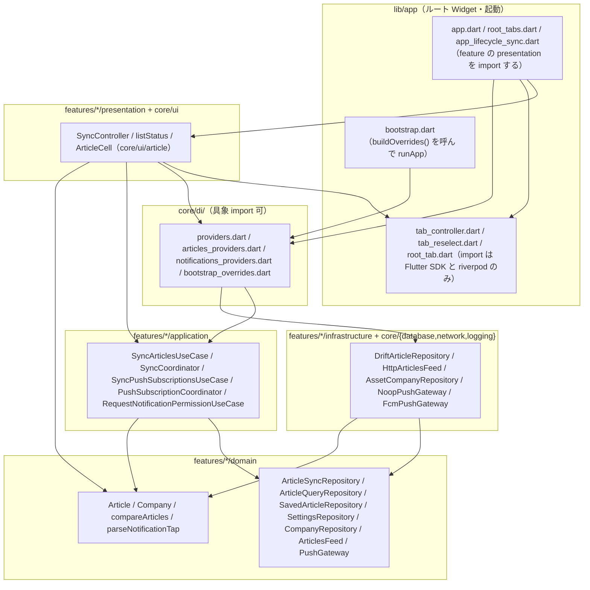
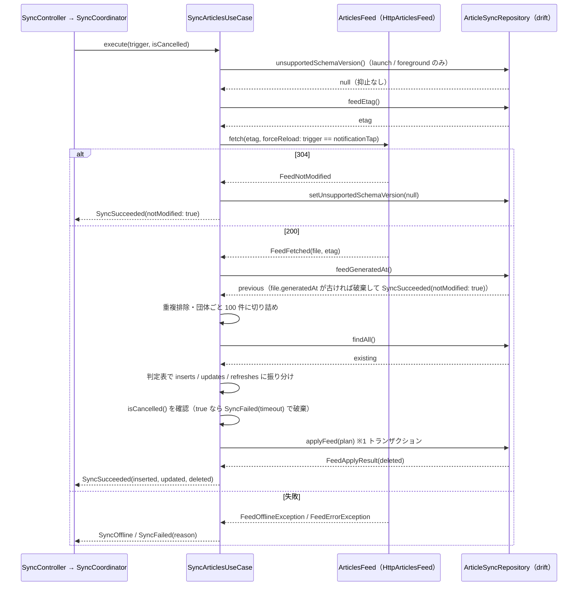

<!--
所有権（画面定義書との乖離を防ぐ）：
  画面定義書 docs/screens/S-xx.md が決める：何が見え、何ができ、どう遷移するか（要素 E-nn・状態 ST-nn・操作 A-nn・表示ルール）
  本書が決める：どう実現するか（UseCase・Provider・Repository・DB・処理手順・状態の判定ロジック）
本書は画面定義書の ID を参照し、内容を転記しない。画面仕様を変えたいときは画面定義書を先に直す（/screen-doc reopen）。
-->

## 1. 目的と範囲

本書は Flutter アプリ（`app/`）の**基盤**を定める。

**決めること（11 点）**：

1. feature-first × クリーンアーキテクチャのディレクトリと依存の方向（§3）
2. drift のスキーマ（要件 §7.2 の 4 テーブル）と migration の方針（§4.2）
3. 複数の feature が共有する domain（`Article`・`Company`・`compareArticles`・Repository インターフェース。§4.1・§4.4・§4.5）
4. `articles.json` の取得（[D-01 §4.7](D-01.md#sec-4-7) の URL・ETag・`schemaVersion` 検証・失敗の分類。§4.3）
5. 取得結果を端末 DB に反映する `SyncArticlesUseCase`（[D-01 §5.2](D-01.md#sec-5-2) の app 判定表と 100 件上限。§5.2）
6. 取得タイミング 3 種（起動時・Pull to Refresh・フォアグラウンド復帰。要件 §6.1）の起動点と同時実行の抑止（§5.3）
7. Riverpod / DI の組み立て方と presentation から見える Provider の粒度（§4.7）
8. FCM トピック購読の同期と通知許可の要求、通知タップで `companyId` を受け取る経路、Firebase 未設定（要件 §10.1 のフェーズ 4 まで）でも動く構造（§4.6・§5.6・§5.7）
9. S-00 の共通部品（下部タブバー・記事セル・状態表示）の Widget と、S-00 §5.2 の状態判定を 1 か所で計算する関数（§5.4・§5.8・§5.9）
10. 同梱アセット `companies.json` の読み込み（§4.5・§5.1）
11. ログとテストの方法（§4.9・§7）

**決めないこと**：

- 個別画面（S-01〜S-03）の UseCase・Provider・Widget（既読・保存・未読フィルタ・ブラウザ選択・一括クリア・通知タップ後のタブ選択）。[D-05](D-05.md) が所有する
- collector 側の一切（[D-02](D-02.md)・[D-03](D-03.md)）
- frontmatter `screens` に S-01〜S-03 を含めるのは、本書がそれらの ID を参照して基盤の受け口を定めるためで、S-01〜S-03 の操作・状態の実現は D-05 が所有する（§2.1）

**D-05 との所有権分界**（frontmatter `features` の扱い）：

| 要件 | 本書が持つもの | D-05 が持つもの |
|---|---|---|
| F-07（通知の受信経路）・F-08（購読の同期）・F-09（ダークモード追従） | 実現のすべて（基盤側で完結） | — |
| F-05（既読）・F-06（保存）・F-10（手動更新）・F-11（更新の再浮上） | 検知・保持の規則（テーブル・列の更新規則・判定表・取得の受け口） | 表示・操作の UseCase・Provider・Widget |
| F-02（記事項目の表示） | 記事セルの部品（`ArticleCell`・`CategoryIcon`・`formatPublishedDate`。§5.9） | 配置と入力（`ArticleCellModel`）の組み立て |
| F-04（ブラウザの選択） | 既定値の表現だけ（`BrowserChoice`・`SettingKeys.browser`・`BrowserChoice.fromValue`。§4.4） | 設定画面・ブラウザの起動を含む実現のすべて |
| F-01・F-03 | — | 実現のすべて |

## 2. 要件との対応

| 要件 | 本書での扱い | 節 |
|---|---|---|
| F-07 プッシュ通知（受信側） | `PushGateway` ポートで通知許可の要求・トピック購読・通知タップの受け取りを抽象化し、FCM 実装（フェーズ 5）と Noop 実装（それ以前）を DI で切り替える。通知タップでは D-01 §4.8 の `data.companyId` だけを読む | §4.6 / §5.6 / §5.7 |
| F-08 通知の団体別 ON/OFF | `settings` テーブルの `notification.<companyId>`（既定 ON）と `companies.json` の `fcmTopic` を突合し、`SyncPushSubscriptionsUseCase` が購読・解除を冪等に同期する。起動時・復帰時（前回失敗あり）と D-05 のトグル操作後に、application の `PushSubscriptionCoordinator` を通して直列に実行する（§8 #41） | §4.4 / §5.6 |
| F-09 ダークモード | `CupertinoApp` にテーマの明暗を固定せず、部品はすべて `CupertinoColors` の動的システム色で描く。アプリ内に切替を持たない | §5.9 / §8 #17 |
| F-02 記事項目の表示（部品） | S-00 の記事セル `ArticleCell`・`CategoryIcon`・`formatPublishedDate` を `core/ui/article/` に置く。配置と入力（`ArticleCellModel`）の組み立ては D-05 | §5.9 / §8 #34 |
| F-11 更新記事の再浮上（検知側） | `SyncArticlesUseCase` が D-01 §5.2 の app 判定表で「更新」を検知し（配信の `updatedAt` が端末より新しいときだけ。§8 #30）、`articles.has_update_badge = true` と `read_states` の削除を同じトランザクションで行う。先頭への再表示は `updatedAt` を全列上書きすることで並び順（`sortKey`）が変わる結果として実現する。バッジの表示は D-05 | §4.2 / §5.2 / §5.5 |
| F-05 既読管理（基盤） | `read_states` テーブルと、更新検知時に既読を解除する規則、`resolveReadDisplayState`。開く・一括クリア・未読フィルタの UseCase は D-05 | §4.2 / §5.5 |
| F-06 保存（基盤） | `saved_articles` テーブルと、配信から外れた保存済み記事を `in_feed = false` で残す保護（`applyFeed` の SQL）。保存・解除・一覧の UseCase は D-05 | §4.2 / §5.2 |
| F-10 手動更新（契機） | `SyncTrigger.pullToRefresh` を `SyncController.sync()` の受け口として用意する。Pull to Refresh の Widget と呼び出しは D-05 | §5.3 |
| R-6 無料 Apple ID ではプッシュ通知が使えない | `PushGateway` の Noop 実装を既定にし、Firebase の初期化・`firebase_*` パッケージの導入をフェーズ 5 のタスク（§10 T-G）に分離する。それ以前はビルド・テスト・シミュレータ実行が Firebase 無しで通る | §5.6 / §8 #12 / §10 |
| §5 データ保持（団体ごと最新 100 件・保存済みは削除しない） | 配信された記事を団体ごとに `compareArticles` で並べ 100 件に切り詰めてから反映し、配信に無い記事は保存済み以外を削除する。保存済みで配信外の記事は `in_feed = false` で残す | §4.2 / §5.2 |
| §5 オフライン時（取得済みの記事は閲覧可能） | 取得失敗時は DB に触れない。失敗を「オフライン」と「エラー」に分類して `SyncResult` で返し、S-00 §5.2 の判定に渡す | §5.2 / §5.4 / §6 |
| §5 起動速度（ローカル DB から即座に表示、取得は裏で） | 起動時は DB を開いてから `runApp` し、取得は `SyncController` が非同期で始める。取得中も DB の記事は表示できる | §5.1 / §5.3 |
| §6.1 取得タイミング（起動時・Pull to Refresh・フォアグラウンド復帰） | `SyncTrigger` 5 値（launch / foreground / pullToRefresh / retry / notificationTap）を `SyncController.sync()` に渡す。launch と foreground は本書の `AppLifecycleSync` が起動し、残り 3 つは D-05 が起動する。同時実行は application の `SyncCoordinator` が 1 つに抑止（S-01 §8 #12。§8 #33） | §5.3 |
| §7.1 記事（Article） | D-01 §4.1 と同じ 10 フィールドを Dart の不変クラスで持つ。日時は `DateTime`（UTC）に変換して保持 | §4.1 |
| §7.2 端末内の状態（4 テーブル） | `articles`・`read_states`・`saved_articles`（保存日時）・`settings` を drift で定義。`schemaVersion = 1` | §4.2 |
| D-01 §8.1（D-04 宛 5 項目） | `id`・`contentHash` は 16 文字テキスト主キー（§4.2）／`companies.json` を `pubspec.yaml` の `assets` に登録し起動時に読む Provider（§4.5・§5.1）／配信ベース URL 定数と ETag・`schemaVersion !== 1` の取得失敗（§4.7・§5.2）／通知は `data.companyId` のみ読む（§4.6）／§7.3 のケースをテストに含める（§7） | §4 / §5 / §7 |
| D-02 §8.1（D-04 宛） | app の CI は `.github/workflows/app-ci.yml` に置く | §4.8 |
| S-01 §8 #19 未読フィルタの永続化 | `settings` のキー `unread_filter`（既定 `0`） | §4.4 |
| S-01 §8 #23 フォアグラウンド復帰時の取得 | `AppLifecycleSync` が「`paused` / `hidden` を経由して `resumed` に戻った」ときに `sync(foreground)` を呼ぶ（判定は純粋関数 `resolveResumeSync`）。`inactive → resumed`（通知許可ダイアログ・アプリ内ブラウザから戻った）では呼ばない | §5.3 |
| S-01 §8 #24 / S-03 §8 #11 通知許可のタイミング・既定 ON | 起動直後に `RequestNotificationPermissionUseCase` を実行し、未確認（`notDetermined`）のときだけ iOS のダイアログを出す。トグルの既定は ON（キー無し = ON） | §5.7 / §4.4 |
| S-02 §8 #6 保存日時 | `saved_articles.saved_at` | §4.2 |
| F-04 ブラウザの選択（既定値の表現） | `BrowserChoice`（`in_app` / `safari` / `chrome`）と `SettingKeys.browser`、行無し・未知の値を `inApp` に写す `BrowserChoice.fromValue` を `settings/domain` に置く。設定画面・実際のブラウザ起動は D-05。**本書は既定値の写像のみを持つ**（F-04 の主担当は D-05 で、frontmatter `features` には入れない。§1 の分界表） | §4.4 |

### 2.1 画面定義との対応（scope: app のみ）

S-00 のすべての操作 A-nn と状態 ST-nn を載せる。本書は共通部品の Widget・状態の判定関数・DB 列を提供し、個別画面での配置と操作の UseCase は D-05 が持つ。S-01〜S-03 の A-nn / ST-nn は D-05 が所有する（D-05 §2.1 が全件を載せる）。本書はそのうち基盤の受け口を提供するものだけを 2 つ目の表に載せる。

| 画面定義書の ID | 種類 | 本書での実現 | 節 |
|---|---|---|---|
| S-00/A-01 | 操作 | `RootTabs`（`CupertinoTabScaffold`）のタブ切替。各タブは `CupertinoTabView` で Navigator とスクロール位置を保持する | §5.8 |
| S-00/A-02 | 操作 | `CupertinoTabBar.onTap` で `shouldNotifyReselect`（純粋関数。ビルド時点で捕捉した選択タブと比較）が true なら `tabReselectProvider` に通知する。先頭までスクロールする処理は各画面（D-05）が `ref.listen` で受ける | §5.8 |
| S-00/A-10 | 操作 | `ArticleCell.onTap` コールバック。記事を開き既読にする UseCase は D-05（`read_states` への書き込みと `has_update_badge` の消去の規則は §5.5） | §5.5 / §8.1 |
| S-00/A-11 | 操作 | `ArticleCell.onToggleSaved` コールバック。保存・解除の UseCase は D-05（`saved_articles` の規則は §4.2） | §4.2 / §8.1 |
| S-00/A-12 | 操作 | `FullErrorView.onRetry` コールバック → D-05 が `ref.invalidate(articleCountProvider)`（記事件数 Stream の再購読。**記事件数 Stream が値を 1 度も得る前にエラーで終わった場合に** ST-14 から抜ける唯一の経路。§5.4）を行ってから `SyncController.sync(SyncTrigger.retry)` を呼ぶ。記事を取得済みの端末が取得失敗で ST-14 になった場合は、再取得の成功だけで ST-14 から抜ける（invalidate は不要だが行っても害は無い） | §5.3 / §5.4 / §5.9 |
| S-00/ST-01 | 状態 | `ReadDisplayState.unread`：`read_states` に行が無く `articles.has_update_badge = false` | §5.5 |
| S-00/ST-02 | 状態 | `ReadDisplayState.read`：`read_states` に行がある | §5.5 |
| S-00/ST-03 | 状態 | `ReadDisplayState.updated`：`read_states` に行が無く `has_update_badge = true`。`SyncArticlesUseCase` が「更新」と判定した記事だけが `true` になる | §5.2 / §5.5 |
| S-00/ST-04 | 状態 | `ArticleCellModel.isSaved`（`saved_articles` に行がある）。**保存画面で解除を保留している間（S-02/ST-04）は画面側の保留状態が優先する**（`saved_articles` に行が残ったまま枠線の星になる。確定は下部タブの選択が保存から外れた時点。§4.2・§8.1 の D-05 宛） | §4.2 / §5.9 |
| S-00/ST-05 | 状態 | `Article.thumbnail == null` → `ArticleCell` がプレースホルダーを描く | §5.9 |
| S-00/ST-06 | 状態 | `Image.network` の `loadingBuilder` / `errorBuilder` でプレースホルダーを描く。再試行は出さない | §5.9 |
| S-00/ST-10 | 状態 | `ListStatus.full == FullView.loading`（判定は §5.4。起動直後で記事数が未確定、または `launch` の取得が未開始・実行中のときもここ。§8 #36） | §5.4 |
| S-00/ST-11 | 状態 | `ListStatus.refreshing == true`（取得済みの記事あり × `SyncStatus.inProgress`） | §5.4 |
| S-00/ST-12 | 状態 | `ListStatus.full == FullView.empty`（表示対象 0 件。文言は配置画面 = D-05） | §5.4 |
| S-00/ST-13 | 状態 | `ListStatus.offlineBanner == true`（取得済みの記事あり × 直近結果 `SyncOffline`） | §5.4 |
| S-00/ST-14 | 状態 | `ListStatus.full == FullView.error`（取得済みの記事なし × 直近結果 `SyncFailed`） | §5.4 |
| S-00/ST-15 | 状態 | `ListStatus.errorNotice == true`（取得済みの記事あり × 直近結果 `SyncFailed`）。3 秒表示と「配置画面表示中のみ」の制御は D-05 が `SyncStatus.sequence` の変化を `ref.listen` して行う | §5.4 / §8.1 |
| S-00/ST-16 | 状態 | `ListStatus.full == FullView.offline`（取得済みの記事なし × 直近結果 `SyncOffline`） | §5.4 |
| S-00/ST-20 | 状態 | `CupertinoTabBar` の `currentIndex`。起動直後は 0（ホーム） | §5.8 |
| S-00/ST-30 | 状態 | `CupertinoApp.theme` に `brightness` を指定せず、`MediaQuery.platformBrightness` に追従。色は `CupertinoColors` の動的色のみ | §5.9 / §8 #17 |
| S-00/E-01〜E-04 | 要素 | `RootTabs`（`lib/app/root_tabs.dart`） | §5.8 |
| S-00/E-10〜E-17 | 要素 | `lib/core/ui/article/` の `ArticleCell`（入力は `ArticleCellModel`。団体名・既読状態・保存状態は D-05 が組み立てる。§8 #34） | §5.9 |
| S-00/E-20〜E-25 | 要素 | `lib/core/ui/status/` の 6 Widget（`FullLoadingView`・`RefreshingHeader`・`EmptyView`・`OfflineBanner`・`FullErrorView`・`TransientNotice`） | §5.9 |

S-01〜S-03 のうち本書が受け口を提供する ID（実現の主体は D-05）：

| 画面定義書の ID | 本書が提供するもの | 節 |
|---|---|---|
| S-01/A-04（Pull to Refresh） | `SyncTrigger.pullToRefresh` と `SyncController.sync()` の戻り値（await でインジケータを閉じる） | §5.3 |
| S-01/A-07・ST-15（通知タップ） | `initialNotificationTapProvider`・`notificationTapStreamProvider`・`tabControllerProvider`・`SyncTrigger.notificationTap`（`forceReload` で取得。§8 #31） | §5.7 / §5.8 / §5.3 |
| S-01/A-08（再試行） | `SyncTrigger.retry`（S-00/A-12 経由） | §5.3 |
| S-01/ST-01・ST-02（起動時の取得） | `SyncTrigger.launch` を `AppLifecycleSync` が起動 | §5.3 |
| S-01/ST-18（通知許可ダイアログ） | `RequestNotificationPermissionUseCase`。取得と並行して出る | §5.7 |
| S-01 §7.1・§7.4・§7.5（並び順・新着/更新・100 件） | `compareArticles`・`has_update_badge`・`in_feed` | §4.1 / §4.2 / §5.5 |
| S-02/ST-01・ST-02（保存一覧の content / empty） | `ListStatus`・`FullView` の**型だけ**（`lib/core/ui/status/list_status.dart`）。判定は D-05 が `hasVisible`（保存済みが 1 件以上か）から直接 `content` / `empty` を組み立てる。**本書の `resolveListStatus` はホーム（S-01）専用**で S-02 は通さない（§8 #51）。保存一覧そのものを読めない／件数が未確定のときの表示は S-02 §5 に定義が無いため本書では決めない（§8.1 の S-02 宛） | §5.4 / §8.1 |
| S-02 §7.1・§7.3（保存日時・配信外の保存記事） | `saved_articles.saved_at`・`in_feed = false` の保護 | §4.2 |
| S-02/A-02・ST-04（保存解除の保留と確定時点） | `SavedArticleRepository.save` / `remove` と `articles` の削除規則。確定契機（下部タブの選択が保存から外れた時点。通知タップによる切替を含む）と、保存画面を表示したまま終了した場合の扱いは §4.2（S-02 との乖離は §8.1 の S-02 宛） | §4.2 / §8.1 |
| S-03/A-01・ST-02（通知トグル。既定 ON。S-03 §8 #11） | `SettingsRepository.setNotificationEnabled`・`PushSubscriptionCoordinator.run()`（`SyncPushSubscriptionsUseCase` を直列化した入口。§8 #41） | §4.4 / §5.6 |
| S-03/ST-03（通知が許可されていない） | `pushPermissionStatusProvider`（復帰時に invalidate） | §5.7 |
| S-03/A-06（既読の一括クリア） | `read_states`・`has_update_badge` の更新規則 | §5.5 |
| S-03/A-07（設定アプリから戻る） | `AppLifecycleSync` が復帰時に `pushPermissionStatusProvider` を invalidate | §5.3 |

## 3. 構成

### 3.1 層と依存の方向

依存は presentation / app → application → domain、infrastructure → domain の一方向のみ。具象クラスを import してよいのは `lib/core/di/` の 4 ファイル（`providers.dart` = 基盤と Repository の Provider、`articles_providers.dart` = articles feature の UseCase・Coordinator の Provider、`notifications_providers.dart` = notifications feature の UseCase・Coordinator の Provider、`bootstrap_overrides.dart` = DB を開き、アセットを読み、`ProviderScope` の `overrides` を組み立てる）だけ（feature ごとに分ける理由は §8 #45）。`lib/app/bootstrap.dart` は `buildOverrides()` を呼んで `runApp` するだけで、具象を import しない（§8 #43）。presentation は `core/di` の Provider を通じて UseCase・Repository の**インターフェース型**を受け取り、infrastructure を import しない（CLAUDE.md）。



feature 間の依存は次の方向だけを許す。`articles` は他の feature を import しない（`Article` の所有者）。feature の presentation が**他の feature の presentation** を import することは禁止する。S-00 の共通部品（記事セル・状態表示）はどの feature にも属さず `core/ui/` に置く（§8 #34）。

| 依存元 | 依存先 | 理由 |
|---|---|---|
| `core/ui/article`（`ArticleCell`・`CategoryIcon`・`formatPublishedDate`） | `articles/domain`（`Article`・`Category`・`ReadDisplayState`）のみ | 記事セルは 3 画面が使う共通部品（S-00 §8 #1）。application・infrastructure・Provider には依存しない |
| `saved` / `settings` / `notifications` の presentation（D-05） | `articles/domain`・`core/ui/article`・`core/ui/status` | 保存一覧も同じ記事セルを使う |
| `notifications/application` | `settings/domain`（通知設定）・`companies/domain`（`fcmTopic`） | 購読同期の入力 |
| `articles/infrastructure`（`DriftArticleRepository`） | `core/database` | 保存済み記事の保護は SQL の副問合せで行う（§5.2 手順 8）ため、`articles` は `saved/domain` を import しない |
| feature の presentation（`articles` / `saved` / `settings`。D-05 を含む） | `lib/app/` の**共有 Provider ファイルだけ**（`tab_controller.dart` = `tabControllerProvider`・`tab_reselect.dart` = `tabReselectProvider`・`root_tab.dart`。図の `SHARED`） | S-00/A-01・A-02 と S-01/ST-15 は下部タブの状態を画面から触る必要がある。**共有 Provider は「feature の presentation を import しないファイル」に置く**：3 画面の presentation を import する Widget ファイル（`root_tabs.dart`）に Provider を置くと、それを読む feature の presentation が他 feature の presentation を推移的に取り込み、CLAUDE.md の禁止事項に反する（`app.dart`・`root_tabs.dart`・`app_lifecycle_sync.dart` は参照禁止。§5.8・§8 #46）。D-05 が同じ規則で `lib/app/` に足す `minuteClockProvider` も同じ制約に従う（置き場と定義は **D-05 の所管**で、本書 §3.2 のツリーには載せない） |

`articles/infrastructure` が `settings` の `feed_*` キーのために `settings/domain` を import することはしない。同期状態のキーは `articles/infrastructure/feed_state_keys.dart`（`FeedStateKeys`）に置き（読み書きするのは `DriftArticleRepository` だけで、domain の型・UseCase は参照しない。§8 #47）、`settings` テーブルへの読み書きは `AppDatabase`（`core/database`）の共通アクセサ経由で行う（§4.2・§4.4）。

### 3.2 ファイル配置

```
app/
  pubspec.yaml                  §4.8。assets に assets/companies.json を登録（D-01 §8 #28）
  analysis_options.yaml         very_good_analysis を include
  build.yaml                    drift: store_date_time_values_as_text: true（§4.2）
  assets/
    companies.json              data/companies.json の同一コピー（D-01 §10 Task A で作成済み）
  lib/
    main.dart                   bootstrap() を await して runApp
    app/
      bootstrap.dart            core/di/bootstrap_overrides.dart の buildOverrides() を await して runApp（具象を import しない。§5.1）
      app.dart                  CupertinoApp（ST-30。§5.9）
      root_tabs.dart            S-00/E-01〜E-04。A-01・A-02・ST-20（Widget のみ。Provider を置かない。§5.8）
      root_tab.dart             RootTab（タブの列挙）・shouldNotifyReselect（再タップ判定の純粋関数）。**import ゼロ**（§5.8）
      tab_controller.dart       tabControllerProvider（CupertinoTabController を Raw<T> で公開）。import は cupertino.dart と riverpod のみ（§5.8。§8 #46）
      tab_reselect.dart         tabReselectProvider（A-02 の通知）
      app_lifecycle_sync.dart   起動時・フォアグラウンド復帰の取得、通知許可、購読同期の起動点、記事件数エラーの記録（§5.3・§5.4・§5.7）
      resume_sync_policy.dart   resolveResumeSync・ResumeSyncDecision（ライフサイクル遷移の純粋関数。§5.3）
    core/
      di/
        providers.dart          基盤（DB・logger・http・companies）と Repository・PushGateway の Provider（§4.7。T-C）
        articles_providers.dart articles feature の Provider（ArticlesFeed・SyncArticlesUseCase・SyncCoordinator。§4.7。T-D。§8 #45）
        notifications_providers.dart  notifications feature の Provider（SyncPushSubscriptionsUseCase・PushSubscriptionCoordinator・RequestNotificationPermissionUseCase。§4.7。T-E。§8 #45）
        bootstrap_overrides.dart  buildOverrides()：DB open・companies 読み込み・（fcm 時）Firebase 初期化・overrides の組み立て（§5.1。§8 #43）
      database/
        tables.dart             4 テーブル定義（§4.2）
        app_database.dart       AppDatabase（schemaVersion 1・migration・PRAGMA foreign_keys）
      network/
        feed_config.dart        配信ベース URL・タイムアウト・User-Agent 定数（§4.3）
        user_agent_client.dart  http.BaseClient の派生（UA 付与）
      logging/
        app_logger.dart         logger パッケージの生成（§4.9）
      ui/
        status/
          list_status.dart          ListStatus・FullView（S-00 §5.2 の状態表示の**型**だけ。
                                    import は package:flutter/foundation.dart（@immutable）のみで、
                                    feature・application・riverpod を import しない（§4.1・§8 #51）。
                                    ホームの判定関数 resolveListStatus は articles/presentation に置く。§5.4）
          centered_status_body.dart 中央寄せの共通レイアウト（EmptyView・FullErrorView が共有。§5.9）
          full_loading_view.dart    E-20
          refreshing_header.dart    E-21
          empty_view.dart           E-22
          offline_banner.dart       E-23
          full_error_view.dart      E-24（error / offline の 2 変種）
          transient_notice.dart     E-25
        article/                    S-00 の記事セル（articles/domain のみに依存。§8 #34）
          article_cell.dart         E-10〜E-17（§5.9）
          article_cell_model.dart   ArticleCellModel
          category_icon.dart        E-12（S-00 §7.2 の対応）
          published_date_format.dart  S-00 §7.3 の書式（純粋関数）
    features/
      articles/
        domain/
          article.dart              Article（§4.1）
          category.dart             Category enum と fromValue（未知 → other）
          articles_file.dart        ArticlesFile（generatedAt・articles）・定数（articlesSchemaVersion・supportedArticlesSchemaVersions・maxArticlesPerCompany・feedGeneratedAtFutureTolerance）・isImplausibleGeneratedAt（純粋関数。§4.1）
          article_order.dart        compareArticles（D-01 §4.5 の移植）
          article_sync_repository.dart   ArticleSyncRepository・FeedApplyPlan・FeedApplyResult（同期用。§4.4。§8 #42）
          article_query_repository.dart  ArticleQueryRepository（閲覧用 Stream。D-05 が watchInFeed 等を追加）
          articles_feed.dart        ArticlesFeed ポート・FeedFetchResult・FeedFailureReason・FeedOfflineException・FeedErrorException（§4.3）
          read_display_state.dart   ReadDisplayState と resolveReadDisplayState（§5.5）
        application/
          sync_articles_use_case.dart   §5.2
          sync_coordinator.dart         SyncCoordinator・SyncEvent（同時実行の抑止・全体タイムアウト・世代番号・完了通知。§5.3）
          sync_result.dart              SyncTrigger・SyncResult・SyncFailureReason（§4.4）
        infrastructure/
          feed_state_keys.dart          FeedStateKeys（feed_etag・feed_generated_at・feed_unsupported_schema。
                                        settings テーブルの行キー = 保存形式の詳細なので infrastructure。§4.4。§8 #47）
          articles_file_codec.dart      JSON → ArticlesFile（D-01 §4.1・§4.2 の検証）
          http_articles_feed.dart       ArticlesFeed 実装（ETag・304・失敗の分類）
          drift_article_repository.dart ArticleSyncRepository と ArticleQueryRepository の両方を implements する 1 つの具象（applyFeed は 1 トランザクション）
        presentation/
          sync_controller.dart          SyncController（Notifier）・SyncStatus（§5.3）
          list_status.dart              FeedStatus・resolveListStatus（**ホーム専用**）・resolveHasArticles・shouldLogCountError、feedStatus / articleCount の 2 Provider（§5.4。ListStatus・FullView は core/ui/status/list_status.dart から import する。§8 #51）
      companies/
        domain/
          company.dart              Company（§4.5）
          company_repository.dart   CompanyRepository
        infrastructure/
          asset_company_repository.dart  rootBundle から assets/companies.json を読む
      saved/
        domain/
          saved_article_repository.dart  SavedArticleRepository（§4.4。D-05 が閲覧用メソッドを追加）
        infrastructure/
          drift_saved_article_repository.dart
      settings/
        domain/
          settings_repository.dart   SettingsRepository・SettingKeys（§4.4）
          browser_choice.dart        BrowserChoice enum
        infrastructure/
          drift_settings_repository.dart
      notifications/
        domain/
          push_gateway.dart          PushGateway・PushPermissionStatus（§4.6）
          notification_tap.dart      NotificationTap と parseNotificationTap（純粋関数。§4.6）
        application/
          sync_push_subscriptions_use_case.dart        §5.6
          push_subscription_coordinator.dart           PushSubscriptionCoordinator（購読同期の直列化・直近結果の保持・復帰時の再同期判定 resyncIfNeeded。§5.6。§8 #41・#52）
          push_subscription_sync_result.dart           PushSubscriptionSyncResult（§4.4）
          request_notification_permission_use_case.dart §5.7
        infrastructure/
          noop_push_gateway.dart     既定（Firebase 無し）
          fcm_push_gateway.dart      フェーズ 5 で追加（§10 T-G）
        presentation/
          notification_tap_providers.dart  initialNotificationTapProvider・notificationTapStreamProvider・pushPermissionStatusProvider
  test/
    helpers/
      in_memory_database.dart     NativeDatabase.memory() で AppDatabase を作る
      mock_feed_client.dart       package:http の MockClient を組み立てる
      fake_push_gateway.dart      PushGateway のフェイク（呼び出し記録・許可状態の設定）
      test_articles.dart          Article のビルダ（フィクスチャの改変用）
      completer_stub.dart         Coordinator の execute スタブ（Completer で完了を制御・呼び出し記録。作るのは T-D、T-E も使う。§7・§10）
    fixtures/
      articles.sample.json        collector/test/fixtures/contract/articles.sample.json のコピー（D-01 §4.2）
    app/
      resume_sync_policy_test.dart                         resolveResumeSync の直接テスト（§7 純粋関数の例外）
      root_tab_test.dart                                   shouldNotifyReselect の直接テスト（同上）
    core/ui/article/
      published_date_format_test.dart                      formatPublishedDate の直接テスト（同上）
    features/
      articles/application/sync_articles_use_case_test.dart
      articles/application/sync_coordinator_test.dart      同時実行の抑止・全体タイムアウト・通知タップの後追い・完了通知・dispose（§7）
      articles/domain/article_order_test.dart              compareArticles の直接テスト（同上）
      articles/domain/read_display_state_test.dart         resolveReadDisplayState の直接テスト（同上）
      articles/presentation/list_status_test.dart          resolveListStatus・resolveHasArticles・shouldLogCountError の直接テスト（同上）
      notifications/domain/notification_tap_test.dart      parseNotificationTap の直接テスト（同上）
      notifications/application/sync_push_subscriptions_use_case_test.dart
      notifications/application/push_subscription_coordinator_test.dart   直列化・失敗・復帰時の再同期（§7）
      notifications/application/request_notification_permission_use_case_test.dart
.github/workflows/app-ci.yml      §4.8
```

`read_states` の Repository（`ReadStateRepository`）は本書の UseCase が使わないため、インターフェース・実装とも D-05 が `features/articles/domain` / `infrastructure` に追加する（§4.2 でテーブルと更新規則だけを定める。§8.1）。

## 4. データ

### 4.1 Article と ArticlesFile（`features/articles/domain/`）

D-01 §4.1 と同じ名前のフィールドを持つ。日時は `DateTime.parse` でオフセット付きとして解釈し（結果は `isUtc == true`）、表示時に `toLocal()` する（S-00 §7.3）。`category` は配信の文字列をそのまま保持し、表示時に `Category.fromValue` で 7 値に写す（未知の値は `other`。S-00 §7.2）。`id`・`contentHash`・`companyId` は不透明な文字列として扱い、再計算・検証しない（D-01 §3.1）。本文に相当するフィールドは持たない（要件 §7）。

**不変クラス（値オブジェクト）には `@immutable` を付ける。対象は節ではなくクラスで決める**（節で決めると同じ節の中で付け忘れても気づけず、`dart analyze` でも差が出ないため）：

| 対象 | クラス | `@immutable` の import 元 |
|---|---|---|
| §8 #24 に挙げた不変クラス**すべて** | `Article`・`Company`・`ArticlesFile`・`FeedApplyPlan`・`FeedApplyResult`・`SyncResult`（`SyncSucceeded`・`SyncOffline`・`SyncFailed`）・`StaleFeedDiscarded`・`SyncStatus`・`SyncEvent`（`SyncStarted`・`SyncCompleted`）・`FeedStatus`・`ResumeSyncDecision`・`NotificationTap`・`PushSubscriptionSyncResult` | `package:meta`（§4.8） |
| 同上のうち `core/ui/` に置くもの | `ArticleCellModel`（§5.9）・`ListStatus`（§5.4） | `package:flutter/foundation.dart`（`core/ui/` の import を Flutter SDK と `articles/domain` に限るため。§10 T-F2a・T-F2b） |
| §4.3 の取得結果と例外 | `FeedFetchResult`（`FeedNotModified`・`FeedFetched`）・`FeedOfflineException`・`FeedErrorException` | `package:meta` |

`enum`・インターフェース（`abstract interface class`）・定数置き場（`abstract final class` の `FeedStateKeys`・`SettingKeys`）には付けない（インスタンスを持たないため）。`sealed` 階層は基底クラスに 1 つ付ければ派生にも効く（上表の `SyncResult`・`SyncEvent`・`FeedFetchResult`）。可変フィールドの混入を analyzer が検出する。`ignore_for_file` で lint を黙らせない（T-18 の追随事項）。**`core/ui/status/list_status.dart` の import も `package:flutter/foundation.dart` 1 つだけ**とし、feature・application・riverpod は import しない（§8 #51 の目的は「`core/ui/status` → `articles/application` の辺を作らない」ことであり、Flutter SDK の import はこれを損なわない）。

```dart
// lib/features/articles/domain/article.dart
/// 記事（D-01 §4.1）。不変。== と hashCode は全フィールドで手書きする（freezed は使わない。§8 #24）
@immutable
final class Article {
  const Article({
    required this.id,
    required this.companyId,
    required this.title,
    required this.url,
    required this.category,
    required this.publishedAt,
    required this.fetchedAt,
    required this.contentHash,
    this.thumbnail,
    this.updatedAt,
  });

  final String id;          // 16 文字の 16 進小文字（D-01 §8 #25）
  final String companyId;   // companies.json の id。未知の値も保持する（S-00 §7.1）
  final String title;
  final String url;         // 正規化済み（D-01 §5.1）。そのまま開く
  final String category;    // 配信の文字列。表示は Category.fromValue（未知 → other）
  final DateTime publishedAt; // UTC
  final DateTime fetchedAt;   // UTC
  final String contentHash;
  final String? thumbnail;  // URL 参照のみ。端末にコピーしない
  final DateTime? updatedAt;  // UTC。無し = null（キー省略と null を同一視。D-01 §8 #2）

  /// 並び順の日時（S-01 §7.1 第 1 キー）
  DateTime get sortKey => updatedAt ?? publishedAt;

  Article copyWith({...});   // 全フィールド任意。updatedAt / thumbnail を null にする指定は sentinel を使わず、呼び出し側が新しいインスタンスを作る
  @override bool operator ==(Object other) => ...;   // 10 フィールドの比較
  @override int get hashCode => Object.hash(...);
}
```

```dart
// lib/features/articles/domain/category.dart
enum Category {
  newWork('new_work'), ticket('ticket'), streaming('streaming'), schedule('schedule'),
  cast('cast'), person('person'), other('other');

  const Category(this.value);
  final String value;

  /// D-01 §4.4 の 7 値。対応表に無い値は other（S-00 §7.2）
  static Category fromValue(String value) =>
      Category.values.firstWhere((c) => c.value == value, orElse: () => Category.other);
}
```

```dart
// lib/features/articles/domain/articles_file.dart
const int articlesSchemaVersion = 1;          // D-01 §4.2
/// 現在の app が反映できる schemaVersion の集合。app 更新で版を増やすときはここに足す（§5.2 手順 0 の抑止判定に使う。§8 #32）
const Set<int> supportedArticlesSchemaVersions = {articlesSchemaVersion};
const int maxArticlesPerCompany = 100;        // 要件 §5
/// 端末時計にこの値を足した時刻より後（isAfter）の generatedAt は「信用できない値」とみなし、後退防止の基準（feed_generated_at）に使わない（§5.2 手順 4。§8 #38）。
/// ちょうど +24 時間は isAfter が false なので基準に保存される（境界。§7）。
/// collector の 1 時間おきの実行（要件 §6.1）と端末時計の通常のずれ（数分）に対して十分大きく、時計事故（年単位の先走り）を弾ける
const Duration feedGeneratedAtFutureTolerance = Duration(hours: 24);

/// [generatedAt] が端末時計 [now] + feedGeneratedAtFutureTolerance より後なら true（信用できない値）。
/// 純粋関数（dart:core のみ）。SyncArticlesUseCase の手順 4（previous の判定）と手順 8（plan.generatedAt の判定）が呼ぶ。
/// isAfter は絶対時刻（UTC のエポックからの経過）の比較なので、引数の isUtc の別は結果に影響しない（toUtc() は「UTC で扱う」意図の明示）。
/// 直接テストは置かず、UseCase テストで境界（+23 時間・ちょうど +24 時間・+25 時間）を検証する（§7。§8 #28 の例外リストには加えない）
bool isImplausibleGeneratedAt(DateTime generatedAt, DateTime now) =>
    generatedAt.isAfter(now.toUtc().add(feedGeneratedAtFutureTolerance));

@immutable
final class ArticlesFile {
  const ArticlesFile({required this.generatedAt, required this.articles});
  final DateTime generatedAt;                 // UTC
  final List<Article> articles;              // 配信順のまま。切り詰め・重複排除は SyncArticlesUseCase（§5.2）
}
```

```dart
// lib/features/articles/domain/article_order.dart
/// D-01 §4.5 の移植。第 1 キー sortKey 降順 → 第 2 キー fetchedAt 降順 → 第 3 キー id 昇順
int compareArticles(Article a, Article b) {
  final byKey = b.sortKey.compareTo(a.sortKey);
  if (byKey != 0) return byKey;
  final byFetched = b.fetchedAt.compareTo(a.fetchedAt);
  if (byFetched != 0) return byFetched;
  return a.id.compareTo(b.id);
}
```

D-01 の並び替えは文字列比較だが、同一書式（秒精度・単一オフセット）を瞬間に変換した `DateTime` の比較は同じ順序になる。オフセットが異なる ISO8601 が将来混ざっても瞬間で比較されるため、こちらのほうが堅牢である（§8 #3）。

### 4.2 drift スキーマ（`lib/core/database/`）

要件 §7.2 の 4 テーブル。`schemaVersion = 1`。日時はすべて ISO8601 テキスト（UTC）で保存する（`build.yaml` の `store_date_time_values_as_text: true`。§8 #4）。外部キーは `beforeOpen` で `PRAGMA foreign_keys = ON` を発行して有効にする。

```dart
// lib/core/database/tables.dart
import 'package:drift/drift.dart';

/// drift の既定の行クラス名は `Article` で、domain の `Article`（§4.1）と衝突するため
/// `ArticleRow` に固定する（`SavedArticleRow` と同じ理由。`schemaVersion` は変わらない）
@DataClassName('ArticleRow')
class Articles extends Table {
  TextColumn get id => text().withLength(min: 16, max: 16)();          // D-01 §8 #25。主キー
  TextColumn get companyId => text()();
  TextColumn get title => text()();
  TextColumn get url => text()();
  TextColumn get category => text()();                                  // 配信の文字列のまま
  DateTimeColumn get publishedAt => dateTime()();
  DateTimeColumn get fetchedAt => dateTime()();
  TextColumn get thumbnail => text().nullable()();
  TextColumn get contentHash => text().withLength(min: 16, max: 16)();
  DateTimeColumn get updatedAt => dateTime().nullable()();
  /// 直近の配信（articles.json）に含まれている = ホームの 100 件の範囲内（S-01 §7.5・§8 #10）。
  /// false は「配信から外れたが保存済みなので残している」記事（S-02 §7.3）
  BoolColumn get inFeed => boolean().withDefault(const Constant(true))();
  /// 「更新」バッジ（S-00/ST-03）。SyncArticlesUseCase が「更新」と判定したとき true、
  /// 記事を開いた（S-00/A-10）・既読の一括クリア（S-03/A-06）で false（§5.5）
  BoolColumn get hasUpdateBadge => boolean().withDefault(const Constant(false))();

  @override
  Set<Column<Object>> get primaryKey => {id};
}

class ReadStates extends Table {
  TextColumn get articleId => text().references(Articles, #id, onDelete: KeyAction.cascade)();
  DateTimeColumn get readAt => dateTime()();
  @override
  Set<Column<Object>> get primaryKey => {articleId};
}

/// drift の既定の行クラス名は `SavedArticle` で、D-05 の domain クラス（保存一覧の表示用）と
/// 名前が衝突するため `SavedArticleRow` に固定する（`schemaVersion` は変わらない）
@DataClassName('SavedArticleRow')
class SavedArticles extends Table {
  TextColumn get articleId => text().references(Articles, #id, onDelete: KeyAction.cascade)();
  DateTimeColumn get savedAt => dateTime()();                            // S-02 §7.1 の並び順キー
  @override
  Set<Column<Object>> get primaryKey => {articleId};
}

class Settings extends Table {
  TextColumn get key => text()();
  TextColumn get value => text()();
  @override
  Set<Column<Object>> get primaryKey => {key};
}
```

```dart
// lib/core/database/app_database.dart
@DriftDatabase(tables: [Articles, ReadStates, SavedArticles, Settings])
class AppDatabase extends _$AppDatabase {
  AppDatabase(super.executor);

  @override
  int get schemaVersion => 1;

  @override
  MigrationStrategy get migration => MigrationStrategy(
        // インデックスは `onCreate` の `createIndex` で作る。次に schemaVersion を上げるときに
        // テーブル定義側の `@TableIndex` へ移す（drift が onCreate と migration の双方を生成する。T-20 の追随事項）
        onCreate: (m) async {
          await m.createAll();
          await m.createIndex(Index('idx_articles_company', 'CREATE INDEX idx_articles_company ON articles (company_id)'));
          await m.createIndex(Index('idx_articles_in_feed', 'CREATE INDEX idx_articles_in_feed ON articles (in_feed)'));
          await m.createIndex(Index('idx_saved_articles_saved_at', 'CREATE INDEX idx_saved_articles_saved_at ON saved_articles (saved_at)'));
        },
        onUpgrade: (m, from, to) async {
          // schemaVersion 2 以降で `if (from < 2) { ... }` の形で手書きし、段階的に積む（§8 #25）
        },
        beforeOpen: (details) async {
          await customStatement('PRAGMA foreign_keys = ON');
        },
      );

  // settings テーブルの共通アクセサ。articles/infrastructure（feed_etag 等）と
  // settings/infrastructure（notification.* ほか）が同じ 1 行 key-value の読み書きを持つため、
  // SQL を AppDatabase に 1 つだけ置く（Repository ごとに書かない）。
  // 置くのは「キーを引数に取る汎用のプリミティブ」だけで、キーごとの写像（notification.* の
  // Map 化、BrowserChoice への変換）は各 Repository 実装に置く（下記「AppDatabase に置く SQL」）
  Future<void> upsertSetting(String key, String value);
  Future<void> deleteSetting(String key);
  Future<String?> readSetting(String key);          // 行が無ければ null
  /// `readSetting` の watch 版。**値が変わらない再発火も流れる**（下記「settings の監視」）ため、
  /// 重複を止めたい呼び出し側が `.distinct()` を付ける（このメソッドは抑止しない）
  Stream<String?> watchSetting(String key);

  /// 配信から外れた未保存の記事を削除する（§5.2 手順 8-5）。
  /// `DELETE FROM articles WHERE in_feed = 0 AND id NOT IN (SELECT article_id FROM saved_articles)`。
  /// `customUpdate` の `updates` は `{articles, read_states}`（cascade で read_states も消えるため、
  /// 両テーブルの select ストリームを無効化する必要がある。T-20 の追随事項）。戻り値は削除件数。
  /// articles/infrastructure（`applyFeed`）と saved/infrastructure（保存解除の確定。D-05 §4.5）が共有する
  Future<int> deleteUnsavedOutOfFeedRows();
}
```

| 規則 | 内容 |
|---|---|
| ファイル | 本番は `drift_flutter` の `driftDatabase(name: 'curtaincall')`（アプリのドキュメントディレクトリ）。テストは `NativeDatabase.memory()`（§7） |
| `articles` の行の寿命 | 配信に含まれる間は `in_feed = true`。配信から外れたら、保存済みなら `in_feed = false` で残し、未保存なら削除する（§5.2 手順 8）。保存を解除した記事が `in_feed = false` なら `articles` の行も削除するが、**削除を確定する時点は画面で異なる**（S-02 §7.3「解除したとき」・§5 ST-04。§8.1）：**保存画面での解除は D-05 が画面上で保留し（セルは枠線の星で残り再タップで戻せる）、確定は下記の 1 契機だけで行う**。**ホームでの解除は即時**（ホームに出る記事は `in_feed = true` なので `articles` の削除対象にならない）。`in_feed = false` の行はユーザーが保存を解除するまで残り、**件数の上限は設けない**（F-06「保存記事は自動削除の対象外」。1 件ずつの明示操作でしか増えないため実用上は数千件が上限で、`findAll()`（§5.2 手順 6）の読み込みは数十ミリ秒で収まる） |
| 保留中の解除の**確定契機**（S-02/ST-04） | 確定するのは**下部タブの選択が保存から外れた時点**（ユーザー操作の S-00/A-01 に加え、**通知タップによるホームへの切替**（S-01/ST-15）を含む。切替の起点は問わない）の 1 つだけ。そのとき `saved_articles` の削除と、`in_feed = false` になった記事の `articles` からの削除をまとめて行う。次の 3 つでは**確定しない**：(1) 記事を開いて戻る（S-02/A-01 → S-02/A-03。アプリ内ブラウザへの遷移。S-02 §5 ST-04「A-03 で記事から戻っただけでは消えない」・§8 #9）、(2) Safari / Chrome への離脱と復帰（S-02 §6 A-01。外部アプリが開き本画面はバックグラウンドに残る）、(3) `paused` / `hidden`（背景化）。**保存画面を表示したままアプリが終了した場合、保留中の解除と再保存の `saved_at` 更新は DB に書かれていないため失われ、次回起動時はその記事が保存済み（塗りつぶしの星）のまま出る**（取り消し側に倒す。D-05 §8 #26。開発者確認済み 2026-09-20。`paused` で確定する案・解除時点で削除して表示だけ保留する案を採らない理由も同所）。**S-02 §5 ST-04 の「アプリを再起動したときに消える」は無条件の記述で、本書のこの扱いとこの点で食い違っている**（他の下部タブへ移ってから終了した場合だけ成り立つ）。本書は画面定義書を限定解釈せず、`reopen:S-02`（T-34 の着手前提）で S-02 側に補足が入るまで乖離が残ることを申し送る（§8.1 の S-02 宛・D-05 §8.1） |
| `read_states` | 行がある = 既読（S-00/ST-02）。`SyncArticlesUseCase` が「更新」と判定した記事の行は削除する（S-00 §7.5「未読に戻る」）。一括クリアは全行削除（D-05） |
| `saved_articles` | 行がある = 保存済み（S-00/ST-04）。`saved_at` は保存操作の時刻（端末時計、UTC）。再保存は行を作り直し `saved_at` を更新する（S-02 §7.1）。**保留中（S-02/ST-04）の再タップは「保留の取り消し」ではなく再保存として記録する**が、**保留中は DB に書かない**（D-05 が画面の状態として持つ。D-05 §5.5）。確定時（上記の確定契機）に `SavedArticleRepository.save(articleId, savedAt: 再タップ時刻)` を呼んで `saved_at` を更新する（行は残っているので値だけが書き換わる）。即時に `save()` を呼ぶと `watchAll()` が再発火してその場でセルが先頭へ移り、S-02/A-02「一覧の位置は変わらない」・§7.1「その場では位置が変わらず、下部タブを切り替えて戻ったときに先頭に移る」に反する（§8.1 の D-05 宛） |
| `AppDatabase` に置く SQL | **2 つ以上の feature の infrastructure が共有する述語・アクセサに限る。** 現在は settings の 4 アクセサ（`upsertSetting` / `deleteSetting` / `readSetting` / `watchSetting`。`articles` の `feed_*` と `settings` の `notification.*` ほかが同じ key-value の読み書きを持つ）と `deleteUnsavedOutOfFeedRows()`（`articles/infrastructure` の `applyFeed`（§5.2 手順 8-5）と `saved/infrastructure` の保存解除の確定（D-05 §4.5）が同じ述語を使う）の 5 つ。**1 つの feature でしか使わない SQL は各 Repository 実装に置く**（`AppDatabase` を全 SQL の置き場にしない）。§8 #48 |
| `settings` | キー・値ともテキスト。キーの一覧は §4.4 `SettingKeys` と `FeedStateKeys`。既定値は行が無いときに読み手が補う（テーブルに既定行を作らない）。読み書きは `AppDatabase` の `upsertSetting` / `deleteSetting` / `readSetting` / `watchSetting` を通す |
| `settings` の監視 | `AppDatabase.watchSetting()` と `settings` を読む select ストリームは、**同じテーブルへの無関係な書き込みでも再発火する**（drift のストリームはテーブル単位で無効化する）。`feed_etag` は取得が成功するたびに upsert される（§4.3・§5.2 手順 8-6）ため、**同期のたびに `settings` の全ストリームが再発火する**。値が変わらない再発火で画面が作り直されないよう、`settings` を watch する Repository のメソッド（`watchNotificationSettings()`・`watchBrowserChoice()`・`watchUnreadFilter()` など。追加は D-05）は**写した値に `.distinct()` を掛けてから返す**。とくに `Map` を返すメソッドは毎回新しいインスタンスで `==` が参照比較になるため、`.distinct(const MapEquality<String, bool>().equals)`（`package:collection`。§4.8）を使う（§8.1 の D-05 宛） |
| migration | `schemaVersion` を上げるときは `onUpgrade` に `if (from < N)` ブロックを追加し、既存列の削除・型変更は行わない（列追加・テーブル追加・インデックス追加のみ）。DB を作り直す migration は書かない（既読・保存を消さない。要件 §5・F-06） |
| 100 件 | テーブル自体に件数制約は持たない。上限は `SyncArticlesUseCase` の切り詰め（§5.2 手順 5）と削除規則（手順 8）で保証する |

### 4.3 配信の取得（`features/articles/domain/articles_feed.dart`・`core/network/`）

```dart
// lib/core/network/feed_config.dart
/// D-01 §4.7。末尾スラッシュ付き
const String feedBaseUrl = 'https://sss-kato.github.io/curtaincall/';
const String articlesFeedUrl = '${feedBaseUrl}articles.json';
/// 開発者の任意設定。200 KB の静的ファイルを CDN から取る想定で、モバイル回線でも十分な長さ
const Duration feedTimeout = Duration(seconds: 15);
/// SyncCoordinator の全体タイムアウト（§5.3）に足す余裕。
/// 全体タイムアウト = feedTimeout + syncOverallTimeoutMargin。DB の読み書き（findAll・applyFeed）と
/// JSON 解析の分を見込む。定数を feed_config.dart に置き、Provider と Coordinator のテストが同じ値を参照する
const Duration syncOverallTimeoutMargin = Duration(seconds: 5);
/// app 側の UA。collector の UA（D-01 §4.7）と同じ書式で製品名を分ける
const String appUserAgent = 'CurtainCall-iOS/1.0 (personal news reader; +https://github.com/sss-kato/curtaincall)';
```

```dart
// lib/features/articles/domain/articles_feed.dart
/// articles.json の取得ポート。実装は infrastructure（HttpArticlesFeed）
abstract interface class ArticlesFeed {
  /// [etag] が非 null かつ [forceReload] が false なら If-None-Match を送る。
  /// [forceReload] が true なら If-None-Match を送らず本文を取り直す（通知タップ直後。§8 #31）。
  /// 304 → FeedNotModified、200 → FeedFetched。それ以外は例外
  Future<FeedFetchResult> fetch({required String? etag, bool forceReload = false});
}

/// 取得・解析の失敗理由（domain。application の SyncFailureReason はこれに storage を足した写像。§8 #35）
enum FeedFailureReason { httpStatus, timeout, malformed, unsupportedSchema }

@immutable
sealed class FeedFetchResult {
  const FeedFetchResult();
}

final class FeedNotModified extends FeedFetchResult {
  const FeedNotModified();
}

final class FeedFetched extends FeedFetchResult {
  const FeedFetched({required this.file, required this.etag});
  final ArticlesFile file;
  final String? etag;        // 応答の ETag ヘッダ。無ければ null（次回は If-None-Match を送らない）
}

/// ネットワーク不通（S-00/ST-13・ST-16）
@immutable
final class FeedOfflineException implements Exception {
  const FeedOfflineException(this.cause);
  final Object cause;

  /// ログ（§4.9）で原因が分かるようにする。既定の toString は型名だけを返す
  @override
  String toString() => 'FeedOfflineException(cause: $cause)';
}

/// ネットワークはあるが取得・解析に失敗（S-00/ST-14・ST-15）
@immutable
final class FeedErrorException implements Exception {
  const FeedErrorException(this.reason, {this.cause, this.schemaVersion});
  final FeedFailureReason reason;
  final Object? cause;
  final int? schemaVersion;   // reason == unsupportedSchema のとき、配信の schemaVersion（§5.2 手順 0 の記録用）

  @override
  String toString() => 'FeedErrorException(reason: $reason, schemaVersion: $schemaVersion, cause: $cause)';
}
```

**`cause` に外部由来の本文を渡さない規約**（T-18 の追随事項）：`toString` は `cause` をそのまま埋め込むため、`cause` に渡してよいのは**捕捉した例外オブジェクトだけ**（`SocketException`・`ClientException`・`FormatException` 等）で、`articles.json` の本文・記事の見出し・応答ボディの断片を渡さない（要件 §7「記事本文を保持しない」とログの規約 §4.9 に反する）。`FormatException` は既定の `toString` に入力の一部（既定 78 文字）を含めるため、`ArticlesFileCodec` は `jsonDecode` の `FormatException` を**そのまま `cause` にせず**、`FeedErrorException(FeedFailureReason.malformed)` を `cause` 無しで投げる。

`HttpArticlesFeed`（infrastructure）の規則：

| 項目 | 規則 |
|---|---|
| リクエスト | `GET articlesFeedUrl`。ヘッダ `Accept: application/json` と、`etag != null && !forceReload` のとき `If-None-Match: <etag>`。**`User-Agent: appUserAgent` は `HttpArticlesFeed` では付けず、注入された `UserAgentClient`（`core/network/user_agent_client.dart`。§4.7 の `httpClientProvider`）が全リクエストに付与する**（UA の付与箇所を 1 つにする）。`forceReload` のときは `If-None-Match` を送らず、`Cache-Control: no-cache` も付けない（Pages の CDN に対しては効果が無く、原点への負荷を増やすだけ。D-01 §8 #17）。`feedTimeout` で打ち切る。クエリ（キャッシュバスティング）は付けない（D-01 §8 #17） |
| 304 | `FeedNotModified` |
| 200 | 本文を UTF-8 で decode → `ArticlesFileCodec.decode`（下記）→ `FeedFetched(file, etag: headers['etag'])` |
| その他のステータス | `FeedErrorException(FeedFailureReason.httpStatus)` |
| `SocketException` | `FeedOfflineException`（DNS 解決失敗・接続拒否・機内モード。§8 #7）。`package:http` の `IOClient` は `SocketException` を、**`SocketException` を継承し `ClientException` を実装する例外型**（`_ClientSocketException extends SocketException implements ClientException`）に包み直すため、`on SocketException` で先に捕捉できる |
| `SocketException` ではない `http.ClientException`（応答の途中切断・リダイレクト上限超過・不正な応答行） | `FeedErrorException(FeedFailureReason.httpStatus, cause: e)`。ネットワークはあるので**オフラインにしない**（Wi-Fi 接続中に ST-16 を出さない） |
| `SocketException` を継承しない `IOException`（`HandshakeException`・`TlsException`・`CertificateException`。TLS の失敗、社内 Wi-Fi の傍受プロキシ、端末時計のずれによる証明書検証エラー） | `FeedErrorException(FeedFailureReason.httpStatus, cause: e)`。**TCP 接続は成立しているのでオフラインにしない**（§8 #7）。`on SocketException` → `on IOException` → `on ClientException` の順で捕捉する（`SocketException` は `IOException` を継承するため順序が必要） |
| `TimeoutException` | `FeedErrorException(FeedFailureReason.timeout)` |
| JSON でない・トップレベルが object でない・`articles` が配列でない・記事 1 件でも必須フィールド欠落や型不一致 | `FeedErrorException(FeedFailureReason.malformed)`。**ファイル全体を失敗**とし、部分的に取り込まない（§8 #8） |
| `schemaVersion` が `supportedArticlesSchemaVersions` に無い（現在は `!= 1`） | `FeedErrorException(FeedFailureReason.unsupportedSchema, schemaVersion: <配信の値>)`（D-01 §4.6）。`schemaVersion` が整数でなければ `malformed` |
| 未知のフィールド | 無視（D-01 §8 #23） |
| `thumbnail` / `updatedAt` が `null` | キー無しと同じ「無し」（D-01 §8 #2） |
| `thumbnail` のスキームが `http` / `https` 以外（`data:`・`file:`・相対パス） | `Article.thumbnail = null` にする（プレースホルダー表示 ST-05）。`malformed` にはしない（collector 側の契約違反ではあるが、記事自体は有効なため） |
| 日時 | `DateTime.parse` で任意オフセットの ISO8601 を受け付ける。解釈できなければ `malformed` |

`ArticlesFileCodec.decode(Map<String, Object?> json) → ArticlesFile` は `articles_file_codec.dart` に置き、`dynamic` を使わず `Object?` と型ガード（`is String` / `is Map<String, Object?>`）で検証する。

補足 2 点：

- **応答サイズの上限は設けない**（`http.Client.get` は本文を全部メモリに読む）。配信元は自分の GitHub Pages で 200 KB 程度（D-01 §4.7）と分かっており、`feedTimeout`（15 秒）が事実上の上限として効く。多層防御として上限を入れるなら、`get()` をやめて `send()` + `StreamedResponse` に置き換え、`Content-Length` と受信バイト数の両方を 5 MB で打ち切って `FeedErrorException(malformed)` にする（本書では採らない。判断の記録として残す）
- **`feed_etag` は取得が成功するたびに `settings` へ upsert される**（§5.2 手順 8-6）。`settings` を watch するストリームは同テーブルへのどの書き込みでも再発火するため、値が変わらない再発火を止める責務は watch 側にある（§4.2「`settings` の監視」）

### 4.4 Repository インターフェースと UseCase の入出力型

各インターフェースは本書の UseCase が必要とするメソッドだけを持つ（CLAUDE.md I）。記事の Repository は**同期用**（`ArticleSyncRepository`。`SyncArticlesUseCase` だけが使う）と**閲覧用**（`ArticleQueryRepository`。presentation が Stream を watch する。D-05 が `watchInFeed()` 等を追加する）に分け、drift の具象 `DriftArticleRepository` 1 つが両方を implements する（Provider は 2 本。§4.7。§8 #42）。D-05 が追加する閲覧・更新用のメソッドは `ArticleQueryRepository`・`ReadStateRepository`・`SavedArticleRepository` に置き、`ArticleSyncRepository` には足さない（§8.1）。

```dart
// lib/features/articles/domain/article_sync_repository.dart
/// SyncArticlesUseCase が組み立てる反映計画（§5.2）。applyFeed が 1 トランザクションで適用する
@immutable
final class FeedApplyPlan {
  const FeedApplyPlan({
    required this.inserts,
    required this.updates,
    required this.refreshes,
    required this.etag,
    required this.generatedAt,
  });
  final List<Article> inserts;    // 新着：全列を配信値で insert。in_feed = true、has_update_badge = false
  final List<Article> updates;    // 更新：全列を配信値で update。in_feed = true、has_update_badge = true、read_states の行を削除
  final List<Article> refreshes;  // 変化なし：title・url・thumbnail・publishedAt・category・contentHash を配信値で update。
                                  //   fetchedAt・updatedAt・has_update_badge・read_states は端末の値を保持。in_feed = true
                                  // 3 つの配列に含まれない端末の記事 = 配信から外れた記事（保存済みなら in_feed = false で残し、未保存なら削除）
  final String? etag;             // 応答の ETag。settings の feed_etag に同じトランザクションで保存（null なら行を削除）
  final DateTime? generatedAt;    // 配信の generatedAt（D-01 §4.2）。settings の feed_generated_at に同じトランザクションで保存（§5.2 手順 4 の後退防止。§8 #38）。
                                  //   null = 行を変えない（前回の値を保持）。端末時計より feedGeneratedAtFutureTolerance 以上未来の値を基準に採らないための指定（§5.2 手順 4 (a)）
}

@immutable
final class FeedApplyResult {
  const FeedApplyResult({required this.deleted});
  final int deleted;              // 削除した記事数（保存済みは含まれない）
}

/// 同期用（SyncArticlesUseCase だけが使う。§8 #42）
abstract interface class ArticleSyncRepository {
  /// 端末にある全記事（in_feed の真偽を問わない）
  Future<List<Article>> findAll();
  /// settings.feed_etag。行が無い、または articles が 0 件なら null（§6、§8 #15）
  Future<String?> feedEtag();
  /// settings.feed_generated_at（前回 applyFeed した配信の generatedAt）。行が無い、または articles が 0 件なら null（feedEtag と同じ保険。§8 #38）
  Future<DateTime?> feedGeneratedAt();
  /// settings.feed_unsupported_schema。行が無ければ null（§5.2 手順 0、§8 #32）
  Future<int?> unsupportedSchemaVersion();
  /// settings.feed_unsupported_schema を upsert（null なら行を削除）
  Future<void> setUnsupportedSchemaVersion(int? version);
  /// 反映（§5.2 手順 8）。失敗時は例外を投げ、トランザクションを丸ごと戻す。
  /// 成功時は同じトランザクションで feed_unsupported_schema の行も削除する
  Future<FeedApplyResult> applyFeed(FeedApplyPlan plan);
}
```

```dart
// lib/features/articles/domain/article_query_repository.dart
/// 閲覧用（presentation が素の Stream を watch する。§4.7。D-05 が watchInFeed() 等を追加する）
abstract interface class ArticleQueryRepository {
  /// 端末にある記事の総数（S-00 §5.2「取得済みの記事」。in_feed の真偽を問わない）
  Stream<int> watchCount();
}
```

`FeedApplyResult` は `==` / `hashCode` を `deleted` で定義する（§8 #24）。

```dart
// lib/features/saved/domain/saved_article_repository.dart
abstract interface class SavedArticleRepository {
  /// 保存（行が無ければ insert、あれば saved_at を更新。S-02 §7.1「解除して再保存」）
  Future<void> save(String articleId, {required DateTime savedAt});
  /// 解除（行が無ければ何もしない）
  Future<void> remove(String articleId);
  // 閲覧用（watchAll 等）は D-05 が追加する
}
```

`settings` テーブルのキーは 2 か所に分けて持つ。**同期状態のキー（`feed_*`）は `articles/infrastructure`** に置き、**ユーザー設定のキーは `settings/domain`** に置く（§8 #47）。どちらも値の読み書きは `AppDatabase` の共通アクセサ（§4.2）を通る。

```dart
// lib/features/articles/infrastructure/feed_state_keys.dart
/// 配信の同期状態を settings テーブルに持つためのキー。
/// **ArticleSyncRepository の実装（DriftArticleRepository）だけが読み書きする。**
/// 記事の反映と同じトランザクションで書く規則（§8 #15・#32・#38）を守るため、
/// SettingsRepository には get / set を追加しない（§8.1 の D-05 宛）。
/// domain の型・UseCase は 1 つも参照せず、値は「端末 DB の key-value 表現」という
/// 保存形式の詳細なので infrastructure に置く。settings feature の契約でもないので
/// SettingKeys にも置かない（§3.1・§8 #47）
abstract final class FeedStateKeys {
  static const String feedEtag = 'feed_etag';                     // §4.3
  static const String feedGeneratedAt = 'feed_generated_at';      // §5.2 手順 4。前回 applyFeed した配信の generatedAt（ISO8601 UTC）。§8 #38
  static const String feedUnsupportedSchema = 'feed_unsupported_schema'; // §5.2 手順 0。§8 #32
}
```

```dart
// lib/features/settings/domain/settings_repository.dart
/// settings テーブルのユーザー設定キー。値はすべてテキスト
abstract final class SettingKeys {
  /// 団体別の通知 ON / OFF キーの接頭辞。書き手・読み手（LIKE の前方一致と companyId の切り出し）は
  /// この定数だけを使い、'notification.' を文字列リテラルで散らさない
  static const String notificationPrefix = 'notification.';
  static String notification(String companyId) => '$notificationPrefix$companyId'; // '1' / '0'。行無し = ON（要件 §7.2）
  static const String browser = 'browser';                        // BrowserChoice.value。行無し = inApp（F-04）
  static const String unreadFilter = 'unread_filter';             // '1' / '0'。行無し = OFF（S-01 §8 #19）
}

abstract interface class SettingsRepository {
  /// notification.* の行を companyId → 有効 に写した Map。行が無い団体はキーが無い（呼び出し側が ON と読む）
  Future<Map<String, bool>> notificationSettings();
  Future<void> setNotificationEnabled(String companyId, {required bool enabled});
  // browser / unreadFilter の get・set・watch は D-05 が追加する
}
```

`DriftSettingsRepository.notificationSettings()` の写像規則（T-20 の追随事項）：

1. `key LIKE 'notification.%'` で行を引く（`SettingKeys.notificationPrefix` + `'%'`）
2. 取り出した行を **`key.startsWith(SettingKeys.notificationPrefix)` で再度フィルタする**（SQLite の `LIKE` では `_` が 1 文字ワイルドカードなので、`notification_` で始まる別のキーが将来入ると誤って拾う）
3. 接頭辞を除いた残りが**空文字の行は除外する**（`'notification.'` ちょうどのキー。`companyId` にならない）
4. 値は `'1'` を true、それ以外（`'0'`・想定外の値）を false に写す

```dart
// lib/features/settings/domain/browser_choice.dart
enum BrowserChoice {
  inApp('in_app'), safari('safari'), chrome('chrome');
  const BrowserChoice(this.value);
  final String value;

  /// settings の行の値から写す。**行が無い（null）・未知の値はどちらも inApp**（F-04 の既定）。
  /// 規則を domain に 1 つだけ置き、Repository 実装と D-05 の presentation で重複させない。
  /// **この定義は本書が持ち、D-05 はこれを使う**（D-05 §4.3 に同じコードを再掲しない。§8.1 の D-05 宛）
  static BrowserChoice fromValue(String? raw) =>
      BrowserChoice.values.firstWhere((c) => c.value == raw, orElse: () => BrowserChoice.inApp);
}
```

```dart
// lib/features/articles/application/sync_result.dart
/// 取得の契機（要件 §6.1、S-01 ST-03・ST-15、S-00/A-12）
enum SyncTrigger { launch, foreground, pullToRefresh, retry, notificationTap }

/// domain の FeedFailureReason（§4.3）に storage（applyFeed の失敗）を足した写像。
/// FeedErrorException.reason → 同名の値に写す（§5.2 手順 2）
enum SyncFailureReason { httpStatus, timeout, malformed, unsupportedSchema, storage }

@immutable
sealed class SyncResult {
  const SyncResult();
}

/// 後退防止（§5.2 手順 4）で 200 の本文を破棄したことの記録。SyncController が logger.w に出す（UseCase は Logger を持たない。§4.9）
@immutable
final class StaleFeedDiscarded {
  const StaleFeedDiscarded({required this.previous, required this.received});
  final DateTime previous;   // settings.feed_generated_at（前回反映した版）
  final DateTime received;   // 破棄した配信の generatedAt
  // == / hashCode は 2 フィールドで定義（§8 #24）
}

/// 取得成功。notModified = true は 304（差分なし）、または前回適用分より古い版の 200 を破棄した（§5.2 手順 4。§8 #38）。
/// 破棄したときは staleDiscarded が非 null（304 と区別してログに残す）
final class SyncSucceeded extends SyncResult {
  const SyncSucceeded({required this.inserted, required this.updated, required this.deleted, required this.notModified, this.staleDiscarded});
  final int inserted;
  final int updated;
  final int deleted;
  final bool notModified;
  final StaleFeedDiscarded? staleDiscarded;
}

/// ネットワーク不通（S-00/ST-13・ST-16）
final class SyncOffline extends SyncResult {
  const SyncOffline();
}

/// 取得・解析・保存の失敗（S-00/ST-14・ST-15）。端末内のデータは変えていない
final class SyncFailed extends SyncResult {
  const SyncFailed(this.reason, {this.suppressed = false});
  final SyncFailureReason reason;
  /// true = 通信せずに失敗を返した（§5.2 手順 0 の対応外スキーマの抑止）。
  /// 起動・復帰のたびに E-25 を出すかどうかは D-05 がこの値で判断する（§6、§8 #44）
  final bool suppressed;
}
```

`SyncResult` の 3 クラスは `==` / `hashCode` を全フィールドで定義する（§8 #24。`resolveListStatus` のテストと `SyncStatus` の比較で使う）。

```dart
// lib/features/notifications/application/push_subscription_sync_result.dart
/// SyncPushSubscriptionsUseCase の結果（§5.6）。値はトピック名（Company.fcmTopic）。画面には出さない（S-03 §8 #4）。
/// List を持つため const コンストラクタにせず、受け取った List を List.unmodifiable で複製して不変にする
/// （呼び出し側が後から add しても結果が変わらない。§8 #24）
@immutable
final class PushSubscriptionSyncResult {
  PushSubscriptionSyncResult({
    required List<String> subscribed,
    required List<String> unsubscribed,
    required List<String> failed,
  })  : subscribed = List.unmodifiable(subscribed),
        unsubscribed = List.unmodifiable(unsubscribed),
        failed = List.unmodifiable(failed);

  final List<String> subscribed;
  final List<String> unsubscribed;
  final List<String> failed;      // subscribe / unsubscribe が例外を投げた団体。1 件以上ならフォアグラウンド復帰時に再実行する（§5.6.3、§8 #37）
  bool get hasFailure => failed.isNotEmpty;

  /// List フィールドの比較は package:collection の ListEquality で行う（§4.8・§8 #24）
  @override
  bool operator ==(Object other) => ... ;   // 3 つの List を const ListEquality<String>().equals で比較
  @override
  int get hashCode => Object.hash(
        const ListEquality<String>().hash(subscribed),
        const ListEquality<String>().hash(unsubscribed),
        const ListEquality<String>().hash(failed),
      );
}
```

### 4.5 Company（`features/companies/`）

同梱アセット `assets/companies.json`（D-01 §4.3 と同一内容）を読む。app が使うのは `id`・`name`・`shortName`・`fcmTopic` の 4 つで、`sources` は読まない（未知のフィールドと同じく無視。D-01 §3.1）。

```dart
// lib/features/companies/domain/company.dart
@immutable
final class Company {
  const Company({required this.id, required this.name, required this.shortName, required this.fcmTopic});
  final String id;
  final String name;        // 正式名
  final String shortName;   // S-00 §7.1 の表示名
  final String fcmTopic;    // D-01 §4.8 のトピック名
  // == / hashCode は 4 フィールドで定義（§8 #24）
}

// lib/features/companies/domain/company_repository.dart
abstract interface class CompanyRepository {
  /// 配列順のまま返す（表示順。D-01 §4.3）。schemaVersion != 1 は StateError
  Future<List<Company>> loadAll();
}
```

`AssetCompanyRepository.loadAll()` は `rootBundle.loadString('assets/companies.json')` → `jsonDecode` → 下記を検証 → `companies[]` を `Company` に写す。起動時（§5.1）に 1 度だけ呼び、結果を `companiesProvider` の override で全画面に配る。実行時に配信 URL から取得しない（D-01 §8 #28）。

検証規則（すべて違反は `StateError`。同梱アセットはビルドの成果物なので黙って縮退させない。§5.1・§6）：

| # | 対象 | 規則 |
|---|---|---|
| 1 | ファイル | トップレベルが object で `schemaVersion == 1`（D-01 §4.3）、`companies` が配列 |
| 2 | 各要素 | `id`・`name`・`shortName`・`fcmTopic` が存在し `String`（欠落・型不一致は `StateError`） |
| 3 | `id` | `^[a-z][a-z0-9_]{1,31}$`（D-01 §4.3 の書式。2〜32 文字） |
| 4 | `fcmTopic` | FCM のトピック名の書式 `^[a-zA-Z0-9-_.~%]+$` かつ **64 文字以内**（Firebase の制約。超えると実行時に購読が失敗する） |
| 5 | `id` の重複 | 不可 |
| 6 | `fcmTopic` の重複 | 不可（2 団体が同じトピックを購読すると F-08 の団体別 ON / OFF が成立しない） |

### 4.6 PushGateway と NotificationTap（`features/notifications/domain/`）

```dart
// lib/features/notifications/domain/notification_tap.dart
/// 通知タップで受け取る情報。D-01 §4.8 の data.companyId だけを読む（count・notification 本文は使わない）
@immutable
final class NotificationTap {
  const NotificationTap({required this.companyId});
  final String? companyId;   // 無い・文字列でない → null（D-05 は「すべて」で開く。S-01 §8 #15）
  // == / hashCode は companyId で定義（§8 #24）
}

/// 通知ペイロードの data 部（RemoteMessage.data 相当）から NotificationTap を作る純粋関数（D-01 §8.1「data.companyId だけを読む」）。
/// - data['companyId'] が String → その値（空文字も含めそのまま。団体定義との突合は D-05）
/// - キーが無い・String でない（int・Map・null）→ companyId = null
/// - data['count']・通知本文（title / body）は読まない。他のキーは無視する
NotificationTap parseNotificationTap(Map<String, Object?> data) {
  final raw = data['companyId'];
  return NotificationTap(companyId: raw is String ? raw : null);
}
```

```dart
// lib/features/notifications/domain/push_gateway.dart
enum PushPermissionStatus { notDetermined, denied, authorized }

abstract interface class PushGateway {
  Future<PushPermissionStatus> permissionStatus();
  /// iOS の許可ダイアログを出す。すでに決定済みなら出さずに現在の状態を返す
  Future<PushPermissionStatus> requestPermission();
  Future<void> subscribe(String topic);
  Future<void> unsubscribe(String topic);
  /// 通知タップでアプリが起動した場合のタップ情報。無ければ null。2 回目以降の呼び出しは null
  Future<NotificationTap?> takeInitialTap();
  /// 起動中（バックグラウンド・フォアグラウンド）に通知をタップしたときに流れる
  Stream<NotificationTap> get taps;
}
```

| 実装 | 振る舞い |
|---|---|
| `NoopPushGateway`（既定。フェーズ 4 まで） | `permissionStatus` / `requestPermission` は常に `authorized` を返す（ダイアログは出ない。S-01/ST-18 と S-03/ST-03 はフェーズ 5 まで現れない。§8 #29）。`subscribe` / `unsubscribe` は debug ログのみ。`takeInitialTap` は null、`taps` は空の Stream |
| `FcmPushGateway`（フェーズ 5。§10 T-G） | `firebase_messaging`：`getNotificationSettings().authorizationStatus`（`provisional` は `authorized` 扱い）／`requestPermission(alert: true, badge: false, sound: true)`／`subscribeToTopic` / `unsubscribeFromTopic`／`getInitialMessage()`／`onMessageOpenedApp`。どちらも `parseNotificationTap(Map<String, Object?>.from(message.data))` で `NotificationTap` に写す（`RemoteMessage.data` は `Map<String, dynamic>` なので、`Object?` に写してから渡す。`dynamic` を infrastructure の外へ出さない。写像の規則は domain の純粋関数に閉じ、`FcmPushGateway` は呼ぶだけ。§7）。フォアグラウンド受信時も通知を表示する（`setForegroundNotificationPresentationOptions(alert: true, badge: false, sound: true)`。S-01/ST-15 はフォアグラウンドでも同じ動作） |

切り替えは `const String pushBackend = String.fromEnvironment('CURTAINCALL_PUSH', defaultValue: 'none')`。`'fcm'` のときだけ `buildOverrides()`（`core/di/bootstrap_overrides.dart`。§5.1・§8 #43）が `Firebase.initializeApp()` を呼び、DI が `FcmPushGateway` を注入する（§8 #12）。

### 4.7 Riverpod / DI（`lib/core/di/`）

`riverpod_annotation` + `riverpod_generator`（Riverpod 3.x。`Ref` 型）。基盤の Provider はすべて `keepAlive: true`。`appDatabaseProvider`・`companiesProvider`・`loggerProvider` は `core/di/bootstrap_overrides.dart` の `buildOverrides()` が実体を与え（`bootstrap` はその戻り値を `ProviderScope(overrides: ...)` に渡すだけ。§5.1。§8 #43）、override 無しで読むと `UnimplementedError` を投げる（テストでも必ず override する）。

Provider の定義ファイルは 3 つに分ける（§8 #45。並列タスクが同じファイルと `*.g.dart` を編集しないため）：

| ファイル | 置く Provider | 作るタスク（§10） |
|---|---|---|
| `core/di/providers.dart` | 基盤（`appDatabase`・`companies`・`logger`・`httpClient`）と Repository（`articleSyncRepository`・`articleQueryRepository`・`savedArticleRepository`・`settingsRepository`・`companyRepository`）・`pushGateway` | T-C |
| `core/di/articles_providers.dart` | `articlesFeed`・`syncArticlesUseCase`・`syncCoordinator` | T-D |
| `core/di/notifications_providers.dart` | `syncPushSubscriptionsUseCase`・`pushSubscriptionCoordinator`・`requestNotificationPermissionUseCase` | T-E |

`articles_providers.dart`・`notifications_providers.dart` は `providers.dart` を import する（逆方向は無し）。

```dart
// lib/core/di/providers.dart（抜粋）
@Riverpod(keepAlive: true)
AppDatabase appDatabase(Ref ref) => throw UnimplementedError('buildOverrides() で override する');

@Riverpod(keepAlive: true)
List<Company> companies(Ref ref) => throw UnimplementedError('buildOverrides() で override する');

@Riverpod(keepAlive: true)
Logger logger(Ref ref) => throw UnimplementedError('buildOverrides() で override する');

@Riverpod(keepAlive: true)
http.Client httpClient(Ref ref) {
  final client = UserAgentClient(http.Client(), userAgent: appUserAgent);
  ref.onDispose(client.close);
  return client;
}

/// 具象は 1 つ（DriftArticleRepository）、インターフェースは 2 本（§4.4。§8 #42）
@Riverpod(keepAlive: true)
DriftArticleRepository _driftArticleRepository(Ref ref) => DriftArticleRepository(ref.watch(appDatabaseProvider));

@Riverpod(keepAlive: true)
ArticleSyncRepository articleSyncRepository(Ref ref) => ref.watch(_driftArticleRepositoryProvider);

@Riverpod(keepAlive: true)
ArticleQueryRepository articleQueryRepository(Ref ref) => ref.watch(_driftArticleRepositoryProvider);

@Riverpod(keepAlive: true)
SavedArticleRepository savedArticleRepository(Ref ref) => DriftSavedArticleRepository(ref.watch(appDatabaseProvider));

@Riverpod(keepAlive: true)
SettingsRepository settingsRepository(Ref ref) => DriftSettingsRepository(ref.watch(appDatabaseProvider));

@Riverpod(keepAlive: true)
CompanyRepository companyRepository(Ref ref) => AssetCompanyRepository();

@Riverpod(keepAlive: true)
PushGateway pushGateway(Ref ref) => switch (pushBackend) {
      'fcm' => FcmPushGateway(logger: ref.watch(loggerProvider)),   // T-G までは存在しないため、それまでは分岐を書かない
      _ => NoopPushGateway(logger: ref.watch(loggerProvider)),
    };
```

```dart
// lib/core/di/articles_providers.dart（T-D。§8 #45）
@Riverpod(keepAlive: true)
ArticlesFeed articlesFeed(Ref ref) =>
    HttpArticlesFeed(ref.watch(httpClientProvider), logger: ref.watch(loggerProvider));

@Riverpod(keepAlive: true)
SyncArticlesUseCase syncArticlesUseCase(Ref ref) => SyncArticlesUseCase(
      feed: ref.watch(articlesFeedProvider),
      articles: ref.watch(articleSyncRepositoryProvider),
    );

/// Coordinator は具象 UseCase ではなく関数型を受け取る（テストではスタブ関数を渡す。§5.3。§8 #33）
@Riverpod(keepAlive: true)
SyncCoordinator syncCoordinator(Ref ref) {
  final coordinator = SyncCoordinator(
    execute: ref.watch(syncArticlesUseCaseProvider).execute,
    overallTimeout: feedTimeout + syncOverallTimeoutMargin,   // §4.3 の定数。§5.3
  );
  ref.onDispose(coordinator.dispose);   // events の StreamController を閉じる
  return coordinator;
}
```

```dart
// lib/core/di/notifications_providers.dart（T-E。§8 #45）
@Riverpod(keepAlive: true)
SyncPushSubscriptionsUseCase syncPushSubscriptionsUseCase(Ref ref) => SyncPushSubscriptionsUseCase(
      companies: ref.watch(companyRepositoryProvider),
      settings: ref.watch(settingsRepositoryProvider),
      push: ref.watch(pushGatewayProvider),
    );

/// 購読同期の唯一の入口（AppLifecycleSync と D-05 のトグルが共有する。§5.6。§8 #41）。
/// **ref.onDispose は置かない**：本 Coordinator は StreamController・Timer を持たず dispose() も持たない
/// （syncCoordinator との非対称は意図したもの。理由は §8 #54）
@Riverpod(keepAlive: true)
PushSubscriptionCoordinator pushSubscriptionCoordinator(Ref ref) =>
    PushSubscriptionCoordinator(execute: ref.watch(syncPushSubscriptionsUseCaseProvider).execute);

@Riverpod(keepAlive: true)
RequestNotificationPermissionUseCase requestNotificationPermissionUseCase(Ref ref) =>
    RequestNotificationPermissionUseCase(ref.watch(pushGatewayProvider));
```

| 規則 | 内容 |
|---|---|
| 粒度 | Repository 1 つ・UseCase 1 つにつき Provider 1 つ。presentation は UseCase の Provider を `ref.read` して呼び、Repository の Provider は閲覧用 Stream（`watchCount` 等）を `ref.watch` するときだけ使う（§8 #9） |
| presentation から Repository を直接 watch してよい範囲 | **絞り込み・加工を伴わない素の Stream**（`watchCount()`・`watchInFeed()`・`watchAll()` のように引数が無く、Repository の 1 メソッドをそのまま流すもの）に限る。条件（団体タブ・未読フィルタ）や複数 Repository の結合が入るものは UseCase を作り、その Provider を watch する（§8.1 の D-05 宛） |
| 具象の import | `core/di/` の 4 ファイル（`providers.dart`・`articles_providers.dart`・`notifications_providers.dart`・`bootstrap_overrides.dart`）のみ（§8 #43・#45）。`lib/app/bootstrap.dart` を含む presentation・application は型としてインターフェースだけを参照する |
| `syncCoordinatorProvider` の直接呼び出し | presentation は `syncCoordinatorProvider` を読んで `run()` を**直接呼ばない**。必ず `syncControllerProvider.notifier.sync()` を通す。`events` は broadcast Stream で、`SyncController.build()` が購読する前に流れた `SyncStarted` / `SyncCompleted` は失われるため（`SyncController` の生成より先に `run()` が呼ばれると `inProgress` / `lastResult` が更新されない）。`syncCoordinatorProvider` を読む場所は `articles_providers.dart` と `sync_controller.dart` の 2 か所に限る（§5.3。§8.1 の D-05 宛） |
| テスト | UseCase はコンストラクタ注入なので Provider を介さず直接生成する。Provider の配線自体はテストしない |
| 生成物 | `*.g.dart` はコミットする（`build_runner` を CI で走らせない。§4.8） |

### 4.8 プロジェクト設定と CI

```yaml
# app/pubspec.yaml（抜粋）
name: curtaincall
environment:
  sdk: ^3.13.0                   # riverpod_lint を analysis_options の plugins: で有効化するのに必要な analyzer 版
  flutter: ">=3.47.0"            # 同上
dependencies:
  flutter: { sdk: flutter }
  flutter_localizations: { sdk: flutter }   # CupertinoApp の GlobalCupertinoLocalizations（§5.9）
  flutter_riverpod: ^3.0.0
  riverpod_annotation: ^3.0.0
  drift: ^2.20.0
  drift_flutter: ^0.2.0
  http: ^1.2.0
  logger: ^2.4.0
  collection: ^1.18.0            # ListEquality / MapEquality（§4.2・§4.4・§8 #24）
  meta: ^1.18.0                  # @immutable（domain の値オブジェクト。§4.1）
dev_dependencies:
  flutter_test: { sdk: flutter }
  very_good_analysis: ^6.0.0
  build_runner: ^2.4.0
  fake_async: ^1.3.0             # SyncCoordinator の全体タイムアウトのテスト（§7）
  riverpod_generator: ^3.0.0
  drift_dev: ^2.20.0
  # custom_lint / riverpod_lint は dev_dependencies に置かない（下記 analysis_options.yaml）
flutter:
  uses-material-design: false
  assets:
    - assets/companies.json          # D-01 §8 #28
```

バージョンは下限で、実装時に `flutter pub add` が解決した最新の互換版を採る（`sdk` / `flutter` の 2 つは下限に意味があるので下げない）。フェーズ 5（T-G）で `firebase_core`・`firebase_messaging` を追加する。D-05 が `url_launcher`・`package_info_plus` 等を追加する。

**Lint プラグイン**（T-17 の追随事項）：`riverpod_lint` は `custom_lint` 経由ではなく `analysis_options.yaml` の `plugins:` で有効化する（`custom_lint` は dev_dependencies から外す）。版は**完全一致で固定**する（`plugins:` は版域を解決しないため）。

```yaml
# app/analysis_options.yaml（抜粋）
include: package:very_good_analysis/analysis_options.yaml
plugins:
  riverpod_lint: 3.1.9           # 完全一致で固定する
```

**`flutter analyze` は analyzer プラグインを実行しない**（T-17 の 1-3 周で実証）。`riverpod_lint` の指摘を検出するには `dart analyze` が要るため、CI・品質ゲートの両方で `flutter analyze` と `dart analyze --fatal-infos` を続けて実行する。

```yaml
# app/build.yaml
targets:
  $default:
    builders:
      drift_dev:
        options:
          store_date_time_values_as_text: true
```

```yaml
# .github/workflows/app-ci.yml
name: app-ci
on:
  pull_request:
    paths: ["app/**", ".github/workflows/app-ci.yml"]
  push:
    branches: [main]
    paths: ["app/**", ".github/workflows/app-ci.yml"]
permissions:
  contents: read
jobs:
  test:
    runs-on: ubuntu-latest        # analyze / test に iOS ビルドは不要。macOS ランナーを使わない
    defaults: { run: { working-directory: app } }
    steps:
      # サードパーティ Action は SHA で固定する（タグは付け替えられる。D-02 §5.6 と同じ方針）
      - uses: actions/checkout@{40 桁の commit SHA}          # v4
      - uses: subosito/flutter-action@{40 桁の commit SHA}   # v2
        with:
          channel: stable
          flutter-version: "3.47.4"   # 版を明示して CI と手元をそろえる（範囲指定にしない）
          cache: true
      - run: flutter pub get
      - run: flutter analyze
      - run: dart analyze --fatal-infos   # riverpod_lint（analyzer プラグイン）は flutter analyze では実行されない
      - run: flutter test
```

`app/assets/companies.json` の同梱コピーの同期検証は collector 側の契約テスト（D-01 §7.1）が担い、`collector-ci.yml` のパスフィルタに含まれる（D-02 §5.6）。本ワークフローは重ねて検証しない。

### 4.9 ログ

`logger` パッケージ（CLAUDE.md。`print` 禁止）。`buildOverrides()`（`core/di/bootstrap_overrides.dart`。§5.1）が 1 つ生成して `loggerProvider` に override する。レベルは debug ビルドで `Level.debug`、release で `Level.warning`。domain・application は `Logger` を import しない（UseCase は結果型で失敗を返す）。ログを出すのは infrastructure（`HttpArticlesFeed`・`DriftArticleRepository`・`NoopPushGateway`・`FcmPushGateway`）と presentation / app（`SyncController`・`AppLifecycleSync`（ライフサイクル起点の失敗に加え、記事件数 Stream のエラーを 1 障害につき 1 回記録する。§5.4））。**値を使わない「副作用専用の Provider」は置かない**（依存が暗黙になり、読む側から副作用の存在が見えないため。副作用と順序は `AppLifecycleSync` に集約する。§8 #49）。記事本文・通知本文・サムネイルの内容はログに出さない（URL・id・件数・例外の型とメッセージのみ）。presentation は `Logger` を生成時（`ConsumerState` は `initState`、Notifier は `build()`）に 1 度だけ `ref.read(loggerProvider)` して保持する（`Logger` は keepAlive の基盤オブジェクトなので、保持した参照を `await` 後に使ってよい。§5.3）。

## 5. 処理フロー（正常系）

### 5.1 起動（`bootstrap` → `runApp`）

- **入力**：なし（`main()` から呼ばれる）
- **ステップ**（`lib/app/bootstrap.dart` の `bootstrap()`）：
  1. `WidgetsFlutterBinding.ensureInitialized()`
  2. `final overrides = await buildOverrides()`（`lib/core/di/bootstrap_overrides.dart`。具象を生成する唯一の起動処理。§8 #43）
  3. `runApp(ProviderScope(overrides: overrides, child: const CurtainCallApp()))`
- **`buildOverrides()`**（`Future<List<Override>>`）のステップ：
  1. `Logger` を生成（§4.9）
  2. `pushBackend == 'fcm'` のときだけ `Firebase.initializeApp()`（T-G 以降。それ以外は呼ばない）
  3. `AppDatabase(driftDatabase(name: 'curtaincall'))` を生成する（実際の open は最初のクエリで行われる。`schemaVersion` の migration もそのとき）
  4. `AssetCompanyRepository().loadAll()` を await して `List<Company>` を得る（§4.5）
  5. `[appDatabaseProvider.overrideWithValue(db), companiesProvider.overrideWithValue(companies), loggerProvider.overrideWithValue(logger)]` を返す
- **出力**：画面（`CurtainCallApp` → `RootTabs`。初期タブはホーム = S-00/ST-20）
- **失敗時**：`buildOverrides` 手順 4 の失敗（アセットを読み出せない、または **§4.5 の検証 6 件のいずれかに反した**）はビルドの不備なので例外（検証違反は `StateError`）をそのまま投げてクラッシュさせる（黙って空のタブで起動しない。§6）。手順 3 は例外を投げない（open の失敗は最初のクエリで `SyncFailed(storage)` または各画面の Stream エラーとして現れる）

取得は `runApp` の後に `AppLifecycleSync`（§5.3）が始める。DB の記事は取得を待たずに表示される（要件 §5 起動速度）。

### 5.2 SyncArticlesUseCase（配信の取得と端末 DB への反映）

- **入力**：`SyncTrigger`（契機。手順 0 の抑止判定と `forceReload` の決定に使う）、`bool Function() isCancelled`（中断確認。`SyncCoordinator` が世代番号から作る。§5.3。§8 #39）。シグネチャは `Future<SyncResult> execute(SyncTrigger trigger, {required bool Function() isCancelled})`
- **依存**：`ArticlesFeed`、`ArticleSyncRepository`。コンストラクタは `Set<int> supportedSchemaVersions = supportedArticlesSchemaVersions`（§4.1）を任意引数で受け、手順 0 の判定に使う（テストで「app 更新後」を再現するためだけに差し替える。DI では既定のまま）。あわせて `DateTime Function() now = DateTime.now` を任意引数で受け、手順 4 の「未来の `generatedAt`」判定に使う（テストで端末時計を固定するためだけに差し替える。DI では既定のまま。`dart:core` のみで Flutter に依存しない）
- **中断確認の規則**：DB に書く直前の 3 か所（手順 2 の記録・手順 3 の記録削除・手順 8 の `applyFeed`）で `isCancelled()` を確認し、true なら書かずに `SyncFailed(SyncFailureReason.timeout)` を返す。`SyncCoordinator` はすでに同じ結果で呼び出し側を完了させているため、この戻り値は誰にも届かない（破棄される）。DB を読むだけの手順（0・1・4・6）と HTTP（2）は確認しない
- **ステップ**：
  0. **対応外スキーマの抑止**（§8 #32）：`trigger` が `launch` または `foreground` で、`recorded = await articles.unsupportedSchemaVersion()` が非 null **かつ `!supportedArticlesSchemaVersions.contains(recorded)`**（記録された版を現在の app も反映できない）なら、取得せずに `SyncFailed(SyncFailureReason.unsupportedSchema, suppressed: true)` を返す（毎回 200 KB を取り直さない。`suppressed` で D-05 が起動のたびの E-25 を抑えられる。§8 #44）。記録があっても現在の app が対応する版（app 更新後）なら抑止せず取得に進む（記録は手順 3 または 8-6 で消える）。`pullToRefresh`・`retry`・`notificationTap` は抑止せず取得に進む（ユーザーの明示操作は常に試す）
  1. `etag = await articles.feedEtag()`
  2. `result = await feed.fetch(etag: etag, forceReload: trigger == SyncTrigger.notificationTap)`（§8 #31）。`FeedOfflineException` → `SyncOffline` を返す。`FeedErrorException(reason)` → `SyncFailed(reason)` を返す（DB の記事には触れない）。ただし `reason == unsupportedSchema` のときは（`isCancelled()` が false なら）`articles.setUnsupportedSchemaVersion(e.schemaVersion)` を先に行う（同じバージョンを次回の `launch` / `foreground` で抑止するため）
  3. `result` が `FeedNotModified` → （`isCancelled()` が false なら）`articles.setUnsupportedSchemaVersion(null)` で `feed_unsupported_schema` の行を削除してから `SyncSucceeded(inserted: 0, updated: 0, deleted: 0, notModified: true)` を返す（D-01 §6「304 は取得成功・差分なし」。304 は「`feed_etag` の版 = 端末が反映済みの対応版」が配信されている証拠なので、対応外の記録があれば誤りとして解く。§8 #32）
  4. **後退防止**（§8 #38）：`clock = now()` を 1 度だけ読み、domain の純粋関数 `isImplausibleGeneratedAt(t, clock)`（§4.1。端末時計 + 24 時間より後 = 信用できない値）を判定に使う（以下 `isImplausible(t)` と略記）。`previous = await articles.feedGeneratedAt()` が非 null **かつ `!isImplausible(previous)`** で `file.generatedAt.isBefore(previous)` なら、配信は前回反映した版より**古い**（`forceReload` で CDN の別エッジから旧版を 200 で受けた）。`applyFeed` を行わず（削除・`feed_etag`・`feed_generated_at` のいずれも変えず）、`SyncSucceeded(inserted: 0, updated: 0, deleted: 0, notModified: true, staleDiscarded: StaleFeedDiscarded(previous: previous, received: file.generatedAt))` を返す（`SyncController` が `logger.w` に契機・`previous`・`received` を出す。§5.3）。同じ `generatedAt`（同一版の再受信）と新しい版は手順 5 へ進む。次の 2 つの防御で「基準が配信より恒久的に新しく、以後の正常配信をすべて破棄する」状態を作らない：(a) `isImplausible(file.generatedAt)` なら反映はするが `feed_generated_at` に保存しない（手順 8 で `plan.generatedAt = null`。collector の時計事故で先走った値を基準にしない）、(a') `previous` 自体が `isImplausible`（保存後に端末時計が戻された）なら比較に使わず、手順 5 へ進む。契機（`pullToRefresh` / `retry`）による例外は設けない（明示操作でも旧版を反映すると新版の記事が消え `feed_etag` が巻き戻る。§8 #38）
  5. **正規化**：`file.articles` を先頭から走査し、同じ `id` の 2 件目以降を捨てる（先勝ち）。団体（`companyId`）ごとにまとめ、`compareArticles` で並べて上位 `maxArticlesPerCompany`（100）件だけを残す（要件 §5、S-01 §7.5。配信が契約どおりなら何も落ちない）。残った記事の集合を `incoming` とする
  6. `existing = await articles.findAll()` を `id → Article` の Map にする
  7. **判定**（D-01 §5.2 の app 側判定表）：`incoming` の各記事 `r` について、`local = existing[r.id]`

     | 条件 | 判定 | 計画への振り分け |
     |---|---|---|
     | `local == null` | 新着 | `inserts` に `r` |
     | `local.updatedAt == null && r.updatedAt != null` | 更新 | `updates` に `r` |
     | `local.updatedAt != null && r.updatedAt != null && r.updatedAt.isAfter(local.updatedAt)` | 更新（配信の `updatedAt` が端末より**新しい**） | `updates` に `r` |
     | `local.updatedAt != null && r.updatedAt != null && !r.updatedAt.isAfter(local.updatedAt)` | 変化なし（同値、または配信が端末より**古い**。CDN の古いエッジに当たった。§8 #30） | `refreshes` に `r` |
     | `local.updatedAt != null && r.updatedAt == null` | 変化なし（`updatedAt` が無しに戻った。押し出し後の再出現。D-01 §8 #34） | `refreshes` に `r` |
     | 上記以外（`updatedAt` が両方 null） | 変化なし | `refreshes` に `r` |

     「更新」の判定は `updatedAt` の値の変化だけで行い、`contentHash` は比較しない（D-01 §8 #5）。D-01 §5.2 の表の「両方有りで値が異なる」は、本書では「配信が端末より新しい」に厳密化する（値が異なるが古い場合は「変化なし」。§8 #30、§8.1 の D-01 宛）。`refreshes` では `fetchedAt`・`updatedAt` を端末の値のまま保つ（D-01 §5.2）。`updates` では全列を配信値にする（collector は更新時に `fetchedAt` を引き継ぐため通常は端末の値と一致する。§8 #6）
  8. `plan = FeedApplyPlan(inserts: inserts, updates: updates, refreshes: refreshes, etag: fetched.etag, generatedAt: isImplausibleGeneratedAt(file.generatedAt, clock) ? null : file.generatedAt)`（手順 4 (a)。`clock` は手順 4 で読んだ値を使い回す）を組み立て、**`isCancelled()` を確認してから**（true なら `SyncFailed(timeout)` を返して破棄。§8 #39）`articles.applyFeed(plan)` に渡す。**`isCancelled()` の確認から `transaction()` の開始までに `await` を挟まない**（drift は同じ DB へのトランザクションを呼び出し順に直列化するので、先に `transaction()` を呼んだ側が先にコミットする。間に `await` 境界を入れると、諦めた古い実行が新しい実行より後にコミットしうる。§5.3「タイムアウト後の遅れた完了」の前提）。`DriftArticleRepository.applyFeed` は次を **1 トランザクション**で行う：
     1. `UPDATE articles SET in_feed = 0`（全行。配信に含まれる記事は 2〜4 で `true` に戻る）
     2. `inserts` を insert（`in_feed = true`、`has_update_badge = false`）
     3. `updates` を全列 update（`in_feed = true`、`has_update_badge = true`）し、`read_states` の該当行を削除（S-00 §7.5「未読に戻る」）
     4. `refreshes` を `title`・`url`・`thumbnail`・`publishedAt`・`category`・`contentHash`・`in_feed = true` だけ update（`fetchedAt`・`updatedAt`・`has_update_badge` は触らない）
     5. `AppDatabase.deleteUnsavedOutOfFeedRows()`（§4.2）を呼ぶ。述語は `in_feed = 0 AND id NOT IN (SELECT article_id FROM saved_articles)` で、保存済みは `in_feed = false` のまま残す（要件 §5・F-06。`read_states` は外部キーの cascade で消える）。**述語をここに書き直さない**（同じ述語を D-05 §4.5 の保存解除の確定も使うため、`AppDatabase` に 1 つだけ置く。§4.2「`AppDatabase` に置く SQL」・§8 #48）。`customUpdate` の `updates` は **`{articles, read_states}`**（cascade で消える `read_states` を watch している画面も更新させる。落とすと保存画面の既読表示が古いまま残る）。戻り値の削除件数を `FeedApplyResult.deleted` に返す
     6. `settings` の `feed_etag` を `plan.etag` で upsert（null なら行を削除）、`feed_generated_at` を `plan.generatedAt`（ISO8601 UTC）で upsert（手順 4 の後退防止の基準。§8 #38。**null なら行を変えない** = 前回の妥当な値を保持する。`feed_etag` の null（行を削除）とは規則が異なる）。`feed_unsupported_schema` の行を削除する（対応するスキーマを受け取れたので抑止を解く）
     insert / update は `batch` でまとめる（最大 500 件 + 保存済み分。SQLite の変数上限は 1 文あたりに掛かるため、`batch` の行単位の文では問題にならない）。id の集合を `IN (...)` で渡す文は書かない
  9. `SyncSucceeded(inserted: inserts.length, updated: updates.length, deleted: result.deleted, notModified: false)` を返す
- **出力**：`SyncResult`
- **失敗時**：手順 2 の分類どおり `SyncOffline` / `SyncFailed`。手順 8 の例外（drift のエラー）はトランザクションが戻された上で `SyncFailed(SyncFailureReason.storage)`。手順 0・1・2・3・4・6 の DB 読み書き（`unsupportedSchemaVersion`・`feedEtag`・`setUnsupportedSchemaVersion`・`feedGeneratedAt`・`findAll`）で drift が例外を投げた場合も `SyncFailed(storage)`。`isCancelled()` が true で中断した場合は `SyncFailed(timeout)`（DB には触れていない）。UseCase は例外を投げない（`SyncController` が結果型を状態に写すだけで済む。§8 #10）



### 5.3 取得の契機：`SyncCoordinator`（application）・`SyncController`（presentation）・`AppLifecycleSync`（app）

責務を 3 つに分ける（§8 #33）。**同時実行の抑止・全体タイムアウト・世代番号・完了通知**は Provider に触れない application のクラス `SyncCoordinator` が持ち（UseCase テストと同じ方法で検証できる）、`SyncController` は `SyncCoordinator` の完了通知を `SyncStatus` に写すだけ、`AppLifecycleSync` は契機の起動順序だけを持つ。

```dart
// lib/features/articles/application/sync_coordinator.dart
/// SyncArticlesUseCase.execute と同じ形の関数型。Coordinator は具象 UseCase に依存しない（§8 #33）
typedef SyncExecutor = Future<SyncResult> Function(SyncTrigger trigger, {required bool Function() isCancelled});

/// 完了通知（§8 #40）。SyncController はこれだけを購読して SyncStatus を更新する。
/// 2 クラスとも == / hashCode を全フィールドで定義する（テストが emitsInOrder で期待値と比較するため。§8 #24）
@immutable
sealed class SyncEvent {
  const SyncEvent();
}
final class SyncStarted extends SyncEvent {
  const SyncStarted(this.trigger);
  final SyncTrigger trigger;
  // == / hashCode は trigger で定義
}
final class SyncCompleted extends SyncEvent {
  const SyncCompleted(this.trigger, this.result);
  final SyncTrigger trigger;
  final SyncResult result;
  // == / hashCode は 2 フィールドで定義（SyncResult も == を持つ）
}

/// SyncArticlesUseCase の実行を 1 つに絞る（S-01 §8 #12）。Riverpod・Flutter に依存しない
final class SyncCoordinator {
  SyncCoordinator({required SyncExecutor execute, required Duration overallTimeout});

  /// 実行中でなければ execute(trigger, isCancelled) を始めて返す。
  /// 実行中なら新しい取得を始めず、実行中の Future を返す（trigger は捨てる）。
  /// ただし trigger == notificationTap で実行中の契機が notificationTap でなければ、実行中の完了後に notificationTap を 1 回だけ後追いで実行し、その Future を返す（§8 #31）。
  /// 後追いはすでに 1 件予約済みなら重ねない。
  /// 各実行には overallTimeout（feedTimeout + syncOverallTimeoutMargin。§4.3）を掛け、超えたら SyncFailed(SyncFailureReason.timeout) で完了させ（events にも SyncCompleted(trigger, SyncFailed(timeout)) を 1 回流す）、その実行の世代を無効にする（§8 #39）。
  /// execute が例外を投げた場合（規約上は投げない）は SyncFailed(SyncFailureReason.storage) に写す。例外は再スローしない。
  /// 戻り値は呼び出し側の await（Pull to Refresh のインジケータを閉じる）にだけ使い、状態の更新には使わない（§8 #40）。
  /// dispose() 後は新しい実行を始めず、execute を呼ばずに SyncFailed(SyncFailureReason.timeout) で即完了した Future を返す（§8 #39）
  Future<SyncResult> run(SyncTrigger trigger);

  /// 実行中の Future がある、または後追いが予約されている（後追いの開始まで false にならない。§8 #39）。
  /// **テスト専用**（§7 の `通知タップの後追い` が「後追い開始前の窓」を観測するためだけに公開する）。
  /// 本番の呼び出し元は無く、`SyncController`・`AppLifecycleSync`・D-05 は読まない（#40 の「実行状態を二重化しない」）。
  /// `PushSubscriptionCoordinator` の同名 getter を非公開にした #52 との非対称の理由は §8 #53。
  /// 注釈は **`package:meta`** から import する（`package:flutter/foundation.dart` からではない。
  /// application は Flutter を import しない。§4.1 の `@immutable` と同じ規則で、`meta` は §4.8 の依存にある）
  @visibleForTesting
  bool get isRunning;

  /// 実行の開始（SyncStarted）と完了（SyncCompleted）を、実行 1 回につき 1 回ずつ流す broadcast Stream。
  /// 同じ実行を複数の run() が共有しても 1 回しか流れない。タイムアウトで諦めた実行の遅れた完了は流さない
  Stream<SyncEvent> get events;

  /// events の StreamController を閉じる（Provider の onDispose から）。
  /// 同時に _disposed = true、_generation += 1 して実行中の execute を無効化し、以後の SyncStarted / SyncCompleted の通知を捨てる（閉じたコントローラに add しない）。
  /// 実行中の run() の Future はそのまま完了させる（呼び出し側の await を宙に浮かせない）。
  /// 後追いの予約（_reserved）があれば、その Completer を SyncFailed(SyncFailureReason.timeout) で完了させて _reserved = null にする
  /// （後追いの execute は呼ばない。破棄後に新しい HTTP 取得と close 済み DB への applyFeed を始めない。§8 #39）
  void dispose();
}
```

- **入力**：`SyncTrigger`
- **内部状態**：`_current`（実行中の Future と契機。null = 実行中なし）、`_reserved`（後追い `notificationTap` の予約。`Completer<SyncResult>` 1 つまで）、`_generation`（int。実行を始めるたびに +1。タイムアウトで諦めたとき・`dispose()` でも +1。`isCancelled` の判定にだけ使う）、`_disposed`（bool。`dispose()` 後は `events` に流さない）
- **ステップ**（`run`）：
  0. `_disposed` なら `execute` を呼ばず `Future.value(const SyncFailed(SyncFailureReason.timeout))` を返す（`_current`・`_reserved` に触れない。§8 #39）
  1. `_current` があり `trigger != notificationTap` → `_current` の Future を返す
  2. `_current` があり `trigger == notificationTap` → 実行中の契機が `notificationTap` なら `_current` の Future を返す。そうでなければ `_reserved` が無ければ `Completer` を作って `_reserved` に置き、その Future を返す（2 つ目以降は `_reserved` の Future を返す）
  3. `_current` が無ければ `_start(trigger)` を呼び、その Future を返す
- **`_start(trigger)`**：
  1. `_generation += 1; final gen = _generation;`。`isCancelled = () => gen != _generation`
  2. `events` に `SyncStarted(trigger)` を流す
  3. `future = execute(trigger, isCancelled: isCancelled).timeout(overallTimeout, onTimeout: () { _generation += 1; return const SyncFailed(SyncFailureReason.timeout); }).catchError((_) => const SyncFailed(SyncFailureReason.storage))`（`onTimeout` で `_generation` を進めることで、裏で生き続ける `execute` の `isCancelled()` が true になり、`applyFeed` の直前で破棄される。§5.2。Dart の `Future.timeout` は元の処理を中断しない。`.timeout()` の戻り値 `future` は 1 度しか完了しないので、裏の `execute` が後から完了しても手順 5 は再び走らない）
  4. `_current = (trigger, future)`
  5. `future.then((result) { if (!_disposed) events に SyncCompleted(trigger, result); _onFinished(); })`。**流すかどうかの判定は `!_disposed` だけで行い、世代番号と比べない**（`_disposed` は `dispose()` で true。閉じたコントローラに add しない。同様に手順 2 の `SyncStarted` も `_disposed` なら流さない）。世代比較が不要な理由：`_start` は `_current` が空のときにしか呼ばれず（手順 3）、実行が終わるまで次の `_start` が始まらないため、`_start` 1 回 = `future` 1 つ = `SyncCompleted` 1 回が構造的に保たれる。タイムアウトで諦めた実行の遅れた完了は `.timeout()` が張った `future` には届かない（既に完了済み）ので、手順 5 が再び走ることはない。逆に世代比較（`gen == _generation`）を入れると、タイムアウト時に `_generation` を進めた自分自身の `SyncFailed(timeout)` が捨てられて `inProgress` が true のまま戻らなくなるため、それを救うための `_timedOutGeneration` が必要になっていた。`!_disposed` だけにすればその補助状態を持たずに済む。`_onFinished`：`_disposed` なら `_current = null` にするだけで後追いを始めない（`_reserved` は `dispose()` が既に完了させて null にしている。§8 #39）。`_disposed` でなく `_reserved` があれば **同じ同期処理の中で** `final c = _reserved; _reserved = null; _start(notificationTap).then(c.complete);` を行い（`_current` を空にせず次の実行に置き換える = スロットが空く瞬間が無い。§8 #39）、無ければ `_current = null`。**後追いを開始する時点で `_reserved` を null に戻す**のは、予約の意味を「次に始める 1 回」に限定するため（後追いの実行中に入った `run(notificationTap)` は新しい予約を作れる。`dispose()` が予約を完了させるときも同じ `final c = _reserved; _reserved = null; …` の形。`PushSubscriptionCoordinator` の §5.6.2 不変条件 I-2 が前例として引く）
  6. `future` を返す
- **`dispose()`**：`_disposed = true; _generation += 1;` → `_reserved` があれば `final c = _reserved; _reserved = null; c.complete(const SyncFailed(SyncFailureReason.timeout));` → `events` の StreamController を閉じる。`_current` は触らない（実行中の `future` は `.timeout` / `isCancelled` で自然に完了し、`_onFinished` が `_current = null` にする）。予約の Future を `timeout` で完了させるのは、破棄後の呼び出し側（D-05 の `sync(notificationTap)` の await）を宙に浮かせず、かつ `SyncFailureReason` に破棄専用の値を足して D-05 の表示分岐を増やさないため（§8 #39）
- **出力**：`SyncResult`
- **失敗時**：例外を投げない（`onTimeout` / `catchError` で結果型に写す）
- **全体タイムアウト時の通知**：`events` には `SyncCompleted(trigger, SyncFailed(timeout))` が 1 回流れる（`SyncController` の `inProgress` が false に戻り、E-21 が消える）。実行 1 回につき `SyncStarted` / `SyncCompleted` が 1 回ずつという `events` の契約はタイムアウト時も保たれる
- **タイムアウト後の遅れた完了**：`execute` が `applyFeed` の直前で `isCancelled()` を見て破棄するため DB は変わらない。`SyncFailed(timeout)` を返す前に `isCancelled()` を通過していた（`applyFeed` の実行中にタイムアウトした）場合は `applyFeed` は完了するが、その結果は `.timeout` が既に `SyncFailed(timeout)` で完了させた Future には届かず、`events` にも流れない。**この古い `applyFeed` が新しい取得の `applyFeed` より先にコミットされること**は、(1) drift が同じ DB へのトランザクションを呼び出し順に直列化すること、(2) §5.2 手順 8 が「`isCancelled()` の確認から `transaction()` の開始まで `await` を挟まない」ことの 2 つで保証する。どちらかが崩れると旧版が新版を上書きし、新着記事の削除と `feed_etag` の巻き戻りが起きる（§8 #39 が防ごうとした事象）

```dart
// lib/features/articles/presentation/sync_controller.dart
@immutable
final class SyncStatus {
  const SyncStatus({required this.inProgress, required this.lastResult, required this.sequence});
  final bool inProgress;
  final SyncResult? lastResult;   // 起動後まだ 1 度も完了していなければ null。アプリの終了をまたいで保持しない
  final int sequence;             // 完了のたびに +1。同じ種類の結果が続いても ref.listen が発火するようにする

  SyncStatus copyWith({bool? inProgress, SyncResult? lastResult, int? sequence}) => SyncStatus(
        inProgress: inProgress ?? this.inProgress,
        lastResult: lastResult ?? this.lastResult,   // lastResult を null に戻す用途は無い
        sequence: sequence ?? this.sequence,
      );
  // == / hashCode は 3 フィールドで定義（§8 #24）
}

@Riverpod(keepAlive: true)
class SyncController extends _$SyncController {
  late final Logger _logger;   // build() で 1 度だけ読んで保持する（§4.9）

  @override
  SyncStatus build() {
    _logger = ref.read(loggerProvider);
    final sub = ref.read(syncCoordinatorProvider).events.listen(_onEvent);   // 状態を更新するのはここだけ（§8 #40）
    ref.onDispose(sub.cancel);
    return const SyncStatus(inProgress: false, lastResult: null, sequence: 0);
  }

  /// SyncCoordinator.run に委譲するだけ。戻り値は呼び出し側の await（Pull to Refresh のインジケータ）用で、状態は更新しない
  Future<SyncResult> sync(SyncTrigger trigger) => ref.read(syncCoordinatorProvider).run(trigger);

  void _onEvent(SyncEvent event) {
    state = switch (event) {
      SyncStarted() => state.copyWith(inProgress: true),
      SyncCompleted(:final result) =>
        SyncStatus(inProgress: false, lastResult: result, sequence: state.sequence + 1),
    };
    // ログ：SyncCompleted の SyncFailed / SyncOffline は _logger.w、成功は _logger.i（契機・件数）。
    // SyncSucceeded.staleDiscarded が非 null（後退防止で 200 を破棄した。§5.2 手順 4）のときは _logger.w に
    // 契機・previous（feed_generated_at）・received（破棄した generatedAt）を出す（破棄が「差分なし」として隠れないようにする。§8 #38）
  }
}
```

`sync` が同時に複数回呼ばれて 1 つの実行を共有しても、`SyncCompleted` は実行 1 回につき 1 回しか流れないため `sequence` は 1 しか進まず、E-25（ST-15）が重ならない（§8 #40）。後追いの `notificationTap` があるときは `SyncCompleted(launch)` の直後に同じ同期処理で `SyncStarted(notificationTap)` が流れ、`inProgress` は次のフレームまでに `true` に戻る（E-21 は消えない）。`SyncController` は Provider の配線と状態の写しだけを持つためテストしない（§7。写しの規則は `SyncCoordinator` の `events` のテストで担保する）。

契機と起動点：

| 契機 | `SyncTrigger` | 起動点 | 根拠 |
|---|---|---|---|
| 起動時 | `launch` | `AppLifecycleSync.initState`（`runApp` 直後、最初のフレーム後） | 要件 §6.1、S-01 ST-01・ST-02 |
| フォアグラウンド復帰 | `foreground` | `AppLifecycleSync.didChangeAppLifecycleState`：`resolveResumeSync(...).shouldSync` が true のとき（`paused` / `hidden` を経由して `resumed` に戻った）。`inactive → resumed`（通知許可ダイアログを閉じた、アプリ内ブラウザ（SFSafariViewController）を閉じた、コントロールセンターを閉じた）では呼ばない | S-01 §8 #23、§8 #18 |
| Pull to Refresh | `pullToRefresh` | D-05（S-01/A-04） | F-10 |
| 再試行 | `retry` | D-05（S-00/A-12 → S-01/A-08） | S-00 §6 |
| 通知タップ | `notificationTap` | D-05（S-01/A-07・ST-15）。`If-None-Match` を送らず本文を取り直す（`forceReload`。§8 #31） | S-01 §8 #20 |

`launch` / `foreground` は対応外スキーマを検知済みなら UseCase の手順 0 で抑止される（§5.2、§8 #32）。

```dart
// lib/app/resume_sync_policy.dart
/// resolveResumeSync の出力。== / hashCode は 2 フィールドで定義（§8 #24）
@immutable
final class ResumeSyncDecision {
  const ResumeSyncDecision({required this.shouldSync, required this.wasBackgrounded});
  final bool shouldSync;        // フォアグラウンド取得（SyncTrigger.foreground）を起動するか
  final bool wasBackgrounded;   // 次の遷移へ持ち越す状態（直近で背景に入ったか）
}

/// フォアグラウンド復帰の判定（純粋関数。§7 で直接テスト）。
/// 「直前の状態」ではなく「背景に入ったか」を呼び出し側に持ち回らせる。
/// 初期値は wasBackgrounded = false（起動直後の最初の resumed では取得しない）
ResumeSyncDecision resolveResumeSync({
  required bool wasBackgrounded,
  required AppLifecycleState next,
}) => switch (next) {
      AppLifecycleState.paused || AppLifecycleState.hidden =>
        const ResumeSyncDecision(shouldSync: false, wasBackgrounded: true),
      AppLifecycleState.resumed =>
        ResumeSyncDecision(shouldSync: wasBackgrounded, wasBackgrounded: false),
      AppLifecycleState.inactive || AppLifecycleState.detached =>
        ResumeSyncDecision(shouldSync: false, wasBackgrounded: wasBackgrounded),
    };
```

**「直前の状態」で判定してはいけない理由**（T-23 の実測）：Flutter は `paused → resumed` を observer に 1 段ずつ展開して配る（Flutter SDK `services/binding.dart` の `_generateStateTransitions`）ため、実機では `[hidden, inactive, resumed]` の 3 回が届き、**`resumed` の直前の状態は常に `inactive`** になる。`previous == paused || previous == hidden` という判定はどの経路でも成立せず、要件 §6.1 の取得タイミング 3 種のうちフォアグラウンド復帰が丸ごと機能しない。背景化したことを `wasBackgrounded` として持ち回り、`resumed` かつ背景から戻ったときだけ取得する。`inactive → resumed`（通知許可ダイアログ・アプリ内ブラウザ・コントロールセンターを閉じた）では `wasBackgrounded` が false のままなので取得しない（§8 #18）。`wasBackgrounded` の更新規則も同じ関数に閉じる（Widget 側の `switch` に複製すると、本番とテストが同じ規則を別々に実装することになり、規則そのものの欠陥を検出できない）。テストは単発呼び出しではなく**遷移列**（`[hidden, inactive, resumed]` など）を畳み込んで回す（§7）。

`AppLifecycleSync` は `CurtainCallApp` の直下に置く `ConsumerStatefulWidget`（`WidgetsBindingObserver`）で、子として `RootTabs` を返すだけの透過的な Widget。**順序に依存する規則はすべてこのクラスに閉じる**（他の Widget・Provider は順序を前提にしない）。擬似コード：

```dart
// lib/app/app_lifecycle_sync.dart（擬似コード）
bool _wasBackgrounded = false;                // 起動直後は false。最初の resumed を無視する（§6）
late final Logger _logger;                    // Logger は keepAlive の基盤オブジェクトなので await 後に使ってよい（§4.9）
// 直近の購読同期の結果と「再同期が要るか」の判定は PushSubscriptionCoordinator が内部に持つ
// （D-05 のトグル経路の結果も含む。本クラスは resyncIfNeeded() を呼ぶだけ。§5.6・§8 #37・#52）

void initState() {
  super.initState();
  _logger = ref.read(loggerProvider);         // State 生成時に 1 度だけ読んで保持する（§4.9）
  WidgetsBinding.instance.addObserver(this);
  // 記事件数 Stream の購読失敗を 1 障害につき 1 回だけ記録する（§5.4）。
  // ここに置く理由：(1) build 内の ref.listen と違い rebuild で張り直されないため
  // fireImmediately の重複発火が起きない（T-23 の実測で 1 障害あたり 31 行）、
  // (2) どのタブを開いているかに関わらず記録される、(3) 副作用と順序を 1 クラスに閉じる（§8 #49）
  ref.listenManual(articleCountProvider, (previous, next) {
    if (!shouldLogCountError(previous, next)) return;
    _logger.w('記事件数の購読に失敗', error: next.error, stackTrace: next.stackTrace);
  }, fireImmediately: true);
  WidgetsBinding.instance.addPostFrameCallback((_) => _onLaunch());   // 最初のフレーム後
}

void dispose() {
  WidgetsBinding.instance.removeObserver(this);   // initState の addObserver と対にする
  super.dispose();
  // ref.listenManual の購読は ConsumerState の破棄で自動的に閉じるため、明示的な解除は要らない
}

Future<void> _onLaunch() async {
  unawaited(ref.read(syncControllerProvider.notifier).sync(SyncTrigger.launch));  // 1. await しない。取得は裏で続く（S-01/ST-18）
  try {
    await ref.read(requestNotificationPermissionUseCaseProvider).execute();       // 2. ダイアログが閉じるまで待つ
  } on Exception catch (e) {
    // RequestNotificationPermissionUseCase が投げるのはプラグインの PlatformException 系（Exception）だけなので、
    // ここは on Exception で足りる（§5.7）。下の _syncSubscriptions とは捕捉する型が異なる
    _logger.w('通知許可の要求に失敗', error: e);                                   //    失敗しても 3 に進む（§5.7）
  }
  await _syncSubscriptions();                                                     // 3. 許可の結果に関わらず購読同期
}

Future<void> _syncSubscriptions() async {
  try {
    await ref.read(pushSubscriptionCoordinatorProvider).run();   // 直列化された唯一の入口（§5.6。§8 #41）
  } on Object catch (e, s) {
    // run() は execute の例外（CompanyRepository.loadAll の StateError）を再スローする（§5.6.2「失敗時」）。
    // Error（StateError）も捕捉するため Exception ではなく Object で受ける（avoid_catches_without_on_clauses 対応）。記録するだけ
    _logger.w('購読同期に失敗', error: e, stackTrace: s);
  }
}

void didChangeAppLifecycleState(AppLifecycleState next) {
  final decision = resolveResumeSync(wasBackgrounded: _wasBackgrounded, next: next);
  _wasBackgrounded = decision.wasBackgrounded;   // 更新規則は純粋関数の側にある（ここで switch しない）
  if (!decision.shouldSync) return;
  unawaited(ref.read(syncControllerProvider.notifier).sync(SyncTrigger.foreground));  // 1. 取得
  ref.invalidate(pushPermissionStatusProvider);                                         // 2. 許可状態の読み直し（S-03/A-07）
  unawaited(_resyncSubscriptions());                                                    // 3. 未開始・失敗があれば購読同期を再実行（§5.6・§8 #37・#52）
}

Future<void> _resyncSubscriptions() async {
  // 再実行の要否（未開始／飛行中の完了待ち／failed・例外）の判定は Coordinator が持つ（§5.6・§8 #52）。
  // 本クラスは「復帰したら呼ぶ」だけで、分岐も State の生存判定（mounted）も持たない
  // （await を挟んでも ref を再度読まないため、破棄後に Provider を触る経路が無い）
  try {
    await ref.read(pushSubscriptionCoordinatorProvider).resyncIfNeeded();
  } on Object catch (e, s) {
    // resyncIfNeeded() が始めた実行の例外はそのまま伝わる（§5.6.3 手順 4・§5.6.2「失敗時」）。
    // Error（StateError）も捕捉するため Exception ではなく Object で受ける（avoid_catches_without_on_clauses 対応）。記録するだけ
    _logger.w('購読同期に失敗', error: e, stackTrace: s);
  }
}
```

`_onLaunch` の 3 手順は逐次（2 を await してから 3）で、1 だけを await しない。復帰時の 3 手順はすべて await せず独立に始める（互いに依存しない）。手順 3 は飛行中の実行を待つ間に次の復帰が来ても、`resyncIfNeeded()` が「待っている間に新しい実行が始まっていたら重ねない」規則を持ち（§5.6.3 手順 2）、`run()` 自体も `PushSubscriptionCoordinator` が直列化するため `execute` が並走しない。D-05 の通知トグル（S-03/A-01）による購読同期も同じ `PushSubscriptionCoordinator.run()` を通るため、復帰時の再同期の実行中にトグルを操作しても直列化され、Coordinator が持つ直近の結果はトグル経路の失敗も含む（トグル操作で失敗した団体も次の復帰で再実行される。§8 #37・#41・#52）。

### 5.4 共通状態表示の判定（`core/ui/status/list_status.dart`・`features/articles/presentation/list_status.dart`）

S-00 §5.2 の「取得済みの記事の有無 × 取得中 × 直近の結果 × 表示対象の有無」を**ホーム（S-01）について** 1 か所で計算する純粋関数。状態表示の**型**は 3 画面で共有し、**判定**はホーム専用に置く（置き場は下記。§8 #51）。入力のうち `hasArticles`・`inProgress`・`lastResult` は本書の Provider から、`hasVisible`（絞り込み後の表示対象が 1 件以上か）は配置画面（D-05）から与える。

**置き場を 2 つに分ける**（§8 #51）：状態表示の**型**（`ListStatus`・`FullView`）は 3 画面が使うため `lib/core/ui/status/list_status.dart`（import は `package:flutter/foundation.dart` だけ。§4.1）に置き、**判定**（`FeedStatus`・`resolveListStatus`・`resolveHasArticles`・`shouldLogCountError` と 2 つの Provider）はホーム（S-01）だけが使うため `lib/features/articles/presentation/list_status.dart` に置く。**`resolveListStatus` はホーム専用**で、保存画面（S-02）は通さない（D-05 が `hasVisible` から `content` / `empty` を直接組み立てる。S-02 §3・§5（前文と「該当なし」の 3 行） が定めるとおり、本画面で発生する S-00 の共通状態表示は ST-12 のみ）。こうすることで `saved/presentation → articles/presentation` の import（CLAUDE.md の禁止事項）が生じない。

```dart
// lib/core/ui/status/list_status.dart（import は package:flutter/foundation.dart のみ。3 画面が使う型）
enum FullView { content, loading, empty, error, offline }   // content 以外は排他の全面表示

@immutable
final class ListStatus {
  const ListStatus({required this.full, required this.refreshing, required this.offlineBanner, required this.errorNotice});
  final FullView full;
  final bool refreshing;      // E-21（ST-11）
  final bool offlineBanner;   // E-23（ST-13）
  final bool errorNotice;     // E-25（ST-15）。3 秒表示と「配置画面表示中のみ」は D-05 が制御
  // == / hashCode は 4 フィールドで定義（§8 #24）
}
```

```dart
// lib/features/articles/presentation/list_status.dart（ホームの判定。core/ui/status/list_status.dart を import する）
/// 判定の入力。hasArticles = 端末に記事が 1 件以上ある（in_feed を問わない）。null = 件数が未確定（写像は resolveHasArticles）
@immutable
final class FeedStatus {
  const FeedStatus({required this.hasArticles, required this.inProgress, required this.lastResult});
  final bool? hasArticles;
  final bool inProgress;
  final SyncResult? lastResult;
  /// 起動時の取得（launch）がまだ完了していない（§8 #36）
  bool get launchPending => lastResult == null;
  // == / hashCode は 3 フィールドで定義（§8 #24）
}

/// [feed] は feedStatusProvider（hasArticles・inProgress・lastResult）。**ホーム（S-01）専用**（§8 #51）
ListStatus resolveListStatus(FeedStatus feed, {required bool hasVisible});

/// articleCountProvider の直近値から hasArticles を写す（純粋関数。§7 で直接テスト）。
/// **状態クラス（AsyncData / AsyncError）ではなく hasValue / hasError で判定する**（下記の理由）
bool? resolveHasArticles(AsyncValue<int> count) => switch (count) {
      // 値を持っていれば（data・リフレッシュ中・リトライ中）直前値を優先する。
      // 100 件取得済みの後に一過性の I/O エラー（database is locked 等）で Stream が終わっても、
      // 既にある件数を使い、全面表示で一覧を覆わない
      AsyncValue(hasValue: true, :final value?) => value > 0,
      // 値を一度も得ていないエラー（DB の open / migration 失敗。リトライ中を含む）→ §6 のとおり ST-14。
      // null に写すと DB 破損時に再試行動線の無い永久ローディングになる
      AsyncValue(hasError: true) => false,
      _ => null,   // まだ値もエラーも無い（起動直後）= 未確定
    };

/// 記事件数の購読失敗を新規に記録すべきか（純粋関数。§7 で直接テスト）。
/// 「エラーでなかった → エラーになった」遷移の瞬間だけ true
bool shouldLogCountError(AsyncValue<int>? previous, AsyncValue<int> next) =>
    next.hasError && !(previous?.hasError ?? false);

/// ホーム（S-01）の判定入力。保存画面（S-02）はこの Provider を watch しない（§8 #51）
@Riverpod(keepAlive: true)
FeedStatus feedStatus(Ref ref) {
  final count = ref.watch(articleCountProvider);
  final sync = ref.watch(syncControllerProvider);
  return FeedStatus(
    hasArticles: resolveHasArticles(count),
    inProgress: sync.inProgress,
    lastResult: sync.lastResult,
  );
}

@Riverpod(keepAlive: true)
Stream<int> articleCount(Ref ref) => ref.watch(articleQueryRepositoryProvider).watchCount();
```

購読失敗のログは Provider ではなく `AppLifecycleSync.initState` の `ref.listenManual(articleCountProvider, ...)` が `shouldLogCountError` を使って行う（§5.3 の擬似コード・§4.9）。Provider の `build` 内で `ref.listen` を張ると rebuild のたびに張り直され、`fireImmediately` が毎回 `previous == null` で発火して同じ障害が何度も記録される（T-23 の実測で 1 障害あたり 31 行）。`listenManual` は `initState` の 1 回きりなのでこれが起きない（§8 #49）。

**ST-14 からの復帰**：`articleCountProvider` が**値を 1 度も得ないままエラーで終了**した場合（DB の一時ロック・migration の一過性失敗）、Riverpod 3 の自動リトライが尽きた後は `AsyncError` で固定され、`resolveHasArticles` が `false` を返して `FullView.error`（ST-14）が続く。**この状態から抜ける経路は Provider の再購読だけ**なので、E-24 の再試行（S-00/A-12）は `sync(SyncTrigger.retry)` を呼ぶ前に **`ref.invalidate(articleCountProvider)`** を行う（D-05 が `FullErrorView.onRetry` に組み込む。§8.1）。再購読しても失敗するなら ST-14 のままで、ユーザーは再試行を繰り返せる。これが無いと、DB が正常に戻ってもアプリを再起動するまで ST-14 が一覧を覆い続ける（要件 §5「オフライン時：取得済みの記事は閲覧可能」に反する）。**記事件数 Stream が正常なまま取得の失敗で ST-14 になった場合**（記事 0 件の端末での通信失敗）は通常どおり再取得の成功だけで ST-14 から抜けるので、invalidate は不要（行っても害は無い。§2.1 の S-00/A-12）。

**ST-14 に落ちない件数エラー（既知の限界）**：件数が**エラー由来の `false`** でも、同じ時点の `lastResult` が `SyncSucceeded`（304 や 0 件成功）なら判定表は 5 行目ではなく 6 行目に一致し、`FullView.empty`（ST-12）になる。ST-12 には再試行の動線（E-24）が無いため、上記の `ref.invalidate(articleCountProvider)` に到達できず、**端末に記事があっても「記事がありません」が次回起動まで続く**。発生は限定的で、`feedEtag()` / `feedGeneratedAt()` が `articles` の件数を読む防御規則（§6）により多くの DB 障害では取得側も `SyncFailed(storage)` に倒れて ST-14 になる。`resolveHasArticles` の戻り値を 3 値（未確定・0 件・エラー）に広げて判定表に「エラー由来なら `lastResult` を問わず `error`」の行を足せば塞げるが、判定表と `FeedStatus` の入力が増えるため現時点では採らない（§8.1 の「既知のリスク」）。この状態ではホームの E-22 が案内する Pull to Refresh（S-01/A-04）も件数 Stream を張り直さないため回復につながらない。**ST-12 の発生条件に「端末の記事を読み出せない」を含めてよいかは画面定義書の所管**で、§8.1 の S-00 宛 (e) に申し送ってある（S-00 が定めるまで本判定表は変えない）。

**再購読が再び失敗したときのログ**：`ref.invalidate` の後も `AsyncValue` は `hasError` を引き継ぐため、`shouldLogCountError` は false を返し続け、E-24 を何度押しても新しい行は出ない。**これは意図した挙動**で、1 障害 1 行の規則（`hasError → hasError` は記録しない）を再購読にも適用する：再試行が失敗し続けていることは画面（ST-14 が続く）で分かり、ログは端末内の `logger` 出力だけで送信もしないため、同じ障害の行数を増やす価値が無い。一度でも `AsyncData` に戻ってから再び失敗した場合（障害の再発）は `AsyncData → hasError` の遷移になるので記録される（§7）。

**Riverpod 3 の自動リトライ**（T-23 の実測）：`ProviderContainer` の既定 `retry`（`maxRetries = 10`、指数バックオフ上限 6.4 秒）により、`Stream` がエラーを出しても状態は直ちに `AsyncError` にならず、リトライが尽きるまでの約 50 秒は `AsyncLoading(hasError: true, ...)` として現れる。`AsyncData` / `AsyncError` だけを見る `switch` は `_ => null`（未確定）に落ちるため、記事があるのに全面ローディングが一覧を覆い、DB の open 失敗も ST-14（§6）にならない。写像は必ず `hasValue` / `hasError` で行う。

判定表（上から順に最初に一致した行を採る）。**この表はホーム（S-01）にだけ適用する**（保存画面の `content` / `empty` は D-05 が `hasVisible` から直接組み立てる。§8 #51）：

| `hasArticles` | `inProgress` | `lastResult` | `launchPending` | `hasVisible` | `full` | `refreshing` | `offlineBanner` | `errorNotice` | S-00 |
|---|---|---|---|---|---|---|---|---|---|
| null（未確定） | 任意 | 任意 | 任意 | — | `loading` | false | false | false | ST-10（起動直後、DB の件数が届く前。§8 #36） |
| false | 任意 | 任意 | true | — | `loading` | false | false | false | ST-10（起動時の取得が未開始・実行中。§8 #36） |
| false | true | 任意 | false | — | `loading` | false | false | false | ST-10 |
| false | false | `SyncOffline` | false | — | `offline` | false | false | false | ST-16 |
| false | false | `SyncFailed` | false | — | `error` | false | false | false | ST-14 |
| false | false | `SyncSucceeded` | false | — | `empty` | false | false | false | ST-12（取得成功で 0 件） |
| true | 任意 | 任意 | 任意 | true | `content` | `inProgress` | `lastResult is SyncOffline` | `lastResult is SyncFailed` | 記事一覧 + ST-11 / ST-13 / ST-15 |
| true | 任意 | 任意 | 任意 | false | `empty` | `inProgress` | `lastResult is SyncOffline` | `lastResult is SyncFailed` | ST-12 + ST-11 / ST-13 / ST-15（S-00 §8 #24） |

- 起動直後の最初のフレームは `sync(launch)` が `initState` の post-frame callback で始まるため `inProgress == false`・`lastResult == null`・`hasArticles == null` である。1 行目（未確定）と 2 行目（`launchPending`）により、この間に出るのは E-20（ST-10）であり、E-22（ST-12）は一瞬も出ない
- 保存画面（S-02）はこの表も `feedStatusProvider` も使わない。`hasVisible`（保存済みが 1 件以上か）だけで `ListStatus(full: content / empty, refreshing: false, offlineBanner: false, errorNotice: false)` を組み立てる（D-05。§8.1）。ホームの取得の結果は記事セルの内容（S-02/ST-05）にだけ現れ、状態表示には現れない（S-02 §5）。**保存一覧そのものを読めない（DB の open / ロック失敗）／件数が未確定のときの表示は S-02 §5 に定義が無いため本書では決めない**（S-02 が定めるまでは現行の実装のまま。§8.1 の S-02 宛）
- DB の件数は数ミリ秒で届くため、記事がある端末では 1 行目の E-20 は初回フレームの直後に `content`（+ E-21）へ切り替わる。記事が無い端末では `launch` の完了まで E-20 が続く（S-00/ST-10「初回起動の直後」）
- `offlineBanner` と `errorNotice` は `lastResult` を置き換えることで互いに消える（S-00 §8 #26。ST-13 と ST-15 は排他）
- `hasArticles` は `in_feed` の真偽を問わない総数（S-00 §5.2「端末に保持している記事全体」）。保存済みだけが残っている状態でも全面表示にはならず、ホームは「すべて」で `hasVisible = false` → ST-12（S-01/ST-04）

### 5.5 記事セルの既読・更新バッジの判定（`features/articles/domain/read_display_state.dart`）

```dart
enum ReadDisplayState { unread, read, updated }   // S-00/ST-01・ST-02・ST-03（排他）

/// [isRead] = read_states に行がある、[hasUpdateBadge] = articles.has_update_badge
ReadDisplayState resolveReadDisplayState({required bool isRead, required bool hasUpdateBadge}) {
  if (isRead) return ReadDisplayState.read;
  return hasUpdateBadge ? ReadDisplayState.updated : ReadDisplayState.unread;
}
```

列の更新規則（誰がいつ変えるか）：

| 契機 | `read_states` | `articles.has_update_badge` | 結果 | 担当 |
|---|---|---|---|---|
| 新着（§5.2 手順 8-2） | 行なし | false | ST-01 | 本書 |
| 更新（§5.2 手順 8-3） | 行を削除 | true | ST-03（既読だった記事も未読に戻る。S-00 §8 #19） | 本書 |
| 変化なし（§5.2 手順 8-4） | 変えない | 変えない | 変わらない | 本書 |
| 記事を開く（S-00/A-10） | 行を upsert（`read_at` = 現在時刻） | false | ST-02 | D-05 |
| 既読の一括クリア（S-03/A-06） | 全行削除 | 全行 false | ST-01（クリア前の更新のバッジは再表示しない。S-00 §8 #22） | D-05 |

端末に初めて入った記事は、配信に `updatedAt` があっても「新着」なのでバッジを付けない（S-01 §7.4「新着は未読として表示」。§8 #11）。

### 5.6 購読の同期（`SyncPushSubscriptionsUseCase` と `PushSubscriptionCoordinator`）

購読の同期は 3 つに分けて定める。**§5.6.1** が購読・解除そのものを行う UseCase、**§5.6.2** がその実行を直列化する `PushSubscriptionCoordinator.run()`、**§5.6.3** がフォアグラウンド復帰時の再同期 `resyncIfNeeded()` と「`run()` と重ならない保証」である。手順番号は節ごとに独立しているので、他の節から参照するときは `§5.6.2 手順 1` のように節番号を添える。

#### 5.6.1 SyncPushSubscriptionsUseCase（購読・解除の実行）

- **入力**：なし
- **依存**：`CompanyRepository companies`、`SettingsRepository settings`、`PushGateway push`（フィールド名は §4.7 の Provider 引数と同じ）
- **ステップ**：
  1. `final list = await companies.loadAll();`
  2. `final enabledMap = await settings.notificationSettings();`
  3. `list` の配列順に、`final enabled = enabledMap[company.id] ?? true;`（行なし = ON。要件 §7.2、S-03 §7.1「追加された団体の既定値」）
  4. `enabled` なら `push.subscribe(company.fcmTopic)`、そうでなければ `push.unsubscribe(company.fcmTopic)`。1 団体の失敗は捕捉して次へ進む
- **出力**：`PushSubscriptionSyncResult(subscribed: List<String>, unsubscribed: List<String>, failed: List<String>)`（トピック名。ログとテスト用。画面には出さない。S-03 §8 #4）。`bool get hasFailure => failed.isNotEmpty;`（§4.4。`PushSubscriptionCoordinator.resyncIfNeeded()` の再実行判定に使う）
- **失敗時**：手順 4（`subscribe` / `unsubscribe`）の失敗だけを捕捉して `failed` に積み、例外にしない。**手順 1 `companies.loadAll()` と手順 2 `settings.notificationSettings()` の失敗はそのまま伝播する**（前者は `StateError`＝ビルドの不備、後者は drift の例外＝DB 障害で、どちらも「全団体の購読状態が不明」であり `failed` を空のまま成功として返すと障害が隠れる）。呼び出し側は `PushSubscriptionCoordinator.run()` の戻り値を必ず await し、`on Object catch` で捕捉して `logger.w` に残す（§5.3・§8 #41）
- **呼び出し**：起動時・復帰時（§5.3）と、D-05 の通知トグル操作（S-03/A-01）で設定を保存した直後（§8.1）。いずれも UseCase を直接呼ばず、`PushSubscriptionCoordinator.run()`（§5.6.2）を通す。毎回全団体を冪等に同期し、前回の購読状態を端末に持たない（§8 #13）

#### 5.6.2 PushSubscriptionCoordinator と `run()` の直列化

**`PushSubscriptionCoordinator`**（`notifications/application/push_subscription_coordinator.dart`。§8 #41・#52）：`SyncPushSubscriptionsUseCase`（§5.6.1）の呼び出しを直列化し、直近の結果を保持し、**フォアグラウンド復帰時に再同期が要るかの判定も持つ**（判定そのものは §5.6.3）。`SyncCoordinator` と同型で、Riverpod・Flutter に依存しない。**公開するのは `run()` と `resyncIfNeeded()` の 2 メソッドだけ**で、直近の結果（`_lastResult`）・直近が例外で終わったか（`_lastRunFailed`）・飛行中の Future（`_pending`）は内部状態にする（呼び出し側に組み合わせ判定をさせない。§8 #52）。

```dart
final class PushSubscriptionCoordinator {
  PushSubscriptionCoordinator({required Future<PushSubscriptionSyncResult> Function() execute});

  /// 実行中でなければ execute() を始めて返す。
  /// 実行中なら「完了後にもう 1 回だけ再実行する」を予約し、その再実行の Future を返す
  /// （**1 回の実行中は**予約 1 つまで。同じ実行の最中の 3 回目以降の呼び出しは予約済みの Future を返す。
  ///   再実行が始まると予約は空になるため、その再実行の最中に呼ばれた run() は**新しい予約**を作る。§8 #41）。
  /// 再実行は設定を読み直すため、実行中に変えた設定（トグル）が必ず反映される。
  /// execute が例外を投げた場合（CompanyRepository.loadAll の StateError、SettingsRepository の DB 例外。§5.6.1「失敗時」）は、その実行を待つ run() の Future を同じ例外で完了させる（結果型に写さない）。
  /// 内部の直近結果は変えず「直近が例外で終わった」ことだけを記録する。予約があれば完了時と同じく次の execute() を始める。
  /// 呼び出し側（AppLifecycleSync・D-05 のトグル）は catch して logger.w に残す
  Future<PushSubscriptionSyncResult> run();

  /// フォアグラウンド復帰時の再同期（§5.3 手順 3・§5.6.3。§8 #37・#50・#52）。
  /// 「未開始なら開始／飛行中なら最後に完了する実行を待ってから判定／直近に failed か例外があれば再実行／
  ///   それ以外は何もしない」を 1 つのメソッドに閉じる。待っている間に起きた例外は握り潰して判定に進み、
  ///   **自分が開始した run() の例外はそのまま伝播する**（呼び出し側が logger.w に残す）。
  /// 何も起動しなかった場合も正常に完了する（例外だけが伝播する）。呼び出し側は戻り値を await して
  ///   on Object catch で記録し、その**ラッパ**を unawaited で起動する（§5.3 の _resyncSubscriptions）
  Future<void> resyncIfNeeded();
}
```

- **内部状態**：`_current`（実行中の `execute()` の Future。null = 実行中なし）、`_rerun`（再実行の予約。`Completer` 1 つまで）、`_lastResult`（直近に**正常完了**した実行の結果。起動をまたいで保持しない）、`_lastRunFailed`（直近の実行が例外で終わったか。正常完了のたびに false に戻す）、`_pending`（= `_rerun?.future ?? _current`。**直列化された一連の実行のうち最後に完了する Future**。予約が連鎖している間はいちばん新しい予約の Future。実行中でも予約でもなければ null）
- **手順**（`run()`。上から順に 1 つだけが成立する分岐）：
  1. `_current` があれば、`_rerun`（`Completer` 1 つまで）を作って（あれば既存を）その Future を返す。**同じ実行の最中の 3 回目以降の呼び出しは同じ `_rerun` の Future を返す**（その実行中は予約が増えない）
  2. `_current` が無ければ `execute()` を始め、完了時に `_lastResult` を更新（例外で終わった場合は `_lastResult` を変えず `_lastRunFailed = true`。正常完了なら `_lastRunFailed = false`）し、`_rerun` があれば同じ同期処理の中で次の `execute()` を始めて `_rerun` を完了させる（スロットを空けない）。無ければ `_current = null`
- **不変条件**（手順ではなく、実装が常に満たすべき性質。どちらも `dart analyze` では検出できないため設計書で固定する）：
  - **I-1：手順 1〜2 の分岐の判定と `_current`・`_rerun` への代入は `run()` の同期部分（最初の `await` より前）で行う**（手順 2 の完了時処理は当然その後に走る）。`run()` を `async` にして先頭で `await` を挟んだり、`_current` への代入を `execute()` の完了後に回したりしない。`_current`（と `_pending`）が `run()` の呼び出しと同じマイクロタスクで立つことが、§5.6.3 の「重ならない保証」の**規則 2** の前提になっている
  - **I-2：再実行を開始する時点で `_rerun` を null に戻す。** `final c = _rerun; _rerun = null; _start().then(c.complete, onError: c.completeError);` と書く（`SyncCoordinator` が `_onFinished` で後追いを始めるとき・`dispose()` で予約を完了させるときと同じ `final c = _reserved; _reserved = null; …` の形。§5.3 `_start` 手順 5・`dispose()`）。**戻さないと、再実行の最中に呼ばれた `run()` が「既に設定を読み終えた再実行」の Future を受け取るだけになり、その間に変えた設定が FCM に反映されないまま成功として完了する**（復帰時の再同期中に宝塚を OFF → 再実行が開始 → その最中に四季を OFF、というときに四季の変更が落ちる）。null に戻せば 3 回目の `run()` は新しい予約を作り、再実行の完了後にもう 1 回 `execute()` が走る（§8 #41 の「実行中に変えた設定が必ず反映される」が再実行中にも成り立つ）
- **実行回数（上限を設けない理由）**：予約は「1 回の実行につき 1 つ」なので、**`execute()` の境界をまたぐ操作 1 回につき後続が 1 回積まれる（直列。回数の上限は設けない）**。`execute()` 1 回の最悪所要時間は 15 秒（`FcmPushGateway` の `subscribe` / `unsubscribe` のタイムアウト。§6）× 5 団体の逐次 = 75 秒で、機内モードのまま 5 団体のトグルを続けて操作すると最大 6 回 × 75 秒 ≈ **7.5 分**の直列再試行になる。その間 `_pending` は完了せず、復帰時の `resyncIfNeeded()` もその完了を待つ（`unawaited` で呼ぶため画面は止まらない）。FCM の購読・解除は冪等で（§8 #13）、**最後の実行が必ず最新の設定を読む**ため、途中の実行が古い設定で発行しても最終状態は正しい。回数を制限（例：予約を積まない）すると、実行中に変えた設定が落ちる（§8 #41 が防いだ事象）ため上限は設けない
- **予約経路の完了の渡し方**：再実行の結果を予約側に渡すときは `_start().then(reserved.complete, onError: reserved.completeError)` と書く（`then(reserved.complete)` だけだと、再実行が例外で終わったときに `_rerun` の Future が**永久に完了せず**、それを await している `AppLifecycleSync` と D-05 のトグルが宙に浮く。同時に未処理の非同期エラーにもなる）
- **失敗時**：`execute()` が例外を投げた場合は、その実行を待つ `run()` の Future（と `_pending`）を**同じ例外で完了させる**（再スロー。`PushSubscriptionSyncResult` に写さない）。`_lastResult` は変えず、**`_lastRunFailed` を true にする**（次のフォアグラウンド復帰で `resyncIfNeeded()` が再実行できるようにする。§5.3・§8 #50）。`execute()` が正常に完了したときは `_lastRunFailed` を false に戻す。後処理は完了時と同じ（`_rerun` があれば次の `execute()` を始めて `_rerun` をその結果で完了させ、無ければ `_current` を空にする）ため、例外の後も `run()` は再び `execute()` を呼べる。呼び出し側は `AppLifecycleSync`（§5.3 の擬似コード）と D-05 のトグル経路（§8.1）で、**どちらも `run()` / `resyncIfNeeded()` の戻り値を必ず await し**、`on Object catch` で捕捉して `logger.w` に残す（await せずに捨てると例外が未処理の非同期エラーになる。`execute` が投げるのは `CompanyRepository.loadAll` の `StateError` と `SettingsRepository` の DB 例外。§5.6.1「失敗時」・§8 #41）
- **`dispose()` は持たない**（`SyncCoordinator` との非対称は意図したもの。§8 #54）。公開面は `run()` と `resyncIfNeeded()` の 2 つのままで、`pushSubscriptionCoordinatorProvider` に `ref.onDispose` は置かない（§4.7）。理由は §8 #54

#### 5.6.3 `resyncIfNeeded()`（復帰時の再同期）と `run()` と重ならない保証

シグネチャは §5.6.2 のコード片。`AppLifecycleSync` は復帰のたびにこれを呼ぶだけで、再実行の要否の判定を持たない（§5.3・§8 #52）。

- **手順**（`resyncIfNeeded()`）：
  1. `final pending = _pending;` を取る。`pending != null` なら **内側の try/catch** で `await pending` する。例外で終わっても**再スローせず**（`_lastRunFailed` に記録済み）手順 2 へ落ちる（**この握り潰しが無いと、復帰の最中に観測した失敗がそのまま外へ飛び、再実行の判定に到達しない**）
  2. 待ち終わった時点で `_pending != null`（待つ間に D-05 のトグル等が新しい実行を始めた）なら**何もせず終える**（その実行が最新の設定を読むため重ねない）
  3. `final last = _lastResult;` を読み直す（**手順 1 の前に読んだ古い値で判定しない**）。`last == null`（**一度も正常完了していない**＝そのセッションで `run()` が未開始、または最初の実行が例外で終わった。**成功の後の例外では `_lastResult` は残るので、その場合は下の `_lastRunFailed` で拾う**）・`last.hasFailure`（1 団体以上の失敗）・`_lastRunFailed`（直近が例外）のいずれかなら `await run()`、どれでもなければ何もしない
  4. `run()` が例外で完了した場合はそのまま伝播する（呼び出し側の `AppLifecycleSync` が `logger.w` に残す。§5.3）
- **書き方の制約**：`_pending` も `_lastResult` も null のときに `await null` へ退化する書き方（`_lastResult ?? await _pending`）はしない。手順 1〜3 を上記のとおり**明示的な分岐**で書く
- **重ならない保証**：**`resyncIfNeeded()` が 2 本重なっても `run()` に進むのは 1 本だけ**（背景化 → 復帰を短い間隔で 2 回行い、どちらも同じ `_pending` を待つ場合）。これを成り立たせる規則は次の 2 つで、どちらが欠けても `execute()` が余分に 1 回走る（崩れたときの被害は規則ごとに違う。下の「崩れたときの被害」を参照）：
  1. **`resyncIfNeeded()` の手順 2 と手順 3 の間、および手順 3 の `run()` 呼び出しまでに `await` を置かない。** 手順 3 は `_lastResult` / `_lastRunFailed` を**同期的に読む**（`final last = await _readLastResult();` のように待つ形にしない）。同じ `_pending` の完了で起こされた 2 本は同じマイクロタスク列で手順 2 に入るため、先に起きた 1 本が手順 2〜3 を中断なく通り切る必要がある
  2. **`run()` は `_current`（したがって `_pending`）を最初の `await` より前に設定する**（§5.6.2 の**不変条件 I-1**）。先に起きた 1 本が `run()` を呼んだ時点で `_pending != null` が立つため、後から起きた 1 本は手順 2 で降りる
- **崩れたときの被害**（2 つの規則で異なる。両方を「直列に 1 回余分」とまとめない）：
  - **規則 1 が崩れた場合**（`resyncIfNeeded()` の手順 2 と手順 3 の間に `await` が入る）は、後から起きた 1 本も `run()` に達するが、そのとき先に起きた 1 本が立てた `_current` が既にあるため **`run()` の手順 1**（§5.6.2）で予約 1 つに畳まれる。`execute()` は**並走せず、直列に 1 回余分に走るだけ**（予約の連鎖が 1 段伸び、最悪 75 秒/回が積み増される。§6）
  - **規則 2 が崩れた場合**（`run()` が `_current` を最初の `await` より後に設定する）は、**`run()` の手順 1 が畳めず `execute()` が並走しうる**。先に `run()` に入った 1 本がまだ `_current` を立てていないため、後から起きた 1 本は手順 2 で `_pending == null` を見て手順 3 へ進み、その `run()` も **`run()` の手順 1** で `_current == null` を見て 2 つ目の `execute()` を開始する。こうなると 2 本が同時に `SettingsRepository` を読んで FCM へ発行し、`PushSubscriptionCoordinator` が唯一の入口として保証している直列化（§8 #41）が成り立たなくなる（購読・解除は冪等（§8 #13）なので FCM 側の最終状態は壊れないが、「実行中の操作は完了後に 1 回だけ再実行する」という設計の前提が消える）
  - したがって **§5.6.2 の不変条件 I-1（`_current` を最初の `await` より前に立てる）は最適化ではなく必須**であり、規則 2 を「守らなくても直列になるだけ」と読んではならない
- **検証**：§7 `group('復帰時の再同期')` の「実行中に `resyncIfNeeded()` を 2 回呼ぶ」ケース（どちらの違反でも `execute` の追加呼び出しが 2 回になるため、2 つの規則の違反をこの 1 ケースで検出する）
- **同時実行の例**：機内モード起動で 5 団体 `failed` → 復帰時に `resyncIfNeeded()` が再同期を走らせる（数秒）→ その最中に設定で宝塚を OFF → D-05 が `run()` を呼ぶ → 復帰側の完了後に 1 回だけ再実行され、宝塚は `unsubscribe` される。内部の直近結果は再実行の結果になる（§6）

### 5.7 RequestNotificationPermissionUseCase と通知タップの受け取り

- **入力**：なし
- **依存**：`PushGateway`
- **ステップ**：
  1. `status = await push.permissionStatus()`
  2. `status == notDetermined` なら `status = await push.requestPermission()`（iOS のダイアログ。S-01/ST-18。OS が 1 度しか出さないため、2 回目以降の起動では手順 1 で `denied` / `authorized` が返り、ダイアログは出ない）
  3. `status` を返す
- **出力**：`PushPermissionStatus`
- **失敗時**：`PushGateway` の例外はそのまま投げる。`AppLifecycleSync` は捕捉して `logger.w` に残し、購読同期（§5.6）には進む（未許可でもトピック購読はできる。S-03 §8 #6）

通知タップは `PushGateway.takeInitialTap()`（アプリ未起動からの起動）と `PushGateway.taps`（起動中）を、`features/notifications/presentation/notification_tap_providers.dart` の 2 つの Provider で公開する。D-05 のホームがこれを `ref.listen` し、S-01/ST-15（タブ選択・先頭スクロール・`sync(notificationTap)`）を行う。`companyId` が団体定義に無い・null のときの扱い（「すべて」）も D-05（S-01 §8 #15）。

```dart
/// 通知タップで起動したときのタップ情報。**takeInitialTap() は 1 度きりの消費（副作用）**なので、
/// Riverpod 3 の既定の自動リトライを切る（retry: (_, __) => null）。切らないと、1 回目が
/// PlatformException で失敗したときに 2 回目が契約どおり null を返し、AsyncData(null) に落ち着いて
/// 「通知タップ無し」に化ける（ログも残らない）。例外は捕捉して logger.w に残し、null を返す（§6）
@Riverpod(keepAlive: true, retry: _noRetry)
Future<NotificationTap?> initialNotificationTap(Ref ref) async {
  try {
    return await ref.watch(pushGatewayProvider).takeInitialTap();
  } on Object catch (e, s) {
    ref.read(loggerProvider).w('通知タップ情報の取得に失敗', error: e, stackTrace: s);
    return null;   // D-05 は「通知タップ無し」として扱う（S-01/ST-15 を起動しない）
  }
}

Duration? _noRetry(int retryCount, Object error) => null;

@Riverpod(keepAlive: true)
Stream<NotificationTap> notificationTapStream(Ref ref) => ref.watch(pushGatewayProvider).taps;

/// S-03/ST-03 の判定入力。フォアグラウンド復帰時に AppLifecycleSync が invalidate する（§5.3）
@Riverpod(keepAlive: true)
Future<PushPermissionStatus> pushPermissionStatus(Ref ref) => ref.watch(pushGatewayProvider).permissionStatus();
```

### 5.8 下部タブバー（`lib/app/root_tabs.dart`・`tab_controller.dart`・`tab_reselect.dart`・`root_tab.dart`）

- `CupertinoTabScaffold` + `CupertinoTabBar`（S-00/E-01〜E-04。アイコンは `CupertinoIcons.house_fill` / `star_fill` / `gear_alt_fill`、ラベルは S-00 §4.1）。各タブの本体は `CupertinoTabView`（タブごとに Navigator を持ち、切り替えても状態・スクロール位置が保持される。S-00/A-01）
- `currentIndex` は `CupertinoTabController` で持ち、初期値 0（ホーム。S-00/ST-20）
- タブの種類は `lib/app/root_tab.dart` の `enum RootTab { home, saved, settings }`（宣言順が index）で表し、`CupertinoTabBar.items` と `tabBuilder` はこの列挙から導出する（index の数値をコードに散らさない）。設定タブは再タップ通知の対象外（`RootTab.notifiesReselect` が false。S-00 §8 #8）。`root_tab.dart` は `root_tabs.dart`（Widget）と `tab_reselect.dart`（Provider）の双方が参照するため**import ゼロ**にする（両者が互いを import すると `articles/presentation → app/tab_reselect → app/root_tabs → articles/presentation` の循環になる）
- 再タップ（S-00/A-02）の判定は純粋関数 `shouldNotifyReselect({required RootTab selected, required RootTab tapped})`（`selected == tapped && tapped.notifiesReselect`）で行い、true なら `ref.read(tabReselectProvider.notifier).notify(index)`
- **`selected`（タップ前に選択されていたタブ）は `build` の時点で捕捉してコールバックに閉じ込める。** `CupertinoTabScaffold` は `tabBar.onTap` を呼ぶ**前**に `controller.index` を書き換える（Flutter SDK `cupertino/tab_scaffold.dart`）ため、コールバックの中で `controller.index` と比較すると**常に一致し、タブを切り替えただけで再タップ通知が飛ぶ**（各画面が先頭までスクロールしてしまい、S-00/A-01 のスクロール位置保持が壊れる）。`controller.index` のプログラム的な変更（S-01/ST-15）を次回の判定に反映させるため、`RootTabs` は `initState` で `controller.addListener` して再ビルドし、`dispose` では `removeListener` だけを行う（`dispose` は `tabControllerProvider` の `onDispose` が持つ）
- 通知タップでホームへ切り替える操作（S-01/ST-15）は D-05 が `CupertinoTabController.index = RootTab.home.index` で行えるよう、コントローラを `tabControllerProvider`（`keepAlive`）で公開する。**置き場は `lib/app/tab_controller.dart`**（import は `flutter/cupertino.dart` と riverpod だけ。`ref.onDispose(controller.dispose)` も同ファイル）で、**`root_tabs.dart` には置かない**。`root_tabs.dart` は 3 画面の presentation を import する Widget ファイルなので、そこに Provider を置くと、それを読む feature の presentation（D-05 の `HomePage`・`SavedListController`）が `root_tabs.dart` 経由で他 feature の presentation を推移的に取り込み、CLAUDE.md の禁止事項に反する（`root_tab.dart` を import ゼロで切り出したのと同じ理由。§3.1・§8 #46）。`root_tabs.dart` は `tabControllerProvider` を `ref.watch` / `ref.read` する側に回る。**戻り値の型は `Raw<CupertinoTabController>`** にする（`CupertinoTabController` は `ChangeNotifier` で、そのまま返すと riverpod_lint の `unsupported_provider_value`（可変オブジェクトを Provider の値にしている）に当たる。`Raw<T>` は「意図した戻り値」であることを伝える標識）
- **`CupertinoTabController.index` への代入はビルドフェーズ外から行う**（D-05 への制約）。ビルド中に代入すると `CupertinoTabScaffold` の listener が `setState` を呼び「setState() called during build」になる。通知タップの処理は `ref.listenManual` のコールバック（ビルド外）から行う

```dart
// lib/app/tab_reselect.dart
/// 選択中の下部タブを再タップした回数（タブ index ごと）。各画面は自分の index の値の変化を ref.listen して先頭までスクロールする。
/// キーは通知対象（RootTab.notifiesReselect）のタブの index だけを持つ。
/// 読み書きとも `RootTab.home.index` / `RootTab.saved.index` を使い、index の数値（0 / 1）を書かない
@Riverpod(keepAlive: true)
class TabReselect extends _$TabReselect {
  @override
  Map<int, int> build() => {
        for (final tab in RootTab.values.where((t) => t.notifiesReselect)) tab.index: 0,
      };
  void notify(int index) => state = {...state, index: (state[index] ?? 0) + 1};
}
```

### 5.9 共通 Widget と外観

| Widget | 場所 | 入力 | 実現 |
|---|---|---|---|
| `CurtainCallApp` | `lib/app/app.dart` | — | `CupertinoApp`。`theme: const CupertinoThemeData()`（`brightness` 未指定 = システム追従。S-00/ST-30・§7.8）。`localizationsDelegates` に `DefaultCupertinoLocalizations`・`GlobalCupertinoLocalizations`、`supportedLocales: [Locale('ja')]` |
| `ArticleCell` | `core/ui/article/article_cell.dart`（§8 #34） | `ArticleCellModel`、`onTap`、`onToggleSaved`、`now` | 詳細は下記「`ArticleCell` の実現」 |
| `CategoryIcon` | `core/ui/article/category_icon.dart` | `Category` | S-00 §7.2 の対応：`sparkles` / `ticket` / `play_fill` / `calendar` / `person_2` / `person` / `info_circle`。`Semantics(label:)` に §7.2 のラベル。`Icon.size` は固定値ではなく `CupertinoTheme.of(context).textTheme.textStyle.fontSize` を渡す（E-11 の団体名と同じ高さに揃い、Dynamic Type に追従する） |
| `formatPublishedDate` | `core/ui/article/published_date_format.dart` | `DateTime publishedAt`、`DateTime now` | **S-00 §7.3 の書式に従う純粋関数**（書式を本書に転記しない）。**両引数を関数の内部で `toLocal()` してから使う**（呼び出し側に変換を任せない。`Article.publishedAt` は UTC）。暦日の比較は、変換後の年月日を `DateTime.utc(y, m, d)` に詰め直して差を取る（`DateTime(y, m, d)`（ローカル）で引き算すると、夏時間の開始・終了をまたぐ日の差が 23 時間 / 25 時間になり「昨日」の判定が 1 日ずれる。UTC の暦日どうしなら常に 24 時間刻み）。未来日（`publishedAt.toLocal()` の暦日が `now.toLocal()` の暦日より後。サイト側の日付誤り）は S-00 §7.3 が定めていないため、本書は新たな書式を決めず、§7.3 の 4 行を機械的に当てはめる（「今日」「昨日」に該当しないので同年／前年以前の行に落ちる）。時刻は出さない |
| `FullLoadingView` | `core/ui/status/` | — | E-20。`CupertinoActivityIndicator` を中央に |
| `RefreshingHeader` | 同 | — | E-21。一覧の先頭に置く Sliver（`SliverToBoxAdapter` + `CupertinoActivityIndicator`）。Pull to Refresh 自体の `CupertinoSliverRefreshControl` は D-05 が置き、`refreshing == true` かつ引っ張っていないときの表示をこの Widget が担う |
| `CenteredStatusBody` | 同 | `IconData icon`、`String message`、`String? detail`、`Widget? action` | `EmptyView`（E-22）と `FullErrorView`（E-24）が共有する中央寄せのレイアウト（アイコン・本文・補足・任意のボタン）。2 つの Widget で同じ余白・行間をコピーしないための内部部品で、画面からは直接使わない |
| `EmptyView` | 同 | `IconData icon`、`String message`、`String? detail` | E-22。`CenteredStatusBody` を使う。文言は配置画面（D-05）が渡す。**画面本体（高さが有限に制約された領域）に直接置く**（中央寄せは制約された高さの中で決まるため、スクロール可能な無限高さの中に置くとレイアウトが決まらない） |
| `OfflineBanner` | 同 | — | E-23。文言は S-00/E-23 |
| `FullErrorView` | 同 | `FullErrorKind { error, offline }`、`VoidCallback onRetry` | E-24。`CenteredStatusBody` の `action` に再試行ボタンを渡す。文言は S-00/E-24 の 2 変種、ボタンは `CupertinoButton.filled`。配置は `EmptyView` と同じ |
| `TransientNotice` | 同 | **`static void show(BuildContext context, {required String message})`**（表示時間は 3 秒固定で引数に取らない。`Overlay` への挿入・除去は本 Widget が内包し、呼び出し側は `OverlayEntry`・`Timer` を持たない） | E-25。`Overlay` に挿入し 3 秒で自動除去。**同時に 1 枚だけ**：保持するのは `(OverlayEntry, Timer)` の**組**を static に 1 つだけで、新しい 1 枚を挿す前に**直前の `Timer` を `cancel()` してから** `entry.remove()` を呼ぶ。除去タイマーの発火時は、**自分が保持中の entry と同一のときだけ** `remove()` する（`identical` で確認し、違えば何もしない）。`Timer` を取り消さないと、3 秒以内に E-25 が 2 回要求されたとき（取得失敗 → 0.5 秒後に再試行 → 1.5 秒後にも失敗）に 1 枚目のタイマーが 2 枚目を除去して表示が 1.5 秒に縮むか、除去済みの entry に `remove()` を呼んで assert / 例外になる。Widget テストを書かない方針（§7）のため実装時に気づく機会が無く、規則をここで固定する。**渡す `context` は配置画面（`CupertinoTabView` 配下）のもの**にする（ルートの `Overlay` に挿すと下部タブより上に重なり、タブを切り替えても残る）。`message` は呼び出し側が渡す**固定文言のみ**（S-00 の確定文言。例外メッセージ・URL など外部由来の文字列を渡さない）。表示の可否（配置画面表示中か）は呼び出し側（D-05） |

**`ArticleCell` の実現**（S-00/E-10〜E-17。§8 #34）：

- **入力**：`ArticleCellModel`（`article_cell_model.dart`。**`@immutable` を付け、4 つの `final` フィールド** `Article article`・`String companyLabel`・`ReadDisplayState readState`・`bool isSaved` を持つ。`==` / `hashCode` は 4 フィールド。§4.1）、`VoidCallback onTap`、`VoidCallback onToggleSaved`、`DateTime now`（E-14 の判定基準。D-05 が渡す）
- **配置**：S-00 §3.2 のとおり。1 行目は `Row` で E-11（`Flexible` + `TextOverflow.ellipsis`）→ E-12（`CategoryIcon`）→ E-16（`readState == updated` のときだけ）
- **E-13**：`maxLines: 3`・`ellipsis`。空文字なら S-00 §7.7 の代替文言
- **E-14**：`formatPublishedDate(article.publishedAt, now)`（`toLocal()` は関数の内部で行う）
- **E-15**：Widget の入れ子は **`SizedBox(width: 表示幅)` → `AspectRatio(aspectRatio: 1)` → `ClipRRect` → `Image.network`** の順にする。`AspectRatio` を外側に置くと、`ListView`（縦方向に無限の制約）の中で幅の制約が決まらずレイアウトが破綻する。`Image.network(thumbnail, fit: BoxFit.cover, cacheWidth: (表示幅 × MediaQuery.devicePixelRatioOf(context)).round())`。`cacheWidth` でデコード後のサイズを表示サイズに揃え、大きな OGP 画像 100 件で `ImageCache` が溢れないようにする。**表示幅は S-00 §3.2 の E-15 の幅**だが、S-00 は現時点で「正方形（縦横 1:1）」としか定めておらず 1 辺の寸法を持たないため、**S-00 が寸法を定めるまでは実装値 84pt を暫定とする**（寸法は「何が見えるか」なので画面定義書の所管。§8.1 の S-00 宛 (d)）。§9 Q-1（`cacheWidth` の倍率）もこの 84pt を前提にしている。`loadingBuilder` / `errorBuilder` と `thumbnail == null` でプレースホルダー（ST-05・ST-06）。**`Uri.tryParse(thumbnail)?.scheme` が `http` / `https` 以外のときもプレースホルダーにする**（検証の責務は `ArticlesFileCodec`（§4.3）にあり、ここは多層防御。`Image.network` に `data:` や `file:` を渡さない）。画像はメモリ内キャッシュ（`ImageCache`）だけで、ディスクに書くパッケージ（`cached_network_image` 等）は使わない（CLAUDE.md。§8 #16）
- **既読（ST-02）の見た目**：S-00 §7.4 のとおり（色・太さ・不透明度を本書で再定義しない）。サムネイルの減光は `Image.network` の `opacity`（`AlwaysStoppedAnimation`）で行う（`Opacity` Widget で包むと別レイヤに合成され、一覧のスクロールで毎フレームの負荷になる）
- **E-17**：`CupertinoButton`（`star` / `star_fill`）で `onToggleSaved`。セル本体は `GestureDetector` で `onTap`（E-17 のタップはセルへ伝播させない。S-00/A-11）

色は S-00 §7.8 のシステム色に対応する `CupertinoColors` の**動的色だけ**を使い、明暗ごとの個別指定を持たない（現在使うのは `label`・`secondaryLabel`・`systemBackground`・`secondarySystemBackground`・`separator`・`activeBlue`・`systemGrey5`。このうち E-23（オフラインの帯）の `secondarySystemBackground` は**暫定**で、色名の確定は S-00 §7.8 の所管。§9 Q-3・§8.1 の S-00 宛 (c)）。文字サイズは `CupertinoTheme.of(context).textTheme` の既定（Dynamic Type 追従）。

## 6. 異常系・境界

| ケース | 期待する振る舞い | 担当する層 |
|---|---|---|
| 機内モード・DNS 解決失敗・接続拒否（`SocketException`、および `IOClient` がそれを包み直した「`SocketException` を継承し `ClientException` を実装する」例外） | `SyncOffline`。DB に触れない。取得済みの記事があれば ST-13、無ければ ST-16 | infrastructure（`HttpArticlesFeed`）→ application |
| `SocketException` ではない `http.ClientException`（応答の途中切断・リダイレクト上限超過・不正な応答行） | `SyncFailed(httpStatus)`。ネットワークはあるので ST-14 / ST-15（Wi-Fi 接続中に ST-16 を出さない。§8 #7） | infrastructure |
| TLS の失敗（`HandshakeException`・`TlsException`・`CertificateException`。傍受プロキシ、端末時計のずれによる証明書検証エラー） | `SyncFailed(httpStatus)`。TCP 接続は成立しているので**オフラインにしない**（§4.3・§8 #7） | infrastructure |
| タイムアウト（15 秒） | `SyncFailed(timeout)`。ST-14 / ST-15。オフラインとは区別する（回線はあるが遅い） | infrastructure |
| HTTP 404 / 5xx / 3xx（リダイレクトは `http` が追従するため到達しない） | `SyncFailed(httpStatus)` | infrastructure |
| 304 Not Modified | `SyncSucceeded(notModified: true)`。DB に触れない。E-21 が消えるだけ（D-01 §6） | infrastructure → application |
| 200 だが ETag ヘッダが無い | 反映し、`feed_etag` の行を削除する。次回は `If-None-Match` 無しで取得する | infrastructure → application |
| `feed_etag` があるのに `articles` が 0 件 | **`articles: []` の正常な配信でも起きる**（collector が一時的に 0 件を配信し、端末に保存済み記事も無いとき。`feed_etag` は反映と同じトランザクションで書かれるため整合はしている）。手動で DB を消した場合も同じ状態になる。いずれも `feedEtag()` が null を返す実装（`SELECT` で `articles` の件数が 0 なら null）で 304 の膠着を防ぐ。`feedGeneratedAt()` も同じ規則。**その結果**、記事が 0 件の間は毎回全文取得になり、後退防止（§5.2 手順 4）も効かない。記事が 0 件で失うものが無いため許容する（記事が 1 件でも入れば通常の運用に戻る） | infrastructure（`DriftArticleRepository`） |
| `schemaVersion: 2`（対応外） | `SyncFailed(unsupportedSchema)`。端末内の記事・既読・保存を消さない（D-01 §4.6）。`settings.feed_unsupported_schema = '2'` を記録し、その値を現在の app が対応しない間は `launch` / `foreground` の取得を行わない（毎回 200 KB を取り直さない。`feed_etag` は更新されないため 304 にならない）。`pullToRefresh` / `retry` / `notificationTap` は常に取得する。記録の解除条件は「`applyFeed` 成功、または 304」（§5.2 手順 3・8-6）。ST-15 が 3 秒出るだけでアプリ更新の必要が伝わらない点は S-00 の所管として §8.1 に申し送る（§8 #32） | infrastructure → application |
| `schemaVersion: 2` を検知中に Pull to Refresh | 取得し、再び `2` なら `SyncFailed(unsupportedSchema)`（記録値は同じ）。配信が `1` に戻っていれば反映し記録を消す | application |
| 抑止により取得せず失敗を返した（`launch` / `foreground` で記録が現在の app の対応外） | `SyncFailed(unsupportedSchema, suppressed: true)`。通信していないので E-25 を起動・復帰のたびに出す必要は無く、出すかどうかは D-05 が `suppressed` で判断する（S-00 / D-05 の所管。§8.1、§8 #44）。`ListStatus.errorNotice` の計算自体は変えない | application / D-05 |
| 対応外を記録したまま app を更新した（記録 `'2'`、新 app の `supportedArticlesSchemaVersions` が `{1, 2}`） | 記録値を新 app が対応するため手順 0 は抑止せず、`launch` で取得する。反映成功（または 304）で記録が消える（§8 #32） | application |
| 対応外を記録した後、配信が同一内容に巻き戻り 304 になった（`feed_etag` の版に戻った） | 手順 3 で記録を削除する（304 = 端末が反映済みの対応版が配信されている証拠）。次の `launch` は再びリクエストする（§8 #32） | application |
| `forceReload`（通知タップ）で CDN の別エッジが**前回反映分より古い版**を 200 で返した（V2 適用済み・記事 A あり → V1（A 無し）を受けた） | `file.generatedAt` が `feed_generated_at` より古いので手順 4 で破棄し、`SyncSucceeded(notModified: true, staleDiscarded: ...)`。A は削除されず `feed_etag` も巻き戻らない（巻き戻ると以後そのエッジが 304 を返し続け A が戻らないため。§8 #38）。`SyncController` が `logger.w` に契機・`previous`・`received` を出す。**画面上は** S-01/ST-03 の「差分が無ければ一覧は変わらない」と同じ（`lastResult` は `SyncSucceeded` なので S-00/ST-13・ST-15 は出ない）。`notificationTap` で破棄した場合、通知の対象記事は次の取得（Pull to Refresh・復帰・起動）まで一覧に現れない（S-01/ST-15 の例外。開発者確認 2026-09-20：設計を S-01 に合わせ、S-01 への明記は §8.1 の申し送り） | application / presentation（ログ） |
| `feed_generated_at` が配信より恒久的に新しい（collector の時計誤りで先走った `generatedAt` を反映した後に時計が直った、`data/articles.json` を過去コミットへ revert した直後の版を反映した） | 端末時計より 24 時間以上未来の `generatedAt`（`feedGeneratedAtFutureTolerance`）は反映しても `feed_generated_at` に保存せず、保存済みの値が未来なら比較に使わない（手順 4 (a)・(a')）ため、次の正常な配信は破棄されず反映される。24 時間未満の先走り・revert は、collector の次回実行（1 時間おき）で `generatedAt` が基準を追い越すまでの間だけ破棄が続き、その間の破棄は毎回 `logger.w` に残る（`SyncSucceeded.staleDiscarded`）。再インストール無しで回復する（§8 #38）。**画面上は** S-01/ST-03 の「差分が無ければ一覧は変わらない」と同じ（`lastResult` は `SyncSucceeded` なので S-00/ST-13・ST-15 は出ない）。`notificationTap` で破棄した場合、通知の対象記事は次の取得まで一覧に現れない | application / presentation（ログ） |
| 端末時計が 24 時間以上遅れている | すべての配信が「未来」と判定され `feed_generated_at` が更新されない（保存済みの値も未来と判定されるため基準に使われない（(a')））。反映は行われるため記事は最新になる。後退防止だけが効かなくなる（`updatedAt` の判定 §8 #30 は効く）。時計が直れば次の反映で基準が保存される | application |
| JSON として壊れている・トップレベルが配列・`articles` が無い | `SyncFailed(malformed)`。端末内のデータを消さない | infrastructure |
| 記事 1 件だけ必須フィールドが欠ける・`publishedAt` を解釈できない | ファイル全体を `SyncFailed(malformed)`。部分反映しない（部分反映すると欠けた記事が「配信に無い」扱いで削除されるため。§8 #8） | infrastructure |
| `thumbnail: null` / `updatedAt: null` | キー無しと同じ「無し」（D-01 §8 #2） | infrastructure（`ArticlesFileCodec`） |
| 未知のフィールド（記事・ファイル双方） | 無視 | infrastructure |
| 未知の `category` の値 | 文字列のまま保存し、表示は `other`（S-00 §7.2）。app 更新後の次回取得で本来の値として表示される | domain（`Category.fromValue`） |
| 未知の `companyId` | 記事を保持し、`in_feed = true`。表示（「すべて」に出す・団体名は文字列）は D-05 | application / D-05 |
| 配信内で同じ `id` が 2 回現れる | 先に現れた 1 件を採用（D-01 §6 と同じ「最初の 1 件」） | application |
| 配信で 1 団体が 101 件以上 | `compareArticles` の上位 100 件だけ反映（要件 §5）。エラーにしない | application |
| `articles: []` | 妥当。全記事を `in_feed = false` にし、未保存を削除。保存済みだけが残る。ホームは ST-04（D-01 §6） | application |
| 配信に無い記事が保存済み | `in_feed = false` で残す。既読・バッジ・`updatedAt`・`fetchedAt` を保持（S-02 §7.3） | infrastructure（SQL の副問合せ） |
| 保存済みの `in_feed = false` の記事が配信に再出現し `updatedAt` が無い（押し出し後の再出現。D-01 §8 #34） | 「変化なし」（`refreshes`）。端末の `updatedAt`・`fetchedAt`・既読・バッジを保持し、`in_feed = true` に戻す。「更新」にしない | application |
| 同上で配信の `updatedAt` が端末より新しい | 「更新」。全列を配信値にし、バッジ ON・既読解除 | application |
| 配信の `updatedAt` が端末より**古い**（Pull to Refresh が CDN の古いエッジに当たり、10 分以内に取り込んだ版より前の版を 200 で受けた。D-01 §4.7） | 「変化なし」（`refreshes`）。端末の `updatedAt`・`fetchedAt`・既読・バッジを保持する。既読解除とバッジ点灯が往復しない（§8 #30） | application |
| 既読の記事が「更新」になった | `read_states` の行を削除しバッジ ON（ST-03）。未読フィルタ ON でも表示される（S-01 §7.3） | infrastructure（`applyFeed`） |
| 取得中に再度取得を要求（Pull to Refresh 連打・起動直後の Pull to Refresh） | 新しい取得を始めず実行中の Future を返す（S-01 §8 #12） | application（`SyncCoordinator`） |
| 取得中に通知タップ（起動直後の `launch` 実行中にタップ、復帰直後） | 実行中の取得を待ってから `notificationTap`（`forceReload`）を 1 回だけ後追いで実行する（実行中の取得が 304 で新着を得られない可能性があるため）。後追いは 1 件までで、連打しても増えない。実行中の契機がすでに `notificationTap` なら後追いしない（§8 #31） | application（`SyncCoordinator`） |
| 通知タップ直後の取得で Pages の CDN がまだ旧版を返す（collector は Pages 反映を待たずに通知する。D-02） | `forceReload` で `If-None-Match` を送らないため 304 にはならないが、本文が旧版なら「変化なし」で新着が一覧に無い。**追加の再取得は行わず**、ユーザーの Pull to Refresh に委ねる（R-7 遅延許容。§8 #31）。一覧に無いときの表示は D-05（S-01 §5 ST-15。動線は §8 #20） | application / D-05 |
| 後追いの開始直前に別の契機が入った（`launch` 実行中に通知タップを予約 → `launch` 完了と後追い開始の間に Pull to Refresh） | 後追いは `launch` の完了処理と同じ同期処理で開始され、`_current` が空になる瞬間が無い。Pull to Refresh は後追い（`notificationTap`）の Future を受け取り、`execute` は 1 回だけ。`isRunning` はその間 false にならない（§5.3。§8 #39） | application（`SyncCoordinator`） |
| 後追いの予約がある状態で `SyncCoordinator` が dispose された（`launch` 実行中に通知タップで予約 → 完了前に `ProviderContainer` が破棄された） | `dispose()` が `_generation` を進め、予約の `Completer` を `SyncFailed(timeout)` で完了させる（呼び出し側の await を宙に浮かせない）。実行中の `execute` は `isCancelled()` が true になり `applyFeed` の直前で破棄。その完了を受けた `_onFinished` は `_disposed` なので後追いを始めず `_current = null` にするだけ（破棄後に新しい HTTP 取得や close 済み DB への書き込みを始めない）。`dispose()` 後の `run()` は `execute` を呼ばず `SyncFailed(timeout)` を即返す（§5.3。§8 #39） | application（`SyncCoordinator`） |
| 取得中にアプリがバックグラウンドへ | 取得は続く。iOS が停止させた場合は次の復帰で `foreground` の取得が走る。中断された取得の `Future` が完了しない場合に備え、`SyncCoordinator` は `overallTimeout`（`feedTimeout + syncOverallTimeoutMargin`。現在は 20 秒。§4.3）で実行中の Future を諦めて `SyncFailed(timeout)` にする | application（`SyncCoordinator`） |
| タイムアウトで諦めた取得が後から完了した（`launch` が `overallTimeout` を超えて `SyncFailed(timeout)` 扱い → Pull to Refresh が新版を反映 → 古い `launch` の `execute` が遅れて `applyFeed` に到達） | `onTimeout` で世代番号が進んでいるため `isCancelled()` が true になり、`applyFeed`（および記録の書き換え）を行わず `SyncFailed(timeout)` を返して破棄。DB・`feed_etag`・`feed_unsupported_schema` は新版のまま。`events` にも流れず、状態にも反映されない（§5.2・§5.3。§8 #39） | application（`SyncCoordinator` + `SyncArticlesUseCase`） |
| `applyFeed` の途中で失敗（ディスク満杯・制約違反） | トランザクションを戻し `SyncFailed(storage)`。`feed_etag` も更新されない | infrastructure → application |
| DB の open に失敗（破損） | 最初のクエリで例外。`SyncFailed(storage)` と `articleCountProvider` のエラー。全面の状態は `hasArticles = false` 扱いで、**`lastResult` が `SyncFailed` / `SyncOffline` / `null` のときは ST-14 / ST-16**（`resolveHasArticles` の `hasError` 行。§5.4）。自動修復（ファイル削除）はしない（既読・保存を黙って消さない）。取得側も同じ DB を触る（`feedEtag()` / `applyFeed`）ため通常は `SyncFailed(storage)` になり ST-14 に落ちるが、**`lastResult` が `SyncSucceeded` のときは判定表 6 行目で ST-12 になる**（下の行と同じ既知の限界） | infrastructure / presentation |
| `articleCountProvider` がエラーになった直後（Riverpod 3 の自動リトライ中） | 状態は `AsyncError` ではなく `AsyncLoading(hasError: true)` として約 50 秒続く。`resolveHasArticles` は状態クラスではなく `hasValue` / `hasError` で写すため、リトライ中かどうかに関わらず同じ結果（値があれば直前の件数、無ければ `false` = ST-14）になる（§5.4） | presentation（`resolveHasArticles`） |
| 記事を取得済みの端末で `watchCount()` が一過性の I/O エラーで終了した（`database is locked` 等） | **直前の件数を使う**（`hasValue: true` を優先）。全面表示で一覧を覆わない。障害は `AppLifecycleSync` の `listenManual` が 1 回だけ `logger.w` に残す（§4.9・§5.3・§5.4） | app（`AppLifecycleSync`）/ presentation |
| 記事件数 Stream が**値を 1 度も得る前に**エラーで終了し、自動リトライ（約 50 秒）も尽きた（起動時の DB ロック・migration の一過性失敗） | `resolveHasArticles` が false になる。**`lastResult` が `SyncFailed` / `SyncOffline` / `null` のときは ST-14 / ST-16** で、E-24 の再試行（S-00/A-12）が **`ref.invalidate(articleCountProvider)` → `sync(retry)`** の順に行って Stream を再購読する。DB が正常に戻っていれば件数が届いて一覧に戻る。再購読しても失敗するなら ST-14 のまま（何度でも再試行できる）。**invalidate が無いとアプリを再起動するまで ST-14 から抜けられない**（§5.4。§8.1 の D-05 宛）。**`lastResult` が `SyncSucceeded` のとき**（`feedEtag()` だけで 304 が成立した等）**は判定表 6 行目により ST-12 になり、E-24 が出ないため再購読の動線が無い**（端末に記事があっても次回起動まで回復しない。既知の限界。§5.4・§8.1 の「既知のリスク」） | presentation / D-05 |
| 保存画面で保存を解除（または解除後に再タップ）したまま、下部タブを切り替えずにアプリが終了した | 保留中は DB に書かないため（§4.2）、**保留中の解除と再保存の `saved_at` 更新は失われ、次回起動時はその記事が保存済み（塗りつぶしの星）のまま出る**（取り消し側に倒す。D-05 §8 #26、開発者確認済み 2026-09-20）。S-02 §5 ST-04 の「アプリを再起動したときに消える」とはこの点で食い違っており、S-02 の reopen で補足するまで乖離が残る（§8.1 の S-02 宛） | D-05（保留の保持）/ 本書（DB 規則） |
| 3 秒以内に E-25（ST-15）が 2 回要求された（取得失敗 → 0.5 秒後に再試行 → 1.5 秒後にも失敗） | 直前の帯**とそのタイマー**を破棄し、新しい帯を 3 秒表示する（帯は常に 1 枚で、2 枚目が 1.5 秒で消えたり除去済み entry への `remove()` で落ちたりしない。§5.9） | presentation（`TransientNotice`） |
| 起動時の購読同期が**未開始**のまま背景化して復帰した（`_onLaunch` が許可ダイアログを await 中に背景へ送られた） | 復帰時の手順 3（`resyncIfNeeded()`）が内部状態（`_pending`・`_lastResult`・`_lastRunFailed`）のいずれも空であることを見て `run()` を**開始する**（「何もしない」ではない）。開始しないとそのセッションで F-08 が一度も実行されない。`_onLaunch` の手順 3 と重なっても `PushSubscriptionCoordinator` が直列化する（§5.6・§8 #50・#52） | application（`PushSubscriptionCoordinator`） |
| 通知タップで起動したが `takeInitialTap()` が `PlatformException` を投げた | `initialNotificationTapProvider` は自動リトライを切っており（`retry: (_, __) => null`）、例外を捕捉して `logger.w` に残してから null を返す。D-05 は「通知タップ無し」として扱う。**リトライを切らないと、2 回目の呼び出しが契約どおり null を返して失敗が「タップ無し」に化け、ログも残らない**（`takeInitialTap` は 1 度きりの消費。§4.6・§5.7） | presentation（`notification_tap_providers.dart`） |
| `companies.json` が読めない、または **§4.5 の検証 6 件**のいずれかに反した | 起動時に `StateError` でクラッシュ（ビルドの不備。collector の契約テストが CI で先に検出する。D-01 §7.1） | app（`core/di` の `buildOverrides()`。§8 #43） |
| 購読同期の `settings.notificationSettings()` が DB 例外で失敗した（起動時。一過性の `database is locked` 等） | 例外をそのまま伝播し、`PushSubscriptionCoordinator.run()` の呼び出し側（`AppLifecycleSync`・D-05 のトグル）が `on Object catch` で捕捉して `logger.w` に残す。内部の直近結果は変えない（`failed` が空の成功として記録しない）。**`_lastRunFailed = true` になるため、次のフォアグラウンド復帰の `resyncIfNeeded()` で再実行される**（§5.3・§5.6.2「失敗時」・§8 #50）。これが無いと、1 団体単位の軽い失敗（`failed`）は復帰で再試行されるのに、全団体の購読状態が不明になる重い失敗だけが再試行されないという逆転が起きる | application / app |
| 復帰時に待った実行が**例外で終わった**（起動直後の購読同期が飛行中に背景化 → 復帰 → その実行が `database is locked` で失敗） | `resyncIfNeeded()` が `await _pending` を**内側の try/catch** で包み、例外を握り潰してそのまま判定へ進むため、**その復帰の中で `run()` を 1 回やり直す**（回復がもう 1 往復の背景化・復帰まで遅れない。§5.6.3 手順 1・§8 #37・#52） | application（`PushSubscriptionCoordinator`） |
| 復帰時に**過去の成功結果が残っている**まま新しい実行が飛行中（起動時に成功 → トグル操作で再同期が飛行中に背景化 → 復帰） | `resyncIfNeeded()` は「直近結果があれば待たない」ではなく**`_pending` があれば必ず待ってから**直近結果と `_lastRunFailed` を読み直すため、飛行中の実行が `failed` で終わればその場で再実行される（古い成功結果で「再実行不要」と判定しない。§5.6.3 手順 1・3） | application（`PushSubscriptionCoordinator`） |
| 再実行（2 回目）の実行中にさらにトグルを操作した（機内モードで 5 団体を連続操作） | 予約が 1 つ積まれ、`execute()` が 3 回目として**直列に**走る（回数の上限は設けない。`execute()` の境界をまたぐ操作 1 回につき後続が 1 回）。FCM の購読・解除は冪等で最後の実行が必ず最新の設定を読むため最終状態は正しい。最悪は 5 団体 × 15 秒 = 75 秒/回 × 6 回 ≈ 7.5 分の直列再試行で、その間 `resyncIfNeeded()` は待ち続ける（`unawaited` で呼ぶため画面は止まらない。§5.6.2「実行回数（上限を設けない理由）」・§8 #41） | application（`PushSubscriptionCoordinator`） |
| `companies.json` に無い団体の `notification.<id>` 行がある（団体削除後） | 購読同期の対象外（`companies` の配列を基準に回す）。行は残るが害はない | application |
| `companies.json` に団体が追加された（アプリ更新後） | `notification.<id>` 行が無いので ON として購読する（S-03 §7.1） | application |
| `subscribe` / `unsubscribe` が応答を返さない（FCM の内部リトライで待ち続ける） | `FcmPushGateway`（T-G）の `subscribe` / `unsubscribe` に `.timeout()` を掛け、`TimeoutException` を投げる。`SyncPushSubscriptionsUseCase` の手順 4 はこれを捕捉して `failed` に積むため、1 団体の停止が残りの団体の同期を止めない（次の復帰で再実行。§8 #37）。上限は `feedTimeout` と同じ 15 秒 | infrastructure（T-G）/ application |
| `subscribe` / `unsubscribe` が失敗（APNs トークン未取得・ネットワーク） | その団体だけ `failed` に入れて続行。画面には出さない（S-03 §8 #4）。次回のフォアグラウンド復帰または起動（直近の結果に `failed` が 1 件以上あれば `AppLifecycleSync` が再実行。§8 #37）、および次回トグル操作で再度同期される | application / app |
| 機内モードで起動し 5 団体すべて `failed` → 数日フォアグラウンドに戻すだけで再起動しない | 最初の復帰（`paused` → `resumed`）で `resyncIfNeeded()` が購読同期を再実行し、成功すれば `failed` が解消する（iOS がアプリを終了させなくても回復する。§8 #37） | app（`AppLifecycleSync`）/ application |
| 起動時の購読同期が実行中（直近結果がまだ無い）に `paused → resumed` した後、5 団体 `failed` で完了した | `resyncIfNeeded()` は `_pending` の完了を待ってから `hasFailure` を見るため、完了直後に `run()` が呼ばれて再実行される（次の復帰まで持ち越さない。§8 #37）。待つ間に再度復帰して `resyncIfNeeded()` が 2 本走っても、先に起きた方が**同じマイクロタスクの中で** `resyncIfNeeded()` の手順 2・3 を通って `run()` を始める（手順 2 と 3 の間に `await` を置かない／`run()` は `_current` を最初の `await` より前に設定する。§5.6.3「重ならない保証」）ため、後から起きた方は手順 2 で `_pending != null` を見て降りる（`execute` の追加呼び出しは 1 回だけ。§7 で検証）。**この 2 規則が崩れたときの被害は規則ごとに異なる**：規則 1（`resyncIfNeeded()` の手順 2〜3 に `await` を置かない）が崩れた場合は両方が `run()` に達しても予約 1 つに畳まれ `execute` は並走しない（直列に 1 回余分）。**規則 2（`run()` は `_current` を最初の `await` より前に設定する。§5.6.2 の不変条件 I-1）が崩れた場合は `run()` の手順 1 が `_current` を見られず `execute` が並走しうる**（§5.6.3「崩れたときの被害」） | app（`AppLifecycleSync`）/ application |
| 復帰時の購読再同期の実行中に通知トグルを操作した（設定で宝塚を OFF） | D-05 のトグル経路も `PushSubscriptionCoordinator.run()` を通るため直列化され、実行中の完了後に 1 回だけ再実行される。再実行は設定を読み直すので宝塚は `unsubscribe` され、変更前の設定で `subscribe` が後から発行されることは無い。内部の直近結果は再実行の結果（§5.6.2。§8 #41） | application（`PushSubscriptionCoordinator`） |
| 通知が許可されていない状態で購読同期 | 購読は行う（FCM は許可と独立にトピックを持てる）。届かないことは S-03/E-09（D-05）で知らせる | application |
| 通知許可のダイアログ表示中に取得が完了 | 取得結果は通常どおり状態に反映される（ダイアログは OS のオーバーレイで画面を止めない。S-01/ST-18） | presentation |
| `pushBackend == 'fcm'` だが `GoogleService-Info.plist` が無い | `Firebase.initializeApp()` が失敗し起動時にクラッシュ（設定の不備を黙って Noop に縮退させない。D-02 §8 #32 と同じ考え方） | app（`core/di` の `buildOverrides()`。§8 #43） |
| 通知ペイロードに `data.companyId` が無い・文字列でない（`int`・`Map`・`null`） | `parseNotificationTap` が `NotificationTap(companyId: null)` を返す。「すべて」で開くのは D-05（S-01 §8 #15） | domain（`parseNotificationTap`） |
| `data.count`・`notification.title/body` | 読まない（D-01 §8.1）。`parseNotificationTap` は `companyId` 以外のキーを参照しない（§7 で検証） | domain |
| 通知タップで起動したが `takeInitialTap` を 2 回呼んだ | 2 回目は null（1 度だけ消費する。ホット再起動で同じタップを 2 度処理しない） | infrastructure |
| 端末のタイムゾーンが JST でない | `publishedAt.toLocal()` で表示。日付のみの記事が前日に見えることは許容（D-01 §6） | presentation（`formatPublishedDate`） |
| 端末の日付が変わった（「今日」→「昨日」） | `formatPublishedDate` は `now` を引数に取る純粋関数。`now` の供給と再描画のタイミングは D-05 | presentation |
| サムネイルの URL が `http` / `https` でない（`data:` 等）・取得失敗・オフライン | `http` / `https` 以外は `ArticlesFileCodec` が `Article.thumbnail = null` にしてプレースホルダー（ST-05）。取得失敗・オフラインは `errorBuilder` でプレースホルダー（ST-06）。再試行の操作は出さない。ディスクに保存しない | infrastructure（`ArticlesFileCodec`）/ presentation（`ArticleCell`） |
| サムネイルが大きい（2000×2000 の OGP 画像が 100 件） | `Image.network` の `cacheWidth` で表示サイズにデコードし、`ImageCache` の既定上限（100 MiB）を超えないようにする（§5.9） | presentation（`ArticleCell`） |
| 未来の `publishedAt`（サイト側の日付誤り） | S-00 §7.3 が定めていないため本書は書式を決めない。`formatPublishedDate` は例外を投げず、§7.3 の 4 行を機械的に当てはめた文字列を返す（§5.9）。書式を定めるかは S-00 の所管（§8.1） | presentation（`formatPublishedDate`） |
| `title` が空文字 | S-00 §7.7 の代替文言（`ArticleCell`） | presentation |
| Dynamic Type 最大 | 1 行目は E-11 だけを省略し E-12・E-16 を必ず出す（S-00 §8 #23）。`Row` の E-11 を `Flexible` に、E-12・E-16 を固定幅にする | presentation |
| `inactive → resumed`（アプリ内ブラウザを閉じた・許可ダイアログを閉じた） | 取得しない。`paused` / `hidden` を経由したときだけ取得する（`resolveResumeSync`。§5.3） | app（`AppLifecycleSync`）/ 純粋関数 |
| バックグラウンドから復帰した（実機で届く遷移列は `[hidden, inactive, resumed]`） | `hidden` で `wasBackgrounded = true` になり、`resumed` で `shouldSync = true`（その場で false に戻す）。**「直前の状態が `paused` / `hidden` か」では一度も true にならない**（§5.3） | app / 純粋関数 |
| 起動直後に `resumed` が届く | `initState` で `launch` を起動済みなので、`AppLifecycleSync` は `_wasBackgrounded` を `false` で初期化し、`resolveResumeSync(wasBackgrounded: false, next: resumed)` が `shouldSync: false` を返すことで最初の `resumed` を無視する | app / 純粋関数 |
| 起動直後の最初のフレーム（`sync(launch)` がまだ始まっていない） | `hasArticles` が未確定（`AsyncLoading`）または `launchPending` により `FullView.loading`（ST-10）。ST-12 の E-22 は出ない（§5.4、§8 #36） | presentation（`resolveListStatus`） |

## 7. テスト方針

テストの単位は UseCase（CLAUDE.md）。Widget テスト・個別クラスのユニットテストは書かない（例外は本節末尾の純粋関数 9 つだけ。§8 #28）。`SyncCoordinator`・`PushSubscriptionCoordinator`（application）は UseCase を包む application のクラスなので UseCase と同じ扱いでテストする（コンストラクタの `execute` に `Completer` で完了を制御するスタブ関数を渡す。具象 UseCase を継承しない。§8 #33）。差し替えるのは外部 I/O（HTTP・FCM・アセット）で、drift は `NativeDatabase.memory()` の**実物**を使う（`DriftArticleRepository` の SQL、特に保存済み記事の保護とトランザクションを UseCase 経由で検証するため）。HTTP は `package:http` の `MockClient` で `HttpArticlesFeed` を実物のまま通し、`ArticlesFileCodec` の検証（D-01 §7.3「読み取り（D-04）」）も UseCase から到達させる。**`MockClient` はそのまま渡さず `UserAgentClient(mock, userAgent: appUserAgent)` で包んでから `HttpArticlesFeed` に渡す**：UA の付与は `HttpArticlesFeed` ではなく注入されたクライアント（本番は `httpClientProvider`）の責務なので（§4.3・§4.7）、包まないと `User-Agent` のケースが成立しない。ネットワークへは一切アクセスしない。`Firebase`・`FcmPushGateway`・`bootstrap`・`buildOverrides`・`SyncController`・Widget はテストしない。**`FcmPushGateway` をテストしない代わりに、§6 の「`subscribe` / `unsubscribe` が応答を返さない（`.timeout()` で `failed` に積む）」と「`takeInitialTap` を 2 回呼んだ（2 回目は null）」の 2 点は §10 T-G の実機確認で担保する**（T-G の完了条件に目視項目として入れる）。

`test/helpers/`：

| ヘルパ | 内容 |
|---|---|
| `in_memory_database.dart` | `AppDatabase(NativeDatabase.memory())` を作り、`tearDown` で close する |
| `mock_feed_client.dart` | 応答（ステータス・ヘッダ・本文）または投げる例外を指定して `MockClient`（`MockFeedClient`）を返す。受け取ったリクエストヘッダ（`If-None-Match`・`User-Agent`）と呼び出し回数を記録する。**`HttpArticlesFeed` に渡すクライアントを組み立てるヘルパも同じファイルに置き、`UserAgentClient(mock, userAgent: appUserAgent)` で包んだものを返す**（本番と同じ層で UA が付く。§4.3・§4.7）。**本文は `http.Response.bytes(utf8.encode(body), status)` で作る**（`http.Response(String, int)` は既定の文字コードが Latin-1 で、日本語の見出しが化けたまま通ってしまい `title` の比較が無意味になる）。`feedResponse({schemaVersion, generatedAt, articles})` で契約どおりの JSON 本文を組み立てる |
| `fake_push_gateway.dart` | `PushGateway` 実装。`permissionStatus` の初期値と `requestPermission` の戻り値を設定でき、`subscribe` / `unsubscribe` / `requestPermission` の呼び出し順を記録。指定したトピックで例外を投げられる（解除もできる） |
| `test_articles.dart` | `articles.sample.json` を読んで `Map` として返す関数と、記事 1 件の JSON を項目指定で作るビルダ `testArticle(...)`・id を作る `testArticleId(...)`・既定の `defaultGeneratedAt`。`updatedAt` を後から付けた JSON も作れる |
| `completer_stub.dart` | `SyncCoordinator` / `PushSubscriptionCoordinator` の `execute` に渡すスタブ。`Completer` で完了・例外を外から制御し、呼び出し回数・引数（`SyncTrigger`・`isCancelled`）を記録する。2 つの Coordinator のテストが同じ骨格を複製しないために共有する。**作るのは T-D**（`SyncTrigger`・`SyncResult` を参照するため）で、**T-E はこれを再利用する**（T-E が T-D に依存する理由。§10） |

テストの配置先と `group` の割り当て：

| 対象 | テストファイル | `group` | 差し替えるもの |
|---|---|---|---|
| `SyncArticlesUseCase` | `test/features/articles/application/sync_articles_use_case_test.dart` | `読み取り`・`対応外スキーマの抑止`・`失敗の分類`・`差分反映`・`後退防止`・`切り詰めと重複`・`保存の失敗` | `MockClient`、in-memory drift。`差分反映` は `SavedArticleRepository`（実物）で保存行を作る。`保存の失敗` は `ArticleSyncRepository` を実物のラッパで包んで例外を注入する |
| `SyncCoordinator` | `test/features/articles/application/sync_coordinator_test.dart` | `同時実行の抑止`・`全体タイムアウト`・`通知タップの後追い`・`完了通知`・`dispose` | `completer_stub.dart`（呼び出し回数と受け取った `isCancelled` を記録）、`fake_async`（§4.8） |
| `PushSubscriptionCoordinator` | `test/features/notifications/application/push_subscription_coordinator_test.dart` | `直列化`・`失敗`・`復帰時の再同期` | `completer_stub.dart` |
| `SyncPushSubscriptionsUseCase` | `test/features/notifications/application/sync_push_subscriptions_use_case_test.dart` | `購読の同期` | `FakePushGateway`、in-memory drift（`SettingsRepository` 実物。例外の伝播ケースだけ、常に throw する `SettingsRepository` / `CompanyRepository` のフェイクに差し替える）、`AssetCompanyRepository` 実物（`rootBundle`。`TestWidgetsFlutterBinding.ensureInitialized()`） |
| `RequestNotificationPermissionUseCase` | `test/features/notifications/application/request_notification_permission_use_case_test.dart` | `許可の要求` | `FakePushGateway` |

ケースは `group` ごとに 1 ケース 1 行（`入力 → 期待結果`）で挙げる。行をそのまま `test('...')` の名前にする。

**`SyncArticlesUseCase` — `group('読み取り')`**（D-01 §7.3「読み取り（D-04）」）：

- `articles.sample.json` を 200 で返す → 3 件が insert され、全フィールドがサンプルと一致する（`publishedAt` が UTC の同じ瞬間、`thumbnail` の有無、`updatedAt` の有無）
- `thumbnail` キー無しの記事と `thumbnail: null` の記事 → 同じ結果（`Article.thumbnail == null`）
- `updatedAt: null` → キー無しと同じ（`Article.updatedAt == null`）
- 記事とファイルに未知のフィールドがある → 無視して反映される
- `thumbnail: 'data:image/png;base64,...'`（`http` / `https` 以外のスキーム）→ `SyncFailed` にならず記事は反映され、`Article.thumbnail == null`（§4.3）
- `schemaVersion: 2` → `SyncFailed(unsupportedSchema)` で既存の記事・既読・保存が残る
- 保存済みの ETag がある状態で 304 → `SyncSucceeded(notModified: true)` で DB が変わらず、`If-None-Match` に保存済みの ETag が送られている
- 初回（`feed_etag` 無し）→ `If-None-Match` を送らない
- 200 の `ETag` → `feed_etag` に保存される
- `ETag` 無しの 200 → `feed_etag` の行が消える
- リクエストヘッダ → `User-Agent` が `appUserAgent`（付与するのは `UserAgentClient`。`HttpArticlesFeed` は付けない。§4.3）
- `notificationTap` → `feed_etag` があっても `If-None-Match` を送らない。他の 4 契機では送る（`forceReload`。§8 #31）
- `feed_etag` の行があるが `articles` が 0 件 → `If-None-Match` を送らない（`MockClient` のヘッダ記録で確認。§6 の防御規則）

**`SyncArticlesUseCase` — `group('対応外スキーマの抑止')`**（§8 #32）：

- `schemaVersion: 2` を `launch` で受ける → `feed_unsupported_schema = '2'` が記録され、結果の `suppressed == false`（通信して失敗した）
- 記録 `'2'` がある状態の `launch` / `foreground` → HTTP リクエストが発生せず（`MockClient` の呼び出し回数が増えない）`SyncFailed(unsupportedSchema, suppressed: true)`
- 同じ状態の `pullToRefresh` / `retry` / `notificationTap` → リクエストが発生する
- 記録 `'2'` の後に `schemaVersion: 1` を 200 で受ける → 反映され `feed_unsupported_schema` の行が消え、次の `launch` は再びリクエストする
- 記録 `'2'` がある状態で 304 → 記録が消え、次の `launch` はリクエストする
- 記録 `'2'` があり `supportedArticlesSchemaVersions` を `{1, 2}` に差し替えた UseCase（テスト用の引数で注入。既定は定数）の `launch` → リクエストを発行する（app 更新後に抑止が残らない）

**`SyncArticlesUseCase` — `group('失敗の分類')`**：

- `SocketException` → `SyncOffline`
- `SocketException` を `implements` する `http.ClientException`（`IOClient` が包んだもの）→ `SyncOffline`
- `SocketException` を包まない `http.ClientException`（`ClientException('Connection closed while receiving data')`）→ `SyncFailed(httpStatus)`（オフラインにしない。§8 #7）
- `HandshakeException`（`SocketException` を継承しない `IOException`）→ `SyncFailed(httpStatus)`（オフラインにしない。§4.3）
- `TimeoutException` → `SyncFailed(timeout)`
- 404・500 → `SyncFailed(httpStatus)`
- 本文が JSON でない・トップレベルが配列・`articles` 欠落 → `SyncFailed(malformed)`
- 記事 1 件の `title` 欠落・`publishedAt` が `2026/09/13` → `SyncFailed(malformed)` で他の記事も反映されない
- `schemaVersion: '1'`（文字列）→ `SyncFailed(malformed)`（`unsupportedSchema` ではない。§4.3）
- 上記のいずれも → 既存の DB が変わらない

**`SyncArticlesUseCase` — `group('差分反映')`**（D-01 §5.2 app 判定表・§7.3「差分反映」）：

- 新着（端末に無い `id`）→ insert され `has_update_badge = false`・`in_feed = true`
- 更新（端末 `updatedAt` 無し → 配信 有り）→ 全列が配信値・バッジ ON・既読行が削除
- 更新（両方有りで配信が端末より新しい）→ 同上
- 配信の `updatedAt` が端末より古い（T2 を取り込み既読にした後、T1 < T2 の版を 200 で受ける）→ 「変化なし」で既読行・バッジ・`updatedAt`・`fetchedAt` を保持。続けて T2 を受けても再び「更新」にならない（往復しない。§8 #30）
- `updatedAt` が無しに戻った（端末 有り → 配信 無し）→ 端末の `updatedAt`・`fetchedAt`・既読・バッジを保持し、`title` は配信値
- 変化なし（両方無し・同値）→ `title`・`thumbnail`・`publishedAt`・`category` が配信値に、`fetchedAt` が端末値のまま、既読・バッジ・保存が保持
- 端末にあり配信に無い未保存の記事 → 消え、その `read_states` も消える
- 端末にあり配信に無い保存済みの記事 → 消えず `in_feed = false` になり既読・バッジを保持
- `articles: []` → 保存済み以外が全部消える
- 保存済みで `in_feed = false` の記事が配信に再出現 → `in_feed = true` に戻る
- 成功時の `SyncSucceeded` → `inserted`・`updated`・`deleted` が件数どおり
- 200 の `generatedAt` → `feed_generated_at` に保存される

**`SyncArticlesUseCase` — `group('後退防止')`**（§5.2 手順 4。§8 #38）：

- V2（`generatedAt` T2、記事 A あり、ETag E2）を反映した後に `notificationTap` で V1（T1 < T2、A 無し、ETag E1）を 200 で受ける → `SyncSucceeded(notModified: true, staleDiscarded: StaleFeedDiscarded(previous: T2, received: T1))` で A が残り、`feed_etag` は E2・`feed_generated_at` は T2 のまま
- 同じ状態で `pullToRefresh` / `retry` で V1 を受ける → 同じく破棄される（契機による例外が無い）
- 同じ `generatedAt` の再受信 → 通常どおり反映される（冪等。`staleDiscarded == null`）
- 304 → `SyncSucceeded.staleDiscarded == null`
- `now` を固定した UseCase で、端末時計 + 25 時間の `generatedAt` を持つ V3 を 200 で受ける → 反映される（記事は入る）が `feed_generated_at` は T2 のまま（手順 4 (a)）
- その後 T2 < T4 < 端末時計 の正常な V4 を受ける → 破棄されず反映され、`feed_generated_at` が T4 になる（未来の値を基準にしたことで以後の配信を捨て続けない）
- 端末時計 + 23 時間の `generatedAt` → `feed_generated_at` に保存される
- ちょうど端末時計 + 24 時間の `generatedAt` → 保存される（`isAfter` の境界。`isImplausibleGeneratedAt` は UseCase 経由で検証し直接テストは置かない。§4.1）
- `feed_generated_at` に端末時計 + 25 時間の値が保存済み（`now` をずらして再現）の状態で、それより古く端末時計より前の正常な配信を受ける → 破棄されず反映される（手順 4 (a')）
- `feed_generated_at` の行があるが `articles` が 0 件（`DELETE FROM articles` で再現）の状態で、より古い `generatedAt` の 200 を受ける → 破棄せず反映される（`feedGeneratedAt()` が null を返す防御規則。§6）

**`SyncArticlesUseCase` — `group('切り詰めと重複')`**：

- 1 団体 101 件の配信 → `compareArticles` の末尾 1 件が反映されない
- 101 件のうち末尾の候補が複数（`sortKey` 同値）→ `updatedAt` が `publishedAt` より優先され、同じキーは `fetchedAt` 降順、それも同じなら `id` 昇順で末尾が決まる（`compareArticles` の移植が D-01 §4.5 と同じ順序）
- 同じ `id` が 2 回現れる → 先の 1 件
- 未知の `companyId`・未知の `category` の記事 → 捨てられず保存される

**`SyncArticlesUseCase` — `group('保存の失敗')`**：

- `applyFeed` が途中で例外を投げる（`ArticleSyncRepository` を実物のラッパで包み、2 件目の insert で **UNIQUE 制約違反を注入**する。`Exception` を直接 throw するのではなく drift が実際に投げる例外でトランザクションの巻き戻りを確かめる）→ `SyncFailed(storage)` で DB が変わらず、`feed_etag` も更新されない

**`SyncCoordinator` — `group('同時実行の抑止')`**（S-01 §8 #12）：

- 実行中に `run(pullToRefresh)` を 2 回呼ぶ → `execute` は 1 回だけ呼ばれ、3 つの Future が同じ結果で完了する
- 完了後に `run` を呼ぶ → 再び `execute` が呼ばれる
- `execute` が例外を投げる → `SyncFailed(storage)` で完了し、再スローしない

**`SyncCoordinator` — `group('全体タイムアウト')`**（§8 #39）：

- `execute` が完了しない → `overallTimeout` 経過後に `SyncFailed(timeout)` で完了し、その後は新しい `run` が実行できる（`FakeAsync`）
- 全体タイムアウト時 → `events` に `SyncCompleted(trigger, SyncFailed(timeout))` が 1 回流れる（`SyncStarted` と対になり、`inProgress` が戻る）。その後に遅れて完了した `execute` の結果は流れない
- タイムアウトした `execute` の `isCancelled()` → true になっている
- タイムアウトした `execute` を後から `SyncSucceeded` で完了させる → `events` に流れず、`run` の戻り値も変わらない
- タイムアウト後に始めた新しい `run` の `isCancelled()` → false
- `launch` 実行中に `run(notificationTap)` で後追いを予約した状態で `launch` が全体タイムアウトする → `events` に `SyncCompleted(launch, SyncFailed(timeout))` が 1 回流れ、続けて後追いの `SyncStarted(notificationTap)` が流れる（予約が取り残されない）

**`SyncCoordinator` — `group('通知タップの後追い')`**（§8 #31・#39）：

- `launch` 実行中に `run(notificationTap)` → `launch` の完了後に `execute(notificationTap)` が 1 回呼ばれ、その結果で完了する
- 実行中にさらに `run(notificationTap)` を呼ぶ → 後追いは 1 回のまま
- `notificationTap` 実行中の `run(notificationTap)` → 後追いせず実行中の Future を返す
- 後追いの予約中 → `isRunning` は後追いの完了まで true（`isRunning` は `@visibleForTesting`。この 2 ケースが唯一の読み手。§5.3・§8 #53）
- `launch` の `Completer` を完了させた直後（後追いの開始と同じマイクロタスク内）に `run(pullToRefresh)` → `execute(notificationTap)` は 1 回だけで、`isRunning` はその間 false にならない（後追い開始前の窓）

**`SyncCoordinator` — `group('完了通知')`**（§8 #40）：

- 実行 1 回 → `events` に `SyncStarted` と `SyncCompleted` が 1 回ずつ流れる
- 1 つの実行を 3 つの `run` が共有 → `SyncCompleted` は 1 回（`SyncController` の `sequence` が 1 しか進まないことの根拠）
- 後追いがある → `SyncCompleted(launch)` の直後に `SyncStarted(notificationTap)` が流れる

**`SyncCoordinator` — `group('dispose')`**（§8 #39）：

- 実行中に `dispose()` を呼び、その後 `execute` を完了させる → 例外にならず（閉じたコントローラに add しない）、`run` の Future はその結果で完了し、その `execute` の `isCancelled()` は true
- `launch` 実行中に `run(notificationTap)` で後追いを予約してから `dispose()` → 予約の Future は `SyncFailed(timeout)` で完了し、その後 `launch` の `execute` を完了させても `execute` は追加で呼ばれない（呼び出し回数は 1 のまま）
- `dispose()` 後の `run(pullToRefresh)` → `execute` を呼ばず `SyncFailed(timeout)` で完了する

**`PushSubscriptionCoordinator` — `group('直列化')`**（§8 #41）：

- 実行中でない → `execute` が 1 回呼ばれ、`run()` の Future がその結果で完了する
- 実行中に `run()` を 2 回呼ぶ → 完了後に `execute` がもう 1 回だけ呼ばれ（計 2 回）、2 つの Future は再実行の結果で完了する
- 再実行の `execute` → 最初の完了後に始まる（呼び出し順の記録で最初の実行の完了が先 = `subscribe` / `unsubscribe` が二重発行されない）
- スタブが 2 回目の呼び出しで別の結果を返す → 予約側の Future がその 2 回目の結果で完了する（再実行が設定を読み直す）
- 実行中に `run()` を 3 回以上呼ぶ → 予約は増えず（`execute` は計 2 回）、2 回目以降の呼び出しはすべて**同じ Future**（`identical`）を返す
- **再実行（2 回目）の実行中に `run()` を呼ぶ** → `execute` が計 3 回呼ばれ、3 回目は 2 回目の完了後に始まる（再実行を開始する時点で `_rerun` を null に戻す。§5.6.2 の不変条件 I-2。**予約は連鎖してよい**。§8 #41）
- 再実行（2 回目）の実行中の `run()` が返す Future → 1 回目・2 回目のいずれとも**異なる**（`identical` でない）。3 回目の結果で完了する（実行中に変えた設定が落ちない。§8 #41）
- 3 回目の実行中にさらに `run()` を呼ぶ → `execute` が計 4 回呼ばれ、いずれも直列（並走しない。回数の上限は設けない。§5.6.2「実行回数（上限を設けない理由）」）

**`PushSubscriptionCoordinator` — `group('失敗')`**（§5.6.2「失敗時」。§8 #41）：

- `execute` が例外を投げる → `run()` の Future が同じ例外で完了する（再スロー。結果型に写さない）
- 例外の後に `run()` → 再び `execute` が呼ばれる（実行中が空いている）
- 実行中に `run()` で予約し、最初の `execute` が例外を投げる → 最初の `run()` は例外で完了し、予約の `execute` は開始され、予約の Future はその結果で完了する
- 実行中に `run()` で予約し、**予約側の再実行が例外を投げる** → 予約の Future が**同じ例外で完了する**（`completeError` 経路。ここを `then(complete)` だけで書くと Future が永久に完了しない）
- `execute` が同期的に throw する（`async` を付け忘れた実装に相当） → `run()` の Future が同じ例外で完了し、実行中が空いて次の `run()` が `execute` を呼べる

**`PushSubscriptionCoordinator` — `group('復帰時の再同期')`**（`resyncIfNeeded()`。§5.3・§5.6.3・§6・§8 #37・#50・#52。**§6 の復帰まわり 6 行がここで検証される**）：

- **一度も `run()` を呼んでいない** → `resyncIfNeeded()` が `execute` を 1 回呼ぶ（起動時の同期が未開始のまま背景化した場合。§6）
- 直近が成功（`failed` 空）で実行中でない → `execute` を呼ばない（呼び出し回数が増えない）
- 直近の結果に `failed` が 1 件以上 → `execute` を 1 回呼ぶ
- 直近の実行が**例外で終わった** → `execute` を 1 回呼ぶ（「未開始」と同じ経路で再実行される。§8 #50）
- 例外の後に正常完了する `run()` を挟む → その後の `resyncIfNeeded()` は `execute` を呼ばない（内部フラグが戻る）
- **実行中（未完了）に `resyncIfNeeded()`** → その実行の完了を待ち、`failed` ありで完了したらその場で `execute` をもう 1 回呼ぶ（次の復帰まで持ち越さない。§8 #37）
- **待っている実行が例外で終わった** → `resyncIfNeeded()` の Future は例外にならず、その場で `execute` をもう 1 回呼ぶ（内側 try/catch で握る。§5.6.3 手順 1）
- **過去に成功した結果がある状態で新しい実行が飛行中** → 古い結果で「不要」と判定せず、飛行中の実行の完了を待ってから判定する（`failed` ありなら `execute` が追加で 1 回呼ばれる）
- **再実行の実行中に `run()` で予約が連鎖している** → いちばん新しい予約（3 回目）の完了を待ってから判定する（2 回目の結果で判定して余分な `execute` を積まない。`_pending` の定義。§5.6.2「内部状態」）
- 待っている間に別の `run()` が新しい実行を始めた → `resyncIfNeeded()` は何もせず正常に完了する（`execute` の呼び出し回数が増えない）
- **実行中（未完了）に `resyncIfNeeded()` を 2 回呼び、その実行を `failed` ありで完了させる** → `execute` の追加呼び出しは **1 回だけ**（2 本目は §5.6.3 手順 2 で `_pending != null` を見て降りる）。2 本の `resyncIfNeeded()` はどちらも正常に完了する（短い間隔で背景化 → 復帰を 2 回行った場合。§5.6.3「重ならない保証」・§6）
- `resyncIfNeeded()` が始めた `run()` が例外で終わった → **同じ例外が `resyncIfNeeded()` の Future に伝播する**（`AppLifecycleSync` が `logger.w` に残せる。§5.3）
- 何も起動しなかった場合 → `resyncIfNeeded()` の Future は正常に完了する（`unawaited` で呼んでも未処理の非同期エラーにならない）

**`SyncPushSubscriptionsUseCase` — `group('購読の同期')`**（§5.6.1）：

- 設定行が無い → `companies.json`（実アセット）の 5 団体すべてを配列順に `subscribe`
- `notification.toho = '0'` → `toho` だけ `unsubscribe`、他 4 つは `subscribe`
- すべて `'0'` → 5 つとも `unsubscribe`
- `companies.json` に無い団体の設定行がある → 無視される
- `shiki` の `subscribe` が例外 → `failed: ['shiki']` で残り 4 団体は処理される
- 呼び出しのトピック名 → `fcmTopic`（`id` と同じ値）
- 設定を `'1'` に戻して再実行 → 再び `subscribe`（冪等）
- `shiki` の失敗後、`FakePushGateway` の例外を解除して再実行 → `failed` が空になり `hasFailure == false`（復帰時の再実行で回復する。§8 #37）
- `settings.notificationSettings()` が例外を投げる（例外を投げるフェイクの `SettingsRepository` を渡す）→ **同じ例外がそのまま伝播**し、`subscribe` / `unsubscribe` が 1 度も呼ばれない（§5.6.1「失敗時」）
- `companies.loadAll()` が `StateError` を投げる → 同じく伝播する

**`RequestNotificationPermissionUseCase` — `group('許可の要求')`**（§5.7）：

- `permissionStatus` が `notDetermined` → `requestPermission` が 1 回呼ばれ、その戻り値（`authorized` / `denied`）を返す
- `authorized` → `requestPermission` を呼ばず `authorized`
- `denied` → `requestPermission` を呼ばず `denied`
- `requestPermission` が例外 → そのまま伝播する

D-01 §7.3 の「差分反映（D-05）」の行は、反映処理が本書の `SyncArticlesUseCase` にあるため本書のテストで担う（D-05 は「表示・遷移」の行だけを持つ。§8.1）。

**純粋関数の直接テスト（例外）**：状態判定・並び順・日時書式・ライフサイクル判定・タブ再タップ判定・通知ペイロードの写像の純粋関数 9 つは UseCase を経由しないため、CLAUDE.md「テスト方針」の例外として関数ごとにテーブル駆動テストを置く（§8 #28。CLAUDE.md への反映は済んでいる。§8.1）。対象は「入出力が値だけで、I/O・Provider・Widget に触れない関数」に限り、それ以外の個別クラステストは引き続き書かない。

| 関数（ファイル） | ケース | テスト |
|---|---|---|
| `compareArticles`（`articles/domain/article_order.dart`） | `updatedAt` が `publishedAt` より優先／`sortKey` 降順／同キーは `fetchedAt` 降順／それも同じなら `id` 昇順／オフセットの異なる同一瞬間は等しい（D-01 §4.5・§8 #3） | `test/features/articles/domain/article_order_test.dart` |
| `resolveReadDisplayState`（`articles/domain/read_display_state.dart`） | `isRead` × `hasUpdateBadge` の 4 通り（既読が優先。S-00/ST-01〜ST-03。§5.5） | `test/features/articles/domain/read_display_state_test.dart` |
| `resolveListStatus`（`articles/presentation/list_status.dart`。**ホーム専用**。§8 #51） | §5.4 の判定表 8 行 × 4 出力（`full`・`refreshing`・`offlineBanner`・`errorNotice`）／**起動直後**：`hasArticles = null`・`inProgress = false`・`lastResult = null` → `loading`（`empty` にならない。§8 #36）／`hasArticles = true` × `hasVisible = false` → `FullView.empty` で `refreshing`・`offlineBanner`・`errorNotice` は `lastResult` に従う／`hasArticles = false` × `launchPending = false` × `SyncSucceeded` → `empty`。**S-02 のケースは置かない**：保存画面は取得の状態を一切読まない構造（`feedStatusProvider` を watch せず `articles/presentation` を import しない。§8 #51）で担保するため、判定表のテストを保存画面向けに置く必要が無い（D-05 §7 にも置かない。§8.1 の D-05 宛） | `test/features/articles/presentation/list_status_test.dart` |
| `resolveHasArticles`（`articles/presentation/list_status.dart`） | `AsyncData(0)` → false／`AsyncData(3)` → true／`AsyncLoading`（初回）→ null／**`AsyncLoading(hasError: true)` で値なし** → false（ST-14。Riverpod 3 の自動リトライ中。§5.4）／**`AsyncLoading(hasError: true)` で直前値あり** → 直前の件数で判定（全面表示にしない）／`AsyncError`（値なし）→ false | `test/features/articles/presentation/list_status_test.dart` |
| `shouldLogCountError`（同上） | `null → AsyncLoading` → false（初期値で記録しない）／`AsyncLoading → AsyncLoading(hasError: true)` → true／`hasError → hasError` → false（同じ障害を二重に記録しない。**`ref.invalidate` による再購読が再び失敗した場合もここに当たり、記録しないのが意図した挙動**。§5.4）／`hasError → AsyncData` → false／`AsyncData → hasError` → true（回復後に再発した障害は記録する） | 同上 |
| `formatPublishedDate`（`core/ui/article/published_date_format.dart`） | S-00 §7.3 の各書式（今日・昨日・同年・前年以前）／端末タイムゾーンで日付が変わる境界（UTC の同じ瞬間が `now` の日付をまたぐ場合）／年をまたぐ「昨日」（1/1 の `now` に対する 12/31）／**未来日**（翌日・翌年）でも例外を投げず、§7.3 の表に従った文字列を返す（「今日」「昨日」にならない。書式の追加は S-00 の所管。§8.1）。`now` と対象日時は引数で与える。**テスト自体は端末タイムゾーンに依存しない書き方にする**（CI は UTC で走るため、`DateTime` のローカル構築で JST を前提にしたケースは CI と手元で結果が変わる）。夏時間をまたぐ暦日差の実検証は環境変数を変えないと行えないため、このテストには含めない（§9 Q-2） | `test/core/ui/article/published_date_format_test.dart` |
| `resolveResumeSync`（`app/resume_sync_policy.dart`） | **単発の呼び出しではなく遷移列を畳み込んで検証する**（`wasBackgrounded` を持ち回るため）：実機の背景復帰 `[hidden, inactive, resumed]` → 最後の `resumed` だけ `shouldSync: true`／`[paused, resumed]` → true／`[inactive, resumed]`（ブラウザ・許可ダイアログ）→ 一度も true にならない／`[resumed]`（起動直後。初期値 `false`）→ false／`[hidden, inactive, resumed, inactive, resumed]` → 2 回目の `resumed` は false（`resumed` で `wasBackgrounded` を消す）／`detached` は `wasBackgrounded` を変えない（§5.3、§8 #18） | `test/app/resume_sync_policy_test.dart` |
| `shouldNotifyReselect`（`app/root_tab.dart`） | 同じタブの再タップ（home / saved）→ true／別タブへの切替 → false／`settings` の再タップ → false（S-00 §8 #8）／`settings` から `settings` 以外へ → false（§5.8） | `test/app/root_tab_test.dart` |
| `parseNotificationTap`（`notifications/domain/notification_tap.dart`） | `{'companyId': 'toho'}` → `'toho'`／キー無し → null／`{'companyId': 1}`・`{'companyId': null}`・`{'companyId': {...}}` → null／`{'companyId': 'toho', 'count': '3', 'title': 'x'}` → `'toho'` で `count`・`title` の有無・型に影響されない（D-01 §7.3・§8.1「`data.companyId` だけを読む」） | `test/features/notifications/domain/notification_tap_test.dart` |

## 8. 決定事項と根拠

| # | 決定 | 採らなかった案 | 理由 |
|---|---|---|---|
| 1 | 配信の取得と DB への反映（`SyncArticlesUseCase`）・取得の契機の管理（`SyncController`）・S-00 §5.2 の状態判定を本書（基盤）に置き、D-05 は契機の呼び出し（Pull to Refresh・再試行・通知タップ）と表示だけを持つ | 反映処理を D-05 の `RefreshArticlesUseCase` に置く | 要件 §6.1 の取得タイミング 3 種はどれも同じ処理で、契機ごとに UseCase を分けると 1 責務の重複になる。反映の規則は D-01 §5.2 の契約そのもので、画面より基盤に属する。基盤タスクを先行させる pm plan の方針（CLAUDE.md）にも合う |
| 2 | `Article.category` は配信の文字列をそのまま保持し、表示時に `Category.fromValue` で 7 値に写す（未知は `other`） | 解析時に enum 化して DB にも enum 名で保存する | S-00 §7.2「対応表に無い値は `other` と同じ表示」は表示の規則であり、データを潰す規則ではない。文字列で保持すれば app 更新後に本来の値で表示でき、D-01 §4.6「`category` の値の追加は `schemaVersion` を上げない」に app 側で追従できる |
| 3 | `compareArticles` は `DateTime`（UTC の瞬間）で比較する | D-01 と同じ文字列比較 | D-01 §4.1 は「読み手は任意のオフセットの ISO8601 を解釈できること」を求めており、文字列比較はオフセットが混在すると崩れる。同一書式の入力に対しては瞬間の比較と文字列比較は同じ順序になる（秒精度・単一オフセット）ため、D-01 §4.5 と結果が一致する |
| 4 | drift の日時列は ISO8601 テキスト（`store_date_time_values_as_text: true`）で保存する | 既定の unix 秒（整数） | 秒精度は同じ。テキストなら `sqlite3` で DB を開いたときに読め、`+09:00` を UTC に直した値がそのまま見える。drift はテキスト保存時に UTC の `DateTime` を `Z` 付きで書き、読み戻しも UTC になるため、`Article` の「日時は UTC」と一致する |
| 5 | 「ホームの 100 件の範囲内か」を `articles.in_feed` 列で持ち、`SyncArticlesUseCase` が配信のたびに全行を再計算する | 表示時に団体ごとに `compareArticles` の上位 100 件を再計算する／保存済みで配信外の記事を別テーブルに移す | 端末には「配信の 100 件」と「配信外だが保存済み」の 2 種類しか無く、その区別は配信の内容で決まる事実なので列で持つのが正確。表示時の再計算は、保存済みの古い記事の並び順キーが配信の 100 件目より新しい場合（`updatedAt` の保持）に誤って含まれうる。別テーブルは同じ記事が 2 か所に存在し、既読・保存の外部キーが複雑になる |
| 6 | 「更新」と判定した記事は `fetchedAt` を含む全列を配信値で上書きする | `fetchedAt` を端末の値のまま保つ | D-01 §5.2 は「変化なし」で `fetchedAt` を保持すると定めるが「更新」では定めていない。collector は更新時に `fetchedAt` を引き継ぐ（D-01 §5.2 表）ため通常は同じ値で、差が出るのは押し出し後の再出現（D-01 §8 #34）を経た保存記事だけ。その場合も配信値に揃えるほうが、以後の並び替え（第 2 キー）で collector の 100 件と app の表示が一致する |
| 7 | オフライン（S-00/ST-13・ST-16）の判定は `SocketException`（および `IOClient` がそれを包み直した「`SocketException` を継承し `ClientException` を実装する」例外）の捕捉で行い、`SocketException` を包まない `ClientException`（途中切断・リダイレクト上限・不正な応答行）とタイムアウトはエラー（ST-14・ST-15）に分類する。接続状態を監視するパッケージは入れない | `ClientException` を無条件にオフラインにする／`connectivity_plus` で失敗後に接続状態を照会する／タイムアウトもオフラインにする | S-00 §5.2 の区別は「ネットワーク不通」か「ネットワークはあるが失敗」かで、`dart:io` の `SocketException`（DNS 失敗・接続拒否・機内モード）がそれに対応する。`http` の `IOClient` はこれを `_ClientSocketException extends SocketException implements ClientException` に包み直すため `on SocketException` で先に捕捉できる（継承関係の記述はレビュー第 2 周 M-17 で補正）。それ以外の `ClientException` は接続が成立した後の失敗（Pages の不正応答）で、Wi-Fi 接続中に「オフラインです」を出すのは誤り。同じ理由で、`SocketException` を継承しない `IOException`（`HandshakeException`・`TlsException`・`CertificateException`）もエラー側に分類する（TCP 接続は成立しており、原因は TLS・証明書・端末時計であってネットワーク不通ではない。T-21 の実装時に分類表から漏れていることが判明したため追記）。捕捉の順序は `SocketException` → `IOException` → `ClientException`（`SocketException` は `IOException` を継承するため、逆順だとオフラインが拾えない）。タイムアウトは回線が細い場合にも起きるためオフラインとは言えない。接続監視は依存が増え、Wi-Fi 接続済みでインターネットに出られない状態を正しく判定できない（レビュー第 1 周 M-3） |
| 8 | 記事 1 件でも解析に失敗したら `articles.json` 全体を取得失敗にし、部分反映しない | 不正な記事だけ捨てて残りを反映する | 反映は「配信に無い記事を削除する」規則（§5.2 手順 8-5）を含むため、捨てた記事が未保存なら端末から消える。collector は書き出し前に strict なスキーマで検証している（D-01 §4.2）ので、app に届く不正な記事は契約違反であり、全体を失敗にして端末を守るほうが安全（要件 §5 オフライン時の保持と同じ考え方）。D-01 §6 の app 行「対応外の `schemaVersion` → 端末内のデータを消さない」を記事単位にも広げた |
| 9 | Provider は Repository 1 つ・UseCase 1 つにつき 1 つ、すべて `keepAlive`。presentation は UseCase の Provider を `ref.read` で呼ぶ。Repository の Provider を presentation が直接 `ref.watch` してよいのは、絞り込み・加工を伴わない素の Stream に限る（条件・結合が入るものは UseCase を作る。§4.7） | Repository だけを Provider にし UseCase は presentation で `new` する／feature ごとに 1 つの「サービス」Provider にまとめる | CLAUDE.md D「具象はコンストラクタ注入（app は Riverpod）」に従い、注入の組み立てを `core/di` に閉じる。presentation で `new` すると presentation が具象 Repository の型を知る必要が生じる。まとめる案は 1 UseCase = 1 責務の境界が Provider から見えなくなる。基盤の Provider は生存期間がアプリと同じなので autoDispose の利点が無い |
| 10 | UseCase は失敗を `SyncResult` の値（`SyncOffline` / `SyncFailed`）で返し、例外を投げない | 例外を投げて `SyncController` が捕捉・分類する | S-00 §5.2 の判定は「直近の結果」が入力で、成功・オフライン・エラーの 3 値を状態として持つ必要がある。結果型なら `sealed class` の `switch` で網羅性が検査され、分類の責務が UseCase に閉じる。CLAUDE.md L「失敗は例外」は `Source` の契約であり UseCase の規則ではない |
| 11 | 端末に初めて入った記事（新着）は配信に `updatedAt` があっても「更新」バッジを付けない。バッジは `SyncArticlesUseCase` が「更新」と判定した記事にだけ付ける | S-00/ST-03 の条件「`updatedAt` が存在し、かつその更新の後に記事を開いていない」を文字どおり適用し、新着でも `updatedAt` があればバッジを付ける | S-01 §7.4 が「新着 = 未読（S-00/ST-01）として表示」「更新 = `updatedAt` が新しくなった記事」と定めており、端末に無かった記事の `updatedAt` は「新しくなった」のではなく初期値である。初回起動時に配信中の更新済み記事すべてにバッジが付くと F-11「書き換わった記事を見逃さない」の信号にならない。S-00/ST-03 の「その更新の後に開いていない」は端末が更新を観測したことを前提にした表現と解釈する。開発者確認済み（2026-09-19）。設計は S-01 §7.4 に合わせて現状維持とし、S-00/ST-03 の文言補正は次に S-00 を触る機会に行う |
| 12 | プッシュ通知の実装は `PushGateway` ポートで抽象化し、`--dart-define=CURTAINCALL_PUSH=fcm` のときだけ `FcmPushGateway` と `Firebase.initializeApp()` を使う。既定（`none`）は `NoopPushGateway`。`firebase_*` パッケージと `FcmPushGateway` の追加はフェーズ 5 のタスク（§10 T-G）に分離する | 実行時に `Firebase.initializeApp()` を試み、失敗したら Noop に落とす／最初から `firebase_messaging` を入れて `GoogleService-Info.plist` の有無で分岐する | iOS で `GoogleService-Info.plist` が無いまま Firebase を構成すると Dart で捕捉できないネイティブ例外になり、実行時判定は成立しない。要件 §10.1 でフェーズ 4 まで Apple Developer Program に加入しない（R-6）ため、その間はビルドに Firebase を含めないのが確実。ビルド時定数なら CI（`none`）と手元の `fcm` ビルドが同じソースで両立し、設定ミス（Secret 名のタイポに相当する `plist` の置き忘れ）は起動時のクラッシュとして顕在化する（D-02 §8 #32 と同じ方針） |
| 13 | トピック購読は起動時とトグル操作後に**毎回全団体**を冪等に同期し、端末に「購読済みトピック」の記録を持たない | 差分（変更した団体だけ）を購読・解除し、購読済みの集合を `settings` に保存する | 購読・解除は FCM 側で冪等で、5 回の呼び出しは軽い。記録を持つと FCM 側の実態（アプリ再インストール・トークン更新）とずれたときに直せない。要件 §5「通知の到達性：ベストエフォート」のため、失敗した団体は次回起動で自然に再試行されればよい |
| 14 | 「更新」バッジの有無は `articles.has_update_badge` 列で持ち、`read_states` は「既読の有無と日時」だけを持つ | `read_states` に `unread / read / updated` の状態列を持つ／バッジ専用テーブルを増やす | 要件 §7.2 の `read_states` は「既読フラグ（記事 ID と既読日時）」で、行の有無 = 既読が最も素直。バッジは配信の反映（本書）が立て、開く・一括クリア（D-05）が消す独立したフラグで、ST-01〜ST-03 の判定が `resolveReadDisplayState` の 2 入力で一意になる。専用テーブルは外部キーが増えるだけで利点が無い |
| 15 | `ETag` は `settings.feed_etag` に、記事の反映と**同じトランザクション**で保存する。`articles` が 0 件のときは `feedEtag()` が null を返す | 応答を受け取った時点で保存する／`ETag` を永続化せずメモリに持つ | 反映前に保存すると、反映が失敗した次回に 304 が返って永久に反映されない。同一トランザクションなら「`ETag` がある = その内容が DB にある」が保たれる。永続化しないと起動のたびに 200 KB を取り直すことになり D-01 §4.7 の `ETag` 運用の意味が無い。0 件のときの null はDB を手動で消した場合の保険 |
| 16 | サムネイルは `Image.network` のメモリ内キャッシュだけを使い、ディスクに書くキャッシュパッケージを使わない。デコードサイズは `cacheWidth`（表示幅 × `devicePixelRatio`）で表示サイズに揃える | `cached_network_image` 等でディスクキャッシュする／`cacheWidth` を指定せず原寸でデコードする | CLAUDE.md「画像（サムネイル）を端末にコピー保存しない。URL 参照のみ」（調査レポート §6.2）。オフライン時に画像が出ないのは S-00/ST-06 が許容している。原寸デコードは 2000×2000 の OGP 画像（16 MB/枚）が 100 件で `ImageCache` の上限を超え、メモリ警告と再取得の往復を招く（レビュー第 1 周 M-17） |
| 17 | Widget は Cupertino 系（`CupertinoApp`・`CupertinoTabScaffold`・`CupertinoActivityIndicator`・`CupertinoColors`）で統一し、Material は使わない（`uses-material-design: false`） | Material 3（`NavigationBar`・`ColorScheme`）で iOS 風に寄せる | S-00 は下部タブバー・インジケータ・区切り線・色のすべてで「iOS 標準」「iOS のシステム色」を要求し、F-09 のダークモードは `CupertinoColors` の動的色で個別指定なしに追従できる（S-00 §7.8）。Material で同じ見た目を作るには色・高さ・アニメーションを個別に合わせる必要がある。iPhone 専用（要件 §5）で Android を当面対象外とするため Material の利点が無い |
| 18 | フォアグラウンド復帰の取得は「`paused` / `hidden` を経由して `resumed` に戻った」ときだけ行い、`inactive → resumed` では行わない。判定は**「直前の状態」ではなく「背景に入ったか」（`wasBackgrounded`）を持ち回る** `resolveResumeSync` で行う（T-23 の実測により変更） | `resumed` になるたびに取得する／直前の状態が `paused` / `hidden` かで判定する（`shouldSyncOnResume`。初版の案） | S-01 §8 #23 の対象は「バックグラウンドからの復帰」。アプリ内ブラウザ（SFSafariViewController）や通知許可ダイアログ、コントロールセンターは `inactive` 止まりで、これらを閉じるたびに取得すると記事を開いて戻るたびに E-21 が出て一覧が動く（S-01 §7.4 の位置保持で動きは抑えられるが不要な通信になる）。「直前の状態」で判定する案は実機で一度も成立しない：Flutter は `paused → resumed` を `[hidden, inactive, resumed]` に展開して配る（`services/binding.dart` の `_generateStateTransitions`）ため、`resumed` の直前は常に `inactive` になる。背景化を `wasBackgrounded` として持ち回れば展開のされ方に依存しない（T-23 の第 1 段階レビューで SDK の実装を読んで確認） |
| 19 | 配信から外れた記事の削除で保存済みを除外する処理は `DriftArticleRepository.applyFeed` の SQL（`NOT IN (SELECT article_id FROM saved_articles)`）で行い、`SyncArticlesUseCase` は `SavedArticleRepository` に依存しない | UseCase が `SavedArticleRepository.findAllIds()` を読んで削除対象を決める | `saved` feature は `Article` を持つ `articles` feature に依存するため、逆向きの依存（`articles/application` → `saved/domain`）を作ると feature 間が循環する。同じ DB の 2 テーブルに対する 1 トランザクションの整合は Repository 実装の責務で、テストは in-memory drift の実物を通すため規則は UseCase テストで検証できる（§7） |
| 20 | CI は `ubuntu-latest` で品質ゲートの 3 コマンド（`flutter analyze`・`dart analyze --fatal-infos`・`flutter test`。§4.8・§10 前文）だけを実行し、iOS ビルドは行わない。`build_runner` の生成物（`*.g.dart`・`*.drift.dart`）はコミットする | macOS ランナーで iOS ビルドまで行う／CI で `build_runner` を実行する | 要件 §5「運用コスト 0 円」。macOS ランナーは無料枠の消費が 10 倍で、analyze / test は Linux で完結する。生成物をコミットすれば CI が速く、実装エージェントの手元と CI で同じコードが検査される |
| 21 | `companies.json` は `buildOverrides()`（`core/di/bootstrap_overrides.dart`。#43）で 1 度読み、`companiesProvider` に同期値として override する | `FutureProvider` でアセットを非同期に読む | 上部タブ（S-01）・通知トグル（S-03）は取得前にも描く必要があり（D-01 §8 #28）、非同期だと全画面が `AsyncValue` の分岐を持つ。アセットの読み込みは数ミリ秒で起動速度（要件 §5）に影響しない。読めない場合はビルドの不備なので起動時に落とす（§6） |
| 22 | app の User-Agent は `CurtainCall-iOS/1.0 (personal news reader; +https://github.com/sss-kato/curtaincall)` | `http` パッケージの既定値（`Dart/x.y (dart:io)`）／collector と同じ文字列 | 要件 §5「User-Agent を明示」は相手サイト向けの規定だが、GitHub Pages のアクセスでも出所が分かる UA を送るのが一貫する。collector と製品名を分けて（`CurtainCall-iOS`）ログで区別できるようにする。書式は D-01 §4.7 に合わせる |
| 23 | 状態管理は Riverpod 3.x（`riverpod_annotation` 3 系、`Ref` 型）。`Notifier` は `@Riverpod(keepAlive: true) class` で生成する | Riverpod 2.x（`XxxRef` 生成型） | 執筆時点の安定版。CLAUDE.md の指定（`flutter_riverpod` + `riverpod_annotation` + `riverpod_generator`）に版の指定は無く、新規プロジェクトで旧版を選ぶ理由が無い |
| 24 | `Article`・`Company`・`ArticlesFile`・`FeedApplyPlan`・`FeedApplyResult`・`SyncResult`・`StaleFeedDiscarded`・`SyncStatus`・`SyncEvent`（`SyncStarted`・`SyncCompleted`）・`FeedStatus`・`ListStatus`・`ResumeSyncDecision`・`NotificationTap`・`ArticleCellModel`・`PushSubscriptionSyncResult` の不変クラスは手書きする（`final` フィールド・`==`/`hashCode`・`copyWith` を自分で書く。union は Dart 3 の `sealed class`）。**`List` フィールドを持つクラスは、コンストラクタで `List.unmodifiable` に複製し、`==`/`hashCode` は `package:collection` の `ListEquality`（`Map` なら `MapEquality`）で比較する**（`List` の `==` は参照比較なので、手書きの `==` で素通しにすると同じ内容の結果が不一致になる。§4.4・§4.8）。`freezed` は導入しない | `freezed` + `freezed_annotation` を導入して `@freezed` で生成する | 生成器は `riverpod_generator`・`drift_dev` の 2 つで済み、domain がパッケージに依存しない（CLAUDE.md「domain はフレームワーク非依存」）。対象は 10 クラス前後で `==` の手書きは実装コストが小さい。`freezed` は `copyWith` と union の記述が短くなるが、ビルド時間と生成物が増える。開発者の指示により推奨案を採用（2026-09-19、旧 Q-1） |
| 25 | drift の migration は `onUpgrade` に `if (from < N)` ブロックを手書きし、列追加・テーブル追加・インデックス追加に限定する（§4.2） | drift の `make-migrations`（`drift_schemas/` にスキーマ JSON を export し `stepByStep` を生成、schema テストを置く） | テーブル 4 つ・個人利用で、破壊的変更は禁止（§4.2）にしているため手書きで追える。`make-migrations` は将来スキーマの変更が多くなったときに移行できる（v1 のスキーマ export を後から作れる）。開発者の指示により推奨案を採用（2026-09-19、旧 Q-2） |
| 26 | CLAUDE.md の `app/` ディレクトリ規約に、本書が置く `lib/app/`・`core/logging/`・`core/ui/`・`features/companies/`・`test/helpers/`・`test/fixtures/` を追記する（§3.2） | 追記せず、`lib/app/` の内容を `lib/main.dart` と `features/` に散らして規約の列挙に収める | ルート Widget・下部タブ・起動処理はどの feature にも属さず、S-00 の共通状態表示は 3 画面が使う。規約の列挙は例示であり、D-02 でも同種の追記を行った（D-02 §8 #28）。開発者確認済み（2026-09-19、旧 Q-3）。CLAUDE.md への追記は反映済み（2026-09-23 確認。§8.1） |
| 27 | フェーズ 5 の `GoogleService-Info.plist` は `.gitignore` に入れ、開発者が手元の `app/ios/Runner/` に置く。`fcm` ビルドは手元だけで行い、CI は `none` で検査する（§10 T-G） | リポジトリにコミットする（Firebase の公開設定であり秘密ではない） | CLAUDE.md「秘密情報は `.env` と GitHub Secrets のみ」の趣旨に沿い、API キーを含むファイルをコミットしない。CI は iOS ビルドをしない（#20）ので不要。Apple Developer Program（$99/年）の加入がフェーズ 5 の前提だが、要件 §10.1 で決定済みの費用で本書が新たに増やすものではない。開発者の指示により推奨案を採用（2026-09-19、旧 Q-4） |
| 28 | 純粋関数 9 つ（`resolveListStatus`・`resolveHasArticles`・`shouldLogCountError`・`resolveReadDisplayState`・`compareArticles`・`formatPublishedDate`・`resolveResumeSync`・`shouldNotifyReselect`・`parseNotificationTap`）は CLAUDE.md「テスト方針」の例外として直接テストし、関数ごとのテーブル駆動テストを置く（§7） | 規約どおり書かず、UseCase テスト（`compareArticles` は `SyncArticlesUseCase` 経由）と D-05 の Provider 経由の検証に任せる／`resolveResumeSync` と `parseNotificationTap` を `AppLifecycleSync`・`FcmPushGateway` に埋めたままテストしない | S-00 §5.2 の判定表は本書の中心的な規則で、UseCase を経由しないため UseCase テストでは網羅できない。ライフサイクル遷移の判定と通知ペイロードの写像（D-01 §8.1「`data.companyId` だけを読む」）は Widget / Firebase に埋めるとテスト不能になるため、純粋関数に切り出して同じ例外で扱う（レビュー第 1 周 M-10・M-21）。D-02 §8 #30 で infrastructure の例外を認めた前例と同じく、対象を「入出力が値だけの純粋関数」に限定すれば規約の趣旨（Widget・個別クラスの実装詳細を固定しない）は保てる。開発者確認済み（2026-09-19、旧 Q-5）。CLAUDE.md への追記は反映済み（2026-09-23 確認。`resolveResumeSync` を含む 11 件。§8.1）。**T-23 で 3 つ追加（6 → 9）**：`resolveHasArticles`（Riverpod 3 の自動リトライ中の写像。状態クラスで書くと記事があるのに全面ローディングになる）・`shouldLogCountError`（ログ重複の抑止。1 障害 31 行を実測）・`shouldNotifyReselect`（再タップ判定。Widget に埋めると SDK の index 更新順序の誤りが検出できない）。いずれも「Widget / Provider に埋めるとテスト不能で、誤りが画面の挙動でしか現れない規則」であり、既存 6 つと同じ基準に当てはまる |
| 29 | フェーズ 4 まで（`NoopPushGateway`）の `permissionStatus` / `requestPermission` は常に `authorized` を返す（§4.6・§5.7。S-01/ST-18 のダイアログと S-03/ST-03 の案内行はフェーズ 5 まで現れない） | `permission_handler` を先に入れて iOS の許可ダイアログだけ本物にする | 許可を得てもフェーズ 4 までは通知が来ない（R-6）ので、ダイアログを出す意味が無い。`permission_handler` は依存が 1 つ増え、フェーズ 5 で `firebase_messaging` の `requestPermission` に置き換える二度手間になる。S-03/ST-03 の表示はフェーズ 5 の実機で確認する。開発者の指示により推奨案を採用（2026-09-19、旧 Q-6） |
| 30 | 「更新」の判定は、配信の `updatedAt` が端末の `updatedAt` より**新しい**（`isAfter`）ときだけ行う。同値・端末より古いものは「変化なし」（`refreshes`）とし、端末の `updatedAt`・`fetchedAt`・既読・バッジを保持する。D-01 §5.2 の app 判定表「両方有りで値が異なる」を本書で厳密化する解釈であり、D-01 は変更しない（§8.1 の D-01 宛） | D-01 の表を文字どおり「値が異なる」で実装する | Pages の CDN は 10 分キャッシュ（D-01 §4.7）で、Pull to Refresh が古いエッジに当たると 10 分以内に取り込んだ版より前の版を 200 で受けうる。「異なる」で判定すると既読解除・バッジ点灯・`fetchedAt` の巻き戻りが起き、次の取得で新版に戻るとまた「更新」になって往復する。F-11 のバッジは「新しくなった」信号であるべきで、S-01 §7.4 も「`updatedAt` が新しくなった記事」と定めている。`updatedAt` が過去に戻る正当なケースは無い（collector は更新時に `fetchedAt` を新しい値にする。D-01 §5.2）（レビュー第 1 周 M-9） |
| 31 | 通知タップの取得（`SyncTrigger.notificationTap`）は `If-None-Match` を送らず本文を取り直す（`ArticlesFeed.fetch(forceReload: true)`）。実行中の取得があれば完了を待って 1 回だけ後追いで実行する。それでも新着が一覧に無いときは追加の再取得を行わず、ユーザーの Pull to Refresh に委ねる | 通知タップでも `If-None-Match` を送る／後追いせず実行中の Future を返す／新着が無ければ数秒後に自動で再取得する | collector は Pages の反映を待たずに通知するため、即タップすると CDN が旧版の `ETag` で 304 を返し、通知の新着が一覧に出ない。`If-None-Match` を外せば少なくとも「その時点で CDN にある版」を取り込める。起動直後は `launch` の取得が実行中のことが多く、そのまま返すと `launch` の 304 で終わる。後追い 1 回で「タップ後に必ず 1 回は本文を取る」が保証される。自動の再取得はタイミングを決められず原点への負荷を増やすだけで、R-7（遅延許容）のとおり Pull to Refresh に委ねる。開発者の指示により推奨案を採用（2026-09-19。レビュー第 1 周 M-15） |
| 32 | 対応外の `schemaVersion` を検知したら `settings.feed_unsupported_schema` に値を記録し、**記録値を現在の app が対応しない間**（`!supportedArticlesSchemaVersions.contains(記録値)`）は `launch` / `foreground` の自動取得を行わない（`pullToRefresh` / `retry` / `notificationTap` は行う）。記録は `applyFeed` 成功**または 304** で消す | 抑止せず毎回取得する／同じ値でも 1 日 1 回は取得する／記録が非 null なら無条件に抑止する／記録の解除を `applyFeed` 成功だけにする | 恒久化した不一致（app 更新前）では `feed_etag` が更新されないため 304 にならず、起動・復帰のたびに 200 KB を取り直す。抑止の条件を「現在の app が対応しない版」にすることで、app 更新後の最初の `launch` が抑止されず（対応版なら取得して記録が消える）、配信側が別の版に変わったときも自動で再試行される。「非 null なら抑止」だと app を更新しても `launch` / `foreground` が止まり続け、Pull to Refresh でしか回復しない（レビュー第 2 周 M-2）。304 は「`feed_etag` の版 = 端末が反映済みの対応版」が配信されている証拠なので、誤配信を巻き戻した後の 304 でも記録を解かないと抑止が残る（レビュー第 2 周 M-9）。案内文言（アプリ更新の必要）は S-00 の所管なので §8.1 に申し送る。開発者の指示により推奨案を採用（2026-09-19。レビュー第 1 周 M-4） |
| 33 | 同時実行の抑止・全体タイムアウト・通知タップの後追いは application の `SyncCoordinator`（Provider・Flutter に依存しない）に置き、`SyncController`（presentation）は結果を `SyncStatus` に写すだけにする。フォアグラウンド復帰の遷移判定は純粋関数 `resolveResumeSync` に切り出す | `SyncController`（Riverpod Notifier）に抑止とタイムアウトを持たせる | 「実行中なら実行中の Future を返す」「`overallTimeout`（`feedTimeout + syncOverallTimeoutMargin`。現在は 20 秒。§4.3）で諦める」「後追いは 1 回」は振る舞いの規則であり、Notifier に置くと ProviderContainer を組んだ Widget テスト相当になりテストしない宣言（§7）と矛盾する。application に置けば UseCase と同じ方法（スタブ + `FakeAsync`）で検証できる。`SyncController` は配線と写しだけになるためテスト対象外のままでよい（レビュー第 1 周 M-10）。`SyncCoordinator` の注入口は具象 `SyncArticlesUseCase` ではなく関数型 `SyncExecutor`（`execute` メソッドを渡す）にする。UseCase を `final` のままにでき、テストのスタブが継承ではなく関数で済む（レビュー第 2 周 M-11）。**共通化の判断（T-21・T-22 の実装後）**：`SyncCoordinator` と `PushSubscriptionCoordinator` の直列化の骨格（実行中スロット・予約 1 つ・完了時に予約を開始）は約 25 行が似ているが、片方は「実行中なら実行中の Future を返す（後追いは `notificationTap` のときだけ）」、もう片方は「実行中なら必ず 1 回再実行する」で予約の意味が異なり、無理に 1 つにすると条件フラグで分岐する抽象になる。**3 つ目の Coordinator が必要になった時点で `core/async/SerialRunner<T>` に切り出す**（2 つのうちはこのまま重複を許容する） |
| 34 | S-00 の記事セル（`ArticleCell`・`ArticleCellModel`・`CategoryIcon`・`formatPublishedDate`）は `lib/core/ui/article/` に置き、`articles/domain` にのみ依存させる。feature の presentation が他の feature の presentation を import することを禁止する | `features/articles/presentation/widgets/` に置き、`saved` / `settings` の presentation から import する | 状態表示（E-20〜E-25）を `core/ui/status/` に置きながら記事セルだけ `articles/presentation` に置くと、`saved/presentation → articles/presentation` の feature 間 presentation 依存が生まれ、`articles` の画面実装の変更が保存画面に波及する。S-00 §8 #1 のとおり記事セルは 3 画面共通の部品で、`Article`・`Category`・`ReadDisplayState` は domain にあるため presentation に置く必然性が無い（レビュー第 1 周 M-7） |
| 35 | 取得・解析の失敗理由 `FeedFailureReason` は domain（`articles_feed.dart`）に置き、`FeedErrorException` はそれを持つ。application の `SyncFailureReason` は `FeedFailureReason` に `storage` を足した別 enum とし、UseCase が写す | domain の `FeedErrorException` が application の `SyncFailureReason` を参照する | domain → application の import は依存の方向（CLAUDE.md）に反する。`storage` は `applyFeed`（Repository）の失敗で `ArticlesFeed` の失敗ではないため、domain の enum に混ぜず application で足す（レビュー第 1 周 M-2） |
| 36 | `resolveListStatus` は `hasArticles` の未確定（`null`）と `launchPending`（起動時の取得が未完了）のどちらかが成り立てば `FullView.loading`（ST-10）を返す。**S-02 は取得の状態を一切見ない**（判定表を通さない。置き場と担当は #51） | 未確定を `hasArticles = false` に丸め、`lastResult == null` を `empty` にする／S-02 も同じ判定表を通し `launchPending = false` だけで区別する | `sync(launch)` は最初のフレーム後に始まるため、最初のビルドは `inProgress = false`・`lastResult = null`・件数未確定で、丸めると判定表の `empty` 行に落ちて E-22 が一瞬出る。S-00/ST-12 の発生条件に「起動直後」は無く、ST-10 が「初回起動の直後」を担う（レビュー第 1 周 M-16）。S-02 §3・§5（前文と「該当なし」の 3 行） は本画面で発生する S-00 の共通状態表示を ST-12 だけに限っているが、`FeedStatus` の `hasArticles` / `inProgress` / `lastResult` を同じ判定表に通すと `hasArticles == null` で ST-10、保存 0 件 × `SyncOffline` で ST-16、保存あり × 取得中で ST-11 が立つ。当初は入力に `syncsOnLaunch` を足して先頭 2 行で遮断したが（レビュー第 2 周 M-1）、それだと S-02 が `articles/presentation` の関数を呼ぶことになり feature 間 presentation 依存が生じるため、#51 で「S-02 は判定表を通さない」に改めた |
| 37 | フォアグラウンド復帰時に、直近の購読同期（D-05 のトグル経路の結果も含む）に `failed` が 1 件以上あれば `SyncPushSubscriptionsUseCase` を再実行する（判定と再実行は `PushSubscriptionCoordinator.resyncIfNeeded()` に閉じる。#52） | 起動時だけ同期し、失敗は次回起動に任せる／復帰のたびに毎回同期する／`AppLifecycleSync` が自分で結果を保持し、トグル経路の結果は含めない | 機内モードで起動すると 5 団体すべて `failed` になり、iOS はアプリを終了させないため次回起動が数日〜数週間来ず、その間通知が届かない（F-07・要件 §5「ベストエフォート」の範囲を超える）。復帰のたびに同期するのは失敗が無いときに無駄で、`failed` があるときだけなら回復に必要な分に限られる（レビュー第 1 周 M-14）。結果の保持を `PushSubscriptionCoordinator`（#41）に移したことで、トグル経路の失敗も次の復帰で再実行され、`AppLifecycleSync` に結果を渡す経路を別に作る必要が無くなった（レビュー第 2 周 M-6）。復帰時に実行が飛行中なら、その一連の実行のうち最後に完了する Future を待ってから `hasFailure` を見る（判定の詳細は #52）。採らなかった案「直近の実行に失敗があれば Coordinator が自動で 1 回再実行する」は、失敗の直後（まだ機内モード）に再実行して無駄に終わる上、再実行の契機が `AppLifecycleSync` と Coordinator の 2 か所に分かれる。待つ案なら契機は復帰の 1 か所のままで、`pending` の追加だけで済む。開発者の指示により推奨案を採用（2026-09-20。レビュー第 3 周 M-10） |
| 38 | `SyncArticlesUseCase` は 200 で受けた配信の `generatedAt` を前回反映分（`settings.feed_generated_at`）と比べ、**古ければ反映せず破棄**する（`SyncSucceeded(notModified: true)`。削除・`feed_etag`・`feed_generated_at` のいずれも変えない）。同じか新しければ反映し、`generatedAt` が妥当（下記 (a) の判定。端末時計 + 24 時間より後でない）なら `feed_etag` と同じトランザクションで保存する（妥当でなければ反映だけ行い基準は前回の値を保つ） | 旧版でも `refreshes` だけ適用する／最大 `fetchedAt` で比べる／後退防止を入れず #30 の `updatedAt` 判定だけに頼る | `forceReload`（通知タップ）は `If-None-Match` を送らないため、Pages の CDN の別エッジが前回反映分より古い版を 200 で返しうる（D-01 §4.7 の 10 分キャッシュ）。そのまま反映すると、新版にだけあった記事が「配信に無い」扱いで削除され（未保存なら消える）、`feed_etag` が旧版の値に巻き戻る → 以後そのエッジは 304 を返し続け、消えた記事は戻らない。#30 は `updatedAt` の巻き戻りだけを塞いでいた。D-01 §4.2 の `generatedAt` は「1 実行 1 値」で版の順序を表す（D-01 §8 #1「app が同じ `generatedAt` を 2 度処理しない判断にも使える」）ため、これを基準にするのが最も確実。`refreshes` だけ適用する案は旧版の `title` 等で新版を上書きするので採らない。同じ `generatedAt` を通すのは再インストール直後・DB 手動削除後の再取得を妨げないため（`articles` が 0 件なら `feedGeneratedAt()` は null。#15 と同じ保険）。開発者の指示により推奨案を採用（2026-09-20。レビュー第 2 周 M-3）。**恒久的な破棄の防止**（レビュー第 3 周 M-1）：基準が配信より恒久的に新しくなる事故（collector の時計の先走り・`data/articles.json` の revert）に対し、(a) 端末時計より `feedGeneratedAtFutureTolerance`（24 時間）以上未来の `generatedAt` は反映しても基準に保存しない、(a') 保存済みの基準が未来なら比較に使わない、(b) 破棄は `SyncSucceeded.staleDiscarded` で返し `SyncController` が `logger.w` に契機・`previous`・`received` を出す（UseCase は Logger を持たない。§4.9）、の 3 つを加えた。24 時間は collector の実行間隔（1 時間）と端末時計の通常のずれに対して十分な余裕で、年単位の時計事故を弾く。採らなかった案 (c)「`pullToRefresh` / `retry` では後退防止を適用しない（#32 の『明示操作は常に試す』に揃える）」は採らない：#32 の原則は「取得を試みる」ことであって「受けた本文を無条件に反映する」ことではなく、明示操作で旧版を反映すれば #38 が防ぐ害（新版の記事の削除・`feed_etag` の巻き戻り）がそのまま起きる。revert・24 時間未満の先走りは collector の次回実行（1 時間おき）で基準を追い越すため自然に回復し、その間の破棄は (b) のログで見える。開発者の指示により推奨案を採用（2026-09-20） |
| 39 | `SyncCoordinator` は実行ごとに世代番号を持ち、`isCancelled`（世代が進んだか）を `execute` に渡す。UseCase は DB に書く直前（記録・記録削除・`applyFeed`）で確認し、true なら書かずに破棄する。タイムアウトで諦めたときは世代を進める。後追いの `notificationTap` は実行中の完了処理と同じ同期処理で開始し、`_current` が空になる瞬間を作らない（`isRunning` = 実行中または予約あり） | `Future.timeout` だけで諦め、裏の `execute` は放置する／`whenComplete` でスロットを空けてから次の `run` で後追いを始める | Dart の `Future.timeout` は元の処理を中断しないため、タイムアウト後も `execute` は生き続け、Pull to Refresh が新版を反映した後に古い本文で `applyFeed` を完了させうる（新版の記事が削除され `feed_etag` が巻き戻る。`feed_unsupported_schema` も誤って消える）。世代番号で `applyFeed` の直前に破棄すれば DB は新版のまま。スロットを一度空けると、後追い開始までの 1 マイクロタスクの間に `isRunning == false` になり、その窓で入った Pull to Refresh が新しい実行を始めて後追いと並走する（`SyncController` が結果を二重に書く原因にもなっていた）。開発者の指示により推奨案を採用（2026-09-20。レビュー第 2 周 M-4・M-5）。**dispose と予約**（レビュー第 4 周 M-2）：`dispose()` は `_disposed = true` と世代の進行に加えて、後追いの予約（`_reserved`）があればその `Completer` を `SyncFailed(timeout)` で完了させ、`_onFinished` は `_disposed` なら後追いを始めない。`dispose()` 後の `run()` も `execute` を呼ばず `SyncFailed(timeout)` を即返す。採らなかった案「`SyncFailureReason` に `disposed` を足す」は、破棄後の結果は誰の表示にも使われない（`events` に流れず、呼び出し側の Widget も破棄済み）ため D-05 の分岐を増やすだけで、`timeout` に寄せれば「完了しなかった実行」の扱いが 1 つに揃う。案「予約を放置する」は、破棄後に `_onFinished` が後追いを始めて新しい HTTP 取得と close 済み DB への `applyFeed` が走る |
| 40 | `SyncCoordinator` が完了通知 `events`（`SyncStarted` / `SyncCompleted`。実行 1 回につき 1 回ずつ）を持ち、`SyncController` はそれだけを購読して `inProgress`・`lastResult`・`sequence` を更新する。`sync()` の戻り値は呼び出し側の await にだけ使う | `sync()` が `run()` の結果で状態を書き、`coordinator.isRunning` を見て最後の呼び出しだけ書く | 1 つの実行を複数の `sync()` が共有すると（`launch` 実行中の Pull to Refresh）、`sync()` ごとに `sequence` が +1 され、D-05 の `ref.listen` が 2 回発火して E-25 が重なる。`isRunning` で最後の 1 回に絞る案は #39 の窓で破綻し、実行状態が `isRunning` と `inProgress` に二重化する。完了通知を 1 か所にすれば「実行 1 回 = 通知 1 回 = `sequence` +1」が Coordinator のテストで保証される。開発者の指示により推奨案を採用（2026-09-20。レビュー第 2 周 M-8）。**流す条件の簡素化（T-21）**：完了を流すかどうかは `!_disposed` だけで判断し、世代番号と比べない。`_start` は `_current` が空のときにしか呼ばれないため「`_start` 1 回 = `.timeout()` を掛けた Future 1 つ = `SyncCompleted` 1 回」が構造的に保たれ、タイムアウト後に遅れて完了した `execute` はその Future には届かない。世代比較を入れると、タイムアウト時に自分で進めた世代によって自分の `SyncFailed(timeout)` が捨てられ、それを救うための補助状態（`_timedOutGeneration`）が要る。世代番号は `isCancelled`（DB への書き込みの破棄。#39）だけに使う |
| 41 | `SyncPushSubscriptionsUseCase` の呼び出しは application の `PushSubscriptionCoordinator`（実行中なら完了後に 1 回だけ再実行。直近の結果を保持）を唯一の入口とし、`AppLifecycleSync`（起動・復帰）と D-05 のトグル経路が共有する | 直列化せず UseCase を直接呼ぶ／実行中の呼び出しを捨てる（再実行しない）／`SyncCoordinator` と同じ「実行中の Future を返す」 | 復帰時の再同期（数秒）の最中にトグルを操作すると、復帰側は変更前の設定を読んでいるため後から `subscribe('takarazuka')` を発行して購読が戻り、`lastResult` も後に完了した方で上書きされる。捨てる案・「実行中の Future を返す」案はトグルの変更が反映されない。「完了後に 1 回だけ再実行」なら再実行が設定を読み直すので**最後の実行が必ず最新の設定を読む**。**予約は「1 回の実行につき 1 つ」**で、再実行の開始時に予約を空ける（§5.6.2 の不変条件 I-2）ため、`execute()` の境界をまたぐ操作 1 回につき後続が 1 回積まれる（直列。回数の上限は設けない）。機内モードで 5 団体を連続操作した場合の最悪は 6 回 × 75 秒（1 団体 15 秒 × 5 団体逐次。§6）≈ 7.5 分の直列再試行になるが、FCM の購読・解除は冪等（#13）で最終状態は正しく、回数を制限すると実行中に変えた設定が落ちるため上限は設けない（§5.6.2「実行回数（上限を設けない理由）」。design-review 第 1 段階・第 2 周 N-4）。開発者の指示により推奨案を採用（2026-09-20。レビュー第 2 周 M-6）。**補足（第 2 段階第 1 周 M-7）**：`execute` が例外を投げた場合、`run()` は結果型に写さず**同じ例外で完了させる（再スロー）**。`lastResult` は変えず、予約があれば完了時と同じく次の `execute()` を始める。呼び出し側（`AppLifecycleSync`・D-05 のトグル）が `catch` して `logger.w` に残す。採らなかった案「`failed` を全団体にした結果に写す」は、`execute` が投げる例外が `CompanyRepository.loadAll` の `StateError`（ビルドの不備。§4.5）と `SettingsRepository.notificationSettings()` の DB 例外（§5.6.1「失敗時」。T-22 で追加）だけで、どちらも「全団体の購読状態が不明」であり購読の失敗と同じ扱い（次の復帰で再実行）にしても回復しないため、隠さずログに出すほうが不備に気づける。`StateError` は `Exception` ではないため、呼び出し側の `catch` は `on Exception` ではなく型を絞らない catch（`on Object catch`。`avoid_catches_without_on_clauses` 対応）にし、`run()` の戻り値は**必ず await する**（捨てると例外が未処理の非同期エラーになる）。予約側へ結果を渡す経路も `then(complete, onError: completeError)` で例外を伝える（§5.6.2「予約経路の完了の渡し方」。T-22）。直列化の骨格を `SyncCoordinator` と共通化しない理由は #33 |
| 42 | 記事の Repository を同期用 `ArticleSyncRepository`（`findAll`・`feedEtag`・`feedGeneratedAt`・`unsupportedSchemaVersion`・`setUnsupportedSchemaVersion`・`applyFeed`）と閲覧用 `ArticleQueryRepository`（`watchCount`。D-05 が `watchInFeed` 等を追加）に分け、具象 `DriftArticleRepository` 1 つが両方を implements する（Provider は 2 本） | 1 つの `ArticleRepository` に同期・設定キー・閲覧 Stream をすべて持たせる | CLAUDE.md I「Repository IF は利用側の UseCase が必要とするメソッドだけを持つ。肥大化したら分割」。1 つに束ねると D-05 の閲覧メソッド追加で `SyncArticlesUseCase` が使わないメソッドが同じ IF に増え続け、テストのラッパ（§7「例外を注入するラッパ」）も閲覧メソッドを実装する羽目になる。具象を 1 つにするのは同じ DB・同じトランザクション境界を共有するため。開発者の指示により推奨案を採用（2026-09-20。レビュー第 2 周 M-12） |
| 43 | 具象の生成と `ProviderScope` の `overrides` の組み立てを `lib/core/di/bootstrap_overrides.dart`（`Future<List<Override>> buildOverrides()`）に置き、`lib/app/bootstrap.dart` はそれを呼んで `runApp` するだけにする。具象を import してよい場所は `core/di/` 配下に限る（内訳は §3.2 のツリーと #45。`bootstrap_overrides.dart` + Provider 定義 3 ファイル） | `lib/app/bootstrap.dart` に具象生成を置き、具象 import を許可する場所に加える | CLAUDE.md「具象クラスを直接 import してよいのは DI を組み立てる場所（`app/lib/core/di/`）のみ」。`lib/app/` に例外を作ると規約への追記（§8.1 の CLAUDE.md 宛）が増え、起動処理が DI の組み立てを兼ねる。`core/di/` に寄せれば規約どおりで、`lib/app/` は Widget と起動順序だけになる。開発者の指示により推奨案を採用（2026-09-20。レビュー第 2 周 M-13） |
| 44 | `SyncFailed` に `suppressed`（通信せずに失敗を返した）を持たせ、§5.2 手順 0 の抑止では `true` にする。E-25 を出すかどうかの判断は D-05（S-00 の所管）に委ね、本書は `ListStatus.errorNotice` の計算を変えない | 抑止時は `SyncSucceeded(notModified: true)` を返す／抑止時は `lastResult` を更新しない | 抑止中は通信していないのに起動・復帰のたびに ST-15 の 3 秒トーストが出るのは、ユーザーに何も新しい情報を与えない。成功に偽装すると ST-14（記事が無い端末）で「エラー」が出なくなり、アプリ更新が必要な状態が隠れる。`lastResult` を更新しないと `sequence` が進まず D-05 の判断材料が無い。区別する情報だけを持たせ、表示の可否は画面定義の所管に残す。開発者の指示により推奨案を採用（2026-09-20。レビュー第 2 周 M-18） |
| 45 | `core/di/` の Provider 定義を `providers.dart`（基盤・Repository・`PushGateway`。T-C）、`articles_providers.dart`（articles feature の UseCase・Coordinator。T-D）、`notifications_providers.dart`（notifications feature の UseCase・Coordinator。T-E）の 3 ファイルに分ける（§4.7） | `providers.dart` 1 ファイルに全 Provider を置き、T-D と T-E が別ブロックを追記する | T-D と T-E は別々の worktree で進むタスク（§10。テストヘルパの依存で順序は直列だが、作業は重なりうる）で、同じ `providers.dart` を編集すると `riverpod_generator` の生成物 `providers.g.dart` が必ず衝突する（ブロックを分けてもファイル単位で衝突する）。feature ごとにファイルを分ければ各タスクは自分のファイルと生成物だけを追加し、マージが機械的になる。具象 import を許可する場所が `core/di/` 配下であることは変わらず（CLAUDE.md・#43）、feature の追加時に `core/di/<feature>_providers.dart` を足す規則としても素直（第 2 段階第 1 周 M-6） |
| 46 | `tabControllerProvider` を `lib/app/tab_controller.dart`（import は `flutter/cupertino.dart` と riverpod のみ）に切り出し、`root_tabs.dart` には Provider を置かない。feature の presentation が参照してよい `lib/app/` の共有 Provider は、feature の presentation を import しないファイルに置く（§3.1・§5.8） | `root_tabs.dart`（3 画面の presentation を import する Widget ファイル）に `tabControllerProvider` を置いたままにする | CLAUDE.md「feature の `presentation` から他の feature の `presentation` を import することを禁止」。D-05 の `HomePage`・`SavedListController` が `ref.read(tabControllerProvider)` を行うため、Provider が `root_tabs.dart` にあると `saved/presentation` が `root_tabs.dart` 経由で `articles` / `settings` の presentation を推移的に取り込む。これは §5.8 が `root_tab.dart` を import ゼロで切り出して排除した循環（`articles/presentation → app/tab_reselect → app/root_tabs → articles/presentation`）と同じ形で、同じ規則を Provider にも適用する。D-05 §8 #10 が通知 Provider に対して `core/di` の委譲 Provider で同じ問題を避けており、ここだけ例外にする理由が無い（design-review 第 1 段階・第 1 周 M-7） |
| 47 | `feed_etag`・`feed_generated_at`・`feed_unsupported_schema` の 3 キーは `features/articles/infrastructure/feed_state_keys.dart`（`FeedStateKeys`）に置き、`SettingKeys`（settings/domain）からは外す。`settings` feature が持つのは `notification.*` / `browser` / `unread_filter` だけ | §3.1 の依存表に `articles/infrastructure → settings/domain`（`SettingKeys.feed*` の定数のみ）の行を追加して現状を追認する | §3.1 は「feature 間の依存は次の方向だけを許す」と排他的に宣言しており、追認は恒久的な例外を作る。これらのキーは settings feature の契約ではなく articles の同期状態で、§4.4 自身が「`ArticleSyncRepository` の実装のみが読み書きする。`SettingsRepository` には get / set を追加しない」と定めている。`settings` テーブルへのアクセスは `AppDatabase`（core/database）の共通アクセサ経由なので、移しても settings feature を経由する必要はない（依存が 1 本減る）。移動は定数の置き場を変えるだけで振る舞いは変わらない（design-review 第 1 段階・第 1 周 M-8。司令塔の判断で (a) を採用）。**置き場は `articles/domain` ではなく `articles/infrastructure`**（第 2 周 N-9）：これは `settings` テーブルの行キー＝「端末 DB の key-value 表現」という保存形式の詳細で、domain の Entity・値オブジェクト・Repository インターフェース（CLAUDE.md）のどれにも当たらず、読み書きするのは `DriftArticleRepository` だけ（domain の型・UseCase は 1 つも参照しない）。domain に置くと infrastructure の事実が domain に染み出す。`SettingKeys`（settings/domain）は `SettingsRepository` の契約として D-05 の presentation からも参照されるため対象外 |
| 48 | `AppDatabase` に置く SQL は「2 つ以上の feature の infrastructure が共有する述語・アクセサ」に限る（現在は settings の 4 アクセサと `deleteUnsavedOutOfFeedRows()` の 5 つ）。feature 固有の SQL は各 Repository 実装に置く（§4.2） | 基準を置かず個別の事情で都度 `AppDatabase` に足す／逆に共有せず各 Repository に述語をコピーする | CLAUDE.md「共通処理は domain / application の抽象に寄せ、infrastructure 間でコピーしない」。基準が無いと `AppDatabase` が全 SQL の置き場になり、feature の境界が DB クラスで溶ける。逆に共有しないと、配信から外れた未保存記事を消す述語が `applyFeed`（§5.2 手順 8-5）と保存解除の確定（D-05 §4.5）の 2 か所に書かれ、片方だけ直す事故が起きる。2 つ以上の feature が使うかどうかは機械的に判定でき、境界の議論が要らない（design-review 第 1 段階・第 1 周 M-16） |
| 49 | 記事件数 Stream のエラー記録は `AppLifecycleSync.initState` の `ref.listenManual(articleCountProvider, ...)` で行い、副作用専用の `articleCountErrorLog` Provider は置かない（§4.9・§5.3・§5.4） | 値を使わない `void` Provider を `feedStatus` が `ref.watch` して起動する | (1) `ref.watch(void provider)` で副作用を起動する形は依存が暗黙で、`feedStatus` を読む側から副作用の存在が見えない。「Provider を副作用の起動に使う」前例を 1 つ作ると、以後の feature が同じ形を真似る。(2) 起動点が `syncsOnLaunch == true`（ホーム）だけなので、保存・設定タブしか開いていない間の DB 障害が記録されない。`AppLifecycleSync` は本書が「順序に依存する規則・副作用をすべて閉じる」と定めた場所（§5.3）で、`listenManual` は `initState` の 1 回きりなので Provider の `build` 内 `ref.listen` のような重複発火も起きない。`shouldLogCountError`（純粋関数）はそのまま残るため §7 のテストは変わらない（design-review 第 1 段階・第 1 周 M-17） |
| 50 | `PushSubscriptionCoordinator` は「直近の実行が例外で終わったか」を内部フラグ（`_lastRunFailed`）で保持し、復帰時に「`failed` が 1 件以上」**または**「直近が例外」で再実行する。あわせて、直近結果・飛行中の Future・例外フラグがすべて空（一度も実行されていない）なら復帰時に `run()` を**開始する**（判定の置き場は #52。§5.6） | 例外で終わった実行は再試行しない（#41 のとおり `StateError` = 回復しない不備とみなす）／未開始なら復帰時も何もしない | #41 の根拠は `CompanyRepository.loadAll` の `StateError`（ビルドの不備＝回復しない）を前提にしていたが、T-22 で `SettingsRepository` の DB 例外（`database is locked` 等の一過性の障害）が同じ経路に加わった。1 団体単位の `failed`（軽い失敗）は復帰で再試行されるのに、全団体の購読状態が不明になる重い失敗だけ再試行されないのは逆転で、F-08 が当該セッション中ずっと未同期になる。`StateError` の場合は再実行しても同じ例外で終わるだけ（ログが 1 行増える）で害が無い。未開始のケース（`_onLaunch` が許可ダイアログを await 中に背景化）も同じく F-08 が丸ごと未実行になるため、復帰時に開始する（`PushSubscriptionCoordinator` が直列化するので `_onLaunch` の手順 3 と重ならない）（design-review 第 1 段階・第 1 周 M-10・M-12） |
| 51 | 状態表示の**型**（`ListStatus`・`FullView`）を `lib/core/ui/status/list_status.dart`（**import は `package:flutter/foundation.dart` の `@immutable` だけ**。feature・application・riverpod を import しない。§4.1。禁じているのは `core/ui/status` → `articles/application` の辺であって Flutter SDK ではない）に置き、**判定**（`FeedStatus`・`resolveListStatus`・`feedStatusProvider`）は `features/articles/presentation/list_status.dart` に残して**ホーム（S-01）専用**にする。保存画面（S-02）の `content` / `empty` は D-05 が `hasVisible` から直接 `ListStatus` を組み立てる（`resolveListStatus` の入力 `syncsOnLaunch` は廃止） | `resolveListStatus` 一式を `articles/presentation` に置いたまま S-02 から呼ぶ（`syncsOnLaunch: false`）／`resolveListStatus` ごと `core/ui/status/` へ移す | CLAUDE.md「feature の `presentation` から他の feature の `presentation` を import することを禁止」。`saved/presentation/saved_screen.dart`（D-05 §3.2）が `articles/presentation/list_status.dart` を import する形は禁止に当たり、例外を認める記述は D-04・D-05 のどこにも無い（D-05 §8 #9 はむしろ「両方を満たす置き場は `core/di` だけ」と述べている）。#36 が既に「S-02 は取得の状態を一切見ない」と決めており、S-02 とホームが共有すべきなのは**判定表ではなく型だけ**なので、型だけを `core/ui/` に出せば足りる（記事セルを `core/ui/article/` に出した #34、`tabControllerProvider` を `lib/app/tab_controller.dart` に出した #46 と同じ論法の 3 例目）。`resolveListStatus` ごと `core/ui/status/` へ移す案は `core/ui/status` → `articles/application`（`SyncResult`）という新しい依存の辺と、S-02 用の委譲 Provider を増やす（design-review 第 1 段階・第 2 周 N-1。司令塔の判断で (b) を採用） |
| 52 | フォアグラウンド復帰時の購読再同期の判定を `PushSubscriptionCoordinator.resyncIfNeeded()`（application）に移し、`lastResult`・`lastRunFailed`・`pending` を公開 API から外す。`AppLifecycleSync` は「`resyncIfNeeded()` を await して `on Object catch` で記録するだけのラッパ（`_resyncSubscriptions`）」を `unawaited` で起動するだけにする（§5.3） | `AppLifecycleSync`（Widget の `State`）に 3 分岐 + `await` + `mounted` 判定を置いたまま、3 つの状態を公開して呼び出し側に組み合わせ判定させる／判定だけを純粋関数 `resolveSubscriptionResync(...)` に切り出す | #28 の採否基準「Widget / Provider に埋めるとテスト不能で、誤りが画面の挙動でしか現れない規則は切り出す」に、この判定だけが当てはまっていなかった。§6 の復帰まわり 6 行（未開始・DB 例外・機内モード 5 団体 failed・飛行中の完了待ち・待った実行の例外・予約の連鎖）に対応するテストが 1 つも無く、`group('pending')` が見ていたのは Coordinator の状態だけで「その状態のときに `run()` を開始する／しない」は誰も検証していなかった。Coordinator のメソッドにすれば §7 で UseCase 同様に（`completer_stub.dart` で）検証でき、同時に「直近の結末」が `lastResult` と `lastRunFailed` の 2 フィールドに分裂している公開面も畳める。純粋関数案は判定をテストできるが 3 つの状態の露出が残る（design-review 第 1 段階・第 2 周 N-2・N-3・N-18。司令塔の判断で architecture 案を採用） |
| 53 | `SyncCoordinator.isRunning` は残すが **`@visibleForTesting` を付けてテスト専用であることを明示する**（§5.3）。`PushSubscriptionCoordinator` の同名 getter を非公開にした #52 との非対称は、この注釈で意図的なものとして示す | 非公開 `_isRunning` にして §7 の 2 ケース（「後追いの予約中は完了まで true」「後追い開始前の窓で false にならない」）を `execute` の呼び出し回数と `events` の並びだけで書き換える／何も注釈せず公開のまま残す | この 2 ケースが守っているのは #39 の「スロットが空く瞬間を作らない」という**内部不変条件**で、`execute` の回数と `events` の並びからは「1 マイクロタスクの窓で `isRunning` が false にならない」ことを直接は観測できない（回数が 1 回のままでも、窓の有無は実装の詳細に依存して偶然そうなりうる）。#39 は過去に実際この窓で壊れた箇所なので、観測手段を残すほうが回帰検知に効く。一方 #52 で非公開にした `lastResult` / `lastRunFailed` / `pending` は**本番の呼び出し側に組み合わせ判定をさせていた**公開面で、性質が異なる（こちらはテストからも `resyncIfNeeded()` 越しに検証できる）。`@visibleForTesting` なら本番コードからの参照は analyzer が警告するため、「テスト専用」を規約ではなく道具で担保できる（design-review 第 1 段階・第 3 周 P-4）。**取得元は `package:meta`**（`package:flutter/foundation.dart` からは import しない）：`SyncCoordinator` は application にあり Riverpod・Flutter に依存しない（§5.3）ため、`foundation.dart` を import すると §3.1 の層の方針に反する依存が入る。これは analyzer では検出されないので設計書で取得元を固定する（§4.1 の `@immutable` が domain では `package:meta`、`core/ui/` では `foundation.dart` と使い分けているのと同じ規則。`meta` は §4.8 の依存にある。design-review 第 1 段階・追加 1 周 Q-5） |
| 54 | **`PushSubscriptionCoordinator` に `dispose()` を持たせない。** `pushSubscriptionCoordinatorProvider` に `ref.onDispose` も置かない（§4.7・§5.6） | `SyncCoordinator` と同型の `dispose()`（予約を完了させ、以後 `execute` を呼ばない）を足し、§4.7 に `ref.onDispose`、§7 に 1 ケースを加える | `SyncCoordinator` が `dispose()` を持つのは **`events` の `StreamController` を閉じる必要がある**ため（閉じ忘れると購読が残り、破棄後の `add` が例外になる）で、本 Coordinator は Stream を持たず閉じる資源が無い。破棄後に予約の連鎖が続いた場合も、次の `execute()` は §5.6.1 手順 2 の `SettingsRepository.notificationSettings()` が close 済み `AppDatabase` で即座に例外になり、`_lastRunFailed = true` になって**連鎖はそこで速やかに終わる**（`PushGateway.subscribe` には到達しない。到達しても購読・解除は冪等で FCM 側の状態を壊さない。#13）。例外は `run()` の Future に伝わり、呼び出し側（`AppLifecycleSync._syncSubscriptions` / `_resyncSubscriptions`）の `on Object catch` が受けて `logger.w` に残す（未処理の非同期エラーにならない）。Provider は root の `keepAlive` でアプリの生存期間と一致し、§7 は `ProviderContainer` を組まない（Coordinator を直接 new する）ため、破棄が起きるのはホットリスタートだけ。害が「ログ 1 行」に収まるのに対し、`dispose()` を足すと公開面が 3 メソッドに増え、#52 で畳んだばかりの公開面が再び広がる。**将来テストや D-05 で `container.dispose()` を呼ぶ形を採る場合、またはこの Coordinator が Stream・Timer を持つようになった場合はこの決定を見直す**（design-review 第 1 段階・第 3 周 P-9） |

### 8.1 他設計書への申し送り

| 宛先 | 内容 | 根拠 |
|---|---|---|
| D-05 | 取得の契機のうち `pullToRefresh`（S-01/A-04）・`retry`（S-00/A-12 → S-01/A-08）・`notificationTap`（S-01/A-07）は D-05 が `ref.read(syncControllerProvider.notifier).sync(trigger)` を呼ぶ。Pull to Refresh は戻り値を await してインジケータを閉じる。実行中の再呼び出しは同じ Future が返る | §5.3 |
| D-05 | **ホーム（S-01）の** S-00 §5.2 の判定は `resolveListStatus(ref.watch(feedStatusProvider), hasVisible: ...)`（引数なしの Provider。§8 #51）を使い、画面側で再実装しない。`hasVisible` は団体タブ・未読フィルタ・保存の有無で絞った後の件数 > 0。E-25（ST-15）は `syncControllerProvider` の `sequence` の変化を `ref.listen` し、`lastResult is SyncFailed` かつホームが表示中（`tabControllerProvider.index == RootTab.home.index` かつ `ModalRoute.isCurrent`）のときだけ `TransientNotice` を 3 秒出す。表示中でなければ捨てる（S-00 §8 #25）。**index の数値リテラル（`0`）を書かない**（§5.8「index の数値をコードに散らさない」） | §5.4、§5.8 |
| D-05 | **`FullErrorView.onRetry`（S-00/A-12）は `sync(SyncTrigger.retry)` を呼ぶ前に `ref.invalidate(articleCountProvider)` を行う**（D-05 が一覧の Stream Provider を持つならそれも invalidate する）。記事件数 Stream が値を得る前にエラーで終了すると `resolveHasArticles` が false を返して ST-14 が固定され、`sync(retry)` だけでは Stream が再購読されないため、DB が正常に戻ってもアプリを再起動するまで一覧に戻れない（§5.4・§6） | §5.4、§6 |
| D-05 | ホームの表示対象は `articles.in_feed = true` の記事のみ（S-01 §8 #10）。保存画面は `saved_articles` に行がある記事すべて（`in_feed` を問わない。S-02 §7.3）。`ArticleQueryRepository`（閲覧用）に `watchInFeed()` 等の閲覧メソッドを追加する。`ArticleSyncRepository`（同期用）には足さない（§8 #42） | §4.2、§4.4 |
| D-05 | 記事を開く（S-00/A-10）UseCase は `read_states` に upsert（`read_at` = 現在時刻）し `articles.has_update_badge = false` にする。既読の一括クリア（S-03/A-06）は `read_states` 全行削除と `has_update_badge` 全行 `false` を 1 トランザクションで行う。`ReadStateRepository` のインターフェースと drift 実装は D-05 が `features/articles/{domain,infrastructure}` に追加する | §5.5、S-00 §8 #22 |
| D-05 | 保存解除（S-00/A-11）の確定は**画面によって時点が異なる**（S-02 §7.3「解除したとき」・§5 ST-04・§8 #9）。**保存画面での解除は画面上で保留する**：セルは枠線の星のまま一覧に残り（再タップで保存に戻せる）、`saved_articles` の削除と、`in_feed = false` になった記事の `articles` からの削除は、**下部タブの選択が保存から外れた時点でまとめて行う**（ユーザー操作の S-00/A-01 に加え、**通知タップによるホームへの切替（S-01/ST-15）も確定契機に含む**。切替の起点は問わない）。確定契機はこの 1 つだけで、**記事を開いて戻る（S-02/A-01 → A-03）・外部ブラウザへの離脱と復帰・`paused` / `hidden` では確定しない**（S-02 §5 ST-04「A-03 で記事から戻っただけでは消えない」・§8 #9。誤タップの取り消し手段を失わないため）。**保存画面を表示したままアプリが終了した場合、保留中の解除と再保存の `saved_at` 更新は失われ、次回起動時はその記事が保存済みのまま出る**（取り消し側に倒す。D-05 §8 #26。開発者確認済み 2026-09-20）。**ST-04 の間の再タップは「保留の取り消し」ではなく再保存として記録し、確定時に `SavedArticleRepository.save(articleId, savedAt: 再タップ時刻)` を呼んで `saved_at` を更新する**（保留中は DB に書かない。取り消しとして実装すると `saved_at` が元の値のままで戻ったときにセルが先頭に移らず、逆に即時 `save()` を呼ぶと `watchAll()` の再発火でその場でセルが先頭へ移り S-02/A-02「一覧の位置は変わらない」に反する。S-02 §7.1・§4.2）。**ホームでの解除は即時**（ホームに出るのは `in_feed = true` の記事だけなので `articles` の削除対象にならない）。`in_feed = true` の記事は保存を解除しても `articles` に残す。`SavedArticleRepository` に閲覧用（`watchAll()` = `saved_at` 降順 → `id` 昇順）を追加する。確定時の削除述語は `AppDatabase.deleteUnsavedOutOfFeedRows()` を共有する（§4.2・§8 #48） | §4.2、S-02 §5 ST-04・§7.1・§7.3、D-05 §8 #26 |
| D-05 | 通知トグル（S-03/A-01）は `SettingsRepository.setNotificationEnabled` の後に `ref.read(pushSubscriptionCoordinatorProvider).run()` を呼ぶ（`SyncPushSubscriptionsUseCase` を直接呼ばない。差分ではなく全団体を同期。実行中なら完了後に 1 回だけ再実行される。`run()` は `execute` の例外を再スローするので `catch` して `logger.w` に残す。§5.6.2「失敗時」。§8 #41）。S-03/ST-03 の判定は `pushPermissionStatusProvider`（`authorized` 以外で E-09）。設定アプリから戻ったとき（S-03/A-07）の読み直しは本書の `AppLifecycleSync` が invalidate する | §5.6、§5.7 |
| D-05 | 通知タップ（S-01/ST-15）は `initialNotificationTapProvider`（起動時に 1 度）と `notificationTapStreamProvider` を `ref.listen` し、`companyId` が `companiesProvider` に無い・null なら「すべて」。タブの切替は `tabControllerProvider`、団体タブと先頭スクロールは D-05 の状態。その後 `sync(SyncTrigger.notificationTap)` | §5.7、S-01 §8 #15・#20 |
| D-05 | `ArticleCellModel` の `companyLabel` は `companiesProvider` の `shortName`、無ければ `companyId` の文字列（S-00 §7.1）。`readState` は `resolveReadDisplayState(isRead: read_states に行あり, hasUpdateBadge: articles.has_update_badge)`。`now` は `DateTime.now()` を 1 分ごとに更新する Provider から渡し、日付が変わったら再描画する（S-00 §7.3） | §5.5、§5.9 |
| D-05 | 選択中の下部タブ再タップ（S-00/A-02）は `tabReselectProvider` の自分の index の値の変化を `ref.listen` して先頭へスクロールする | §5.8 |
| D-05 | `SettingsRepository` に `browser` / `unreadFilter` の get・set・watch を追加する。キーと既定値は `SettingKeys`（§4.4）で、`browser` の写像は `BrowserChoice.fromValue`（行無し・未知は `inApp`）を使う。**`BrowserChoice.fromValue` は本書 §4.4 が持つ（T-19 で実装済み）。D-05 §4.3 の「本書（D-05）が足すのは次の 1 メソッドだけ」という記述と同一コードの再掲を取り下げ、「`DriftSettingsRepository` は D-04 §4.4 の `fromValue` を使う」とだけ書く**（引数名も本書の `raw` に揃える。同じ事実を 2 冊に書かない。CLAUDE.md）。未読フィルタは S-01 §8 #19 のとおり永続化する。**`feed_etag`・`feed_generated_at`・`feed_unsupported_schema` は `articles/infrastructure` の `FeedStateKeys`（§8 #47）にあり、`ArticleSyncRepository` の実装だけが読み書きする。`SettingsRepository` に get / set を追加しない**（記事の反映と同じトランザクションで書く規則を守るため。§8 #15・#32・#38・#47） | §4.4 |
| D-05 | presentation が Repository の Provider を直接 `ref.watch` してよいのは、絞り込み・加工を伴わない素の Stream（`watchCount()`・`watchInFeed()`・`watchAll()`）に限る。団体タブ・未読フィルタの条件や、`read_states` / `saved_articles` との結合が入る一覧は UseCase（例：`WatchHomeArticlesUseCase`）を作り、その Provider を watch する（§8 #9） | §4.7 |
| D-05 | **`feedStatusProvider` は引数を取らず、`resolveListStatus` はホーム（S-01）専用になった**（`syncsOnLaunch` は廃止。§8 #51）。**保存画面（S-02）は `feedStatusProvider` も `resolveListStatus` も使わない**：`ListStatus`・`FullView` は `lib/core/ui/status/list_status.dart` から import し、`hasVisible`（保存済みが 1 件以上か）だけで `ListStatus(full: hasVisible ? FullView.content : FullView.empty, refreshing: false, offlineBanner: false, errorNotice: false)` を組み立てる（E-20・E-21・E-23・E-24・E-25 は出ない。S-02 §3・§5（前文と「該当なし」の 3 行））。**保存一覧そのものを読めない／件数が未確定のとき**（`watchAll()` の `AsyncError` / `AsyncLoading`）**にどう見せるかは S-02 §5 に定義が無いため、本書は決めない**。S-02 が §5 に定めるまでは**現行の実装のまま**とし、先行して変えない（S-00 宛の `SyncFailed.suppressed` と同じ扱い。§8.1 の S-02 宛）。**D-05 側で連動して直すのは §5.5 の `AsyncData` の分岐だけ**（`resolveListStatus(feed, hasVisible: …)` の呼び出しをやめ、`hasVisible` から `ListStatus(full: hasVisible ? content : empty, …)` を直接組み立てる `content` / `empty` の 2 値に変える。**`AsyncError` → `empty`・`AsyncLoading` → `SizedBox.shrink()` の分岐はそのまま残し、`_emptyStatus` も削らない**（`AsyncData` 側と同じ値式を共有してよい）。`_emptyStatus` を消して `AsyncError` の分岐を落とすと、S-02 §5 に定義の無い表示を画面定義書の外で導入することになる。上の「先行して変えない」と同じ趣旨）。あわせて直すのは §2.1 の S-01/ST-01 行と S-02/ST-01 行・§5.1 の `feedStatusProvider(syncsOnLaunch: true)` の 2 か所・§8 #12 の行・§8 #16 の「トグル後の結果は `PushSubscriptionCoordinator.lastResult` に入る」の文言（`lastResult` は非公開になった。§8 #52）・§3.2 の `saved_screen.dart` の import で、`saved/presentation → articles/presentation` の import を残さないこと。**ホーム側の `resolveListStatus(feed, hasVisible: …)` の呼び出し自体はそのまま有効**（引数から `syncsOnLaunch` が消えるだけで、保存側だけが `hasVisible` から直接組み立てる形に変わる）。**D-05 §7 に保存画面の状態判定テストは置かない**（保存画面が取得の状態を読まないことは import の構造で担保する。移管漏れではない。§7）。S-02 は `syncControllerProvider` の `sequence` も `ref.listen` しない（E-25 を出す画面はホームだけ。S-00 §8 #25。§8 #36） | §5.4、§8 #51 |
| D-05 | `SyncFailed(unsupportedSchema)` は他の失敗と同じく ST-14 / ST-15 で表示する（本書は文言を持たない。開発者決定 2026-09-20：案内文言は S-00 に合わせ、追加は S-00 の次回 reopen 時）。S-00 側で案内文言（アプリの更新が必要）が追加されたら、`lastResult` の `reason` で分岐して出す。**`SyncFailed.suppressed == true`（通信せずに抑止で失敗を返した。§8 #44）のときに起動・復帰のたびに E-25（ST-15）を出すかどうか**は S-00 / D-05 の所管として判断する（本書の推奨：`suppressed` のときは E-25 を出さない。全面表示 ST-14 は記事が無い端末で必要なので `full == error` は変えない）。**S-00 が §5.2 ST-15 に抑止時の扱いを定めるまでは現行どおり E-25 を出す**（推奨案の先行実装はしない。画面定義書が上流） | §6、§8 #32・#44 |
| D-05 | `SyncSucceeded.staleDiscarded` は表示に使わない（304 と同じく成功として扱い、E-25 は出さない。`notModified == true` の分岐で十分）。破棄の可視化は `SyncController` のログのみ（§8 #38 (b)）。通知タップ直後に破棄が起きた場合、対象記事が一覧に無いときの表示は S-01 §5 ST-15（動線は §8 #20）のとおり（追加の再取得はしない。§8 #31） | §5.2、§6 |
| D-05 | `syncCoordinatorProvider.run()` を presentation から直接呼ばない。`events` は broadcast で購読前の通知が失われるため、必ず `ref.read(syncControllerProvider.notifier).sync(trigger)` を通す（§4.7） | §4.7、§5.3 |
| D-05 | 通知トグル（S-03/A-01）後の結果は `PushSubscriptionCoordinator` が内部に持つため、`failed` があれば次のフォアグラウンド復帰で `resyncIfNeeded()`（本書の `AppLifecycleSync` が呼ぶ）が再実行する（§8 #37・#41・#52）。**D-05 は `lastResult` / `lastRunFailed` / `pending` を読まない**（公開 API は `run()` と `resyncIfNeeded()` だけ）。結果の保持・表示もしない（S-03 §8 #4） | §5.3、§5.6 |
| S-00（次回 reopen 時） | §5.1 ST-03 の発生条件と §7.5 の表示条件を「`SyncArticlesUseCase` が更新を検知した後に記事を開いていない」趣旨に補正する。新着は `updatedAt` があってもバッジを付けない（§8 #11、開発者確認 2026-09-19）。あわせて、対応外の `schemaVersion` を検知したとき（§8 #32）に ST-15 の 3 秒表示だけではアプリ更新の必要が伝わらないため、E-24 / E-25 に「アプリの更新が必要です」相当の変種（文言は S-00 が決める）を追加するか判断する（開発者決定 2026-09-20：現状は既存文言のまま。追加は次回 reopen 時の申し送り）。同じ論点として、抑止中（`SyncFailed.suppressed == true`。通信していない）に起動・復帰のたびに ST-15 を出すか、出さないかを §5.2 / §8 に定める（§8 #44）。あわせて次の 2 点を §7 に補記するか判断する：(a) `publishedAt` が端末の今日より後になる場合（サイト側の日付誤り）の E-14 の書式を §7.3 に追加するか（本書は書式を決めず、§7.3 の 4 行を機械的に当てはめる。§5.9）、(b) 取得できない／不正な URL（`http` / `https` 以外）のサムネイルは ST-05 と同じプレースホルダーになる旨を §7.6 に補記するか（本書の規則は §4.3 のまま）。**(c) §7.8 の「システム背景色」のうち E-23（オフラインの帯）の色名を確定するか**（T-24 の実装は `CupertinoColors.secondarySystemBackground`。色は「何が見えるか」なので画面定義書の所管。§9 Q-3）。**(d) 寸法・区切り線の 2 点**：§3.2 / §7.6 の E-15（サムネイル）は「正方形（縦横 1:1）」としか定めておらず**1 辺の寸法が無い**ため、本書の `cacheWidth`（表示幅 × dpr。§5.9）と §9 Q-1 の判断根拠が承認済み文書のどこにも無い。実装値の **84pt** を §3.2 / §7.6 に明記するか判断する（本書は S-00 が定めるまで 84pt を暫定とする）。あわせて §3.2 の「1px の区切り線」を「iOS 標準のリスト区切り（0.5pt）」に直すか判断する（T-25 の追随事項）。**(e) 端末の記事を読み出せないとき（DB のロック・破損で記事件数 Stream が値を 1 度も得ずにエラーで終わったとき）に ST-12 の E-22 を出してよいか、再試行の動線を持つ状態（ST-14 相当）を当てるかを §5.2 に定めるか判断する**：同じ時点の取得結果が成功（304・0 件成功）だと判定表は 6 行目に一致して ST-12 になる（§5.4「ST-14 に落ちない件数エラー」・§6・下の「既知のリスク」）。ST-12 には再試行（E-24 / S-00/A-12）が無いため `ref.invalidate(articleCountProvider)` に到達できず、端末に記事があっても次回起動まで回復しない。**このときホームでは S-01 §5 ST-04 の E-22 2 行目「下に引っ張って更新できます」と S-01/A-04 が実際には回復につながらない**（Pull to Refresh は取得をやり直すだけで件数 Stream を張り直さない）ため、S-01 §5 ST-04 の案内文も同じ reopen で見直す対象になる。**本書は S-00 が定めるまで現行の判定表（§5.4）を変えない** | §5.4、§5.5、§5.9、§6、§4.3 |
| S-02（次回 reopen 時） | §5 ST-04 の「アプリを再起動したときに消える」は**他の下部タブへ移ってから終了した場合に限る**。保存画面を表示したまま終了した場合は保留が失われ、その記事は保存済み（塗りつぶしの星）のまま出る（取り消し側に倒す。D-05 §8 #26、開発者確認済み 2026-09-20。§4.2・§6）。**本書は S-02 を限定解釈せず、この点で乖離が残ることを申し送る**。あわせて、確定契機が「下部タブの選択が保存から外れた時点」の 1 つだけで、A-03 での復帰・外部ブラウザからの復帰・背景化（`paused` / `hidden`）では確定しない旨を ST-04 に補足するか判断する。**さらに、保存一覧そのものを読めない（DB の open / ロック失敗）／件数が未確定のときの表示を §5 に定めるか判断する**：現在 §5 ST-02 の発生条件は「保存済みの記事が 0 件（一度も保存していない、またはすべて解除した）」だけで、読み取り失敗と未確定の扱いが無い（同じ事象をホームでは S-00/ST-14 + A-12 の再試行に写している。§5.4・§6）。ST-02 に写すのか、別の状態（再試行の動線を持つ S-00/ST-14 相当）を置くのかは S-02 の所管とする。**S-02 が §5 に定めるまでは現行の D-05 §5.5・§6 の扱い（`watchAll()` が `AsyncError` のときも ST-02 の空表示）をそのままとし、本書も D-05 もこれを先行して変えない**（先行して変えると「保存が消えたように見える」表示規則を画面定義書の外で足すことになる。§5.4・§8.1 の D-05 宛と同じ言い回し）（`reopen:S-02` は T-34 の着手前提。D-05 §8.1） | §4.2、§5.4、§6、S-02 §5 ST-02・ST-04・§7.1 |
| S-01（次回 reopen 時） | ST-15 の「取得が成功した時点で対象記事が現れる」の例外を明記するか判断する：通知タップ直後の取得で Pages の CDN が前回反映分より古い版を 200 で返した場合、本書は後退防止（§5.2 手順 4。§8 #38）でその本文を破棄するため、取得は成功（`SyncSucceeded`）でも対象記事は次の取得（Pull to Refresh・復帰・起動）まで一覧に現れない（旧版が「変化なし」で対象記事を含まない場合と画面上は同じ。S-01 §5 ST-15。動線は §8 #20）。本書の破棄規則（§5.2 の後退防止）は変えない。S-01 の ST-15 に例外を明記するかは reopen 時の判断に委ねる（開発者確認 2026-09-20） | §5.2、§6 |
| S-01（次回 reopen 時。**§9 Q-5 の開発者判断待ち**） | S-01 §8 #23 は「バックグラウンドからフォアグラウンドに復帰したとき、**そのたびに**裏で取得を実行する（ST-03）」と定めるが、本書は**対応外の `schemaVersion` を記録している間、`launch` / `foreground` では通信せず `SyncFailed(suppressed: true)` を返す**（§5.2 手順 0・§8 #32・#44。毎回 200 KB を取り直さないため）。この間は起動時・復帰時に ST-03（更新中・E-21）が発生せず、#23 の「そのたびに」が成り立たない例外が生じる（`pullToRefresh` / `retry` / `notificationTap` は従来どおり取得する）。既存の申し送りは「抑止中に ST-15 を出すか」（表示の可否。S-00 宛）だけで、**取得自体を行わない例外が画面定義書側に伝わっていない**。S-01 §5 ST-01・ST-03 または §8 #23 に例外を明記するかは画面定義書の変更を伴うため §9 Q-5 で開発者判断に回す。本書の抑止規則（§8 #32）は変えない | §5.2、§6、§8 #32・#44 |
| D-01（次回 reopen 時） | D-01 §5.2 app 判定表の「更新：両方有りで値が異なる」を、本書は「配信の `updatedAt` が端末より新しい」に厳密化して実装する（§8 #30）。値が異なるが端末より古い場合（CDN の古いエッジ）は「変化なし」。D-01 を次に reopen するときに、§5.2 app 表の「両方有りで値が異なる」を「配信の `updatedAt` が端末より新しい（古い版は変化なし）」に文言補正するか、または「判定の厳密化は D-04 §8 #30 に従う」と 1 行追記する。D-01 §7.3 の「差分反映」テストの意味は変わらない。本書の設計は変えない。あわせて D-01 §5.2 の「app 側の判定（D-05 が実装）」と §7.3 の行ラベル「差分反映（D-05）」を「D-04」に改める（判定・反映とそのテストは本書 §5.2・§7 が持つ。§8 #1） | §5.2、§7 |
| D-05 | D-01 §7.3「差分反映（D-05）」の行は本書の `SyncArticlesUseCase` テスト（§7）が担う。D-05 は「表示・遷移（D-05）」の行（端末タイムゾーン・未知の `companyId` / `category` の表示・通知の `companyId` 不在・Pages 反映遅れ）を持つ | §7 |
| D-05 | 追加するパッケージ（`url_launcher`・アプリ内ブラウザ用・`package_info_plus`）は D-05 が決める。本書の pubspec は基盤に必要なものだけ（`collection`・`fake_async` は本書が入れる。§4.8） | §4.8 |
| D-05 | **`settings` を watch するメソッドは写した値に `.distinct()` を掛ける。** `feed_etag` が取得のたびに upsert され（§4.3）、drift の select ストリームは同テーブルへのどの書き込みでも再発火するため、掛けないと**同期のたびに設定画面の通知トグル群が作り直される**（T-27 で実測）。`Map` を返す `watchNotificationSettings()` は毎回新しいインスタンスで `==` が参照比較になるため `.distinct(const MapEquality<String, bool>().equals)` を使う。単一キーの watch は `AppDatabase.watchSetting()` を共有する（§4.2） | §4.2、§4.3 |
| D-05 | `CupertinoTabController.index` への代入（S-01/ST-15 の通知タップ → ホームへ切替）は**ビルドフェーズ外**から行う（`ref.listenManual` のコールバック等）。ビルド中に代入すると `CupertinoTabScaffold` の listener が `setState` を呼び「setState() called during build」で落ちる。`tabControllerProvider` の型は `Raw<CupertinoTabController>` | §5.8 |
| D-05 | E-25 の表示は **`TransientNotice.show(context, message: …)`**（§5.9）を呼ぶ。渡す `context` は**配置画面（`CupertinoTabView` 配下）のもの**にする（ルートの `Overlay` に挿すと下部タブより上に重なり、タブを切り替えても残る）。`message` は S-00 の確定文言のみを渡す（例外メッセージ・URL を渡さない）。3 秒以内に連続して呼ばれても帯は 1 枚しか出ない（`TransientNotice` が最新の 1 枚だけ残す。§5.9） | §5.9 |
| 実装（**§10 T-P**。本書の反映後に行う片付けで、1 タスクにまとめて行う） | **注記の削除**：(1) `features/articles/infrastructure/http_articles_feed.dart` の `TODO(T-21)`（§4.3 に TLS 系 `IOException` の分類行が入ったため）、(2) `core/database/app_database.dart` の `TODO(T-20)`（§4.2 に `settings` の共通アクセサが入ったため）、(3) `features/articles/domain/article.dart` と `pubspec.yaml` の `TODO(T-18)`（§4.1 に `@immutable` の方針、§4.8 に `meta` の依存が入ったため）。いずれも「設計書に規定が無い」ことを記した注記で、本書の反映で解消する。**実装済みコードの移動**：(4) `tabControllerProvider` を `lib/app/root_tabs.dart` から `lib/app/tab_controller.dart` へ切り出す（§5.8・§8 #46。`root_tabs.dart` は読む側に回る。D-05 側の import も追随）、(5) `SettingKeys.feedEtag` / `feedGeneratedAt` / `feedUnsupportedSchema` を **`features/articles/infrastructure/feed_state_keys.dart`** の `FeedStateKeys` へ移し（`domain` ではなく `infrastructure`。§8 #47）、`drift_article_repository.dart` の `settings/domain` import を外す（§4.4）、(6) `articleCountErrorLog` Provider を廃し、記録を `AppLifecycleSync.initState` の `ref.listenManual` へ移す（`feedStatus` の `ref.watch(articleCountErrorLogProvider)` も削除。§5.3・§5.4・§8 #49）、**(7) `ListStatus`・`FullView` を `features/articles/presentation/list_status.dart` から `lib/core/ui/status/list_status.dart` へ切り出し（切り出し先の import は `package:flutter/foundation.dart` だけにし、`ListStatus` に `@immutable` を付ける。§4.1・§8 #51）、`FeedStatus.syncsOnLaunch` と `feedStatusProvider` の引数を廃す（`resolveListStatus` はホーム専用。判定表の先頭 2 行と対応するテストを削る。D-05 側の保存画面の呼び出しも追随。§5.4・§8 #51）**、**(8) 復帰時の再同期の判定を `AppLifecycleSync._resyncSubscriptionsIfFailed` から `PushSubscriptionCoordinator.resyncIfNeeded()` へ移し、`lastResult`・`lastRunFailed`・`pending`（と `PushSubscriptionCoordinator` の `isRunning`。`SyncCoordinator` の `isRunning` は `@visibleForTesting` を付けて残す。§8 #53）を非公開にする。§7 の `group('pending')` を `group('復帰時の再同期')` に差し替える（§5.3・§5.6・§8 #52）**。(4)〜(8) はいずれも振る舞いを変えない移動・整理（(8) だけは「待った実行が例外で終わった経路」と「古い直近結果で判定する経路」の 2 つの修正を含む。§6）で、品質ゲート（§10 前文の 3 コマンド）が通ることで確認する。**(4)・(7) は D-05 側の import 追随を伴うため、同じタスク（T-P）でまとめて行う** | §4.1、§4.2、§4.3、§4.4、§4.8、§5.3、§5.4、§5.6、§5.8 |
| CLAUDE.md（司令塔。**反映済み**。§8 #26） | `app/` の「ディレクトリ（feature-first × クリーンアーキテクチャ）」のツリーに、`lib/` 直下の `app/`（ルート Widget・起動処理・下部タブ・ライフサイクル監視。feature に属さない）、`core/` の `logging/`・`ui/status/`・`ui/article/`（§8 #34）、`features/companies/`、`test/` の `helpers/`・`fixtures/`・`app/`・`core/ui/article/` がいずれも入っており、禁止事項に「feature の presentation から他の feature の presentation を import することを禁止」も入っている（2026-09-23 確認）。`core/di/` の説明（「具象の import を許可する唯一の場所」）は変わっていない（`bootstrap_overrides.dart` も `core/di/` に置く。§8 #43）。本書から CLAUDE.md への追加の依頼は無い | §3.2 |
| CLAUDE.md（司令塔。**反映済み**。§8 #28） | 「テスト方針」の「Widget テスト・個別クラスのユニットテストは書かない」の直後に、純粋関数の直接テストを認める例外が 1 項目入っている（2026-09-23 確認）。列挙は本書 §7 の 9 つ（`resolveListStatus`・`resolveHasArticles`・`shouldLogCountError`・`resolveReadDisplayState`・`compareArticles`・`formatPublishedDate`・`resolveResumeSync`・`shouldNotifyReselect`・`parseNotificationTap`）に D-05 §7 の 2 つ（`mergeSavedList`・`buildArticleCellModel`）を加えた 11 件で、T-23 の改名（`shouldSyncOnResume` → `resolveResumeSync`）と T-23 で増えた 3 つも含めて最新。T-23・T-29 の dev-loop の時点で開発者の承認を得て司令塔が更新済み。本書から CLAUDE.md への追加の依頼は無い | §7 |
| CLAUDE.md（司令塔。**未反映。開発者判断が要る**） | 「品質ゲート」の app 行は現在 `flutter analyze && flutter test` だが、**`riverpod_lint` は `analysis_options.yaml` の `plugins:` 方式で有効化しており、`flutter analyze` は analyzer プラグインを実行しない**（T-17 の 1-3 周で実証。§4.8）。プラグインの指摘を検査するには `dart analyze --fatal-infos` が要る。app の CI（§4.8）と本書 §10（前文で「品質ゲート」を 3 コマンドと定義し、各タスクの完了条件がそれを参照する）は 3 コマンドを前提に書いてあるため、CLAUDE.md の app 行を `flutter analyze && dart analyze --fatal-infos && flutter test` に更新するか（verifier の実行コマンドも同じ）を開発者が判断する。T-17 の dev-loop 完了報告でも同じ確認依頼が出ている（タスク外として未変更）。**開発者判断が要る事項なので §9 Q-6 に挙げてある**（本行は所在の記録で、判断は Q-6） | §4.8、§9 Q-6、§10 |
| 既知のリスク（本書内に閉じる。担当は本書） | 下部タブの再タップ判定（S-00/A-02）は「`CupertinoTabScaffold` が `onTap` を呼ぶ**前**に `controller.index` を書き換える」という **Flutter SDK の実装詳細**に依存している（§5.8）。純粋関数 `shouldNotifyReselect` のテストで覆えるのは判定の規則だけで、**ビルド時点の選択タブを正しく捕捉できているか**は覆えない。SDK の更新でこの順序が変わると、タブを切り替えただけで先頭スクロールが飛ぶ（S-00/A-01 のスクロール位置保持が壊れる）。Flutter の版を上げたときは、シミュレータで「タブを切り替えてもスクロール位置が保持されること」を目視で確認する（§10 T-F1 の完了条件） | §5.8、§7 |
| 既知のリスク（本書内に閉じる。担当は本書） | **件数エラー × 取得成功の組み合わせでは ST-14 にならない。** `articleCountProvider` が値を 1 度も得ずにエラーで終わり（`resolveHasArticles` が `false`）、同じ時点の `lastResult` が `SyncSucceeded`（304・0 件成功）だと、判定表は 6 行目に一致して `FullView.empty`（ST-12）になる。ST-12 には再試行（E-24 / S-00/A-12）が無いため `ref.invalidate(articleCountProvider)` に到達できず、端末に記事があっても「記事がありません」が**次回起動まで**続く。`feedEtag()` / `feedGeneratedAt()` が `articles` の件数を読む防御規則（§6）により、多くの DB 障害では取得側も `SyncFailed(storage)` に倒れて ST-14 になるため発生は限定的。塞ぐなら `resolveHasArticles` を 3 値（未確定・0 件・エラー）にして判定表に「エラー由来なら `lastResult` を問わず `error`」の行を足す（`FeedStatus` の入力と判定表が 1 行ずつ増える）。実機で再現が観測されたらこの案を採る（§5.4・§6）。**S-00 との矛盾は無い**（S-00 §5.2 の ST-12「表示対象が 0 件 × 取得が成功して 0 件」・ST-14「取得に失敗 × 取得済みの記事が 1 件も無い」のどちらも、件数を読めないときに `hasArticles = false` と扱う既定の下では条件に当てはまり、S-00 は ST-12 に再試行動線を求めていない）が、**この状態では S-01 §5 ST-04 の E-22 2 行目「下に引っ張って更新できます」と S-01/A-04 が回復につながらない**ため、画面定義書側の判断事項として上の「S-00（次回 reopen 時）」の **(e)** に申し送ってある（S-00 §5.2 / S-01 §5 ST-04 は本書では変えない） | §5.4、§6、§8.1 の S-00 宛 (e) |

## 9. 未決定事項

初稿の Q-1〜Q-6 は開発者の回答（2026-09-19）を受けて §8 #24〜#29 に移した。以下の 6 件（Q-1〜Q-4 は dev-loop（T-21〜T-27）で実装・実測の結果として、Q-5 は design-review 第 1 段階・第 1 周、Q-6 は同第 2 周の指摘として浮上したもの）は、要件書・規約・画面定義書のいずれからも導けないため開発者の判断を仰ぐ。

| # | 項目 | 選択肢 | 推奨 | 影響範囲 |
|---|---|---|---|---|
| Q-1 | **サムネイル（E-15）の `cacheWidth` の倍率**（§5.9）。現在は `cacheWidth = 表示幅（84pt）× devicePixelRatio` のみを指定している。OGP 画像は横長（1200×630 等）が多く、`BoxFit.cover` は**短辺（高さ）を 84pt の枠に合わせる**ため、横 84pt 相当にデコードした画像は縦が足りず約 1.9 倍に引き伸ばされて粗く見える | (A) 現状のまま（倍率 1.0）。メモリ最小、横長画像は粗い<br>(B) `cacheWidth` を 2 倍にする（`(84 × dpr × 2).round()`）。1 枚あたりのデコード後メモリは約 4 倍（3 倍速 Retina で約 0.3 MB/枚。100 件で約 30 MB。`ImageCache` の既定上限 100 MiB 内）<br>(C) `cacheWidth` をやめて `cacheHeight = 84 × dpr` を指定する（`cover` が合わせる辺と一致するので拡大が起きない。横長画像では横方向に無駄なピクセルを持つ） | **(C)**。原因は「`cover` が高さに合わせるのに、高さではなく幅で縮小している」ことなので、倍率で誤魔化さずに合わせる辺を揃えるのが正しい。倍率 2 は縦長画像では無駄になる | `core/ui/article/article_cell.dart` のみ（§5.9・§8 #16）。§6「サムネイルが大きい」の行の根拠も合わせて直す。実機での見え方の確認が要る |
| Q-2 | **夏時間（DST）をまたぐ日付書式の実検証を CI に足すか**（§7）。`formatPublishedDate` は暦日差を UTC の暦日で計算して DST の影響を避けている（§5.9）が、CI は UTC で走るためこの対策が効いていることを検証していない | (A) 足さない。UTC 前提のテストのみ（現状）<br>(B) `app-ci.yml` に `TZ=America/New_York flutter test test/core/ui/article/` の 1 step を足す（実行は数秒。DST のある TZ で暦日差の計算を検証する）<br>(C) 全テストを 2 つの TZ で 2 回走らせる | **(B)**。対象を 1 ディレクトリに絞れば CI 時間はほぼ増えず、「UTC でしか検証していない日付ロジック」という穴が塞がる。(C) は DB・HTTP のテストまで 2 回走り、得るものが無い | `.github/workflows/app-ci.yml`（§4.8）と §7 の `formatPublishedDate` の行。app の CI 時間が数秒増える |
| Q-3 | **S-00 §7.8 の「システム背景色」に `OfflineBanner`（E-23）の帯がどの色を指すか**（§5.9）。T-24 の実装では `CupertinoColors.secondarySystemBackground` を選んだが、S-00 は色名まで確定していない | (A) 実装どおり `secondarySystemBackground` で確定する（一覧の背景 `systemBackground` の上で帯が 1 段沈んで見える）<br>(B) `systemGrey6` 等の別の動的色にする<br>(C) 画面定義書の所管として S-00 §7.8 に色名を明記してもらい、本書はそれを参照する | **(C)**。色は「何が見えるか」なので画面定義書の所管（CLAUDE.md の所有権）。次に S-00 を reopen するときに §7.8 へ色名を追記し、本書は §5.9 で参照するだけにする。それまでは実装どおり `secondarySystemBackground` を暫定とする | `core/ui/status/offline_banner.dart`、S-00 §7.8。本書は色名を確定しない（§8.1 の S-00 宛に追記済み） |
| Q-4 | **`notifications/presentation/notification_tap_providers.dart` の 3 Provider を `core/di/` へ移すか**（D-05 §8.1 の「任意の整理」）。現在は D-05 が `core/di/notifications_providers.dart` に委譲 Provider を置いて、他 feature の presentation からの直接 import を避けている（D-05 §8 #10） | (A) 現状維持（委譲 Provider のまま）<br>(B) 元の 3 Provider を `core/di/notifications_providers.dart` へ移し、委譲を無くす | **(A) 現状維持**。(B) は規約上の利点が無い（委譲でも「feature の presentation を他 feature の presentation が import しない」は満たされている）のに対し、コストは実装済みファイルの移動・生成物の作り直し・`lib/app/app_lifecycle_sync.dart` の import 変更に加え、**D-05（別の設計書）の §3.1・§4.6・§5.7・§5.9・§8 #10・§10 の連動修正**が必要で、本書だけでは整合を取れない。移すなら D-05 の reopen と 1 タスクを立てる判断が要る | 本書 §3.2・§4.7・§5.7・§10 T-E、D-05 §3.1・§4.6・§8 #10、`app/lib/features/notifications/presentation/`・`app/lib/core/di/` |
| Q-5 | **対応外 `schemaVersion` の抑止中は起動・復帰で取得しないことを S-01 に明記するか**（§5.2 手順 0・§8 #32・§8.1 の S-01 宛）。S-01 §8 #23 は「バックグラウンドから復帰したとき、**そのたびに**裏で取得を実行する（ST-03）」と定めるが、本書は対応外スキーマを記録している間 `launch` / `foreground` で通信せず `SyncFailed(suppressed: true)` を返すため、この間は ST-03 が発生しない。画面定義書の変更を伴うため本書では決めない | (A) S-01 §8 #23 に例外を 1 行足す（「対応外の配信を検知している間は起動・復帰では取得せず、Pull to Refresh・再試行・通知タップでのみ取得する」）<br>(B) S-01 §5 ST-01・ST-03 の発生条件側に例外を書く<br>(C) S-01 を変えず、本書 §8.1 の申し送りに留める（画面定義書と設計書が食い違ったままになる）<br>(D) 抑止をやめて毎回取得する（§8 #32 を覆す） | **(A)**。#23 は「取得の契機」を定めた行なので、例外もそこに置くのが読み手にとって 1 か所で済む。(B) は ST-01 と ST-03 の 2 か所に同じ例外を書くことになる。(C) は画面定義書が上流という原則に反し、実装者が #23 を根拠に抑止を外しうる。(D) は起動・復帰のたびに 200 KB を取り直す問題（§8 #32 の根拠）が戻る | S-01 §5 ST-01・ST-03 または §8 #23（`reopen:S-01` が要る）。本書は §5.2 手順 0・§8 #32 を変えない。S-01 を直す場合は本書 §8.1 の S-01 宛の行を「反映済み」に改める |
| Q-6 | **CLAUDE.md「品質ゲート」の app 行と verifier の実行コマンドを 3 コマンドに更新するか**（§4.8・§8.1 の CLAUDE.md 宛）。`riverpod_lint` は `analysis_options.yaml` の `plugins:` 方式で有効化しており、`flutter analyze` は analyzer プラグインを実行しない（T-17 の 1〜3 周で実証）。プラグインの指摘を検査するには `dart analyze --fatal-infos` が要るが、規約は 2 コマンド（`flutter analyze && flutter test`）のままで、本書 §4.8 の CI と §10 の各完了条件だけが 3 コマンドを前提にしている | (A) CLAUDE.md の app 行と verifier を `flutter analyze && dart analyze --fatal-infos && flutter test` に更新する<br>(B) `flutter analyze` のみに戻し、`dart analyze --fatal-infos` は CI 専用にする（手元の品質ゲートでは検査しない）<br>(C) `riverpod_lint` の有効化方式を変えて 1 コマンドに戻せないか調べる | **(A)**。実装エージェントの手元と CI で同じ検査が走るのが前提（CLAUDE.md「品質ゲート」）で、(B) だと手元で通った変更が CI で落ちる。(C) は `custom_lint` 系の実行方法が analyzer プラグインである以上コマンドは減らせず、調査に時間を使う価値が無い | CLAUDE.md「品質ゲート」の app 行、`.claude/agents/verifier.md` の実行コマンド、`.github/workflows/app-ci.yml`（§4.8。既に 3 コマンド）、本書 §10 の各完了条件（既に 3 コマンド） |

## 10. タスク分割の目安

**本節での「品質ゲート」は `flutter analyze && dart analyze --fatal-infos && flutter test` の 3 コマンドを指す**（`riverpod_lint` は analyzer プラグインなので `flutter analyze` だけでは実行されない。§4.8。CLAUDE.md の「品質ゲート」は現在 2 コマンドで、更新するかの判断は §9 Q-6）。**本節のタスク候補 ID（T-A〜T-G・T-P）は `/pm plan` 用の ID で、実タスク（`docs/tasks/T-nn.md`）とは別系統**（本文中の `T-17`・`T-23` のような `T-nn` は実タスクを指す。対応は `docs/tasks/README.md` が持つ）。**`T-H`〜`T-O` は D-05 §10 が使う**ため本書では欠番にし、本書の片付けタスクは D-05 の全タスク完了後に行うので末尾の **`T-P`** とする（D-05 §10 前文・§1「決めること」9 が「D-04 の T-F1・T-F2a・T-F2b の後に続く T-H〜T-O」と定めており、**D-05 §10 の表が実際に T-H1〜T-O を使っているので本書が譲る**。両書とも review 中だが、ID の割り当ては先に確定した D-05 側に合わせる）。

D-01 §10 Task C（app 契約実装）は本書の T-B1・T-D に吸収する。各タスクは pm の目安どおり新規ファイルは 5〜10 を目安（テストを含む。`build_runner` の生成物と `articles.sample.json` のコピーは数えない）・UseCase 3 以内で、単独で品質ゲートを通す（T-A は `flutter test` の対象が無いため analyze の 2 コマンドのみ）。目安の**例外は 4 つ**：T-A（`flutter create` の生成物の整理が主）、T-G（既存ファイルの改修が主）、**T-D（11。うち 3 つはテストヘルパで、UseCase は `SyncArticlesUseCase` の 1 つだけ）**、**T-F1（14 + 改修 1。純粋関数・Provider・状態表示の型を別ファイルに切り出したためファイル数が増えたが、UseCase は 0）**。T-P は新規ファイルが 0（既存ファイルの改修のみ）なので目安の対象外。T-B1 は `feed_state_keys.dart` が infrastructure（T-C）へ移ったため 10 で目安内（§8 #47）。将来さらに分けるなら T-F1 を「`lib/app/` の骨格（起動・下部タブ・ライフサイクル。`root_tab.dart`・`tab_controller.dart`・`tab_reselect.dart` はこちら）」と「状態の型と判定（`core/ui/status/list_status.dart`・`articles/presentation` の `sync_controller.dart`・`list_status.dart`）」の 2 つに割る（前者の完了条件はシミュレータでの目視、後者はテーブル駆動テストで、検証手段も分かれる）。生成物（`*.g.dart`・`*.drift.dart`）は各タスクでコミットする。並行タスクが同じファイル（生成物を含む）を編集しないよう、Provider の定義は feature ごとのファイルに分ける（§4.7。§8 #45）。

| 順 | タスク候補 | 成果物（新規ファイル） | 触るディレクトリ | 依存 | 完了条件 |
|---|---|---|---|---|---|
| T-A | app スキャフォールドと CI | `flutter create --platforms ios --org jp.curtaincall app`（生成物を整理し `uses-material-design: false`）、`pubspec.yaml`（§4.8）、`analysis_options.yaml`、`build.yaml`、`lib/main.dart`、`lib/app/app.dart`（`CupertinoApp` に仮のプレースホルダー）、`lib/core/logging/app_logger.dart`、`lib/core/network/feed_config.dart`、`lib/core/network/user_agent_client.dart`、`.github/workflows/app-ci.yml`。計 10 | `app/`、`.github/workflows/` | D-01 Task A（`app/assets/companies.json`） | `flutter analyze && dart analyze --fatal-infos` が警告ゼロ（テスト対象が無いため `flutter test` は除く）。`flutter test` は対象無しのため CI の step を `if: hashFiles('app/test/**/*_test.dart') != ''` で条件付きにし、T-B1 で外す |
| T-B1 | articles の domain | `features/articles/domain/article.dart`・`category.dart`・`articles_file.dart`・`article_order.dart`・`article_sync_repository.dart`・`article_query_repository.dart`・`articles_feed.dart`・`read_display_state.dart`、`test/features/articles/domain/article_order_test.dart`・`read_display_state_test.dart`。計 10 | `lib/features/articles/domain/`、`test/features/articles/domain/` | T-A | 品質ゲート通過（§10 前文の 3 コマンド）。`compareArticles`・`resolveReadDisplayState` の直接テスト（§7 純粋関数の例外）を含む。CI の `flutter test` の条件を外す |
| T-B2 | companies / settings / notifications / saved の domain | `features/companies/domain/company.dart`・`company_repository.dart`、`features/settings/domain/settings_repository.dart`・`browser_choice.dart`、`features/notifications/domain/push_gateway.dart`・`notification_tap.dart`、`features/saved/domain/saved_article_repository.dart`、`test/features/notifications/domain/notification_tap_test.dart`。計 8 | `lib/features/{companies,settings,notifications,saved}/domain/`、`test/features/notifications/domain/` | T-A | 品質ゲート通過（§10 前文の 3 コマンド）。`parseNotificationTap` の直接テスト（§7 純粋関数の例外）を含む。T-B1 と並行可（触るディレクトリが互いに素） |
| T-C | drift と Repository・PushGateway 実装、基盤の DI | `core/database/tables.dart`・`app_database.dart`（+ 生成物）、`features/articles/infrastructure/feed_state_keys.dart`（§4.4。§8 #47）・`drift_article_repository.dart`（`ArticleSyncRepository` と `ArticleQueryRepository` の両方を implements。Provider は 2 本。§8 #42）、`features/saved/infrastructure/drift_saved_article_repository.dart`、`features/settings/infrastructure/drift_settings_repository.dart`、`features/companies/infrastructure/asset_company_repository.dart`、`features/notifications/infrastructure/noop_push_gateway.dart`、`core/di/providers.dart`（基盤・Repository・`pushGateway` の Provider。§4.7。UseCase の Provider は T-D・T-E が別ファイルに置く）、`test/helpers/in_memory_database.dart`。計 10 | `lib/core/{database,di}/`、`lib/features/*/infrastructure/`、`test/helpers/` | T-B1、T-B2 | 品質ゲート通過（§10 前文の 3 コマンド。この時点で新規テストは無いが、既存のテストを壊さないことを確認する）。`AppDatabase` に `settings` の共通アクセサ 4 つ（`upsertSetting` / `deleteSetting` / `readSetting` / `watchSetting`）と `deleteUnsavedOutOfFeedRows()`（§8 #48）、`Articles` の `@DataClassName('ArticleRow')`・`SavedArticles` の `@DataClassName('SavedArticleRow')` を含む（§4.2）。`AssetCompanyRepository` は §4.5 の検証 6 件を行う。テストは T-D・T-E が UseCase 経由で行う |
| T-D | 配信の取得と SyncArticlesUseCase・SyncCoordinator | `features/articles/infrastructure/articles_file_codec.dart`・`http_articles_feed.dart`、`features/articles/application/sync_result.dart`・`sync_articles_use_case.dart`・`sync_coordinator.dart`、`core/di/articles_providers.dart`（§4.7。§8 #45）、`test/helpers/mock_feed_client.dart`・`test_articles.dart`・`completer_stub.dart`、`test/features/articles/application/sync_articles_use_case_test.dart`・`sync_coordinator_test.dart`、`test/fixtures/articles.sample.json`（collector からのコピー。数えない）、`pubspec.yaml` に `collection`・`fake_async`（§4.8）。計 11 | `lib/features/articles/{application,infrastructure}/`、`lib/core/di/articles_providers.dart`、`test/` | T-C | 品質ゲート通過（§10 前文の 3 コマンド）。§7 の `SyncArticlesUseCase` の 7 group と `SyncCoordinator` の 5 group のケース（後退防止・世代番号・全体タイムアウトの完了通知・dispose を含む）をすべて含む |
| T-E | 通知の UseCase と Coordinator | `features/notifications/application/sync_push_subscriptions_use_case.dart`・`push_subscription_coordinator.dart`・`push_subscription_sync_result.dart`・`request_notification_permission_use_case.dart`、`features/notifications/presentation/notification_tap_providers.dart`、`core/di/notifications_providers.dart`（§4.7。§8 #45）、`test/helpers/fake_push_gateway.dart`、`test/features/notifications/application/sync_push_subscriptions_use_case_test.dart`・`push_subscription_coordinator_test.dart`・`request_notification_permission_use_case_test.dart`。計 10 | `lib/features/notifications/{application,presentation}/`、`lib/core/di/notifications_providers.dart`、`test/` | T-C、**T-D**（`test/helpers/completer_stub.dart` を使う。§7） | 品質ゲート通過（§10 前文の 3 コマンド）。§7 の `SyncPushSubscriptionsUseCase`・`RequestNotificationPermissionUseCase` の各 1 group と `PushSubscriptionCoordinator` の 3 group（`直列化`・`失敗` = 例外の再スロー・`復帰時の再同期` = `resyncIfNeeded()` の 13 ケース。§8 #52）のケースをすべて含む。`PushSubscriptionCoordinator` が公開するのは `run()` と `resyncIfNeeded()` だけ（直近結果・例外フラグ・飛行中の Future は非公開。`dispose()` は持たない。§8 #54）。**`run()` は `_current` を最初の `await` より前に設定し、`resyncIfNeeded()` の手順 2〜3 に `await` を挟まない**（`resyncIfNeeded()` が 2 本重なっても `execute` の追加呼び出しが 1 回に収まることを §7 のケースで検証する。§5.6.2 の不変条件 I-1・§5.6.3「重ならない保証」）。**T-D と並行しない**：本タスクのテストは T-D が作る `test/helpers/completer_stub.dart` を使う（自分では作らない。§7） |
| T-F1 | アプリの骨格（起動・下部タブ・取得の契機・状態判定）※ファイル数は前文の例外 | `lib/core/di/bootstrap_overrides.dart`（§8 #43）、`lib/app/bootstrap.dart`・`root_tabs.dart`（Widget のみ。Provider を置かない）・`root_tab.dart`・`tab_controller.dart`（`tabControllerProvider`。§5.8・§8 #46）・`tab_reselect.dart`・`app_lifecycle_sync.dart`・`resume_sync_policy.dart`、`lib/app/app.dart` 改修、`lib/core/ui/status/list_status.dart`（`ListStatus`・`FullView`。§8 #51）、`features/articles/presentation/sync_controller.dart`・`list_status.dart`（+ 生成物）、`test/features/articles/presentation/list_status_test.dart`、`test/app/resume_sync_policy_test.dart`・`root_tab_test.dart`。計 14 + 改修 1 | `lib/core/di/bootstrap_overrides.dart`、`lib/app/`、`lib/core/ui/status/list_status.dart`（このファイルだけ）、`lib/features/articles/presentation/`、`test/app/`、`test/features/articles/presentation/` | T-D、T-E | 品質ゲート通過（§10 前文の 3 コマンド）。シミュレータで起動し、3 タブが切り替わり、**タブを切り替えてもスクロール位置が保持される**（再タップ判定が誤爆しない。§5.8）、起動直後に `sync(launch)` が走ってログに結果が出る。最初のフレームで E-22 が出ない（E-20 → 一覧）。`lib/app/` に具象の import が無い。`core/ui/status/list_status.dart` の import は `package:flutter/foundation.dart`（`@immutable`）だけで、feature・application・riverpod を import しない（§4.1・§8 #51）。**復帰時の購読再同期は `PushSubscriptionCoordinator.resyncIfNeeded()` を await して例外を `logger.w` に残すラッパを `unawaited` で起動するだけで、判定（未開始・待ち・failed）を Widget に持たない**（判定のテストは T-E。§5.3・§8 #52）。`resolveListStatus` の判定表 8 行（ホーム専用）・`resolveHasArticles`・`shouldLogCountError`・`resolveResumeSync`（遷移列）・`shouldNotifyReselect` の直接テスト（§7）を含む |
| T-F2a | 共通 Widget（状態表示） | `core/ui/status/centered_status_body.dart`・`full_loading_view.dart`・`refreshing_header.dart`・`empty_view.dart`・`offline_banner.dart`・`full_error_view.dart`・`transient_notice.dart`。計 7 | `lib/core/ui/status/`（`list_status.dart` を除く 7 ファイル） | T-A | 品質ゲート通過（§10 前文の 3 コマンド。新規テストは無し。Widget テストは書かない。§7）。`core/ui/status` が Flutter SDK 以外を import しないこと。**`TransientNotice` は `static void show(BuildContext context, {required String message})` を公開する**（`Overlay` への挿入・除去と 3 秒のタイマーを内包し、呼び出し側に `OverlayEntry`・`Timer` を持たせない。§5.9）。T-B1・T-F1・T-F2b と並行可（T-F1 が同じディレクトリに置くのは `list_status.dart` 1 ファイルだけで、両タスクの新規ファイルは互いに素。生成物も無い） |
| T-F2b | 共通 Widget（記事セル） | `core/ui/article/article_cell.dart`・`article_cell_model.dart`・`category_icon.dart`・`published_date_format.dart`、`test/core/ui/article/published_date_format_test.dart`。計 5 | `lib/core/ui/article/`、`test/core/ui/article/` | T-B1 | 品質ゲート通過（§10 前文の 3 コマンド）。`core/ui/article` の import が `articles/domain` と Flutter SDK（`cupertino.dart` のほか、`@immutable` のための `foundation.dart` を含む）だけであること。`formatPublishedDate` の直接テスト（§7。未来日を含む）を含む。T-F1・T-F2a と並行可（触るディレクトリが互いに素） |
| T-P | 反映後の片付け（§8.1「実装（§10 T-P）」の (1)〜(8)）※新規ファイル 0 のため前文の目安の対象外。**ID が末尾なのは `T-H`〜`T-O` を D-05 §10 が使うため**（前文）。**行の位置は T-G の前だが T-G とは依存関係が無く、実行時期は D-05 の全タスク完了後**（末尾段落） | 新規なし（既存ファイルの改修 8 件）：注記の削除 3 件（(1)〜(3)）と、実装済みコードの移動・整理 5 件（(4) `tabControllerProvider` の切り出し、(5) `FeedStateKeys` の移動、(6) `articleCountErrorLog` の廃止、(7) `ListStatus`・`FullView` の `core/ui/status` への切り出しと `syncsOnLaunch` の廃止、(8) 復帰時の再同期判定の `resyncIfNeeded()` への移設） | `lib/app/`、`lib/core/{di,ui/status}/`、`lib/features/{articles,notifications}/`、`lib/features/saved/presentation/`（(4)・(7) の import 追随のみ）、`test/` | T-F1、T-E、**D-05 §10 の T-H3・T-N・T-O**（(7) が `saved_screen.dart` の `resolveListStatus(feedStatusProvider(syncsOnLaunch: false), …)`（D-05 §5.5）を、(4) が D-05 T-M の `notification_tap_handler.dart`（D-05 §5.7 手順 3-3）・`home_screen.dart`（D-05 §5.6 `_isHomeVisible()`）と T-N の `saved_list_controller.dart`（D-05 §5.5）の `tabControllerProvider` の import を直すため。`settings_screen.dart` は (1)〜(8) の影響を受けないが、T-P は D-05 の全タスク完了後に走らせるので T-O も前提に含める。作るのは D-05 の T-H3。import を直す対象を作る・改修するのは T-M・T-N で、T-M は T-N の前提（D-05 §10）なので依存欄に重ねて挙げない） | 品質ゲート通過（§10 前文の 3 コマンド）。§8.1 の (1)〜(8) をすべて適用し、**振る舞いが変わらないことを既存の §7 のテストで確認する**（(8) だけは「待った実行が例外で終わった経路」と「古い直近結果で判定する経路」の修正を含むため、§7 `group('復帰時の再同期')` のケースを満たすこと）。`grep` で `TODO(T-18)`・`TODO(T-20)`・`TODO(T-21)`・`articleCountErrorLog`・`syncsOnLaunch`・`SettingKeys.feed` が残らないこと。D-05 側の import 追随（(4)・(7)）も同じタスクで行い、`saved/presentation → articles/presentation` の import を残さない（§8 #51） |
| T-G | FCM 実装（フェーズ 5。**Apple Developer Program 加入後**） | `features/notifications/infrastructure/fcm_push_gateway.dart`、`pubspec.yaml` に `firebase_core`・`firebase_messaging`、`core/di/bootstrap_overrides.dart` の `fcm` 分岐（`Firebase.initializeApp()`）、`core/di/providers.dart` の `pushGateway` の `fcm` 分岐、`ios/Runner` の Push Notifications / Background Modes（remote-notification）の capability、`.gitignore` に `GoogleService-Info.plist`（§8 #27。開発者が手元の `app/ios/Runner/` に置く）。計 1 + 改修 5 | `lib/features/notifications/infrastructure/`、`lib/core/di/`、`app/ios/` | T-F1、要件 §10 フェーズ 5 | 品質ゲート通過（§10 前文の 3 コマンド。`none` ビルド）。`--dart-define=CURTAINCALL_PUSH=fcm` の実機ビルドで、collector（D-02）からの通知が届き、タップで `companyId` が `notificationTapStreamProvider` に流れる。同じ実機ビルドで S-01/ST-18（初回起動の許可ダイアログ）と S-03/ST-03（許可を拒否したときの案内行）を目視で確認する（§8 #29）。**あわせて §6 の 2 行を実機で確認する**：(a) 機内モードで購読同期を走らせ、`subscribe` / `unsubscribe` が 15 秒で `TimeoutException` になり 1 団体の停止が他団体の同期を止めないこと（ログの `failed`）、(b) 通知タップで起動した後にホット再起動して `takeInitialTap()` が 2 回目に null を返し、同じタップを 2 度処理しないこと。新規テストは無し（`FcmPushGateway` はテストしない方針。`FakePushGateway` で UseCase を、`parseNotificationTap` を純粋関数テストで検証済み。§7） |

D-05 のタスクは T-F1・T-F2a・T-F2b の後に画面ごと（ホーム／保存／設定）に分ける。並行できる組：T-B1 と T-B2（domain の feature が別）、T-F1 と T-F2a と T-F2b（`lib/app/` + `articles/presentation` + `core/ui/status/list_status.dart`、`core/ui/status/` の Widget 7 ファイル、`core/ui/article/` で互いに素。同名ファイルを 2 つのタスクが作らない）。T-F2a は T-A の直後から着手できる。**T-D と T-E は並行しない**（T-E のテストが T-D の `test/helpers/completer_stub.dart` を使うため。§7・§10 T-E）。T-P は T-F1・T-E の完了後に 1 タスクで行う（複数タスクに分けると (4)〜(8) の import 追随が中途半端な状態でコンパイルできなくなる）。**T-P は D-05 の画面タスク（T-M・T-N・T-O）と並行しない**（T-M・T-N とは同じ `lib/app/` / `saved/presentation` を触るため。T-O とはファイルが重ならないが、T-P を D-05 の全タスク完了後に走らせるため）。D-05 の全タスク完了後に単独で実行する。

## 変更履歴

| 日付 | 内容 |
|---|---|
| 2026-09-19 | 初版 |
| 2026-09-19 | 未決定事項 6 件を反映（Q-1〜Q-6。Q-3・Q-5 は開発者確認済み）、S-00/ST-03 の扱いを開発者確認 |
| 2026-09-20 | design-review 第 1 段階・第 1 周の指摘 22 件（M-1〜M-22）を修正。§8 #7・#9・#16・#24・#28 を改訂、#30〜#37 を追加、§8.1 に S-00・D-01 宛を追加 |
| 2026-09-20 | design-review 第 1 段階・第 2 周の指摘 22 件（M-1〜M-22）を修正。§8 #7・#32・#33・#36・#37 を改訂、#38〜#44 を追加。frontmatter `features` に F-02 を追加 |
| 2026-09-20 | design-review 第 1 段階・第 3 周の指摘 11 件（M-1〜M-11）を修正。§8 #21・#37・#38 を改訂、§8.1 に D-05 宛 1 行追加・D-05 / D-01 宛 2 行追記 |
| 2026-09-20 | design-review 第 1 段階・第 4 周の指摘 8 件（M-1〜M-8）を修正。§8 #38・#39 を改訂、§8.1 に D-05 宛 1 行・S-01 宛 1 行追加。`isImplausibleGeneratedAt` を domain の純粋関数に切り出し |
| 2026-09-20 | design-review 第 2 段階・第 1 周の指摘 13 件（M-1〜M-13）と第 1 段階の低 3 件を修正。§5.2 の手順番号を振り直し（3-b → 4、以降 +1）。§8 #41・#43 に補足、#45 を追加。§7 を group 単位の箇条書きに再構成、§10 を T-B1 / T-B2・T-F2a / T-F2b に分割 |
| 2026-09-20 | design-review 第 2 段階・第 2 周の指摘 6 件（M-1〜M-6）を修正。§5.3 の catch を型を絞らない `catch (e, s)` に、`Logger` を `initState` で保持。§4.9・§8 #41 に追記、#43 の決定列を「`core/di/` 配下」に、#45 を表末尾へ移動。§3.2 のテスト注釈と §10 の目安・T-F2a の完了条件を整えた |
| 2026-09-20 | design-review 通過（第 1 段階 5 周 / 第 2 段階 3 周） |
| 2026-09-20 | design-review 第 2 段階・第 3 周で残った低 5 件を修正（承認前）。§5.3 の catch を `on Object catch` に、`SyncController` の `_logger` 保持を追加、`AppLifecycleSync` の `logger` を `_logger` に統一。§4.9・§8 #41・#43 の書き方を整えた |
| 2026-09-20 | 承認（approved） |
| 2026-09-23 | 再開：dev-loop T-21〜T-27 の追随事項 36 件（実装で判明した SDK / ライブラリの挙動と設計書の乖離）と、D-05 §8.1 の D-04 宛申し送り（保存解除の確定タイミングを S-02 §7.3 に合わせる。T-30 着手前に必須）を反映するため |
| 2026-09-23 | 反映：保存解除の確定タイミングを S-02 §7.3 に合わせて補正（§4.2・§8.1）、`shouldSyncOnResume` を `resolveResumeSync` に変更（§5.3・§7・§8 #18）、タブ再タップ・`Raw<CupertinoTabController>`・ビルドフェーズ外の代入を §5.8 に追記、`resolveHasArticles` / `shouldLogCountError` / `articleCountErrorLog` を §5.4・§4.9 に追加、TLS 系 `IOException` の分類を §4.3・§6 に追加、`SyncCoordinator` の完了通知を `!_disposed` のみに簡素化（§5.3・§8 #40）、`PushSubscriptionSyncResult` の不変化と失敗の伝播（§4.4・§5.6・§8 #41）、`CenteredStatusBody`・`TransientNotice`・E-15・`formatPublishedDate` の実現を §5.9 に補正、`AppDatabase` の settings アクセサと `settings` 監視の `.distinct()` を §4.2 に追加。§7 の純粋関数を 6 → 9 に、§10 の T-C / T-D / T-F1 / T-F2a / T-F2b を更新、§9 に Q-1〜Q-4 を追加 |
| 2026-09-23 | 訂正：§8.1 の CLAUDE.md 宛 2 行と §8 #26・#28・§7 の記述を「反映済み」に改めた（CLAUDE.md のディレクトリ規約と純粋関数の列挙は T-23・T-29 の時点で更新済みで、純粋関数は `resolveResumeSync` を含む 11 件。「更新が要る」は事実誤認だった） |
| 2026-09-23 | design-review 第 1 段階・第 1 周の指摘 26 件（M-1〜M-26）を修正。S-02/ST-04 の確定契機を 1 つに限定し保留の喪失規則を明記（§2.1・§4.2・§8.1）、`tabControllerProvider` を `lib/app/tab_controller.dart` へ、`feed_*` キーを `articles/domain/feed_state_keys.dart` へ、`articleCountErrorLog` を `AppLifecycleSync` の `listenManual` へ移動（§3.1・§3.2・§4.4・§4.9・§5.3・§5.4・§5.8）、ST-14 からの復帰（`invalidate`）・`PushSubscriptionCoordinator` の `lastRunFailed` と未開始時の起動・`_rerun` の null 戻し・`TransientNotice` の Timer 取り消し・`initialNotificationTap` のリトライ停止を追加（§5.4・§5.6・§5.7・§5.9・§6・§7）。T-17〜T-20 の追随事項 18 件（`@immutable` / `meta`、`plugins:` 方式の lint と CI、`@DataClassName('ArticleRow')`、`deleteUnsavedOutOfFeedRows`、`SettingKeys.notificationPrefix`、`BrowserChoice.fromValue`、`AssetCompanyRepository` の検証 6 件ほか）を §4.1〜§4.8 に反映。§8 に #46〜#50 を追加、§9 に Q-5 を追加 |
| 2026-09-23 | design-review 第 1 段階・第 2 周の指摘 18 件（N-1〜N-18）を修正。`ListStatus`・`FullView` を `core/ui/status/list_status.dart` へ切り出し `resolveListStatus` をホーム専用に戻した（`syncsOnLaunch` の廃止。§2.1・§3.2・§5.4・§7・§8 #36・#51・§10）、復帰時の購読再同期を `PushSubscriptionCoordinator.resyncIfNeeded()` に移し `lastResult`・`lastRunFailed`・`pending` を非公開化（例外経路と古い結果での判定を塞ぎ、予約の連鎖と最悪所要時間を明記。§5.3・§5.6・§6・§7・§8 #37・#41・#50・#52）、保留中の再保存を「確定時に `save()`」へ統一（§4.2・§6・§8.1）、`FeedStateKeys` を infrastructure へ（§3.1・§3.2・§4.4・§8 #47・§10）。§3.1 の図に `lib/app/` の共有 Provider の辺、§5.3 に `dispose()`、§5.4 に再購読失敗のログ方針、§2 に F-04 の行、§8.1 に S-02 宛 1 行と D-05 宛の補足（`BrowserChoice.fromValue` の所有権）を追加。§9 に Q-6 を追加 |
| 2026-09-24 | design-review 第 1 段階・第 3 周の指摘 10 件（P-1〜P-10）を修正。保存一覧が読めない／件数が未確定のときの表示を本書で確定せず S-02 の所管に戻した（§2.1・§5.4・§8.1 の D-05 宛・S-02 宛）、`resyncIfNeeded()` が 2 本重なっても `run()` に進むのは 1 本だけという不変条件（手順 2〜3 に `await` を置かない／`run()` は `_current` を最初の `await` より前に設定する）を §5.6 に明記し §7 に 1 ケース追加（§6・§10 T-E）、`core/ui/status/list_status.dart` の制約を「import ゼロ」から「`foundation.dart`（`@immutable`）のみ」に統一（§3.2・§4.1・§5.4・§8 #51・§10 T-F1）、`SyncCoordinator.isRunning` を `@visibleForTesting` に（§5.3・§8 #53）、`PushSubscriptionCoordinator` に `dispose()` を持たせない決定を追加（§4.7・§5.6・§8 #54）。§2.1 の S-00/ST-04 に保存画面の保留中の但し書き、S-02 の引用を ID 参照に置換（§5.4・§8 #36）、件数エラー × 取得成功で ST-12 になる既知の限界を §5.4・§6・§8.1 に明記、§7 の `resolveListStatus` の「S-02 のケースは置かない」理由を構造による担保に書き換え |
| 2026-09-24 | design-review 第 1 段階・追加 1 周（収束後）の低 6 件（Q-1〜Q-6）を修正。`resyncIfNeeded()` の 2 規則が崩れたときの被害を規則 1（直列に 1 回余分）と規則 2（`execute` が並走しうる）に書き分け、手順 0 が必須であることを明記（§5.6・§6）、`@visibleForTesting` の取得元を `package:meta` に固定（§5.3・§8 #53）、S-02 宛の申し送りを「S-02 が定めるまで現行のまま・先行して変えない」に統一（§8.1）、D-05 宛で残す分岐（`AsyncError` → `empty`・`AsyncLoading` → `SizedBox.shrink()`・`_emptyStatus`）を名指し（§8.1）、`S-02 §3・§5 ST-01` の参照を `S-02 §3・§5（前文と「該当なし」の 3 行）`に是正（§5.4・§8 #36・§8.1）、件数エラー × 取得成功の限界を S-00 宛 (e) の判断事項として申し送り（§5.4・§8.1） |
| 2026-09-24 | design-review 第 2 段階・第 1 周の指摘 14 件（R-2〜R-14）を修正。**§5.6 を §5.6.1（UseCase）・§5.6.2（`run()` の直列化。手順と不変条件 I-1・I-2 を分離）・§5.6.3（`resyncIfNeeded()` と重ならない保証）に分割**し、他節からの参照を節番号付きに是正（§4.4・§5.3・§6・§7・§8.1。上の 2 行が言う「手順 0」は現在の §5.6.2 の不変条件 I-1、「手順 2〜3」は §5.6.3 の手順 2〜3 を指す）。§10 の完了条件を「品質ゲート通過（前文の 3 コマンド）」に統一して前文で定義し、タスク候補 ID と実タスク ID（T-nn）が別系統であることを明記、**片付けタスク（§8.1 の (1)〜(8) の受け皿。候補 ID は次の周で `T-P` に確定）を追加**、T-E の依存に T-D（`test/helpers/completer_stub.dart`）を足して T-D×T-E の並行を外した（§7・§8.1・§8 #20）。`@immutable` の対象を節の列挙からクラスの列挙に変え、`FeedApplyResult`・`StaleFeedDiscarded`・`PushSubscriptionSyncResult`・`SyncStatus`・`SyncEvent`・`ResumeSyncDecision`・`FeedStatus` のコード片に付け足した（§4.1・§4.4・§5.3・§5.4）。`TransientNotice` の呼び出し口（`static show`）を明記（§5.9・§8.1・§10 T-F2a）。§3.1 の図に `core/ui/article → articles/domain` の辺を足し重複段落を依存表に集約、§5.4 冒頭の書き出し・§5.1／§6 の `companies.json` 検証の参照（§4.5 の 6 件）・§6／§8 #33 の `overallTimeout` 表記・`formatPublishedDate` の未来日の説明を是正。**§9（Q-1〜Q-6）と frontmatter は変更していない**（[R-1]・[R-15] は司令塔の担当） |
| 2026-09-24 | design-review 第 2 段階・第 2 周の指摘 6 件（R-1〜R-6）を修正。**片付けタスクの候補 ID を `T-P` に改名**（旧 ID が D-05 §10 の `T-H`〜`T-O` と衝突していた。D-05 §10 が既に T-H〜T-O を使っているので本書が譲る。§8.1 の宛先・§10 の前文・表・末尾段落）、T-P の依存に D-05 §10 の T-H3・T-N・T-O を足し「D-05 の画面タスクと並行しない」を明記（§10）。§5.6.2 の不変条件 I-1 を「分岐の判定と `_current`・`_rerun` への代入」に限定、§5.6.3 手順 3 の `last == null` の注釈を `_lastRunFailed` との役割分担が分かる形に補正、§5.9 の `ArticleCellModel` を `@immutable` + 4 `final` の説明に揃え（§4.1）、§8 #54・§7 の裸の「手順 2」に節番号を付けた（§5.6.1 手順 2・§5.6.3 手順 2）。**§9（Q-1〜Q-6）と frontmatter は変更していない**（司令塔の担当）。**D-05 は編集していない** |
| 2026-09-24 | design-review 第 2 段階・第 3 周（PASS 後）の低 4 件（R-1〜R-4）を修正。書き方のみで §8 の決定は変えていない：§10 T-P の依存欄の根拠を D-05 の実体に合わせて是正（(7) の影響先は `saved_screen.dart` のみ、(4) の影響先は D-05 T-M の `notification_tap_handler.dart`・`home_screen.dart` と T-N の `saved_list_controller.dart`。`settings_screen.dart` は影響を受けないが T-O は「D-05 の全タスク完了後」の前提として残す）、**「触るディレクトリ」から `settings/presentation` を外し**末尾段落の並行しない理由を T-M・T-N（ファイル重複）と T-O（実行時期）に書き分け、§10 前文と 2026-09-24 第 2 周の変更履歴の根拠を「D-05 は approved なので」から「**D-05 §10 の表が実際に T-H1〜T-O を使っているので**」に置き換え（D-05 は現在 `draft`）、T-P 行に行の位置（T-G の前だが T-G と依存関係は無い）の注記を追加、§5.6.2 不変条件 I-1 の全角句点直後の余分な半角スペースを削除。あわせて §10 前文の「D-05 §0 目次」を「D-05 §1『決めること』9」に是正（D-05 に §0 は無い）。**§9（Q-1〜Q-6）と frontmatter は変更していない**（司令塔の担当）。**D-05 は編集していない** |
| 2026-09-24 | design-review 通過（reopen 後：第 1 段階 4 周 / 第 2 段階 3 周。累計 15 周）。§9 に Q-1〜Q-6 が残っているため approve は開発者の回答後 |
