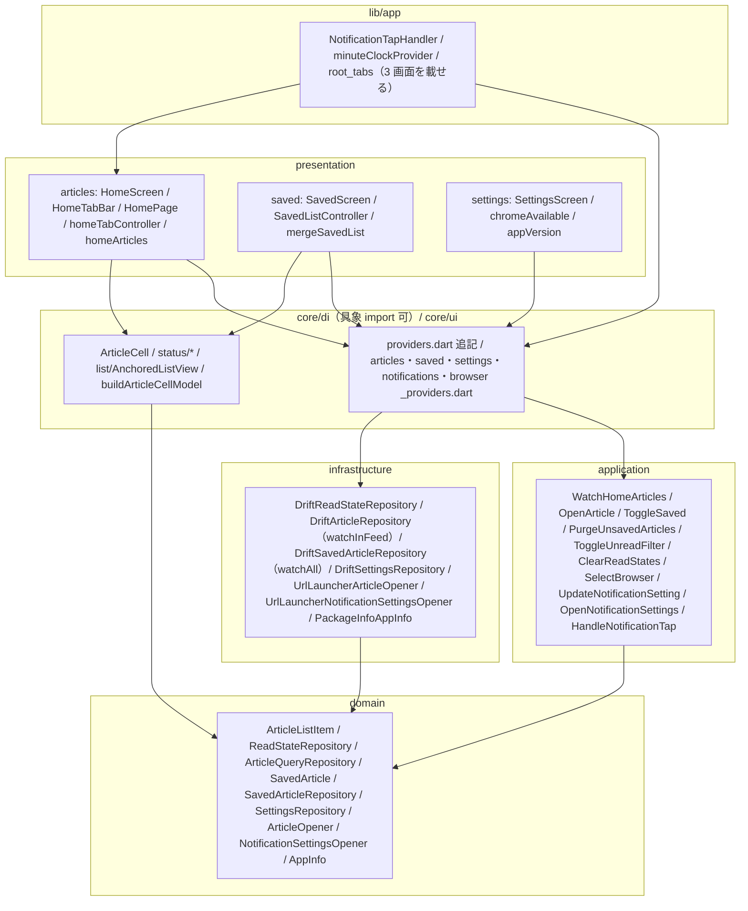
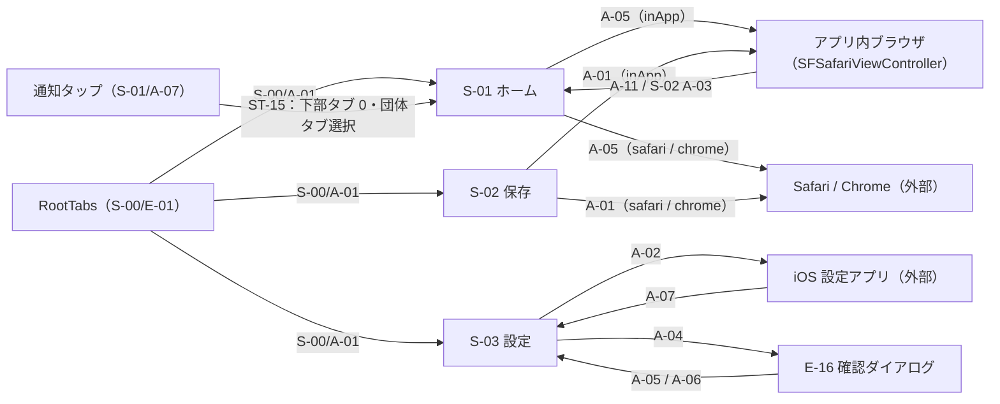

<!--
所有権（画面定義書との乖離を防ぐ）：
  画面定義書 docs/screens/S-xx.md が決める：何が見え、何ができ、どう遷移するか（要素 E-nn・状態 ST-nn・操作 A-nn・表示ルール）
  本書が決める：どう実現するか（UseCase・Provider・Repository・DB・処理手順・状態の判定ロジック）
本書は画面定義書の ID を参照し、内容を転記しない。画面仕様を変えたいときは画面定義書を先に直す（/screen-doc reopen）。
-->

## 1. 目的と範囲

本書は Flutter アプリ（`app/`）の**個別画面の機能**を定める。基盤（配信の取得と反映 `SyncArticlesUseCase`・取得の契機 `SyncController`・S-00 §5.2 の状態判定 `resolveListStatus`・記事セル `ArticleCell`・drift スキーマ・DI の組み立て方）は [D-04](D-04.md) が所有し、本書はそれらを**参照して呼び出す側**を書く。D-04 の決定は転記しない。

**決めること（9 点）**：

1. S-01〜S-03 のすべての操作 A-nn・状態 ST-nn の実現（§2.1）と画面遷移（§3.3）
2. 画面ごとの UseCase 10 個（§5）：`WatchHomeArticlesUseCase`・`OpenArticleUseCase`・`ToggleSavedUseCase`・`PurgeUnsavedArticlesUseCase`・`ToggleUnreadFilterUseCase`・`ClearReadStatesUseCase`・`SelectBrowserUseCase`・`UpdateNotificationSettingUseCase`・`OpenNotificationSettingsUseCase`・`HandleNotificationTapUseCase`
3. D-04 が D-05 所管とした Repository の追加メソッド（`ArticleQueryRepository.watchInFeed()`・`SavedArticleRepository.watchAll()` 等・`SettingsRepository` の browser / unreadFilter）と、`ReadStateRepository`（インターフェースと drift 実装）（§4.2〜§4.5）
4. 記事を開くポート `ArticleOpener`（SFSafariViewController / Safari / Chrome、URL スキーム検証）と `url_launcher` による実装（§4.4・§5.3）
5. 取得の契機 3 種（Pull to Refresh・再試行・通知タップ）の呼び出し方と、E-25 の表示制御（§5.6・§5.7）
6. 保存画面の「解除したセルを残す」（S-02/ST-04）の実現と、配信外の保存記事の削除タイミング（§5.5）
7. 一覧の表示位置の保持（S-01 §7.4「表示位置」・S-02/ST-04）（§5.11）
8. 記事セルの入力 `ArticleCellModel` の組み立てと `now` の供給（§5.12）
9. テスト（§7）とタスク分割（§10。D-04 T-F1 / T-F2a / T-F2b の後に続く T-H〜T-O）

**決めないこと**：

- 配信の取得・反映・100 件保持・同時実行の抑止・通知許可・購読同期（D-04 §5.2〜§5.7）
- 記事セル・状態表示 Widget の見た目（D-04 §5.9）
- collector 側の一切（[D-02](D-02.md)・[D-03](D-03.md)）

## 2. 要件との対応

| 要件 | 本書での扱い | 節 |
|---|---|---|
| F-01 記事一覧表示 | ホーム画面 `HomeScreen`（上部団体タブ `HomeTabBar` + `PageView`）。表示対象は `WatchHomeArticlesUseCase` が `in_feed = true` の記事を団体タブと未読フィルタで絞り `compareArticles` で並べる | §5.1 / §5.2 |
| F-02 記事項目の表示 | D-04 の `ArticleCell` に渡す `ArticleCellModel` を `buildArticleCellModel`（団体名は `companiesProvider` の `shortName`、無ければ `companyId`）で組み立て、`now` は `minuteClockProvider` から渡す | §5.12 |
| F-03 記事を開く | `OpenArticleUseCase`：URL を検証 → ブラウザ設定を読む → `ArticleOpener.open()` → 既読化（`ReadStateRepository.markAsRead`） | §5.3 |
| F-04 ブラウザの選択 | `SettingsRepository.browserChoice()`（既定 `inApp`）と `SelectBrowserUseCase`（Chrome 未インストールなら選べない）。開くときの Chrome → Safari の代替は `OpenArticleUseCase` | §5.3 / §5.9 |
| F-05 既読管理 | 既読化は `OpenArticleUseCase`、未読フィルタは `ToggleUnreadFilterUseCase` + `WatchHomeArticlesUseCase`、一括クリアは `ClearReadStatesUseCase`。列の規則は D-04 §5.5 | §5.2 / §5.3 / §5.8 / §5.10 |
| F-06 保存（あとで読む） | `ToggleSavedUseCase`（S-00/A-11）と保存画面 `SavedScreen`（`SavedArticleRepository.watchAll()` + `SavedListController`）。配信外の保存記事は D-04 の `in_feed = false` 保護で残り、解除が確定した時点で `PurgeUnsavedArticlesUseCase` が削除する | §5.4 / §5.5 |
| F-10 手動更新 | `CupertinoSliverRefreshControl.onRefresh` → `syncControllerProvider.notifier.sync(SyncTrigger.pullToRefresh)` を await | §5.6 |
| F-11 更新記事の再浮上 | 並び順は `compareArticles`（`sortKey = updatedAt ?? publishedAt`）で先頭付近に移る。バッジは `ArticleListItem.hasUpdateBadge` → `resolveReadDisplayState`。差し込み時の表示位置は `AnchoredListView` | §5.2 / §5.11 / §5.12 |
| §7.2 `read_states`・`saved_articles`・`settings` | 本書が読み書きする SQL（§4.5）。テーブル定義は D-04 §4.2 | §4.5 |
| §8 画面構成（3 画面 + アプリ内ブラウザ） | 画面遷移図（§3.3）。アプリ内ブラウザは `url_launcher` の `LaunchMode.inAppBrowserView`（iOS では SFSafariViewController） | §3.3 / §4.4 |
| D-01 §8.1（D-05 宛）更新判定・並び替え | 判定と反映は D-04 §5.2 が持つ（D-04 §8 #1・#30）。本書は `compareArticles` で並べ、`hasUpdateBadge` を表示に写すだけ | §5.2 |
| D-01 §8.1（D-05 宛）団体一覧は同梱アセット由来 | 上部タブ・通知トグルは `companiesProvider`（D-04 §4.5）の配列順。記事側にしか無い `companyId` は「すべて」にだけ出す | §5.1 / §5.9 |
| D-01 §8.1（D-05 宛）§7.3「表示・遷移」のテスト | §7 の `WatchHomeArticlesUseCase`・`HandleNotificationTapUseCase`・`buildArticleCellModel` のケース | §7 |
| D-04 §8.1（D-05 宛 18 項目） | §2.2 で 1 件ずつ引き取る | §2.2 |

### 2.1 画面定義との対応（scope: app のみ）

S-00 は D-04 §2.1 が全 ID を載せている。本書はそのうち**実現の主体が D-05** のものだけを再掲する。

| 画面定義書の ID | 種類 | 本書での実現 | 節 |
|---|---|---|---|
| S-00/A-10 | 操作 | `ArticleCell.onTap` → `OpenArticleUseCase.execute(article, now)` | §5.3 |
| S-00/A-11 | 操作 | `ArticleCell.onToggleSaved` → `ToggleSavedUseCase.execute(id, now)`（保存画面では先に `SavedListController.retain()`） | §5.4 / §5.5 |
| S-00/A-12 | 操作 | `FullErrorView.onRetry` → `sync(SyncTrigger.retry)` | §5.6 |
| S-00/ST-01〜ST-03 | 状態 | `ArticleListItem.isRead` / `hasUpdateBadge` → `resolveReadDisplayState`（D-04 §5.5）→ `ArticleCellModel.readState` | §5.12 |
| S-00/ST-04 | 状態 | `ArticleListItem.isSaved` → `ArticleCellModel.isSaved` | §5.12 |
| S-00/ST-12 | 状態 | `EmptyView` にアイコンと文言を渡す（S-01 §5 ST-04・ST-05、S-02 §5 ST-02 の確定文字列） | §5.1 / §5.5 |
| S-00/ST-15 | 状態 | `syncControllerProvider.sequence` を `ref.listen` し、ホーム表示中のみ `TransientNotice` を出す | §5.6 |

S-01（ホーム）：

| 画面定義書の ID | 種類 | 本書での実現 | 節 |
|---|---|---|---|
| S-01/A-01 | 操作 | `HomeTabBar.onTap(index)` → `homeTabControllerProvider.notifier.select(index)` → `PageController` を非隣接ならワープ（§5.1）で `animateToPage` | §5.1 |
| S-01/A-02 | 操作 | `PageView.onPageChanged` → `select(index)`。端は `BouncingScrollPhysics` のバウンス | §5.1 |
| S-01/A-03 | 操作 | `ToggleUnreadFilterUseCase.execute()` → `unreadFilterProvider` が流れ `homeArticlesProvider` が再構築 → 全ページ先頭へ（`homeScrollToTopProvider.request()`） | §5.8 |
| S-01/A-04 | 操作 | `CupertinoSliverRefreshControl.onRefresh` → `sync(SyncTrigger.pullToRefresh)` を await | §5.6 |
| S-01/A-05 | 操作 | S-00/A-10 と同じ（`OpenArticleUseCase`） | §5.3 |
| S-01/A-06 | 操作 | S-00/A-11 と同じ（`ToggleSavedUseCase`）。ホームは `isSaved` を表示対象の条件にしない（`HomeFilter` に保存の条件が無い） | §5.4 |
| S-01/A-07 | 操作 | `NotificationTapHandler`（`lib/app/`）が `initialNotificationTapProvider`・`notificationTapStreamProvider` を `ref.listen` → `HandleNotificationTapUseCase` | §5.7 |
| S-01/A-08 | 操作 | S-00/A-12 と同じ（`sync(SyncTrigger.retry)`） | §5.6 |
| S-01/A-09 | 操作 | `tabReselectProvider` の index 0 の変化を表示中ページが `ref.listen` → `ScrollController.animateTo(0)` | §5.6 |
| S-01/A-10 | 操作 | `HomeTabBar.onTap(index)` で `index == 選択中` なら `homeScrollToTopProvider.request()` | §5.6 |
| S-01/A-11 | 操作 | 既読化は開いた時点で DB に反映済み（§5.3）。戻ると `homeArticlesProvider` の値でセルが既読表示になり、未読フィルタ ON なら一覧から消える（`AnchoredListView` が位置を保つ） | §5.3 / §5.11 |
| S-01/ST-01 | 状態 | `resolveListStatus(feedStatusProvider(syncsOnLaunch: true), hasVisible)` が `content`。初期タブ index 0、未読フィルタは `settings.unread_filter` | §5.1 |
| S-01/ST-02 | 状態 | 同 `FullView.loading`（D-04 §5.4）。ページ領域全体に `FullLoadingView` | §5.1 |
| S-01/ST-03 | 状態 | 同 `refreshing == true` → `RefreshingHeader`（引っ張り中は `CupertinoSliverRefreshControl` の表示に任せる） | §5.1 / §5.6 |
| S-01/ST-04 | 状態 | `FullView.empty` かつ `HomeArticles.totalInTab == 0` → `EmptyView`（S-01 §5 ST-04 の文言） | §5.1 / §5.2 |
| S-01/ST-05 | 状態 | `FullView.empty` かつ `totalInTab > 0`（未読フィルタ ON で未読 0 件）→ `EmptyView`（S-01 §5 ST-05 の文言） | §5.1 / §5.2 |
| S-01/ST-06 | 状態 | `offlineBanner == true` → `OfflineBanner` を上部タブと `PageView` の間に置く | §5.1 |
| S-01/ST-07 | 状態 | `FullView.offline` → `FullErrorView(kind: offline)` | §5.1 |
| S-01/ST-08 | 状態 | `FullView.error` → `FullErrorView(kind: error)` | §5.1 |
| S-01/ST-09 | 状態 | `errorNotice` の変化を `sequence` で検知 → `TransientNotice`（ホーム表示中のみ） | §5.6 |
| S-01/ST-10 | 状態 | `homeTabControllerProvider`（`keepAlive` の `Notifier<int>`。初期 0。永続化しない） | §5.1 |
| S-01/ST-11・ST-12 | 状態 | `unreadFilterProvider`（`SettingsRepository.watchUnreadFilter()`。行無し = OFF） | §5.8 |
| S-01/ST-13 | 状態 | `PageView` のドラッグ。下線は `PageController.page` の小数部で補間 | §5.1 |
| S-01/ST-14 | 状態 | `CupertinoTabView` が画面を保持（D-04 §5.8）。E-25 は `_isHomeVisible()` が false なら出さない | §5.6 |
| S-01/ST-15 | 状態 | `NotificationTapHandler`：下部タブ 0 → アプリ内ブラウザを閉じる → 団体タブ選択 → 先頭へ → `sync(SyncTrigger.notificationTap)` | §5.7 |
| S-01/ST-16 | 状態 | `ArticleOpener.open(uri, BrowserChoice.inApp)` = `LaunchMode.inAppBrowserView` | §5.3 |
| S-01/ST-17 | 状態 | `homeArticlesProvider` の新しい値を `AnchoredListView` が差し込む（先頭表示中は先頭に、それ以外は表示中の記事を固定） | §5.11 |
| S-01/ST-18 | 状態 | D-04 §5.7（本書は何もしない） | — |

S-02（保存）：

| 画面定義書の ID | 種類 | 本書での実現 | 節 |
|---|---|---|---|
| S-02/A-01 | 操作 | `OpenArticleUseCase`。成功後に `SavedListController.markOpened(id)`（保持中の解除済みセルの既読表示のため） | §5.3 / §5.5 |
| S-02/A-02 | 操作 | `SavedListController.retain(entry)` → `ToggleSavedUseCase.execute(id, now)` | §5.5 |
| S-02/A-03 | 操作 | 戻ったときは `savedListControllerProvider` の値のまま（保持中のセルは消えない） | §5.5 |
| S-02/A-04 | 操作 | `tabReselectProvider` の index 1 の変化を `ref.listen` → `animateTo(0)` | §5.5 |
| S-02/ST-01 | 状態 | `resolveListStatus(feedStatusProvider(syncsOnLaunch: false), hasVisible: entries.isNotEmpty)` が `content` | §5.5 |
| S-02/ST-02 | 状態 | 同 `empty` → `EmptyView`（S-02 §5 ST-02 の文言）。`CupertinoSliverRefreshControl` を置かない | §5.5 |
| S-02/ST-03 | 状態 | S-01/ST-16 と同じ | §5.3 |
| S-02/ST-04 | 状態 | `SavedListController` の `_retained`（解除したセルを元の `saved_at` の位置に `isSaved = false` で残す）。下部タブが 1 から離れたとき破棄し `PurgeUnsavedArticlesUseCase` を呼ぶ | §5.5 |
| S-02/ST-05 | 状態 | `watchAll()` が drift の Stream なので、ホームの取得で `articles` が更新されれば自動で再発火する。並び順キーは `saved_at` のみ | §5.5 |

S-03（設定）：

| 画面定義書の ID | 種類 | 本書での実現 | 節 |
|---|---|---|---|
| S-03/A-01 | 操作 | `UpdateNotificationSettingUseCase.execute(companyId, enabled)`（設定保存 → `PushSubscriptionCoordinator.run()`） | §5.9 |
| S-03/A-02 | 操作 | `OpenNotificationSettingsUseCase.execute()`（`app-settings:` を開く） | §5.9 |
| S-03/A-03 | 操作 | `SelectBrowserUseCase.execute(choice)` | §5.9 |
| S-03/A-04 | 操作 | `showCupertinoDialog`（E-16） | §5.10 |
| S-03/A-05 | 操作 | ダイアログを閉じるだけ | §5.10 |
| S-03/A-06 | 操作 | `ClearReadStatesUseCase.execute()` | §5.10 |
| S-03/A-07 | 操作 | D-04 `AppLifecycleSync` が `pushPermissionStatusProvider` を invalidate。本書は `SettingsScreen` が `resumed` で `chromeAvailableProvider` も invalidate する | §5.9 |
| S-03/ST-01 | 状態 | `notificationSettingsProvider`・`browserChoiceProvider`・`appVersionProvider` の値を同期的に描く（`AsyncLoading` の間は既定値） | §5.9 |
| S-03/ST-02 | 状態 | `notificationSettingsProvider`（`Map<String, bool>`。キー無し = ON） | §5.9 |
| S-03/ST-03 | 状態 | `pushPermissionStatusProvider` が `authorized` 以外 → E-09 行を出す | §5.9 |
| S-03/ST-04 | 状態 | `browserChoiceProvider`（行無し = `inApp`） | §5.9 |
| S-03/ST-05 | 状態 | `chromeAvailableProvider == false` → E-13 を非活性表示。開くときの代替は `OpenArticleUseCase` 手順 3 | §5.9 / §5.3 |
| S-03/ST-06 | 状態 | ダイアログ表示中（`showCupertinoDialog` の Future が未完了） | §5.10 |
| S-03/ST-07 | 状態 | `SettingsScreen` の `_clearing = true`（`ClearReadStatesUseCase` の await 中） | §5.10 |
| S-03/ST-08 | 状態 | `_clearing = false` に戻す。完了表示は出さない | §5.10 |
| S-03/ST-09 | 状態 | 何もしない（`syncControllerProvider` を `ref.listen` しない） | §5.9 |

### 2.2 D-04 §8.1 の申し送り（D-05 宛）の引き取り

| # | D-04 の申し送り（要旨） | 本書での引き取り | 節 |
|---|---|---|---|
| 1 | `pullToRefresh` / `retry` / `notificationTap` は `syncControllerProvider.notifier.sync()` を呼ぶ | そのとおり。Pull to Refresh は await | §5.6 / §5.7 |
| 2 | `resolveListStatus` を使い再実装しない。E-25 は `sequence` を listen しホーム表示中のみ | §5.1・§5.6 | §5.1 / §5.6 |
| 3 | ホームは `in_feed = true`、保存は全保存記事。`watchInFeed()` は `ArticleQueryRepository` に足す | §4.2 | §4.2 |
| 4 | 開く = `read_states` upsert + バッジ消去、一括クリア = 全行削除 + 全バッジ false（1 トランザクション）。`ReadStateRepository` を追加 | §4.2・§4.5 | §4.2 / §4.5 |
| 5 | 解除後 `in_feed = false` なら `articles` の行を削除。`watchAll()` は `saved_at` 降順 → `id` 昇順 | 削除は S-02 §7.3「ST-04 の後に」に合わせ解除が確定した時点（保存画面を離れたとき）に `PurgeUnsavedArticlesUseCase` で行う（§8 #5） | §5.5 / §8 |
| 6 | 通知トグルは `setNotificationEnabled` の後に `pushSubscriptionCoordinatorProvider.run()`。例外は catch して `logger.w`。ST-03 は `pushPermissionStatusProvider` | `UpdateNotificationSettingUseCase` | §5.9 |
| 7 | 通知タップは 2 つの Provider を listen。未知・null は「すべて」。タブは `tabControllerProvider` | `NotificationTapHandler` + `HandleNotificationTapUseCase` | §5.7 |
| 8 | `ArticleCellModel` の `companyLabel` / `readState` / `now` | `buildArticleCellModel`・`minuteClockProvider` | §5.12 |
| 9 | 下部タブ再タップは `tabReselectProvider` を listen | ホーム・保存の各一覧 | §5.6 / §5.5 |
| 10 | `SettingsRepository` に browser / unreadFilter の get・set・watch。`feed_*` は足さない | §4.3 | §4.3 |
| 11 | presentation が直接 watch してよいのは素の Stream だけ | §4.6 の規則 | §4.6 |
| 12 | `feedStatusProvider(syncsOnLaunch:)` はホーム true・保存 false。保存は `sequence` を listen しない | §5.1・§5.5 | §5.1 / §5.5 |
| 13 | `unsupportedSchema` は他の失敗と同じ表示。`suppressed` のときの E-25 は S-00 が定めるまで出す | §5.6（`suppressed` で分岐しない） | §5.6 / §8 #12 |
| 14 | `staleDiscarded` は表示に使わない | `SyncSucceeded` は種別を問わず成功扱い | §5.6 |
| 15 | `syncCoordinatorProvider.run()` を直接呼ばない | 本書の presentation は `syncCoordinatorProvider` を import しない | §4.6 |
| 16 | トグル後の結果は `PushSubscriptionCoordinator.lastResult` に入る。D-05 は保持・表示しない | `UpdateNotificationSettingUseCase` は結果を返さない（`Future<void>`） | §5.9 |
| 17 | D-01 §7.3「表示・遷移」のテストを持つ | §7 | §7 |
| 18 | 追加パッケージは D-05 が決める | `url_launcher`・`package_info_plus`（§4.7） | §4.7 |

## 3. 構成

### 3.1 層と依存の方向

D-04 §3.1 の方向（presentation / app → application → domain、infrastructure → domain）をそのまま守る。本書で増える feature 間の依存は次の表だけ。`articles` は引き続き他の feature を import しない（`HomeScreen` は他 feature の型を名指しせず、`core/di` の Provider を通して UseCase の `execute` と `Stream<bool>`・`List<Company>` の値だけを受け取る。§8 #9）。feature の presentation が他 feature の presentation を import しない規則（CLAUDE.md）を守るため、**複数の feature が使う素の Stream / Future の Provider は `core/di/` の feature 別ファイルに置く**（§4.6）。

| 依存元 | 依存先 | 理由 |
|---|---|---|
| `browser/application`（§8 #8） | `articles/domain`（`Article`・`ReadStateRepository`）、`settings/domain`（`BrowserChoice`・`SettingsRepository`）、`browser/domain`（`ArticleOpener`） | 記事を開いて既読にする。ブラウザ設定を読む |
| `saved/domain`（`SavedArticle`） | `articles/domain`（`ArticleListItem`） | 保存一覧のセルも同じ `ArticleListItem` |
| `notifications/application`（`HandleNotificationTapUseCase`・`UpdateNotificationSettingUseCase`） | `browser/domain`（`ArticleOpener.closeInAppBrowser`）、`settings/domain`、同 feature の `PushSubscriptionCoordinator` | S-01/ST-15 でアプリ内ブラウザを閉じる。トグル後の購読同期 |
| `lib/app/notification_tap_handler.dart` | `notifications/presentation`（D-04 の `notification_tap_providers.dart`）、`articles/presentation`（`homeTabControllerProvider` 等）、`core/di` | 通知タップの配線は feature に属さない（D-04 の `AppLifecycleSync` と同じ置き場。§8 #10） |
| `settings/presentation` | `notifications/presentation/notification_tap_providers.dart`（`pushPermissionStatusProvider`。D-04 §8.1 の指示） | S-03/ST-03。D-04 が置き場を決めた Provider 専用ファイルであり、Widget を含まない（§8 #10） |
| `core/ui/list`（`AnchoredListView`）、`core/ui/article/article_cell_model_builder.dart` | Flutter SDK、`articles/domain` のみ | ホームと保存の両方が使う共通部品（D-04 §8 #34 と同じ理由） |



### 3.2 ファイル配置

D-04 §3.2 に**追加**するもの（既存ファイルの改修は「改修」と明記）。`features/browser/` の新設は §8 #8（開発者確認済み 2026-09-20）。

```
app/
  pubspec.yaml                  改修：url_launcher・package_info_plus を追加（§4.7）
  ios/Runner/Info.plist         改修：LSApplicationQueriesSchemes に googlechrome / googlechromes（§4.7）
  lib/
    app/
      root_tabs.dart            改修：3 つの CupertinoTabView に HomeScreen / SavedScreen / SettingsScreen を載せる
      notification_tap_handler.dart   S-01/A-07・ST-15 の配線（§5.7）。AppLifecycleSync の子、RootTabs の親
      minute_clock.dart         minuteClockProvider（E-14 の now。1 分ごと。§5.12）
    core/
      di/
        providers.dart          改修：readStateRepository・articleOpener・notificationSettingsOpener・appInfo・companyShortNames を追加（§4.6）
        articles_providers.dart 改修：watchHomeArticlesUseCase・clearReadStatesUseCase を追加
        saved_providers.dart    toggleSavedUseCase・purgeUnsavedArticlesUseCase
        settings_providers.dart unreadFilterProvider・toggleUnreadFilterUseCase
        notifications_providers.dart  改修：updateNotificationSettingUseCase・openNotificationSettingsUseCase・handleNotificationTapUseCase を追加
        browser_providers.dart  openArticleUseCase・selectBrowserUseCase
      ui/
        article/
          article_cell_model_builder.dart   buildArticleCellModel（純粋関数。§5.12・§7）
        list/
          anchored_list_view.dart           表示位置を保つ一覧（§5.11）
    features/
      articles/
        domain/
          article_list_item.dart            ArticleListItem（§4.1）
          read_state_repository.dart        ReadStateRepository（§4.2）
          article_query_repository.dart     改修：watchInFeed() を追加
        application/
          watch_home_articles_use_case.dart HomeFilter・HomeArticles・WatchHomeArticlesUseCase（§5.2）
          clear_read_states_use_case.dart   §5.10
        infrastructure/
          drift_read_state_repository.dart  §4.5
          drift_article_repository.dart     改修：watchInFeed() の実装
        presentation/
          home_screen.dart                  S-01/E-01〜E-03・E-10（ナビゲーションバー・未読フィルタ・上部タブ・PageView・帯・全面表示）
          home_tab_bar.dart                 S-01/E-03〜E-09（下線・横スクロール）
          home_page.dart                    S-01/E-11 の 1 ページ（AnchoredListView + 引っ張り更新 + 空表示）
          home_providers.dart               homeTabControllerProvider・homeScrollToTopProvider・homeArticlesProvider（§4.6）
      saved/
        domain/
          saved_article.dart                SavedArticle・compareSavedArticles（§4.1）
          saved_article_repository.dart     改修：isSaved()・watchAll()・deleteUnsavedOutOfFeed() を追加
        application/
          toggle_saved_use_case.dart        §5.4
          purge_unsaved_articles_use_case.dart  §5.5
        infrastructure/
          drift_saved_article_repository.dart   改修
        presentation/
          saved_screen.dart                 S-02/E-01・E-02
          saved_list_controller.dart        SavedListController・savedArticlesProvider（§5.5）
          saved_list_merge.dart             mergeSavedList（純粋関数。§5.5・§7）
      settings/
        domain/
          settings_repository.dart          改修：browser / unreadFilter / watchNotificationSettings を追加（§4.3）
          app_info.dart                     AppInfo ポート・AppVersion（§4.4）
        application/
          toggle_unread_filter_use_case.dart  §5.8
        infrastructure/
          drift_settings_repository.dart    改修
          package_info_app_info.dart        package_info_plus
        presentation/
          settings_screen.dart              S-03 の 4 セクション（§5.9・§5.10）
          settings_providers.dart           browserChoiceProvider・notificationSettingsProvider・chromeAvailableProvider・appVersionProvider
      notifications/
        domain/
          notification_settings_opener.dart NotificationSettingsOpener ポート（§4.4）
        application/
          update_notification_setting_use_case.dart   §5.9
          open_notification_settings_use_case.dart    §5.9
          handle_notification_tap_use_case.dart       §5.7
        infrastructure/
          url_launcher_notification_settings_opener.dart
      browser/                              §8 #8（新 feature）
        domain/
          article_opener.dart               ArticleOpener ポート（§4.4）
        application/
          open_article_use_case.dart        OpenArticleResult・OpenArticleUseCase（§5.3）
          select_browser_use_case.dart      SelectBrowserResult・SelectBrowserUseCase（§5.9）
        infrastructure/
          url_launcher_article_opener.dart  §4.4
  test/
    helpers/
      fake_article_opener.dart              ArticleOpener のフェイク（呼び出し記録・Chrome 有無・open の戻り値）
      fake_notification_settings_opener.dart
      seed_articles.dart                    in-memory drift に記事・既読・保存を投入するヘルパ（ArticleSyncRepository.applyFeed 経由）
    core/ui/article/
      article_cell_model_builder_test.dart  純粋関数の直接テスト（§7）
    features/
      articles/application/watch_home_articles_use_case_test.dart
      articles/application/clear_read_states_use_case_test.dart
      saved/application/toggle_saved_use_case_test.dart
      saved/application/purge_unsaved_articles_use_case_test.dart
      saved/presentation/saved_list_merge_test.dart     純粋関数の直接テスト（§7）
      settings/application/toggle_unread_filter_use_case_test.dart
      notifications/application/update_notification_setting_use_case_test.dart
      notifications/application/open_notification_settings_use_case_test.dart
      notifications/application/handle_notification_tap_use_case_test.dart
      browser/application/open_article_use_case_test.dart
      browser/application/select_browser_use_case_test.dart
```

### 3.3 画面遷移



## 4. データ

### 4.1 一覧の要素型（domain）

```dart
// lib/features/articles/domain/article_list_item.dart
/// 一覧に出す 1 記事分（Article + 端末内の状態）。watchInFeed() / watchAll() が流す。不変。== / hashCode は 4 フィールド
final class ArticleListItem {
  const ArticleListItem({required this.article, required this.isRead, required this.hasUpdateBadge, required this.isSaved});
  final Article article;
  final bool isRead;            // read_states に行がある（S-00/ST-02）
  final bool hasUpdateBadge;    // articles.has_update_badge（S-00/ST-03。D-04 §5.5）
  final bool isSaved;           // saved_articles に行がある（S-00/ST-04）
  ArticleListItem copyWith({bool? isRead, bool? hasUpdateBadge, bool? isSaved});
}
```

```dart
// lib/features/articles/application/watch_home_articles_use_case.dart
/// ホームの絞り込み条件（S-01 §7.2・§7.3）
final class HomeFilter {
  const HomeFilter({required this.companyId, required this.unreadOnly});
  final String? companyId;      // null = 「すべて」（S-01/E-04）
  final bool unreadOnly;        // S-01/ST-11
}

/// ホーム 1 ページ分の表示対象
final class HomeArticles {
  const HomeArticles({required this.items, required this.totalInTab});
  final List<ArticleListItem> items;   // 絞り込み後、compareArticles 順
  final int totalInTab;                // 未読フィルタで絞る前のタブ内件数（S-01/ST-04 と ST-05 の区別に使う）
}
```

```dart
// lib/features/saved/domain/saved_article.dart
final class SavedArticle {
  const SavedArticle({required this.item, required this.savedAt});
  final ArticleListItem item;
  final DateTime savedAt;       // saved_articles.saved_at（UTC）
}

/// S-02 §7.1：saved_at 降順 → id 昇順
int compareSavedArticles(SavedArticle a, SavedArticle b) {
  final bySaved = b.savedAt.compareTo(a.savedAt);
  if (bySaved != 0) return bySaved;
  return a.item.article.id.compareTo(b.item.article.id);
}
```

```dart
// lib/features/browser/application/open_article_use_case.dart
sealed class OpenArticleResult { const OpenArticleResult(); }
/// 起動できた。markedAsRead = false は起動後の既読化（DB 書き込み）だけが失敗した
final class ArticleOpened extends OpenArticleResult {
  const ArticleOpened({required this.browser, required this.markedAsRead});
  final BrowserChoice browser;      // 実際に使ったブラウザ（chrome → safari の代替後の値）
  final bool markedAsRead;
}
enum OpenFailure { invalidUrl, launchFailed }
/// 開けなかった。既読にしていない
final class ArticleNotOpened extends OpenArticleResult {
  const ArticleNotOpened(this.reason);
  final OpenFailure reason;
}

// lib/features/browser/application/select_browser_use_case.dart
enum SelectBrowserResult { applied, rejectedChromeUnavailable }

// lib/features/settings/domain/app_info.dart
final class AppVersion {
  const AppVersion({required this.version, required this.buildNumber});
  final String version;        // CFBundleShortVersionString
  final String buildNumber;    // CFBundleVersion
}
```

### 4.2 記事・既読・保存の Repository（追加分）

D-04 §4.4 のインターフェースに次を**追加**する。`ArticleSyncRepository` には足さない（D-04 §8 #42）。

```dart
// lib/features/articles/domain/article_query_repository.dart（D-04 に追加）
abstract interface class ArticleQueryRepository {
  Stream<int> watchCount();                        // D-04
  /// in_feed = true の記事を read_states / saved_articles と結合して流す（S-01 §8 #10）。順序は未定義（UseCase が並べる）
  Stream<List<ArticleListItem>> watchInFeed();
}

// lib/features/articles/domain/read_state_repository.dart
abstract interface class ReadStateRepository {
  /// read_states を upsert（read_at = readAt）し、同じトランザクションで articles.has_update_badge = false（D-04 §5.5）。
  /// articles に行が無ければ（開いた直後の同期で削除された）何もせず正常終了する
  Future<void> markAsRead(String articleId, {required DateTime readAt});
  /// read_states の全行削除と articles.has_update_badge の全行 false を 1 トランザクションで行う（S-03/A-06、S-00 §8 #22）
  Future<void> clearAll();
}

// lib/features/saved/domain/saved_article_repository.dart（D-04 に追加）
abstract interface class SavedArticleRepository {
  Future<void> save(String articleId, {required DateTime savedAt});   // D-04
  Future<void> remove(String articleId);                              // D-04
  Future<bool> isSaved(String articleId);
  /// 保存済みの記事全件（in_feed を問わない。S-02 §7.2・§7.3）。saved_at 降順 → id 昇順
  Stream<List<SavedArticle>> watchAll();
  /// in_feed = false かつ saved_articles に無い articles の行を削除し、件数を返す（S-02 §7.3「解除したとき」。§5.5）
  Future<int> deleteUnsavedOutOfFeed();
}
```

### 4.3 SettingsRepository（追加分）

```dart
// lib/features/settings/domain/settings_repository.dart（D-04 に追加）
abstract interface class SettingsRepository {
  Future<Map<String, bool>> notificationSettings();                       // D-04
  Future<void> setNotificationEnabled(String companyId, {required bool enabled});   // D-04
  /// notification.* の変化を流す（S-03/ST-02 の表示）。値の規則は notificationSettings() と同じ
  Stream<Map<String, bool>> watchNotificationSettings();
  /// SettingKeys.browser。行無し・未知の値は BrowserChoice.inApp（F-04）
  Future<BrowserChoice> browserChoice();
  Stream<BrowserChoice> watchBrowserChoice();
  Future<void> setBrowserChoice(BrowserChoice choice);
  /// SettingKeys.unreadFilter。行無し・'1' 以外は false（S-01 §8 #19）
  Future<bool> unreadFilter();
  Stream<bool> watchUnreadFilter();
  Future<void> setUnreadFilter({required bool enabled});   // '1' / '0' を upsert
}
```

`feed_etag`・`feed_generated_at`・`feed_unsupported_schema` の get / set は追加しない（D-04 §8.1）。

### 4.4 ポート（外部境界）

```dart
// lib/features/browser/domain/article_opener.dart
/// 記事 URL を開く外部境界。実装は url_launcher（§4.7）
abstract interface class ArticleOpener {
  /// Chrome が起動できるか（googlechromes:// を canLaunchUrl。S-03/ST-05）
  Future<bool> isChromeAvailable();
  /// [browser] で [url] を開く。true = OS に起動を渡せた。例外は投げず false を返す（PlatformException を含む）
  Future<bool> open(Uri url, BrowserChoice browser);
  /// 表示中のアプリ内ブラウザ（SFSafariViewController）を閉じる。表示していなければ何もしない（S-01/ST-15）
  Future<void> closeInAppBrowser();
}

// lib/features/notifications/domain/notification_settings_opener.dart
abstract interface class NotificationSettingsOpener {
  /// iOS 設定アプリの本アプリのページを開く（app-settings:）。true = 起動を渡せた。例外は投げない
  Future<bool> openAppSettings();
}

// lib/features/settings/domain/app_info.dart
abstract interface class AppInfo {
  Future<AppVersion> load();
}
```

`UrlLauncherArticleOpener`（`browser/infrastructure/url_launcher_article_opener.dart`）の規則：

| `BrowserChoice` | 呼び出し |
|---|---|
| `inApp` | `launchUrl(url, mode: LaunchMode.inAppBrowserView)`（iOS では SFSafariViewController。F-03） |
| `safari` | `launchUrl(url, mode: LaunchMode.externalApplication)` |
| `chrome` | `launchUrl(url.replace(scheme: url.scheme == 'https' ? 'googlechromes' : 'googlechrome'), mode: LaunchMode.externalApplication)`。呼び出し側（`OpenArticleUseCase` 手順 3）が `isChromeAvailable()` を先に確認しているため、ここでは再確認しない |
| `isChromeAvailable()` | `canLaunchUrl(Uri.parse('googlechromes://'))`。`Info.plist` の `LSApplicationQueriesSchemes` に `googlechrome`・`googlechromes` が無いと常に false になる（§4.7） |
| `closeInAppBrowser()` | `closeInAppWebView()`（url_launcher_ios は SFSafariViewController を dismiss する）。例外は捕捉して無視 |
| 例外 | `launchUrl` が投げた `PlatformException` 等は捕捉し `false` を返す（`logger.w`。URL は出してよい。本文は無い） |

`UrlLauncherNotificationSettingsOpener`：`launchUrl(Uri.parse('app-settings:'), mode: LaunchMode.externalApplication)`。`canLaunchUrl` は呼ばない（`app-settings:` は `LSApplicationQueriesSchemes` に載せられない）。`PackageInfoAppInfo`：`PackageInfo.fromPlatform()` の `version`・`buildNumber` を `AppVersion` に写す。

### 4.5 drift の実装（本書所管の SQL）

| メソッド | SQL / 手順 |
|---|---|
| `DriftArticleRepository.watchInFeed()` | `SELECT a.*, r.article_id IS NOT NULL AS is_read, s.article_id IS NOT NULL AS is_saved FROM articles a LEFT JOIN read_states r ON r.article_id = a.id LEFT JOIN saved_articles s ON s.article_id = a.id WHERE a.in_feed = 1` を drift の `watch()` で流す（3 テーブルのいずれかの変更で再発火）。`hasUpdateBadge` は `a.has_update_badge` |
| `DriftReadStateRepository.markAsRead(id, readAt)` | `transaction`：`SELECT 1 FROM articles WHERE id = ?` が無ければ何もしない → `INSERT OR REPLACE INTO read_states (article_id, read_at) VALUES (?, ?)` → `UPDATE articles SET has_update_badge = 0 WHERE id = ?` |
| `DriftReadStateRepository.clearAll()` | `transaction`：`DELETE FROM read_states` → `UPDATE articles SET has_update_badge = 0` |
| `DriftSavedArticleRepository.isSaved(id)` | `SELECT 1 FROM saved_articles WHERE article_id = ?` |
| `DriftSavedArticleRepository.watchAll()` | `SELECT a.*, s.saved_at, r.article_id IS NOT NULL AS is_read FROM saved_articles s JOIN articles a ON a.id = s.article_id LEFT JOIN read_states r ON r.article_id = a.id ORDER BY s.saved_at DESC, a.id ASC` を `watch()`。`isSaved` は常に true。`saved_at` は UTC の ISO8601 テキスト（D-04 §8 #4）なので文字列順 = 時系列 |
| `DriftSavedArticleRepository.deleteUnsavedOutOfFeed()` | `DELETE FROM articles WHERE in_feed = 0 AND id NOT IN (SELECT article_id FROM saved_articles)`（D-04 §5.2 手順 8-5 と同じ述語。`read_states` は cascade） |
| `DriftSettingsRepository.watch*()` | `settings` テーブルの該当キーの行を `watchSingleOrNull()` し、既定値の補完（行無し → 既定）は Repository 実装で行う（D-04 §4.2「既定値は読み手が補う」） |
| `DriftSettingsRepository.watchNotificationSettings()` | `key LIKE 'notification.%'` の行を `watch()` し `companyId → value == '1'` の Map に写す |

### 4.6 Provider（`core/di/` と各 presentation）

D-04 §4.7 の規則（Repository 1 つ・UseCase 1 つに Provider 1 つ、すべて `keepAlive`、presentation は UseCase を `ref.read` して呼ぶ）に従う。追加の規則：

| 規則 | 内容 |
|---|---|
| Repository・ポートの Provider | `core/di/providers.dart` に追記（D-04 §4.7 の表と同じ置き場）。T-H1・T-H2 が順に編集する（§10） |
| UseCase の Provider | feature 別ファイル（D-04 §8 #45）。新設は `saved_providers.dart`・`settings_providers.dart`・`browser_providers.dart` |
| 素の Stream / Future の Provider | **自 feature だけが使う**ものは自 feature の `presentation/` に置く（D-04 の `articleCountProvider` と同じ）。**他 feature の presentation も使う**ものは `core/di/<feature>_providers.dart` に置く（presentation 間 import を作らない。§8 #9）。本書では `unreadFilterProvider`（ホームが使う）だけが後者 |
| `syncCoordinatorProvider` | 本書の presentation は import しない。取得は必ず `syncControllerProvider.notifier.sync()`（D-04 §4.7） |
| 書き込み系 UseCase の失敗 | presentation は `on Object catch (e, s)` で受けて `logger.w` に残し、画面には出さない（対応する ST が無い。§6） |

```dart
// lib/core/di/providers.dart（追記）
@Riverpod(keepAlive: true)
ReadStateRepository readStateRepository(Ref ref) => DriftReadStateRepository(ref.watch(appDatabaseProvider));

@Riverpod(keepAlive: true)
ArticleOpener articleOpener(Ref ref) => UrlLauncherArticleOpener(logger: ref.watch(loggerProvider));

@Riverpod(keepAlive: true)
NotificationSettingsOpener notificationSettingsOpener(Ref ref) =>
    UrlLauncherNotificationSettingsOpener(logger: ref.watch(loggerProvider));

@Riverpod(keepAlive: true)
AppInfo appInfo(Ref ref) => PackageInfoAppInfo();

/// companyId → shortName（S-00 §7.1）。companiesProvider から 1 度だけ作る
@Riverpod(keepAlive: true)
Map<String, String> companyShortNames(Ref ref) =>
    {for (final c in ref.watch(companiesProvider)) c.id: c.shortName};
```

```dart
// lib/core/di/articles_providers.dart（追記）
@Riverpod(keepAlive: true)
WatchHomeArticlesUseCase watchHomeArticlesUseCase(Ref ref) =>
    WatchHomeArticlesUseCase(ref.watch(articleQueryRepositoryProvider));

@Riverpod(keepAlive: true)
ClearReadStatesUseCase clearReadStatesUseCase(Ref ref) =>
    ClearReadStatesUseCase(ref.watch(readStateRepositoryProvider));
```

```dart
// lib/core/di/saved_providers.dart
@Riverpod(keepAlive: true)
ToggleSavedUseCase toggleSavedUseCase(Ref ref) => ToggleSavedUseCase(ref.watch(savedArticleRepositoryProvider));

@Riverpod(keepAlive: true)
PurgeUnsavedArticlesUseCase purgeUnsavedArticlesUseCase(Ref ref) =>
    PurgeUnsavedArticlesUseCase(ref.watch(savedArticleRepositoryProvider));
```

```dart
// lib/core/di/settings_providers.dart
/// ホーム（articles/presentation）と設定の両方が使うため core/di に置く（§8 #9）
@Riverpod(keepAlive: true)
Stream<bool> unreadFilter(Ref ref) => ref.watch(settingsRepositoryProvider).watchUnreadFilter();

@Riverpod(keepAlive: true)
ToggleUnreadFilterUseCase toggleUnreadFilterUseCase(Ref ref) =>
    ToggleUnreadFilterUseCase(ref.watch(settingsRepositoryProvider));
```

```dart
// lib/core/di/notifications_providers.dart（追記）
@Riverpod(keepAlive: true)
UpdateNotificationSettingUseCase updateNotificationSettingUseCase(Ref ref) => UpdateNotificationSettingUseCase(
      settings: ref.watch(settingsRepositoryProvider),
      syncSubscriptions: ref.watch(pushSubscriptionCoordinatorProvider).run,   // 関数型で受ける（D-04 §8 #33 と同じ）
    );

@Riverpod(keepAlive: true)
OpenNotificationSettingsUseCase openNotificationSettingsUseCase(Ref ref) =>
    OpenNotificationSettingsUseCase(ref.watch(notificationSettingsOpenerProvider));

@Riverpod(keepAlive: true)
HandleNotificationTapUseCase handleNotificationTapUseCase(Ref ref) =>
    HandleNotificationTapUseCase(opener: ref.watch(articleOpenerProvider));
```

```dart
// lib/core/di/browser_providers.dart
@Riverpod(keepAlive: true)
OpenArticleUseCase openArticleUseCase(Ref ref) => OpenArticleUseCase(
      settings: ref.watch(settingsRepositoryProvider),
      readStates: ref.watch(readStateRepositoryProvider),
      opener: ref.watch(articleOpenerProvider),
    );

@Riverpod(keepAlive: true)
SelectBrowserUseCase selectBrowserUseCase(Ref ref) => SelectBrowserUseCase(
      settings: ref.watch(settingsRepositoryProvider),
      opener: ref.watch(articleOpenerProvider),
    );
```

presentation 側の Provider：

```dart
// lib/features/articles/presentation/home_providers.dart
/// 選択中の団体タブ（S-01/ST-10）。0 = すべて、n = companiesProvider[n-1]。起動時 0（S-01 §8 #3）。永続化しない
@Riverpod(keepAlive: true)
class HomeTabController extends _$HomeTabController {
  @override
  int build() => 0;
  void select(int index) => state = index;
  /// companyId が companiesProvider に無い・null なら 0（S-01 §8 #15）
  void selectCompany(String? companyId) {
    final i = ref.read(companiesProvider).indexWhere((c) => c.id == companyId);
    state = i < 0 ? 0 : i + 1;
  }
}

/// 表示中ページを先頭へスクロールする要求（S-01/A-03・A-10、ST-15）。値の変化を HomePage が listen する
@Riverpod(keepAlive: true)
class HomeScrollToTop extends _$HomeScrollToTop {
  @override
  int build() => 0;
  void request() => state = state + 1;
}

/// タブ 1 ページ分の表示対象。未読フィルタの値が届くまでは AsyncLoading（前回終了時の状態で開く。S-01/ST-01）
@Riverpod(keepAlive: true)
Stream<HomeArticles> homeArticles(Ref ref, {required String? companyId}) async* {
  final unreadOnly = await ref.watch(unreadFilterProvider.future);
  yield* ref.watch(watchHomeArticlesUseCaseProvider).execute(HomeFilter(companyId: companyId, unreadOnly: unreadOnly));
}
```

```dart
// lib/features/saved/presentation/saved_list_controller.dart
@Riverpod(keepAlive: true)
Stream<List<SavedArticle>> savedArticles(Ref ref) => ref.watch(savedArticleRepositoryProvider).watchAll();

// lib/features/settings/presentation/settings_providers.dart
@Riverpod(keepAlive: true)
Stream<BrowserChoice> browserChoice(Ref ref) => ref.watch(settingsRepositoryProvider).watchBrowserChoice();

@Riverpod(keepAlive: true)
Stream<Map<String, bool>> notificationSettings(Ref ref) => ref.watch(settingsRepositoryProvider).watchNotificationSettings();

/// S-03/ST-05。SettingsScreen が resumed で invalidate する（§5.9）
@Riverpod(keepAlive: true)
Future<bool> chromeAvailable(Ref ref) => ref.watch(articleOpenerProvider).isChromeAvailable();

@Riverpod(keepAlive: true)
Future<AppVersion> appVersion(Ref ref) => ref.watch(appInfoProvider).load();

// lib/app/minute_clock.dart
/// E-14 の now（S-00 §7.3「日付が変わった時点で表示も変わる」）。購読直後に DateTime.now() を流し、以後は毎分 0 秒に流す
@Riverpod(keepAlive: true)
Stream<DateTime> minuteClock(Ref ref);
```

### 4.7 パッケージと iOS 設定

```yaml
# app/pubspec.yaml（D-04 §4.8 に追加）
dependencies:
  url_launcher: ^6.3.0          # F-03 / F-04。アプリ内（SFSafariViewController）・Safari・Chrome・app-settings:
  package_info_plus: ^8.0.0     # S-03/E-18
```

```xml
<!-- app/ios/Runner/Info.plist に追加（Chrome の canLaunchUrl 用。S-03/ST-05） -->
<key>LSApplicationQueriesSchemes</key>
<array>
  <string>googlechrome</string>
  <string>googlechromes</string>
</array>
```

バージョンは執筆時点の下限で、実装時に `flutter pub add` が解決した版を採る（D-04 §4.8 と同じ）。

## 5. 処理フロー（正常系）

### 5.1 ホーム画面（S-01）の構成と状態

`HomeScreen`（`ConsumerStatefulWidget`）の構成：

| 要素 | 実現 |
|---|---|
| S-01/E-01・E-02 | `CupertinoNavigationBar`（タイトルは S-01/E-01）。`trailing` に未読フィルタボタン（アイコン `CupertinoIcons.line_horizontal_3_decrease_circle` / `_fill`。ON は `unreadFilterProvider == true`。`Semantics` は S-01/E-02）→ A-03 |
| S-01/E-03〜E-09 | `HomeTabBar`：`companiesProvider` の配列順で「すべて」+ `shortName` のタブ（S-01 §7.6）。`SingleChildScrollView(horizontal)` + `Row`。下線は `PageController.page` の値で位置を補間（ST-13）。選択中タブが見える位置へ `Scrollable.ensureVisible` |
| S-00/E-23 | `status.offlineBanner` のとき `OfflineBanner` を `HomeTabBar` と `PageView` の間に置く（全ページ共通。S-01 §8 #7） |
| S-01/E-10 | `PageView.builder(controller: PageController(initialPage: 0), physics: BouncingScrollPhysics)`。ページ数 = 1 + companies。`onPageChanged` → `homeTabControllerProvider.notifier.select(i)`（A-02） |
| 全面表示 | `status.full != FullView.content` かつ `!= empty` のときは `PageView` の代わりに `FullLoadingView` / `FullErrorView(kind, onRetry)` をページ領域全体に出す（S-01 §8 #13。上部タブは表示したまま） |
| S-01/E-11 | `HomePage(companyId)`（`AutomaticKeepAliveClientMixin`。6 ページを生かしてスクロール位置を保つ。S-01/A-01「前回そのページを見ていた位置」） |

タブのタップ（A-01）：`select(index)` → `index` が現在の隣なら `animateToPage`。隣でなければ Material `TabBarView` と同じワープ（アニメーションの間だけ目的ページを現在ページの隣に並べ替えて `animateToPage` し、完了後に並びを戻して `jumpToPage`）。`index == 現在` なら A-10（§5.6）。

ページの状態判定（`HomePage.build`）：

```dart
final feed = ref.watch(feedStatusProvider(syncsOnLaunch: true));           // D-04 §5.4
final home = ref.watch(homeArticlesProvider(companyId: companyId));
final status = switch (home) {
  AsyncData(:final value) => resolveListStatus(feed, hasVisible: value.items.isNotEmpty),
  AsyncError() => resolveListStatus(feed, hasVisible: false),               // §6。logger.w
  _ => const ListStatus(full: FullView.loading, refreshing: false, offlineBanner: false, errorNotice: false),  // 表示対象が未確定（§8 #11）
};
```

- `status.full == FullView.empty` のとき `EmptyView` に渡すアイコン・文言：`home.value.totalInTab == 0` なら S-01 §5 ST-04、そうでなければ ST-05（未読フィルタ ON で未読 0 件）。`EmptyView` は `CustomScrollView` の `SliverFillRemaining` に置き、引っ張り更新できるようにする（S-01 §8 #14）
- `status.refreshing` かつ引っ張り中でない（`_pulling == false`）→ 先頭に `RefreshingHeader`（D-04 §5.9）
- `status.full` が `loading` / `error` / `offline` のときは `HomeScreen` が全面表示を出すため、`HomePage` は `PageView` ごと描画されない（全ページ同じ表示。S-01/ST-02・ST-07・ST-08）

### 5.2 WatchHomeArticlesUseCase（表示対象の絞り込みと並び）

- **入力**：`HomeFilter`
- **依存**：`ArticleQueryRepository`
- **シグネチャ**：`Stream<HomeArticles> execute(HomeFilter filter)`
- **ステップ**（`articles.watchInFeed()` の各値に対して）：
  1. `inTab = filter.companyId == null ? all : all.where((i) => i.article.companyId == filter.companyId)`（S-01 §7.2。団体定義に無い `companyId` の記事は「すべて」にだけ含まれる。S-01 §8 #16）
  2. `totalInTab = inTab.length`
  3. `visible = filter.unreadOnly ? inTab.where((i) => !i.isRead) : inTab`（S-01 §7.3。`hasUpdateBadge` の記事は `read_states` の行が無いので含まれる。保存済みでも既読なら除く）
  4. `visible` を `compareArticles(a.article, b.article)` で並べる（S-01 §7.1・F-11）
  5. `HomeArticles(items: visible, totalInTab: totalInTab)` を流す
- **出力**：`Stream<HomeArticles>`（drift の Stream なので `articles`・`read_states`・`saved_articles` の変更で再発火。差分の反映（S-01 §7.4）・既読化・保存の切替はすべてこの再発火で画面に届く）
- **失敗時**：drift の Stream エラーはそのまま流す（Provider が `AsyncError`。§5.1）

### 5.3 OpenArticleUseCase（S-00/A-10、S-01/A-05、S-02/A-01。F-03・F-04・F-05）

- **入力**：`Article article`、`DateTime now`（既読日時。presentation が `DateTime.now().toUtc()` を渡す）
- **依存**：`SettingsRepository settings`、`ReadStateRepository readStates`、`ArticleOpener opener`
- **シグネチャ**：`Future<OpenArticleResult> execute(Article article, {required DateTime now})`
- **ステップ**：
  1. **URL スキーム検証**：`uri = Uri.tryParse(article.url)`。`uri == null`、または `uri.scheme` が `http` / `https` でない、または `uri.host` が空なら `ArticleNotOpened(OpenFailure.invalidUrl)` を返す（既読にしない。配信の `url` は D-04 §4.3 でスキームを検証していないため、ここで `javascript:`・`file:`・相対パスを弾く）
  2. `choice = await settings.browserChoice()`（行無し = `inApp`。F-04）
  3. `choice == chrome` かつ `!await opener.isChromeAvailable()` なら `choice = safari`（S-03/ST-05・§7.3「選択中のまま Chrome が削除された場合は Safari で開く」）
  4. `launched = await opener.open(uri, choice)`。false なら `ArticleNotOpened(OpenFailure.launchFailed)`（既読にしない。開いていないものを既読にしない。§8 #3）
  5. `await readStates.markAsRead(article.id, readAt: now)`（S-00/A-10「開いた時点で既読」、D-04 §5.5 の行「記事を開く」）。drift の例外は捕捉して `markedAsRead = false`
  6. `ArticleOpened(browser: choice, markedAsRead: true)` を返す
- **出力**：`OpenArticleResult`
- **失敗時**：例外を投げない（結果型）。`ArticleNotOpened`・`markedAsRead == false` は presentation が `logger.w` に残すだけで画面には出さない（S-01・S-02 に対応する状態が無い。完了報告で画面定義書側へ申し送る）

呼び出し側（`HomePage`・`SavedScreen`）：`ArticleCell.onTap` で `unawaited(_open(item))`。`_open` は `execute` の結果を見て失敗をログに出す。保存画面ではさらに `ArticleOpened` のとき `SavedListController.markOpened(id)`（§5.5）。アプリ内ブラウザから戻る遷移は `inactive → resumed` なので取得は走らない（D-04 §8 #18）。

### 5.4 ToggleSavedUseCase（S-00/A-11、S-01/A-06、S-02/A-02。F-06）

- **入力**：`String articleId`、`DateTime now`
- **依存**：`SavedArticleRepository saved`
- **シグネチャ**：`Future<bool> execute(String articleId, {required DateTime now})`（戻り値 true = 保存した、false = 解除した）
- **ステップ**：
  1. `wasSaved = await saved.isSaved(articleId)`（DB の現在値で判定する。セルの表示値を信用しない。連打・二重タップで往復が崩れない）
  2. `wasSaved` なら `await saved.remove(articleId)` → false を返す。そうでなければ `await saved.save(articleId, savedAt: now)` → true を返す（再保存は `saved_at` を更新。S-02 §7.1）
- **出力**：`bool`
- **失敗時**：drift の例外（`articleId` の記事が同期で削除された直後の FK 違反）はそのまま投げる。presentation が `logger.w`。セルは Stream の再発火で消えている

解除後の `articles` の行の削除（D-04 §4.2・§8.1）は本 UseCase では行わない（§5.5 の `PurgeUnsavedArticlesUseCase`。§8 #5）。ホームで解除できる記事は `in_feed = true` なので削除対象にならず、ホームの一覧から消えることは無い（S-01/A-06）。

### 5.5 保存画面（S-02）：SavedListController と PurgeUnsavedArticlesUseCase

`SavedScreen` の構成：`CupertinoNavigationBar`（S-02/E-01）+ `AnchoredListView`（§5.11。`CupertinoSliverRefreshControl` は置かない。S-02 §8 #1）。状態は `resolveListStatus(ref.watch(feedStatusProvider(syncsOnLaunch: false)), hasVisible: entries.isNotEmpty)`（D-04 §5.4 の先頭 2 行。`content` / `empty` 以外にならず、`RefreshingHeader`・`OfflineBanner`・`TransientNotice` は出さない）。`empty` のときは `EmptyView` に S-02 §5 ST-02 のアイコン・文言。`syncControllerProvider` は `ref.listen` しない（D-04 §8.1）。

**`SavedListController`**（`saved/presentation/saved_list_controller.dart`。`@Riverpod(keepAlive: true) class`。状態 `AsyncValue<List<SavedArticle>>`）。S-02/ST-04「解除したセルは本画面を離れるまで残る」を実現する。

- **内部状態**：`_fromDb: List<SavedArticle>?`（`savedArticlesProvider` の最新値）、`_retained: Map<String, SavedArticle>`（本画面表示中に解除操作をした記事。キーは `id`。値は解除**前**の `SavedArticle`）
- **`build()`**：`ref.listen(savedArticlesProvider, ...)` で `_fromDb` を更新して `_recompute()`。`ref.read(tabControllerProvider)` に `addListener` し（`ref.onDispose` で外す）、index が 1 から他へ変わったとき `_onLeave()`。`ref.watch` は使わず、状態は `_recompute()` だけが書く（Notifier の再生成で `_retained` を失わないため）。初期値 `AsyncLoading`
- **`_recompute()`**：`state = AsyncData(mergeSavedList(fromDb: _fromDb, retained: _retained))`
- **`retain(SavedArticle entry)`**：A-02 で星をタップしたとき、`ToggleSavedUseCase` を呼ぶ**前**に `_retained.putIfAbsent(id, () => entry)`。以後 `_onLeave()` まで、この記事は DB の有無にかかわらず元の `saved_at` の位置に出る（解除 → 再タップでも位置が変わらない。S-02 §7.1「ST-04 の間」）
- **`markOpened(String id)`**：`_retained[id]` があれば `item.copyWith(isRead: true, hasUpdateBadge: false)` に置き換えて `_recompute()`（解除済みの記事は `watchAll()` に含まれないため、開いたことを DB から受け取れない。§8 #6）
- **`_onLeave()`**：`_retained` が空でなければ `_retained.clear()`、`_recompute()`、`unawaited(ref.read(purgeUnsavedArticlesUseCaseProvider).execute())`（例外は `logger.w`）。解除したままのセルはこの時点で一覧から消える（S-02/ST-04「下部タブを切り替えて戻ったとき」。離れた時点で消しても、戻ったときの見え方は同じ）

```dart
// lib/features/saved/presentation/saved_list_merge.dart（純粋関数。§7）
/// fromDb（保存済み）と retained（本画面で解除操作をした記事）を合成する。
/// - retained に無い id：fromDb のまま
/// - retained にある id：savedAt は retained の値（位置を変えない）、item は fromDb にあればその値（既読等は DB 側が新しい）、無ければ retained の値。
///   isSaved = fromDb に含まれるか（解除 → 再タップで塗りつぶしに戻る）
/// - compareSavedArticles で並べる（S-02 §7.1）
List<SavedArticle> mergeSavedList({required List<SavedArticle> fromDb, required Map<String, SavedArticle> retained});
```

**`PurgeUnsavedArticlesUseCase`**：

- **入力**：なし
- **依存**：`SavedArticleRepository saved`
- **シグネチャ**：`Future<int> execute()`
- **ステップ**：`return saved.deleteUnsavedOutOfFeed()`（`in_feed = false` かつ未保存の `articles` の行を削除。S-02 §7.3「解除したとき」。D-04 §4.2 の削除規則を、解除が確定した時点で適用する）
- **出力**：削除件数
- **失敗時**：drift の例外をそのまま投げる。呼び出し側（`_onLeave`）が `logger.w`。削除できなくても次の `SyncArticlesUseCase.applyFeed`（D-04 §5.2 手順 8-5）が同じ述語で削除する

### 5.6 取得の契機の呼び出し（S-01/A-04・A-08、S-00/A-12）と E-25・先頭スクロール

| 操作 | 呼び出し |
|---|---|
| A-04 Pull to Refresh | `CupertinoSliverRefreshControl(onRefresh: () async { _pulling = true; await ref.read(syncControllerProvider.notifier).sync(SyncTrigger.pullToRefresh); _pulling = false; })`（F-10。実行中に引っ張っても同じ Future が返る。D-04 §5.3） |
| A-08 / S-00/A-12 再試行 | `FullErrorView(onRetry: () => unawaited(ref.read(syncControllerProvider.notifier).sync(SyncTrigger.retry)))` |
| A-09 下部タブ再タップ | `HomePage` が `ref.listen(tabReselectProvider.select((m) => m[0]), ...)` し、自ページが表示中（`homeTabControllerProvider == 自 index`）なら `_scrollController.animateTo(0, duration: 300ms, curve: easeOut)` |
| A-10 団体タブ再タップ、A-03、ST-15 | `homeScrollToTopProvider.request()` → 同じく表示中のページだけが先頭へ |

E-25（S-00/ST-15、S-01/ST-09）：`HomeScreen` が

```dart
ref.listen(syncControllerProvider, (prev, next) {
  if (prev == null || next.sequence == prev.sequence) return;   // 完了 1 回につき 1 回（D-04 §8 #40）
  if (next.lastResult is! SyncFailed) return;                    // SyncSucceeded（staleDiscarded を含む）・SyncOffline は出さない
  if (!_isHomeVisible()) return;                                 // S-00 §8 #25
  TransientNotice.show(context, message: /* S-00/E-25 の文言 */);
});
bool _isHomeVisible() => ref.read(tabControllerProvider).index == 0 && (ModalRoute.of(context)?.isCurrent ?? false);
```

`SyncFailed.suppressed` では分岐しない（S-00 が定めるまで現行どおり出す。D-04 §8.1。§8 #12）。`SyncFailed.reason` でも分岐しない（`unsupportedSchema` の案内文言は S-00 の次回 reopen 待ち）。

### 5.7 通知タップ（S-01/A-07・ST-15）：NotificationTapHandler と HandleNotificationTapUseCase

**`HandleNotificationTapUseCase`**（`notifications/application`）：

- **入力**：`NotificationTap tap`（D-04 §4.6）、`List<String> companyIds`（`companiesProvider` の `id`。presentation が渡す。`CompanyRepository.loadAll()` を再度呼ばない。D-04 §4.5）
- **依存**：`ArticleOpener opener`
- **シグネチャ**：`Future<String?> execute(NotificationTap tap, {required List<String> companyIds})`
- **ステップ**：
  1. `await opener.closeInAppBrowser()`（S-01/ST-15「アプリ内ブラウザを開いていた場合は閉じる」。表示していなければ何も起きない）
  2. `tap.companyId != null && companyIds.contains(tap.companyId)` ならその値、そうでなければ `null`（「すべて」。S-01 §8 #15、D-01 §6）を返す
- **出力**：`String?`（選ぶ団体タブ。null = すべて）
- **失敗時**：例外を投げない（`closeInAppBrowser` は例外を投げない契約）

**`NotificationTapHandler`**（`lib/app/notification_tap_handler.dart`。`ConsumerStatefulWidget`。`AppLifecycleSync` の子として `RootTabs` を包む透過的な Widget）：

1. `initState` で `ref.listenManual(initialNotificationTapProvider, ...)`：`AsyncData` で値が非 null なら `_handle(tap)`（1 度だけ。`takeInitialTap` は 2 回目以降 null。D-04 §4.6）
2. `ref.listenManual(notificationTapStreamProvider, ...)`：`AsyncData` のたびに `_handle(tap)`
3. `_handle(tap)`：
   1. `companyId = await ref.read(handleNotificationTapUseCaseProvider).execute(tap, companyIds: ref.read(companiesProvider).map((c) => c.id).toList())`
   2. `if (!mounted) return;`
   3. `ref.read(tabControllerProvider).index = 0`（S-00/E-02 へ。D-04 §5.8）
   4. `ref.read(homeTabControllerProvider.notifier).selectCompany(companyId)`（S-01/ST-10）。`HomeScreen` は `homeTabControllerProvider` の変化を `ref.listen` して `PageController.jumpToPage`（通知からの切替はアニメーションしない。§8 #13）
   5. `ref.read(homeScrollToTopProvider.notifier).request()`（先頭へ）
   6. `unawaited(ref.read(syncControllerProvider.notifier).sync(SyncTrigger.notificationTap))`（`forceReload`・後追いは D-04 §5.3 / §8 #31）
   7. 未読フィルタは触らない。記事は開かず既読にもしない（S-01 §8 #20）

取得後に対象記事が一覧に無い場合（Pages の反映遅れ・後退防止による破棄）は追加の再取得をしない（D-04 §8 #31・§8.1。D-01 §6「R-7 遅延許容」）。

### 5.8 ToggleUnreadFilterUseCase（S-01/A-03。F-05）

- **入力**：なし
- **依存**：`SettingsRepository settings`
- **シグネチャ**：`Future<bool> execute()`（戻り値 = 新しい値）
- **ステップ**：`current = await settings.unreadFilter()` → `await settings.setUnreadFilter(enabled: !current)` → `!current` を返す（S-01 §8 #19 のとおり永続化）
- **出力**：`bool`
- **失敗時**：drift の例外をそのまま投げる（presentation が `logger.w`。E-02 の表示は `unreadFilterProvider` の値なので、失敗すれば変わらない）

呼び出し側（`HomeScreen`）：`execute()` の後に `homeScrollToTopProvider.request()`（S-01 §8 #5「先頭に戻す」）。一覧の絞り込みは `unreadFilterProvider` の再発火で `homeArticlesProvider` が全ページ分作り直される（S-01/ST-11「全ページ」）。

### 5.9 設定画面（S-03）：通知トグル・ブラウザ選択・案内行・バージョン

`SettingsScreen`（`ConsumerStatefulWidget` + `WidgetsBindingObserver`）：`CupertinoNavigationBar`（S-03/E-01）+ `CupertinoListSection.insetGrouped` × 4（S-03 §8 #1。セクション名・説明文・行の文言はすべて S-03 §4）。

| 要素 | 実現 |
|---|---|
| E-04〜E-08 | `companiesProvider` の配列順に `CupertinoListTile` + `CupertinoSwitch`（ラベル `shortName`）。値は `ref.watch(notificationSettingsProvider).value?[id] ?? true`（`AsyncLoading` の間も既定 ON。S-03/ST-01「即座に表示」） |
| E-09 | `ref.watch(pushPermissionStatusProvider).value` が `authorized` 以外（`denied` / `notDetermined`。`null` = 未取得は出さない）のとき E-03 の先頭に `CupertinoListTile`（`CupertinoIcons.bell_slash`、`chevron`）→ A-02 |
| E-11〜E-13 | `CupertinoListTile` × 3。`trailing` は `ref.watch(browserChoiceProvider).value ?? BrowserChoice.inApp` と一致する行だけ `CupertinoIcons.check_mark`。E-13 は `ref.watch(chromeAvailableProvider).value == false` のとき S-03/ST-05 の見た目（ラベルをセカンダリ色、補足行）にし、タップで何もしない |
| E-15・E-16 | §5.10 |
| E-18 | `ref.watch(appVersionProvider).value` を S-03 §7.5 の書式で結合した文字列（`AsyncLoading` / `AsyncError` の間は値を出さずラベルのみ） |
| A-07 | `didChangeAppLifecycleState(resumed)` で `ref.invalidate(chromeAvailableProvider)`（Chrome のインストール／削除を反映。S-03/ST-05）。`pushPermissionStatusProvider` の invalidate は D-04 `AppLifecycleSync` |
| ST-09 | 取得の状態を読まない |

**`UpdateNotificationSettingUseCase`**（`notifications/application`。S-03/A-01。F-08）：

- **入力**：`String companyId`、`bool enabled`
- **依存**：`SettingsRepository settings`、`Future<PushSubscriptionSyncResult> Function() syncSubscriptions`（`PushSubscriptionCoordinator.run`）
- **シグネチャ**：`Future<void> execute(String companyId, {required bool enabled})`
- **ステップ**：
  1. `await settings.setNotificationEnabled(companyId, enabled: enabled)`（タップした瞬間に永続化。`notificationSettingsProvider` が流れてスイッチが切り替わる。S-03 §7.2）
  2. `await syncSubscriptions()`（全団体を冪等に同期。実行中なら完了後に 1 回だけ再実行される。D-04 §5.6・§8 #41）。結果は捨てる（D-04 §8.1「D-05 は保持・表示しない」。`failed` の再実行は D-04 `AppLifecycleSync`）
- **出力**：なし
- **失敗時**：手順 1 の drift 例外、手順 2 の再スロー（`CompanyRepository.loadAll` の `StateError`。D-04 §5.6「失敗時」）はそのまま投げる。`SettingsScreen` は `unawaited(execute(...).catchError(...))` の形で `on Object` として受け `logger.w`。手順 1 が成功していればスイッチは切り替わったままでよい（S-03 §8 #4「エラーは出さない」）

**`SelectBrowserUseCase`**（`browser/application`。S-03/A-03。F-04）：

- **入力**：`BrowserChoice choice`
- **依存**：`SettingsRepository settings`、`ArticleOpener opener`
- **シグネチャ**：`Future<SelectBrowserResult> execute(BrowserChoice choice)`
- **ステップ**：`choice == chrome` かつ `!await opener.isChromeAvailable()` なら `rejectedChromeUnavailable`（何も書かない。S-03/ST-05・A-03）。そうでなければ `await settings.setBrowserChoice(choice)` → `applied`（同じ値でも upsert する。結果は同じ）
- **出力**：`SelectBrowserResult`
- **失敗時**：drift の例外はそのまま投げる（`logger.w`）

**`OpenNotificationSettingsUseCase`**（`notifications/application`。S-03/A-02）：`Future<bool> execute()` → `opener.openAppSettings()`。false は `logger.w`。画面は変えない（戻ったときの E-09 は D-04 の invalidate で更新）。

### 5.10 ClearReadStatesUseCase（S-03/A-04〜A-06。F-05）

- A-04：`showCupertinoDialog<bool>` で `CupertinoAlertDialog`（S-03/E-16 の文言。「クリア」は `isDestructiveAction: true`）。A-05 = `false`、A-06 = `true`
- A-06 で `true` のとき `setState(() => _clearing = true)`（S-03/ST-07。E-15 を非活性）→ `await ref.read(clearReadStatesUseCaseProvider).execute()` → `if (mounted) setState(() => _clearing = false)`（ST-08。完了表示は出さない。S-03 §8 #16）。下部タブを切り替えても Future は完走する（S-03 §8 #7）

**`ClearReadStatesUseCase`**（`articles/application`）：

- **入力**：なし
- **依存**：`ReadStateRepository readStates`
- **シグネチャ**：`Future<void> execute()`
- **ステップ**：`await readStates.clearAll()`（全 `read_states` 削除 + 全 `has_update_badge = false`。`in_feed = false` の保存記事も含む。S-03 §7.4、S-00 §8 #22。保存・設定・未読フィルタは触らない）
- **出力**：なし
- **失敗時**：drift の例外をそのまま投げる。`SettingsScreen` が `logger.w` し `_clearing = false` に戻す

ホーム・保存の一覧は drift の Stream 再発火で更新される（S-03 §7.4「反映のタイミング」）。

### 5.11 表示位置の保持：AnchoredListView（S-01 §7.4「表示位置」・ST-17、S-02/ST-04）

`core/ui/list/anchored_list_view.dart`。Flutter の `ListView` は差し込み時にスクロール量（px）を保つため、先頭より上に記事が入ると表示中の記事が下にずれる。S-01 §7.4 は「表示中の記事の画面上の位置を保つ」ため、`CustomScrollView` の `center` で**表示中の先頭記事をアンカー**にする。

```dart
final class AnchoredListView<T> extends StatefulWidget {
  const AnchoredListView({
    required this.items,            // 表示順に並んだ要素
    required this.idOf,             // 要素の安定した id（Article.id）
    required this.itemBuilder,
    required this.controller,       // ScrollController（先頭スクロール用に呼び出し側が持つ）
    this.leadingSlivers = const [], // CupertinoSliverRefreshControl・RefreshingHeader（一覧の上に出す Sliver）
    this.emptySliver,               // items が空のとき SliverFillRemaining に置く Widget（EmptyView）
  });
}
```

- **構成**：`CustomScrollView(controller, center: _centerKey, slivers: [...leadingSlivers, SliverList(アンカーより前の要素を逆順), SliverList(key: _centerKey, アンカー以降の要素)])`。各セルに `GlobalKey`（id ごと）を付ける
- **アンカーの更新**（`didUpdateWidget` で `items` が変わったとき）：
  1. **先頭を表示中**（`position.pixels <= position.minScrollExtent + 1`）なら、アンカー = 新しい `items` の先頭。以後の差し込みは先頭に現れる（S-01 §7.4「先頭を表示中なら差し込まれた記事が先頭に現れる」）
  2. そうでなければ、現在ビューポートに見えている要素のうち最上部のもの（各 `GlobalKey` の `RenderBox` を `localToGlobal(Offset.zero, ancestor: viewport)` し、`dy + height > 0` かつ最小の `dy`）を `anchorId`、その `dy` を `anchorDy` とする。`anchorId` が新しい `items` に無ければ、旧 `items` でその**直後**にあり新 `items` にも残っている要素を採る（S-01 §7.4「表示中の記事が削除された場合はその直後の記事を同じ位置に」。S-02/ST-04「消えた範囲の直後の記事」）
  3. `_centerKey = GlobalKey(anchorId)` に更新し、同じ `didUpdateWidget` 内で `position.correctPixels(-anchorDy)`（通知なしで、次のレイアウトでアンカーが `anchorDy` の位置に来る）
- **空 → 非空・非空 → 空**：アンカー無し（`center` を先頭のリスト）。`emptySliver` を `SliverFillRemaining(hasScrollBody: false)` で置く（引っ張り更新は `leadingSlivers` に残るので S-01 §8 #14 を満たす）
- `leadingSlivers` は `center` より前に置くため `CustomScrollView` は逆順に積む。並び（上から）：`leadingSlivers`（先頭が最上部）→ アンカーより前の要素 → アンカー以降
- テストは書かない（Widget。D-04 §7 と同じ方針）。アンカー選択の規則は上記 3 手順を実装コメントに残す

### 5.12 記事セルの組み立て（F-02。S-00/E-10〜E-17）

```dart
// lib/core/ui/article/article_cell_model_builder.dart（純粋関数。§7）
/// [shortNameOf] は companyShortNamesProvider の Map の lookup。無ければ companyId の文字列（S-00 §7.1）
ArticleCellModel buildArticleCellModel(ArticleListItem item, {required String? Function(String companyId) shortNameOf}) =>
    ArticleCellModel(
      article: item.article,
      companyLabel: shortNameOf(item.article.companyId) ?? item.article.companyId,
      readState: resolveReadDisplayState(isRead: item.isRead, hasUpdateBadge: item.hasUpdateBadge),   // D-04 §5.5
      isSaved: item.isSaved,
    );
```

各一覧（`HomePage`・`SavedScreen`）は `final now = ref.watch(minuteClockProvider).value ?? DateTime.now();` を取り、`ArticleCell(model: buildArticleCellModel(item, shortNameOf: names[…]), onTap: ..., onToggleSaved: ..., now: now)` を描く。`minuteClockProvider` が毎分流れることで、日付が変わった直後の描画で E-14 が「今日」→「昨日」に変わる（S-00 §7.3。D-04 §6「端末の日付が変わった」の引き取り）。`ArticleCell` の見た目・`Category.fromValue`・`formatPublishedDate` は D-04 §5.9。

## 6. 異常系・境界

| ケース | 期待する振る舞い | 担当する層 |
|---|---|---|
| `Article.url` が `http` / `https` 以外（`javascript:`・`file:`・相対パス・空文字）・`Uri.tryParse` が null・host が空 | `ArticleNotOpened(invalidUrl)`。開かず既読にもしない。`logger.w`（URL と id）。画面は変えない | application（`OpenArticleUseCase`） |
| `launchUrl` が false / `PlatformException` | `ArticleNotOpened(launchFailed)`。既読にしない。`logger.w` | infrastructure → application |
| 起動後の `markAsRead` で drift が例外 | `ArticleOpened(markedAsRead: false)`。`logger.w`。次に開いたときに既読になる | application |
| ブラウザ設定が `chrome` で Chrome が無い（削除された） | Safari で開く（S-03/ST-05）。設定値は変えない。`ArticleOpened.browser == safari` | application |
| `Info.plist` に `LSApplicationQueriesSchemes` が無い | `isChromeAvailable()` が常に false → E-13 は常に選べず、`chrome` 設定済みなら Safari で開く。T-H2 の完了条件で plist を検査する | infrastructure |
| 記事をタップした直後の同期でその記事が削除された（未保存・配信外） | `markAsRead` は `articles` に行が無ければ何もしない（FK 違反にしない）。ブラウザは開く | infrastructure（`DriftReadStateRepository`） |
| 星の連打・二重タップ | `ToggleSavedUseCase` が DB の現在値で判定するため 2 回目は元に戻る。セルの表示は Stream 追従 | application |
| 星をタップした直後に同期でその記事が削除された | `save()` が FK 違反で例外 → `logger.w`。セルは Stream で消えている | infrastructure → presentation（ログ） |
| ホームで星を外す | `in_feed = true` なので一覧から消えない（S-01/A-06）。`articles` の行は残る | application |
| 保存画面で星を外す → 他のタブへ → 戻る | 離れた時点で `_retained` を捨て `PurgeUnsavedArticlesUseCase` が `in_feed = false` の行を削除。戻ると消えている（S-02/ST-04・§7.3）。`in_feed = true` の記事は `articles` に残りホームに出続ける | presentation / application |
| 保存画面で星を外す → もう一度タップ | `save()` で `saved_at` が更新される。`_retained` の `savedAt` で並べるため本画面上の位置は変わらず、離れて戻ると先頭に移る（S-02 §7.1） | presentation（`mergeSavedList`） |
| 保存画面で解除した記事を開く | `OpenArticleUseCase` で既読化（DB）。`markOpened` で保持中のセルも既読表示に更新 | presentation |
| 保存画面で解除した記事が、離れる前にホームの同期で配信外になった | `articles` の行は `in_feed = false` で残る（`saved_articles` に無いので次の `applyFeed` 手順 8-5 か `_onLeave` の purge で消える）。表示は `_retained` の値のまま | application |
| 保存画面を離れずにアプリが終了した（purge が走らない） | 次の `SyncArticlesUseCase.applyFeed`（D-04 §5.2 手順 8-5）が同じ述語で削除する | D-04 |
| purge した記事が後日配信に再出現 | 端末に無いので「新着」（D-04 §5.2 判定表）。purge 前に再出現した場合は「変化なし」で `in_feed = true` に戻る（D-04 §6「押し出し後の再出現」） | D-04 |
| 未読フィルタ ON でタブ内の記事がすべて既読 | `HomeArticles(items: [], totalInTab > 0)` → S-01/ST-05 の空表示。OFF にすると同じ Stream で全件に戻る | application / presentation |
| 未読フィルタ ON で更新（バッジ）を検知した記事 | `read_states` の行が削除されるため `!isRead` → 表示される（S-01 §7.3） | D-04 / application |
| 未読フィルタ ON で開いた記事から戻る | `homeArticlesProvider` が既に既読を反映済み → セルが消え、`AnchoredListView` が直後の記事を同じ位置に出す（S-01 §8 #5） | presentation |
| 未読フィルタの設定値が届く前（起動直後の数ミリ秒） | `homeArticlesProvider` は `AsyncLoading` → E-20（§5.1）。前回の状態で開く（S-01/ST-01） | presentation |
| `homeArticlesProvider` / `savedArticlesProvider` が `AsyncError`（DB 破損） | `hasVisible = false` として判定し `logger.w`。ホームは `hasArticles` も偽になるので ST-08 相当（D-04 §6「DB の open に失敗」） | presentation |
| 保存記事だけが端末にある（配信 0 件） | `hasArticles = true`（D-04 §5.4）、ホームは `totalInTab == 0` → ST-04。保存画面は ST-01 | presentation |
| 団体定義に無い `companyId` の記事 | 「すべて」にだけ出る。団体タブには無い。`companyLabel` は `companyId` の文字列（S-01 §8 #16、S-00 §7.1、D-01 §6） | application / core/ui |
| 未知の `category` | `ArticleCell` が `Category.fromValue` → `other`（D-04 §4.1・S-00 §7.2） | D-04 |
| 通知の `companyId` が null・団体定義に無い・空文字 | `HandleNotificationTapUseCase` が null → `selectCompany(null)` = index 0（S-01 §8 #15） | application / presentation |
| 通知タップ時にアプリ内ブラウザ表示中 | `closeInAppBrowser()` で閉じてからタブを切り替える（S-01/ST-15） | application |
| 通知タップ時に保存・設定タブ表示中 | `tabControllerProvider.index = 0`。保存画面の `_retained` は index 変化の listener で捨てられる（通常の離脱と同じ） | app |
| 通知タップ時に既読の一括クリア実行中 | 互いに独立（別トランザクション）。クリアは完走する | application |
| 通知が連続して届き連打された | 各回タブ選択・先頭スクロール。取得は `SyncCoordinator` が後追い 1 回に抑える（D-04 §8 #31） | app / D-04 |
| 通知タップ後の取得で対象記事が一覧に無い（Pages 反映遅れ・後退防止の破棄） | 失敗にしない。追加の再取得はしない。ユーザーの Pull to Refresh に委ねる（D-01 §6、D-04 §8 #31・§8.1） | D-04 |
| 通知トグルの後の購読同期が失敗（オフライン・Firebase 未設定） | 例外は `logger.w`。スイッチは設定値どおり切り替わったまま（S-03 §8 #4）。再実行は次の復帰で D-04 `AppLifecycleSync` | presentation / D-04 |
| 通知トグルを連打 | 各タップで設定を書く。`PushSubscriptionCoordinator` が直列化し最後の設定が反映される（D-04 §8 #41） | D-04 |
| `companies.json` に無い団体の `notification.*` 行 | トグルを出さない（`companiesProvider` を基準に描く。S-03 §7.1） | presentation |
| `companies.json` に団体が追加された | トグル・上部タブが末尾に増える。既定 ON（S-03 §7.1、S-01 §8 #18） | presentation |
| 通知の許可状態が未取得（`pushPermissionStatusProvider` が `AsyncLoading`） | E-09 を出さない。取得後に `denied` / `notDetermined` なら出す。フェーズ 4 まで（`NoopPushGateway`）は常に `authorized` なので出ない（D-04 §8 #29） | presentation |
| E-25 表示中に下部タブを切り替えた | `TransientNotice` は 3 秒で消える（D-04 §5.9）。新たな失敗はホーム非表示なら出さない | presentation |
| `SyncFailed(suppressed: true)`（対応外スキーマの抑止） | 現行どおり E-25 を出す（S-00 が定めるまで。D-04 §8.1。§8 #12） | presentation |
| `SyncSucceeded.staleDiscarded != null` | 成功扱い。E-25・帯を出さない | presentation |
| Pull to Refresh の実行中に再試行・通知タップ・復帰 | すべて同じ実行を共有し、インジケータはその完了で閉じる（D-04 §5.3） | D-04 |
| 起動直後（`launch` 実行中）に Pull to Refresh | 同じ Future を await。E-21 と引っ張りインジケータが重ならないよう `_pulling` 中は `RefreshingHeader` を出さない | presentation |
| Dynamic Type 拡大で上部タブが幅に収まらない | `HomeTabBar` が横スクロールし、選択中タブへ `ensureVisible`（S-01/E-03） | presentation |
| 上部タブの非隣接タップ | ワープ（途中のページを経由しない。S-01/A-05 の A-01） | presentation |
| 端の横スワイプ | `BouncingScrollPhysics` のバウンスのみ（S-01 §8 #2） | presentation |
| 一覧の差し込み時に表示中の先頭記事が消えた | `AnchoredListView` 手順 2 が直後の記事をアンカーにする | core/ui |
| 端末の日付が変わった | `minuteClockProvider` の次の値で E-14 が再計算される（最大 60 秒遅れ） | app / presentation |
| `PackageInfo.fromPlatform()` が失敗 | 起きない（アプリ自身のバンドル情報）。万一 `AsyncError` なら E-18 の値を出さずラベルのみ、`logger.w` | presentation |
| 既読の一括クリア中に下部タブを切り替える | Future は完走する（S-03 §8 #7）。戻ると `_clearing` は false | presentation |
| 一括クリアが失敗（ディスク） | トランザクションが戻り既読は残る。`logger.w`。E-15 は再度押せる | infrastructure → presentation |
| アプリ内ブラウザを閉じた（`inactive → resumed`） | 取得しない（D-04 §8 #18）。既読は開いた時点で反映済み | D-04 |
| `SettingsRepository.browserChoice()` の値が未知の文字列（将来の版で追加された値） | `inApp` と読む（§4.3） | infrastructure |

## 7. テスト方針

テストの単位は UseCase（CLAUDE.md）。D-04 §7 と同じく drift は `NativeDatabase.memory()` の実物を使い（本書の SQL、特に `markAsRead` の存在確認・`clearAll` のトランザクション・`deleteUnsavedOutOfFeed` の述語・`watchInFeed` / `watchAll` の結合を UseCase 経由で検証する）、外部境界（`url_launcher`・`package_info_plus`・FCM）はフェイクに差し替える。記事の投入は `test/helpers/seed_articles.dart`（`DriftArticleRepository.applyFeed` の実物に `FeedApplyPlan(inserts: ...)` を渡す。`in_feed = false` は `inserts` 後に空の配信を適用して作る）。Widget・Notifier（`HomeTabController`・`SavedListController`・`SettingsScreen` の状態）・`AnchoredListView`・Provider の配線はテストしない。ネットワークへは一切アクセスしない。

`test/helpers/`（D-04 §7 に追加）：

| ヘルパ | 内容 |
|---|---|
| `fake_article_opener.dart` | `ArticleOpener` 実装。`chromeAvailable`・`openResult`（bool または例外にしない false）を設定でき、`open(url, browser)`・`closeInAppBrowser()` の呼び出しを記録 |
| `fake_notification_settings_opener.dart` | `openAppSettings()` の戻り値と呼び出し回数 |
| `seed_articles.dart` | `articles.sample.json` または `test_articles.dart` のビルダで in-memory DB に記事を入れ、`in_feed`・既読・保存・`has_update_badge` を指定できる |

| 対象 | テストファイル | `group` | 差し替えるもの |
|---|---|---|---|
| `WatchHomeArticlesUseCase` | `test/features/articles/application/watch_home_articles_use_case_test.dart` | `団体タブ`・`未読フィルタ`・`並び順`・`再発火`・`表示・遷移` | in-memory drift（`DriftArticleRepository`・`DriftReadStateRepository`・`DriftSavedArticleRepository` 実物） |
| `ClearReadStatesUseCase` | `.../articles/application/clear_read_states_use_case_test.dart` | `一括クリア` | in-memory drift |
| `ToggleSavedUseCase` | `.../saved/application/toggle_saved_use_case_test.dart` | `保存と解除` | in-memory drift |
| `PurgeUnsavedArticlesUseCase` | `.../saved/application/purge_unsaved_articles_use_case_test.dart` | `削除の述語` | in-memory drift |
| `ToggleUnreadFilterUseCase` | `.../settings/application/toggle_unread_filter_use_case_test.dart` | `切替` | in-memory drift（`DriftSettingsRepository` 実物） |
| `OpenArticleUseCase` | `.../browser/application/open_article_use_case_test.dart` | `URL 検証`・`ブラウザの選択`・`既読化` | `FakeArticleOpener`、in-memory drift |
| `SelectBrowserUseCase` | `.../browser/application/select_browser_use_case_test.dart` | `選択` | `FakeArticleOpener`、in-memory drift |
| `UpdateNotificationSettingUseCase` | `.../notifications/application/update_notification_setting_use_case_test.dart` | `トグル` | `syncSubscriptions` のスタブ関数（呼び出し回数・順序・例外）、in-memory drift |
| `OpenNotificationSettingsUseCase` | `.../notifications/application/open_notification_settings_use_case_test.dart` | `設定アプリ` | `FakeNotificationSettingsOpener` |
| `HandleNotificationTapUseCase` | `.../notifications/application/handle_notification_tap_use_case_test.dart` | `タブの解決` | `FakeArticleOpener` |

ケースは `group` ごとに 1 ケース 1 行（`入力 → 期待結果`）。行をそのまま `test('...')` の名前にする。

**`WatchHomeArticlesUseCase` — `group('団体タブ')`**（S-01 §7.2）：

- `companyId: null` → `in_feed = true` の全記事。`in_feed = false`（保存済み・配信外）の記事は含まない（S-01 §8 #10）
- `companyId: 'toho'` → `companyId == 'toho'` の記事だけ。`totalInTab` はその件数
- 団体定義に無い `companyId: 'zzz'` の記事 → `companyId: null` には含まれ、どの団体タブにも含まれない（D-01 §7.3「表示・遷移」）
- 記事 0 件 → `HomeArticles(items: [], totalInTab: 0)`

**`WatchHomeArticlesUseCase` — `group('未読フィルタ')`**（S-01 §7.3）：

- `unreadOnly: true` → `read_states` に行がある記事を除く。`totalInTab` は除く前の件数（ST-04 / ST-05 の区別）
- 既読だが `has_update_badge = true` にならない（D-04 の更新は既読行を消す）ことの逆：既読行が無くバッジありの記事 → 含まれ `hasUpdateBadge == true`
- 保存済みかつ既読の記事 → `unreadOnly: true` で除かれる
- `unreadOnly: false` → 全件（`isRead` が true / false の両方を含む）

**`WatchHomeArticlesUseCase` — `group('並び順')`**（S-01 §7.1、D-01 §8.1）：

- `updatedAt` ありの古い記事と `publishedAt` の新しい記事 → `updatedAt` の方が上（`sortKey`）
- 同じ `sortKey` → `fetchedAt` 降順 → `id` 昇順
- `publishedAt` が `2026-09-13T00:00:00+09:00` の記事 → `item.article.publishedAt` は `2026-09-12T15:00:00Z`（UTC）のままで、UseCase は補正しない（端末タイムゾーンの扱いは D-04 `formatPublishedDate`。D-01 §7.3「表示・遷移」）

**`WatchHomeArticlesUseCase` — `group('再発火')`**：

- 購読後に `markAsRead` → 次の値で `isRead == true`（`unreadOnly: true` なら消える）
- 購読後に `save` → 次の値で `isSaved == true`
- 購読後に `applyFeed` で新着 → 次の値に含まれ `compareArticles` の位置に入る

**`WatchHomeArticlesUseCase` — `group('表示・遷移')`**（D-01 §7.3）：

- 未知の `category: 'foo'` の記事 → 含まれ、`Category.fromValue(item.article.category) == Category.other`

**`ClearReadStatesUseCase` — `group('一括クリア')`**（S-03 §7.4、S-00 §8 #22）：

- 既読 3 件・バッジ 2 件（うち 1 件は `in_feed = false` の保存記事）→ `read_states` が 0 行、全記事 `has_update_badge = false`
- 保存行・`settings`（通知・ブラウザ・未読フィルタ）・`in_feed`・`updatedAt` は変わらない
- 既読 0 件で実行 → 例外にならない（冪等）
- 実行後に `watchInFeed()` → 全記事 `isRead == false`・`hasUpdateBadge == false`

**`ToggleSavedUseCase` — `group('保存と解除')`**（S-00/A-11、S-02 §7.1）：

- 未保存 → true を返し `saved_articles` に行（`saved_at == now`）
- 保存済み → false を返し行が消える。`articles` の行は `in_feed` の真偽を問わず残る（削除は purge。§8 #5）
- 解除 → 再保存（`now` を進める）→ `saved_at` が新しい値に更新される
- 存在しない `articleId` → 例外が伝播する（FK）
- 同じ `id` で 2 回連続 → 元の状態に戻る

**`PurgeUnsavedArticlesUseCase` — `group('削除の述語')`**（S-02 §7.3）：

- `in_feed = false` かつ未保存 → 削除され、その `read_states` も消える。戻り値 1
- `in_feed = false` かつ保存済み → 残る
- `in_feed = true` かつ未保存 → 残る
- 対象 0 件 → 0 を返す

**`ToggleUnreadFilterUseCase` — `group('切替')`**（S-01 §8 #19）：

- 行無し → true を返し `settings.unread_filter = '1'`。`watchUnreadFilter()` が true を流す
- `'1'` → false を返し `'0'`
- `'0'` → true

**`OpenArticleUseCase` — `group('URL 検証')`**（§5.3 手順 1）：

- `https://example.com/a` → 開く。`http://` も開く
- `javascript:alert(1)`・`file:///etc/passwd`・`/relative`・空文字・`https://`（host 無し）→ `ArticleNotOpened(invalidUrl)`、`open` は呼ばれず `read_states` は変わらない

**`OpenArticleUseCase` — `group('ブラウザの選択')`**（F-04、S-03 §7.3・ST-05）：

- 設定行なし → `open(uri, inApp)`
- `browser = 'safari'` → `open(uri, safari)`
- `browser = 'chrome'`・Chrome あり → `open(uri, chrome)`、`ArticleOpened.browser == chrome`
- `browser = 'chrome'`・Chrome なし → `open(uri, safari)`、`ArticleOpened.browser == safari`。設定値は `'chrome'` のまま
- `open` が false → `ArticleNotOpened(launchFailed)`、既読にしない

**`OpenArticleUseCase` — `group('既読化')`**（S-00/A-10、D-04 §5.5）：

- 開けた → `read_states` に行（`read_at == now`）、`has_update_badge == false`（バッジありの記事で確認）、`markedAsRead == true`
- 記事の行が無い `Article` を開く → 開けて `markedAsRead == true`（`markAsRead` は何もせず正常終了。§4.2）
- `markAsRead` が例外を投げる（`ReadStateRepository` をラッパで包む）→ `ArticleOpened(markedAsRead: false)`、例外は伝播しない

**`SelectBrowserUseCase` — `group('選択')`**（S-03/A-03・ST-05）：

- `safari` → `applied`、`settings.browser = 'safari'`、`watchBrowserChoice()` が `safari` を流す
- `chrome`・Chrome あり → `applied`
- `chrome`・Chrome なし → `rejectedChromeUnavailable`、設定は変わらない
- 同じ値をもう一度 → `applied`（変化なし）

**`UpdateNotificationSettingUseCase` — `group('トグル')`**（S-03/A-01、D-04 §8.1）：

- `toho` を OFF → `settings.notification.toho = '0'` が書かれた**後に** `syncSubscriptions` が 1 回呼ばれる（呼び出し順の記録）
- `toho` を ON → `'1'`
- `syncSubscriptions` が例外を投げる → 例外が伝播するが設定は書かれている
- 他の団体の行は変わらない

**`OpenNotificationSettingsUseCase` — `group('設定アプリ')`**：`openAppSettings()` が 1 回呼ばれ、その戻り値を返す。

**`HandleNotificationTapUseCase` — `group('タブの解決')`**（S-01 §8 #15、D-01 §7.3「表示・遷移」）：

- `companyId: 'toho'`、`companyIds` に含まれる → `'toho'`
- `companyId: null` → null
- `companyId: 'zzz'`（団体定義に無い）→ null
- `companyId: ''` → null
- いずれも `closeInAppBrowser()` が 1 回呼ばれる

**純粋関数の直接テスト（例外）**：D-04 §8 #28 と同じ基準（入出力が値だけで I/O・Provider・Widget に触れない）で、本書は次の 2 つを追加する（§8 #7。CLAUDE.md の列挙への追記は完了報告で申し送る）。

| 関数（ファイル） | ケース | テスト |
|---|---|---|
| `mergeSavedList`（`saved/presentation/saved_list_merge.dart`） | `retained` 空 → `fromDb` を `compareSavedArticles` 順に／解除した記事（`fromDb` に無い）が元の `savedAt` の位置に `isSaved == false` で残る／再保存した記事（`fromDb` に新しい `savedAt` で有り）が元の位置に `isSaved == true` で残る／`retained` の記事が `fromDb` にもある場合は `item`（既読等）は `fromDb` の値／`retained` に無い記事は影響しない／同じ `savedAt` は `id` 昇順 | `test/features/saved/presentation/saved_list_merge_test.dart` |
| `buildArticleCellModel`（`core/ui/article/article_cell_model_builder.dart`） | 団体定義にある `companyId` → `shortName`／無い → `companyId` の文字列（S-00 §7.1、D-01 §7.3）／`isRead` × `hasUpdateBadge` の 3 状態が `readState` に写る／`isSaved` が写る | `test/core/ui/article/article_cell_model_builder_test.dart` |

D-01 §7.3「表示・遷移（D-05）」の 5 項目の対応：端末タイムゾーン → `WatchHomeArticlesUseCase`「並び順」＋ D-04 `formatPublishedDate`／未知の `companyId` → `WatchHomeArticlesUseCase`「団体タブ」＋ `buildArticleCellModel`／未知の `category` → `WatchHomeArticlesUseCase`「表示・遷移」／通知の `companyId` 不在 → `HandleNotificationTapUseCase`／通知タップ時に新着が無くても失敗にしない → 本書に失敗と判定する分岐が無い（D-04 §7「差分反映：変化なし」で `SyncSucceeded` を確認済み）。

## 8. 決定事項と根拠

| # | 決定 | 採らなかった案 | 理由 |
|---|---|---|---|
| 1 | 一覧の表示対象は `ArticleQueryRepository.watchInFeed()`（3 テーブルの LEFT JOIN を drift が流す）を `WatchHomeArticlesUseCase` が団体タブ・未読フィルタで絞り `compareArticles` で並べる。未読フィルタの値は Provider（`unreadFilterProvider`）から `HomeFilter` の引数として渡し、UseCase は 2 つの Stream を合成しない | `watchInFeed()` は `Article` だけを流し、既読・保存の `Set<String>` の Stream を UseCase が `rxdart` で合成する／presentation が `watchInFeed()` を直接 watch して絞る | 結合は 1 本の SQL が最も単純で、drift が 3 テーブルの変更を検知して再発火する（既読化・保存・差分反映がすべて同じ経路で画面に届く）。`rxdart` は依存が増える。presentation で絞るのは D-04 §8 #9・§8.1「条件が入るものは UseCase を作る」に反する。フィルタの値を引数にすれば UseCase は `map` だけで済み、テストが Stream 1 本で書ける |
| 2 | `ReadStateRepository.markAsRead` は `read_states` の upsert と `articles.has_update_badge = false` を 1 メソッド・1 トランザクションで行う。`clearAll` も同様 | `ReadStateRepository`（read_states のみ）と `ArticleQueryRepository.clearUpdateBadge` に分け、UseCase が 2 回呼ぶ | S-00/A-10「開いた時点で既読になり、バッジが消える」は 1 つの事実で、分けると片方だけ成功した状態（既読なのにバッジあり）が生じる。両テーブルは `articles` feature の所有で、1 メソッドにしても IF の分離（CLAUDE.md I）に反しない。D-04 §8.1 が「1 トランザクションで行う」と指定している |
| 3 | 記事を開けなかったとき（URL 不正・起動失敗）は既読にしない。既読化は起動に成功した**後**に行う | 先に既読にしてから開く／開けなくても既読にする | S-00 §7.4「既読になる操作は A-10（記事を開く）のみ」。開いていない記事を既読にすると未読フィルタから消え F-05 の目的に反する（S-00 §8 #2）。起動後の既読化なら失敗の窓は DB 書き込みだけで、`markedAsRead = false` として記録できる。開発者の指示により推奨案を採用（2026-09-20） |
| 4 | 記事を開く実装は `url_launcher`（`LaunchMode.inAppBrowserView` = SFSafariViewController、`externalApplication` = Safari、`googlechrome(s)://` = Chrome、`closeInAppWebView` = 閉じる、`app-settings:` = iOS 設定アプリ） | `flutter_inappwebview`（WKWebView）／`flutter_web_browser`／SFSafariViewController を MethodChannel で自前実装 | 要件 F-03「SFSafariViewController」に一致し、Safari・Chrome・設定アプリの起動も同じパッケージで済む（依存 1 つ）。WKWebView 系は記事本文をアプリ内で描画する形になり「記事本文のアプリ内表示は行わない」（要件 §3.4）の趣旨から遠い。自前実装は保守対象が増える。開発者の指示により推奨案を採用（2026-09-20） |
| 5 | 保存解除後の `in_feed = false` の記事の削除は、解除の時点ではなく**解除が確定した時点**（保存画面を離れたとき。`PurgeUnsavedArticlesUseCase`）に行う。ホームでの解除は `in_feed = true` なので削除対象が無い | D-04 §4.2 の文言どおり解除の時点で削除し、再タップ時に `Article` をメモリから再 insert する／削除せず次の同期に任せる | S-02/ST-04「解除したセルは本画面を離れるまで残り、再タップで保存済みに戻る」が上流。解除の時点で削除すると `read_states` が cascade で消え、再保存した記事が既読 → 未読に変わって見える。D-04 §4.2 が根拠とする S-02 §7.3 自身が「ST-04 の**後に**一覧から消え…削除対象になる」と定めており、確定時点の削除はその文言に合う（D-04 の規則を覆すのではなく適用時点を S-02 に合わせる）。次の同期に任せるだけの案は、孤児の行が `hasArticles`（D-04 §5.4）に数えられ、再出現時に「新着」でなく「変化なし」と判定される |
| 6 | S-02/ST-04 の「解除したセルを残す」は presentation の `SavedListController`（`_retained`）と純粋関数 `mergeSavedList` で実現し、DB には書かない。保持中の記事を開いたときの既読表示は `markOpened` で presentation が補う | `saved_articles` に「解除予約」列を持ち DB で表現する／`watchAll()` が未保存の記事も流す | 「離れるまで残す」は画面の表示状態（S-02 §8 #9 の取り消し用）で、端末をまたいで保持する事実ではない。DB に書くと要件 §7.2 に無い列が増え、同期の削除規則（D-04 §5.2 手順 8-5）との整合が要る。合成規則を純粋関数に切り出せばテストできる（#7） |
| 7 | 純粋関数の直接テストに `mergeSavedList`・`buildArticleCellModel` の 2 つを加える（§7） | UseCase テストだけにする／`SavedListController` の Notifier テストを書く | D-04 §8 #28 と同じ基準（入出力が値だけ）。`mergeSavedList` は S-02/ST-04・§7.1 の位置規則の中核で UseCase を通らない。`buildArticleCellModel` は D-01 §7.3「未知の `companyId` は文字列を表示」の唯一の検証点。Notifier のテストは ProviderContainer が要り D-04 §7「`SyncController` はテストしない」と矛盾する。CLAUDE.md の列挙は「設計書 §7 に列挙したものに限る」なので本書 §7 の列挙で足りるが、CLAUDE.md の例示への追記は完了報告で申し送る |
| 8 | 記事を開く UseCase（`OpenArticleUseCase`）・`ArticleOpener` ポート・`SelectBrowserUseCase` は新しい feature `features/browser/`（F-03・F-04）に置く。CLAUDE.md のディレクトリ規約に feature を 1 つ足す（§8.1） | `articles/application` に置く／`settings/application` に置く（新設なし。`browser/` 配下を `settings/` に読み替え、`browser_providers.dart` を `settings_providers.dart` に併合） | `articles` は他 feature を import しない（D-04 §3.1）ため `BrowserChoice`・`SettingsRepository` を使えない。`settings` に置くと CLAUDE.md を変えずに済むが、`settings/application` が `ReadStateRepository` に依存し「設定 feature が記事を開いて既読にする」構造になって「設定」の責務を超え凝集が下がる。独立 feature なら依存が `browser → articles/domain, settings/domain` の一方向で循環しない。開発者確認済み（2026-09-20）：A) 新 feature `features/browser/` を採用 |
| 9 | 複数 feature の presentation が使う素の Stream の Provider（`unreadFilterProvider`）は `core/di/settings_providers.dart` に置く。ホーム（`articles/presentation`）は他 feature の型を名指しせず、`core/di` の Provider から値と `execute` だけを受け取る | `settings/presentation` に置いてホームが import する／`articles/presentation` に置く | CLAUDE.md「feature の presentation から他の feature の presentation を import 禁止」と D-04 §3.1「`articles` は他 feature を import しない」の両方を満たす置き場は `core/di` だけ。`core/di` は「Provider の組み立て」の場所で、D-04 §4.7 の `feedStatusProvider` と同じく Repository の 1 メソッドをそのまま流す Provider に限る |
| 10 | 通知タップの配線（`NotificationTapHandler`）は `lib/app/` に置き、D-04 が `notifications/presentation` に置いた Provider 専用ファイル（`notification_tap_providers.dart`）を参照する。S-03 の `pushPermissionStatusProvider` も同ファイルを参照する | ホームが直接 `notification_tap_providers.dart` を listen する／`core/di` で再 export する | 通知タップは下部タブ・団体タブ・取得の 3 つにまたがり feature に属さない（D-04 の `AppLifecycleSync` と同じ置き場）。D-04 §8.1 がこれらの Provider を D-05 が読む前提で置き場を決めており、Widget を含まない Provider 専用ファイルなので「共通 Widget は `core/ui` に置く」という禁止の趣旨には触れない。ただし文言上は presentation 間 import になるため、次回 D-04 reopen 時に `core/di/notifications_providers.dart` へ移すことを完了報告で申し送る。再 export は依存を隠すだけで採らない |
| 11 | 表示対象の Stream が未確定（`AsyncLoading`）の間は `resolveListStatus` を呼ばず `FullView.loading`（E-20）を出す | `hasVisible = false` として `resolveListStatus` に渡す | 後者だと `hasArticles == true` の端末で起動直後の 1 フレームに E-22（空表示）が出る。D-04 §8 #36 が「未確定は loading」と決めた原則の延長で、判定表そのものは再実装していない |
| 12 | E-25 は `SyncFailed` のとき `suppressed`・`reason` で分岐せず出す | `suppressed == true` なら出さない（D-04 の推奨） | D-04 §8.1「S-00 が §5.2 ST-15 に抑止時の扱いを定めるまでは現行どおり出す。画面定義書が上流」。S-00 が改訂されたら本書 §5.6 の 1 行を直す |
| 13 | 通知タップによる団体タブの切替は `jumpToPage`（アニメーション無し）、ユーザーのタップは `animateToPage`（非隣接はワープ） | 通知タップもアニメーションする | ST-15 は下部タブの切替・ブラウザの dismiss と同時に起きるため、ページの横移動まで重ねると先頭スクロールの開始位置が定まらない。A-01 の「横方向にアニメーション」はユーザー操作の規定で、ST-15 には無い |
| 14 | 一覧の差し込み時の位置保持は `CustomScrollView.center` によるアンカー方式（`AnchoredListView`）を `core/ui/list` に置き、ホームと保存が共用する | `ListView` のまま差し込み前後の高さ差を測って `jumpTo`／`scrollable_positioned_list` パッケージ | 高さ差の測定は差し込まれたセルを一度レイアウトしないと分からず、1 フレームのずれが出る。`center` 方式は Flutter 標準だけで済み、チャット UI で実績がある。パッケージは依存が増え、`CupertinoSliverRefreshControl` との併用が難しい。開発者の指示により推奨案を採用（2026-09-20） |
| 15 | 団体タブの 6 ページは `AutomaticKeepAliveClientMixin` で常に生かし、スクロール位置とアンカーをページごとに保持する | `PageStorageKey` でオフセットだけ保存し、ページは破棄する | 最大 500 セルで軽く、S-01/A-01「前回そのページを見ていた位置」に加えて `AnchoredListView` のアンカー状態も保つ必要がある。オフセットだけの復元ではアンカーが失われ、復元直後の差し込みで位置がずれる |
| 16 | `now`（E-14）は `lib/app/minute_clock.dart` の `minuteClockProvider`（毎分 0 秒に流す）から取る | `Timer.periodic(1 分)` を各画面に置く／`DateTime.now()` を build のたびに読む | 日付の切替（S-00 §7.3）は 1 分精度で足り、Provider 1 つならホーム・保存の両画面が同じ値で再描画される。build のたびに読むと再描画の契機が無く日付が変わっても表示が変わらない。置き場は `tabControllerProvider` と同じ `lib/app/`（両 feature が使い、feature に属さない） |
| 17 | `ToggleSavedUseCase` は DB の現在値（`isSaved`）で保存／解除を決め、セルの表示値を引数にしない | `SaveArticleUseCase` と `UnsaveArticleUseCase` に分け presentation が `isSaved` で呼び分ける | 二重タップや Stream の遅延でセルの表示値が古いと、同じ操作を 2 回発行して往復が崩れる。1 UseCase = 1 責務（トグル）で、S-00/A-11 の操作にそのまま対応する |
| 18 | 書き込み系 UseCase（保存・既読・設定）は drift の例外をそのまま投げ、presentation が `logger.w` に残す。`OpenArticleUseCase` だけ結果型 | すべて結果型／すべて例外 | D-04 §8 #10 の結果型は「S-00 §5.2 が 3 値の状態を必要とする」ためのもので、書き込み系には対応する画面状態が無い。`OpenArticleUseCase` は「開けた／開けない／既読化だけ失敗」の分岐を presentation が扱う（ログと `markOpened`）ため結果型にする |
| 19 | Chrome の有無は開くたびに `ArticleOpener.isChromeAvailable()` で確認し、設定画面の表示用 `chromeAvailableProvider` は `resumed` で invalidate する | 設定画面の Provider の値を `OpenArticleUseCase` が使う | S-03/ST-05「選択中のまま Chrome が削除された場合は Safari で開く」を、設定画面を開かなくても満たす。`canLaunchUrl` は数ミリ秒 |
| 20 | `UpdateNotificationSettingUseCase` は `notifications/application` に置き、`PushSubscriptionCoordinator.run` を関数型で注入する | `settings/application` に置き `notifications/application` を import する | `notifications/application → settings/domain` が D-04 §3.1 で既にあるため、逆向きを足すと feature 間が循環する。関数型注入は D-04 §8 #33 と同じでテストがスタブ関数で済む |

### 8.1 他設計書への申し送り

| 宛先 | 内容 | 根拠 |
|---|---|---|
| D-04（次回 reopen 時） | §4.2「保存を解除した記事が `in_feed = false` なら、その時点で D-05 が削除する」と §8.1 の同文を、S-02 §7.3 に合わせ「解除が確定した時点（保存画面を離れたとき）に D-05 が削除する」に補正する（§8 #5） | §5.5 |
| D-04（次回 reopen 時） | `notifications/presentation/notification_tap_providers.dart` の 3 Provider は他 feature の presentation（S-03）と `lib/app` が読むため、CLAUDE.md「presentation 間 import 禁止」と文言上衝突する。`core/di/notifications_providers.dart` へ移す（§8 #10） | §3.1 |
| S-01・S-02（次回 reopen 時） | 記事 URL を開けなかったとき（`http` / `https` 以外の URL、ブラウザ起動失敗）の表示が無い。本書は何も出さずログに残す（§5.3）。案内を出すかは画面定義書の判断。開発者確認 2026-09-20：設計を画面定義書に合わせる（本書は現状のまま）。案内を出すかは次回 reopen 時に判断 | §5.3 / §6 |
| CLAUDE.md（司令塔） | 「テスト方針」の純粋関数の例示に `mergeSavedList`・`buildArticleCellModel` を、ディレクトリ規約に `features/browser/`（§8 #8。開発者確認済み 2026-09-20）・`core/ui/list/` を追記する | §7 / §3.2 |

## 9. 未決定事項

該当なし。初版の Q-1（`features/browser/` の新設）は開発者確認済み（2026-09-20）で §8 #8 に移した。

## 10. タスク分割の目安

D-04 §10 の T-F1・T-F2a・T-F2b の後に続く。各タスクは新規ファイル 5〜10（テストを含む。生成物は数えない）・UseCase 3 以内で、単独で `flutter analyze && flutter test` を通す。並行タスクが同じファイル（生成物を含む）を編集しないよう、`core/di/providers.dart` は T-H1 → T-H2 の順に直列で編集し、UseCase の Provider は feature 別ファイルに置く（§4.6）。

| 順 | タスク候補 | 成果物（新規ファイル） | 触るディレクトリ | 依存 | 完了条件 |
|---|---|---|---|---|---|
| T-H1 | articles / saved の domain と drift 実装 | `articles/domain/article_list_item.dart`・`read_state_repository.dart`、`articles/infrastructure/drift_read_state_repository.dart`、`saved/domain/saved_article.dart`、`test/helpers/seed_articles.dart`。改修：`article_query_repository.dart`（`watchInFeed`）、`drift_article_repository.dart`、`saved_article_repository.dart`（`isSaved`・`watchAll`・`deleteUnsavedOutOfFeed`）、`drift_saved_article_repository.dart`、`core/di/providers.dart`（`readStateRepository`・`companyShortNames`）。新規 5 + 改修 5 | `lib/features/{articles,saved}/{domain,infrastructure}/`、`lib/core/di/providers.dart`、`test/helpers/` | T-D | `flutter analyze` 警告ゼロ。テストは T-I・T-J が UseCase 経由で行う（D-04 T-C と同じ） |
| T-H2 | settings / notifications / browser のポートと実装、パッケージ | `settings/domain/app_info.dart`、`settings/infrastructure/package_info_app_info.dart`、`notifications/domain/notification_settings_opener.dart`、`notifications/infrastructure/url_launcher_notification_settings_opener.dart`、`browser/domain/article_opener.dart`、`browser/infrastructure/url_launcher_article_opener.dart`、`test/helpers/fake_article_opener.dart`・`fake_notification_settings_opener.dart`。改修：`settings_repository.dart`（§4.3）、`drift_settings_repository.dart`、`core/di/providers.dart`（`articleOpener`・`notificationSettingsOpener`・`appInfo`）、`pubspec.yaml`、`ios/Runner/Info.plist`。新規 8 + 改修 5 | `lib/features/{settings,notifications,browser}/{domain,infrastructure}/`、`lib/core/di/providers.dart`、`app/ios/Runner/`、`test/helpers/` | T-H1（`providers.dart` の直列編集） | `flutter analyze` 警告ゼロ。`Info.plist` に `LSApplicationQueriesSchemes`（`googlechrome`・`googlechromes`）があること |
| T-H3 | app 側の骨格（3 画面のスタブ・時計・位置保持一覧） | `articles/presentation/home_screen.dart`・`saved/presentation/saved_screen.dart`・`settings/presentation/settings_screen.dart`（ナビゲーションバーだけのスタブ）、`lib/app/minute_clock.dart`、`core/ui/list/anchored_list_view.dart`。改修：`lib/app/root_tabs.dart`（3 画面を載せる）。新規 5 + 改修 1 | `lib/app/`、`lib/core/ui/list/`、`lib/features/*/presentation/`（各 1 ファイル） | T-F1、T-F2a、T-F2b | `flutter analyze && flutter test`。シミュレータで 3 タブに各画面のタイトルが出る。`core/ui/list` が Flutter SDK 以外を import しない。T-H1・T-H2 と並行可 |
| T-I | articles の UseCase | `articles/application/watch_home_articles_use_case.dart`・`clear_read_states_use_case.dart`、改修：`core/di/articles_providers.dart`、`test/features/articles/application/watch_home_articles_use_case_test.dart`・`clear_read_states_use_case_test.dart`。新規 4 + 改修 1 | `lib/features/articles/application/`、`lib/core/di/articles_providers.dart`、`test/features/articles/` | T-H1 | 品質ゲート通過。§7 の `WatchHomeArticlesUseCase` 5 group・`ClearReadStatesUseCase` 1 group のケースをすべて含む |
| T-J | saved の UseCase | `saved/application/toggle_saved_use_case.dart`・`purge_unsaved_articles_use_case.dart`、`core/di/saved_providers.dart`、テスト 2。新規 5 | `lib/features/saved/application/`、`lib/core/di/saved_providers.dart`、`test/features/saved/application/` | T-H1 | 品質ゲート通過。§7 の 2 group。T-I・T-K・T-L と並行可 |
| T-K | settings / notifications の UseCase | `settings/application/toggle_unread_filter_use_case.dart`、`notifications/application/update_notification_setting_use_case.dart`・`open_notification_settings_use_case.dart`・`handle_notification_tap_use_case.dart`、`core/di/settings_providers.dart`、改修：`core/di/notifications_providers.dart`、テスト 4。新規 9 + 改修 1 | `lib/features/{settings,notifications}/application/`、`lib/core/di/{settings,notifications}_providers.dart`、`test/features/{settings,notifications}/application/` | T-H2 | 品質ゲート通過。§7 の 4 UseCase のケースをすべて含む。UseCase 4 つだが 3 つは 1 メソッド 1〜2 手順の小型（分けると生成物の衝突しか増えない） |
| T-L | browser の UseCase | `browser/application/open_article_use_case.dart`・`select_browser_use_case.dart`、`core/di/browser_providers.dart`、テスト 2。新規 5 | `lib/features/browser/application/`、`lib/core/di/browser_providers.dart`、`test/features/browser/application/` | T-H2 | 品質ゲート通過。§7 の `OpenArticleUseCase` 3 group・`SelectBrowserUseCase` 1 group |
| T-M | ホーム画面（S-01） | `articles/presentation/home_tab_bar.dart`・`home_page.dart`・`home_providers.dart`、`lib/app/notification_tap_handler.dart`、`core/ui/article/article_cell_model_builder.dart`、`test/core/ui/article/article_cell_model_builder_test.dart`。改修：`home_screen.dart`、`lib/app/app_lifecycle_sync.dart`（`NotificationTapHandler` を子に挟む）。新規 6 + 改修 2 | `lib/features/articles/presentation/`、`lib/app/`、`lib/core/ui/article/`、`test/core/ui/article/` | T-H3、T-I、T-J、T-K、T-L | 品質ゲート通過。シミュレータで：タブのタップ・スワイプ・非隣接タップ、Pull to Refresh、未読フィルタ、記事タップでアプリ内ブラウザ、星の切替、先頭以外を表示中の差し込みで位置が保たれること、通知タップ相当（`notificationTapStreamProvider` を手動で流す）で団体タブに切り替わることを目視 |
| T-N | 保存画面（S-02） | `saved/presentation/saved_list_controller.dart`・`saved_list_merge.dart`、`test/features/saved/presentation/saved_list_merge_test.dart`。改修：`saved_screen.dart`。新規 3 + 改修 1 | `lib/features/saved/presentation/`、`test/features/saved/presentation/` | T-H3、T-J、T-L、T-M（`article_cell_model_builder.dart`） | 品質ゲート通過。`mergeSavedList` の直接テスト（§7）。シミュレータで解除 → 残る → 再タップで戻る → 他タブへ → 戻ると消える |
| T-O | 設定画面（S-03） | `settings/presentation/settings_providers.dart`。改修：`settings_screen.dart`。新規 1 + 改修 1 | `lib/features/settings/presentation/` | T-H3、T-I、T-K、T-L | 品質ゲート通過。シミュレータで通知トグル・ブラウザ選択（Chrome 未インストール表示）・一括クリアの確認ダイアログ・バージョン表示。T-M・T-N と並行可 |

並行できる組：T-H1・T-H3（T-H2 は T-H1 の後）、T-I・T-J・T-K・T-L（`core/di` は別ファイル）、T-N・T-O（T-M の `article_cell_model_builder.dart` の後）。

## 変更履歴

| 日付 | 内容 |
|---|---|
| 2026-09-20 | 初版 |
| 2026-09-20 | 未決定事項の反映：Q-1（`features/browser/` の新設）を開発者確認済みとして §9 から §8 #8 へ移動。§8.1 の S-01/S-02 宛に「設計を画面定義書に合わせる」の確認結果を記録 |
