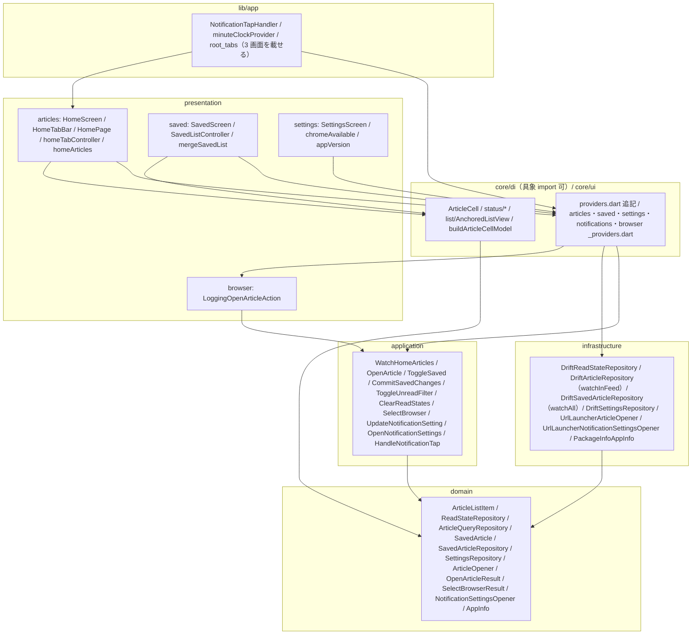
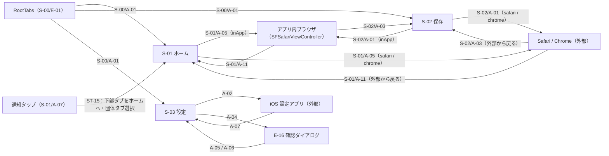

<!--
所有権（画面定義書との乖離を防ぐ）：
  画面定義書 docs/screens/S-xx.md が決める：何が見え、何ができ、どう遷移するか（要素 E-nn・状態 ST-nn・操作 A-nn・表示ルール）
  本書が決める：どう実現するか（UseCase・Provider・Repository・DB・処理手順・状態の判定ロジック）
本書は画面定義書の ID を参照し、内容を転記しない。画面仕様を変えたいときは画面定義書を先に直す（/screen-doc reopen）。
-->

## 1. 目的と範囲

本書は Flutter アプリ（`app/`）の**個別画面の機能**を定める。基盤（配信の取得と反映 `SyncArticlesUseCase`・取得の契機 `SyncController`・S-00 §5.2 の状態判定 `resolveListStatus`・記事セル `ArticleCell`・drift スキーマ・DI の組み立て方）は [D-04](D-04.md) が所有し、本書はそれらを**参照して呼び出す側**を書く。D-04 の決定は転記しない。

**決めること（9 点）**：

1. S-01〜S-03 のすべての操作 A-nn・状態 ST-nn の実現（§2.1）と画面遷移（§3.3）
2. 画面ごとの UseCase 10 個（§5）：`WatchHomeArticlesUseCase`・`OpenArticleUseCase`・`ToggleSavedUseCase`・`CommitSavedChangesUseCase`・`ToggleUnreadFilterUseCase`・`ClearReadStatesUseCase`・`SelectBrowserUseCase`・`UpdateNotificationSettingUseCase`・`OpenNotificationSettingsUseCase`・`HandleNotificationTapUseCase`
3. D-04 が D-05 所管とした Repository の追加メソッド（`ArticleQueryRepository.watchInFeed()`・`SavedArticleRepository.watchAll()` 等・`SettingsRepository` の browser / unreadFilter）と、`ReadStateRepository`（インターフェースと drift 実装）（§4.2〜§4.5）
4. 記事を開くポート `ArticleOpener`（SFSafariViewController / Safari / Chrome、URL スキーム検証）と `url_launcher` による実装（§4.4・§5.3）
5. 取得の契機 3 種（Pull to Refresh・再試行・通知タップ）の呼び出し方と、S-00/E-25 の表示制御（§5.6・§5.7）
6. 保存画面の「解除したセルを残す」（S-02/ST-04）の実現（解除を画面上で保留し、**下部タブが保存（`RootTab.saved.index`）から離れたとき**に DB へ確定する）と、配信外の保存記事の削除タイミング（§5.5）
7. 一覧の表示位置の保持（S-01 §7.4「表示位置」・S-02/ST-04）（§5.11）
8. 記事セルの入力 `ArticleCellModel` の組み立てと `now` の供給（§5.12）
9. テスト（§7）とタスク分割（§10。D-04 T-F1 / T-F2a / T-F2b の後に続く T-H〜T-O）

**決めないこと**：

- 配信の取得・反映・100 件保持・同時実行の抑止・通知許可・購読同期（D-04 §5.2〜§5.7）
- 記事セル・状態表示 Widget の見た目（D-04 §5.9）
- collector 側の一切（[D-02](D-02.md)・[D-03](D-03.md)）

## 2. 要件との対応

| 要件 | 本書での扱い | 節 |
|---|---|---|
| F-01 記事一覧表示 | ホーム画面 `HomeScreen`（上部団体タブ `HomeTabBar` + `PageView`）。表示対象は `WatchHomeArticlesUseCase` が `in_feed = true` の記事を団体タブと未読フィルタで絞り `compareArticles` で並べる | §5.1 / §5.2 |
| F-02 記事項目の表示 | D-04 の `ArticleCell` に渡す `ArticleCellModel` を `buildArticleCellModel`（団体名は `companiesProvider` の `shortName`、無ければ `companyId`）で組み立て、`now` は `minuteClockProvider` から渡す | §5.12 |
| F-03 記事を開く | `OpenArticleUseCase`：URL を検証 → ブラウザ設定を読む → `ArticleOpener.open()` → 既読化（`ReadStateRepository.markAsRead`） | §5.3 |
| F-04 ブラウザの選択 | `SettingsRepository.browserChoice()`（既定 `inApp`）と `SelectBrowserUseCase`（Chrome 未インストールなら選べない）。開くときの Chrome → Safari の代替は `OpenArticleUseCase` | §5.3 / §5.9 |
| F-05 既読管理 | 既読化は `OpenArticleUseCase`、未読フィルタは `ToggleUnreadFilterUseCase` + `WatchHomeArticlesUseCase`、一括クリアは `ClearReadStatesUseCase`。列の規則は D-04 §5.5 | §5.2 / §5.3 / §5.8 / §5.10 |
| F-06 保存（あとで読む） | ホームの星は `ToggleSavedUseCase`（S-00/A-11）。保存画面 `SavedScreen`（`SavedArticleRepository.watchAll()` + `SavedListController`）では解除を画面上で保留し、**下部タブが保存（`RootTab.saved.index`）から離れたとき**に `CommitSavedChangesUseCase` が DB へ確定して配信外の記事を削除する（配信外の保存記事は D-04 の `in_feed = false` 保護で残る） | §5.4 / §5.5 |
| F-07 プッシュ通知（動線） | 通知タップで下部タブ `RootTab.home.index` → 団体タブ → 先頭 → `sync(SyncTrigger.notificationTap)`（`NotificationTapHandler` + `HandleNotificationTapUseCase`）。受信・購読は D-04 §5.6・§5.7 | §5.7 |
| F-08 通知の団体別 ON/OFF（操作） | `UpdateNotificationSettingUseCase`（設定保存 → 購読同期）。購読同期の実体は D-04 §5.6 | §5.9 |
| F-10 手動更新 | `CupertinoSliverRefreshControl.onRefresh` → `syncControllerProvider.notifier.sync(SyncTrigger.pullToRefresh)` を await | §5.6 |
| F-11 更新記事の再浮上 | 並び順は `compareArticles`（`sortKey = updatedAt ?? publishedAt`）で先頭付近に移る。バッジは `ArticleListItem.hasUpdateBadge` → `resolveReadDisplayState`。差し込み時の表示位置は `AnchoredListView` | §5.2 / §5.11 / §5.12 |
| §7.2 `read_states`・`saved_articles`・`settings` | 本書が読み書きする SQL（§4.5）。テーブル定義は D-04 §4.2 | §4.5 |
| §8 画面構成（3 画面 + アプリ内ブラウザ） | 画面遷移図（§3.3）。アプリ内ブラウザは `url_launcher` の `LaunchMode.inAppBrowserView`（iOS では SFSafariViewController） | §3.3 / §4.4 |
| D-01 §8.1（D-05 宛）更新判定・並び替え | 判定と反映は D-04 §5.2 が持つ（D-04 §8 #1・#30）。本書は `compareArticles` で並べ、`hasUpdateBadge` を表示に写すだけ | §5.2 |
| D-01 §8.1（D-05 宛）団体一覧は同梱アセット由来 | 上部タブ・通知トグルは `companiesProvider`（D-04 §4.5）の配列順。記事側にしか無い `companyId` は「すべて」にだけ出す | §5.1 / §5.9 |
| D-01 §8.1（D-05 宛）§7.3「表示・遷移」のテスト | §7 の `WatchHomeArticlesUseCase`・`HandleNotificationTapUseCase`・`buildArticleCellModel` のケース | §7 |
| D-04 §8.1（D-05 宛 22 項目） | §2.2 で 1 件ずつ引き取る | §2.2 |

### 2.1 画面定義との対応（scope: app のみ）

S-00 は D-04 §2.1 が全 ID を載せている。本書はそのうち**実現の主体が D-05** のものだけを再掲する。

| 画面定義書の ID | 種類 | 本書での実現 | 節 |
|---|---|---|---|
| S-00/A-10 | 操作 | `ArticleCell.onTap` → `OpenArticleUseCase.execute(article, now)` | §5.3 |
| S-00/A-11 | 操作 | ホームでは `ArticleCell.onToggleSaved` → `ToggleSavedUseCase.execute(id, now)`。保存画面では `SavedListController.toggle(id, now)`（DB には書かず保留。離れたときに確定） | §5.4 / §5.5 |
| S-00/A-12 | 操作 | `FullErrorView.onRetry` → `ref.invalidate(articleCountProvider)` と `ref.invalidate(homeArticlesProvider)` を先に行い、続けて `sync(SyncTrigger.retry)`（D-04 §5.4・§8.1） | §5.6 |
| S-00/ST-01〜ST-03 | 状態 | `ArticleListItem.isRead` / `hasUpdateBadge` → `resolveReadDisplayState`（D-04 §5.5）→ `ArticleCellModel.readState` | §5.12 |
| S-00/ST-04 | 状態 | `ArticleListItem.isSaved` → `ArticleCellModel.isSaved` | §5.12 |
| S-00/ST-12 | 状態 | `EmptyView` にアイコンと文言を渡す（S-01 §5 ST-04・ST-05、S-02 §5 ST-02 の確定文字列） | §5.1 / §5.5 |
| S-00/ST-15 | 状態 | `syncControllerProvider.sequence` を `ref.listen` し、`errorNotice == true`（取得済みの記事が 1 件以上 × `SyncFailed`）かつホーム表示中のみ `TransientNotice` を出す（記事 0 件のときは S-00/ST-14 = 全面 E-24 だけ） | §5.6 |

S-01（ホーム）：

| 画面定義書の ID | 種類 | 本書での実現 | 節 |
|---|---|---|---|
| S-01/A-01 | 操作 | `HomeTabBar.onTap(index)` → `homeTabControllerProvider.notifier.select(index)` → `PageController` を非隣接ならワープ（§5.1）で `animateToPage` | §5.1 |
| S-01/A-02 | 操作 | `PageView.onPageChanged` → `select(index)`。端は `BouncingScrollPhysics` のバウンス | §5.1 |
| S-01/A-03 | 操作 | `ToggleUnreadFilterUseCase.execute()` → `unreadFilterProvider` が流れ `homeArticlesProvider` が新しい値を流す（全面ローディングは挟まない。§4.6）→ **全ページ**を先頭へ（`homeScrollToTopProvider.requestAll()`。アニメーションせず `jumpTo`。§8 #27） | §5.6 / §5.8 |
| S-01/A-04 | 操作 | `CupertinoSliverRefreshControl.onRefresh` → `sync(SyncTrigger.pullToRefresh)` を await | §5.6 |
| S-01/A-05 | 操作 | S-00/A-10 と同じ（`OpenArticleUseCase`） | §5.3 |
| S-01/A-06 | 操作 | S-00/A-11 と同じ（`ToggleSavedUseCase`）。ホームは `isSaved` を表示対象の条件にしない（`HomeFilter` に保存の条件が無い） | §5.4 |
| S-01/A-07 | 操作 | `NotificationTapHandler`（`lib/app/`）が `initialNotificationTapForAppProvider`・`latestNotificationTapProvider`（`core/di` の委譲。§4.6）を `ref.listenManual` → `HandleNotificationTapUseCase` | §5.7 |
| S-01/A-08 | 操作 | S-00/A-12 と同じ（invalidate 2 つ → `sync(SyncTrigger.retry)`） | §5.6 |
| S-01/A-09 | 操作 | `tabReselectProvider` の `RootTab.home.index` の変化を表示中ページが `ref.listen` → `AnchoredListController.scrollToTop(animated: true)`（§5.11。アンカー形でも先頭 = `minScrollExtent` へ戻る） | §5.6 |
| S-01/A-10 | 操作 | `HomeTabBar.onTap(index)` で `index == 選択中` なら `homeScrollToTopProvider.request()`（表示中のページのみ） | §5.6 |
| S-01/A-11 | 操作 | 既読化は開いた時点で DB に反映済み（§5.3）。戻ると `homeArticlesProvider` の値でセルが既読表示になり、未読フィルタ ON なら一覧から消える（`AnchoredListView` が位置を保つ） | §5.3 / §5.11 |
| S-01/ST-01 | 状態 | `resolveListStatus(feedStatusProvider, hasVisible)`（**引数なしの Provider**。D-04 §8 #51）が `content`。初期タブ index 0、未読フィルタは `settings.unread_filter` | §5.1 |
| S-01/ST-02 | 状態 | 同 `FullView.loading`（D-04 §5.4）。ページ領域全体に `FullLoadingView` | §5.1 |
| S-01/ST-03 | 状態 | 同 `refreshing == true` → `RefreshingHeader` を一覧の**先頭の Sliver**（`AnchoredListView.headerSliver`。標準形では `leadingSlivers` の `CupertinoSliverRefreshControl` の直後、アンカー形では `slivers` の先頭。§5.11。S-00 §3.3「一覧の先頭。iOS 標準の引っ張り更新の位置」）に置く。出現・消失で表示中の記事がずれないよう `AnchoredListView` が高さの変化を相殺する（§5.11・§8 #28）。引っ張り中は `CupertinoSliverRefreshControl` の表示に任せる | §5.1 / §5.6 / §5.11 |
| S-01/ST-04 | 状態 | `FullView.empty` かつ `HomeArticles.totalInTab == 0` → `EmptyView`（S-01 §5 ST-04 の文言） | §5.1 / §5.2 |
| S-01/ST-05 | 状態 | `FullView.empty` かつ `totalInTab > 0`（未読フィルタ ON で未読 0 件）→ `EmptyView`（S-01 §5 ST-05 の文言） | §5.1 / §5.2 |
| S-01/ST-06 | 状態 | `offlineBanner == true` → `OfflineBanner` を上部タブと `PageView` の間に置く | §5.1 |
| S-01/ST-07 | 状態 | `FullView.offline` → `FullErrorView(kind: offline)` | §5.1 |
| S-01/ST-08 | 状態 | `FullView.error` → `FullErrorView(kind: error)` | §5.1 |
| S-01/ST-09 | 状態 | `errorNotice`（D-04 §5.4 の判定表。取得済みの記事が 1 件以上 × `SyncFailed`）を `sequence` の変化で検知 → `TransientNotice`（ホーム表示中のみ） | §5.6 |
| S-01/ST-10 | 状態 | `homeTabControllerProvider`（`keepAlive` の `Notifier<int>`。初期 0。永続化しない） | §5.1 |
| S-01/ST-11・ST-12 | 状態 | `unreadFilterProvider`（`SettingsRepository.watchUnreadFilter()`。行無し = OFF） | §5.8 |
| S-01/ST-13 | 状態 | `PageView` のドラッグ。下線は `PageController.page` の小数部で補間 | §5.1 |
| S-01/ST-14 | 状態 | `CupertinoTabView` が画面を保持（D-04 §5.8）。S-00/E-25 は `_isHomeVisible()` が false なら出さない | §5.6 |
| S-01/ST-15 | 状態 | `NotificationTapHandler`：下部タブ `RootTab.home.index` → アプリ内ブラウザを閉じる → 団体タブ選択 → 先頭へ（表示中のページのみ）→ `sync(SyncTrigger.notificationTap)`。未起動からの起動でも最初のフレームから一致する（`PageController.initialPage` を `homeTabControllerProvider` から取る。§5.1） | §5.7 |
| S-01/ST-16 | 状態 | `ArticleOpener.open(uri, BrowserChoice.inApp)` = `LaunchMode.inAppBrowserView` | §5.3 |
| S-01/ST-17 | 状態 | `homeArticlesProvider` の新しい値を `AnchoredListView` が差し込む（先頭表示中は先頭に、それ以外は表示中の記事を固定） | §5.11 |
| S-01/ST-18 | 状態 | D-04 §5.7（本書は何もしない） | — |

S-02（保存）：

| 画面定義書の ID | 種類 | 本書での実現 | 節 |
|---|---|---|---|
| S-02/A-01 | 操作 | `OpenArticleUseCase`（ホームと同じ `openArticleActionProvider` 経由）。解除を保留中のセルも `saved_articles` の行が残っているため `watchAll()` に含まれ、既読表示は DB の再発火で届く | §5.3 / §5.5 |
| S-02/A-02 | 操作 | `SavedListController.toggle(id, now)`（保存済み → 解除を保留、保留中 → 取り消して再保存の日時を記録。DB には書かない） | §5.5 |
| S-02/A-03 | 操作 | 戻ったときは `savedListControllerProvider` の値のまま（保留中のセルは消えない） | §5.5 |
| S-02/A-04 | 操作 | `tabReselectProvider` の `RootTab.saved.index` の変化を `ref.listen` → `AnchoredListController.scrollToTop(animated: true)`（§5.11） | §5.5 |
| S-02/ST-01 | 状態 | `hasVisible`（保存済みが 1 件以上）から `ListStatus(full: FullView.content, …)` を**直接**組み立てる（`feedStatusProvider` も `resolveListStatus` も使わない。D-04 §8 #51・§8.1）。`savedArticlesProvider` の初回値が届くまでは何も出さない（`SizedBox.shrink()`。読み込み表示も空表示も出さない）。`AsyncError` のときは常に ST-02（§5.5・§6） | §5.5 |
| S-02/ST-02 | 状態 | 同じ組み立てで `FullView.empty`（`savedArticlesProvider` の値が届いた後で 0 件）→ `EmptyView`（S-02 §5 ST-02 の文言）。`savedListControllerProvider` が `AsyncError` のときも同じ表示（0 件の一覧は描かない。§5.5）。初回値が届く前は出さない。`CupertinoSliverRefreshControl` を置かない | §5.5 |
| S-02/ST-03 | 状態 | S-01/ST-16 と同じ | §5.3 |
| S-02/ST-04 | 状態 | `SavedListController` の `_pendingUnsave`（解除を保留した id。セルは `saved_at` の位置のまま `isSaved = false` で出す）。下部タブが `RootTab.saved.index` から離れたとき `CommitSavedChangesUseCase` で DB に確定し、保留を捨てる | §5.5 |
| S-02/ST-05 | 状態 | `watchAll()` が drift の Stream なので、ホームの取得で `articles` が更新されれば自動で再発火する。並び順キーは `saved_at` のみ | §5.5 |

S-03（設定）：

| 画面定義書の ID | 種類 | 本書での実現 | 節 |
|---|---|---|---|
| S-03/A-01 | 操作 | `UpdateNotificationSettingUseCase.execute(companyId, enabled)`（設定保存 → `PushSubscriptionCoordinator.run()`） | §5.9 |
| S-03/A-02 | 操作 | `OpenNotificationSettingsUseCase.execute()`（`app-settings:` を開く） | §5.9 |
| S-03/A-03 | 操作 | `SelectBrowserUseCase.execute(choice)`。`rejectedChromeUnavailable` なら `chromeAvailableProvider` を invalidate して E-13 を非活性表示に更新 | §5.9 |
| S-03/A-04 | 操作 | `showCupertinoDialog`（E-16） | §5.10 |
| S-03/A-05 | 操作 | ダイアログを閉じるだけ | §5.10 |
| S-03/A-06 | 操作 | `ClearReadStatesUseCase.execute()` | §5.10 |
| S-03/A-07 | 操作 | D-04 `AppLifecycleSync` が `pushPermissionStatusProvider` を invalidate。本書は `SettingsScreen` が `resumed` で `chromeAvailableProvider` も invalidate する | §5.9 |
| S-03/ST-01 | 状態 | `notificationSettingsProvider`・`browserChoiceProvider`・`appVersionProvider` の値を同期的に描く（`AsyncLoading` の間は既定値） | §5.9 |
| S-03/ST-02 | 状態 | `notificationSettingsProvider`（`Map<String, bool>`。キー無し = ON） | §5.9 |
| S-03/ST-03 | 状態 | `pushPermissionStatusForSettingsProvider`（`core/di`。D-04 の `pushPermissionStatusProvider` への委譲）が `authorized` 以外 → E-09 行を出す | §5.9 |
| S-03/ST-04 | 状態 | `browserChoiceProvider`（行無し = `inApp`） | §5.9 |
| S-03/ST-05 | 状態 | `chromeAvailableProvider == false` → E-13 を非活性表示。開くときの代替は `OpenArticleUseCase` 手順 3 | §5.9 / §5.3 |
| S-03/ST-06 | 状態 | ダイアログ表示中（`showCupertinoDialog` の Future が未完了） | §5.10 |
| S-03/ST-07 | 状態 | `SettingsScreen` の `_clearing = true`（`ClearReadStatesUseCase` の await 中） | §5.10 |
| S-03/ST-08 | 状態 | `_clearing = false` に戻す。完了表示は出さない | §5.10 |
| S-03/ST-09 | 状態 | 何もしない（`syncControllerProvider` を `ref.listen` しない） | §5.9 |

### 2.2 D-04 §8.1 の申し送り（D-05 宛）の引き取り

D-04 §8.1 の宛先が `D-05` の行は **22 行**（2026-09-24 に D-04 が `reviewed` になった時点で数えた全数）。以下は D-04 §8.1 の並び順どおりに 1 行ずつ引き取ったもので、行の対応を崩さない（この表が古いままだと申し送りを取りこぼす）。

| # | D-04 の申し送り（要旨） | 本書での引き取り | 節 |
|---|---|---|---|
| 1 | `pullToRefresh` / `retry` / `notificationTap` は `syncControllerProvider.notifier.sync()` を呼ぶ。Pull to Refresh は await。実行中の再呼び出しは同じ Future | そのとおり。Pull to Refresh は await し `_pulling` で S-00/E-21 を抑止 | §5.6 / §5.7 |
| 2 | **ホーム（S-01）の**判定は `resolveListStatus(ref.watch(feedStatusProvider), hasVisible:)`（**引数なしの Provider**）を使い再実装しない。S-00/E-25 は `sequence` を listen し、`lastResult is SyncFailed` かつホーム表示中（`tabControllerProvider.index == RootTab.home.index` かつ `ModalRoute.isCurrent`）のときだけ。**index の数値リテラルを書かない** | §5.1（引数なしの `feedStatusProvider`）・§5.6（`_isHomeVisible()` は `RootTab.home.index` で比較）。**`lastResult is SyncFailed` は `resolveListStatus(...).errorNotice` に置き換えて判定する**（判定表を再実装せず、S-00/ST-14（記事 0 件 → 全面 E-24）と ST-15（記事あり → E-25）の排他を守るため。§5.6・§8.1 の D-04 宛） | §5.1 / §5.6 |
| 3 | **`FullErrorView.onRetry` は `sync(retry)` の前に `ref.invalidate(articleCountProvider)`（一覧の Stream Provider も）** | §5.6 の A-08 行：`articleCountProvider` と `homeArticlesProvider`（family 全ページ分）を invalidate してから `sync(retry)` | §5.6 / §6 |
| 4 | ホームは `in_feed = true`、保存は全保存記事。`watchInFeed()` は `ArticleQueryRepository`（閲覧用）に足し `ArticleSyncRepository` には足さない | §4.2 | §4.2 |
| 5 | 開く = `read_states` upsert + バッジ消去、一括クリア = 全行削除 + 全バッジ false（1 トランザクション）。`ReadStateRepository` を追加 | §4.2・§4.5 | §4.2 / §4.5 |
| 6 | 保存解除の確定時点は画面で異なる。保存画面は画面上で保留し、**下部タブの選択が保存から外れた時点**（通知タップによるホームへの切替を含む）でまとめて確定。A-03・外部復帰・`paused` では確定しない。ST-04 の間の再タップは再保存（`saved_at` を更新）。ホームは即時。`watchAll()` は `saved_at` 降順 → `id` 昇順。削除述語は `AppDatabase.deleteUnsavedOutOfFeedRows()` を共有 | §5.5（`_pendingUnsave`・`_resaveAt`・`_onLeave()`）・§4.5（述語は D-04 T-C が追加済みのものを呼ぶだけ）・§8 #5 | §4.5 / §5.5 / §8 #5 |
| 7 | 通知トグルは `setNotificationEnabled` の後に `pushSubscriptionCoordinatorProvider.run()`。例外は catch して `logger.w`。ST-03 は `pushPermissionStatusProvider` | `UpdateNotificationSettingUseCase`（§5.9）。ST-03 は `core/di` の委譲 `pushPermissionStatusForSettingsProvider` 経由（§8 #10） | §5.9 |
| 8 | 通知タップは 2 つの Provider を listen。未知・null は「すべて」。タブは `tabControllerProvider` | `NotificationTapHandler` + `HandleNotificationTapUseCase`。2 つの Provider は `core/di/notifications_providers.dart` の委譲 Provider 経由で読む（§8 #10） | §5.7 |
| 9 | `ArticleCellModel` の `companyLabel` / `readState` / `now` | `buildArticleCellModel`・`minuteClockProvider` | §5.12 |
| 10 | 下部タブ再タップは `tabReselectProvider` の自分の index の変化を listen | ホーム・保存の各一覧（キーは `RootTab.home.index` / `RootTab.saved.index`） | §5.6 / §5.5 |
| 11 | `SettingsRepository` に browser / unreadFilter の get・set・watch。**`BrowserChoice.fromValue` は D-04 §4.4 が持つ**（引数名は `raw`。D-05 は同一コードを再掲しない）。`feed_*` は `FeedStateKeys` にあり `SettingsRepository` に足さない | §4.3（`fromValue` のコード片を削除し D-04 §4.4 を参照するだけにした。本書は `BrowserChoice` に何も足さない） | §4.3 |
| 12 | presentation が直接 watch してよいのは素の Stream（`watchCount()`・`watchInFeed()`・`watchAll()`）だけ。条件が入るものは UseCase | §4.6 の規則（`homeArticlesProvider` は `WatchHomeArticlesUseCase` を通す） | §4.6 |
| 13 | **`feedStatusProvider` は引数なし・`resolveListStatus` はホーム専用**（`syncsOnLaunch` は廃止）。**保存画面は `feedStatusProvider` も `resolveListStatus` も使わず**、`ListStatus`・`FullView` を `core/ui/status/list_status.dart` から import し `hasVisible` から直接組み立てる。`AsyncError` → `empty`・`AsyncLoading` → `SizedBox.shrink()` の分岐と `_emptyStatus` は残す。保存は `sequence` を listen しない。**§7 に保存画面の状態判定テストを置かない** | §5.1（ホーム。引数なし）・§5.5（保存。`_statusFor` / `_emptyStatus` を直接組み立て）・§2.1 の S-01/ST-01 行と S-02/ST-01・ST-02 行・§3.2 の `saved_screen.dart` の import・§8 #12。§7 に保存画面の状態判定テストは無い | §5.1 / §5.5 / §2.1 / §3.2 |
| 14 | `unsupportedSchema` は他の失敗と同じ表示。`suppressed` のときの S-00/E-25 は S-00 が定めるまで出す | §5.6（`suppressed`・`reason` で分岐しない） | §5.6 / §8 #12 |
| 15 | `staleDiscarded` は表示に使わない | `SyncSucceeded` は種別を問わず成功扱い | §5.6 |
| 16 | `syncCoordinatorProvider.run()` を直接呼ばない | 本書の presentation は `syncCoordinatorProvider` を import しない | §4.6 |
| 17 | 通知トグル後の結果は `PushSubscriptionCoordinator` が内部に持つ。**公開 API は `run()` と `resyncIfNeeded()` だけで、D-05 は `lastResult` / `lastRunFailed` / `pending` を読まない**。結果の保持・表示もしない | `UpdateNotificationSettingUseCase` は `run()` の戻り値を読まず `Future<void>` を返す。失敗の再実行は D-04 `AppLifecycleSync` の `resyncIfNeeded()` | §5.9 |
| 18 | D-01 §7.3「表示・遷移（D-05）」の行を D-05 が持つ | §7 の 5 項目の対応表 | §7 |
| 19 | 追加パッケージは D-05 が決める | `url_launcher`・`package_info_plus`（§4.7） | §4.7 |
| 20 | **`settings` を watch するメソッドは写した値に `.distinct()` を掛ける。** `Map` を返す `watchNotificationSettings()` は `.distinct(const MapEquality<String, bool>().equals)`。単一キーの watch は `AppDatabase.watchSetting()` を共有 | §4.3（IF の doc）・§4.5（実装規則）・§7（`group('トグル')` に再発火しないケース） | §4.3 / §4.5 / §7 |
| 21 | `CupertinoTabController.index` への代入は**ビルドフェーズ外**（`ref.listenManual` のコールバック等）。型は `Raw<CupertinoTabController>` | §5.7 手順 3-3（`_handle` は手順 1 の `await` の後なのでビルド外） | §5.7 |
| 22 | S-00/E-25 は **`TransientNotice.show(context, message:)`**（D-04 §5.9）を呼ぶ。`context` は**配置画面（`CupertinoTabView` 配下）**、`message` は S-00 の確定文言のみ。3 秒以内に連続しても帯は 1 枚 | §5.6（`HomeScreen` の `context` を渡す。`OverlayEntry`・`Timer` を持たない。文言は S-00/E-25 の確定文言） | §5.6 |

## 3. 構成

### 3.1 層と依存の方向

D-04 §3.1 の方向（presentation / app → application → domain、infrastructure → domain）をそのまま守る。本書で増える **feature 間の依存（他 feature の domain の型への依存）は次の表がすべて**で、表に無い組み合わせは import しない。`core/di/` の Provider の import は feature 間の依存に数えず**常に許す**（D-04 §4.7。表には主要なものを載せているが網羅ではない）。許す形は「他 feature の **domain** の型（値オブジェクト・ポート）」と「`core/di` の Provider」だけで、他 feature の application・presentation は import しない。`articles` は引き続き他の feature を import しない（`HomeScreen`・`HomePage` は他 feature の型を名指しせず、`core/di` の Provider を通して `Stream<bool>`・`List<Company>` の値と、記事を開く操作 `openArticleActionProvider`（§4.6。結果型を返さない関数）だけを受け取る。§8 #9）。feature の presentation が他 feature の presentation を import しない規則（CLAUDE.md）を守るため、**複数の feature が使う素の Stream / Future の Provider と、D-04 が `notifications/presentation` に置いた Provider への委譲は `core/di/` の feature 別ファイルに置く**（§4.6。§8 #9・#10）。

| 依存元 | 依存先 | 理由 |
|---|---|---|
| `browser/domain`（`ArticleOpener`・`OpenArticleAction`） | `settings/domain`（`BrowserChoice`）、`articles/domain`（`Article`） | `open(Uri, BrowserChoice)` の引数と、`typedef OpenArticleAction` の引数型 `Article`（§4.6）。値オブジェクトのみ |
| `browser/application`（§8 #8） | `articles/domain`（`Article`・`ReadStateRepository`）、`settings/domain`（`BrowserChoice`・`SettingsRepository`）、`browser/domain`（`ArticleOpener`・`OpenArticleResult`・`SelectBrowserResult`） | 記事を開いて既読にする。ブラウザ設定を読む |
| `browser/infrastructure`（`UrlLauncherArticleOpener`） | `settings/domain`（`BrowserChoice`）、`browser/domain`（`ArticleOpener`） | `open(Uri, BrowserChoice)` の実装で `BrowserChoice` を `switch` し、`LaunchMode` と URL スキームを決める（§4.4 の表）。値オブジェクトのみ（infrastructure → 他 feature の domain） |
| `saved/domain`（`SavedArticle`） | `articles/domain`（`ArticleListItem`） | 保存一覧のセルも同じ `ArticleListItem` |
| `notifications/application`（`HandleNotificationTapUseCase`・`UpdateNotificationSettingUseCase`） | `browser/domain`（`ArticleOpener.closeInAppBrowser`）、`settings/domain`、同 feature の `PushSubscriptionCoordinator` | S-01/ST-15 でアプリ内ブラウザを閉じる。トグル後の購読同期 |
| `articles/presentation`・`saved/presentation` | `core/di/browser_providers.dart`（`openArticleActionProvider`。§4.6） | 記事を開く。`browser` の型（`OpenArticleResult`・`OpenArticleAction`）は名指しせず、受け取った関数を呼ぶだけ。失敗のログは `browser/presentation` の `LoggingOpenArticleAction` が残す（§8 #29） |
| `articles/presentation` | `core/di/settings_providers.dart`（`unreadFilterProvider`・`toggleUnreadFilterUseCaseProvider`） | S-01/A-03・ST-11。未読フィルタの値と切替（§5.8） |
| `articles/presentation`・`saved/presentation` | `core/di/providers.dart`（`companyShortNamesProvider`・`companiesProvider`） | S-00 §7.1 の団体名。`HomeTabBar` の並び（§5.1・§5.12） |
| `browser/presentation`（`LoggingOpenArticleAction`） | 同 feature の `browser/application`・`browser/domain`、`articles/domain`（`Article`） | `OpenArticleResult` を `logger.w` に写す（D-04 §4.9「ログは presentation」）。feature 内の依存。`core/di/browser_providers.dart` が組み立てる |
| `settings/presentation` | `browser/domain`（`SelectBrowserResult`）、`core/di/browser_providers.dart`（`selectBrowserUseCaseProvider`）、`core/di/providers.dart`（`articleOpenerProvider`。`chromeAvailableProvider` の元） | S-03/A-03・ST-05。値型（enum）と `core/di` の Provider のみ |
| `settings/presentation` | `core/di/notifications_providers.dart`（`pushPermissionStatusForSettingsProvider`。§4.6） | S-03/ST-03。D-04 の `pushPermissionStatusProvider` を `core/di` の委譲 Provider 経由で読む（§8 #10） |
| `settings/presentation` | `core/di/articles_providers.dart`（`clearReadStatesUseCaseProvider`）、`core/di/providers.dart`（`companiesProvider`） | S-03/A-06（既読の消去。§5.10）と E-04〜E-08 の団体別トグルの並び（§5.9） |
| `lib/app/notification_tap_handler.dart` | `core/di/notifications_providers.dart`（`initialNotificationTapForAppProvider`・`latestNotificationTapProvider`・`handleNotificationTapUseCaseProvider`）、`articles/presentation`（`homeTabControllerProvider`・`homeScrollToTopProvider`）、`core/di` | 通知タップの配線は feature に属さない（D-04 の `AppLifecycleSync` と同じ置き場。§8 #10）。`notifications/presentation` は直接 import しない |
| `core/ui/list`（`AnchoredListView`・`AnchoredListController`） | Flutter SDK のみ（feature の型を import しない。要素は型引数 `T` の `items` と `idOf` で受ける。§5.11） | ホームと保存の両方が使う共通部品（D-04 §8 #34 と同じ理由）。§10 T-H3 の受け入れ条件 |
| `core/ui/list/anchor_resolution.dart`（`resolveAnchorId`） | **import 無し**（Dart core のみ。入出力は `List<String>`・`String`・`String?` だけ。宣言は §5.11 手順 2） | アンカーの付け替え規則の純粋関数（§5.11 手順 2・§7・§8 #33）。§10 T-H3 の受け入れ条件 |
| `core/ui/article/article_cell_model_builder.dart`（`buildArticleCellModel`） | Flutter SDK、`articles/domain`（`ArticleListItem`）、D-04 の `core/ui/article`（`ArticleCellModel`） | `ArticleListItem` → `ArticleCellModel` の純粋関数（§5.12・§7）。§10 T-H3 の受け入れ条件 |
| `saved/infrastructure`（`DriftSavedArticleRepository`） | `core/database`（`ArticleRowMapper`）、`articles/domain`（`ArticleListItem`） | `watchAll()` が `ArticleRow` を domain に写して `SavedArticle` を組み立てる。写像は `core/database` の 1 箇所を共有する（infrastructure → 他 feature の domain / core なので許される。§4.5・§8 #32） |
| `core/database`（`ArticleRowMapper`） | `articles/domain`（`Article`・`ArticleListItem`） | drift の行 `ArticleRow` → domain の写像（`toDomain()`・`toListItem()`）。`DriftArticleRepository.watchInFeed()` と `DriftSavedArticleRepository.watchAll()` が同じ写像を共有する（infrastructure → domain の向きなので許される）。§3.2・§4.5・§8 #32 |

**`lib/core/database/` に置いてよいもの**（§8 #32）：**2 つ以上の feature の infrastructure が共有する述語・写像**に限る（D-04 §4.2「`AppDatabase` に置く SQL」・D-04 §8 #48 と同じ基準）。1 つの feature でしか使わない写像・SQL は各 Repository 実装に置く。本書で該当するのは `article_row_mapper.dart` の 1 つだけで、`core/database` が feature 共通の置き場になって feature の境界が DB クラスで溶けることを避ける。



### 3.2 ファイル配置

D-04 §3.2 に**追加**するもの（既存ファイルの改修は「改修」と明記）。`features/browser/` の新設は §8 #8（開発者確認済み 2026-09-20）。

```
app/
  pubspec.yaml                  改修：url_launcher・package_info_plus を追加（§4.7）
  ios/Runner/Info.plist         改修：LSApplicationQueriesSchemes に googlechrome / googlechromes（§4.7）
  lib/
    app/
      root_tabs.dart            改修：3 つの CupertinoTabView に HomeScreen / SavedScreen / SettingsScreen を載せる
      app_lifecycle_sync.dart   改修：NotificationTapHandler を子に挟む（AppLifecycleSync → NotificationTapHandler → RootTabs。§5.7。T-M）
      notification_tap_handler.dart   S-01/A-07・ST-15 の配線（§5.7）。AppLifecycleSync の子、RootTabs の親
      minute_clock.dart         minuteClockProvider（E-14 の now。1 分ごと。§5.12）
    core/
      di/
        providers.dart          改修：readStateRepository・articleOpener・notificationSettingsOpener・appInfo・companyShortNames を追加（§4.6）
        articles_providers.dart 改修：watchHomeArticlesUseCase・clearReadStatesUseCase を追加
        saved_providers.dart    toggleSavedUseCase・commitSavedChangesUseCase
        settings_providers.dart unreadFilterProvider・toggleUnreadFilterUseCase
        notifications_providers.dart  改修：updateNotificationSettingUseCase・openNotificationSettingsUseCase・handleNotificationTapUseCase と、D-04 の notification_tap_providers.dart への委譲 3 つ（initialNotificationTapForApp・latestNotificationTap・pushPermissionStatusForSettings）を追加（§4.6）
        browser_providers.dart  openArticleUseCase・selectBrowserUseCase・openArticleAction（LoggingOpenArticleAction を組み立てて `.call` を返す。§4.6）
      database/
        article_row_mapper.dart           ArticleRow → Article / ArticleListItem の写像（extension。§3.1・§4.5）。
                                          watchInFeed() と watchAll() が共有する
        app_database.dart       （改修しない）deleteUnsavedOutOfFeedRows() は D-04 T-C が追加済みで、
                                          本書は呼ぶだけ・新たな述語を書かない（§4.5・§10 T-H1。D-04 §4.2・§8 #48）
      ui/
        article/
          article_cell_model_builder.dart   buildArticleCellModel（純粋関数。§5.12・§7）
        list/
          anchored_list_view.dart           表示位置を保つ一覧 AnchoredListView・先頭スクロール要求を受ける
                                            AnchoredListController・帯の高さ変化を相殺する _ExtentCompensatingSliver（§5.11）
          anchor_resolution.dart            resolveAnchorId（アンカーの付け替え規則。純粋関数。§5.11・§7・§8 #33）
    features/
      articles/
        domain/
          article_list_item.dart            ArticleListItem（§4.1）
          read_state_repository.dart        ReadStateRepository（§4.2）
          article_query_repository.dart     改修：watchInFeed() を追加
        application/
          watch_home_articles_use_case.dart HomeFilter・HomeArticles・WatchHomeArticlesUseCase（§5.2）
          clear_read_states_use_case.dart   §5.10
        infrastructure/
          drift_read_state_repository.dart  §4.5
          drift_article_repository.dart     改修：watchInFeed() の実装
        presentation/
          home_screen.dart                  S-01/E-01〜E-03・E-10（ナビゲーションバー・未読フィルタ・上部タブ・PageView・帯・全面表示）
          home_tab_bar.dart                 S-01/E-03〜E-09（下線・横スクロール）
          home_page.dart                    S-01/E-11 の 1 ページ（AnchoredListView。leadingSlivers = 引っ張り更新、headerSliver = RefreshingHeader、emptyView = 空表示）
          home_providers.dart               homeTabControllerProvider・homeScrollToTopProvider・homeArticlesProvider（§4.6）
      saved/
        domain/
          saved_article.dart                SavedArticle・compareSavedArticles（§4.1）
          saved_article_repository.dart     改修：isSaved()・watchAll()・deleteUnsavedOutOfFeed() を追加
        application/
          toggle_saved_use_case.dart        §5.4
          commit_saved_changes_use_case.dart  §5.5（保存画面で保留した解除・再保存を DB に確定し、配信外の未保存記事を削除）
        infrastructure/
          drift_saved_article_repository.dart   改修
        presentation/
          saved_screen.dart                 S-02/E-01・E-02。状態表示の型は core/ui/status/list_status.dart から
                                            import する（articles/presentation を import しない。D-04 §8 #51・§8.1）
          saved_list_controller.dart        SavedListController・savedArticlesProvider（§5.5）
          saved_list_merge.dart             mergeSavedList（純粋関数。§5.5・§7）
      settings/
        domain/
          settings_repository.dart          改修：browser / unreadFilter / watchNotificationSettings を追加（§4.3）
          app_info.dart                     AppInfo ポート・AppVersion（§4.4）
        application/
          toggle_unread_filter_use_case.dart  §5.8
        infrastructure/
          drift_settings_repository.dart    改修
          package_info_app_info.dart        package_info_plus
        presentation/
          settings_screen.dart              S-03 の 4 セクション（§5.9・§5.10）
          settings_providers.dart           browserChoiceProvider・notificationSettingsProvider・chromeAvailableProvider・appVersionProvider
      notifications/
        domain/
          notification_settings_opener.dart NotificationSettingsOpener ポート（§4.4）
        application/
          update_notification_setting_use_case.dart   §5.9
          open_notification_settings_use_case.dart    §5.9
          handle_notification_tap_use_case.dart       §5.7
        infrastructure/
          url_launcher_notification_settings_opener.dart
      browser/                              §8 #8（新 feature）
        domain/
          article_opener.dart               ArticleOpener ポート（§4.4）
          open_article_result.dart          OpenArticleResult・OpenFailure（値オブジェクト。§4.1）
          select_browser_result.dart        SelectBrowserResult（§4.1）
          open_article_action.dart          typedef OpenArticleAction（結果型を返さない関数型。§4.6）
        application/
          open_article_use_case.dart        OpenArticleUseCase（§5.3）
          select_browser_use_case.dart      SelectBrowserUseCase（§5.9）
        infrastructure/
          url_launcher_article_opener.dart  §4.4
        presentation/
          open_article_action.dart          LoggingOpenArticleAction（OpenArticleUseCase の結果を logger.w に写す。§4.6・§8 #29）
  test/
    helpers/
      fake_article_opener.dart              ArticleOpener のフェイク（呼び出し記録・Chrome 有無・open の戻り値）
      fake_notification_settings_opener.dart
      seed_articles.dart                    in-memory drift に記事・既読・保存を投入するヘルパ（ArticleSyncRepository.applyFeed 経由。API と契約は §7）
      collect_stream.dart                   collectStream（Stream の値を集めるヘルパ。§7）
    core/ui/article/
      article_cell_model_builder_test.dart  純粋関数の直接テスト（§7）
    core/ui/list/
      anchor_resolution_test.dart           純粋関数の直接テスト（§7・§8 #33）
    features/
      articles/application/watch_home_articles_use_case_test.dart
      articles/application/clear_read_states_use_case_test.dart
      saved/application/toggle_saved_use_case_test.dart
      saved/application/commit_saved_changes_use_case_test.dart
      saved/presentation/saved_list_merge_test.dart     純粋関数の直接テスト（§7）
      settings/application/toggle_unread_filter_use_case_test.dart
      notifications/application/update_notification_setting_use_case_test.dart
      notifications/application/open_notification_settings_use_case_test.dart
      notifications/application/handle_notification_tap_use_case_test.dart
      browser/application/open_article_use_case_test.dart
      browser/application/select_browser_use_case_test.dart
```

### 3.3 画面遷移



## 4. データ

### 4.1 一覧の要素型（domain）

```dart
// lib/features/articles/domain/article_list_item.dart
/// 一覧に出す 1 記事分（Article + 端末内の状態）。watchInFeed() / watchAll() が流す。不変。== / hashCode は 4 フィールド
final class ArticleListItem {
  const ArticleListItem({required this.article, required this.isRead, required this.hasUpdateBadge, required this.isSaved});
  final Article article;
  final bool isRead;            // read_states に行がある（S-00/ST-02）
  final bool hasUpdateBadge;    // articles.has_update_badge（S-00/ST-03。D-04 §5.5）
  final bool isSaved;           // saved_articles に行がある（S-00/ST-04）
  ArticleListItem copyWith({bool? isRead, bool? hasUpdateBadge, bool? isSaved});
}
```

```dart
// lib/features/articles/application/watch_home_articles_use_case.dart
/// ホームの絞り込み条件（S-01 §7.2・§7.3）。不変。== / hashCode は 2 フィールド
final class HomeFilter {
  const HomeFilter({required this.companyId, required this.unreadOnly});
  final String? companyId;      // null = 「すべて」（S-01/E-04）
  final bool unreadOnly;        // S-01/ST-11
}

/// ホーム 1 ページ分の表示対象。items は防御的コピー（変更不可リスト）で保持するため const コンストラクタにしない
final class HomeArticles {
  HomeArticles({required List<ArticleListItem> items, required this.totalInTab})
      : items = List.unmodifiable(items);
  final List<ArticleListItem> items;   // 絞り込み後、compareArticles 順
  final int totalInTab;                // 未読フィルタで絞る前のタブ内件数（S-01/ST-04 と ST-05 の区別に使う）
  // == / hashCode は手書き（D-04 §8 #24）。items の比較・ハッシュは package:collection の
  // ListEquality<ArticleListItem> を使う（application は Flutter 非依存に保つため
  // foundation.listEquals を使わない。D-04 §8 #24 の PushSubscriptionSyncResult と同じ）
}
```

```dart
// lib/features/saved/domain/saved_article.dart
/// 不変。== / hashCode は item・savedAt の 2 フィールド（AnchoredListView の listEquals が使う。§5.11）
final class SavedArticle {
  const SavedArticle({required this.item, required this.savedAt});
  final ArticleListItem item;
  final DateTime savedAt;       // saved_articles.saved_at（UTC）
  SavedArticle copyWith({ArticleListItem? item, DateTime? savedAt});
}

/// S-02 §7.1：saved_at 降順 → id 昇順
int compareSavedArticles(SavedArticle a, SavedArticle b) {
  final bySaved = b.savedAt.compareTo(a.savedAt);
  if (bySaved != 0) return bySaved;
  return a.item.article.id.compareTo(b.item.article.id);
}
```

```dart
// lib/features/browser/domain/open_article_result.dart（値オブジェクト。他 feature が import してよいのは domain のこの型まで。§3.1）
sealed class OpenArticleResult { const OpenArticleResult(); }
/// 起動できた。markedAsRead = false は起動後の既読化（DB 書き込み）だけが失敗した
final class ArticleOpened extends OpenArticleResult {
  const ArticleOpened({required this.browser, required this.markedAsRead});
  final BrowserChoice browser;      // 実際に使ったブラウザ（chrome → safari の代替後の値）
  final bool markedAsRead;
}
enum OpenFailure { invalidUrl, launchFailed }
/// 開けなかった。既読にしていない
final class ArticleNotOpened extends OpenArticleResult {
  const ArticleNotOpened(this.reason);
  final OpenFailure reason;
}

// lib/features/browser/domain/select_browser_result.dart（settings/presentation が読む。§3.1・§5.9）
enum SelectBrowserResult { applied, rejectedChromeUnavailable }

// lib/features/settings/domain/app_info.dart
final class AppVersion {
  const AppVersion({required this.version, required this.buildNumber});
  final String version;        // CFBundleShortVersionString
  final String buildNumber;    // CFBundleVersion
}
```

### 4.2 記事・既読・保存の Repository（追加分）

D-04 §4.4 のインターフェースに次を**追加**する。`ArticleSyncRepository` には足さない（D-04 §8 #42）。

```dart
// lib/features/articles/domain/article_query_repository.dart（D-04 に追加）
abstract interface class ArticleQueryRepository {
  Stream<int> watchCount();                        // D-04
  /// in_feed = true の記事を read_states / saved_articles と結合して流す（S-01 §8 #10）。順序は未定義（UseCase が並べる）
  Stream<List<ArticleListItem>> watchInFeed();
}

// lib/features/articles/domain/read_state_repository.dart
abstract interface class ReadStateRepository {
  /// read_states を upsert（read_at = readAt）し、同じトランザクションで articles.has_update_badge = false（D-04 §5.5）。
  /// articles に行が無ければ（開いた直後の同期で削除された）何もせず正常終了する
  Future<void> markAsRead(String articleId, {required DateTime readAt});
  /// read_states の全行削除と articles.has_update_badge の全行 false を 1 トランザクションで行う（S-03/A-06、S-00 §8 #22）
  Future<void> clearAll();
}

// lib/features/saved/domain/saved_article_repository.dart（D-04 に追加）
abstract interface class SavedArticleRepository {
  Future<void> save(String articleId, {required DateTime savedAt});   // D-04
  Future<void> remove(String articleId);                              // D-04
  Future<bool> isSaved(String articleId);
  /// 保存済みの記事全件（in_feed を問わない。S-02 §7.2・§7.3）。saved_at 降順 → id 昇順
  Stream<List<SavedArticle>> watchAll();
  /// in_feed = false かつ saved_articles に無い articles の行を削除する（S-02 §7.3「解除したとき」。§5.5）。件数は返さない（呼び出し側が使わない。§8 #31）
  Future<void> deleteUnsavedOutOfFeed();
}
```

### 4.3 SettingsRepository（追加分）

```dart
// lib/features/settings/domain/settings_repository.dart（D-04 に追加）
abstract interface class SettingsRepository {
  Future<Map<String, bool>> notificationSettings();                       // D-04
  Future<void> setNotificationEnabled(String companyId, {required bool enabled});   // D-04
  /// notification.* の変化を流す（S-03/ST-02 の表示）。値とキーの抽出規則は D-04 §4.4 の 4 段と同じ
  /// （本書で再定義しない）。写した Map には .distinct(const MapEquality<String, bool>().equals) を掛ける（§4.5）
  Stream<Map<String, bool>> watchNotificationSettings();
  /// SettingKeys.browser。行無し・未知の値は BrowserChoice.inApp（F-04）。
  /// 値 ↔ BrowserChoice の写像は D-04 §4.4 の BrowserChoice.fromValue(String? raw) / BrowserChoice.value
  Future<BrowserChoice> browserChoice();
  Stream<BrowserChoice> watchBrowserChoice();   // 写した値に .distinct() を掛ける（§4.5）
  Future<void> setBrowserChoice(BrowserChoice choice);
  /// SettingKeys.unreadFilter。行無し・'1' 以外は false（S-01 §8 #19）
  Future<bool> unreadFilter();
  Stream<bool> watchUnreadFilter();             // 写した値に .distinct() を掛ける（§4.5）
  Future<void> setUnreadFilter({required bool enabled});   // '1' / '0' を upsert
}
```

`feed_etag`・`feed_generated_at`・`feed_unsupported_schema` の get / set は追加しない（D-04 §8.1。これらは `articles/infrastructure` の `FeedStateKeys` が持つ）。

`settings` テーブルの `value`（`String?`）と `BrowserChoice` の写像は **D-04 §4.4 の `BrowserChoice.fromValue(String? raw)` / `BrowserChoice.value`**（行無し・未知の値は `inApp`）を使い、`DriftSettingsRepository` は独自の `switch` を書かない（`browserChoice()`・`watchBrowserChoice()`・`setBrowserChoice()` の 3 箇所で同じ規則を使うため）。**本書は `BrowserChoice` に何も足さない**（同じ事実を 2 冊に書かない。D-04 §8.1）。書き込み（`setBrowserChoice`）は `choice.value` を upsert する。

### 4.4 ポート（外部境界）

```dart
// lib/features/browser/domain/article_opener.dart
/// 記事 URL を開く外部境界。実装は url_launcher（§4.7）
abstract interface class ArticleOpener {
  /// Chrome が起動できるか（googlechromes:// を canLaunchUrl。S-03/ST-05）。
  /// 例外は投げず、捕捉して false（Chrome 無し扱い）を返す（PlatformException を含む）
  Future<bool> isChromeAvailable();
  /// [browser] で [url] を開く。true = OS に起動を渡せた。例外は投げず false を返す（PlatformException を含む）
  Future<bool> open(Uri url, BrowserChoice browser);
  /// 表示中のアプリ内ブラウザ（SFSafariViewController）を閉じる。表示していなければ何もしない（S-01/ST-15）
  Future<void> closeInAppBrowser();
}

// lib/features/notifications/domain/notification_settings_opener.dart
abstract interface class NotificationSettingsOpener {
  /// iOS 設定アプリの本アプリのページを開く（app-settings:）。true = 起動を渡せた。例外は投げない
  Future<bool> openAppSettings();
}

// lib/features/settings/domain/app_info.dart
abstract interface class AppInfo {
  Future<AppVersion> load();
}
```

`UrlLauncherArticleOpener`（`browser/infrastructure/url_launcher_article_opener.dart`）の規則：

| `BrowserChoice` | 呼び出し |
|---|---|
| `inApp` | `launchUrl(url, mode: LaunchMode.inAppBrowserView)`（iOS では SFSafariViewController。F-03） |
| `safari` | `launchUrl(url, mode: LaunchMode.externalApplication)` |
| `chrome` | `launchUrl(url.replace(scheme: url.scheme == 'https' ? 'googlechromes' : 'googlechrome'), mode: LaunchMode.externalApplication)`。呼び出し側（`OpenArticleUseCase` 手順 3）が `isChromeAvailable()` を先に確認しているため、ここでは再確認しない |
| `isChromeAvailable()` | `canLaunchUrl(Uri.parse('googlechromes://'))`。**例外は捕捉して false（Chrome 無し扱い）を返す**（`logger.w`）。`Info.plist` の `LSApplicationQueriesSchemes` に `googlechrome`・`googlechromes` が無いと常に false になる（§4.7） |
| `closeInAppBrowser()` | `closeInAppWebView()`（url_launcher_ios は SFSafariViewController を dismiss する）。例外は捕捉して無視 |
| 例外 | `launchUrl` / `canLaunchUrl` / `closeInAppWebView` が投げた `PlatformException` 等は**3 メソッドとも**捕捉し、`open()` と `isChromeAvailable()` は `false`、`closeInAppBrowser()` は何もせず返す（`logger.w`。URL は出してよい。本文は無い）。`isChromeAvailable()` が例外を投げると `chromeAvailableProvider`（§4.6）が `AsyncError` になり、§5.9 の E-13 の判定（`.value == false`）が成立せず、S-03/ST-05 の非活性表示にならないまま E-13 をタップしても何も起きない（T-27 の dev-loop。2026-09-23 追記） |

`open()` は**呼び出し側（`OpenArticleUseCase` 手順 1。§5.3）が `uri.scheme` を `http` / `https` に、`uri.host` が空でないことに限定済みであることを前提**とし、**`UrlLauncherArticleOpener` 側では再検証しない**（セキュリティに関わる述語を 2 箇所に置かない。`chrome` 行で `isChromeAvailable()` を再確認しないのと同じ理由）。URL の検証は §5.3 手順 1 の 1 箇所だけにある。

`UrlLauncherNotificationSettingsOpener`：`launchUrl(Uri.parse('app-settings:'), mode: LaunchMode.externalApplication)`。`canLaunchUrl` は呼ばない（`app-settings:` は `LSApplicationQueriesSchemes` に載せられない）。`PackageInfoAppInfo`：`PackageInfo.fromPlatform()` の `version`・`buildNumber` を `AppVersion` に写す。

### 4.5 drift の実装（本書所管の SQL）

| メソッド | SQL / 手順 |
|---|---|
| `DriftArticleRepository.watchInFeed()` | `SELECT a.*, r.article_id IS NOT NULL AS is_read, s.article_id IS NOT NULL AS is_saved FROM articles a LEFT JOIN read_states r ON r.article_id = a.id LEFT JOIN saved_articles s ON s.article_id = a.id WHERE a.in_feed = 1` を drift の `watch()` で流す（3 テーブルのいずれかの変更で再発火）。`hasUpdateBadge` は `a.has_update_badge` |
| `DriftReadStateRepository.markAsRead(id, readAt)` | `transaction`：`SELECT 1 FROM articles WHERE id = ?` が無ければ何もしない → `INSERT OR REPLACE INTO read_states (article_id, read_at) VALUES (?, ?)` → `UPDATE articles SET has_update_badge = 0 WHERE id = ?` |
| `DriftReadStateRepository.clearAll()` | `transaction`：`DELETE FROM read_states` → `UPDATE articles SET has_update_badge = 0` |
| `DriftSavedArticleRepository.isSaved(id)` | `SELECT 1 FROM saved_articles WHERE article_id = ?` |
| `DriftSavedArticleRepository.watchAll()` | `SELECT a.*, s.saved_at, r.article_id IS NOT NULL AS is_read FROM saved_articles s JOIN articles a ON a.id = s.article_id LEFT JOIN read_states r ON r.article_id = a.id ORDER BY s.saved_at DESC, a.id ASC` を `watch()`。`isSaved` は常に true。`saved_at` は UTC の ISO8601 テキスト（D-04 §8 #4）なので文字列順 = 時系列 |
| `DriftSavedArticleRepository.deleteUnsavedOutOfFeed()` | `DELETE FROM articles WHERE in_feed = 0 AND id NOT IN (SELECT article_id FROM saved_articles)`（`read_states` は cascade）。**述語は `AppDatabase.deleteUnsavedOutOfFeedRows()` に 1 つだけ置く**。このメソッドは **D-04 §10 T-C が追加済み**（D-04 §4.2・§8 #48）で、本書は呼ぶだけ・新たに述語を書かない。`DriftArticleRepository.applyFeed` 手順 5（D-04 §5.2 手順 8-5）と共有する。`AppDatabase` 側は削除件数を返し、本メソッドは捨てる（§8 #31） |
| `DriftSettingsRepository.watchBrowserChoice()` / `watchUnreadFilter()` | **単一キーの watch は `AppDatabase.watchSetting(key)`（`Stream<String?>`。D-04 §4.2）を使う**（同じ SQL を書かない）。既定値の補完（行無し → `inApp` / `false`）は Repository 実装で行い（D-04 §4.2「既定値は読み手が補う」）、**写した値に `.distinct()` を掛ける**。掛けないと `feed_etag` の upsert（取得のたびに走る）で `settings` の全ストリームが再発火し、設定画面の行が同期のたびに作り直される（D-04 §4.2・§8.1。T-27 で実測） |
| `DriftSettingsRepository.watchNotificationSettings()` | `key LIKE 'notification.%'` の行を `watch()` し、**キーの抽出と値の写像は D-04 §4.4 の 4 段の規則**（`LIKE` の結果を `key.startsWith(SettingKeys.notificationPrefix)` で再フィルタ／接頭辞ちょうどの行を除外／`'1'` を true、それ以外を false）に従う（**本書で再定義しない**。`notificationSettings()` と同じ規則）。写した `Map` は毎回新しいインスタンスで `==` が参照比較になるため **`.distinct(const MapEquality<String, bool>().equals)`**（`package:collection`）を掛ける（D-04 §4.2・§8.1） |
| `ArticleRowMapper`（`core/database/article_row_mapper.dart`） | `extension ArticleRowMapper on ArticleRow { Article toDomain(); ArticleListItem toListItem({required bool isRead, required bool isSaved}); }`。`hasUpdateBadge` は行の列（`ArticleRow.hasUpdateBadge`）から読み、結合列（`is_read` / `is_saved`）だけを引数で受ける（両クエリとも `a.*` を選ぶため行は完全に埋まる）。`watchInFeed()` と `watchAll()` の両方がこの 1 箇所を使う（§3.1・§8 #32） |

### 4.6 Provider（`core/di/` と各 presentation）

D-04 §4.7 の規則（Repository 1 つ・UseCase 1 つに Provider 1 つ、すべて `keepAlive`、presentation は UseCase を `ref.read` して呼ぶ）に従う。追加の規則：

| 規則 | 内容 |
|---|---|
| Repository・ポートの Provider | `core/di/providers.dart` に追記（D-04 §4.7 の表と同じ置き場）。T-H1・T-H2 が順に編集する（§10） |
| UseCase の Provider | feature 別ファイル（D-04 §8 #45）。新設は `saved_providers.dart`・`settings_providers.dart`・`browser_providers.dart` |
| 素の Stream / Future の Provider | **自 feature だけが使う**ものは自 feature の `presentation/` に置く（D-04 の `articleCountProvider` と同じ）。**複数の feature が使い、かつ I/O も条件分岐も持たない値**（Repository の 1 メソッドをそのまま流す Stream、アセット由来の導出 Map）は `core/di/<feature>_providers.dart` または `core/di/providers.dart` に置く（presentation 間 import を作らない。§8 #9）。本書では `unreadFilterProvider`（ホームと設定）・`companyShortNamesProvider`（ホームと保存）が後者 |
| D-04 の `notifications/presentation` Provider への委譲 | `initialNotificationTapProvider`・`notificationTapStreamProvider`・`pushPermissionStatusProvider` は `core/di/notifications_providers.dart` の委譲 Provider（下記）経由で読む。`settings/presentation`・`lib/app` は委譲 Provider だけを import する（§8 #10） |
| 他 feature の型を隠す操作 | `articles`・`saved` の presentation が記事を開くときは `openArticleActionProvider`（`core/di/browser_providers.dart`。`OpenArticleResult` を受け取らない関数）を使う（§8 #9）。結果の分岐とログは `browser/presentation` の `LoggingOpenArticleAction` が持ち、`core/di` は組み立てるだけ（§8 #29） |
| `syncCoordinatorProvider` | 本書の presentation は import しない。取得は必ず `syncControllerProvider.notifier.sync()`（D-04 §4.7） |
| 書き込み系 UseCase の失敗 | presentation は次の**唯一の形**で受けて `logger.w` に残し、画面には出さない（対応する ST が無い。§6）：`unawaited(() async { try { await useCase.execute(...); } on Object catch (e, s) { _logger.w('<操作名> に失敗', error: e, stackTrace: s); } }())`。完了を待つ必要がある場合（`ClearReadStatesUseCase`。S-03/ST-07 の `_clearing`）は `unawaited(...)` で包まず `await` し、`try / on Object catch / finally` で状態を戻す（§5.10）。`.catchError(...)` は使わない |

```dart
// lib/core/di/providers.dart（追記）
@Riverpod(keepAlive: true)
ReadStateRepository readStateRepository(Ref ref) => DriftReadStateRepository(ref.watch(appDatabaseProvider));

@Riverpod(keepAlive: true)
ArticleOpener articleOpener(Ref ref) => UrlLauncherArticleOpener(logger: ref.watch(loggerProvider));

@Riverpod(keepAlive: true)
NotificationSettingsOpener notificationSettingsOpener(Ref ref) =>
    UrlLauncherNotificationSettingsOpener(logger: ref.watch(loggerProvider));

@Riverpod(keepAlive: true)
AppInfo appInfo(Ref ref) => PackageInfoAppInfo();

/// companyId → shortName（S-00 §7.1）。companiesProvider から 1 度だけ作る
@Riverpod(keepAlive: true)
Map<String, String> companyShortNames(Ref ref) =>
    {for (final c in ref.watch(companiesProvider)) c.id: c.shortName};
```

```dart
// lib/core/di/articles_providers.dart（追記）
@Riverpod(keepAlive: true)
WatchHomeArticlesUseCase watchHomeArticlesUseCase(Ref ref) =>
    WatchHomeArticlesUseCase(ref.watch(articleQueryRepositoryProvider));

@Riverpod(keepAlive: true)
ClearReadStatesUseCase clearReadStatesUseCase(Ref ref) =>
    ClearReadStatesUseCase(ref.watch(readStateRepositoryProvider));
```

```dart
// lib/core/di/saved_providers.dart
@Riverpod(keepAlive: true)
ToggleSavedUseCase toggleSavedUseCase(Ref ref) => ToggleSavedUseCase(ref.watch(savedArticleRepositoryProvider));

@Riverpod(keepAlive: true)
CommitSavedChangesUseCase commitSavedChangesUseCase(Ref ref) =>
    CommitSavedChangesUseCase(ref.watch(savedArticleRepositoryProvider));
```

```dart
// lib/core/di/settings_providers.dart
/// ホーム（articles/presentation）と設定の両方が使うため core/di に置く（§8 #9）
@Riverpod(keepAlive: true)
Stream<bool> unreadFilter(Ref ref) => ref.watch(settingsRepositoryProvider).watchUnreadFilter();

@Riverpod(keepAlive: true)
ToggleUnreadFilterUseCase toggleUnreadFilterUseCase(Ref ref) =>
    ToggleUnreadFilterUseCase(ref.watch(settingsRepositoryProvider));
```

```dart
// lib/core/di/notifications_providers.dart（追記）
@Riverpod(keepAlive: true)
UpdateNotificationSettingUseCase updateNotificationSettingUseCase(Ref ref) => UpdateNotificationSettingUseCase(
      settings: ref.watch(settingsRepositoryProvider),
      syncSubscriptions: ref.watch(pushSubscriptionCoordinatorProvider).run,   // 関数型で受ける（D-04 §8 #33 と同じ）
    );

@Riverpod(keepAlive: true)
OpenNotificationSettingsUseCase openNotificationSettingsUseCase(Ref ref) =>
    OpenNotificationSettingsUseCase(ref.watch(notificationSettingsOpenerProvider));

@Riverpod(keepAlive: true)
HandleNotificationTapUseCase handleNotificationTapUseCase(Ref ref) =>
    HandleNotificationTapUseCase(opener: ref.watch(articleOpenerProvider));

/// D-04 §4.6 の notification_tap_providers.dart（notifications/presentation）への委譲。
/// settings/presentation と lib/app はこの 3 つだけを読む（presentation 間 import を作らない。§8 #10）。
/// 値を加工しないため、元の Provider の invalidate（AppLifecycleSync）はそのまま伝わる
@Riverpod(keepAlive: true)
Future<NotificationTap?> initialNotificationTapForApp(Ref ref) => ref.watch(initialNotificationTapProvider.future);

@Riverpod(keepAlive: true)
AsyncValue<NotificationTap> latestNotificationTap(Ref ref) => ref.watch(notificationTapStreamProvider);

@Riverpod(keepAlive: true)
Future<PushPermissionStatus> pushPermissionStatusForSettings(Ref ref) => ref.watch(pushPermissionStatusProvider.future);
```

```dart
// lib/core/di/browser_providers.dart
@Riverpod(keepAlive: true)
OpenArticleUseCase openArticleUseCase(Ref ref) => OpenArticleUseCase(
      settings: ref.watch(settingsRepositoryProvider),
      readStates: ref.watch(readStateRepositoryProvider),
      opener: ref.watch(articleOpenerProvider),
    );

@Riverpod(keepAlive: true)
SelectBrowserUseCase selectBrowserUseCase(Ref ref) => SelectBrowserUseCase(
      settings: ref.watch(settingsRepositoryProvider),
      opener: ref.watch(articleOpenerProvider),
    );

/// 記事を開く操作（ホーム・保存の ArticleCell.onTap が呼ぶ）。組み立てるだけで、分岐もログも持たない（§8 #29）
@Riverpod(keepAlive: true)
OpenArticleAction openArticleAction(Ref ref) =>
    LoggingOpenArticleAction(useCase: ref.watch(openArticleUseCaseProvider), logger: ref.watch(loggerProvider)).call;
```

```dart
// lib/features/browser/domain/open_article_action.dart
/// 記事を開く操作の関数型。結果型を返さないため、articles / saved の presentation は browser の型を import しない（§3.1・§8 #9）
typedef OpenArticleAction = Future<void> Function(Article article, {required DateTime now});

// lib/features/browser/presentation/open_article_action.dart
/// OpenArticleUseCase を呼び、ArticleNotOpened・markedAsRead == false を logger.w に残す（URL と id。本文は無い）。
/// ログは presentation の責務（D-04 §4.9）。core/di はこのクラスの call を OpenArticleAction として返す（§8 #29）
final class LoggingOpenArticleAction {
  const LoggingOpenArticleAction({required this.useCase, required this.logger});
  final OpenArticleUseCase useCase;
  final Logger logger;

  Future<void> call(Article article, {required DateTime now}) async {
    final OpenArticleResult result;
    try {
      result = await useCase.execute(article, now: now);
    } on Object catch (e, s) {
      // OpenArticleUseCase は「例外を投げない（結果型）」契約（§5.3）だが、破られても
      // unawaited された Future の未処理の非同期エラーにしない（D-04 §8 #41 と同じ理由）
      logger.w('記事を開く処理が例外で終了: id=${article.id}', error: e, stackTrace: s);
      return;
    }
    switch (result) {
      case ArticleNotOpened(:final reason):
        logger.w('記事を開けなかった: $reason id=${article.id} url=${article.url}');
      case ArticleOpened(markedAsRead: false):
        logger.w('既読化に失敗: id=${article.id}');
      case ArticleOpened():
        break;
    }
  }
}
```

presentation 側の Provider：

```dart
// lib/features/articles/presentation/home_providers.dart
/// 選択中の団体タブ（S-01/ST-10）。0 = すべて、n = companiesProvider[n-1]。起動時 0（S-01 §8 #3）。永続化しない
@Riverpod(keepAlive: true)
class HomeTabController extends _$HomeTabController {
  @override
  int build() => 0;
  void select(int index) => state = index;
  /// companyId が companiesProvider に無い・null なら 0（S-01 §8 #15）
  void selectCompany(String? companyId) {
    final i = ref.read(companiesProvider).indexWhere((c) => c.id == companyId);
    state = i < 0 ? 0 : i + 1;
  }
}

/// 先頭へスクロールする要求。値の変化を HomePage が listen する（§5.6）。
/// - request()：表示中のページだけ（S-01/A-10・ST-15）
/// - requestAll()：全ページ（S-01/A-03。keepAlive の非表示ページも先頭に戻す）
/// 生成直後の HomePage は offset 0（先頭）なので、生成前に出た要求は満たされている扱いとし、
/// seq の初期値をベースラインにした「未処理判定」は行わない（未起動からの通知タップ。§5.7）
final class ScrollToTopRequest {
  const ScrollToTopRequest({required this.seq, required this.allPages});
  final int seq;
  final bool allPages;
}

@Riverpod(keepAlive: true)
class HomeScrollToTop extends _$HomeScrollToTop {
  @override
  ScrollToTopRequest build() => const ScrollToTopRequest(seq: 0, allPages: false);
  void request() => state = ScrollToTopRequest(seq: state.seq + 1, allPages: false);
  void requestAll() => state = ScrollToTopRequest(seq: state.seq + 1, allPages: true);
}

/// タブ 1 ページ分の表示対象。
/// 未読フィルタの値が「まだ届いておらず、かつエラーでもない」間だけ何も流さない（AsyncLoading。前回終了時の状態で開く。S-01/ST-01）。
/// フィルタの値が変わると Stream は作り直されるが、Riverpod の AsyncLoading は前の値を保持する
/// （isLoading && hasValue）ので、HomePage は hasValue のときは前の値で描き、全面ローディングにしない（§5.1。S-01/A-03）
@Riverpod(keepAlive: true)
Stream<HomeArticles> homeArticles(Ref ref, {required String? companyId}) {
  final filter = ref.watch(unreadFilterProvider);
  // 値があればそれを使う。値が無くエラーなら既定 OFF（false）で一覧を張る。
  // （settings を読めない間ずっと _never を返すと、全 6 ページが E-20 で固定され
  //  再試行も Pull to Refresh も届かず、アプリを再起動するまで何もできなくなる。§6）
  final unreadOnly = filter.valueOrNull ?? (filter.hasError ? false : null);
  if (unreadOnly == null) {
    // 値を流さない Stream（AsyncLoading のまま）。**Provider 本体で 1 つずつ生成する。**
    // 共有フィールド（single-subscription な StreamController を全ページで使い回す）にすると、
    // 2 つ目以降の購読が同期的に StateError を投げ、起動直後の 5 ページが AsyncError になる
    final controller = StreamController<HomeArticles>();
    ref.onDispose(controller.close);
    return controller.stream;
  }
  return ref.watch(watchHomeArticlesUseCaseProvider).execute(HomeFilter(companyId: companyId, unreadOnly: unreadOnly));
}
```

`unreadFilterProvider` が `AsyncError` になったこと自体は `HomeScreen` が `ref.listen` で 1 回だけ `logger.w` に残す（§5.1）。`hasError` を見るのは `AsyncValue` の状態クラスではなくフラグで判定するため（D-04 §5.4「Riverpod 3 の自動リトライ」により、リトライ中は `AsyncLoading(hasError: true)` として現れる）。

```dart
// lib/features/saved/presentation/saved_list_controller.dart
@Riverpod(keepAlive: true)
Stream<List<SavedArticle>> savedArticles(Ref ref) => ref.watch(savedArticleRepositoryProvider).watchAll();

// lib/features/settings/presentation/settings_providers.dart
@Riverpod(keepAlive: true)
Stream<BrowserChoice> browserChoice(Ref ref) => ref.watch(settingsRepositoryProvider).watchBrowserChoice();

@Riverpod(keepAlive: true)
Stream<Map<String, bool>> notificationSettings(Ref ref) => ref.watch(settingsRepositoryProvider).watchNotificationSettings();

/// S-03/ST-05。SettingsScreen が resumed で invalidate する（§5.9）
@Riverpod(keepAlive: true)
Future<bool> chromeAvailable(Ref ref) => ref.watch(articleOpenerProvider).isChromeAvailable();

@Riverpod(keepAlive: true)
Future<AppVersion> appVersion(Ref ref) => ref.watch(appInfoProvider).load();

// lib/app/minute_clock.dart
/// E-14 の now（S-00 §7.3「日付が変わった時点で表示も変わる」）。
/// - 購読直後に DateTime.now() を流し、以後は毎分 0 秒に流す（Timer を次の 0 秒まで 1 回張り、以後 Timer.periodic(1 分)）
/// - ref.onDispose で Timer を破棄する（keepAlive なので実質アプリ終了まで）
/// - AppLifecycleState.resumed を WidgetsBindingObserver で受け、即座に DateTime.now() を流して Timer を張り直す
///   （バックグラウンド中は Timer が止まるため、復帰直後の最初のフレームから日付が正しい。§6）
/// - Observer の実現：同ファイルの private クラス `_ResumeObserver with WidgetsBindingObserver`（コンストラクタで
///   `void Function() onResumed` を受け、`didChangeAppLifecycleState(state)` が `state == AppLifecycleState.resumed` のとき呼ぶ）を
///   Provider 本体で生成し `WidgetsBinding.instance.addObserver(observer)`、`ref.onDispose(() => WidgetsBinding.instance.removeObserver(observer))`
@Riverpod(keepAlive: true)
Stream<DateTime> minuteClock(Ref ref);
```

### 4.7 パッケージと iOS 設定

```yaml
# app/pubspec.yaml（D-04 §4.8 に追加）
dependencies:
  url_launcher: ^6.3.2          # F-03 / F-04。アプリ内（SFSafariViewController）・Safari・Chrome・app-settings:
  package_info_plus: ^10.2.1    # S-03/E-18
```

```xml
<!-- app/ios/Runner/Info.plist に追加（Chrome の canLaunchUrl 用。S-03/ST-05） -->
<key>LSApplicationQueriesSchemes</key>
<array>
  <string>googlechrome</string>
  <string>googlechromes</string>
</array>
```

バージョンは T-27 の `flutter pub add` が解決した版に更新済み（2026-09-23）。`package_info_plus` は初版の記載（`^8.0.0`）からメジャー 2 つ分上がっているが、**使用する API（`PackageInfo.fromPlatform()` の `version`・`buildNumber`）と iOS の最低対応バージョン（16）は変わらない**ため、§4.4 の `PackageInfoAppInfo` と §5.9 の E-18 に影響しない。以後の更新も `flutter pub add` が解決した版を採る（D-04 §4.8 と同じ）。

## 5. 処理フロー（正常系）

### 5.1 ホーム画面（S-01）の構成と状態

`HomeScreen`（`ConsumerStatefulWidget`）は `companyId` を持たない（ページ横断の要素だけを描く）ため、全面表示とオフライン帯の判定には**ページに依らない状態**を使う。`build` の先頭で

```dart
final feed = ref.watch(feedStatusProvider);                               // D-04 §5.4（引数を取らない。D-04 §8 #51）
final screenStatus = resolveListStatus(feed, hasVisible: true);          // hasVisible を true に固定 → empty は「取得成功で 0 件」（D-04 §5.4 の判定表 6 行目：hasArticles == false かつ SyncSucceeded）のときだけ残る。それ以外の empty（表示対象 0 件）は各 HomePage が判定する
```

を計算し、`screenStatus.full`（`loading` / `error` / `offline` なら全面表示。`content` / `empty` なら `PageView`）と `screenStatus.offlineBanner`（S-00/E-23）を使う。`empty`（S-01/ST-04・ST-05）と `refreshing`（ST-03）は各 `HomePage` が自ページの `homeArticlesProvider` で判定する（下記「ページの状態判定」）。`resolveListStatus` の `full` は `hasVisible` を「記事がある（`hasArticles == true`）ときの `content` / `empty`」の判定にしか使わない（D-04 §5.4）ため、`true` に固定しても `loading` / `error` / `offline` の判定はページごとの判定と一致する。

`HomeScreen` の構成：

| 要素 | 実現 |
|---|---|
| S-01/E-01・E-02 | `CupertinoNavigationBar`（タイトルは S-01/E-01）。`trailing` に未読フィルタボタン（アイコン `CupertinoIcons.line_horizontal_3_decrease_circle` / `_fill`。ON は `unreadFilterProvider == true`。`Semantics` は S-01/E-02）→ A-03 |
| S-01/E-03〜E-09 | `HomeTabBar`：`companiesProvider` の配列順で「すべて」+ `shortName` のタブ（S-01 §7.6）。`SingleChildScrollView(horizontal)` + `Row`。下線は `PageController.page` の値で位置を補間（ST-13）。選択中タブが見える位置へ `Scrollable.ensureVisible` |
| S-00/E-23 | `screenStatus.offlineBanner` のとき `OfflineBanner` を `HomeTabBar` と `PageView` の間に置く（全ページ共通。S-01 §8 #7） |
| S-01/E-10 | `PageView.builder(controller: _pageController, physics: BouncingScrollPhysics)`。`_pageController` は `HomeScreen` の `initState` で **1 度だけ** `PageController(initialPage: ref.read(homeTabControllerProvider))` として生成し、`dispose` で破棄する（`build` 内で生成すると再 build のたびにページが初期値へ戻る）。`initialPage` を Provider から取るのは、未起動から通知タップで起動したとき（S-01/ST-15）に `HomeScreen` の初回 build より前に `selectCompany()` が済んでいる場合があるため（通常の起動では 0。§5.7）。ページ数 = 1 + companies。`onPageChanged` → `homeTabControllerProvider.notifier.select(i)`（A-02）。`homeTabControllerProvider` の変化を `ref.listen` し、`_animating == false`（タブのタップ・スワイプ以外の変化 = 通知由来の `selectCompany`）なら `jumpToPage(next)`（§5.7・§8 #13） |
| 全面表示 | `screenStatus.full` が `loading` / `error` / `offline` のとき、`PageView` の代わりに `FullLoadingView` / `FullErrorView(kind, onRetry)` をページ領域全体に出す（S-01 §8 #13。上部タブは表示したまま）。`content` / `empty` のときは `PageView` を出す（`empty` の扱いは下記「ページの状態判定」） |
| S-01/E-11 | `PageView.builder` の `itemBuilder: (_, i) => HomePage(index: i, companyId: i == 0 ? null : companies[i - 1].id)`（`companies` は `companiesProvider` の配列。`index` は「自ページが表示中か」の判定に使う。§5.6）。`HomePage` は `AutomaticKeepAliveClientMixin`。6 ページを生かしてスクロール位置を保つ。S-01/A-01「前回そのページを見ていた位置」）。中身は `AnchoredListView` 1 つ。`leadingSlivers: [CupertinoSliverRefreshControl(...)]`（アンカー形のときは `AnchoredListView` 側で出さない。§5.11）、`headerSliver: status.refreshing && !_pulling ? const RefreshingHeader() : null`（S-00/E-21 は「一覧の先頭。iOS 標準の引っ張り更新の位置」＝スクロール追随。S-00 §3.3・§4）。帯の出現・消失による位置ずれは `AnchoredListView` が相殺する（§5.11・§8 #28） |

タブのタップ（A-01）：`_animating = true` → `select(index)` → `index` が現在の隣なら `animateToPage`。隣でなければ Material `TabBarView` と同じワープ（アニメーションの間だけ目的ページを現在ページの隣に並べ替えて `animateToPage` し、完了後に並びを戻して `jumpToPage`）→ 完了で `_animating = false`。`index == 現在` なら A-10（§5.6）。スワイプ（A-02）は `onPageChanged` から `select` を呼ぶだけで、listener は `PageController.page` が既に `next` なので何もしない。

ページの状態判定（`HomePage.build`）：

```dart
final feed = ref.watch(feedStatusProvider);                                // D-04 §5.4（引数なし）
final home = ref.watch(homeArticlesProvider(companyId: companyId));
final items = home.valueOrNull?.items ?? const <ArticleListItem>[];        // 値が無い（初回 AsyncLoading・AsyncError）ときは空
final totalInTab = home.valueOrNull?.totalInTab ?? 0;                      // 同上。requireValue を読まない（§6）
final status = switch (home) {
  // 前の値を持つ AsyncLoading（未読フィルタ切替で Stream を作り直した直後）も前の値で判定する（全面ローディングを挟まない。S-01/A-03）
  AsyncValue(hasValue: true) => resolveListStatus(feed, hasVisible: items.isNotEmpty),
  AsyncValue(hasError: true) => resolveListStatus(feed, hasVisible: false),  // §6。ここではログを出さない（build のたびに記録されるため。下記 ref.listen）
  _ => const ListStatus(full: FullView.loading, refreshing: false, offlineBanner: false, errorNotice: false),  // 値もエラーも一度も届いていない（§8 #11）
};
```

**`requireValue` を読まない。** `AsyncError` で前の値が無いとき（`articles` の 1 行の `published_at` / `category` が壊れて `ArticleRowMapper` が写像で例外を投げた等）に `requireValue` は `StateError` を投げ、`HomePage.build` が例外で落ちる。このとき `articleCountProvider`（`SELECT COUNT(*)`）は成功しうるので `feed.hasArticles == true` のまま `hasVisible == false` となり、D-04 §5.4 判定表の最終行で `FullView.empty` になる。文言は `totalInTab == 0` の側（S-01 §5 ST-04）を出す（§6）。分岐は `AsyncData` / `AsyncError` の状態クラスではなく `hasValue` / `hasError` のフラグで書く（D-04 §5.4「Riverpod 3 の自動リトライ」中は `AsyncLoading(hasError: true)` として現れるため）。

`AsyncError` の `logger.w` は `build` の `switch` では出さず、`HomePage.build` の先頭（`ref.watch` より前）で `ref.listen(homeArticlesProvider(companyId: companyId), (_, next) { if (next case AsyncValue(hasError: true, :final error?, :final stackTrace)) _logger.w('ホーム一覧の読み出しに失敗', error: error, stackTrace: stackTrace); })` と登録して、エラーの到着ごとに 1 回だけ出す（§5.5 の `SavedListController` の listener と同じ方式。再 build では出ない）。同様に `HomeScreen.build` の先頭で `ref.listen(unreadFilterProvider, ...)` を登録し、`hasError` のときに 1 回だけ `logger.w('未読フィルタの設定値の読み出しに失敗', ...)` を残す（`HomeScreen` は 1 つなので 6 ページ分重複しない。表示は既定 OFF で続ける。§4.6・§6）。

- `status.full == FullView.empty` のとき `EmptyView` に渡すアイコン・文言：`totalInTab == 0` なら S-01 §5 ST-04、そうでなければ ST-05（未読フィルタ ON で未読 0 件）。`EmptyView` は `AnchoredListView.emptyView` に渡し（`empty` 以外は `null`）、`AnchoredListView` が `SliverFillRemaining` に置くので引っ張り更新できる（S-01 §8 #14。§5.11）
- `status.refreshing` かつ引っ張り中でない（`_pulling == false`）→ `AnchoredListView.headerSliver` に `RefreshingHeader()`（D-04 §5.9。`CupertinoSliverRefreshControl` の直後、記事の前）を渡す（S-00/E-21「一覧の先頭」。一覧と一緒にスクロールする）。それ以外は `null`。帯の出現・消失で表示中の記事がずれないよう、`AnchoredListView` が帯の高さ変化を `correctPixels(±h)` 相当（`SliverGeometry.scrollOffsetCorrection`）で相殺する（§5.11・§8 #28）
- `screenStatus.full`（`HomeScreen` が計算。上記）が `loading` / `error` / `offline` のときは `HomeScreen` が全面表示を出すため、`HomePage` は `PageView` ごと描画されない（全ページ同じ表示。S-01/ST-02・ST-07・ST-08）。`HomePage` の `status.full` が同じ値を取るのは `feed` が同じだから（`hasVisible` は `empty` の判定にしか効かない）で、`HomePage` 側で全面表示を重ねて出さない
- `screenStatus.full == FullView.empty`（取得成功で 0 件。D-04 §5.4 の判定表 6 行目）のときは `HomeScreen` は `PageView` を出し、`HomePage` も `hasVisible = false`（記事が 0 件なので `items` は空）で `empty` になり、`totalInTab == 0` なので ST-04 が出る。全面表示用の `empty` Widget は持たない

### 5.2 WatchHomeArticlesUseCase（表示対象の絞り込みと並び）

- **入力**：`HomeFilter`
- **依存**：`ArticleQueryRepository`
- **シグネチャ**：`Stream<HomeArticles> execute(HomeFilter filter)`
- **ステップ**（`articles.watchInFeed()` の各値に対して）：
  1. `inTab = filter.companyId == null ? all : all.where((i) => i.article.companyId == filter.companyId)`（S-01 §7.2。団体定義に無い `companyId` の記事は「すべて」にだけ含まれる。S-01 §8 #16）
  2. `totalInTab = inTab.length`
  3. `visible = filter.unreadOnly ? inTab.where((i) => !i.isRead) : inTab`（S-01 §7.3。`hasUpdateBadge` の記事は `read_states` の行が無いので含まれる。保存済みでも既読なら除く）
  4. `visible` を `compareArticles(a.article, b.article)` で並べる（S-01 §7.1・F-11）
  5. `HomeArticles(items: visible, totalInTab: totalInTab)` を流す
- **出力**：`Stream<HomeArticles>`（drift の Stream なので `articles`・`read_states`・`saved_articles` の変更で再発火。差分の反映（S-01 §7.4）・既読化・保存の切替はすべてこの再発火で画面に届く）
- **失敗時**：drift の Stream エラーはそのまま流す（Provider が `AsyncError`。§5.1）

### 5.3 OpenArticleUseCase（S-00/A-10、S-01/A-05、S-02/A-01。F-03・F-04・F-05）

- **入力**：`Article article`、`DateTime now`（既読日時。presentation が `DateTime.now().toUtc()` を渡す）
- **依存**：`SettingsRepository settings`、`ReadStateRepository readStates`、`ArticleOpener opener`
- **シグネチャ**：`Future<OpenArticleResult> execute(Article article, {required DateTime now})`
- **ステップ**：
  1. **URL スキーム検証**：`uri = Uri.tryParse(article.url)`。`uri == null`、または `uri.scheme` が `http` / `https` でない、または `uri.host` が空なら `ArticleNotOpened(OpenFailure.invalidUrl)` を返す（既読にしない。配信の `url` は D-04 §4.3 でスキームを検証していないため、ここで `javascript:`・`file:`・相対パスを弾く）
  2. `choice = await settings.browserChoice()`（行無し = `inApp`。F-04）。**drift の例外は捕捉し `BrowserChoice.inApp`（既定）で続行する**（§4.3 の「行無し・未知の値は `inApp`」と同じ扱い）。本 UseCase は「例外を投げない（結果型）」契約なので、この手順を裸で書かない（捕捉しないと `unawaited` された Future の未処理の非同期エラーになり、タップしても何も起きずログも残らない。§6）
  3. `choice == chrome` かつ `!await opener.isChromeAvailable()` なら `choice = safari`（S-03/ST-05・§7.3「選択中のまま Chrome が削除された場合は Safari で開く」）
  4. `launched = await opener.open(uri, choice)`。false なら `ArticleNotOpened(OpenFailure.launchFailed)`（既読にしない。開いていないものを既読にしない。§8 #3）
  5. `await readStates.markAsRead(article.id, readAt: now)`（S-00/A-10「開いた時点で既読」、D-04 §5.5 の行「記事を開く」）。drift の例外は捕捉して `markedAsRead = false`
  6. `ArticleOpened(browser: choice, markedAsRead: true)` を返す
- **出力**：`OpenArticleResult`
- **失敗時**：例外を投げない（結果型）。**例外を捕捉する手順は 2（ブラウザ設定の読み出し → `inApp` で続行）と 5（既読化 → `markedAsRead = false`）の 2 つ**で、手順 3（`isChromeAvailable()`）・手順 4（`open()`）は §4.4 の契約により例外を投げない。念のため `LoggingOpenArticleAction` 側にも `try` を置く（§4.6）。`ArticleNotOpened`・`markedAsRead == false` は `LoggingOpenArticleAction`（`browser/presentation`。`openArticleActionProvider` が返す。§4.6）が `logger.w` に残すだけで画面には出さない（S-01・S-02 に対応する状態が無い。§8.1）

呼び出し側（`HomePage`・`SavedScreen`）：`ArticleCell.onTap` で `unawaited(ref.read(openArticleActionProvider)(item.article, now: DateTime.now().toUtc()))`。結果型は受け取らない（`articles`・`saved` が `browser` の型を import しない。§3.1）。保存画面で解除を保留中のセルも `saved_articles` の行が残っているため、既読表示は `watchAll()` の再発火で届く（§5.5）。アプリ内ブラウザから戻る遷移は `inactive → resumed` なので取得は走らない（D-04 §8 #18）。

### 5.4 ToggleSavedUseCase（S-00/A-11、S-01/A-06。F-06）

- **入力**：`String articleId`、`DateTime now`
- **依存**：`SavedArticleRepository saved`
- **シグネチャ**：`Future<bool> execute(String articleId, {required DateTime now})`（戻り値 true = 保存した、false = 解除した）
- **ステップ**：
  1. `wasSaved = await saved.isSaved(articleId)`（DB の現在値で判定する。セルの表示値を信用しない。連打・二重タップで往復が崩れない）
  2. `wasSaved` なら `await saved.remove(articleId)` → false を返す。そうでなければ `await saved.save(articleId, savedAt: now)` → true を返す（再保存は `saved_at` を更新。S-02 §7.1）
- **出力**：`bool`
- **失敗時**：drift の例外（`articleId` の記事が同期で削除された直後の FK 違反）はそのまま投げる。presentation が `logger.w`。セルは Stream の再発火で消えている

本 UseCase を呼ぶのは**ホームだけ**（S-01/A-06）。保存画面（S-02/A-02）は解除を画面上で保留し `CommitSavedChangesUseCase`（§5.5）で確定するため、本 UseCase を呼ばない（§8 #5）。解除後の `articles` の行の削除（D-04 §4.2・§8.1）も本 UseCase では行わない。ホームで解除できる記事は `in_feed = true` なので削除対象にならず、ホームの一覧から消えることは無い。

### 5.5 保存画面（S-02）：SavedListController と CommitSavedChangesUseCase

`SavedScreen` の構成：`CupertinoNavigationBar`（S-02/E-01）+ `AnchoredListView`（§5.11。`CupertinoSliverRefreshControl` は置かない。S-02 §8 #1）。**保存画面は `feedStatusProvider` も `resolveListStatus` も使わない**（D-04 §8 #51・§8.1）。状態は `hasVisible`（保存済みが 1 件以上か）だけから `ListStatus(full: hasVisible ? FullView.content : FullView.empty, refreshing: false, offlineBanner: false, errorNotice: false)` を**直接組み立てる**（`ListStatus`・`FullView` は `lib/core/ui/status/list_status.dart` から import する。`saved/presentation → articles/presentation` の import を作らない）。`RefreshingHeader`・`OfflineBanner`・`TransientNotice` は出ない（S-02 §3・§5）。`empty` のときは `AnchoredListView.emptyView` に S-02 §5 ST-02 のアイコン・文言の `EmptyView` を渡す（`content` のときは `null`）。`syncControllerProvider` は `ref.listen` しない（D-04 §8.1）。`AnchoredListController` は `SavedScreen` の `State` が `initState` で生成し `dispose` で破棄する（§5.11）。

**S-02/A-04（下部タブ再タップ）**：`SavedScreen` が `ref.listen(tabReselectProvider.select((m) => m[RootTab.saved.index]), ...)` し、値が変化したら `AnchoredListController.scrollToTop(animated: true)`（§5.11。300ms・`Curves.easeOut`。**index の数値リテラルを書かない**。D-04 §5.8・§8.1）。保存画面は 1 画面 1 一覧なので、ホーム（§5.6 の A-09）のような「自ページが表示中か」の判定は要らない。一覧が未構築（初回表示の `SizedBox.shrink()`）のときは `scrollToTop()` が何もしない（§5.11「未アタッチ時の `scrollToTop()`」・§6）。

**初期ロード中の扱い**（S-02/ST-01・ST-02）：`savedListControllerProvider` が `AsyncLoading`（`savedArticlesProvider` の初回値が届く前。drift の初回クエリで数ミリ秒）の間は、`ListStatus` を組み立てず `SizedBox.shrink()` を描く。読み込み表示（S-00/E-20・S-00/E-21）も空表示（S-00/E-22）も出さない（ST-01「読み込み中の表示は出さず」、ST-02 の発生条件は「保存済みが 0 件」のみ）。§8 #11 と同じ原則（値が未確定のうちは状態を組み立てない）で、ホームが `loading` を出すのに対し保存画面は何も出さない点だけが違う。

**エラーの扱い**（`SavedScreen.build`。§6）：`savedListControllerProvider` が `AsyncError` のときは **常に `empty`（S-02 §5 ST-02 の `EmptyView`）**を描いて `logger.w` を残す。`SizedBox.shrink()` は `AsyncLoading` のときだけで、エラーで空白が恒久化しない。保存一覧を読めないときの表示は S-02 §5 に定義が無いため、S-02 が定めるまで現行のこの扱いを変えない（D-04 §8.1 の S-02 宛と同じ趣旨。§8.1）。

```dart
final saved = ref.watch(savedListControllerProvider);
return switch (saved) {
  AsyncValue(hasValue: true, :final value?) => _buildList(_statusFor(hasVisible: value.isNotEmpty), value),
  AsyncValue(hasError: true) => _buildList(_emptyStatus, const []),   // §6。常に ST-02（S-00/E-22）。logger.w
  _ => const SizedBox.shrink(),                                       // 初回値が未着（ST-01）
};
```

`_statusFor({required bool hasVisible})` は `SavedScreen` 内の関数 `ListStatus(full: hasVisible ? FullView.content : FullView.empty, refreshing: false, offlineBanner: false, errorNotice: false)`、`_emptyStatus` は同じ値式の定数 `const ListStatus(full: FullView.empty, refreshing: false, offlineBanner: false, errorNotice: false)`（`core/ui/status/list_status.dart` の型を値で作る）。

**解除の保留と確定**（S-02/ST-04。§8 #5・#6）：保存画面での星のタップは DB に書かない。`SavedListController` が「解除を保留した id」を持ち、**下部タブが `RootTab.saved.index` から離れたとき**に `CommitSavedChangesUseCase` でまとめて DB に確定する。保留中も `saved_articles` の行は残るため、D-04 §5.2 手順 8-5（`in_feed = 0 AND id NOT IN saved_articles`）の述語に該当せず、ロック → 復帰の同期で `articles` の行が消えることは無い（再タップは常に成立する）。

**`SavedListController`**（`saved/presentation/saved_list_controller.dart`。`@Riverpod(keepAlive: true) class`。状態 `AsyncValue<List<SavedArticle>>`）：

- **内部状態**：`_fromDb: List<SavedArticle>?`（`savedArticlesProvider` の最新値。null = 初回値が未着）、`_pendingUnsave: Set<String>`（解除を保留した id）、`_resaveAt: Map<String, DateTime>`（保留を取り消した = 再保存した id と、その時刻）、`_committing: bool`（`CommitSavedChangesUseCase` の await 中。§8 #30）
- **`build()`**：`savedArticlesProvider` は Stream Provider なので listener には `AsyncValue<List<SavedArticle>>` が届き、Stream のエラーは `next` が `AsyncError` として届く（`ref.listen` の `onError` は Provider の `build` 自体の失敗用で、ここでは使わない）。次のとおり `switch` で受ける：

  ```dart
  ref.listen(savedArticlesProvider, (prev, next) {
    switch (next) {
      case AsyncData(:final value):
        _fromDb = value;
        _recompute(fromData: true);          // AsyncData の分岐だけが AsyncError から AsyncData へ戻せる（下記 _recompute）
      case AsyncError(:final error, :final stackTrace):
        _logger.w('保存一覧の読み出しに失敗', error: error, stackTrace: stackTrace);
        state = AsyncError(error, stackTrace);   // エラーを状態に写す。写さないと _fromDb == null のまま AsyncLoading が続き画面が空白のまま止まる（§6）
      case _:
        break;                               // AsyncLoading（初回）は何もしない
    }
  });
  ```

  `ref.read(tabControllerProvider)` に `addListener` し（`ref.onDispose` で外す）、index が `RootTab.saved.index` から他へ変わったとき `_onLeave()`（index の数値リテラルを書かない。D-04 §5.8・§8.1）。`ref.watch` は使わず、状態は `_recompute()` と上記 `AsyncError` の分岐だけが書く（Notifier の再生成で保留を失わないため）。初期値 `AsyncLoading`
- **`_recompute({bool fromData = false})`**：`_fromDb == null` なら `AsyncLoading` のまま。**`state` が `AsyncError` かつ `fromData == false` なら何もしない**（一度エラーになったら `toggle()`・`_onLeave()` の完了による `_recompute()` で古い `_fromDb` の一覧を復活させない。`AsyncData` へ戻すのは listener が新しい `AsyncData` を受けたとき（`fromData: true`）だけ。§6）。そうでなければ `state = AsyncData(mergeSavedList(fromDb: _fromDb, pendingUnsave: _pendingUnsave))`
- **`toggle(String id, DateTime now)`**（A-02）：**`_committing` なら何もしない**（確定中の操作は無視する。§8 #30・§6）。`_pendingUnsave.contains(id)` なら `_pendingUnsave.remove(id)` と `_resaveAt[id] = now`（取り消し = 再保存。星は塗りつぶしに戻る）。含まれなければ `_pendingUnsave.add(id)` と `_resaveAt.remove(id)`（解除を保留。星は枠線）。どちらも `_recompute()`。DB の `saved_at` は変わらないので位置は動かない（S-02 §7.1「ST-04 の間」・A-02「一覧の位置は変わらない」）
- **`_onLeave()`**：`_committing`、または `_pendingUnsave`・`_resaveAt` がともに空なら何もしない。そうでなければ `_committing = true` にし、**`_pendingUnsave`・`_resaveAt` は消さずに**両方のコピーを渡して `await ref.read(commitSavedChangesUseCaseProvider).execute(unsave: copyOfPending, resaveAt: copyOfResave)`（例外は `logger.w`）。完了（成功・失敗とも）後に `_pendingUnsave.clear()`・`_resaveAt.clear()`・`_committing = false` → `_recompute()`。await 中は保留が残っているため、確定の途中で保存タブへ戻っても解除したセルは枠線のまま（DB の再発火で 1 件ずつ消える）で、塗りつぶしの星で一瞬再表示されることは無い（§8 #30・§6）。確定後は `watchAll()` の再発火で解除した記事が消え、再保存した記事は新しい `saved_at` で先頭に移る（S-02/ST-04「下部タブを切り替えて戻ったとき」、§7.1「解除して再保存したとき」）。確定に失敗した場合は DB が正（解除は取り消され保存済みのまま。§6）

```dart
// lib/features/saved/presentation/saved_list_merge.dart（純粋関数。§7）
/// fromDb（watchAll() の値。saved_at 降順 → id 昇順）に、保留中の解除を重ねる。
/// - pendingUnsave に含まれる id：item.isSaved = false（S-02/ST-04 の枠線の星）。位置・savedAt は fromDb のまま
/// - それ以外：fromDb のまま
/// - fromDb に無い id が pendingUnsave にあっても無視する（確定後の取りこぼし）
/// - 並びは compareSavedArticles（S-02 §7.1。fromDb の順を保つ）
List<SavedArticle> mergeSavedList({required List<SavedArticle> fromDb, required Set<String> pendingUnsave});
```

**`CommitSavedChangesUseCase`**（`saved/application`）：

- **入力**：`Set<String> unsave`（解除を確定する id）、`Map<String, DateTime> resaveAt`（再保存として `saved_at` を更新する id と時刻）
- **依存**：`SavedArticleRepository saved`
- **シグネチャ**：`Future<void> execute({required Set<String> unsave, required Map<String, DateTime> resaveAt})`
- **ステップ**：
  1. `unsave` の各 id について `await saved.remove(id)`（行が無ければ何もしない。D-04 §4.4）
  2. `resaveAt` の各 (id, at) について `await saved.save(id, savedAt: at)`（upsert。`saved_at` を更新。S-02 §7.1「再保存した時点の日時が保存日時になる」）。保留中の記事は `saved_articles` に残っており同期で削除されないため、FK 違反は起きない（§6）
  3. `await saved.deleteUnsavedOutOfFeed()`（`in_feed = false` かつ未保存の `articles` の行を削除。S-02 §7.3「解除したとき」。D-04 §4.2 の削除規則を、解除が確定した時点で適用する）
- **出力**：なし（削除件数は呼び出し側が使わないため返さない。§8 #31。テストは `articles` テーブルの行の有無で検証する。§7）
- **失敗時**：手順 1〜3 の drift の例外はそのまま投げる。途中まで反映された分は残る（`saved_articles` の削除・upsert は 1 件ずつ独立して整合する）。手順 1 の途中で失敗したら手順 2・3 は実行しない。手順 3 まで到達しなかった孤児は次の `SyncArticlesUseCase.applyFeed`（D-04 §5.2 手順 8-5）が同じ述語で削除する

**保存画面を表示したままアプリが終了した場合**：保留中の解除は DB に書かれていないため失われ、次回起動時はその記事が保存済み（塗りつぶしの星）のまま出る。S-02/ST-04「アプリを再起動したときに、解除したままのセルが一覧から消える」は、他の下部タブへ移ってから終了した場合（保留が確定済み）に成り立つ。取り消し側に倒す理由と、`paused` でも確定する案を採らない理由は §8 #5・#26（開発者確認済み 2026-09-20）。S-02/ST-04 への補足は §8.1（S-02 宛）に申し送る。

### 5.6 取得の契機の呼び出し（S-01/A-04・A-08、S-00/A-12）と S-00/E-25・先頭スクロール

| 操作 | 呼び出し |
|---|---|
| A-04 Pull to Refresh | `CupertinoSliverRefreshControl(onRefresh: () async { setState(() => _pulling = true); try { await ref.read(syncControllerProvider.notifier).sync(SyncTrigger.pullToRefresh); } finally { if (mounted) setState(() => _pulling = false); } })`（F-10。実行中に引っ張っても同じ Future が返る。D-04 §5.3）。`_pulling` は `HomePage` の `State` のフィールド（`bool _pulling = false;`）で、S-00/E-21 の抑止だけに使う（§5.1 の `headerSliver`）。**開始・終了とも `setState` で書く。** 既に取得中に引っ張った場合（起動直後の `launch` 実行中など）は `sync()` が実行中の同じ Future を返して `syncControllerProvider` の状態が変わらず、`setState` 以外に再 build の契機が無いため、帯（S-00/E-21）と引っ張りインジケータが重なったままになる（§6） |
| A-08 / S-00/A-12 再試行 | `FullErrorView(onRetry: () { ref.invalidate(articleCountProvider); ref.invalidate(homeArticlesProvider); unawaited(ref.read(syncControllerProvider.notifier).sync(SyncTrigger.retry)); })`。**invalidate を `sync()` より先に、同期的に行う**（D-04 §5.4・§8.1）。`articleCountProvider` は値を 1 度も得ずにエラーで終わると `resolveHasArticles` が false を固定し、`sync(retry)` だけでは Stream が張り直されない。`homeArticlesProvider` は family なので**引数なしの `ref.invalidate(homeArticlesProvider)` で全 6 ページ分**が破棄され、DB が正常に戻れば次の購読で一覧に戻る。`onRetry` は `HomeScreen`（全面表示を出している側）が渡すため、`ref` はどちらの Provider にも届く |
| A-09 下部タブ再タップ | `HomePage` が `ref.listen(tabReselectProvider.select((m) => m[RootTab.home.index]), ...)` し、自ページが表示中（`ref.read(homeTabControllerProvider) == widget.index`。§5.1 E-11）なら `_listController.scrollToTop(animated: true)`（`AnchoredListController`。§5.11。300ms・`easeOut`） |
| A-10 団体タブ再タップ、ST-15 | `homeScrollToTopProvider.notifier.request()`（`allPages: false`）→ `HomePage` が `ref.listen(homeScrollToTopProvider, ...)` し、自ページが表示中（同上 `ref.read(homeTabControllerProvider) == widget.index`）なら `scrollToTop(animated: true)`。他のページは何もしない |
| A-03 未読フィルタ切替 | `homeScrollToTopProvider.notifier.requestAll()`（`allPages: true`）→ **全ページ**が `scrollToTop(animated: false)`（表示中・非表示とも `jumpTo`。S-01/A-03・§8 #5「スクロール位置は先頭に戻す」、ST-11「全ページの E-11」。アニメーションしないのは、絞り込み後の新しい `items` の到着とアニメーションが競合する窓を無くすため。§8 #27） |

先頭へ戻す操作はすべて `AnchoredListController.scrollToTop()` を通す。`ScrollController.animateTo(0)` / `jumpTo(0)` を直接呼ばない（アンカー形では先頭が `position.minScrollExtent`（負）で、`0` はアンカー位置。§5.11・§8 #27）。`HomePage` の listener は登録後の変化だけを扱う。生成直後のページは offset 0 なので、生成前に出た要求（未起動からの通知タップ。§5.7）は満たされている（§4.6）。`scrollToTop()` の後は標準形で「先頭を表示中」になり、以後の差し込みは先頭に現れる（§5.11）。

S-00/E-25（S-00/ST-15、S-01/ST-09）：`HomeScreen` が

```dart
ref.listen(syncControllerProvider, (prev, next) {
  if (prev == null || next.sequence == prev.sequence) return;   // 完了 1 回につき 1 回（D-04 §8 #40）
  // errorNotice == true は「取得済みの記事が 1 件以上（hasArticles）× SyncFailed」のときだけ（D-04 §5.4 の判定表）。
  // SyncSucceeded（staleDiscarded を含む）・SyncOffline では false なので lastResult の型で分岐しない。
  // 記事が 1 件も無いときは全面の S-00/E-24（S-00/ST-14）を出しており、E-25 を重ねない（ST-14 と ST-15 は排他）
  if (!resolveListStatus(ref.read(feedStatusProvider), hasVisible: true).errorNotice) return;
  if (!_isHomeVisible()) return;                                 // S-00 §8 #25
  TransientNotice.show(context, message: /* S-00/E-25 の文言 */);
});
bool _isHomeVisible() =>
    ref.read(tabControllerProvider).index == RootTab.home.index && (ModalRoute.of(context)?.isCurrent ?? false);
```

`TransientNotice.show(BuildContext context, {required String message})`（static。D-04 §5.9 が持つ。`Overlay` への挿入・3 秒後の自動除去・同時 1 枚の保証を内包する）を呼ぶ。`HomeScreen` は `OverlayEntry` も `Timer` も持たない（Widget 自身が除去するため、画面側で除去を重ねない）。渡す `context` は**配置画面（`CupertinoTabView` 配下）の `HomeScreen` のもの**で、`message` は S-00/E-25 の確定文言のみ（例外メッセージ・URL を渡さない。D-04 §5.9・§8.1）。

`SyncFailed.suppressed` では分岐しない（`resolveListStatus` も `suppressed` を見ずに `errorNotice` を立てる。S-00 が定めるまで現行どおり出す。D-04 §8.1。§8 #12）。`SyncFailed.reason` でも分岐しない（`unsupportedSchema` の案内文言は S-00 の次回 reopen 待ち）。判定に `resolveListStatus` を通すのは、S-00 §5.2 が ST-14（エラー × 記事 0 件 → 全面 E-24）と ST-15（エラー × 記事あり → E-25）を**排他**に定めているためで、判定表そのものは §5.1 と同じ式を読むだけで再実装しない（D-04 §8.1・§2.2 #2）。`hasVisible: true` は §5.1 と同じ固定値（`errorNotice` は `hasVisible` に依らず `hasArticles` で決まる。D-04 §5.4）。`_isHomeVisible()` はアプリ内ブラウザ（SFSafariViewController）に覆われているかを見ない。覆われている間に取得が失敗しても S-00/E-25 は出す。S-01/ST-16 はアプリ内ブラウザを S-01 の**状態**として定めており、S-00 §8 #25 の「配置画面を表示中」に該当するため出すのが画面定義書どおり（`TransientNotice` は 3 秒で消えるため、閉じて戻ったときには残っていない。§6）。

### 5.7 通知タップ（S-01/A-07・ST-15）：NotificationTapHandler と HandleNotificationTapUseCase

**`HandleNotificationTapUseCase`**（`notifications/application`）：

- **入力**：`NotificationTap tap`（D-04 §4.6）、`List<String> companyIds`（`companiesProvider` の `id`。presentation が渡す。`CompanyRepository.loadAll()` を再度呼ばない。D-04 §4.5）
- **依存**：`ArticleOpener opener`
- **シグネチャ**：`Future<String?> execute(NotificationTap tap, {required List<String> companyIds})`
- **ステップ**：
  1. `await opener.closeInAppBrowser()`（S-01/ST-15「アプリ内ブラウザを開いていた場合は閉じる」。表示していなければ何も起きない）
  2. `tap.companyId != null && companyIds.contains(tap.companyId)` ならその値、そうでなければ `null`（「すべて」。S-01 §8 #15、D-01 §6）を返す
- **出力**：`String?`（選ぶ団体タブ。null = すべて）
- **失敗時**：例外を投げない（`closeInAppBrowser` は例外を投げない契約）

**`NotificationTapHandler`**（`lib/app/notification_tap_handler.dart`。`ConsumerStatefulWidget`。`AppLifecycleSync` の子として `RootTabs` を包む透過的な Widget）：

1. `initState` で `ref.listenManual(initialNotificationTapForAppProvider, ..., fireImmediately: true)`（`core/di` の委譲。§4.6）：`AsyncData` で値が非 null なら `_handle(tap)`（1 度だけ。`takeInitialTap` は 2 回目以降 null。D-04 §4.6）
2. `ref.listenManual(latestNotificationTapProvider, ...)`（同じく委譲）：`AsyncData` のたびに `_handle(tap)`
3. `_handle(tap)`：
   1. `companyId = await ref.read(handleNotificationTapUseCaseProvider).execute(tap, companyIds: ref.read(companiesProvider).map((c) => c.id).toList())`
   2. `if (!mounted) return;`
   3. `ref.read(tabControllerProvider).index = RootTab.home.index`（S-00/E-02 へ。数値リテラルを書かない。D-04 §5.8・§8.1）。`_handle` は `await`（手順 1）の後なのでビルドフェーズ外で、`CupertinoTabScaffold` の listener が `setState` を呼んでも「setState() called during build」にならない（D-04 §8.1）
   4. `ref.read(homeTabControllerProvider.notifier).selectCompany(companyId)`（S-01/ST-10）。`HomeScreen` が build 済みなら `homeTabControllerProvider` の listener が `PageController.jumpToPage`（通知からの切替はアニメーションしない。§8 #13）。未 build（未起動からの起動）なら `PageController(initialPage: ref.read(homeTabControllerProvider))` で最初のフレームからそのページが出る（§5.1）
   5. `ref.read(homeScrollToTopProvider.notifier).request()`（表示中のページを先頭へ。`HomePage` が `scrollToTop(animated: true)` に写す。§5.6・§5.11）。対象ページが未生成なら生成時に offset 0 で出るため、要求の取りこぼしは起きない（§4.6・§5.6）
   6. `unawaited(ref.read(syncControllerProvider.notifier).sync(SyncTrigger.notificationTap))`（`forceReload`・後追いは D-04 §5.3 / §8 #31）
   7. 未読フィルタは触らない。記事は開かず既読にもしない（S-01 §8 #20）

**未起動からの起動（cold start）の順序**：`bootstrap` → `ProviderScope` → `AppLifecycleSync` → `NotificationTapHandler.initState`（手順 1 の `listenManual`。`initialNotificationTapProvider` は `Future` なので値は次のマイクロタスク以降に届く）→ `RootTabs` / `HomeScreen` の初回 build（`initialPage` は 0 か、既に手順 3-4 が済んでいれば団体タブ）。手順 3 が `HomeScreen` の初回 build より前・後のどちらで走っても、上部タブ・ページ・スクロール位置は S-01/ST-15 の状態で最初に見えるフレームから一致する（§6）。

取得後に対象記事が一覧に無い場合（Pages の反映遅れ・後退防止による破棄）は追加の再取得をしない（D-04 §8 #31・§8.1。D-01 §6「R-7 遅延許容」）。

### 5.8 ToggleUnreadFilterUseCase（S-01/A-03。F-05）

- **入力**：なし
- **依存**：`SettingsRepository settings`
- **シグネチャ**：`Future<bool> execute()`（戻り値 = 新しい値）
- **ステップ**：`current = await settings.unreadFilter()` → `await settings.setUnreadFilter(enabled: !current)` → `!current` を返す（S-01 §8 #19 のとおり永続化）
- **出力**：`bool`
- **失敗時**：drift の例外をそのまま投げる（presentation が `logger.w`。E-02 の表示は `unreadFilterProvider` の値なので、失敗すれば変わらない）

呼び出し側（`HomeScreen`）：`execute()` の後に `homeScrollToTopProvider.notifier.requestAll()`（**全ページ**を先頭へ `jumpTo`。アニメーションしない。S-01/A-03・§8 #5「スクロール位置は先頭に戻す」。§5.6・§8 #27）。§4.6 の唯一の形に当てはめると `unawaited(() async { try { await ref.read(toggleUnreadFilterUseCaseProvider).execute(); ref.read(homeScrollToTopProvider.notifier).requestAll(); } on Object catch (e, s) { _logger.w('未読フィルタの切替に失敗', error: e, stackTrace: s); } }())`（`requestAll()` は `try` の中で `execute()` の成功後に呼ぶ。失敗時は先頭へ戻さない）。一覧の絞り込みは `unreadFilterProvider` の再発火で `homeArticlesProvider` が全ページ分の Stream を作り直す（S-01/ST-11「全ページ」）が、作り直しの間も前の値で描き全面ローディング（E-20）は挟まない（§4.6・§5.1）。

### 5.9 設定画面（S-03）：通知トグル・ブラウザ選択・案内行・バージョン

`SettingsScreen`（`ConsumerStatefulWidget` + `WidgetsBindingObserver`）：`CupertinoNavigationBar`（S-03/E-01）+ `CupertinoListSection.insetGrouped` × 4（S-03 §8 #1。セクション名・説明文・行の文言はすべて S-03 §4）。

| 要素 | 実現 |
|---|---|
| E-04〜E-08 | `companiesProvider` の配列順に `CupertinoListTile` + `CupertinoSwitch`（ラベル `shortName`）。値は `ref.watch(notificationSettingsProvider).value?[id] ?? true`（`AsyncLoading` の間も、**`AsyncError`（`settings` の破損）のときも既定 ON**。S-03/ST-01「即座に表示」。下記「設定値を読み出せないとき」） |
| E-09 | `ref.watch(pushPermissionStatusForSettingsProvider).value`（`core/di` の委譲。§4.6）が `authorized` 以外（`denied` / `notDetermined`。`null` = 未取得・`AsyncError` は出さない）のとき E-03 の先頭に `CupertinoListTile`（`CupertinoIcons.bell_slash`、`chevron`）→ A-02 |
| E-11〜E-13 | `CupertinoListTile` × 3。`trailing` は `ref.watch(browserChoiceProvider).value ?? BrowserChoice.inApp`（`AsyncLoading` の間も `AsyncError` のときも既定 `inApp`。下記「設定値を読み出せないとき」）と一致する行だけ `CupertinoIcons.check_mark`。E-13 は `ref.watch(chromeAvailableProvider).value == false` のとき S-03/ST-05 の見た目（ラベルをセカンダリ色、補足行）にし、タップで何もしない。A-03 で `SelectBrowserUseCase` が `rejectedChromeUnavailable` を返したとき（活性表示のまま Chrome が削除されていた）は `ref.invalidate(chromeAvailableProvider)` して E-13 を非活性表示に更新する（§6） |
| E-15・E-16 | §5.10 |
| E-18 | `ref.watch(appVersionProvider).value` を S-03 §7.5 の書式で結合した文字列（`AsyncLoading` / `AsyncError` の間は値を出さずラベルのみ） |
| A-07 | `didChangeAppLifecycleState(resumed)` で `ref.invalidate(chromeAvailableProvider)`（Chrome のインストール／削除を反映。S-03/ST-05）。`pushPermissionStatusProvider` の invalidate は D-04 `AppLifecycleSync`（委譲 Provider `pushPermissionStatusForSettingsProvider` は元を `watch` しているので連動して再評価される） |
| ST-09 | 取得の状態を読まない |

**設定値を読み出せないとき**（`notificationSettingsProvider`・`browserChoiceProvider` が `AsyncError`。`settings` の部分破損で `watchUnreadFilter()` と同時に起こりうる。§6）：**既定値（全団体 ON・`inApp`）で描き、画面には何も出さない**（S-03 に対応する状態が無く、S-03/ST-01 の「即座に表示」を優先する。`unreadFilterProvider` の扱い（§4.6・§5.1）と同じ方針）。**`SettingsScreen.build` の先頭で `ref.listen(notificationSettingsProvider, ...)` と `ref.listen(browserChoiceProvider, ...)` を登録し、`hasError` のエラーの到着ごとに 1 回だけ** `logger.w('通知設定の読み出しに失敗', ...)` / `logger.w('ブラウザ設定の読み出しに失敗', ...)` を残す（`build` の `switch` では出さない。再 build のたびに記録されるため。§5.1 の `HomePage` と同じ方式）。この状態でトグル（A-01）・ブラウザ選択（A-03）を操作すると、書き込み自体は成功しうる一方で表示は既定値のままになる（読み出しの Stream が復旧するまで反映されない）。S-03 §5 に読み出し失敗時の状態が無いため、S-03 が定めるまでこの扱いを変えない（§8.1 の S-03 宛）。

**`UpdateNotificationSettingUseCase`**（`notifications/application`。S-03/A-01。F-08）：

- **入力**：`String companyId`、`bool enabled`
- **依存**：`SettingsRepository settings`、`Future<PushSubscriptionSyncResult> Function() syncSubscriptions`（`PushSubscriptionCoordinator.run`）
- **シグネチャ**：`Future<void> execute(String companyId, {required bool enabled})`
- **ステップ**：
  1. `await settings.setNotificationEnabled(companyId, enabled: enabled)`（タップした瞬間に永続化。`notificationSettingsProvider` が流れてスイッチが切り替わる。S-03 §7.2）
  2. `await syncSubscriptions()`（全団体を冪等に同期。実行中なら完了後に 1 回だけ再実行される。D-04 §5.6・§8 #41）。**戻り値は受け取っても読まない**（`Future<void>` に写して捨てる）。D-05 は `PushSubscriptionCoordinator` の `lastResult` / `lastRunFailed` / `pending` を**読まない**（公開 API は `run()` と `resyncIfNeeded()` の 2 つだけ。D-04 §8 #52・§8.1）。失敗の再実行は次のフォアグラウンド復帰で D-04 `AppLifecycleSync` が `resyncIfNeeded()` を呼んで行う
- **出力**：なし
- **失敗時**：手順 1 の drift 例外はそのまま投げ、**手順 2 は実行しない**（設定が書けていないのに購読だけ変えない。購読状態は次の復帰時に D-04 `AppLifecycleSync` が設定値から整える）。手順 2 の再スロー（`CompanyRepository.loadAll` の `StateError`。D-04 §5.6「失敗時」）もそのまま投げる。`SettingsScreen` は §4.6 の唯一の形 `unawaited(() async { try { await ref.read(updateNotificationSettingUseCaseProvider).execute(companyId, enabled: enabled); } on Object catch (e, s) { _logger.w('通知設定の更新に失敗', error: e, stackTrace: s); } }())` で受ける。手順 1 が成功していればスイッチは切り替わったままでよい（S-03 §8 #4「エラーは出さない」）。手順 1 が失敗したときはスイッチは `notificationSettingsProvider` の値（元のまま）に戻る

**`SelectBrowserUseCase`**（`browser/application`。S-03/A-03。F-04）：

- **入力**：`BrowserChoice choice`
- **依存**：`SettingsRepository settings`、`ArticleOpener opener`
- **シグネチャ**：`Future<SelectBrowserResult> execute(BrowserChoice choice)`
- **ステップ**：`choice == chrome` かつ `!await opener.isChromeAvailable()` なら `rejectedChromeUnavailable`（何も書かない。S-03/ST-05・A-03）。そうでなければ `await settings.setBrowserChoice(choice)` → `applied`（同じ値でも upsert する。結果は同じ）
- **出力**：`SelectBrowserResult`（`browser/domain`。§4.1）
- **失敗時**：drift の例外はそのまま投げる（`logger.w`）

呼び出し側（`SettingsScreen`）：`rejectedChromeUnavailable` を受けたら `ref.invalidate(chromeAvailableProvider)`（E-13 が活性のままだった = 表示が古い。再評価で S-03/ST-05 の見た目になる）。`applied` なら何もしない（チェックマークは `browserChoiceProvider` の再発火で移る）。§4.6 の唯一の形に当てはめると、結果の分岐は `try` の中に置く：`unawaited(() async { try { final r = await ref.read(selectBrowserUseCaseProvider).execute(choice); if (r == SelectBrowserResult.rejectedChromeUnavailable) ref.invalidate(chromeAvailableProvider); } on Object catch (e, s) { _logger.w('ブラウザの選択に失敗', error: e, stackTrace: s); } }())`。

**`OpenNotificationSettingsUseCase`**（`notifications/application`。S-03/A-02）：`Future<bool> execute()` → `opener.openAppSettings()`。false は呼び出し側（`SettingsScreen`）が `logger.w`（UseCase はログを出さない）。画面は変えない（戻ったときの E-09 は D-04 の invalidate で更新）。呼び出し側（`SettingsScreen`）は §4.6 の唯一の形の `try` の中で `final ok = await ref.read(openNotificationSettingsUseCaseProvider).execute(); if (!ok) _logger.w('通知設定画面を開けなかった');` と書く（false は戻り値であって例外ではないので `catch` には乗らない。`catch` 側は `openAppSettings()` が例外を投げない契約（§4.4）のため実質的に到達しない）。

### 5.10 ClearReadStatesUseCase（S-03/A-04〜A-06。F-05）

- A-04：`showCupertinoDialog<bool>` で `CupertinoAlertDialog`（S-03/E-16 の文言。「クリア」は `isDestructiveAction: true`）。A-05 = `false`、A-06 = `true`
- A-06 で `true` のとき `setState(() => _clearing = true)`（S-03/ST-07。E-15 を非活性）→ `try { await ref.read(clearReadStatesUseCaseProvider).execute(); } on Object catch (e, s) { _logger.w('既読の一括クリアに失敗', error: e, stackTrace: s); } finally { if (mounted) setState(() => _clearing = false); }`（ST-08。完了表示は出さない。S-03 §8 #16。§4.6「完了を待つ場合」の形）。下部タブを切り替えても Future は完走する（S-03 §8 #7）

**`ClearReadStatesUseCase`**（`articles/application`）：

- **入力**：なし
- **依存**：`ReadStateRepository readStates`
- **シグネチャ**：`Future<void> execute()`
- **ステップ**：`await readStates.clearAll()`（全 `read_states` 削除 + 全 `has_update_badge = false`。`in_feed = false` の保存記事も含む。S-03 §7.4、S-00 §8 #22。保存・設定・未読フィルタは触らない）
- **出力**：なし
- **失敗時**：drift の例外をそのまま投げる。`SettingsScreen` が `logger.w` し `_clearing = false` に戻す

ホーム・保存の一覧は drift の Stream 再発火で更新される（S-03 §7.4「反映のタイミング」）。

### 5.11 表示位置の保持：AnchoredListView（S-01 §7.4「表示位置」・ST-17、S-02/ST-04）

`core/ui/list/anchored_list_view.dart`。Flutter の `ListView` は差し込み時にスクロール量（px）を保つため、先頭より上に記事が入ると表示中の記事が下にずれる。S-01 §7.4 は「表示中の記事の画面上の位置を保つ」ため、`CustomScrollView` の `center` で**表示中の先頭記事をアンカー**にする。

```dart
final class AnchoredListView<T> extends StatefulWidget {
  const AnchoredListView({
    required this.items,            // List<T>。表示順に並んだ要素
    required this.idOf,             // String Function(T item)。要素の安定した id（Article.id）
    required this.itemBuilder,      // Widget Function(BuildContext context, T item)
    required this.controller,       // AnchoredListController（先頭スクロール要求の入口。呼び出し側が持つ）
    this.leadingSlivers = const [], // List<Widget>。CupertinoSliverRefreshControl 1 つだけを想定（高さの変化を相殺しない Sliver）。
                                    // 標準形でのみ出し、アンカー形では描画せずに捨てる（SDK の assert。下記「構成（2 形態）」）
    this.headerSliver,              // Widget?。取得中の帯（RefreshingHeader。S-00/E-21）。leadingSlivers の直後（アンカー形では slivers の先頭）に置き、
                                    // 出現・消失（null ↔ 非 null）による高さ変化を相殺する（§8 #28）。両形態で描く
    this.emptyView,                 // Widget?。items が空のとき SliverFillRemaining(hasScrollBody: false) に置く Box Widget（EmptyView）。null なら何も置かない
    super.key,
  });
  final List<T> items;
  final String Function(T item) idOf;
  final Widget Function(BuildContext context, T item) itemBuilder;
  final AnchoredListController controller;
  final List<Widget> leadingSlivers;
  final Widget? headerSliver;
  final Widget? emptyView;
}

/// 先頭へ戻す要求を AnchoredListView の State に届ける。ScrollController.animateTo(0) / jumpTo(0) を
/// 呼び出し側が直接呼ばないための入口（アンカー形では先頭 = minScrollExtent で 0 はアンカー位置。§8 #27）。
/// 呼び出し側（HomePage・SavedScreen）が initState で生成し dispose で破棄する
final class AnchoredListController {
  final ScrollController scrollController = ScrollController();   // AnchoredListView が CustomScrollView に渡す
  _AnchoredListTarget? _target;   // attach() で保持、detach(state) で null
  bool _disposed = false;         // dispose() 済み（下記「未アタッチ時の scrollToTop()」）
  Future<void>? _inFlight;        // 進行中の scrollToTop()。開始時に代入し、finally（手順 4）で null に戻す
  /// animated = true：300ms・Curves.easeOut で先頭へ。false：jumpTo。標準形への復帰を含む（下記手順）。
  /// _inFlight が非 null（実行中）ならその Future をそのまま返し、二重に手順 1〜4 を走らせない
  Future<void> scrollToTop({required bool animated});
  /// State との接続。AnchoredListView の State が initState で attach(this)、dispose で detach(this) を呼ぶ。
  /// 引数の型は同ファイル内の private インターフェース _AnchoredListTarget（`void restoreToStandardForm()` と
  /// `set scrollingToTop(bool)` の 2 つだけを持つ。_AnchoredListViewState<T> が implements する。型引数 T に依存しない）。
  /// 1 つの Controller に同時に 1 つの State だけ（下記「attach / detach の規則」）
  void attach(_AnchoredListTarget state);
  void detach(_AnchoredListTarget state);
  void dispose();   // _disposed = true; _target = null; scrollController.dispose()
}
```

- **`attach` / `detach` の規則**：`attach(state)` は**常に最後に呼ばれた State を採用する**（既に接続済みでも assert で拒否しない）。`detach` は**引数で State を受け、`identical(_target, state)` のときだけ**接続をクリアする。Flutter は新しい Element の `initState`（`attach`）を、旧 Element の `unmount`（`dispose` → `detach`）より**先**に走らせるため、引数なしの `detach()` だと `PageView` のページ切替や `key` の変更で、張り替わったばかりの接続を旧 State が消してしまう（T-28 で実測）。1 つの `AnchoredListController` を 2 つの `AnchoredListView` で共有しない（後勝ちで `scrollToTop()` が片方にしか届かない）。`AnchoredListView` の `key` を変えて State を作り直す用途では `AnchoredListController` も作り直す
- **未アタッチ時の `scrollToTop()`**：`attach()` が呼ばれていない・`detach()` 済み（一覧が未構築。保存画面の初回表示中 `SizedBox.shrink()` など）、または **`dispose()` 済み**のときは**何もしない**（要求は捨て、完了済みの `Future` を返す。生成直後の一覧は offset 0 なので先頭にある）。`dispose()` 済みの判定は `AnchoredListController` 自身の `_disposed` で行う（SDK の `ScrollController.dispose()` は `hasClients` を false にしないため、`hasClients` だけでは守れない）。**attach 済みだがレイアウトが未確定**（`_laidOutPosition == null`。`hasClients == false` を含む）のときは要求を捨てず、下記「先頭スクロール要求」の手順 2（`correctPixels` を伴わない形態の付け替え）だけを行い、**手順 3 を次フレームへ持ち越してやり直す**（最大 2 フレーム。同手順 3）

- **`_AnchoredListViewState` が持つ状態**（すべて private フィールド。これ以外の状態を持たない）：
  - `String? _anchorId`：アンカーの id。**null は「アンカー無し」**で、`items` が空のとき**だけ**この値になる
  - `int _anchorIndex`：`_anchorId` を決めた時点での `items` 内の index（`_anchorId == null` のときは `0`）。ガード 0 で更新を据え置いた回に `_anchorId` が新 `items` から消えていた場合の `center` の位置決めだけに使う（下記「形態の決め方」）
  - `bool _scrollingToTop`：`scrollToTop()` の開始から完了まで true（**State が持ち**、`Controller` が `_AnchoredListTarget.scrollingToTop` のセッター経由で書く。読むのは State の `didUpdateWidget` だけ）
  - `bool _pendingItemsChanged` と `int _pendingFrames`：ガード 0 で据え置いた更新の再試行に使う（下記「アンカーの更新」手順 0）
  - `Map<String, GlobalKey> _cellKeys`：セルの `GlobalKey`（下記）
  - `GlobalKey _headerKey`：`_ExtentCompensatingSliver` に付ける `GlobalKey`（下記）
  - **初期値（`initState`）**：`_anchorId = widget.items.isEmpty ? null : widget.idOf(widget.items.first)`・`_anchorIndex = 0`・`_scrollingToTop = false`・`_pendingItemsChanged = false`・`_pendingFrames = 0` を**直接代入する**（`_resetAnchorToFirst()` は `setState` を含み `initState` からは呼べないため、同じ値を代入する形で書く。`correctPixels` は `_laidOutPosition` が null なので元から行わない）。`String? _anchorId;` の null 初期化にしない。初回 build から「`_anchorId == null` は `items` が空のときだけ」の不変条件（上記）が成立し、「形態の決め方」1 は `items` が空のときだけ通る（`AnchoredListView` は自動テストを持たない（§7）ため、初期状態を実装者の判断に委ねない）
- **形態の決め方**（`build()`。ここに書いた 4 行以外の分岐を作らない）：
  1. `_anchorId == null`（= `items` が空）→ **標準形**
  2. `_anchorId` が `items` の**先頭**の id → **標準形**
  3. `_anchorId` が `items` の先頭以外にある → **アンカー形**（`center` = その要素）
  4. `_anchorId` が `items` に**無い**（ガード 0 で更新を据え置いた回にだけ起こりうる）→ **直前のレイアウトと同じ形態を保つ**。直前が標準形なら標準形。直前がアンカー形ならアンカー形のまま `center` を **`_anchorIndex.clamp(0, items.length - 1)`** の位置に置く。**`clamp` の上限は `items.length - 1`**（`items` が空のときは 1 の分岐で標準形になるため、この式は `items` が非空のときしか評価しない）。上限を `items.length` にすると `center` の `SliverList` が要素 0 個になり、`maxScrollExtent == 0`・`minScrollExtent == -(全高)` の下で保持していた正の `pixels` が範囲外になって `goBallistic` が**一覧の末尾**へ整定する（「位置保持を放棄する」より悪い見え方になり、次に `items` が変わるまで解消しない）。**index 0（標準形）へ落とすのは `_resetAnchorToFirst()`、および手順 0 で再試行を諦めたときだけ**で、`build()` は `correctPixels` を伴わない形態変更を起こさない（起こすと §5.11 が「位置が飛ぶ」と明記した経路そのものになる）。据え置いた更新は次フレームで手順 0 が補正つきでやり直す
- **構成（2 形態）**：
  - **標準形**（上記 1〜2）：`CustomScrollView(controller, slivers: [...leadingSlivers, _ExtentCompensatingSliver(key: _headerKey, child: headerSliver), SliverList(全要素) または SliverFillRemaining(emptyView)])`。`center` は指定しない（= 先頭の Sliver）。`CupertinoSliverRefreshControl` が前方成長側の先頭にあり、Pull to Refresh が通常どおり成立する。先頭 = `position.pixels == 0`
  - **アンカー形**（上記 3〜4）：`CustomScrollView(controller, center: _centerKey, slivers: [_ExtentCompensatingSliver(key: _headerKey, child: headerSliver), SliverList(アンカーより前の要素を逆順), SliverList(key: _centerKey, アンカー以降の要素)])`。**`leadingSlivers` は `slivers` に入れない。** `center` より前の Sliver は `GrowthDirection.reverse` でレイアウトされるが、`CupertinoSliverRefreshControl` の `RenderSliver.performLayout` は `assert(constraints.growthDirection == GrowthDirection.forward)` を持つため、逆成長側に置くと **debug ビルドで assert に抵触して落ちる**（「発火しないだけ」では済まない。Flutter 3.47.4 で実測。§8 #21）。この形態ではユーザーは先頭より下を見ており引っ張れないので、出さなくても実害は無い（先頭に戻れば下記「復帰」で標準形になり、そこで引っ張り更新が成立する）。先頭 = `position.minScrollExtent`（逆成長側の高さぶん**負**）。`pixels == 0` はアンカー位置であって先頭ではない
  - `leadingSlivers` は `CupertinoSliverRefreshControl` **1 つだけ**を想定する（`build` で `leadingSlivers.length <= 1` を assert する）。アンカー形では黙って捨てられるため、高さの変化を相殺する必要がある Sliver は `leadingSlivers` ではなく `headerSliver` に渡す
  - 各セルに `GlobalKey`（id ごと）を付ける。`GlobalObjectKey` は `identical()` で比較するため毎ビルド作り直す文字列では再利用されない。`Map<String, GlobalKey>` にキャッシュし、同じ id には同じインスタンスを使い回す
  - `_ExtentCompensatingSliver` には **`GlobalKey`（`_headerKey`）を必ず付ける。** 形態の切替で `slivers` リスト内の位置が変わると Element が作り直され、`RenderSliver` が保持する「前回のレイアウトの extent」が 0 に戻って、次のレイアウトで帯が「出現した」と誤認され二重に補正される（`GlobalKey` があれば RenderObject が付け替えで保たれる）。この key は下記「アンカーの更新」手順 3 の経路 2（ヘッダ Sliver の extent から H を求める）でも使う
- **共通の手続き 3 つ**（形態を変える処理と先頭判定はすべてこの 3 つを通す）：
  - **`ScrollPosition? get _laidOutPosition`**：`controller.hasClients` かつ `controller.position.hasContentDimensions` のとき `controller.position`、そうでなければ `null`。「触れてよい `ScrollPosition` か」の判定はこの 1 箇所に集約し、`correctPixels` / `jumpTo` / `animateTo` / `pixels` の読み取りを行う**すべての経路**（`didUpdateWidget` 手順 0、`restoreToStandardForm()`、`scrollToTop()`、`_isAtTop()`）がこれを通す。未確定時のフォールバックは呼び出し元ごとに決める（下記）
  - **`bool _isAtTop()`**：`_laidOutPosition` が **null なら `false`**（位置が読めないときは「先頭を表示中」と見なさない。誤って `_resetAnchorToFirst()` に落として `correctPixels` 無しで形態を変えるより安全）。非 null なら `position.pixels <= position.minScrollExtent + _atTopTolerance`。「先頭を表示中か」の判定はすべてこのメソッドを通す（`ScrollController` の listener・`didUpdateWidget` 手順 1・手順 0 の再試行）
  - **`void _resetAnchorToFirst()`**：標準形へ戻す唯一の手順。次の順で行う。
    1. **書き換える前**に現在の形態（`_anchorId` から「形態の決め方」で求まる値）を確定する
    2. `setState(() { _anchorId = widget.items.isEmpty ? null : widget.idOf(widget.items.first); _anchorIndex = 0; })`
    3. `_laidOutPosition` が非 null なら `position.correctPixels(position.pixels - position.minScrollExtent)`（見た目を変えずに `pixels` を 0 基準へ移す）。null なら `correctPixels` を行わない
    - **`items` が空でも同じ手順**で、`_anchorId = null`（アンカー無しの標準形）にしたうえで手順 3 の `correctPixels` を同じ式で適用する。`items.first` を読まない（空リストで `StateError` を投げて `didUpdateWidget` 内の例外＝画面が落ちるため）
    - 手順 1 で**既に標準形**だった場合、`minScrollExtent == 0` なので手順 3 は値を変えない（無害。分岐を増やさない）
    - `_anchorId` だけを書き換えてはいけない。`pixels` が「アンカーからの距離」のまま新しい `minScrollExtent`（標準形では 0）に対して解釈され、表示位置が飛ぶ
- **先頭に戻ったときの標準形への復帰**（ユーザーのスクロール）：`ScrollController` の listener で `_isAtTop()`（上記「共通の手続き」）を検知したら（ドラッグ中でも）、**既に標準形なら何もしない**（復帰処理はアンカー形のときだけ走る。標準形でスクロールのたびに `setState` しない）。アンカー形なら上記 `_resetAnchorToFirst()` を呼ぶ。以後はオーバースクロールが `CupertinoSliverRefreshControl`（標準形なので `leadingSlivers` が出ている）に届き、そのまま引き続ければ Pull to Refresh が発火する（F-10）。標準形へ戻す判定は `items` が変わらなくても走る
  - `_atTopTolerance` は `1`（px）の定数。端数ピクセルやラバーバンドの戻りで `pixels` がちょうど `minScrollExtent` にならないことがあるため 0 にしない。「先頭を表示中か」の判定（下記「アンカーの更新」手順 1 を含む）はすべてこの 1 つの判定（`_isAtTop()`）を通す
  - 標準形へ戻す処理は必ず上記 `_resetAnchorToFirst()` を通す（`_anchorId` だけを書き換えない）
- **先頭スクロール要求**（`AnchoredListController.scrollToTop(animated:)`。S-01/A-03・A-09・A-10・ST-15、S-02/A-04）：
  1. `_target.scrollingToTop = true`（`Controller` が attach 済みの `_AnchoredListTarget` 経由で State の `_scrollingToTop` を立てる）
  2. `_target.restoreToStandardForm()`：**`_resetAnchorToFirst()` を呼ぶだけ**（標準形なら `_anchorId` が既に先頭なので実質何も変わらない）。`_laidOutPosition` が null（レイアウト未確定。`PageView` の非表示ページが `requestAll()` を受けた直後など）のときは `_resetAnchorToFirst()` の手順 3 が飛ぶため、**形態の付け替えだけを行い `correctPixels` は行わない**。標準形になったことで次のレイアウトでは `minScrollExtent == 0`・`0` が先頭になるが、**`pixels` は付け替え前の値のまま残る**（先頭には着かない）ので、手順 3 のやり直しで `0` へ動かす
  3. `_laidOutPosition` が非 null で `animated` なら `await scrollController.animateTo(0, duration: 300ms, curve: Curves.easeOut)`、非 null で `animated == false` なら `scrollController.jumpTo(0)`。
     - **`_laidOutPosition` が null（レイアウト未確定）なら要求を捨てず、`WidgetsBinding.instance.addPostFrameCallback` で次フレームに手順 2 からやり直す**（`_scrollingToTop` は立てたまま。`scrollToTop()` の `Future` はやり直しが終わるまで完了しない）。**手順 0 と同じく最大 2 フレームで諦める**（同じ根拠：controller の差し替えは 1 フレームで解消することを T-28 で実測）。やり直しの途中で `detach()` / `dispose()` された場合は中断して手順 4 へ進む
     - **「未確定でも次のレイアウトで先頭に着く」とは考えない。** `applyContentDimensions` が `pixels` を動かすのは**範囲外のときだけ**で、`pixels` が `[0, maxScrollExtent]` の範囲内（例：`pixels = 1200`、コンテンツ高 20000px）ならそのまま残る。手順 2 で標準形にしただけでは先頭に戻らない
     - 2 フレーム待っても未確定で諦めた場合、そのページは標準形のまま `pixels` が元の値で残る（先頭に戻らない）。次に先頭スクロール要求を受けるか、ユーザーが手で戻すまで途中の位置が続く（§6）
  4. `_target.scrollingToTop = false`。手順 2〜3（やり直しを含む）を `try/finally` で包み、`finally` で必ず戻し、`_inFlight = null` にする（`animateTo` はユーザーのドラッグで中断されても `Future` は完了する。中断後は標準形のままなので、そのまま引っ張れば `CupertinoSliverRefreshControl` が発火する。§6）。`finally` の時点で `detach()` 済みなら `scrollingToTop` は書かない（`_inFlight` は必ず戻す）
  - **不変条件**：State の `_scrollingToTop` が true の間、`didUpdateWidget` はアンカー形に入らない（下記手順 1 の「先頭を表示中」と同じ扱いにし、`_resetAnchorToFirst()` でアンカー = 新 `items` の先頭にする。手順 2・3 の位置補正 `correctPixels(H - anchorDy)` は行わない。手順 2 で標準形に戻った後の `_resetAnchorToFirst()` は `correctPixels(pixels - minScrollExtent)` = `minScrollExtent == 0` で値が変わらない）。`animateTo` の途中で drift の再クエリ結果が届いても、位置補正がアニメーションと `position` を奪い合わない。A-03 は `animated: false` なのでこの窓自体が無く、A-09・A-10・ST-15 は 300ms の窓の間だけこの不変条件に頼る（§8 #27）
  - `scrollToTop()` の実行中にもう一度呼ばれたら、**`AnchoredListController._inFlight`（上記の宣言）に保持した進行中の `Future` をそのまま返す**（二重の `animateTo`・二重のやり直しコールバックを張らない）。`_inFlight` は手順 1 の前に代入し、手順 4 の `finally` で null に戻す。State 側は「上記のフィールド以外の状態を持たない」ため、この保持先は `Controller` に置く（`animated` の値が前回と違っても、進行中の要求に合流する。先頭へ戻るという結果は同じ）
- **アンカーの更新**（`didUpdateWidget` で `items` が変わったとき。**`listEquals(oldWidget.items, widget.items)` が true なら、アンカーの再計算も `correctPixels` も行わない**。星のタップで別の記事の `isSaved` が変わった・`minuteClockProvider` で親が再 build した等、表示位置に関係ない再 build で位置を触らない。`ArticleListItem`・`SavedArticle` は値の等価性を持つ。§4.1）：
  0. **`position` に触れる前のガード**：**`_laidOutPosition == null`**（`hasClients == false`、または `hasContentDimensions == false`）なら、アンカーの再計算も形態の変更も `correctPixels` も**行わず据え置く**。`State.didUpdateWidget` は `Scrollable` が新しい `ScrollController` を受け取るより**前**に走るため、controller を差し替えた直後のフレームでは新しい controller が `hasClients == false` になる。ここで標準形へ落とすと `correctPixels` を伴わない形態変更になり位置が飛ぶ（T-28 の実測で `dy` が `-20` から `+280` へずれた）。
     - **据え置きの再試行**：`_pendingItemsChanged = true`・`_pendingFrames = 0` にし、`WidgetsBinding.instance.addPostFrameCallback` を 1 回張る。コールバックでは `mounted` を確認し、`_laidOutPosition` が非 null なら**手順 1〜4 をそのフレームの実測でやり直す**（`_pendingItemsChanged = false`）。まだ null なら `_pendingFrames++` して同じコールバックをもう一度張る
     - **不変条件は `didUpdateWidget` 本体と再試行のコールバックの両方に掛かる。** やり直しの先頭では手順 1 と同じく「**`_isAtTop()` または `_scrollingToTop`** なら `_resetAnchorToFirst()`（そこで終わり）」を評価する。`_scrollingToTop` を落とすと、据え置いたフレームの直後に `scrollToTop(animated: true)` が始まった場合（S-01/A-09 の下部タブ再タップ）に、アニメーション途中で `_isAtTop()` が false のままアンカー形に入って `correctPixels(H - anchorDy)` を実行し、§8 #27 が「`position` を奪い合う」として排除した状態に戻る
     - **やり直しでは `oldWidget.items` を使わず、`resolveAnchorId` も呼ばない。** そのフレームでビューポートに見えている要素から手順 2 と同じ実測（最上部の要素 = `visibleId`・その `dy` = `anchorDy`）を行い、**`visibleId` は必ず現在の `widget.items` にある**（描かれている要素だから）ので、`_anchorId = visibleId`・`_anchorIndex = widget.items.indexWhere((e) => idOf(e) == visibleId)` に直接更新して手順 3・4 を行う（据え置きの間に見た目がずれた分は戻さない。以後ずれないようにすることが目的）。実測できる要素が 1 つも無ければ `_resetAnchorToFirst()`
     - **`_pendingFrames` が 2 に達したら諦める**（`_pendingItemsChanged = false`。controller の差し替えは 1 フレームで解消することを T-28 で実測しており、2 フレーム待っても確定しないページは画面に出ていない）。**諦める時点で `setState` して `_anchorId = widget.items.isEmpty ? null : idOf(widget.items.first)`・`_anchorIndex = 0`（標準形）に揃える**（`_laidOutPosition` が null なので `correctPixels` は行えず、**位置保持は放棄する**）。揃えずに「形態の決め方」4 の据え置き状態を残すと、以後 `didUpdateWidget` が走らないまま `items` が縮んだときに `center` が一覧の末尾付近になり（`clamp` の上限。上記「形態の決め方」4）、そのページへスワイプしたユーザーに末尾が見える。諦めるのは画面に出ていないページに限られるため、形態を標準形に倒すほうが被害が小さい（§6）
     - 据え置き中に `didUpdateWidget` がもう一度走った場合は、通常どおり手順 0 から評価する（`_laidOutPosition` が非 null になっていればその場で手順 1〜4 を行い、`_pendingItemsChanged = false` にして張り済みのコールバックを無効化する）
  1. **先頭を表示中**（`_isAtTop()`）**または `_scrollingToTop`** なら、`_resetAnchorToFirst()` でアンカー = 新しい `items` の先頭（標準形）。以後の差し込みは先頭に現れる（S-01 §7.4「先頭を表示中なら差し込まれた記事が先頭に現れる」）
  2. そうでなければ、現在ビューポートに見えている要素のうち最上部のもの（各 `GlobalKey` の `RenderBox` を `localToGlobal(Offset.zero, ancestor: viewport)` し、`dy + height > 0` かつ最小の `dy`）を `visibleId`、その `dy` を `anchorDy` とする。**実測できる要素が 1 つも無ければ（セルが未マウント）`_resetAnchorToFirst()` で標準形へ戻して手順 3・4 を行わない。** 新しいアンカーは純粋関数 **`resolveAnchorId`**（§7・§8 #33）で決める。宣言と呼び出しは次のとおり：

     ```dart
     // lib/core/ui/list/anchor_resolution.dart（import 無し。Dart core のみ）
     /// [currentAnchorId] は非 null（呼び出し側が実測した visibleId）。戻り値 null = アンカーを決められない
     String? resolveAnchorId({
       required List<String> oldIds,
       required List<String> newIds,
       required String currentAnchorId,
     });

     // 呼び出し（_AnchoredListViewState.didUpdateWidget。List に確定させてから渡す）
     final anchorId = resolveAnchorId(
       oldIds: oldWidget.items.map(widget.idOf).toList(),
       newIds: widget.items.map(widget.idOf).toList(),
       currentAnchorId: visibleId,
     );
     ```

     規則は次のとおり（**走査規則は `_AnchoredListViewState` 側に書かない**。§10 T-H3 の完了条件）：
     - `currentAnchorId` が `newIds` にあればそれを返す
     - 無ければ **`oldIds` の `currentAnchorId` より後方へ順に走査**し、`newIds` にも残っている**最初**の id を返す（「直後の 1 件」だけを見ない。2 件以上まとめて消えた場合に先頭へジャンプしてしまうため。S-01 §7.4「表示中の記事が削除された場合はその直後の記事を同じ位置に」。S-02/ST-04「消えた範囲の直後の記事」）
     - 末尾まで見つからない（`newIds` が空の場合を含む）なら **null** を返す
     - `anchorId == null` なら `_resetAnchorToFirst()` で標準形へ戻して手順 3・4 を行わない（`_anchorId` だけを書き換えない）
  3. `_anchorId = anchorId`・`_anchorIndex = widget.items.indexWhere((e) => idOf(e) == anchorId)` に更新し（`setState`）、同じ `didUpdateWidget` 内で `position.correctPixels(H - anchorDy)`（通知なしで、次のレイアウトでアンカーが `anchorDy` の位置に来る）。**`H` は「新しいレイアウトでのアンカーの scroll offset」**（不変条件 `dy = offset(anchor) - pixels`）で、遷移先の形態によって異なる：
     - 新レイアウトが**アンカー形**（`anchorId` が新 `items` の先頭以外）：`H = 0`（`center` がアンカー自身）
     - 新レイアウトが**標準形**（アンカーが新 `items` の先頭になった）：`H` = 一覧より上にある extent。次の**優先順**で求める：
       1. **旧レイアウトも標準形**なら、旧先頭セルの実測から `H = position.pixels - position.minScrollExtent + dy(旧先頭セル)`。**`minScrollExtent` の正規化を省かない**（標準形では `center == null` なので `minScrollExtent` は常に 0 だが、アンカー形から来た経路と式を揃えるために明示的に引く）。旧先頭セルの実測値は `leadingSlivers` の extent を自動的に含み、引っ張り中でヘッダの extent が変化していてもその時点の実態に合う
       2. **旧レイアウトがアンカー形**、または**セルを実測できない**（旧先頭セルが未マウント・未レイアウト）ときは、ヘッダ Sliver（`_ExtentCompensatingSliver`。`_headerKey` から `RenderSliver` を辿る）の `constraints.precedingScrollExtent + geometry.scrollExtent`。アンカー形では逆成長側の非表示セルの paint transform が実位置と一致せずセル実測に頼れないためこの経路を使う（`RenderSliver.geometry.scrollExtent` は成長方向によらず同じ値を返す）。標準形からのフォールバックでは `precedingScrollExtent` に `leadingSlivers` の extent が含まれる
       3. どちらも取れなければ（`_headerKey` が未構築等）**補正しない**（位置保持を諦める。誤った補正で `pixels` を負に転落させるより安全）
     - 旧レイアウトの形態（経路 1 か 2 かの分岐）は、**`setState` で `_anchorId` を書き換える前**に確定させる（形態の判定は現在の `_anchorId` を見るため、書き換え後に判定すると新レイアウトの形態になる）
     - **新 `items` が空になる場合は手順 3 に来ない**（手順 2 の `resolveAnchorId` が null を返して `_resetAnchorToFirst()` に落ちる）。空の一覧では `emptyView` の `SliverFillRemaining` に対して `applyContentDimensions` が `pixels` を範囲に収めるため、追加の補正は不要
  4. **処理順**：`didUpdateWidget` では「**アンカーの更新 → セルの `GlobalKey` の刈り取り**」の順で行う。逆順だと、位置の実測に使う旧セルの `GlobalKey` が実測の前に捨てられ、手順 2 の「削除された記事の直後を採る」規則と手順 3 の経路 1 が常に失敗してヘッダ経路（経路 2）に落ちる
- **`ScrollController` の差し替え**：同じ `key` のまま `controller` だけを差し替えても、`Scrollable._shouldUpdatePosition` は `ScrollController` 同士の差し替えでは false を返し（`physics` / `ScrollBehavior` が変わらない限り）、`ScrollPosition` は**再利用される**（`absorb` すら経由しない）。`pixels` の起点は変わらないためアンカー（`_anchorId`）はそのまま維持し、作り直さない。「新しい controller なので `pixels` は 0 から」と仮定してはいけない。controller の差し替えと `items` の変更が同一フレームで起きる経路（ページの再構築）では、上記ガード 0 によりその回の補正を見送り、**`addPostFrameCallback` で次フレームにやり直す**（手順 0 の「据え置きの再試行」）。そのフレームでアンカー記事自体が新 `items` から消えていた場合も、`build()` は「形態の決め方」4 により**形態を変えずに**描き（`center` は `_anchorIndex.clamp(0, items.length - 1)`）、次フレームのやり直しで補正つきに揃える。State ごと作り直したいときは `key` を変え、`AnchoredListController` も作り直す（上記「`attach` / `detach` の規則」）
- **空 → 非空・非空 → 空**：どちらも標準形。空になったときは `_resetAnchorToFirst()` が `_anchorId = null`（アンカー無し）にし、`emptyView` を `SliverFillRemaining(hasScrollBody: false)` で包んで置く（引っ張り更新は `leadingSlivers` に、取得中の帯は `headerSliver` に残るので S-01 §8 #14 を満たす）
- **`headerSliver`（取得中の帯）と位置保持**（§8 #28）：S-00 §3.3 の配置図は **E-23（`OfflineBanner`）を「一覧の直上に固定」、E-21（`RefreshingHeader`）を「一覧の先頭。iOS 標準の引っ張り更新の位置」**と書き分けている。したがって E-21 は一覧と一緒にスクロールする Sliver として `AnchoredListView.headerSliver` に置き（`HomePage` が `status.refreshing && !_pulling` のとき `RefreshingHeader()`（D-04 §5.9。それ自体が `SliverToBoxAdapter` の Sliver）、それ以外は `null` を渡す。§5.1）、E-23 は一覧の外（`HomeScreen` の `HomeTabBar` と `PageView` の間。§5.1）に置く。位置補正の契機は `items` の変化だけなので、帯の出現・消失で先頭側の高さが `h`（帯の高さ）だけ変わると、そのままでは標準形の一覧が `h` ぶん上下にずれる。これを次のとおり相殺する：
  - `AnchoredListView` は `headerSliver` を常に自前の薄い Sliver `_ExtentCompensatingSliver`（`SingleChildRenderObjectWidget` + `RenderProxySliver`。子は `headerSliver` か無し）で包み、**`GlobalKey`（`_headerKey`）を付けて** `slivers` に置く（key が無いと形態の切替で「前回のレイアウトの extent」が 0 に戻り二重補正になる。上記「構成（2 形態）」）。子が無いときの extent は 0。`headerSliver` の null ↔ 非 null で `slivers` の個数は変わらない
  - `_ExtentCompensatingSliver.performLayout` で、子の `scrollExtent` が前回のレイアウトから `delta`（出現なら `+h`、消失なら `-h`）変わり、かつ **標準形で `constraints.scrollOffset > 0`（この Sliver の先頭より下を見ている）** なら、`geometry = SliverGeometry(scrollOffsetCorrection: delta)` を返す。`RenderViewport` はこれを受けて `ScrollPosition.correctBy(delta)`（= 通知なしの `correctPixels(pixels ± h)`）を行い、同じフレームで再レイアウトするため、表示中の記事は同じ画面位置に留まる。`h` は子のレイアウト結果から得る（消失時は前回のレイアウトで保持した extent）ので、`RefreshingHeader` の高さを定数として知る必要はない。消失時に帯が一部だけ見えていた（`0 < constraints.scrollOffset < h`）場合は `delta = -constraints.scrollOffset`（`pixels` を負にしない。見えていた部分だけが閉じる）
  - **保持している extent は `scrollOffsetCorrection` を返す直前に新しい値へ更新する。** `RenderViewport` は補正を受けると `offset.correctBy(delta)` してから**同じフレームで自分の `performLayout` をやり直す**ため、この Sliver の `performLayout` がもう一度呼ばれる。保持値の更新を「通常の `geometry` を返すとき」だけにすると、2 巡目も同じ `delta` を報告して補正を返し続け、`RenderViewport._maxLayoutCycles`（10）に達する（debug は `RenderViewport exceeded its maximum number of layout cycles` で落ち、release は 10 回ぶん = 10h ずれた位置で確定する）。また、**補正を返す回の `geometry` には `scrollOffsetCorrection` 以外を設定しない**（SDK の契約。`SliverGeometry(scrollOffsetCorrection: delta)` だけを返す）
  - 標準形で `constraints.scrollOffset == 0`（先頭を表示中。帯の全体が見える位置）なら補正しない。帯は先頭に現れ、記事はその分だけ下がる（S-00/E-21「一覧の先頭」の見え方そのもの。引っ張り更新の完了に伴う `CupertinoSliverRefreshControl` の収縮と同じ扱い）
  - アンカー形では `headerSliver` は `center` より前（逆成長側）に属し、その高さの変化は `minScrollExtent` を動かすだけで `center` 基準の `pixels` とアンカーの画面位置は変わらないため、補正しない（`_ExtentCompensatingSliver` は `constraints.growthDirection == GrowthDirection.reverse` なら `scrollOffsetCorrection` を返さない）
  - `_pulling` 中は `HomePage` が帯を出さないため（§5.1）、`CupertinoSliverRefreshControl` のドラッグ中に補正が走ることはない。`leadingSlivers`（`CupertinoSliverRefreshControl`）自身の高さ変化（ユーザーの引っ張り中と、引っ張り更新の完了に伴う既定の収縮）は Cupertino 標準の見え方なので補正せず、`leadingSlivers` には高さが自発的に変わる他の Sliver を置かない
  - 並び（上から）は標準形で `leadingSlivers` → `_ExtentCompensatingSliver(headerSliver)` → 全要素（空なら `emptyView`）、アンカー形で `_ExtentCompensatingSliver(headerSliver)` → アンカーより前の要素（逆順）→ アンカー以降。**`leadingSlivers` は標準形にしか置かない**（アンカー形では SDK の assert に抵触する。上記「構成（2 形態）」・§8 #21）。`_ExtentCompensatingSliver` はどちらの形態でも `slivers` の先頭側にあり、`GlobalKey` で RenderObject を保つため形態が切り替わっても「前回のレイアウトの extent」を失わない
  - `SavedScreen` は `leadingSlivers`・`headerSliver` のどちらも渡さない（S-02 §8 #1。§5.5）
- **縮退の逃げ道**（§8 #21）：実装時に「先頭に戻ったときの標準形への復帰」で Pull to Refresh が成立しない（`correctPixels` がドラッグと干渉する等）場合は、位置保持を「表示中のページのみ、差し込み前後で `ScrollController` のオフセットを保つ（`ListView` の既定動作）」に縮退し、`AnchoredListView` を `CustomScrollView` + 単一 `SliverList` にする（`AnchoredListController.scrollToTop()` は残す）。S-01 §7.4「表示中の記事の画面上の位置を保つ」に加え、S-02/ST-04「消えた範囲の直後の記事が同じ位置に」（保存画面の位置保持）も満たせなくなるため、縮退したら §8.1 で **S-01・S-02 の両方**に申し送る
- `AnchoredListView` 自体のテストは書かない（Widget。D-04 §7 と同じ方針）。ただし**アンカーの付け替え規則は `resolveAnchorId`（`core/ui/list/anchor_resolution.dart`）に純粋関数として切り出し、テーブル駆動の直接テストを持つ**（§7・§8 #33）。`_AnchoredListViewState` はこれを呼ぶだけにし、走査規則を State 側に書かない。2 形態の切替・`_scrollingToTop` の不変条件・`_ExtentCompensatingSliver` の補正条件（保持値の更新時点を含む）は上記を実装コメントに残す。加えて、**依存している Flutter SDK 内部の前提と、それを確認した Flutter のバージョンをファイル冒頭の library doc に列挙する**（自動テストが無いため、Flutter を上げたときの再確認の手掛かりがこれしか無い。列挙する項目は §7）。Pull to Refresh の成立と先頭スクロールは T-M の目視項目（§10）

### 5.12 記事セルの組み立て（F-02。S-00/E-10〜E-17）

```dart
// lib/core/ui/article/article_cell_model_builder.dart（純粋関数。§7）
/// [shortNameOf] は companyShortNamesProvider の Map の lookup。無ければ companyId の文字列（S-00 §7.1）
ArticleCellModel buildArticleCellModel(ArticleListItem item, {required String? Function(String companyId) shortNameOf}) =>
    ArticleCellModel(
      article: item.article,
      companyLabel: shortNameOf(item.article.companyId) ?? item.article.companyId,
      readState: resolveReadDisplayState(isRead: item.isRead, hasUpdateBadge: item.hasUpdateBadge),   // D-04 §5.5
      isSaved: item.isSaved,
    );
```

各一覧（`HomePage`・`SavedScreen`）は `build` で

```dart
final now = ref.watch(minuteClockProvider).value ?? DateTime.now();
final names = ref.watch(companyShortNamesProvider);          // core/di/providers.dart（§4.6）
final openArticle = ref.read(openArticleActionProvider);     // core/di/browser_providers.dart（§4.6）
```

を取り、`itemBuilder` で `ArticleCell(model: buildArticleCellModel(item, shortNameOf: (id) => names[id]), onTap: () => unawaited(openArticle(item.article, now: DateTime.now().toUtc())), onToggleSaved: onToggleSaved, now: now)` を描く（`onTap` は §5.3。`onToggleSaved` はホームが `ToggleSavedUseCase` を §4.6 の唯一の形で呼ぶ（§5.4）、保存画面が `ref.read(savedListControllerProvider.notifier).toggle(item.article.id, DateTime.now().toUtc())`（§5.5））。`SavedScreen` では `item` は `SavedArticle.item`。`now` の変化は `AnchoredListView.items` を変えないため位置の再計算は走らない（§5.11）。`minuteClockProvider` が毎分流れることで、日付が変わった直後の描画で E-14 が「今日」→「昨日」に変わる（S-00 §7.3。D-04 §6「端末の日付が変わった」の引き取り）。`ArticleCell` の見た目・`Category.fromValue`・`formatPublishedDate` は D-04 §5.9。

## 6. 異常系・境界

| ケース | 期待する振る舞い | 担当する層 |
|---|---|---|
| `Article.url` が `http` / `https` 以外（`javascript:`・`file:`・相対パス・空文字）・`Uri.tryParse` が null・host が空 | `ArticleNotOpened(invalidUrl)`。開かず既読にもしない。`logger.w`（URL と id）。画面は変えない | application（`OpenArticleUseCase`） |
| `launchUrl` が false / `PlatformException` | `ArticleNotOpened(launchFailed)`。既読にしない。`logger.w` | infrastructure → application |
| ブラウザ設定の読み出し（`settings.browserChoice()`）で drift が例外（`settings` の破損） | `OpenArticleUseCase` 手順 2 が捕捉し `BrowserChoice.inApp`（既定）で続行する。記事は開き、既読化も通常どおり行う（§5.3）。捕捉しないと `unawaited` された Future の未処理の非同期エラーになり、タップしても何も起きずログも残らない。保険として `LoggingOpenArticleAction` にも `try` を置く（§4.6） | application |
| 起動後の `markAsRead` で drift が例外 | `ArticleOpened(markedAsRead: false)`。`logger.w`。次に開いたときに既読になる | application |
| ブラウザ設定が `chrome` で Chrome が無い（削除された） | Safari で開く（S-03/ST-05）。設定値は変えない。`ArticleOpened.browser == safari` | application |
| `Info.plist` に `LSApplicationQueriesSchemes` が無い | `isChromeAvailable()` が常に false → E-13 は常に選べず、`chrome` 設定済みなら Safari で開く。T-H2 の完了条件で plist を検査する | infrastructure |
| `canLaunchUrl` が `PlatformException` 等を投げた | `isChromeAvailable()` が捕捉して false を返す（§4.4）。`chromeAvailableProvider` は `AsyncError` にならず、E-13 は非活性表示（S-03/ST-05）、`chrome` 設定済みなら Safari で開く。例外を素通しすると E-13 が活性表示のままタップしても何も起きない（T-27 の dev-loop） | infrastructure |
| 記事をタップした直後の同期でその記事が削除された（未保存・配信外） | `markAsRead` は `articles` に行が無ければ何もしない（FK 違反にしない）。ブラウザは開く | infrastructure（`DriftReadStateRepository`） |
| 星の連打・二重タップ | `ToggleSavedUseCase` が DB の現在値で判定するため 2 回目は元に戻る。セルの表示は Stream 追従 | application |
| ホームで星をタップした直後に同期でその記事が削除された | `save()` が FK 違反で例外 → `logger.w`。セルは Stream で消えている | infrastructure → presentation（ログ） |
| ホームで星を外す | `in_feed = true` なので一覧から消えない（S-01/A-06）。`articles` の行は残る | application |
| 保存画面で星を外す → 他のタブへ → 戻る | 離れた時点で `CommitSavedChangesUseCase` が `saved_articles` の行を削除し、`in_feed = false` なら `articles` の行も削除。戻ると消えている（S-02/ST-04・§7.3）。`in_feed = true` の記事は `articles` に残りホームに出続ける | presentation / application |
| 保存画面で星を外す → もう一度タップ | DB は触らず `_pendingUnsave` から外れ `_resaveAt` に時刻を記録。本画面上の位置は変わらず（`saved_at` 未変更）、離れたときに `save(id, savedAt)` で `saved_at` が更新され、戻ると先頭に移る（S-02 §7.1） | presentation / application |
| 保存画面で星を外す → もう一度タップ → もう一度外す | `_pendingUnsave` に戻り `_resaveAt` から消える。離れたときは削除だけ | presentation |
| 保存画面で解除を保留した記事を開く | `OpenArticleUseCase` で既読化（DB）。行は `saved_articles` に残っているため `watchAll()` の再発火で既読表示になる（`mergeSavedList` は `isSaved` だけを上書きする） | presentation |
| 保存画面で解除を保留した記事が、離れる前にホームの同期で配信外になった | `saved_articles` に行があるため `in_feed = false` で保護される（D-04 §5.2 手順 8）。表示は変わらない。離れたときの確定で `articles` の行ごと消える | D-04 / application |
| 保存画面で `in_feed = false` の記事の解除を保留 → ロック → 復帰（`sync(resume)`）→ 再タップ | 保留中は `saved_articles` に行が残るので手順 8-5 の述語に該当せず `articles` は消えない。再タップは DB に触らず成立する（§8 #5 の (a) 案で起きる FK 違反「星が戻らない」は起きない）。§8 #5 | presentation / D-04 |
| 保存画面を表示したままアプリが終了した（確定が走らない） | 保留中の解除は失われ、次回起動で保存済みのまま出る（取り消し側。§5.5・§8 #5・#26）。再保存の `saved_at` 更新も失われる（元の位置のまま） | presentation |
| 確定（`CommitSavedChangesUseCase`）が失敗 | 例外は `logger.w`。DB が正：削除できなかった記事は保存済みのまま残り、戻ると塗りつぶしの星で出る。`deleteUnsavedOutOfFeed` まで到達しなかった孤児は次の `applyFeed` 手順 8-5 が削除する | presentation / D-04 |
| 確定で削除した記事が後日配信に再出現 | 端末に無いので「新着」（D-04 §5.2 判定表）。確定前に再出現した場合は「変化なし」で `in_feed = true` に戻る（D-04 §6「押し出し後の再出現」） | D-04 |
| 保存画面の初回表示（`savedArticlesProvider` の初回値が届く前） | `SizedBox.shrink()`。S-00/E-20・S-00/E-21・S-00/E-22 のいずれも出さない（S-02/ST-01「読み込み中の表示は出さず」。ST-02 は 0 件が確定してから） | presentation |
| 未読フィルタ ON でタブ内の記事がすべて既読 | `HomeArticles(items: [], totalInTab > 0)` → S-01/ST-05 の空表示。OFF にすると同じ Stream で全件に戻る | application / presentation |
| 未読フィルタ ON で更新（バッジ）を検知した記事 | `read_states` の行が削除されるため `!isRead` → 表示される（S-01 §7.3） | D-04 / application |
| 未読フィルタ ON で開いた記事から戻る | `homeArticlesProvider` が既に既読を反映済み → セルが消え、`AnchoredListView` が直後の記事を同じ位置に出す（S-01 §8 #5） | presentation |
| 未読フィルタの設定値が届く前（起動直後の数ミリ秒） | `homeArticlesProvider` は値の無い `AsyncLoading` → S-00/E-20（§5.1）。前回の状態で開く（S-01/ST-01） | presentation |
| 未読フィルタの設定値の読み出しが失敗した（`settings` の部分破損で `watchUnreadFilter()` の Stream がエラー） | `unreadFilterProvider` が `hasError` になったら**既定 OFF（false）として `homeArticlesProvider` の Stream を張る**（§4.6）。全 6 ページが全面ローディング（S-00/E-20）で固定されて再試行も Pull to Refresh も届かない状態にしない。`HomeScreen` が `ref.listen` で 1 回だけ `logger.w`。E-02 のアイコンは OFF の見た目になり、切替（A-03）は `ToggleUnreadFilterUseCase` の書き込みが成功すれば効く | presentation |
| 未読フィルタを切り替えた（S-01/A-03） | `homeArticlesProvider` は前の値を持つ `AsyncLoading` → 前の値で描き、次の値で絞られる。全面ローディング（S-00/E-20）を挟まない。全ページが先頭へ（`requestAll()`） | presentation |
| 未読フィルタ ON で既読を一括クリア（S-03/A-06） | `read_states` が空になり全記事が `!isRead` → `WatchHomeArticlesUseCase` の次の値で全件が現れる。ST-05 だったページは空 → 非空なので `AnchoredListView` は標準形（アンカー無し）で先頭から表示。記事があったページは差し込みとして位置を保つ | application / presentation |
| 保存画面で解除を保留した記事が一括クリアで未読に戻る | `watchAll()` の再発火で `isRead = false` になり、保留中のセルも未読表示に戻る（`mergeSavedList` は `isSaved` だけを上書きする）。S-02 §7.3「既読の一括クリアはこれらの記事にも及ぶ」 | presentation |
| `homeArticlesProvider` が `AsyncError`（DB 破損・`ArticleRowMapper` の写像失敗） | `hasVisible = false`・**`totalInTab == 0` 扱い**で判定する（`requireValue` を読まない。読むと `StateError` で `HomePage.build` が落ちる。§5.1）。`ref.listen` でエラー到着ごとに 1 回 `logger.w`。`articleCountProvider` も失敗していれば `hasArticles == false` で ST-08（D-04 §6「DB の open に失敗」）、**件数クエリだけ成功していれば `hasArticles == true`・`hasVisible == false` で `empty`**（S-01 §5 ST-04 の文言）になる。**再試行（S-01/A-08 = S-00/A-12）が `articleCountProvider` とともに `homeArticlesProvider`（family 全ページ分）を invalidate して Stream を張り直す**ので、DB が正常に戻れば再起動せずに一覧へ戻れる（§5.6。D-04 §5.4・§8.1） | presentation |
| `savedArticlesProvider` が `AsyncError`（DB 破損） | `SavedListController` の listener が受けた `AsyncError` を `state = AsyncError` に写す（`_fromDb` の更新だけでは `AsyncLoading` のまま `SizedBox.shrink()` が恒久化する）。`SavedScreen` は常に `empty`（S-02/ST-02 の S-00/E-22）を描き `logger.w`（§5.5。0 件の一覧は描かない）。エラー後は `toggle()`・`_onLeave()` の完了で `_recompute()` が走っても `AsyncError` のまま（古い `_fromDb` の一覧を復活させない。listener が受けた新しい `AsyncData` だけが `AsyncData` へ戻す。§5.5）。**保存画面には再試行（S-00/A-12 相当）の動線が無い**ため、復旧は `savedArticlesProvider` の invalidate（次回起動）まで待つ。S-02 §5 に読み取り失敗時の状態が無いため、S-02 が定めるまでこの扱いを変えない（§8.1） | presentation |
| 確定処理（`CommitSavedChangesUseCase` の await）中に保存タブへ戻った | `_committing` の間は `_pendingUnsave`・`_resaveAt` を消さないため、解除したセルは枠線の星のまま残り、DB の再発火で 1 件ずつ消える（塗りつぶしで一瞬再表示されない）。`toggle()` は無視する。もう一度離れても `_onLeave()` は二重に確定しない（§5.5・§8 #30） | presentation |
| 確定（`_committing`）中にホームで同じ記事の星をタップ | 後から走った書き込みが勝つ（`ToggleSavedUseCase` は DB の現在値でトグル。`CommitSavedChangesUseCase` の `resaveAt` の確定が後なら保存済みに戻る）。発生窓は確定の await 中の数ミリ秒で、S-00/A-11 の規則どおりの結果として許容し、ホーム側の星の抑止は行わない（§8 #17・#30） | application |
| 保存画面の初回表示中（`SizedBox.shrink()`。一覧が未構築）に下部タブを再タップ（S-02/A-04） | `AnchoredListController.scrollToTop()` は State が未アタッチ（`attach()` 未呼び出し・`detach()` 済み・`dispose()` 済み）なので何もしない（要求は捨てる。生成直後の一覧は offset 0 で先頭にある。§5.11「未アタッチ時の `scrollToTop()`」）。attach 済みでレイアウトだけが未確定の場合は捨てずにやり直す（下記の行） | core/ui |
| 先頭スクロールのアニメーション中（`animateTo` の 300ms）に引っ張った | アニメーションはドラッグで中断され、`Future` は完了して `finally` で `_scrollingToTop = false` に戻る。手順 2 で標準形に戻っているので `CupertinoSliverRefreshControl` が発火する（§5.11） | core/ui |
| 保存画面での解除の確定直後にホームで同じ記事の星をタップ | `ToggleSavedUseCase` は DB の現在値が正。確定で `saved_articles` の行が消えた後なら「再保存」になる（解除のつもりが保存に戻る）。発生窓は `remove` の完了から `watchInFeed()` の再発火でホームのセルが枠線になるまでの数ミリ秒で、S-00/A-11 の規則（DB の現在値でトグル。§8 #17）どおりの結果として許容する | application |
| 保存記事だけが端末にある（配信 0 件） | `hasArticles = true`（D-04 §5.4）、ホームは `totalInTab == 0` → ST-04。保存画面は ST-01 | presentation |
| 団体定義に無い `companyId` の記事 | 「すべて」にだけ出る。団体タブには無い。`companyLabel` は `companyId` の文字列（S-01 §8 #16、S-00 §7.1、D-01 §6） | application / core/ui |
| 未知の `category` | `ArticleCell` が `Category.fromValue` → `other`（D-04 §4.1・S-00 §7.2） | D-04 |
| 通知の `companyId` が null・団体定義に無い・空文字 | `HandleNotificationTapUseCase` が null → `selectCompany(null)` = index 0（S-01 §8 #15） | application / presentation |
| 通知タップ時にアプリ内ブラウザ表示中 | `closeInAppBrowser()` で閉じてからタブを切り替える（S-01/ST-15） | application |
| 通知タップ時に保存・設定タブ表示中 | `tabControllerProvider.index = RootTab.home.index`。保存画面の保留は index 変化の listener で確定される（通常の離脱と同じ。D-04 §8.1「通知タップによるホームへの切替も確定契機に含む」） | app |
| アプリ未起動から通知タップで起動 | `NotificationTapHandler` の手順 3 が `HomeScreen` の初回 build より前に走れば `PageController(initialPage: 団体タブ)`、後なら listener の `jumpToPage`。どちらでも上部タブ・ページ・スクロール位置（先頭）が S-01/ST-15 の状態で最初のフレームから一致する（§5.1・§5.7） | app / presentation |
| 通知タップ時に既読の一括クリア実行中 | 互いに独立（別トランザクション）。クリアは完走する | application |
| 通知が連続して届き連打された | 各回タブ選択・先頭スクロール。取得は `SyncCoordinator` が後追い 1 回に抑える（D-04 §8 #31） | app / D-04 |
| 通知タップ後の取得で対象記事が一覧に無い（Pages 反映遅れ・後退防止の破棄） | 失敗にしない。追加の再取得はしない。ユーザーの Pull to Refresh に委ねる（D-01 §6、D-04 §8 #31・§8.1） | D-04 |
| 設定値の読み出しが失敗した（`settings` の部分破損で `watchNotificationSettings()` / `watchBrowserChoice()` の Stream がエラー） | `SettingsScreen` は**既定値**（全団体 ON・`inApp`）で描き、画面には出さない（S-03 に対応する状態が無い）。`ref.listen` でエラーの到着ごとに 1 回だけ `logger.w`。実際の設定値と食い違う表示になるが、S-03/ST-01「即座に表示」を優先する（§5.9。`unreadFilterProvider` と同じ方針。S-03 が定めるまで変えない。§8.1） | presentation |
| 通知トグルの設定保存（`setNotificationEnabled`）が失敗 | 例外が伝播し購読同期（手順 2）は実行しない。`logger.w`。スイッチは `notificationSettingsProvider` の値（元のまま）。購読状態は次の復帰時に D-04 `AppLifecycleSync` が設定値から整える（§5.9） | application / presentation |
| 通知トグルの後の購読同期が失敗（オフライン・Firebase 未設定） | 例外は `logger.w`。スイッチは設定値どおり切り替わったまま（S-03 §8 #4）。再実行は次の復帰で D-04 `AppLifecycleSync` | presentation / D-04 |
| 通知トグルを連打 | 各タップで設定を書く。`PushSubscriptionCoordinator` が直列化し最後の設定が反映される（D-04 §8 #41） | D-04 |
| `companies.json` に無い団体の `notification.*` 行 | トグルを出さない（`companiesProvider` を基準に描く。S-03 §7.1） | presentation |
| `companies.json` に団体が追加された | トグル・上部タブが末尾に増える。既定 ON（S-03 §7.1、S-01 §8 #18） | presentation |
| 通知の許可状態が未取得（`pushPermissionStatusProvider` が `AsyncLoading`） | E-09 を出さない。取得後に `denied` / `notDetermined` なら出す。フェーズ 4 まで（`NoopPushGateway`）は常に `authorized` なので出ない（D-04 §8 #29） | presentation |
| 取得済みの記事が 1 件も無いまま取得が失敗した（初回起動・S-01/A-08 の再試行の失敗） | 全面の S-00/E-24（S-01/ST-08 = S-00/ST-14）だけを出し、**S-00/E-25 は出さない**（`resolveListStatus(...).errorNotice` が false。S-00 §5.2 の ST-14 と ST-15 は排他。§5.6） | presentation |
| S-00/E-25 表示中に下部タブを切り替えた | `TransientNotice` は 3 秒で消える（D-04 §5.9）。新たな失敗はホーム非表示なら出さない | presentation |
| アプリ内ブラウザ（SFSafariViewController）に覆われている間に取得が失敗 | 取得済みの記事が 1 件以上なら S-00/E-25 は出す（`_isHomeVisible()` は覆いを見ない。§5.6）。S-01/ST-16 はアプリ内ブラウザを S-01 の状態として定めており、S-00 §8 #25「配置画面を表示中」に該当する。3 秒で消えるため、閉じて戻ったときには残っていない | presentation |
| ブラウザ選択で Chrome の行が活性のまま Chrome が削除されていた（`chromeAvailableProvider` が古い） | `SelectBrowserUseCase` が `rejectedChromeUnavailable` → `SettingsScreen` が `chromeAvailableProvider` を invalidate → E-13 が非活性表示になる。設定値は変わらない（S-03/ST-05） | application / presentation |
| `SyncFailed(suppressed: true)`（対応外スキーマの抑止） | 現行どおり S-00/E-25 を出す（S-00 が定めるまで。D-04 §8.1。§8 #12） | presentation |
| `SyncSucceeded.staleDiscarded != null` | 成功扱い。S-00/E-25・帯を出さない | presentation |
| Pull to Refresh の実行中に再試行・通知タップ・復帰 | すべて同じ実行を共有し、インジケータはその完了で閉じる（D-04 §5.3） | D-04 |
| 起動直後（`launch` 実行中）に Pull to Refresh | 同じ Future を await。S-00/E-21 と引っ張りインジケータが重ならないよう `_pulling` 中は `RefreshingHeader` を出さない。この経路では `syncControllerProvider` の状態が変わらないため、`_pulling` の変更は `setState` で行って再 build を起こす（§5.6 A-04） | presentation |
| Dynamic Type 拡大で上部タブが幅に収まらない | `HomeTabBar` が横スクロールし、選択中タブへ `ensureVisible`（S-01/E-03） | presentation |
| 上部タブの非隣接タップ | ワープ（途中のページを経由しない。S-01/A-01） | presentation |
| 端の横スワイプ | `BouncingScrollPhysics` のバウンスのみ（S-01 §8 #2） | presentation |
| 一覧の差し込み時に表示中の先頭記事が消えた | `AnchoredListView` 手順 2 が直後の記事をアンカーにする | core/ui |
| 表示中の記事以外の変更で一覧が再 build された（別の記事の星・`minuteClockProvider`・親の `setState`） | `listEquals` が true ならアンカーの再計算も `correctPixels` も行わず、表示位置が動かない（§5.11）。星の変化は `items` の該当要素の `isSaved` が変わるため `listEquals` が false になるが、要素の増減が無くアンカーは同じ id・同じ `dy`・同じ形態（`H` も同じ）なので `correctPixels(H - anchorDy)` は見た目を変えない | core/ui |
| アンカー形の一覧で `items` が変わり、アンカーが新 `items` の先頭になった（標準形へ遷移） | `correctPixels(H - anchorDy)` の `H` を「旧先頭セルの実測 → ヘッダ Sliver の `precedingScrollExtent + scrollExtent` → 補正しない」の優先順で求める。`H = 0` を使うのはアンカー形へ遷移する場合だけ（§5.11 手順 3） | core/ui |
| 表示中だったアンカーが後続ごとすべて消え、新しい基準が見つからない | `resolveAnchorId` が null を返し `_resetAnchorToFirst()`（`setState` と `correctPixels(pixels - minScrollExtent)` を対で行う）で標準形へ戻す。`_anchorId` だけを書き換えると位置が飛ぶ（§5.11 手順 2） | core/ui |
| 一覧が 0 件になった（未読フィルタ ON で最後の未読を開いて戻った・保存の全件解除が確定した） | `resolveAnchorId` が null を返し `_resetAnchorToFirst()` が **`_anchorId = null`（アンカー無しの標準形）**にする。`items.first` を読まない（空リストで `StateError` を投げ `didUpdateWidget` 内の例外で画面が落ちる）。`correctPixels(pixels - minScrollExtent)` は同じ式で適用し、以後は `emptyView` の `SliverFillRemaining` に対して `applyContentDimensions` が `pixels` を範囲に収める（§5.11） | core/ui |
| アンカーが 2 件以上まとめて消えた（未読フィルタ ON で連続して開いて戻った） | `resolveAnchorId` が旧 `items` を**後方へ順に走査**して新 `items` に残る最初の記事をアンカーにする。「直後の 1 件」だけを見ないので先頭へジャンプしない（§5.11 手順 2） | core/ui |
| 取得中の帯（S-00/E-21）の出現・消失が同一フレームで繰り返し報告される | `_ExtentCompensatingSliver` は `scrollOffsetCorrection` を**返す直前に**保持している extent を更新するため、`RenderViewport` の同一フレーム再レイアウトで同じ `delta` を再報告しない。更新を後回しにすると `_maxLayoutCycles`（10）に達し、debug は `RenderViewport exceeded its maximum number of layout cycles` で落ちる（§5.11・§8 #28） | core/ui |
| `items` の変更と `ScrollController` の差し替えが同一フレームで起きた（ページの再構築） | `_laidOutPosition == null`（`didUpdateWidget` は `Scrollable` が新 controller を受け取る前に走るので `hasClients == false`）なのでアンカーの更新も補正も見送り、**`addPostFrameCallback` で次フレームにやり直す**（やり直しでは `resolveAnchorId` を呼ばず、実測した `visibleId` を直接アンカーにする。最大 2 フレーム待ち、確定しなければ**標準形に揃えて**位置保持を諦める。§5.11 手順 0）。`ScrollPosition` は差し替えでも再利用されるため `pixels` の起点は変わらず、アンカーはそのまま有効 | core/ui |
| 据え置いたフレームでアンカー記事自体が新 `items` から消えていた | `build()` は「形態の決め方」4 により**形態を変えずに**描く（アンカー形なら `center` を `_anchorIndex.clamp(0, items.length - 1)` に置く。上限が `items.length` だと `center` が要素 0 個になり `goBallistic` で一覧の末尾へ飛ぶ）。`correctPixels` を伴わない形態変更（index 0 = 標準形への転落）を起こさない。次フレームのやり直しで、そのときビューポートに見えている記事を基準にアンカーを選び直して補正する（§5.11 手順 0・「形態の決め方」） | core/ui |
| 据え置きの再試行を 2 フレーム待っても `_laidOutPosition` が確定しなかった | 位置保持を放棄し、**標準形（`_anchorId = items.first` か、空なら null・`_anchorIndex = 0`）に揃える**（`correctPixels` は行えない）。据え置きのアンカーを残すと、以後 `items` が縮んだときに `center` が末尾付近になり、そのページへスワイプしたときに一覧の末尾が見える（§5.11 手順 0） | core/ui |
| 据え置きの再試行のフレームで先頭スクロール（S-01/A-09 等）が始まっていた | やり直しでも手順 1 の不変条件を評価し、**`_isAtTop()` または `_scrollingToTop` なら `_resetAnchorToFirst()`** で終える。アニメーション中（`_isAtTop()` は false）にアンカー形へ入って `correctPixels` と `animateTo` が `position` を奪い合うことを防ぐ（§5.11 手順 0・§8 #27） | core/ui |
| レイアウトが未確定のページが先頭スクロール要求を受けた（`requestAll()` と `ScrollController` の差し替えが同一フレーム。S-01/A-03） | 要求を捨てず、`addPostFrameCallback` で**最大 2 フレーム**やり直す（`_scrollingToTop` は立てたまま）。`applyContentDimensions` は `pixels` が範囲内なら動かさないため、「次のレイアウトで先頭に着く」とは考えない。2 フレームで確定しなければ諦め、そのページは標準形のまま途中の位置が残る（§5.11「先頭スクロール要求」手順 3） | core/ui |
| アンカー形（先頭より下を表示中）のまま下方向にドラッグした | **ドラッグは通常どおり一覧を上方向にスクロールする**（S-01/A-04 の「iOS 標準の引っ張り更新」は先頭でのオーバースクロールに対する動作）。アンカー形では `leadingSlivers` を出していないため**取得は始まらない**（`CupertinoSliverRefreshControl` を逆成長側に置くと debug ビルドが `GrowthDirection.forward` の assert で落ちる）。上端（`minScrollExtent`）まで戻ると標準形へ復帰し、そのまま続けて引けば発火する（§5.11・§8 #21） | core/ui |
| 先頭より下を表示中に上端まで戻して引っ張る | `minScrollExtent` 到達で標準形に復帰し、続けて引くとオーバースクロールが `CupertinoSliverRefreshControl` に届いて発火する（§5.11。T-M の目視項目） | core/ui |
| 標準形で先頭付近をスクロールし続ける | 復帰処理はアンカー形のときだけ走る（「既に標準形なら何もしない」）。`setState`・`correctPixels` は繰り返されない（§5.11） | core/ui |
| アンカー形のページで先頭スクロールを要求された（A-09・A-10・ST-15・A-03） | `AnchoredListController.scrollToTop()` が先に標準形へ復帰させ（アンカー = `items.first`、`correctPixels`）てから `animateTo(0)` / `jumpTo(0)` する。`ScrollController.animateTo(0)` を直接呼ぶと `0` はアンカー位置で先頭に戻らない（§5.11・§8 #27） | core/ui |
| 先頭へスクロール中（`animateTo` の 300ms）に `items` が差し替わった（未読フィルタ切替直後の再クエリ・差分反映） | `_scrollingToTop` の間は `didUpdateWidget` がアンカー形に入らず標準形（アンカー = 新 `items` の先頭）として扱い、位置補正 `correctPixels(H - anchorDy)` を行わない。アニメーションは `0` = 先頭へそのまま到達する。A-03 は `jumpTo` なので窓が無い（§5.11・§8 #27） | core/ui |
| 取得中の帯（`RefreshingHeader`。S-00/E-21）が出た／消えた | 一覧の先頭の Sliver（`AnchoredListView.headerSliver`）なので先頭側の高さが `h` 変わる。標準形で先頭より下を見ているときは `_ExtentCompensatingSliver` が `scrollOffsetCorrection: ±h`（= `correctPixels(pixels ± h)`）で相殺し、表示中の記事は動かない。先頭を表示中なら帯が先頭に現れて記事が `h` 下がる（S-00/E-21「一覧の先頭」の見え方）。アンカー形では逆成長側なのでアンカーの位置は変わらない（§5.1・§5.11・§8 #28） | presentation / core/ui |
| オフラインの帯（`OfflineBanner`。S-00/E-23）が出た／消えた | 一覧の外（`HomeScreen` の `HomeTabBar` と `PageView` の間。S-00 §3.3「一覧の直上に固定」）に置くため、一覧のビューポートが縦に伸縮するだけで、スクロール位置（`pixels`・アンカー・先頭判定）は動かない（§5.1・§5.11） | presentation |
| 端末の日付が変わった | `minuteClockProvider` の次の値（毎分 0 秒）で E-14 が再計算される（最大 60 秒遅れ。§8.1 の S-00 宛）。バックグラウンド中に日付が変わった場合は `resumed` で即座に現在時刻を流すため、復帰直後の最初のフレームから正しい（§4.6） | app / presentation |
| `PackageInfo.fromPlatform()` が失敗 | 起きない（アプリ自身のバンドル情報）。万一 `AsyncError` なら E-18 の値を出さずラベルのみ、`logger.w` | presentation |
| 既読の一括クリア中に下部タブを切り替える | Future は完走する（S-03 §8 #7）。戻ると `_clearing` は false | presentation |
| 一括クリアが失敗（ディスク） | トランザクションが戻り既読は残る。`logger.w`。E-15 は再度押せる | infrastructure → presentation |
| アプリ内ブラウザを閉じた（`inactive → resumed`） | 取得しない（D-04 §8 #18）。既読は開いた時点で反映済み | D-04 |
| `SettingsRepository.browserChoice()` の値が未知の文字列（将来の版で追加された値） | `inApp` と読む（§4.3） | infrastructure |

## 7. テスト方針

テストの単位は UseCase（CLAUDE.md）。D-04 §7 と同じく drift は `NativeDatabase.memory()` の実物を使い（本書の SQL、特に `markAsRead` の存在確認・`clearAll` のトランザクション・`deleteUnsavedOutOfFeed` の述語・`watchInFeed` / `watchAll` の結合を UseCase 経由で検証する）、外部境界（`url_launcher`・`package_info_plus`・FCM）はフェイクに差し替える。記事の投入は `test/helpers/seed_articles.dart`（実物の `DriftArticleRepository.applyFeed` 経由。API と契約は下記）。投入後に記事を足す・差分を当てるケース（`group('再発火')` 等）は `applyFeed` を直接呼ぶ（`seedArticles` は 1 テスト 1 回）。Widget・Notifier（`HomeTabController`・`SavedListController`・`SettingsScreen` の状態）・`AnchoredListView`・Provider の配線はテストしない。ネットワークへは一切アクセスしない。

**`AnchoredListView` の代わりの担保**（§5.11・§10 T-H3・T-M）：`AnchoredListView`（Widget）自体は自動テストを持たない方針を維持する。**アンカーの付け替え規則だけは純粋関数 `resolveAnchorId` に切り出して直接テストする**（下記「純粋関数の直接テスト」。§8 #33）。残るレイアウト補正（`H` の優先順・`_ExtentCompensatingSliver`・2 形態の切替）は、**依存している Flutter SDK 内部の前提と、それを確認した Flutter のバージョンを `core/ui/list/anchored_list_view.dart` 冒頭の library doc に列挙して残す**ことで担保する（Flutter を上げたときの再確認の手掛かりがこれしか無いため。挙動の確認は T-M の目視項目）。初版（Flutter 3.47.4 stable で実機確認）の列挙は次の 7 項目：

- `RenderViewport` は `center` の有無で逆成長側の有無が決まる
- `SliverGeometry.scrollOffsetCorrection` は通知なしに `pixels` をずらせる
- `ScrollPosition.correctPixels` は非通知（`notifyListeners` を呼ばない）
- 逆成長側（`GrowthDirection.reverse`）の非表示セルは paint transform が実位置と一致しない（セルの実測に頼れない）
- `CupertinoSliverRefreshControl` は `GrowthDirection.forward` しか許さない（`RenderSliver.performLayout` の assert）
- `Scrollable._shouldUpdatePosition` は `ScrollController` 同士の差し替えでは false を返し、`ScrollPosition` を再利用する
- `SliverGeometry.scrollOffsetCorrection` を返すと `RenderViewport` は `offset.correctBy` の後に**同一フレームで再レイアウト**し、補正を繰り返すと `_maxLayoutCycles`（10）で `FlutterError` になる（補正を返す直前に保持している extent を更新する理由。§5.11）

`test/helpers/`（D-04 §7 に追加）：

| ヘルパ | 内容 |
|---|---|
| `fake_article_opener.dart` | `ArticleOpener` 実装 `FakeArticleOpener({bool openResult = true, bool chromeAvailable = true})`。`openResult` は `open()` の戻り値（例外は投げない）、`chromeAvailable` は `isChromeAvailable()` の戻り値。`open(url, browser)` の呼び出しを `List<(Uri, BrowserChoice)> openCalls` に、`closeInAppBrowser()` の呼び出し回数を `int closeCalls` に記録する |
| `fake_notification_settings_opener.dart` | `NotificationSettingsOpener` 実装 `FakeNotificationSettingsOpener({bool result = true})`。`openAppSettings()` は `result` を返し、呼び出し回数を `int calls` に記録する |
| `seed_articles.dart` | D-04 `test/helpers/test_articles.dart` のビルダで作った `Article` を実物の Repository 経由で in-memory DB に入れる（テーブルへ直接 INSERT しない）。API と契約は下記 |
| `collect_stream.dart` | `List<T> collectStream<T>(Stream<T> stream)`。購読を開始し、以後に発火した値がたまっていくリストを返す（`pumpEventQueue()` の後に参照する）。`addTearDown(subscription.cancel)` で解約し、`onError` は `fail()` にする（Stream のエラーをテストの失敗として検出する）。`NativeDatabase.memory()` は同一 isolate の同期実行なので、drift の Stream は `pumpEventQueue()` で必ず届く（実時間に依存しない）。Stream を購読する全テスト（`WatchHomeArticlesUseCase`・`CommitSavedChangesUseCase` の再発火の検証など）はこのヘルパを使い、`listen` を手書きしない |

**`seedArticles` の API と契約**（T-H1 で確定。§10）：

```dart
// test/helpers/seed_articles.dart
Future<void> seedArticles(
  AppDatabase db, {
  List<Article> inserts = const [],          // in_feed = true・has_update_badge = false のまま残す記事
  List<Article> outOfFeed = const [],        // in_feed = false にする記事（savedAtByIds にも同じ id が必要）
  List<Article> withUpdateBadge = const [],  // has_update_badge = true にする記事（updatedAt 必須）
  List<String> readIds = const [],           // 既読にする記事 id（read_at はヘルパ内の固定値）
  Map<String, DateTime> savedAtByIds = const {},   // 保存する記事 id → saved_at
});
```

- 投入は実物の `DriftArticleRepository.applyFeed`・`DriftReadStateRepository.markAsRead`・`DriftSavedArticleRepository.save` を経由する。`outOfFeed` は 1 回目の `applyFeed`（`inserts`）で入れたあと、その id を外した 2 回目の `applyFeed` で `in_feed = false` にする。`withUpdateBadge` は `updatedAt` を付けた同じ記事を 2 回目の `applyFeed` の `updates` に入れて立てる（D-04 §5.2 の判定表どおり）。両方に現れる id（配信外かつ更新バッジあり）は、`refreshes` から外した 3 回目の `applyFeed` で `in_feed` を false に戻す
- 手順は **引数の検証 → 「1 回だけ」ガードの確定 → 投入 → 結果の確認（`assert` で行数を照合）** の 4 段。引数の検証は DB に触れない純粋な検証なのでガードより**先**に行い、**検証に失敗した呼び出しはガードの回数に数えない**（同じ `db` で 1 回目をやり直せる）
- **1 テスト（1 つの `AppDatabase`）につき 1 回だけ**呼べる。2 回目は（0 件投入の呼び出しであっても）`StateError`。2 回目の `applyFeed` が 1 回目の未保存記事を「配信外」として消すため。判定は `articles` の行数ではなく `Expando<bool>` による呼び出し記録で行う（0 件投入の 1 回目も数える）。同じ DB への追加投入は `applyFeed` を直接使う
- 次の場合は `ArgumentError`（いずれも DB に触れる前に投げる）：`inserts`・`outOfFeed`・`withUpdateBadge`・`readIds` のいずれかの中で id が重複／`inserts` の id が `outOfFeed`・`withUpdateBadge` と重複／`withUpdateBadge` の記事に `updatedAt` が無い／`outOfFeed` の id が `savedAtByIds` に無い（未保存の配信外記事は `applyFeed` 手順 5 で消えるため）／`readIds` の id が `withUpdateBadge` と重複（`markAsRead` がバッジを消して矛盾するため）／`savedAtByIds`・`readIds` の id が 3 つのリストのいずれにも無い（FK）／`outOfFeed` と `withUpdateBadge` に同じ id が**別内容**で入っている

| 対象 | テストファイル | `group` | 差し替えるもの |
|---|---|---|---|
| `WatchHomeArticlesUseCase` | `test/features/articles/application/watch_home_articles_use_case_test.dart` | `団体タブ`・`未読フィルタ`・`並び順`・`再発火`・`表示・遷移` | in-memory drift（`DriftArticleRepository`・`DriftReadStateRepository`・`DriftSavedArticleRepository` 実物） |
| `ClearReadStatesUseCase` | `.../articles/application/clear_read_states_use_case_test.dart` | `一括クリア` | in-memory drift |
| `ToggleSavedUseCase` | `.../saved/application/toggle_saved_use_case_test.dart` | `保存と解除` | in-memory drift |
| `CommitSavedChangesUseCase` | `.../saved/application/commit_saved_changes_use_case_test.dart` | `確定`・`削除の述語` | in-memory drift |
| `ToggleUnreadFilterUseCase` | `.../settings/application/toggle_unread_filter_use_case_test.dart` | `切替` | in-memory drift（`DriftSettingsRepository` 実物） |
| `OpenArticleUseCase` | `.../browser/application/open_article_use_case_test.dart` | `URL 検証`・`ブラウザの選択`・`既読化` | `FakeArticleOpener`、in-memory drift |
| `SelectBrowserUseCase` | `.../browser/application/select_browser_use_case_test.dart` | `選択` | `FakeArticleOpener`、in-memory drift |
| `UpdateNotificationSettingUseCase` | `.../notifications/application/update_notification_setting_use_case_test.dart` | `トグル` | `syncSubscriptions` のスタブ関数（呼び出し回数・順序・例外）、in-memory drift |
| `OpenNotificationSettingsUseCase` | `.../notifications/application/open_notification_settings_use_case_test.dart` | `設定アプリ` | `FakeNotificationSettingsOpener` |
| `HandleNotificationTapUseCase` | `.../notifications/application/handle_notification_tap_use_case_test.dart` | `タブの解決` | `FakeArticleOpener` |

ケースは `group` ごとに 1 ケース 1 行（`入力 → 期待結果`）。行をそのまま `test('...')` の名前にする。

**`WatchHomeArticlesUseCase` — `group('団体タブ')`**（S-01 §7.2）：

- `companyId: null` → `in_feed = true` の全記事。`in_feed = false`（保存済み・配信外）の記事は含まない（S-01 §8 #10）
- `companyId: 'toho'` → `companyId == 'toho'` の記事だけ。`totalInTab` はその件数
- 団体定義に無い `companyId: 'zzz'` の記事 → `companyId: null` には含まれ、どの団体タブにも含まれない（D-01 §7.3「表示・遷移」）
- 記事 0 件 → `HomeArticles(items: [], totalInTab: 0)`

**`WatchHomeArticlesUseCase` — `group('未読フィルタ')`**（S-01 §7.3）：

- `unreadOnly: true` → `read_states` に行がある記事を除く。`totalInTab` は除く前の件数（ST-04 / ST-05 の区別）
- 既読行が無く `has_update_badge = true` の記事（更新を検知した記事。D-04 の更新反映は既読行を消す）→ `unreadOnly: true` で含まれ、`hasUpdateBadge == true`
- 保存済みかつ既読の記事 → `unreadOnly: true` で除かれる
- `unreadOnly: false` → 全件（`isRead` が true / false の両方を含む）

**`WatchHomeArticlesUseCase` — `group('並び順')`**（S-01 §7.1、D-01 §8.1）：

- `updatedAt` ありの古い記事と `publishedAt` の新しい記事 → `updatedAt` の方が上（`sortKey`）
- 同じ `sortKey` → `fetchedAt` 降順 → `id` 昇順
- `publishedAt` が `2026-09-13T00:00:00+09:00` の記事 → `item.article.publishedAt` は `2026-09-12T15:00:00Z`（UTC）のままで、UseCase は補正しない（端末タイムゾーンの扱いは D-04 `formatPublishedDate`。D-01 §7.3「表示・遷移」）

**`WatchHomeArticlesUseCase` — `group('再発火')`**：

- 購読後に `markAsRead` → 次の値で `isRead == true`（`unreadOnly: true` なら消える）
- 購読後に `save` → 次の値で `isSaved == true`
- 購読後に `applyFeed` で新着 → 次の値に含まれ `compareArticles` の位置に入る

**`WatchHomeArticlesUseCase` — `group('表示・遷移')`**（D-01 §7.3）：

- 未知の `category: 'foo'` の記事 → 含まれ、`Category.fromValue(item.article.category) == Category.other`

**`ClearReadStatesUseCase` — `group('一括クリア')`**（S-03 §7.4、S-00 §8 #22）：

- 既読 3 件・バッジ 2 件（うち 1 件は `in_feed = false` の保存記事）→ `read_states` が 0 行、全記事 `has_update_badge = false`
- 保存行・`settings`（通知・ブラウザ・未読フィルタ）・`in_feed`・`updatedAt` は変わらない
- 既読 0 件で実行 → 例外にならない（冪等）
- 実行後に `watchInFeed()` → 全記事 `isRead == false`・`hasUpdateBadge == false`
- `unreadOnly: true` の `WatchHomeArticlesUseCase` を購読中（既読 3 件を除いた値を受信済み）に実行 → 次の値で全件が現れ、`totalInTab` は変わらない（S-01/ST-05 → 記事あり）

**`ToggleSavedUseCase` — `group('保存と解除')`**（S-00/A-11、S-02 §7.1）：

- 未保存 → true を返し `saved_articles` に行（`saved_at == now`）
- 保存済み → false を返し行が消える。`articles` の行は `in_feed` の真偽を問わず残る（ホームの解除は `in_feed = true`。削除は `CommitSavedChangesUseCase`。§8 #5）
- 解除 → 再保存（`now` を進める）→ `saved_at` が新しい値に更新される
- 存在しない `articleId` → 例外が伝播する（FK）
- 同じ `id` で 2 回連続 → 元の状態に戻る

**`CommitSavedChangesUseCase` — `group('確定')`**（S-02/ST-04・§7.1・§7.3）：

- `unsave: {a}`（`a` は `in_feed = false` の保存記事）→ `saved_articles` から `a` が消え、`articles` からも消え、その `read_states` も消える（`articles` テーブルの行の有無で検証。戻り値は無い。§8 #31）
- `unsave: {b}`（`b` は `in_feed = true`）→ `saved_articles` から消えるが `articles` に残る。`watchInFeed()` の次の値で `isSaved == false`
- `resaveAt: {c: t2}`（`c` は `saved_at = t1` の保存記事）→ `saved_at == t2`。`watchAll()` の次の値で `c` が先頭
- `unsave: {a}, resaveAt: {c: t2}` を同時 → 両方が反映される
- `unsave: {}`・`resaveAt: {}` → 3 テーブルとも何も変わらず、例外にならない
- `unsave` に `saved_articles` に無い id → 例外にならない（`remove` は行が無ければ何もしない）
- 購読中の `watchAll()` は確定後に 1 回以上再発火し、`unsave` の記事を含まない
- `watchInFeed()` を購読中に `unsave: {a}`（`a` は `in_feed = false`・**既読あり**の保存記事。ほかに `in_feed = true` の `b` がある）を確定 → **次の値が届き**（`articles` の行の削除と `read_states` の cascade 削除で再発火する）、その値は `b` だけで `a` を含まない。`read_states` も 0 行（T-26 の申し送り）
- 保留中（`unsave` 前）に空の配信を `applyFeed`（D-04 手順 8-5 相当）→ `in_feed = false` になるが `articles` の行は残る（`saved_articles` に行があるため）。その後の `unsave` で消える（§8 #5 の (a) 案で起きる FK 違反を保留方式が防ぐことの検証）
- `unsave: {a, b}`（両方 `in_feed = false`）で `SavedArticleRepository` をラッパで包み **2 件目の `remove` で例外** → 例外が伝播し、`a` の `saved_articles` の行は消えたまま、`b` の行は残り、`deleteUnsavedOutOfFeed` は呼ばれない（`a` の `articles` の行が残る = 孤児。次の `applyFeed` 手順 8-5 で消える。§5.5「失敗時」）

**`CommitSavedChangesUseCase` — `group('削除の述語')`**（S-02 §7.3。`unsave`・`resaveAt` を空にして `deleteUnsavedOutOfFeed` だけを検証。判定はすべて `articles` テーブルの行の有無）：

- `in_feed = false` かつ未保存 → 削除され、その `read_states` も消える（前提は `seedArticles(outOfFeed: [a], readIds: ['a'], savedAtByIds: {'a': t})` で**保存付きの配信外記事**を作り、`SavedArticleRepository.remove('a')` で保存だけ外して用意する。`seedArticles` は `outOfFeed` の id が `savedAtByIds` に無いと `ArgumentError` を投げるため、この 2 段構えでしか作れない。§7 の契約）
- `in_feed = false` かつ保存済み → 残る
- `in_feed = true` かつ未保存 → 残る
- 対象 0 件 → 例外にならず、`articles` の行数が変わらない

**`ToggleUnreadFilterUseCase` — `group('切替')`**（S-01 §8 #19）：

- 行無し → true を返し `settings.unread_filter = '1'`。`watchUnreadFilter()` が true を流す
- `'1'` → false を返し `'0'`
- `'0'` → true
- 未知の値 `'x'` → false 扱いで true を返し `'1'` を書く（§4.3「'1' 以外は false」）

**`OpenArticleUseCase` — `group('URL 検証')`**（§5.3 手順 1）：

- `https://example.com/a` → 開く。`http://` も開く
- `javascript:alert(1)`・`file:///etc/passwd`・`/relative`・空文字・`https://`（host 無し）→ `ArticleNotOpened(invalidUrl)`、`open` は呼ばれず `read_states` は変わらない

**`OpenArticleUseCase` — `group('ブラウザの選択')`**（F-04、S-03 §7.3・ST-05）：

- 設定行なし → `open(uri, inApp)`
- `browser = 'safari'` → `open(uri, safari)`
- `browser = 'chrome'`・Chrome あり → `open(uri, chrome)`、`ArticleOpened.browser == chrome`
- `browser = 'chrome'`・Chrome なし → `open(uri, safari)`、`ArticleOpened.browser == safari`。設定値は `'chrome'` のまま
- 未知の値 `browser = 'xxx'` → `open(uri, inApp)`（§4.3「未知の値は inApp」。§6）
- `browserChoice()` が例外を投げる（`SettingsRepository` をラッパで包む）→ 例外は伝播せず `open(uri, inApp)` が呼ばれ `ArticleOpened(browser: inApp, markedAsRead: true)`（§5.3 手順 2・§6）
- `open` が false → `ArticleNotOpened(launchFailed)`、既読にしない

**`OpenArticleUseCase` — `group('既読化')`**（S-00/A-10、D-04 §5.5）：

- 開けた → `read_states` に行（`read_at == now`）、`has_update_badge == false`（バッジありの記事で確認）、`markedAsRead == true`
- 記事の行が無い `Article` を開く → 開けて `markedAsRead == true`（`markAsRead` は何もせず正常終了。§4.2）
- `markAsRead` が例外を投げる（`ReadStateRepository` をラッパで包む）→ `ArticleOpened(markedAsRead: false)`、例外は伝播しない

**`SelectBrowserUseCase` — `group('選択')`**（S-03/A-03・ST-05）：

- `safari` → `applied`、`settings.browser = 'safari'`、`watchBrowserChoice()` が `safari` を流す
- `chrome`・Chrome あり → `applied`
- `chrome`・Chrome なし → `rejectedChromeUnavailable`、設定は変わらない
- 同じ値をもう一度 → `applied`（変化なし）

**`UpdateNotificationSettingUseCase` — `group('トグル')`**（S-03/A-01、D-04 §8.1）：

- `toho` を OFF → `settings.notification.toho = '0'` が書かれた**後に** `syncSubscriptions` が 1 回呼ばれる（呼び出し順の記録）
- `toho` を ON → `'1'`
- `syncSubscriptions` が例外を投げる → 例外が伝播するが設定は書かれている
- `setNotificationEnabled` が例外を投げる（`SettingsRepository` をラッパで包む）→ `syncSubscriptions` は 0 回、例外が伝播する。設定は変わらない
- 他の団体の行は変わらない
- `watchNotificationSettings()` を購読 → `execute('toho', enabled: false)` → 次の値に `toho: false` が反映される。**値が変わらない `settings` への書き込み（`feed_etag` の upsert）では再発火しない**（`.distinct(MapEquality)`。§4.5。D-04 §8.1）

**`OpenNotificationSettingsUseCase` — `group('設定アプリ')`**：

- `openAppSettings()` が true → true を返し、呼び出しは 1 回
- `openAppSettings()` が false → false を返す（例外にしない）。呼び出しは 1 回

**`HandleNotificationTapUseCase` — `group('タブの解決')`**（S-01 §8 #15、D-01 §7.3「表示・遷移」）：

- `companyId: 'toho'`、`companyIds` に含まれる → `'toho'`
- `companyId: null` → null
- `companyId: 'zzz'`（団体定義に無い）→ null
- `companyId: ''` → null
- いずれも `closeInAppBrowser()` が 1 回呼ばれる

**純粋関数の直接テスト（例外）**：D-04 §8 #28 と同じ基準（入出力が値だけで I/O・Provider・Widget に触れない）で、本書は次の 3 つを追加する（§8 #7・#33。CLAUDE.md の列挙への追記は §8.1 の CLAUDE.md 宛）。

| 関数（ファイル） | ケース | テスト |
|---|---|---|
| `resolveAnchorId`（`core/ui/list/anchor_resolution.dart`） | アンカーが新 `newIds` に残る → そのまま／消えて直後が残る → 直後／直後も消えて更に後続が残る → その後続（後方走査）／アンカー以降が全部消えた → null／`newIds` が空 → null／アンカーが `newIds` の先頭になった → そのアンカー（呼び出し側が標準形に切り替える）／`currentAnchorId` が `oldIds` にも無い → null | `test/core/ui/list/anchor_resolution_test.dart` |
| `mergeSavedList`（`saved/presentation/saved_list_merge.dart`） | `pendingUnsave` 空 → `fromDb` を `compareSavedArticles` 順に、全件 `isSaved == true`／`pendingUnsave` に含まれる id → 同じ位置・同じ `savedAt` で `isSaved == false`、`isRead`・`hasUpdateBadge` は `fromDb` の値／`pendingUnsave` に `fromDb` に無い id → 無視され件数が増えない／`pendingUnsave` に無い記事は影響しない／同じ `savedAt` は `id` 昇順／`fromDb` 空 → 空 | `test/features/saved/presentation/saved_list_merge_test.dart` |
| `buildArticleCellModel`（`core/ui/article/article_cell_model_builder.dart`） | 団体定義にある `companyId` → `shortName`／無い → `companyId` の文字列（S-00 §7.1、D-01 §7.3）／`isRead` × `hasUpdateBadge` の 3 状態が `readState` に写る／`isSaved` が写る | `test/core/ui/article/article_cell_model_builder_test.dart` |

D-01 §7.3「表示・遷移（D-05）」の 5 項目の対応：端末タイムゾーン → `WatchHomeArticlesUseCase`「並び順」＋ D-04 `formatPublishedDate`／未知の `companyId` → `WatchHomeArticlesUseCase`「団体タブ」＋ `buildArticleCellModel`／未知の `category` → `WatchHomeArticlesUseCase`「表示・遷移」／通知の `companyId` 不在 → `HandleNotificationTapUseCase`／通知タップ時に新着が無くても失敗にしない → 本書に失敗と判定する分岐が無い（D-04 §7「差分反映：変化なし」で `SyncSucceeded` を確認済み）。

## 8. 決定事項と根拠

| # | 決定 | 採らなかった案 | 理由 |
|---|---|---|---|
| 1 | 一覧の表示対象は `ArticleQueryRepository.watchInFeed()`（3 テーブルの LEFT JOIN を drift が流す）を `WatchHomeArticlesUseCase` が団体タブ・未読フィルタで絞り `compareArticles` で並べる。未読フィルタの値は Provider（`unreadFilterProvider`）から `HomeFilter` の引数として渡し、UseCase は 2 つの Stream を合成しない | `watchInFeed()` は `Article` だけを流し、既読・保存の `Set<String>` の Stream を UseCase が `rxdart` で合成する／presentation が `watchInFeed()` を直接 watch して絞る | 結合は 1 本の SQL が最も単純で、drift が 3 テーブルの変更を検知して再発火する（既読化・保存・差分反映がすべて同じ経路で画面に届く）。`rxdart` は依存が増える。presentation で絞るのは D-04 §8 #9・§8.1「条件が入るものは UseCase を作る」に反する。フィルタの値を引数にすれば UseCase は `map` だけで済み、テストが Stream 1 本で書ける |
| 2 | `ReadStateRepository.markAsRead` は `read_states` の upsert と `articles.has_update_badge = false` を 1 メソッド・1 トランザクションで行う。`clearAll` も同様 | `ReadStateRepository`（read_states のみ）と `ArticleQueryRepository.clearUpdateBadge` に分け、UseCase が 2 回呼ぶ | S-00/A-10「開いた時点で既読になり、バッジが消える」は 1 つの事実で、分けると片方だけ成功した状態（既読なのにバッジあり）が生じる。両テーブルは `articles` feature の所有で、1 メソッドにしても IF の分離（CLAUDE.md I）に反しない。D-04 §8.1 が「1 トランザクションで行う」と指定している |
| 3 | 記事を開けなかったとき（URL 不正・起動失敗）は既読にしない。既読化は起動に成功した**後**に行う | 先に既読にしてから開く／開けなくても既読にする | S-00 §7.4「既読になる操作は A-10（記事を開く）のみ」。開いていない記事を既読にすると未読フィルタから消え F-05 の目的に反する（S-00 §8 #2）。起動後の既読化なら失敗の窓は DB 書き込みだけで、`markedAsRead = false` として記録できる。開発者の指示により推奨案を採用（2026-09-20） |
| 4 | 記事を開く実装は `url_launcher`（`LaunchMode.inAppBrowserView` = SFSafariViewController、`externalApplication` = Safari、`googlechrome(s)://` = Chrome、`closeInAppWebView` = 閉じる、`app-settings:` = iOS 設定アプリ） | `flutter_inappwebview`（WKWebView）／`flutter_web_browser`／SFSafariViewController を MethodChannel で自前実装 | 要件 F-03「SFSafariViewController」に一致し、Safari・Chrome・設定アプリの起動も同じパッケージで済む（依存 1 つ）。WKWebView 系は記事本文をアプリ内で描画する形になり「記事本文のアプリ内表示は行わない」（要件 §3.4）の趣旨から遠い。自前実装は保守対象が増える。開発者の指示により推奨案を採用（2026-09-20） |
| 5 | 保存画面（S-02/A-02）の解除は DB に書かず `SavedListController` で保留し、**解除が確定した時点**（下部タブが保存（`RootTab.saved.index`）から離れたとき。S-02/A-03 の「記事から戻る」は含まない）に `CommitSavedChangesUseCase` が `saved_articles` の削除・再保存の `saved_at` 更新・`in_feed = false` の未保存記事の削除をまとめて行う。ホームの解除（S-01/A-06）は `ToggleSavedUseCase` で即時（`in_feed = true` なので削除対象が無い）。保留の確定は下部タブの離脱だけで、`AppLifecycleState.paused` では確定しない | (a) 解除の時点で `saved_articles` を削除し、`articles` の削除だけを離れたときに行う（初版）／(b) D-04 §4.2 の文言どおり解除の時点で両方削除し、再タップ時に `Article` をメモリから再 insert する／(c) 削除せず次の同期に任せる／(d) `paused` でも確定する | S-02/ST-04「解除したセルは本画面を離れるまで残り、再タップで保存済みに戻る」が上流。(a) は `saved_articles` の行が消えた瞬間に D-04 §5.2 手順 8-5 の述語に該当し、ロック → 復帰の `sync(resume)` で `in_feed = false` の記事の行が削除され、再タップの `save()` が FK 違反で失敗して記事が恒久的に失われる（レビュー第 1 周 M-1）。保留にすれば行が残り 8-5 に該当しない。(b) は `read_states` が cascade で消え再保存後に既読 → 未読に変わって見える。(c) は孤児の行が `hasArticles`（D-04 §5.4）に数えられ、再出現時に「新着」でなく「変化なし」と判定される。(d) は確定後の `sync(resume)` で行が消え、保留表示のまま再タップすると (a) と同じ FK 違反に戻る。`paused` で確定しないため、保存画面を表示したまま終了すると解除が取り消される（取り消し側に倒す。§5.5）。D-04 §4.2 が根拠とする S-02 §7.3 自身が「ST-04 の**後に**一覧から消え…削除対象になる」と定めており、確定時点の反映はその文言に合う（D-04 の規則を覆すのではなく適用時点を S-02 に合わせる。§8.1）。開発者の指示により推奨案を採用（2026-09-20） |
| 6 | S-02/ST-04 の「解除したセルを残す」は presentation の `SavedListController`（`_pendingUnsave`・`_resaveAt`）と純粋関数 `mergeSavedList` で実現し、DB には書かない。保留中の記事は `saved_articles` に残っているため `watchAll()` に含まれ、既読・バッジ・一括クリアの反映は DB の再発火で届く（presentation が既読表示を自前で補う処理は不要） | `saved_articles` に「解除予約」列を持ち DB で表現する／`watchAll()` が未保存の記事も流す | 「離れるまで残す」は画面の表示状態（S-02 §8 #9 の取り消し用）で、端末をまたいで保持する事実ではない。DB に書くと要件 §7.2 に無い列が増え、同期の削除規則（D-04 §5.2 手順 8-5）との整合が要る。合成規則を純粋関数に切り出せばテストできる（#7）。#5 の保留方式にしたことで、合成は `isSaved` の上書きだけになった |
| 7 | 純粋関数の直接テストに `mergeSavedList`・`buildArticleCellModel` の 2 つを加える（§7） | UseCase テストだけにする／`SavedListController` の Notifier テストを書く | D-04 §8 #28 と同じ基準（入出力が値だけ）。`mergeSavedList` は S-02/ST-04 の「解除を保留したセルを枠線の星で同じ位置に残す」規則の実体で UseCase を通らない。`buildArticleCellModel` は D-01 §7.3「未知の `companyId` は文字列を表示」の唯一の検証点。Notifier のテストは ProviderContainer が要り D-04 §7「`SyncController` はテストしない」と矛盾する。CLAUDE.md の列挙は「設計書 §7 に列挙したものに限る」なので本書 §7 の列挙で足りるが、CLAUDE.md の例示への追記は完了報告で申し送る |
| 8 | 記事を開く UseCase（`OpenArticleUseCase`）・`ArticleOpener` ポート・`SelectBrowserUseCase` は新しい feature `features/browser/`（F-03・F-04）に置く。CLAUDE.md のディレクトリ規約に feature を 1 つ足す（§8.1） | `articles/application` に置く／`settings/application` に置く（新設なし。`browser/` 配下を `settings/` に読み替え、`browser_providers.dart` を `settings_providers.dart` に併合） | `articles` は他 feature を import しない（D-04 §3.1）ため `BrowserChoice`・`SettingsRepository` を使えない。`settings` に置くと CLAUDE.md を変えずに済むが、`settings/application` が `ReadStateRepository` に依存し「設定 feature が記事を開いて既読にする」構造になって「設定」の責務を超え凝集が下がる。独立 feature なら依存が `browser → articles/domain, settings/domain` の一方向で循環しない。開発者確認済み（2026-09-20）：A) 新 feature `features/browser/` を採用 |
| 9 | `core/di` に置く Provider は「複数 feature が使い、かつ I/O も条件分岐も持たない値」に限る：Repository の 1 メソッドをそのまま流す Stream（`unreadFilterProvider`。`core/di/settings_providers.dart`）と、アセット由来の導出 Map（`companyShortNamesProvider`。`core/di/providers.dart`）。ホーム（`articles/presentation`）は他 feature の型を名指しせず、`core/di` の Provider から値と、結果型を返さない操作（`openArticleActionProvider`）だけを受け取る | `settings/presentation` に置いてホームが import する／`articles/presentation` に置く／`HomePage` が `OpenArticleUseCase` の結果型を直接扱う | CLAUDE.md「feature の presentation から他の feature の presentation を import 禁止」と D-04 §3.1「`articles` は他 feature を import しない」の両方を満たす置き場は `core/di` だけ。`core/di` は「Provider の組み立て」の場所で、D-04 §4.7 の `feedStatusProvider` と同じ性質の Provider に限る（条件分岐を持つものは UseCase にする。D-04 §8.1）。`companyShortNamesProvider` は `companiesProvider`（同じ `core/di`）からの導出で I/O を持たず、この規則の範囲に入る（レビュー第 1 周 M-16）。`openArticleActionProvider` は UseCase の結果をログに写すだけで、`HomePage` が `browser` の型を import せずに済む（M-5）。結果の分岐とログの実体は `core/di` ではなく `browser/presentation` の `LoggingOpenArticleAction` に置く（#29） |
| 10 | 通知タップの配線（`NotificationTapHandler`）は `lib/app/` に置く。D-04 が `notifications/presentation` に置いた Provider 専用ファイル（`notification_tap_providers.dart`）の 3 Provider は、`core/di/notifications_providers.dart` の委譲 Provider（`initialNotificationTapForApp`・`latestNotificationTap`・`pushPermissionStatusForSettings`）経由で `lib/app` と `settings/presentation` が読み、`notifications/presentation` を直接 import しない | `lib/app`・`settings/presentation` が `notification_tap_providers.dart` を直接 import する（初版）／`core/di` で `export` する／D-04 を reopen して元の Provider を `core/di` に移す | 通知タップは下部タブ・団体タブ・取得の 3 つにまたがり feature に属さない（D-04 の `AppLifecycleSync` と同じ置き場）。直接 import は CLAUDE.md「presentation 間 import 禁止」に反する（`unreadFilterProvider` を `core/di` に置いた #9 と扱いが割れる。レビュー第 1 周 M-4）。委譲 Provider は元を `watch` するだけなので `AppLifecycleSync` の invalidate がそのまま伝わり、D-04 を変えずに済む。`export` は依存を隠すだけで採らない。D-04 側の移設は任意の整理として §8.1 に残す |
| 11 | 表示対象の Stream が未確定（値もエラーも無い `AsyncLoading`）の間は `resolveListStatus` を呼ばず `FullView.loading`（S-00/E-20）を出す | `hasVisible = false` として `resolveListStatus` に渡す | 後者だと `hasArticles == true` の端末で起動直後の 1 フレームに S-00/E-22（空表示）が出る。D-04 §8 #36 が「未確定は loading」と決めた原則の延長で、判定表そのものは再実装していない。**`AsyncError`（値が無いエラー）はこの「未確定」に含めない**（含めると再試行動線の無い全面ローディングが固定される。§5.1・§6）。取得済みの記事がある端末でも 1 フレームだけ S-00/E-20 が出る点は S-00 §8 #4・S-01 §5 ST-01 と見え方が異なるため §8.1 に申し送る |
| 12 | S-00/E-25 は `SyncFailed` のとき `suppressed`・`reason` で分岐せず出す | `suppressed == true` なら出さない（D-04 の推奨） | D-04 §8.1「S-00 が §5.2 ST-15 に抑止時の扱いを定めるまでは現行どおり出す。画面定義書が上流」。S-00 が改訂されたら本書 §5.6 の 1 行を直す |
| 13 | 通知タップによる団体タブの切替は `jumpToPage`（アニメーション無し）、ユーザーのタップは `animateToPage`（非隣接はワープ）。**暫定の実現方法**で、S-01/ST-15 の見え方として確定するのは画面定義書側（§8.1） | 通知タップもアニメーションする | ST-15 は下部タブの切替・ブラウザの dismiss と同時に起きるため、ページの横移動まで重ねると先頭スクロールの開始位置が定まらない。A-01 の「横方向にアニメーション」はユーザー操作の規定で、ST-15 には無い。画面定義書に無い見え方の決定なので、次回 S-01 reopen 時に ST-15 へ明記するよう申し送る（レビュー第 1 周 M-20） |
| 14 | 一覧の差し込み時の位置保持は `CustomScrollView.center` によるアンカー方式（`AnchoredListView`）を `core/ui/list` に置き、ホームと保存が共用する | `ListView` のまま差し込み前後の高さ差を測って `jumpTo`／`scrollable_positioned_list` パッケージ | 高さ差の測定は差し込まれたセルを一度レイアウトしないと分からず、1 フレームのずれが出る。`center` 方式は Flutter 標準だけで済み、チャット UI で実績がある。パッケージは依存が増え、`CupertinoSliverRefreshControl` との併用が難しい。開発者の指示により推奨案を採用（2026-09-20） |
| 15 | 団体タブの 6 ページは `AutomaticKeepAliveClientMixin` で常に生かし、スクロール位置とアンカーをページごとに保持する | `PageStorageKey` でオフセットだけ保存し、ページは破棄する | 最大 500 セルで軽く、S-01/A-01「前回そのページを見ていた位置」に加えて `AnchoredListView` のアンカー状態も保つ必要がある。オフセットだけの復元ではアンカーが失われ、復元直後の差し込みで位置がずれる |
| 16 | `now`（E-14）は `lib/app/minute_clock.dart` の `minuteClockProvider`（毎分 0 秒に流す）から取る | `Timer.periodic(1 分)` を各画面に置く／`DateTime.now()` を build のたびに読む | 日付の切替（S-00 §7.3）は 1 分精度で足り、Provider 1 つならホーム・保存の両画面が同じ値で再描画される。build のたびに読むと再描画の契機が無く日付が変わっても表示が変わらない。置き場は `tabControllerProvider` と同じ `lib/app/`（両 feature が使い、feature に属さない） |
| 17 | `ToggleSavedUseCase` は DB の現在値（`isSaved`）で保存／解除を決め、セルの表示値を引数にしない | `SaveArticleUseCase` と `UnsaveArticleUseCase` に分け presentation が `isSaved` で呼び分ける | 二重タップや Stream の遅延でセルの表示値が古いと、同じ操作を 2 回発行して往復が崩れる。1 UseCase = 1 責務（トグル）で、S-00/A-11 の操作にそのまま対応する |
| 18 | 書き込み系 UseCase（保存・既読・設定）は drift の例外をそのまま投げ、presentation が `logger.w` に残す。`OpenArticleUseCase` だけ結果型 | すべて結果型／すべて例外 | D-04 §8 #10 の結果型は「S-00 §5.2 が 3 値の状態を必要とする」ためのもので、書き込み系には対応する画面状態が無い。`OpenArticleUseCase` は「開けた／開けない／既読化だけ失敗」の 3 分岐をログに区別して残す（`browser/presentation` の `LoggingOpenArticleAction`。§4.6・#29）ため結果型にする |
| 19 | Chrome の有無は開くたびに `ArticleOpener.isChromeAvailable()` で確認し、設定画面の表示用 `chromeAvailableProvider` は `resumed` で invalidate する | 設定画面の Provider の値を `OpenArticleUseCase` が使う | S-03/ST-05「選択中のまま Chrome が削除された場合は Safari で開く」を、設定画面を開かなくても満たす。`canLaunchUrl` は数ミリ秒 |
| 20 | `UpdateNotificationSettingUseCase` は `notifications/application` に置き、`PushSubscriptionCoordinator.run` を関数型で注入する。手順 1（設定保存）が失敗したら手順 2（購読同期）を実行しない | `settings/application` に置き `notifications/application` を import する／手順 1 の失敗でも手順 2 を試みる | `notifications/application → settings/domain` が D-04 §3.1 で既にあるため、逆向きを足すと feature 間が循環する。関数型注入は D-04 §8 #33 と同じでテストがスタブ関数で済む。設定が書けていないのに購読を同期しても設定値どおりに戻るだけで無意味で、次の復帰時に `AppLifecycleSync` が同じことをする（レビュー第 1 周 M-10） |
| 21 | `AnchoredListView` は「標準形（アンカー = 先頭。`center` 無し）」と「アンカー形（`center` 指定）」の 2 形態を持ち、`minScrollExtent` に達したら標準形へ復帰して `CupertinoSliverRefreshControl` を前方成長側の先頭に戻す。実装時に成立しなければ「表示中ページのみ `ScrollController` のオフセット保持」に縮退する（§5.11） | 常にアンカー形で `CupertinoSliverRefreshControl` を逆成長側に置く（初版）／`RefreshIndicator` 相当を `CustomScrollView` の外で自作する | `RenderViewport` は `center` より前に Sliver があると前方成長側の先頭に負の `overlap` を渡さず、逆成長側の Sliver にも渡さないため、初版の構成では Pull to Refresh が発火しない（レビュー第 1 周 M-12）。さらに T-28 の実装で、`CupertinoSliverRefreshControl` の `RenderSliver.performLayout` が `assert(constraints.growthDirection == GrowthDirection.forward)` を持ち、逆成長側に置くと **debug ビルドが落ちる**ことが実測で分かった（「発火しないだけ・実害無し」では済まない）。そのため**アンカー形では `leadingSlivers` を `slivers` に入れない**（§5.11。2026-09-23 追記）。ユーザーが引っ張れるのは先頭にいるときだけなので、先頭に戻った時点で標準形に戻せば `CupertinoSliverRefreshControl` の前提（前方成長側の先頭）が成り立つ。自作の引っ張り更新は Cupertino の見た目（S-00/E-21 との整合）を再現する手間が大きい。縮退の逃げ道を先に決めておき、T-M の目視で成立を確認する。縮退した場合は S-01 §7.4 に加え S-02/ST-04 の位置保持（消えた範囲の直後の記事を同じ位置に）も満たせなくなるため、§8.1 で S-01・S-02 の両方に申し送る。開発者の指示により推奨案を採用（2026-09-20） |
| 22 | `SettingsRepository` は通知・ブラウザ・未読フィルタの 3 関心・10 メソッドを 1 インターフェースに持つ（§4.3）。関心ごとに分割しない | `NotificationSettingsRepository`・`BrowserSettingsRepository`・`UnreadFilterRepository` に分ける（D-04 §8 #42 の「肥大化したら分割」の適用） | 3 関心とも `settings` テーブル 1 つの `key` / `value` 行で、具象は `DriftSettingsRepository` 1 つ・トランザクション境界も 1 つ。分けても具象と Provider が 3 倍になるだけで、利用側の UseCase はそれぞれ 1〜2 メソッドしか呼ばない（I の趣旨「不要なメソッドに依存しない」は、UseCase が受け取る型を絞らなくてもテストのスタブが `SettingsRepository` 実物の in-memory drift で済むため実害が無い）。D-04 #42 が分けたのは `articles` の同期系と閲覧系で、書き込みの性質（トランザクション・件数）が違う場合。`feed_*` を足さない規則（§4.3）は保つ（レビュー第 1 周 M-14） |
| 23 | 未読フィルタの値が変わると `homeArticlesProvider` の Stream は作り直す（`watchInFeed()` を再購読する）が、`HomePage` は前の値を持つ `AsyncLoading` を前の値で描き、全面ローディング（E-20）を挟まない（§4.6・§5.1） | `WatchHomeArticlesUseCase` が `Stream<bool>` のフィルタを受けて 1 本の購読内で合成する／`homeFeedItemsProvider`（`watchInFeed()` 1 本）と同期的な絞り込み Provider に分ける | 初版は `unreadFilterProvider.future` を `await` しており、切替のたびに値の無い `AsyncLoading` → E-20 → 6 ページの再購読が起きた（レビュー第 1 周 M-3）。同期値（`valueOrNull`）を読めば Riverpod が前の値を保持し、`hasValue` で判定すれば表示は途切れない。drift の再クエリは数ミリ秒で、S-01/A-03「その場で絞り込まれる」を満たす。Stream 合成は #1「UseCase は 2 つの Stream を合成しない」に反し、同期的な絞り込み Provider は UseCase の責務（絞り込みと並び）を presentation に移す（D-04 §8.1「条件が入るものは UseCase を作る」に反する）。開発者の指示により推奨案を採用（2026-09-20） |
| 24 | `OpenArticleResult`・`OpenFailure`・`SelectBrowserResult` は `browser/domain/` に置く（値オブジェクト）。他 feature が `browser` から import してよいのは domain のこの型と `ArticleOpener` まで | `browser/application` に置き「他 feature の presentation が import してよい型」と注記する（初版） | feature 間の依存を「domain の型のみ」に統一できる（§3.1）。結果型は UseCase の入出力を表す値で、UseCase の実装（application）には依存しない。`settings/presentation` が `SelectBrowserResult` を読む（M-22）ため、application に置くと presentation → 他 feature の application の依存が生じる（レビュー第 1 周 M-5） |
| 25 | 先頭スクロールの要求は `request()`（表示中のページのみ。S-01/A-10・ST-15）と `requestAll()`（全ページ。S-01/A-03）の 2 種。フィルタ切替は全ページを先頭に戻す | A-03 も表示中のページだけ先頭に戻す（初版 §5.6）／フィルタ変化時に各 `HomePage` が自分で先頭へ戻る | S-01/A-03・§8 #5・ST-11 は「全ページの E-11 が絞り込まれ、スクロール位置は先頭に戻す」で、keepAlive の非表示ページが古いオフセットのまま残ると、タブを切り替えたときに絞り込み後の一覧の途中が見える（レビュー第 1 周 M-7）。各ページが `unreadFilterProvider` を listen して戻る案は、フィルタ値が同じで書き直された場合と区別できず、要求の発生源（A-03）を `HomeScreen` に閉じるほうが素直。`requestAll()` は表示中・非表示とも `jumpTo`（アニメーションしない。#27） |
| 26 | 保存画面を表示したままアプリが終了（バックグラウンドで iOS に終了される・強制終了）したとき、保留中の解除（S-02/ST-04）は**取り消し側に倒す**。保留は下部タブの離脱でだけ確定し（#5）、終了時は失われ、次回起動時はその記事が保存済み（塗りつぶしの星）のまま出る。再保存の `saved_at` 更新も同様に失われる | (B) `AppLifecycleState.paused` でも確定する／(C) `paused` で確定し、再タップ時は `Article` をメモリから再 insert する | 誤操作の取り消し（S-02 §8 #9 の目的）に対して安全側で、失われるのは「解除の操作」であり記事ではない。(B) は確定後のロック → 復帰の `sync(resume)` で `in_feed = false` の記事の行が消え、保留表示のまま再タップすると FK 違反（レビュー第 1 周 M-1）が再発する。`paused` で保留表示も捨てれば FK 違反は起きないが、ロックでセルが消えることは S-02/ST-04 に無い。(C) は `SavedArticleRepository` に `articles` への insert が要り D-04 §4.2 の削除規則と `saved` feature の責務を超え、`read_states` が cascade で消えて既読 → 未読に見える。S-02/ST-04「アプリを再起動したときに、解除したままのセルが一覧から消える」は他の下部タブへ移ってから終了した場合に成り立ち、保存画面表示中の終了は S-02 の補足として §8.1 に申し送る。開発者確認済み（2026-09-20）：A) 取り消し側に倒す |
| 27 | 先頭へ戻す操作（S-01/A-03・A-09・A-10・ST-15、S-02/A-04）はすべて `AnchoredListController.scrollToTop(animated:)` を通し、`ScrollController.animateTo(0)` / `jumpTo(0)` を直接呼ばない。`scrollToTop()` は先にアンカー形から標準形へ復帰させてから `0` へ動かす。`_scrollingToTop` の間は `didUpdateWidget` がアンカー形に入らない（不変条件）。A-03（`requestAll()`）は `animated: false`（`jumpTo`）、A-09・A-10・ST-15・S-02/A-04 は `animated: true`（300ms） | (a) `animateTo(position.minScrollExtent)` を呼び出し側が呼ぶ／(b) A-03 も `animateTo` にする／(c) すべて `jumpTo` にする | アンカー形の先頭は `minScrollExtent`（負）で `0` はアンカー位置のため、`animateTo(0)` では先頭に戻らない（レビュー第 2 周 M-1）。(a) は呼び出し側が `AnchoredListView` の内部形態を知る必要があり、復帰（`correctPixels`）と `animateTo` の順序も呼び出し側に漏れる。`AnchoredListController` に閉じれば `HomePage`・`SavedScreen` は形態を知らずに済む。(b) は A-03 で `unreadFilterProvider` → `homeArticlesProvider` の再クエリ結果が `animateTo` の 300ms の窓に届き、`correctPixels` とアニメーションが `position` を奪い合う（M-2）。A-03 を `jumpTo` にすれば窓が無くなり、S-01/A-03 は「先頭に戻す」としか定めていないためアニメーションの有無は本書で決められる。(c) は A-09（下部タブ再タップ）の iOS 標準の見え方（アニメーションで先頭へ）を損なう。残る 300ms の窓は `_scrollingToTop` の不変条件で塞ぐ。開発者の指示により推奨案を採用（2026-09-20） |
| 28 | `RefreshingHeader`（S-00/E-21、S-01/ST-03）は一覧の**先頭の Sliver**（`AnchoredListView.headerSliver`。標準形では `leadingSlivers` の `CupertinoSliverRefreshControl` の直後、アンカー形では `slivers` の先頭。#21）に置き、一覧と一緒にスクロールさせる。出現・消失による先頭側の高さ変化 `±h` は `AnchoredListView` が `_ExtentCompensatingSliver` の `scrollOffsetCorrection`（= `correctPixels(pixels ± h)`）で相殺する（標準形で先頭より下を見ているときだけ。§5.11）。`OfflineBanner`（S-00/E-23、S-01/ST-06）は `HomeScreen` の `HomeTabBar` と `PageView` の間（一覧の外）に置く | (a) `RefreshingHeader` も一覧の外（`HomePage` の `Column` 上段）に置き Sliver にしない（第 2 周〜第 3 周の案）／(b) 帯を一覧に重ねる（`Stack`） | S-00 §3.3 の配置図と §4 は **E-21 を「一覧の先頭。iOS 標準の引っ張り更新の位置」（スクロール追随）、E-23 を「一覧の直上に固定」**と書き分けており、E-21 の置き場は画面定義書の所有（CLAUDE.md「画面定義書が上流」）。(a) は帯の位置を設計書側で変えてしまう（レビュー第 3 周 M-1、consistency）。位置補正の契機が `items` の変化だけなので、標準形で先頭側の高さが変わると一覧が `h` ぶんジャンプする問題（第 2 周 M-6）は、帯を包む薄い Sliver がレイアウト時に自身の extent 変化を `SliverGeometry.scrollOffsetCorrection` で報告することで解消でき、帯の高さをレイアウト前に知る必要も D-04 §5.9 の高さを本書が固定する必要も無い。この薄い Sliver には `GlobalKey` が要る（形態の切替で Element が作り直されると「前回のレイアウトの extent」が 0 に戻り二重に補正される。T-28 の実測。2026-09-23 追記）。アンカー形では帯は逆成長側にあるためもともとずれない。(b) は帯が先頭のセルを隠す。E-23 は「固定」なので現状（一覧の外）のまま。開発者確認 2026-09-20：設計を S-00 に合わせ、E-21 を一覧内に戻す |
| 29 | 記事を開く操作の関数型 `OpenArticleAction` は `browser/domain/open_article_action.dart`、`OpenArticleUseCase` の結果を `logger.w` に写す実装 `LoggingOpenArticleAction` は `browser/presentation/open_article_action.dart` に置く。`core/di/browser_providers.dart` の `openArticleActionProvider` は両者を組み立てて `.call` を返すだけ | `core/di` の Provider 本体に `switch` とログを書く（初版〜第 1 周） | `core/di` は「Provider の組み立て」の場所（CLAUDE.md・D-04 §4.7）で、結果型の分岐とログ方針という振る舞いを持つと DI と presentation の責務が混ざる（レビュー第 2 周 M-5）。ログは presentation の責務（D-04 §4.9）。`browser/presentation` に置けば feature 内の依存（`browser/presentation → browser/application`）で済み、`articles`・`saved` の presentation は引き続き `core/di` の Provider から関数を受け取るだけ（#9）。typedef を domain に置くのは、`core/di` が返す型を feature の契約として固定するため |
| 30 | `SavedListController` は `CommitSavedChangesUseCase` の await 中（`_committing`）も `_pendingUnsave`・`_resaveAt` を消さず、完了後にまとめて捨てる。`_committing` 中の `toggle()` は無視し、`_onLeave()` は二重に走らない | (a) 確定開始時に保留を `clear()` する（第 1 周）／(b) 確定中の id を `mergeSavedList` の引数で表示から除く | (a) は確定の途中で保存タブへ戻ると、1 件目の `remove` による DB 再発火で保留の消えたセルが塗りつぶしの星で再表示され、2 件目以降の `remove` で消える（一瞬の再表示。レビュー第 2 周 M-14）。保留を残せば `mergeSavedList` が枠線のまま描き、DB の再発火で 1 件ずつ消えるだけで見た目が戻らない。(b) は純粋関数の引数が増え、確定失敗時に「除いたのに DB に残っている」セルを戻す処理も要る。確定中の `toggle()` を無視するのは、確定後に DB が正になる直前の操作を取りこぼしても、戻った画面で再操作できるため。開発者の指示により推奨案を採用（2026-09-20） |
| 31 | `CommitSavedChangesUseCase.execute()` と `SavedArticleRepository.deleteUnsavedOutOfFeed()` は `Future<void>`（削除件数を返さない） | `Future<int>` で削除件数を返す（第 1 周） | 呼び出し側（`SavedListController._onLeave()`）が件数を使わない（レビュー第 2 周 M-9）。使わない戻り値は契約を広げるだけで、テストは `articles` テーブルの行の有無で検証できる（§7「削除の述語」） |
| 32 | `ArticleRow` → domain（`Article` / `ArticleListItem`）の写像は `lib/core/database/article_row_mapper.dart` に 1 箇所置き、`articles`・`saved` の両 infrastructure が共有する。あわせて「**`core/database` に置いてよいのは 2 つ以上の feature の infrastructure が共有する述語・写像だけ**」という基準を §3.1 に置く | (a) `articles/infrastructure` に置いて `saved/infrastructure` から import する／(b) 各 Repository 実装で個別に写す | (a) は §3.1 の「他 feature から import してよいのは domain の型だけ」に反する（infrastructure → 他 feature の infrastructure になる）。(b) は同じ写像を 2 箇所に持ち、列の追加時に片方だけ直す事故が起きる。`core/database` は `AppDatabase` と同じ「DB に近い共有物の置き場」で、`core/ui/article` に `buildArticleCellModel`（2 画面が使う純粋関数）を置いた #9・#7 と同じ性質。**基準を明文化しないと `core/database` が feature 共通の何でも置き場になり、feature の境界が DB クラスで溶ける**ため、D-04 §8 #48（`AppDatabase` に置く SQL の基準）と同じ文言を §3.1 に置く。CLAUDE.md の `core/database/` の説明（「drift の定義・migration」）への追記は §8.1 に申し送る（レビュー第 1 周（2026-09-24）M-9） |
| 33 | `AnchoredListView` のアンカーの付け替え規則だけを純粋関数 `resolveAnchorId`（`core/ui/list/anchor_resolution.dart`）に切り出し、テーブル駆動の直接テストを持つ。レイアウト補正（`H` の優先順・`_ExtentCompensatingSliver`・2 形態の切替）は引き続き library doc と T-M の目視で担保する | (a) `AnchoredListView` 全体をテストしない（現状維持）／(b) Widget テストを書く | S-01 §7.4「表示中の記事が削除された場合はその直後の記事を同じ位置に」と S-02/ST-04「消えた範囲の直後の記事」は**画面定義書由来の規則**で、値（旧 id 列・新 id 列・現在のアンカー）だけで表現できる。(a) はこの規則の担保が目視だけになり、§5.11 が第 1 段階 4 周を要した箇所であることを踏まえると薄い。(b) は CLAUDE.md「Widget テストは書かない」に反する。切り出しは CLAUDE.md の純粋関数の例外（「設計書 §7 に列挙したものに限る」）の範囲内で、§7 に列挙する。**置き場は実装ファイルと同じ相対パスの `test/core/ui/list/anchor_resolution_test.dart`**（CLAUDE.md の例外の「実装ファイルと同じ相対パス」に従う）。この階層は CLAUDE.md の 2 箇所の列挙（テスト方針の許容パス・`app/` の `test/` ツリー）にまだ無いため、例示とあわせて §8.1 の CLAUDE.md 宛で追記を申し送る。実装済みコードからの切り出しになるため §8.1 の「実装（片付け）」に追随タスクを載せる（レビュー第 1 周（2026-09-24）M-17） |

### 8.1 他設計書への申し送り

| 宛先 | 内容 | 根拠 |
|---|---|---|
| D-04（**T-J（保存の UseCase）着手前**に reopen） | §4.2「保存を解除した記事が `in_feed = false` なら、その時点で D-05 が削除する」と §8.1 の D-05 宛「保存解除で `saved_articles` の行を削除した後、その記事が `in_feed = false` なら `articles` の行も削除する」を、S-02 §7.3 に合わせ「保存画面での解除は D-05 が画面上で保留し、保存画面を離れた時点で `saved_articles` の削除と `in_feed = false` の記事の削除をまとめて行う。ホームでの解除は即時（`in_feed = true` のため削除対象なし）」に補正する（§8 #5）。T-J の実装者が D-04 の文言を根拠に解除時の削除を書かないよう、着手前に直す。**2026-09-23 の reopen で D-04 に反映済み** | §5.5 |
| D-04（**次回 reopen 時。§8.1 の文言のみ**） | §8.1 の D-05 宛「S-00/E-25 は `sequence` を listen し、**`lastResult is SyncFailed` かつ**ホーム表示中のときだけ」の条件に「**取得済みの記事が 1 件以上（`resolveListStatus(...).errorNotice` が true）**」が欠けている。S-00 §5.2 は ST-14（エラー × 記事 0 件 → 全面 E-24）と ST-15（エラー × 記事あり → E-25）を排他に定めており、現行の文言どおりに実装すると初回起動・再試行の失敗で E-24 と E-25 が同時に出る。**D-04 §2.1・§5.4 の定義（`errorNotice` は `hasArticles == true` × `SyncFailed`）自体は正しく、§8.1 の書き方だけの問題**。本書 §5.6 は `errorNotice` で判定する形に直済みで、本書側の追随は不要 | §5.6 / §6 |
| D-04（**§9 Q-4 として起票済み。開発者判断待ち**） | `notifications/presentation/notification_tap_providers.dart` の 3 Provider は他 feature の presentation（S-03）と `lib/app` が読む。本書は `core/di/notifications_providers.dart` の委譲 Provider で回避している（§8 #10）ため必須ではないが、元の Provider を `core/di` へ移せば委譲が不要になる。**D-04 §9 Q-4 の推奨は (A) 現状維持（移設しない）**。したがって**本書 §4.6 の委譲 Provider 3 つ（`initialNotificationTapForApp`・`latestNotificationTap`・`pushPermissionStatusForSettings`）はそのまま残す**。開発者が (B)（移設）を選んだ場合にだけ §3.1・§4.6 の委譲 3 つ・§5.7・§5.9・§8 #10・§10 T-K を見直す。委譲を先回りで削ると `lib/app` と `settings/presentation` が `notifications/presentation` を直接 import する形になり、CLAUDE.md の presentation 間 import 禁止に戻る | §3.1 / §4.6 |
| S-01（次回 reopen 時） | ST-15 の団体タブ切替はアニメーションしない（`jumpToPage`）旨を ST-15 に明記する。本書 §8 #13 は暫定の実現方法（開発者確認 2026-09-20：設計を画面定義書に合わせる。画面定義書が別の見え方を定めたら §5.7・§8 #13 を追随させる） | §5.7 / §8 #13 |
| S-00（次回 reopen 時） | E-14 の日付切替（「今日」→「昨日」）は 1 分以内に反映される旨を §7.3 に明記する。本書は `minuteClockProvider`（毎分 0 秒）で実現し、最大 60 秒の遅れを許容している（開発者確認 2026-09-20：設計を画面定義書に合わせる。画面定義書が「即時」を求めたら §4.6 の Timer を日付境界に合わせる） | §4.6 / §5.12 / §8 #16 |
| S-01（次回 reopen 時） | 一覧そのものを読み出せないとき（`homeArticlesProvider` が `AsyncError`。DB 破損・`ArticleRowMapper` の写像失敗）の表示と、未読フィルタの設定値を読み出せないとき（`unreadFilterProvider` が `AsyncError`）の E-02 の見え方が §5 に無い。本書は (a) 前者を `hasVisible == false`・`totalInTab == 0` 扱いとして **ST-04 と同じ表示**（件数クエリだけ成功している場合。§5.1・§6）、(b) 後者を**未読フィルタ OFF として扱い E-02 も OFF の見た目**（ST-11 / ST-12 の発生条件に無い第 3 の経路。§4.6・§6）にしている。いずれも画面に出す状態を増やさず `logger.w` だけを残す扱いで、S-01 が定めるまで本書側は変えない（保存側の同種の申し送りは下の S-02 宛と対） | §4.6 / §5.1 / §6 |
| S-03（次回 reopen 時） | 通知設定・ブラウザ設定を読み出せないとき（`settings` の破損で `watchNotificationSettings()` / `watchBrowserChoice()` が `AsyncError`）の表示が §5 に無い。本書は**既定値（全団体 ON・`inApp`）で描き、画面には出さず `logger.w` だけを残す**（S-03/ST-01「即座に表示」を優先。§5.9・§6）。実際の設定値と食い違う画面が出るため、ST-01 に但し書きを入れるか別の状態を足すかを判断する。S-03 が定めるまで本書側は変えない | §5.9 / §6 |
| S-02（**T-N（保存画面）着手前**に reopen） | ST-04 に「保存画面を表示したままアプリが終了した場合は保留中の解除と再保存の日時更新が失われ、次回起動時は保存済みのまま出る」を補足する。ST-04「アプリを再起動したときに、解除したままのセルが一覧から消える」は、他の下部タブへ移ってから終了した場合（保留が確定済み）に成り立つ（§8 #5・#26）。開発者確認 2026-09-20：§8 #26 のとおり設計（取り消し側に倒す）を採り、S-02 側に補足を入れる。T-N の実装者が ST-04 の現行文言を根拠に `paused` での確定を書かないよう、着手前に直す | §5.5 / §6 / §8 #26 |
| S-02（次回 reopen 時） | 保存一覧の読み出しに失敗した場合（DB 破損。`savedArticlesProvider` が `AsyncError`）は ST-02 と同じ表示にする旨を §5 に補足する。本書は §5.5・§6 でそのとおり実現している（0 件の一覧は描かない） | §5.5 / §6 |
| 要件書（司令塔） | §5「データ保持」の既存の但し書き「ただし保存済み記事は削除しない」に「（保存を解除した時点で削除対象に戻る）」を補う提案。根拠は本書 §5.5（解除の確定時に `in_feed = false` の記事を削除）と D-04 §4.2。本書側の変更は不要 | §5.5 / §8 #5 |
| S-01・S-02（次回 reopen 時） | 記事 URL を開けなかったとき（`http` / `https` 以外の URL、ブラウザ起動失敗）の表示が無い。本書は何も出さずログに残す（§5.3）。案内を出すかは画面定義書の判断。開発者確認 2026-09-20：設計を画面定義書に合わせる（本書は現状のまま）。案内を出すかは次回 reopen 時に判断 | §5.3 / §6 |
| S-00・S-01（次回 reopen 時） | **表示対象が未確定の 1 フレームは全面の読み込み中表示（S-00/E-20）を出す**（§8 #11）。S-00 §5.2 ST-10・§8 #4 と S-01 §2「§5 起動速度」の行は「E-20 は取得済みの記事が 1 件も無いときだけ」と定めているが、本書は取得済みの記事があっても未読フィルタの設定値が届くまでの数ミリ秒は `FullView.loading` を出す（S-00/E-22 の一瞬の誤表示を避けるため。§8 #11）。S-00 §8 #4 の但し書きとして「表示対象が未確定の間を含む」を補うか、本書側を変えるかを判断する。本書は S-00 が定めるまで現行の扱いを変えない | §4.6 / §5.1 / §6 / §8 #11 |
| CLAUDE.md（司令塔） | 「テスト方針」の純粋関数の例示に `mergeSavedList`・`buildArticleCellModel` を、ディレクトリ規約に `features/browser/`（§8 #8。開発者確認済み 2026-09-20）・`core/ui/list/` を追記する。**反映済み（2026-09-23 確認。4 項目とも CLAUDE.md に記載されている）**。**未反映の追加 3 件**：(a) 純粋関数の例示に `resolveAnchorId`（§8 #33）を足す、(b) `app/` のディレクトリ規約の `core/database/` の説明（現在「drift の定義・migration」）に「2 つ以上の feature の infrastructure が共有する述語・写像（`article_row_mapper.dart`）」を足す（§3.1・§8 #32）、(c) **純粋関数テストの置き場の列挙に `core/ui/list/` を足す**：「テスト方針」の許容パス列挙（`test/features/<feature>/{domain,presentation}/`・`test/app/`・`test/core/ui/article/`）に `test/core/ui/list/` を、`app/` の `test/` ツリーの行（`features/<feature>/{domain,presentation}/, app/, core/ui/article/`）に `core/ui/list/` を加える。無いまま T-H3 を実装すると、規約の列挙に無いディレクトリにテストが生まれ実装レビューで配置違反になる（§3.2・§7・§8 #33） | §7 / §3.1 / §3.2 |
| 実装（片付け。**D-04 §10 T-P とは別**。本書の反映後に行う） | **`resolveAnchorId` の切り出し**（§8 #33）：T-28 で実装済みの `_AnchoredListViewState` 内のアンカー走査ロジックを `lib/core/ui/list/anchor_resolution.dart` の純粋関数へ移し、`test/core/ui/list/anchor_resolution_test.dart` を追加する。振る舞いは変えない（走査を「直後の 1 件」から「後方へ順に走査」に直す分だけ変わる。§5.11 手順 2）。§10 の T-H3 の成果物に含めるが、T-28 が既に完了しているため実タスクとしては追随タスク 1 つに切る。**D-04 §10 T-P とは別系統で、T-P は `core/ui/status`・`lib/app` を触るため並行してよい**（触るファイルが重ならない） | §5.11 / §7 / §8 #33 / §10 |

## 9. 未決定事項

初版の Q-1（`features/browser/` の新設）は §8 #8 に、レビュー第 1 周後の Q-1（保存画面表示中の終了時の保留の扱い）は §8 #26 に、いずれも開発者確認済み（2026-09-20）として移した。2026-09-23 の reopen で次の 1 件を追加する。

**[Q-1] `test/helpers/` のテストヘルパ自身に契約テストを許すか**（T-26・T-29 の dev-loop で顕在化）

- **背景**：§7 に書いた `seedArticles` の契約（`ArgumentError` 7 種・`StateError` 1 種）は**どのテストからも実行されていない**。CLAUDE.md「テスト方針」が個別クラスのユニットテストを禁じており、ヘルパはテストの入口（UseCase）ではないため純粋関数の例外にも当てはまらない。契約を変えたときに壊れても気付けず、誤った前提で投入されたデータが UseCase テストの偽陽性・偽陰性になる
- **選択肢**：
  - **A. 許す**：CLAUDE.md の「テスト方針」の例外列挙に「`test/helpers/` の契約テスト（引数検証の throw と、投入結果の行の状態）」を追記し、本書 §7 にもケースを列挙する（`test/helpers/seed_articles_test.dart` に `expect(() => seedArticles(...), throwsArgumentError)` 8 ケース程度）
  - **B. 許さない（現状維持）**：契約は §7 の記述と実装コメントだけで担保し、変更時は各 throw 経路を手で 1 度ずつ通す（T-26 が実際に採った方法）
  - **C. ヘルパから検証を落とす**：`ArgumentError` を投げずに素通しし、誤用は UseCase テストの失敗として現れるのに任せる
- **推奨**：**A**。理由は、`seedArticles` が T-I・T-J・T-M 以降のほぼ全 UseCase テストの前提を作る単一障害点であること、検証が 12 経路と多く手動確認が続かないこと、テスト対象が値だけ（DB は in-memory の実物で副作用が閉じている）で純粋関数の例外と同じ性質であること。C は D-04 §5.2 の判定表どおりの状態（`in_feed`・`has_update_badge`）を作れているかの確認が消え、誤ったデータで通るテストが生まれるため採らない
- **影響範囲**：CLAUDE.md「テスト方針」の 1 行（例外列挙）、本書 §7（ヘルパ表とケースの列挙）、`test/helpers/seed_articles_test.dart` の新規 1 ファイル。**CLAUDE.md の変更を伴うため開発者の判断が要る**（エージェントの自動採用の対象外）。A を採る場合の実装は既存タスクに載せず、追加タスク 1 つ（`test/helpers/` のみ）に切る

## 10. タスク分割の目安

D-04 §10 の T-F1・T-F2a・T-F2b の後に続く。各タスクは新規ファイル 5〜10（テストを含む。生成物は数えない）・UseCase 3 以内で、単独で `flutter analyze && flutter test` を通す。並行タスクが同じファイル（生成物を含む）を編集しないよう、`core/di/providers.dart` は T-H1 → T-H2 の順に直列で編集し、UseCase の Provider は feature 別ファイルに置く（§4.6）。

| 順 | タスク候補 | 成果物（新規ファイル） | 触るディレクトリ | 依存 | 完了条件 |
|---|---|---|---|---|---|
| T-H1 | articles / saved の domain と drift 実装 | `articles/domain/article_list_item.dart`・`read_state_repository.dart`、`articles/infrastructure/drift_read_state_repository.dart`、`saved/domain/saved_article.dart`、`core/database/article_row_mapper.dart`（§3.1・§4.5）、`test/helpers/seed_articles.dart`（§7 の API と契約）。改修：`article_query_repository.dart`（`watchInFeed`）、`drift_article_repository.dart`、`saved_article_repository.dart`（`isSaved`・`watchAll`・`deleteUnsavedOutOfFeed`）、`drift_saved_article_repository.dart`、`core/di/providers.dart`（`readStateRepository`・`companyShortNames`）。**`core/database/app_database.dart` の `deleteUnsavedOutOfFeedRows()` は D-04 T-C で追加済みなので新設しない**（呼ぶだけ。§4.5）。新規 6 + 改修 5 | `lib/features/{articles,saved}/{domain,infrastructure}/`、`lib/core/database/`、`lib/core/di/providers.dart`、`test/helpers/` | T-D | `flutter analyze` 警告ゼロ。テストは T-I・T-J が UseCase 経由で行う（D-04 T-C と同じ）。`deleteUnsavedOutOfFeed` の述語が `AppDatabase` の 1 メソッド（D-04 T-C が追加した `deleteUnsavedOutOfFeedRows()`）だけに書かれ、本タスクで新たな述語を書いていないこと |
| T-H2 | settings / notifications / browser のポートと実装、パッケージ | `settings/domain/app_info.dart`、`settings/infrastructure/package_info_app_info.dart`、`notifications/domain/notification_settings_opener.dart`、`notifications/infrastructure/url_launcher_notification_settings_opener.dart`、`browser/domain/article_opener.dart`・`open_article_result.dart`・`select_browser_result.dart`、`browser/infrastructure/url_launcher_article_opener.dart`、`test/helpers/fake_article_opener.dart`・`fake_notification_settings_opener.dart`。改修：`settings_repository.dart`（§4.3）、`drift_settings_repository.dart`、`core/di/providers.dart`（`articleOpener`・`notificationSettingsOpener`・`appInfo`）、`pubspec.yaml`、`ios/Runner/Info.plist`。新規 10 + 改修 5 | `lib/features/{settings,notifications,browser}/{domain,infrastructure}/`、`lib/core/di/providers.dart`、`app/ios/Runner/`、`test/helpers/` | T-H1（`providers.dart` の直列編集） | `flutter analyze` 警告ゼロ。`Info.plist` に `LSApplicationQueriesSchemes`（`googlechrome`・`googlechromes`）があること |
| T-H3 | app 側の骨格（3 画面のスタブ・時計・位置保持一覧） | `articles/presentation/home_screen.dart`・`saved/presentation/saved_screen.dart`・`settings/presentation/settings_screen.dart`（ナビゲーションバーだけのスタブ）、`lib/app/minute_clock.dart`、`core/ui/list/anchored_list_view.dart`（`AnchoredListView` + `AnchoredListController` + `_ExtentCompensatingSliver`。§5.11）、`core/ui/list/anchor_resolution.dart`（`resolveAnchorId`。§8 #33）、`test/core/ui/list/anchor_resolution_test.dart`。改修：`lib/app/root_tabs.dart`（3 画面を載せる）。新規 7 + 改修 1 | `lib/app/`、`lib/core/ui/list/`、`lib/features/*/presentation/`（各 1 ファイル）、`test/core/ui/list/` | T-F1、T-F2a、T-F2b | `flutter analyze && flutter test`。シミュレータで 3 タブに各画面のタイトルが出る。`core/ui/list` が Flutter SDK 以外を import しない。**`anchored_list_view.dart` 冒頭の library doc に、依存する Flutter SDK 内部の前提（§7 の 7 項目）と確認した Flutter のバージョンが列挙されていること**（自動テストを持たないため。§5.11・§7）。`resolveAnchorId` の直接テスト（§7 の 7 ケース）が通り、**走査規則が `_AnchoredListViewState` 側に重複して書かれていないこと**。T-H1・T-H2 と並行可 |
| T-I | articles の UseCase | `articles/application/watch_home_articles_use_case.dart`・`clear_read_states_use_case.dart`、`test/helpers/collect_stream.dart`（§7）、改修：`core/di/articles_providers.dart`、`test/features/articles/application/watch_home_articles_use_case_test.dart`・`clear_read_states_use_case_test.dart`。新規 5 + 改修 1 | `lib/features/articles/application/`、`lib/core/di/articles_providers.dart`、`test/helpers/`、`test/features/articles/` | T-H1 | 品質ゲート通過。§7 の `WatchHomeArticlesUseCase` 5 group・`ClearReadStatesUseCase` 1 group のケースをすべて含む |
| T-J | saved の UseCase | `saved/application/toggle_saved_use_case.dart`・`commit_saved_changes_use_case.dart`、`core/di/saved_providers.dart`、テスト 2。新規 5 | `lib/features/saved/application/`、`lib/core/di/saved_providers.dart`、`test/features/saved/application/` | T-H1、D-04 §4.2 の補正（§8.1） | 品質ゲート通過。§7 の 3 group（`保存と解除`・`確定`・`削除の述語`）。T-I・T-K・T-L と並行可 |
| T-K | settings / notifications の UseCase | `settings/application/toggle_unread_filter_use_case.dart`、`notifications/application/update_notification_setting_use_case.dart`・`open_notification_settings_use_case.dart`・`handle_notification_tap_use_case.dart`、`core/di/settings_providers.dart`、改修：`core/di/notifications_providers.dart`（UseCase 3 つと委譲 Provider 3 つ。§4.6）、テスト 4。新規 9 + 改修 1 | `lib/features/{settings,notifications}/application/`、`lib/core/di/{settings,notifications}_providers.dart`、`test/features/{settings,notifications}/application/` | T-H2 | 品質ゲート通過。§7 の 4 UseCase のケースをすべて含む。**pm の目安（1 タスク UseCase 3 以内。本節冒頭）を UseCase 4 つで超える**が、`ToggleUnreadFilter`・`OpenNotificationSettings`・`HandleNotificationTap` の 3 つは 1 メソッド 1〜2 手順の小型で、分けると `core/di/notifications_providers.dart` の生成物の衝突しか増えないため 1 タスクにまとめる。pm plan で分ける場合は `settings`（T-K1：`ToggleUnreadFilter` + `settings_providers.dart`）と `notifications`（T-K2：残り 3 つ + `notifications_providers.dart`）に切る |
| T-L | browser の UseCase | `browser/application/open_article_use_case.dart`・`select_browser_use_case.dart`、`browser/domain/open_article_action.dart`（typedef）、`browser/presentation/open_article_action.dart`（`LoggingOpenArticleAction`。§8 #29）、`core/di/browser_providers.dart`（UseCase 2 つと `openArticleAction`。§4.6）、テスト 2。新規 7 | `lib/features/browser/application/`、`lib/core/di/browser_providers.dart`、`test/features/browser/application/` | T-H2 | 品質ゲート通過。§7 の `OpenArticleUseCase` 3 group・`SelectBrowserUseCase` 1 group |
| T-M | ホーム画面（S-01） | `articles/presentation/home_tab_bar.dart`・`home_page.dart`・`home_providers.dart`、`lib/app/notification_tap_handler.dart`、`core/ui/article/article_cell_model_builder.dart`、`test/core/ui/article/article_cell_model_builder_test.dart`。改修：`home_screen.dart`、`lib/app/app_lifecycle_sync.dart`（`NotificationTapHandler` を子に挟む）。**`core/ui/status/transient_notice.dart` は触らない**（`static void show(BuildContext context, {required String message})` は D-04 §5.9 が持ち T-F2a が実装済み。§5.6）。新規 6 + 改修 2 | `lib/features/articles/presentation/`、`lib/app/`、`lib/core/ui/article/`、`test/core/ui/article/` | T-H3、T-I、T-J、T-K、T-L | 品質ゲート通過。シミュレータで目視：タブのタップ・スワイプ・非隣接タップ／先頭で Pull to Refresh／**先頭以外を表示中（アンカー形）のまま引っ張っても更新が始まらず、debug ビルドが落ちないこと**（§5.11「構成（2 形態）」。アンカー形では `leadingSlivers` を出さない）／**先頭以外を表示中の状態から上端まで戻して Pull to Refresh が発火すること**（§5.11。成立しなければ §8 #21 の縮退）／未読フィルタ切替で全面ローディングが出ず全ページが先頭に戻ること／**先頭以外を表示中に団体タブ再タップ・下部タブ再タップで先頭（最新の記事）まで戻ること**（§5.11 `scrollToTop`。§8 #27）／**先頭以外を表示中に取得中の帯（E-21）が出た・消えたとき、表示中の記事の画面上の位置が動かないこと。先頭を表示中なら帯が一覧の先頭に現れ、一覧と一緒にスクロールすること**（§5.11 `headerSliver`。§8 #28）／**帯の出現・消失を繰り返しても補正が二重にかからず、debug ビルドで `RenderViewport exceeded its maximum number of layout cycles` が出ないこと**（`_ExtentCompensatingSliver` の `GlobalKey` と保持 extent の更新時点。§5.11・§8 #28）／記事タップでアプリ内ブラウザ／星の切替／先頭以外を表示中の差し込みで位置が保たれること／**先頭以外を表示中のまま団体タブを切り替えて戻し（ページの再構築で `ScrollController` が差し替わる）、その直後に差し込みが起きても表示中の記事の位置が飛ばないこと。**さらにそのまま操作せず放置しても位置が飛んだままにならないこと**（§5.11 のガード 0 と据え置きの再試行・`ScrollController` の差し替え）／**先頭以外を表示中にアンカーの記事が消えて一覧が 1 件だけ・0 件になっても位置が飛ばず落ちないこと**（§5.11 手順 2 の `resolveAnchorId` が null を返す経路と `_resetAnchorToFirst()` の空 `items` の扱い）／**未読フィルタ ON で先頭以外を表示中に連続する 2 件以上を開いて戻っても、先頭へジャンプせず直後の記事が同じ位置に来ること**（§5.11 手順 2 の後方走査）／通知タップ相当（`notificationTapStreamProvider` を手動で流す）で団体タブに切り替わること／**アプリを終了した状態から通知タップ相当で起動して（`takeInitialTap` をスタブで返す）、最初のフレームから団体タブが選ばれ先頭が表示されていること** |
| T-N | 保存画面（S-02） | `saved/presentation/saved_list_controller.dart`・`saved_list_merge.dart`、`test/features/saved/presentation/saved_list_merge_test.dart`。改修：`saved_screen.dart`。新規 3 + 改修 1 | `lib/features/saved/presentation/`、`test/features/saved/presentation/` | T-H3、T-J、T-L、T-M（`article_cell_model_builder.dart`）、S-02 §5 ST-04 の補足（§8.1） | 品質ゲート通過。`mergeSavedList` の直接テスト（§7）。シミュレータで目視：解除 → 枠線の星で残る → 再タップで戻る → 他タブへ → 戻ると消える／解除 → ロック → 復帰 → 再タップで戻ること／初回表示で空表示・読み込み表示が一瞬も出ないこと／下部タブ再タップで先頭以外から先頭へ戻ること（§5.11） |
| T-O | 設定画面（S-03） | `settings/presentation/settings_providers.dart`。改修：`settings_screen.dart`。新規 1 + 改修 1 | `lib/features/settings/presentation/` | T-H3、T-I、T-K、T-L | 品質ゲート通過。シミュレータで通知トグル・ブラウザ選択（Chrome 未インストール表示）・一括クリアの確認ダイアログ・バージョン表示。T-M・T-N と並行可 |

並行できる組：T-H1・T-H3（T-H2 は T-H1 の後）、T-I・T-J・T-K・T-L（`core/di` は別ファイル）。T-N は T-M の後（`article_cell_model_builder.dart` に依存）。T-O は T-M・T-N と並行可（表の依存欄のとおり T-M に依存しない）。

**D-04 §10 の `T-P`（D-04 の反映後の片付け）との関係**：`T-P` は本書の T-H1〜T-O とは別系統で、**本書の全タスクの完了後**に走る（D-04 §10 前文）。`T-P` は `lib/app/root_tabs.dart`・`lib/app/app_lifecycle_sync.dart`・`core/ui/status/list_status.dart` を触り、本書の `T-M`（`app_lifecycle_sync.dart`・`home_screen.dart`）・`T-N`（`saved_screen.dart` の `ListStatus` の import）と同じファイルに当たるため、**`T-P` と `T-M`・`T-N` を並行しない**。

## 変更履歴

| 日付 | 内容 |
|---|---|
| 2026-09-20 | 初版 |
| 2026-09-20 | 未決定事項の反映：Q-1（`features/browser/` の新設）を開発者確認済みとして §9 から §8 #8 へ移動。§8.1 の S-01/S-02 宛に「設計を画面定義書に合わせる」の確認結果を記録 |
| 2026-09-20 | design-review 第 1 段階・第 1 周の指摘 24 件（M-1〜M-24）を修正。保存画面の解除を保留方式に変更し `PurgeUnsavedArticlesUseCase` を `CommitSavedChangesUseCase` に置換（§5.5・§8 #5・#6）、`homeArticlesProvider` を同期値読みに（§4.6・§8 #23）、`HomeScrollToTop` に `requestAll()`（§8 #25）、`AnchoredListView` を 2 形態に（§5.11・§8 #21）、`core/di` の委譲 Provider と `openArticleAction`（§4.6・§8 #9・#10・#24）、結果型を `browser/domain` へ。§8 #20〜#25 追加、§8.1 に S-01・S-00 宛を追加、§9 に Q-1（終了時の保留の扱い）を追加 |
| 2026-09-20 | 未決定事項の反映：Q-1（保存画面表示中にアプリが終了したときの保留中の解除）を開発者確認済み（A: 取り消し側に倒す）として §9 から §8 #26 へ移動。§5.5・§6 の参照を #26 に更新、§8.1 に S-02 宛（ST-04 への補足）を追加、§9 を「該当なし」に |
| 2026-09-20 | design-review 第 1 段階・第 2 周の指摘 16 件（M-1〜M-16）を修正。先頭スクロールを `AnchoredListController.scrollToTop()` に統一し A-03 を `jumpTo` に（§5.6・§5.11・§8 #27）、`RefreshingHeader` を一覧の外へ（§5.1・§8 #28）、`LoggingOpenArticleAction` を `browser/presentation` に（§4.6・§8 #29）、`SavedListController` のエラー反映と `_committing`（§5.5・§8 #30）、`CommitSavedChangesUseCase` を `Future<void>` に（§8 #31）。§3.1 の依存表・§6・§7・§8.1（S-02 の reopen 時期、要件書宛）・§10 を連動して更新 |
| 2026-09-20 | design-review 第 1 段階・第 3 周の指摘 10 件（M-1〜M-10）を修正。E-21（`RefreshingHeader`）を一覧内の先頭 Sliver（`AnchoredListView.headerSliver`）に戻し、高さ変化を `_ExtentCompensatingSliver` で相殺（開発者確認。§2.1・§3.2・§5.1・§5.11・§6・§8 #28・§10 T-M）。保存画面の `AsyncError` は常に ST-02（§5.5・§6）、`_recompute()` はエラー後に状態を書き換えない（§5.5）。`scrollToTop()` の未アタッチ時と `try/finally`（§5.11・§6）。§3.1 依存表の補完（browser/domain → articles/domain、settings/presentation、core/ui の分割）。§8 #26 の並び順、§8.1 要件書宛の文言 |
| 2026-09-20 | design-review 第 2 段階・第 1 周の指摘 15 件（M-1〜M-15）と第 1 段階の低 1 件を修正。書き方・構成のみで §8 の決定は変えていない：`HomeScreen` の `screenStatus`（§5.1）、`SavedListController.build()` の listener を `switch` に（§5.5・§6）、`HomePage(index:)` と `_pulling`（§5.1・§5.6）、`AnchoredListView` の型と `attach` / `detach`・`emptyView` 改名（§3.2・§5.1・§5.5・§5.11・§6）、書き込み系 UseCase の失敗の受け方を唯一の形に（§4.6・§5.9・§5.10）、`minuteClock` の Observer と `TransientNotice` の挿入方法（§4.6・§5.6）、§3.1 冒頭の文言、§5.12 の省略記号、§6・§7 のレビュー ID 参照の置換、§7 ヘルパとケースの具体化、§8 #6 の文言、§8.1 S-02 宛の追加、§10 T-K の目安超過と末尾の並行の組 |
| 2026-09-20 | design-review 第 2 段階・第 2 周の指摘 5 件（M-1〜M-5）を修正。書き方のみで §8 の決定は変えていない：`screenStatus.full == empty`（取得成功で 0 件）の扱いと全面表示の条件（§5.1）、`TransientNotice.show` を 1 形に（§5.6・§10 T-M）、`_scrollingToTop` の所有を State に確定し `_AnchoredListTarget` の 2 メソッド（§5.11）、`ToggleUnreadFilter`・`SelectBrowser`・`OpenNotificationSettings` の呼び出し側を唯一の形で明記（§5.8・§5.9）、`HomePage` の `AsyncError` の `logger.w` を `ref.listen` に（§5.1・§6） |
| 2026-09-20 | design-review 通過（第 1 段階 4 周 / 第 2 段階 3 周） |
| 2026-09-20 | design-review 第 2 段階・第 3 周で残った低 3 件を修正（承認前）。書き方のみで §8 の決定は変えていない：§5.1「全面表示」行の括弧を分割、§5.9 `OpenNotificationSettingsUseCase` の `logger.w` の層を明記、§5.11 `AnchoredListController` に `_target` の宣言を追加 |
| 2026-09-20 | 承認（approved） |
| 2026-09-23 | 再開：dev-loop T-26・T-28・T-29 の追随事項 16 件（うち T-28 の 9 件は §5.11 が Flutter SDK の内部仕様に抵触する箇所）を反映するため。D-04 の再開に連動 |
| 2026-09-23 | dev-loop T-26・T-28・T-29 の追随事項 16 件を反映。§5.11 を実装の実測に合わせて修正（アンカー形では `leadingSlivers` を出さない（SDK の assert で落ちるため）・`correctPixels(H - anchorDy)` と `H` の優先順・`didUpdateWidget` の処理順・`position` のガード・`ScrollController` 差し替え時の `ScrollPosition` 再利用・`_ExtentCompensatingSliver` の `GlobalKey`・`detach(state)`）、§7 に `AnchoredListView` の library doc 運用・`collectStream`・`seedArticles` の API と契約を追記、§3.1・§3.2・§4.5 に `ArticleRowMapper` と述語の 1 箇所化、§4.1 の `HomeArticles` を実装（`List.unmodifiable` + `ListEquality`）に合わせた。§2.1・§5.1・§6・§8 #21・#28・§10 T-H1・T-H3・T-M を連動して更新。§8.1 の申し送り 3 行に今回の反映状況を追記。§9 に Q-1（`test/helpers/` の契約テストを許すか。CLAUDE.md の変更を伴う）を追加 |
| 2026-09-23 | dev-loop T-27 の追随事項 4 件を追加で反映（当初 D-04 宛に誤って仕分けられていた分）。§3.1 の依存表に `browser/infrastructure` → `settings/domain`（`BrowserChoice`）の行を追加、§4.3 に `settings.value` ↔ `BrowserChoice` の写像を明記、§4.4 の `isChromeAvailable()` を「例外は捕捉して false（Chrome 無し扱い）」に確定し例外行を 3 メソッドに拡張（§6 に対応する行を追加）、§4.7 のバージョンを `url_launcher: ^6.3.2` / `package_info_plus: ^10.2.1` に更新（API と iOS 最低対応バージョンは不変） |
| 2026-09-24 | design-review 第 1 段階・第 1 周の指摘 23 件（重大 1・高 6・中 6・低 10）を修正。**再試行（S-01/A-08 = S-00/A-12）で `articleCountProvider` と `homeArticlesProvider` を invalidate**（§2.1・§5.6・§6。D-04 §8.1）、`unreadFilterProvider` の `AsyncError` は既定 OFF で続行（§4.6・§5.1・§6）、`OpenArticleUseCase` 手順 2 の例外捕捉と `LoggingOpenArticleAction` の `try`（§4.6・§5.3・§6・§7）、`requireValue` を読まない状態判定（§5.1・§6）。§5.11 を `AnchoredListView` の穴 5 件に合わせて確定：State のフィールドと「形態の決め方」4 行・`_laidOutPosition` と `_resetAnchorToFirst()` の定義（空 `items` を含む）・ガード 0 の据え置きと `addPostFrameCallback` による再試行・`resolveAnchorId`（後方走査）への切り出し・`_ExtentCompensatingSliver` の保持 extent の更新時点・`scrollToTop()` のレイアウト未確定時の扱い。**D-04 が `reviewed`（2026-09-24）になったことへの追随**：`feedStatusProvider` の引数廃止と保存画面が `resolveListStatus` を通さない形（§2.1・§5.1・§5.5）、`ListStatus`・`FullView` の置き場（`core/ui/status`）、`BrowserChoice.fromValue` の二重定義の解消（§4.3）、`settings` の watch の `.distinct()`（§4.3・§4.5・§7）、`RootTab.home.index` / `RootTab.saved.index` への統一、`PushSubscriptionCoordinator` の公開面（§5.9）、`TransientNotice.show` の乖離記述の削除（§5.6・§10 T-M）、`deleteUnsavedOutOfFeedRows()` の所有を D-04 T-C に（§4.5・§10 T-H1）。§2.2 を D-04 §8.1 の現行 22 行に合わせて全面更新。§8 に #32（`core/database` の基準と `ArticleRowMapper`）・#33（`resolveAnchorId`）を追加、§8.1 に S-00・S-01 宛（未確定時の S-00/E-20）と実装（片付け）を追加し D-04 宛を Q-4 の推奨に合わせて訂正。§6 に 7 行追加、§7 に 4 ケース・library doc 1 項目追加、§10 T-H1・T-H3・T-M と並行の組を更新 |
| 2026-09-24 | design-review 第 1 段階・第 2 周の指摘 16 件（M-1〜M-16。高 1・中 10・低 5）を修正。**S-00/E-25 の判定を `resolveListStatus(...).errorNotice` に**（取得済みの記事が 0 件のときは出さない。S-00/ST-14 と ST-15 の排他。§2.1・§2.2 #2・§5.6・§6）。**§5.11 の前周の改訂が残した穴を塞いだ**：`_anchorId` の `initState` 初期値／据え置き再試行にも `_scrollingToTop` の不変条件を掛ける／再試行では `resolveAnchorId` を呼ばず実測した `visibleId` を直接アンカーにする／諦め時に標準形へ揃える／「形態の決め方」4 の `clamp` 上限を `items.length - 1` に／レイアウト未確定時の `scrollToTop()` を最大 2 フレームのやり直しに（`applyContentDimensions` は範囲内の `pixels` を動かさないため）／`AnchoredListController._inFlight` と `_isAtTop()` の未確定時の戻り値／`resolveAnchorId` の宣言を手順 2 に明記。ほかに `_pulling` を `setState` で書く（§5.6）、値を流さない Stream を Provider 本体で生成する（§4.6）、設定画面の `AsyncError` を既定値 + `logger.w` に（§5.9・§6）、S-02/A-04 の配線を §5.5 に、§3.1 依存表に `saved/infrastructure` の行、§3.2 の `app_database.dart` を「改修しない」に、§7 に cascade 削除の再発火ケース。§8.1 に D-04・S-01・S-03 宛を追加し CLAUDE.md 宛を 3 件に（`test/core/ui/list/`）。§6 に 6 行追加 |
